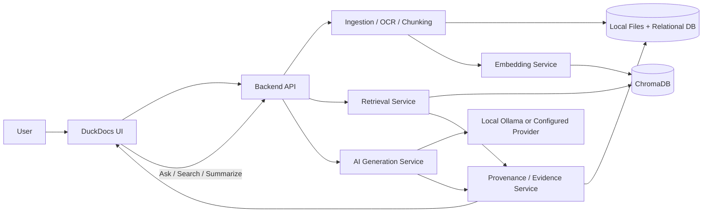

# 01 — Vision

**Product:** DuckDocs  
**Document type:** Product vision  
**Status:** Draft for team review  
**Audience:** Product, engineering, design, security, leadership  
**Related docs:** [02_PRODUCT_REQUIREMENTS.md](./02_PRODUCT_REQUIREMENTS.md) · [08_SYSTEM_ARCHITECTURE.md](./08_SYSTEM_ARCHITECTURE.md) · [25_PRIVACY.md](./25_PRIVACY.md) · [40_FUTURE_ROADMAP.md](./40_FUTURE_ROADMAP.md)

---

## 1. Purpose

This document defines **why DuckDocs exists**, **what it must become**, and **which principles are non-negotiable** before any implementation begins.

It is the north star for product requirements, architecture, UX, AI behavior, and security decisions. When tradeoffs conflict, this vision takes precedence over convenience, speed of delivery, or vendor defaults.

---

## 2. Scope

### In scope

- Product mission, positioning, and value proposition
- Core principles that constrain architecture and UX
- Target users and the jobs DuckDocs exists to do
- Success definition for a production-quality local-first platform
- Explicit non-goals that protect product focus
- Long-term product direction that architecture must accommodate from day one

### Out of scope

- Detailed functional requirements (see [03_FUNCTIONAL_REQUIREMENTS.md](./03_FUNCTIONAL_REQUIREMENTS.md))
- System and AI architecture details (see [08](./08_SYSTEM_ARCHITECTURE.md)–[12](./12_PROVIDER_ARCHITECTURE.md))
- API, database, UI component specs (see later docs)
- Implementation timelines, sprint plans, or staffing models

---

## 3. Goals

| Goal ID | Goal | Why it matters |
|--------|------|----------------|
| G-01 | Deliver a **privacy-first, local-by-default** document intelligence platform | Users must trust that documents never leave their machine unless they explicitly opt in |
| G-02 | Make every AI output **evidence-grounded and verifiable** | AI without traceability is not trustworthy for serious document work |
| G-03 | Support a **broad, extensible document surface area** | Real libraries mix PDFs, Office files, images, code, and structured data |
| G-04 | Remain **AI-provider agnostic** | Users must not be locked into one model vendor or forced onto the cloud |
| G-05 | Feel like a **polished commercial product** | Trust, adoption, and daily use depend on craft, clarity, and reliability |
| G-06 | Design for **review, comparison, annotation, and citation workflows** | Search and chat alone are not enough for professional document intelligence |

---

## 4. Product Mission

> DuckDocs turns a local document library into a private, evidence-aware intelligence workspace — so people can search, ask, extract, annotate, compare, and export with full confidence that every answer can be traced back to the source.

DuckDocs is not “ChatGPT for PDFs.”  
It is a **document intelligence platform** where retrieval, provenance, review, and export are first-class, and the model is a grounded assistant — never the source of truth.

---

## 5. Problem Statement

Serious document work today is fractured:

1. **Documents live in silos** — folders, email attachments, shared drives, scans, spreadsheets, and code dumps rarely sit in one searchable system.
2. **Search is keyword-blind** — filename search and Ctrl+F miss meaning, synonyms, and cross-document relationships.
3. **AI tools are opaque** — many products answer fluently but cannot show *where* the answer came from, or they silently send content to third parties.
4. **Review workflows are missing** — annotations, comments on cited passages, version diffs, and citation-aware exports are afterthoughts or absent.
5. **Privacy is compromised by default** — cloud-first AI document tools force a trust decision users should not have to make for sensitive material.

DuckDocs exists to close that gap with a **local-first, evidence-first** product that professionals can actually trust.

---

## 6. Product Positioning

### What DuckDocs is

A **fully local, privacy-first AI Document Intelligence Platform** that lets users:

- ingest and organize a personal or team-local knowledge library
- search semantically across heterogeneous file types
- ask grounded questions with clickable citations
- summarize and extract structured insights with evidence
- annotate, comment, compare, and export with provenance preserved

### What DuckDocs is not

| Not this | Why we reject it |
|----------|------------------|
| A thin chat wrapper over uploaded PDFs | Chat without library, evidence, and review is a demo, not a product |
| A cloud SaaS that “happens” to support local mode | Local-first is the default path, not a checkbox |
| A general knowledge chatbot | The model must not invent facts outside retrieved evidence |
| An enterprise DMS replacement (initially) | Focus is intelligence over documents, not full records management |
| A research paper RAG tutorial | Production quality, modular subsystems, and review workflows are mandatory |

### Positioning statement

For professionals who work with sensitive or high-stakes documents and need answers they can verify, DuckDocs is the local AI document intelligence platform that grounds every response in evidence — unlike cloud AI chat tools that prioritize fluency over provenance and privacy.

---

## 7. Core Product Principles

These principles are architectural constraints, not marketing language.

### 7.1 Privacy First

- No telemetry
- No analytics
- No hidden background network calls
- No forced cloud dependency
- No external inference unless explicitly configured by the user
- No data leakage by design or accident

Users retain ownership of documents and generated outputs.

**Implication:** Networking is opt-in. Provider calls are explicit. Persistence is local. Defaults favor isolation.

### 7.2 Evidence First

Every AI-generated answer, summary, extraction, or comparison result must be traceable to source evidence at the finest available granularity:

- document → page → paragraph → line → character range
- OCR/image content → bounding boxes
- tables → row/column cell references

**Implication:** The evidence/provenance subsystem is core infrastructure, not a UI flourish.

### 7.3 Local-Only by Default

Default installation must work completely locally:

- local model inference (Ollama + Gemma 3 1B)
- local vector search (ChromaDB)
- local storage and file handling
- local OCR and document processing

Cloud providers are optional configuration, never required for a working product.

### 7.4 AI Provider Agnostic

Chat/generation and embeddings are separate, swappable provider concerns.

- Default: Ollama / Gemma 3 1B
- Optional: OpenAI, Anthropic, Gemini, OpenAI-compatible endpoints, future providers

Changing providers must require **configuration only**, not code changes.

### 7.5 Grounded AI Behavior

The LLM is never treated as a source of truth by itself.

Pipeline shape:

1. Retrieve relevant evidence first  
2. Pass only relevant context to the model  
3. Attach citations to every response  
4. Decline clearly when evidence is insufficient  

### 7.6 Review-Ready from Day One

Inline annotations, comments on cited passages, citation-aware exports, side-by-side comparison, citation graphs, confidence visualization, and version diffs are **not optional polish**. Architecture, data model, APIs, and UI planning must accommodate them from the start — even if some ship in later phases.

### 7.7 Commercial Craft

DuckDocs must feel like a serious product: coherent information architecture, predictable performance, clear empty/error states, intentional motion, and a design system that supports dense document work without looking like a dashboard template.

---

## 8. Architecture Decisions (Vision-Level)

| Decision | Choice | Rationale |
|----------|--------|-----------|
| AD-V01 | Local-first default | Privacy and trust are the product’s primary differentiator |
| AD-V02 | Evidence/provenance as a first-class subsystem | Traceability cannot be bolted on after chat works |
| AD-V03 | Modular ingestion pipeline | Broad file-type support requires pluggable parsers, not a monolith |
| AD-V04 | Provider abstraction for chat and embeddings | Avoid vendor lock-in; keep local and cloud paths symmetric |
| AD-V05 | Separate vector store from relational store | Vectors optimize retrieval; relational models own provenance, versions, annotations |
| AD-V06 | Design for comparison, versioning, and citations early | These reshape the data model; deferring them creates rewrites |
| AD-V07 | Documentation before application code | Shared source of truth reduces thrash and ambiguous implementation |

### Alternatives rejected

| Alternative | Why rejected |
|-------------|--------------|
| Cloud-first with “privacy mode” | Inverts trust; privacy becomes an exception path |
| Single-vendor model lock-in | Fragile, expensive, and incompatible with local-first |
| Chat-only UX without library/evidence | Insufficient for professional verification workflows |
| Store only embeddings, discard layout/provenance | Breaks line-level citations, OCR boxes, and review features |
| Monolithic “do everything” service | Blocks independent scaling, testing, and future extraction of OCR/ingest workers |

---

## 9. Tradeoffs

| Tradeoff | We choose | We accept |
|----------|-----------|-----------|
| Privacy vs. convenience of managed AI | Privacy / local default | Users must install Ollama (or configure a provider) |
| Evidence fidelity vs. ingestion simplicity | Rich provenance metadata | Heavier pipeline, more complex chunk model |
| Broad format support vs. perfect fidelity everywhere | Modular parsers with graded fidelity | Some formats may have weaker layout/OCR quality initially |
| Provider flexibility vs. uniform quality | Abstraction layer | Answer quality varies by model; UX must expose that honestly |
| Design for future review features vs. ship chat faster | Architecture includes review surfaces early | Longer design phase before code |
| Local resource limits vs. large libraries | Practical local defaults | Very large corpora may need user-tuned hardware/settings |

---

## 10. Data Flow (Conceptual)

**Invariant:** Generated text never reaches the UI without an evidence payload (or an explicit “insufficient evidence” response).

---

## 11. Interfaces (Vision-Level)

DuckDocs exposes three primary user-facing interfaces and one configuration boundary:

| Interface | Role |
|-----------|------|
| **Library** | Upload, organize, preview, version, and browse documents |
| **Intelligence** | Semantic search, Q&A, summarization, extraction — always cited |
| **Review** | Annotations, comments, comparison, confidence, exports |
| **Settings** | Local paths, providers, models, OCR, privacy boundaries |

Subsystem interfaces (ingestion, OCR, retrieval, generation, provenance, export, etc.) are specified in architecture docs; the vision constraint is that they remain **modular, typed, and swappable**.

---

## 12. Constraints

| Constraint | Detail |
|------------|--------|
| C-01 | Default path must function with **zero cloud dependency** |
| C-02 | No telemetry, analytics, or silent outbound calls |
| C-03 | Stack: Next.js/React/TS frontend; FastAPI/Python backend; Ollama + ChromaDB; Docker Compose |
| C-04 | Answers must be grounded; ungrounded speculation is a product defect |
| C-05 | Evidence metadata must support page, paragraph, line, character, bbox, and table cell references |
| C-06 | Chat and embedding providers must be independently configurable |
| C-07 | Documentation suite is the implementation source of truth until superseded by approved revisions |
| C-08 | Product quality bar is commercial, not MVP/demo |

---

## 13. Risks

| Risk | Impact | Mitigation direction |
|------|--------|----------------------|
| Local hardware cannot run useful models | Poor answer quality; user churn | Clear hardware guidance; small default model; optional better local/cloud providers |
| OCR/layout fidelity gaps break citations | Trust collapse | Graded confidence UI; per-format fidelity matrix; bbox fallback |
| Over-scoping review features delays core RAG | Late value delivery | Architecture now; phased delivery later (see roadmap) |
| Provider abstraction leaks | Config changes require code | Strict provider interfaces and contract tests |
| Users treat fluent answers as truth | Misuse | UI emphasizes evidence; refuse when ungrounded |
| Large libraries degrade local performance | Frustration | Chunk budgets, incremental indexing, performance budgets in NFR doc |

---

## 14. Future Extensibility

The vision requires the architecture to grow into:

- richer inline annotation and collaborative review (still local or optional sync later)
- citation graphs across answers, chunks, and documents
- semantic + structural document comparison
- version lineage and citation/annotation diffs
- additional file types via ingestion plugins
- additional AI providers without core rewrites
- optional multi-user local/team deployments (without abandoning privacy defaults)

Extensibility is achieved through **stable domain models** (Document, Version, Chunk, Evidence, Annotation, Citation, Comparison, Export) and **plugin boundaries** (parsers, OCR, embedders, generators, exporters).

---

## 15. Target Users (Summary)

Full personas live in [05_USER_PERSONAS.md](./05_USER_PERSONAS.md). Vision-level audiences:

| Audience | Primary need |
|----------|--------------|
| Individual professionals | Private Q&A and search over personal document libraries |
| Researchers / analysts | Grounded synthesis with citations and exports |
| Legal / compliance-minded users | Traceability, version awareness, no data exfiltration |
| Engineers / technical writers | Code + docs + specs in one grounded workspace |
| Privacy-conscious teams | Local deployment with optional controlled providers |

---

## 16. Success Definition

DuckDocs succeeds when a new user can, on a default local install:

1. Add documents without creating a cloud account  
2. Search and ask questions with **clickable citations** that jump to the exact evidence  
3. Verify answers against the original document preview  
4. Annotate and export with provenance intact (as features come online per roadmap)  
5. Switch or configure providers without code changes  
6. Confirm via settings and network behavior that **nothing leaves the machine unless they opted in**

Qualitative success: reviewers describe it as a product they would trust with real work — not a prototype.

---

## 17. Non-Goals (Current Vision Horizon)

- Becoming a full enterprise document management / records system
- Replacing Microsoft Office / Google Docs as an editor of record
- Training or fine-tuning foundation models inside DuckDocs
- Silent multi-tenant SaaS with shared cloud storage
- Real-time collaborative editing of source documents (annotations/comments are in scope; becoming a Word clone is not)
- Guaranteeing perfect OCR or layout fidelity for every obscure format on day one

---

## 18. Open Questions

| ID | Question | Owner | Needed by |
|----|----------|-------|-----------|
| OQ-V01 | Single-user local default vs. multi-user local accounts in v1? | Product + Security | Before PRD freeze |
| OQ-V02 | Which OCR engine is the default (e.g., Tesseract vs. alternatives)? | AI + Platform | Before pipeline design freeze |
| OQ-V03 | How aggressive should “refuse when ungrounded” be for summaries vs. Q&A? | Product + AI | Before AI architecture freeze |
| OQ-V04 | License model (open-source core vs. dual license) — does it affect telemetry claims and distribution? | Leadership | Before public release planning |
| OQ-V05 | Maximum practical library size for default local hardware guidance? | Platform | Before NFR freeze |

---

## 19. Acceptance Criteria

This vision document is accepted when:

- [ ] Product, engineering, design, and security agree that **privacy-first** and **evidence-first** are non-negotiable defaults
- [ ] Team agrees DuckDocs is positioned as a **document intelligence platform**, not a chat demo
- [ ] Non-goals are acknowledged so scope disputes can be resolved against this doc
- [ ] Architecture work is authorized to proceed with review/comparison/versioning modeled early
- [ ] Open questions are assigned owners or explicitly deferred with dates
- [ ] Subsequent docs ([02](./02_PRODUCT_REQUIREMENTS.md)+) can be written without redefining mission or principles

---

## 20. Cross-References

| Topic | Document |
|-------|----------|
| Product requirements | [02_PRODUCT_REQUIREMENTS.md](./02_PRODUCT_REQUIREMENTS.md) |
| Functional requirements | [03_FUNCTIONAL_REQUIREMENTS.md](./03_FUNCTIONAL_REQUIREMENTS.md) |
| Non-functional requirements | [04_NON_FUNCTIONAL_REQUIREMENTS.md](./04_NON_FUNCTIONAL_REQUIREMENTS.md) |
| Personas & journeys | [05](./05_USER_PERSONAS.md)–[06](./06_USER_JOURNEYS.md) |
| System & AI architecture | [08](./08_SYSTEM_ARCHITECTURE.md)–[12](./12_PROVIDER_ARCHITECTURE.md) |
| Privacy & security | [24_SECURITY.md](./24_SECURITY.md) · [25_PRIVACY.md](./25_PRIVACY.md) |
| Roadmap | [40_FUTURE_ROADMAP.md](./40_FUTURE_ROADMAP.md) |

---

## Document Control

| Field | Value |
|-------|-------|
| Version | 0.1.0 |
| Last updated | 2026-07-18 |
| Authors | DuckDocs Architecture Team |
| Review state | Pending team review |
| Next document | [02_PRODUCT_REQUIREMENTS.md](./02_PRODUCT_REQUIREMENTS.md) |
