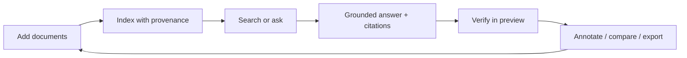
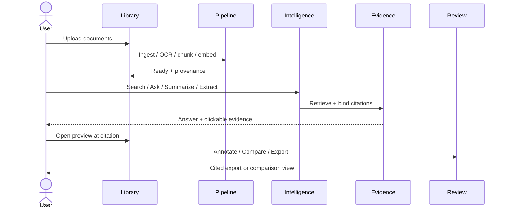

# 02 — Product Requirements

**Product:** DuckDocs  
**Document type:** Product Requirements Document (PRD)  
**Status:** Draft for team review  
**Audience:** Product, engineering, design, security, QA  
**Upstream:** [01_VISION.md](./01_VISION.md)  
**Downstream:** [03_FUNCTIONAL_REQUIREMENTS.md](./03_FUNCTIONAL_REQUIREMENTS.md) · [04_NON_FUNCTIONAL_REQUIREMENTS.md](./04_NON_FUNCTIONAL_REQUIREMENTS.md) · [07_FEATURE_SPECIFICATION.md](./07_FEATURE_SPECIFICATION.md)

---

## 1. Purpose

This PRD translates the DuckDocs vision into **product requirements** a team can review, prioritize, and build against.

It defines:

- what the product must deliver for users
- which capabilities are mandatory vs. phased
- product rules that constrain AI, privacy, and UX behavior
- release-oriented requirement groups (not sprint tickets)

Detailed functional decomposition lives in [03](./03_FUNCTIONAL_REQUIREMENTS.md). Feature-level UX and behavior live in [07](./07_FEATURE_SPECIFICATION.md).

---

## 2. Scope

### In scope

- Product objectives and success metrics
- Capability requirements across Library, Intelligence, Review, and Settings
- Input type coverage and ingestion expectations
- Evidence, annotation, comparison, versioning, and export requirements
- AI grounding and provider-configuration product rules
- Release phasing (what must be architected now vs. shipped later)
- Explicit exclusions and dependency assumptions

### Out of scope

- API schemas and endpoint catalogs → [15_API_SPECIFICATION.md](./15_API_SPECIFICATION.md)
- Database schemas → [13_DATABASE_DESIGN.md](./13_DATABASE_DESIGN.md)
- Component inventory and design tokens → [19](./19_COMPONENT_LIBRARY.md)–[20](./20_DESIGN_SYSTEM.md)
- Docker/ops runbooks → [29](./29_DOCKER_ARCHITECTURE.md)–[30](./30_DEPLOYMENT.md)
- Test case matrices → [35_TESTING_STRATEGY.md](./35_TESTING_STRATEGY.md)

---

## 3. Goals

| Goal ID | Product goal | Maps to vision |
|--------|--------------|----------------|
| PG-01 | Users can build and manage a **local document library** with preview and version awareness | G-01, G-03 |
| PG-02 | Users can **semantically search**, ask questions, summarize, and extract with **citations** | G-02, G-05 |
| PG-03 | Users can **verify** every AI output against source evidence in the document preview | G-02 |
| PG-04 | Users can **annotate**, comment on evidence, compare documents/versions, and export cited results | G-06 |
| PG-05 | Default install works **fully offline/local** with Ollama + Gemma 3 1B + ChromaDB | G-01, G-04 |
| PG-06 | Users can configure **chat and embedding providers independently** without code changes | G-04 |
| PG-07 | Product behavior never treats the LLM as an ungrounded source of truth | G-02 |

---

## 4. Product Overview

### 4.1 One-sentence product

DuckDocs is a local-first AI document intelligence platform for searching, questioning, summarizing, extracting, annotating, comparing, and exporting documents with full evidence traceability.

### 4.2 Primary surfaces

| Surface | User job |
|---------|----------|
| **Library** | Upload, organize, preview, version, and inspect documents |
| **Intelligence** | Search, Q&A, summarize, extract — always with evidence |
| **Review** | Annotate, comment, compare, inspect confidence, export |
| **Settings** | Providers, models, paths, OCR, privacy boundaries |

### 4.3 Core value loop

---

## 5. Users and Jobs To Be Done

Full personas: [05_USER_PERSONAS.md](./05_USER_PERSONAS.md). Jobs that drive requirements:

| JTBD ID | Job | Outcome |
|---------|-----|---------|
| J-01 | Keep a private library of mixed documents searchable by meaning | Find relevant material without keyword guesswork |
| J-02 | Ask a question and get an answer tied to sources | Trust and verify before acting |
| J-03 | Summarize long or multi-doc sets with citations | Faster comprehension without losing provenance |
| J-04 | Extract structured fields/facts from documents | Reusable structured outputs with evidence links |
| J-05 | Highlight, note, and comment on passages (including AI-cited ones) | Human review layered on AI assistance |
| J-06 | Compare two documents or two versions | Spot content, semantic, annotation, and citation changes |
| J-07 | Export answers/summaries with embedded citations | Share verifiable outputs outside DuckDocs |
| J-08 | Stay local unless I choose otherwise | No surprise network or cloud use |

---

## 6. Capability Requirements

Requirements use IDs `PR-xxx`. Priority:

- **P0** — Must ship for a credible first production release of the core product
- **P1** — Must be designed and modeled now; may ship shortly after P0
- **P2** — Architected now; delivery can follow on the roadmap

### 6.1 Library and ingestion

| ID | Priority | Requirement |
|----|----------|-------------|
| PR-L01 | P0 | Users can upload one or many documents into a local library |
| PR-L02 | P0 | System accepts the supported input types listed in §8 (with modular parsers for extension) |
| PR-L03 | P0 | Each upload creates a document record with stable document ID and initial version |
| PR-L04 | P0 | Users can preview ingested documents in-app |
| PR-L05 | P0 | Users can view ingestion/indexing status (queued, processing, ready, failed) with actionable errors |
| PR-L06 | P0 | Users can organize documents (at minimum: list, filter by type/status, rename, delete) |
| PR-L07 | P1 | Users can replace a document and create a new **version** linked to the same document lineage |
| PR-L08 | P1 | Users can browse version history for a document |
| PR-L09 | P0 | Original files are stored locally under user-configured or default data volumes |
| PR-L10 | P0 | Failed ingestions never silently succeed; partial failures are visible |

### 6.2 Intelligence (search, Q&A, summarize, extract)

| ID | Priority | Requirement |
|----|----------|-------------|
| PR-I01 | P0 | Users can run **semantic search** across the library (or selected documents) |
| PR-I02 | P0 | Users can ask natural-language questions and receive **grounded answers** |
| PR-I03 | P0 | Users can generate summaries for a document or selected set |
| PR-I04 | P1 | Users can request structured extraction (fields/entities/tables) with evidence links |
| PR-I05 | P0 | Every AI response includes citations to supporting evidence units |
| PR-I06 | P0 | If evidence is insufficient, the system clearly states it cannot answer from available sources |
| PR-I07 | P0 | Users can inspect retrieved chunks and retrieval metadata for a response |
| PR-I08 | P0 | Intelligence operations use only retrieved/selected context for generation (RAG-first) |
| PR-I09 | P1 | Users can scope Intelligence to one document, a selection, or the whole library |
| PR-I10 | P0 | Search and Q&A results link into document preview at the cited location |

### 6.3 Evidence and traceability

| ID | Priority | Requirement |
|----|----------|-------------|
| PR-E01 | P0 | Citations support the finest available granularity for the source type (doc/page/paragraph/line/char; bbox for OCR; cell for tables) |
| PR-E02 | P0 | Citations are clickable and navigate preview to the evidence region |
| PR-E03 | P0 | Evidence units capture the mandatory metadata fields listed in §9 |
| PR-E04 | P0 | Responses preserve links to **document version** used at generation time |
| PR-E05 | P0 | UI can show confidence-related signals available from retrieval/OCR/source (even if visualization is minimal in P0) |
| PR-E06 | P1 | Users can open a dedicated evidence inspector for a response |
| PR-E07 | P2 | System data model supports future **citation graphs** (answer ↔ chunks ↔ documents ↔ related passages) |

### 6.4 Annotation and review

| ID | Priority | Requirement |
|----|----------|-------------|
| PR-R01 | P1 | Users can highlight passages and attach **inline annotations** |
| PR-R02 | P1 | Users can **comment** on AI-cited evidence regions and manual selections |
| PR-R03 | P1 | Annotations/comments persist against document version and character/bbox anchors |
| PR-R04 | P2 | Annotation comparison is available when comparing documents/versions |
| PR-R05 | P1 | Review UI shows evidence confidence indicators (similarity/retrieval/OCR/completeness as available) |

### 6.5 Comparison and versioning

| ID | Priority | Requirement |
|----|----------|-------------|
| PR-C01 | P1 | Users can compare two documents side by side |
| PR-C02 | P1 | Users can compare two versions of the same document |
| PR-C03 | P1 | Comparison supports content diff at minimum |
| PR-C04 | P2 | Comparison supports semantic comparison (meaning-level change summary with evidence) |
| PR-C05 | P2 | Comparison surfaces annotation and citation differences when present |
| PR-C06 | P1 | Version lineage is queryable (history + parent/child relationships) |

### 6.6 Export

| ID | Priority | Requirement |
|----|----------|-------------|
| PR-X01 | P1 | Users can export answers, summaries, and extractions **with embedded citations** |
| PR-X02 | P1 | Export architecture supports multiple formats; at least one clean human-readable format ships with P1 (e.g., Markdown or PDF) |
| PR-X03 | P2 | Additional formats (DOCX, HTML, JSON evidence bundle) via export plugins |
| PR-X04 | P0 | Exported artifacts remain local unless the user explicitly moves them |

### 6.7 Settings, providers, and privacy

| ID | Priority | Requirement |
|----|----------|-------------|
| PR-S01 | P0 | Default configuration uses local Ollama + Gemma 3 1B for generation and a local embedding path |
| PR-S02 | P0 | Users can configure optional providers: OpenAI, Anthropic, Gemini, OpenAI-compatible endpoints |
| PR-S03 | P0 | Chat/generation provider and embedding provider are **independently** configurable |
| PR-S04 | P0 | Provider changes require configuration only — no code changes |
| PR-S05 | P0 | Product performs **no telemetry, analytics, or hidden network calls** |
| PR-S06 | P0 | Any external/network AI call requires explicit user configuration and clear UI indication when active |
| PR-S07 | P0 | Users can view/edit local data paths and understand where files, DB, and vectors live |
| PR-S08 | P1 | Users can test provider connectivity from Settings without sending library documents unless explicitly included in the test |

### 6.8 Product quality bar

| ID | Priority | Requirement |
|----|----------|-------------|
| PR-Q01 | P0 | UX meets commercial polish expectations defined in vision (clear states, coherent IA, intentional motion) |
| PR-Q02 | P0 | Errors are actionable (ingestion failures, provider down, OCR low confidence, empty retrieval) |
| PR-Q03 | P0 | Empty states guide first-run: install/check Ollama, add documents, run first search/Q&A |

---

## 7. Product Rules (Normative)

These rules are product law. Violations are defects.

| Rule ID | Rule |
|---------|------|
| RULE-01 | The model is never the source of truth; retrieved evidence is |
| RULE-02 | No AI answer/summary/extraction ships to the UI without citations **or** an explicit insufficient-evidence declaration |
| RULE-03 | Default install must work with zero cloud accounts and zero mandatory outbound AI calls |
| RULE-04 | Network-using providers are opt-in and visibly indicated when in use |
| RULE-05 | No telemetry, analytics SDKs, or silent “phone home” behavior |
| RULE-06 | Deleting a document removes associated index data, vectors, and derived artifacts per retention policy in Privacy/Security docs |
| RULE-07 | Citations must navigate to the best available anchor (prefer line/char/bbox over document-only) |
| RULE-08 | Changing providers must not require redeploying custom code |
| RULE-09 | Review features (annotations, comparison, export, citation graph readiness) must not be blocked by irreversible early data-model choices |
| RULE-10 | When OCR or parsing confidence is low, the product must surface that uncertainty rather than hide it |

---

## 8. Supported Input Types

Ingestion must be **modular** so new types can be added without reworking core architecture.

### 8.1 Documents

PDF, DOC, DOCX, TXT, Markdown, RTF, ODT

### 8.2 Spreadsheets

XLS, XLSX, CSV, TSV, ODS

### 8.3 Presentations

PPT, PPTX, ODP

### 8.4 Images

PNG, JPG, JPEG, WEBP, TIFF, BMP, HEIC

### 8.5 Structured data

JSON, XML, YAML

### 8.6 Source code

Python, JavaScript, TypeScript, Java, C, C++, C#, Go, Rust, SQL, HTML, CSS

### 8.7 Other

EPUB

### 8.8 Fidelity expectation

| Tier | Meaning | Product expectation |
|------|---------|---------------------|
| Full layout | Page/line/bbox anchors reliable | PDF text layer, DOCX, TXT/MD, many code files |
| Structural | Sections/cells/headings reliable; fine line anchors best-effort | Spreadsheets, structured data, presentations |
| OCR-dependent | Anchors via OCR boxes + confidence | Scanned PDFs, images |
| Best-effort | Extract text; limited layout | Legacy/obscure Office variants |

P0 may ship with uneven fidelity across types, but the **pipeline and metadata model** must support all tiers. A fidelity matrix will live in [21_FILE_PROCESSING.md](./21_FILE_PROCESSING.md).

---

## 9. Mandatory Evidence Metadata

Each chunk or evidence unit must be able to capture:

| Field | Required when |
|-------|---------------|
| document ID | always |
| document name | always |
| document version | always |
| page number | paginated sources |
| section or heading | when detectable |
| paragraph number | when detectable |
| line start / line end | when detectable |
| character start / character end | when detectable |
| chunk ID | always |
| retrieval score | on retrieve |
| embedding ID | when embedded |
| OCR confidence | OCR-derived text |
| bounding box coordinates | OCR/image-derived |
| table row / column | table cells |

Product requirement: the UI can jump from an answer to the exact evidence used whenever anchors exist.

---

## 10. Architecture Decisions (Product-Level)

| ID | Decision | Rationale |
|----|----------|-----------|
| AD-P01 | Organize product into Library / Intelligence / Review / Settings | Matches user jobs; prevents chat-only IA |
| AD-P02 | Treat evidence metadata as mandatory product data, not optional debug info | Trust depends on it |
| AD-P03 | Phase delivery (P0/P1/P2) but **one domain model** | Avoids rewrite when annotations/compare/export land |
| AD-P04 | Independent chat vs embedding provider settings | Different cost/quality/privacy tradeoffs |
| AD-P05 | Graded format fidelity with honest UI | Broad format support without fake precision |
| AD-P06 | Insufficient-evidence responses are first-class UX | Prevents hallucinated authority |
| AD-P07 | Export and comparison are product capabilities, not afterthought scripts | Professional workflows require them |

### Alternatives rejected

| Alternative | Why rejected |
|-------------|--------------|
| Ship chat-only P0 with no citation navigation | Fails evidence-first promise |
| Require cloud account for “full” features | Violates local-first vision |
| Single “AI provider” setting for both chat and embeddings | Too coarse; blocks good local hybrid setups |
| Defer version IDs until “later” | Breaks citation stability and diffs |
| Support only PDF + TXT in the data model | Would force redesign for Office/images/code |

---

## 11. Tradeoffs

| Tradeoff | Choice | Consequence |
|----------|--------|-------------|
| Breadth of formats vs. equal quality | Support broad set; graded fidelity | Some types need OCR/best-effort labels |
| P0 speed vs. review features | P0 = library + grounded intelligence + evidence navigation; P1/P2 = deep review | Architecture still models Review early |
| Local default vs. best model quality | Local small model default | Users may configure stronger local/cloud models |
| Strict grounding vs. helpful chatty tone | Strict grounding | Occasional “I don’t know from sources” is preferred |
| Rich metadata vs. ingest speed | Capture rich provenance | Heavier CPU/time on ingest; progress UX required |

---

## 12. Data Flow (Product View)

---

## 13. Interfaces

### 13.1 User-facing

| Interface | Requirements served |
|-----------|---------------------|
| Library UI | PR-L* |
| Intelligence UI (search + grounded chat/tasks) | PR-I*, PR-E* |
| Document preview + highlight layer | PR-E*, PR-R* |
| Review UI (annotations, compare, confidence) | PR-R*, PR-C* |
| Export flows | PR-X* |
| Settings | PR-S* |

### 13.2 System boundaries (product-visible)

| Boundary | User-visible promise |
|----------|----------------------|
| Local persistence | Files, relational data, vectors stay on local volumes |
| Ollama / local model | Default generation path |
| Optional cloud providers | Only when configured; indicated in UI |
| OCR/processing workers | Background jobs with status in Library |

---

## 14. Constraints

| ID | Constraint |
|----|------------|
| PC-01 | Stack and deployment constraints from vision (Next.js, FastAPI, Ollama, ChromaDB, Docker Compose) |
| PC-02 | No mandatory cloud services for P0 |
| PC-03 | Gemma 3 1B via Ollama is the default generation model target |
| PC-04 | Requirements must remain implementable on a single-machine local deployment |
| PC-05 | Documentation suite is source of truth; this PRD does not override Vision principles |
| PC-06 | Security/Privacy docs may tighten but not weaken RULE-03–RULE-05 |

---

## 15. Release Phasing

### P0 — Trustworthy local intelligence

- Local install via Docker Compose
- Upload + ingest + preview for priority formats (exact priority list in Feature Spec / File Processing)
- Semantic search + grounded Q&A + summarization
- Clickable citations + preview navigation + chunk inspection
- Provider settings (local default + optional remote)
- No telemetry; privacy defaults enforced

### P1 — Review and share

- Inline annotations + comments on citations
- Document/version compare (content diff)
- Version history UX
- Structured extraction
- Citation-aware export (at least one format)
- Confidence visualization in Review/Intelligence

### P2 — Depth and graph

- Semantic comparison
- Annotation/citation comparison
- Citation graph views
- Additional export formats
- Expanded format fidelity and performance hardening
- Richer version diff (changed passages, citations, annotations)

Detailed sequencing: [40_FUTURE_ROADMAP.md](./40_FUTURE_ROADMAP.md).

---

## 16. Success Metrics

DuckDocs is not analytics-driven (no telemetry). Success is measured in **reviewable product outcomes** and optional local/self-reported checks:

| Metric | Target |
|--------|--------|
| First-run grounded Q&A | New local install → upload → cited answer without cloud config |
| Citation navigation | ≥ 95% of citations with anchors open correct region in preview (for full-layout sources) |
| Ungrounded refusal | Insufficient-evidence path works in evaluation set (see Testing Strategy) |
| Provider switch | Change chat or embedding provider via Settings only; smoke test passes |
| Privacy posture | Outbound network in default config limited to user-explicit actions (none for AI) |
| Review readiness | Domain model review checklist signed off before P0 schema freeze |

---

## 17. Risks

| Risk | Impact | Mitigation |
|------|--------|------------|
| P0 format matrix too wide | Slip / shallow quality | Prioritize formats in Feature Spec; keep parsers modular |
| Small local model weak answers | Perceived product failure | Strong retrieval + strict grounding + Settings guidance for larger models |
| Citation anchors wrong | Trust failure | Provenance tests; confidence labels; prefer conservative highlights |
| P1 review features starved | Architecture unused / debt | Schema and API stubs for annotations/versions in P0 |
| Users enable cloud without noticing | Privacy incident | Persistent provider indicator; confirmations for first remote use |
| Export citation quality poor | Unusable shares | Export uses same evidence objects as UI |

---

## 18. Future Extensibility

Product requirements assume growth into:

- plugin file types and exporters
- additional providers behind the same Settings model
- citation graphs and cross-document evidence clusters
- deeper comparison modes
- optional multi-user local deployments (without changing privacy defaults)
- richer extraction schemas and user-defined templates

Extensibility requirement: **PR-EXT01** — New file types, providers, and export formats must be addable through documented extension points without redesigning Library/Intelligence/Review IA.

---

## 19. Dependencies and Assumptions

| Assumption | If false |
|------------|----------|
| Users can run Docker Compose locally | Need native install path (roadmap) |
| Ollama can run Gemma 3 1B on target hardware | Need clearer HW tiers + CPU fallback guidance |
| ChromaDB suitable for local single-node vectors | Revisit vector layer in [14](./14_VECTOR_DATABASE.md) |
| Single-user local is acceptable for P0 | May need simple local auth earlier (see OQ) |

---

## 20. Open Questions

| ID | Question | Default for planning | Owner |
|----|----------|----------------------|-------|
| OQ-P01 | Single-user P0 vs. local user profiles? | Single-user P0 | Product + Security |
| OQ-P02 | P0 priority format shortlist for “ready” QA bar? | PDF, DOCX, TXT/MD, PNG/JPEG, CSV, TS/JS/PY | Product + Eng |
| OQ-P03 | Default embedding model local package? | Decide in Provider/AI architecture | AI Eng |
| OQ-P04 | First export format: Markdown vs PDF? | Markdown first, PDF next | Product + Design |
| OQ-P05 | Max upload size / library size guidance for P0? | Set in NFR | Platform |
| OQ-P06 | Are DOC/XLS/PPT (legacy) P0 or best-effort P1? | Best-effort after DOCX/XLSX/PPTX | Eng |

---

## 21. Acceptance Criteria

This PRD is accepted when:

- [ ] Vision goals G-01–G-06 are fully covered by PR-* requirements or explicit non-goals
- [ ] P0/P1/P2 phasing is agreed by Product + Engineering
- [ ] RULE-01–RULE-10 are accepted as normative
- [ ] Evidence metadata list is approved as mandatory for the domain model
- [ ] Input type list is approved as architectural scope (with fidelity tiers)
- [ ] Open questions have owners and planning defaults
- [ ] Functional Requirements ([03](./03_FUNCTIONAL_REQUIREMENTS.md)) can be written as testable shall-statements from this PRD

---

## 22. Cross-References

| Topic | Document |
|-------|----------|
| Vision | [01_VISION.md](./01_VISION.md) |
| Functional requirements | [03_FUNCTIONAL_REQUIREMENTS.md](./03_FUNCTIONAL_REQUIREMENTS.md) |
| Non-functional requirements | [04_NON_FUNCTIONAL_REQUIREMENTS.md](./04_NON_FUNCTIONAL_REQUIREMENTS.md) |
| Personas / journeys | [05](./05_USER_PERSONAS.md) · [06](./06_USER_JOURNEYS.md) |
| Feature specification | [07_FEATURE_SPECIFICATION.md](./07_FEATURE_SPECIFICATION.md) |
| Privacy / security | [24](./24_SECURITY.md) · [25](./25_PRIVACY.md) |
| Configuration / settings | [26](./26_CONFIGURATION.md) · [27](./27_SETTINGS.md) |
| Roadmap | [40_FUTURE_ROADMAP.md](./40_FUTURE_ROADMAP.md) |

---

## Document Control

| Field | Value |
|-------|-------|
| Version | 0.1.0 |
| Last updated | 2026-07-18 |
| Authors | DuckDocs Architecture Team |
| Review state | Pending team review |
| Previous | [01_VISION.md](./01_VISION.md) |
| Next | [03_FUNCTIONAL_REQUIREMENTS.md](./03_FUNCTIONAL_REQUIREMENTS.md) |
