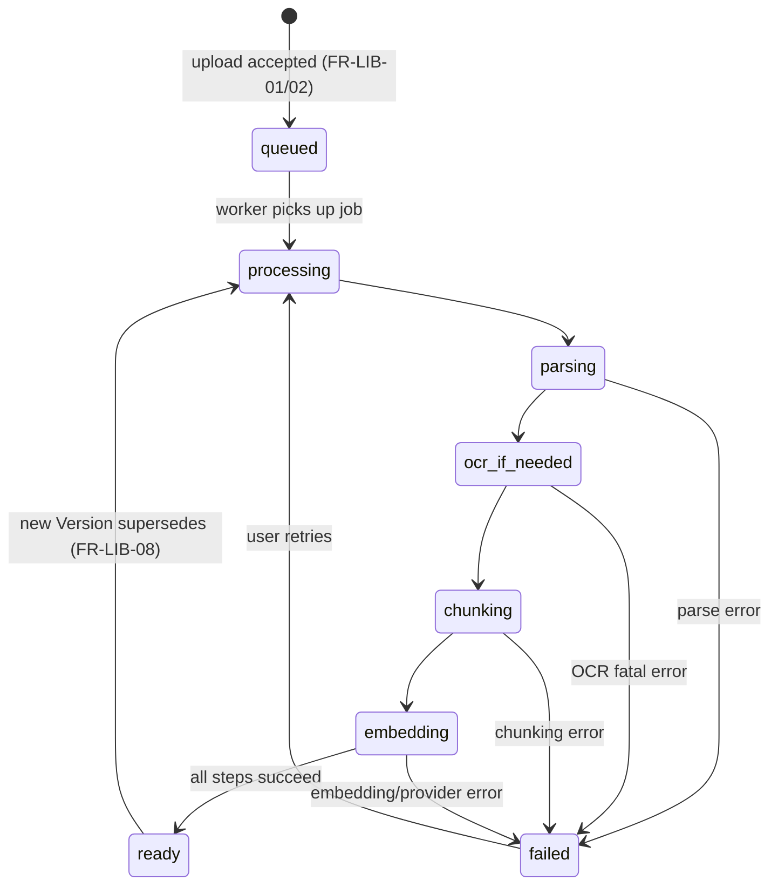
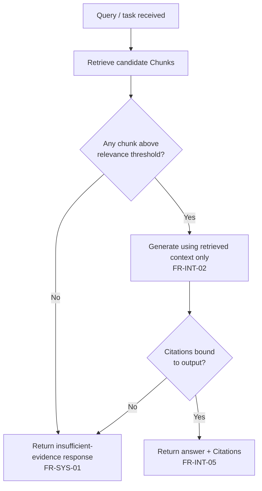
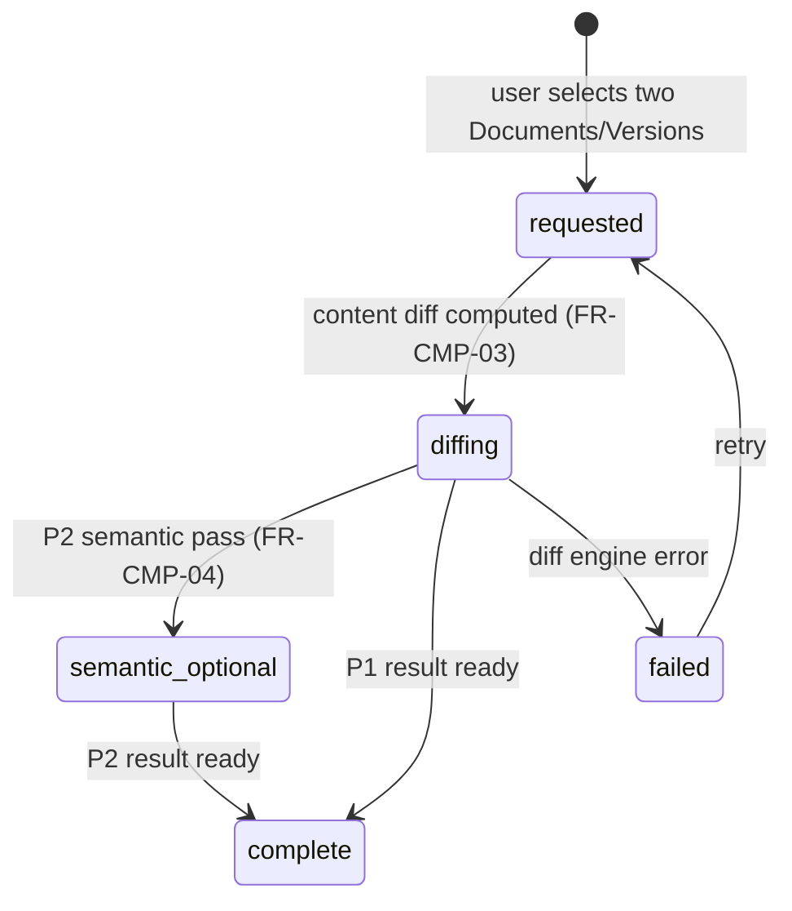
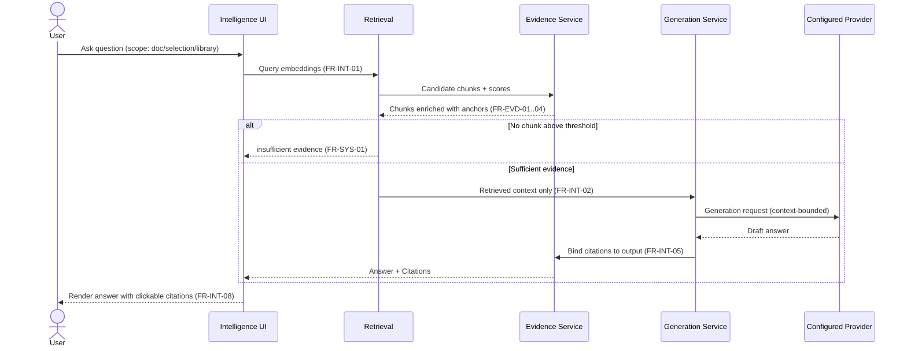
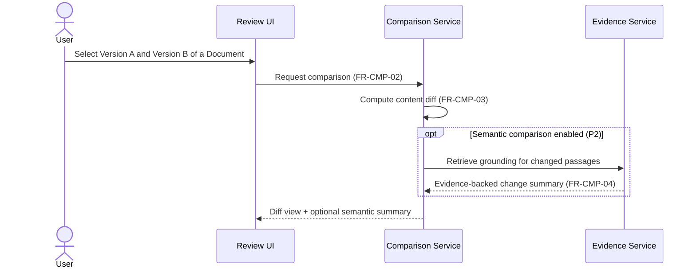

# 03 — Functional Requirements

**Product:** DuckDocs
**Document type:** Functional Requirements Specification
**Status:** Draft for team review
**Audience:** Engineering, QA, Product, AI/ML
**Upstream:** [01_VISION.md](./01_VISION.md) · [02_PRODUCT_REQUIREMENTS.md](./02_PRODUCT_REQUIREMENTS.md)
**Downstream:** [04_NON_FUNCTIONAL_REQUIREMENTS.md](./04_NON_FUNCTIONAL_REQUIREMENTS.md) · [07_FEATURE_SPECIFICATION.md](./07_FEATURE_SPECIFICATION.md) · [08_SYSTEM_ARCHITECTURE.md](./08_SYSTEM_ARCHITECTURE.md) · [13_DATABASE_DESIGN.md](./13_DATABASE_DESIGN.md)

---

## 1. Purpose

This document decomposes the product requirements in [02_PRODUCT_REQUIREMENTS.md](./02_PRODUCT_REQUIREMENTS.md) into **testable, implementation-ready functional requirements** — precise shall-statements engineering can build against and QA can verify without re-interpreting product intent.

Where the PRD says *what the product must do for users*, this document says *what the system must do, precisely, including edge cases, state transitions, and failure behavior*. Every requirement here traces to a `PR-*` requirement, a `RULE-*` product rule, or a vision goal `G-*`.

This is the contract between product intent and system behavior. It does not define UI layout (see [07_FEATURE_SPECIFICATION.md](./07_FEATURE_SPECIFICATION.md)), schemas (see [13_DATABASE_DESIGN.md](./13_DATABASE_DESIGN.md)), or non-functional targets (see [04_NON_FUNCTIONAL_REQUIREMENTS.md](./04_NON_FUNCTIONAL_REQUIREMENTS.md)).

---

## 2. Scope

### In scope

- Shall-statement functional requirements (`FR-*`) for every capability in PRD §6
- State models for documents, ingestion, evidence sufficiency, and comparison
- Functional behavior of the domain objects: Document, Version, Chunk, Evidence, Annotation, Citation, Comparison, Export
- Cross-cutting system behaviors that enforce `RULE-01`–`RULE-10`
- Functional data flow between subsystems (conceptual, not schema-level)
- Error and edge-case behavior required for a credible P0

### Out of scope

- UI copy, layout, and interaction detail → [07_FEATURE_SPECIFICATION.md](./07_FEATURE_SPECIFICATION.md)
- Performance/scale/security targets → [04_NON_FUNCTIONAL_REQUIREMENTS.md](./04_NON_FUNCTIONAL_REQUIREMENTS.md)
- Concrete database/vector schemas → [13_DATABASE_DESIGN.md](./13_DATABASE_DESIGN.md), [14_VECTOR_DATABASE.md](./14_VECTOR_DATABASE.md)
- REST/endpoint contracts → [15_API_SPECIFICATION.md](./15_API_SPECIFICATION.md)
- Test case matrices → [35_TESTING_STRATEGY.md](./35_TESTING_STRATEGY.md)

---

## 3. Goals

| Goal ID | Functional goal | Traces to |
|---------|------------------|-----------|
| FG-01 | Every product capability in PRD §6 has at least one verifiable `FR-*` statement | PG-01–PG-07 |
| FG-02 | Every `RULE-*` product rule is enforced by an explicit system behavior, not convention | RULE-01–RULE-10 |
| FG-03 | Domain objects (Document, Version, Chunk, Evidence, Annotation, Citation, Comparison, Export) have defined lifecycles before schema design starts | G-02, G-06, AD-V06 |
| FG-04 | State transitions for ingestion, evidence sufficiency, and comparison are unambiguous | PR-L05, PR-I06, RULE-02 |
| FG-05 | Functional requirements are phase-tagged (P0/P1/P2) consistent with PRD §15 | PRD §15 |

---

## 4. Domain Model Overview (Functional View)

The full data model lives in [13_DATABASE_DESIGN.md](./13_DATABASE_DESIGN.md). Functionally, eight objects anchor every requirement in this document:

| Object | Functional role |
|--------|------------------|
| **Document** | Stable logical entity a user uploads and manages; has exactly one current Version and a Version history |
| **Version** | Immutable snapshot of a Document's content at a point in time; the unit that ingestion, chunking, and citation bind to |
| **Chunk** | Retrievable unit of text/content derived from a Version during ingestion; carries positional metadata |
| **Evidence** | The materialized proof behind an AI output: one or more Chunks plus the metadata in PRD §9, bound to the Version used |
| **Annotation** | A user-authored highlight, note, or comment anchored to a Version at character/bbox/table-cell granularity |
| **Citation** | The pointer from a generated AI output (answer, summary, extraction) to one or more Evidence units |
| **Comparison** | A computed relationship between two Documents or two Versions of one Document |
| **Export** | A materialized, shareable artifact (Markdown/PDF/etc.) that embeds Citations and/or Annotations |

**Functional invariant:** Citation always resolves to Evidence; Evidence always resolves to a specific Version; a Version never has ambiguous provenance. This invariant underlies `FR-EVD-01`–`FR-EVD-06` below and is non-negotiable per vision §7.2.

---

## 5. Requirement Notation

- **ID format:** `FR-<DOMAIN>-<NN>` (e.g., `FR-LIB-03`). Domains: `LIB` (library/ingestion), `INT` (intelligence), `EVD` (evidence/citation), `REV` (annotation/review), `CMP` (comparison/versioning), `EXP` (export), `SET` (settings/providers), `SYS` (cross-cutting system behavior).
- **Priority:** `P0` / `P1` / `P2`, consistent with PRD §15 phasing.
- **Statement form:** "The system **shall** …" — testable, single-behavior, no design prescription beyond what's necessary for testability.
- **Traceability:** Each requirement lists the `PR-*`/`RULE-*`/`G-*` it satisfies.

---

## 6. Functional Requirements

### 6.1 Library & Ingestion (`FR-LIB-*`)

| ID | Priority | Requirement | Traces to |
|----|----------|-------------|-----------|
| FR-LIB-01 | P0 | The system shall accept one or more files per upload action and create one Document + initial Version per accepted file | PR-L01, PR-L03 |
| FR-LIB-02 | P0 | The system shall validate uploaded files against the supported-type list (PRD §8) and reject unsupported types with a specific reason before ingestion starts | PR-L02, PR-Q02 |
| FR-LIB-03 | P0 | The system shall assign each Document a stable, immutable document ID at creation time that never changes across Versions | PR-L03, RULE-07 |
| FR-LIB-04 | P0 | The system shall transition each Document/Version through the states `queued → processing → ready` or `queued → processing → failed`, and shall never expose a `ready` state until chunking and embedding succeed | PR-L05, PR-L10 |
| FR-LIB-05 | P0 | The system shall render a preview of a Document's current Version using the best available fidelity tier for its type (PRD §8.8) | PR-L04 |
| FR-LIB-06 | P0 | The system shall allow listing, filtering by type/status, renaming, and deleting Documents | PR-L06 |
| FR-LIB-07 | P0 | Deleting a Document shall cascade-delete its Versions, Chunks, embeddings, Evidence references, and derived Annotations/Citations that have no other valid anchor, per the retention policy in [25_PRIVACY.md](./25_PRIVACY.md) | RULE-06 |
| FR-LIB-08 | P1 | The system shall allow replacing a Document's content, creating a new Version linked to the same document ID while preserving prior Versions | PR-L07 |
| FR-LIB-09 | P1 | The system shall expose full Version history for a Document, ordered chronologically, with per-Version ingestion status | PR-L08 |
| FR-LIB-10 | P0 | The system shall store original uploaded files unmodified on local storage at a configurable path before any transformation occurs | PR-L09 |
| FR-LIB-11 | P0 | If any ingestion step (parse, OCR, chunk, embed) fails, the system shall mark the Version `failed` with a machine-readable error category and shall not mark any downstream step as complete | PR-L10, RULE-02 |
| FR-LIB-12 | P0 | Partial ingestion failure (e.g., OCR fails on 2 of 40 pages) shall be surfaced per-unit, not swallowed into an overall success state | PR-L10, RULE-10 |
| FR-LIB-13 | P1 | The system shall support ingestion via pluggable parser modules such that adding a new file type does not require changes to Library, Intelligence, or Review surfaces | PR-L02, RULE-09 |

### 6.2 Intelligence — search, Q&A, summarize, extract (`FR-INT-*`)

| ID | Priority | Requirement | Traces to |
|----|----------|-------------|-----------|
| FR-INT-01 | P0 | The system shall perform semantic search over embedded Chunks scoped to the whole library, a document set, or a single Document, per user selection | PR-I01, PR-I09 |
| FR-INT-02 | P0 | The system shall answer natural-language questions using only retrieved Chunks as generation context (RAG-first); the system shall never pass the full corpus or unretrieved content to the generation provider | PR-I02, PR-I08, RULE-01 |
| FR-INT-03 | P0 | The system shall generate summaries for a single Document or a user-selected set, citing the Chunks used | PR-I03 |
| FR-INT-04 | P1 | The system shall support structured extraction (fields/entities/tables) from a Document or set, with each extracted field linked to its source Evidence | PR-I04 |
| FR-INT-05 | P0 | Every generated answer, summary, or extraction shall include one or more Citations, or shall return the explicit insufficient-evidence response defined in `FR-SYS-01` | PR-I05, PR-I06, RULE-02 |
| FR-INT-06 | P0 | The system shall expose the retrieved Chunks, their retrieval scores, and retrieval parameters for any generated response on request | PR-I07 |
| FR-INT-07 | P1 | The system shall allow a user to change Intelligence scope (single document / selection / library) per query without re-uploading or re-indexing | PR-I09 |
| FR-INT-08 | P0 | Every citation rendered alongside a generated response shall be a navigable link that opens the Document preview at the cited location | PR-I10, PR-E02 |
| FR-INT-09 | P0 | The system shall record which Document Version was active for each Chunk used in a generation, so later Version changes do not silently alter historical answers | PR-E04 |

### 6.3 Evidence & Citation (`FR-EVD-*`)

| ID | Priority | Requirement | Traces to |
|----|----------|-------------|-----------|
| FR-EVD-01 | P0 | The system shall capture, for every Chunk, the finest available anchor from: document ID/name/version, page, section/heading, paragraph, line start/end, character start/end, chunk ID | PR-E01, PR-E03 |
| FR-EVD-02 | P0 | For OCR- or image-derived content, the system shall capture bounding box coordinates and OCR confidence per Chunk | PR-E01, RULE-10 |
| FR-EVD-03 | P0 | For table-derived content, the system shall capture row/column cell references per Chunk | PR-E01 |
| FR-EVD-04 | P0 | The system shall attach a retrieval score and embedding ID to each Chunk used in a retrieval-backed response | PR-I07 |
| FR-EVD-05 | P0 | Clicking/activating a Citation shall navigate the preview to the most precise anchor available for that Evidence, preferring line/char/bbox over document-only anchors | PR-E02, RULE-07 |
| FR-EVD-06 | P1 | The system shall provide a dedicated evidence inspector view listing all Evidence units behind a given response, with metadata and confidence signals | PR-E06 |
| FR-EVD-07 | P0 | The system shall surface available confidence-related signals (retrieval score, OCR confidence, parsing fidelity tier) alongside Evidence, even where visualization is minimal in P0 | PR-E05 |
| FR-EVD-08 | P2 | The domain model shall support querying relationships between an answer, its Chunks, source Documents, and related passages (citation graph) without a breaking schema change | PR-E07, AD-V06 |

### 6.4 Annotation & Review (`FR-REV-*`)

| ID | Priority | Requirement | Traces to |
|----|----------|-------------|-----------|
| FR-REV-01 | P1 | The system shall allow users to highlight a passage in a Document preview and attach a free-text Annotation | PR-R01 |
| FR-REV-02 | P1 | The system shall allow users to attach a comment to an AI-cited Evidence region or to a manual selection | PR-R02 |
| FR-REV-03 | P1 | Every Annotation/comment shall be anchored to a specific Version and to character-range and/or bounding-box coordinates, not to a mutable Document reference | PR-R03 |
| FR-REV-04 | P1 | The system shall surface available evidence confidence indicators (similarity, retrieval score, OCR confidence, completeness) in the Review UI wherever they exist | PR-R05 |
| FR-REV-05 | P2 | When comparing two Documents/Versions, the system shall be able to surface Annotation differences (added/removed/moved) between them | PR-R04, PR-C05 |
| FR-REV-06 | P1 | Deleting the Version an Annotation is anchored to shall not silently delete the Annotation; the system shall either re-anchor to the nearest valid Version or mark the Annotation orphaned and visible as such | RULE-06, RULE-09 |

### 6.5 Comparison & Versioning (`FR-CMP-*`)

| ID | Priority | Requirement | Traces to |
|----|----------|-------------|-----------|
| FR-CMP-01 | P1 | The system shall support side-by-side comparison of two distinct Documents | PR-C01 |
| FR-CMP-02 | P1 | The system shall support comparison of two Versions of the same Document | PR-C02 |
| FR-CMP-03 | P1 | Comparison shall, at minimum, compute and render a content-level diff (added/removed/changed text) | PR-C03 |
| FR-CMP-04 | P2 | Comparison shall optionally compute a semantic (meaning-level) change summary, itself grounded with Evidence from both sides | PR-C04, RULE-01 |
| FR-CMP-05 | P2 | Comparison shall surface Citation differences (a cited passage changed or was removed between Versions) when applicable | PR-C05 |
| FR-CMP-06 | P1 | The system shall expose queryable Version lineage: full history plus parent/child relationships for any Document | PR-C06 |

### 6.6 Export (`FR-EXP-*`)

| ID | Priority | Requirement | Traces to |
|----|----------|-------------|-----------|
| FR-EXP-01 | P1 | The system shall export answers, summaries, and extractions with Citations embedded as visible, navigable references in the exported artifact | PR-X01 |
| FR-EXP-02 | P1 | The system shall support at least one clean, human-readable export format at P1 (Markdown, per OQ-P04 default) via a pluggable exporter interface | PR-X02 |
| FR-EXP-03 | P2 | The system shall support additional export formats (DOCX, HTML, JSON evidence bundle) as exporter plugins without changing the export data contract | PR-X03, RULE-09 |
| FR-EXP-04 | P0 | Exported artifacts shall be written to local storage only; no export step shall transmit content externally unless the user explicitly invokes a sharing action outside DuckDocs' control | PR-X04, RULE-03 |
| FR-EXP-05 | P1 | Export shall reuse the same Evidence/Citation objects rendered in the UI, not a separately generated citation representation | Risk mitigation (PRD §17) |

### 6.7 Settings & Providers (`FR-SET-*`)

| ID | Priority | Requirement | Traces to |
|----|----------|-------------|-----------|
| FR-SET-01 | P0 | The system shall ship with a default configuration using local Ollama + Gemma 3 1B for generation and a local embedding model, requiring no account creation | PR-S01 |
| FR-SET-02 | P0 | The system shall allow configuring OpenAI, Anthropic, Gemini, and OpenAI-compatible endpoints as alternative chat/generation providers | PR-S02 |
| FR-SET-03 | P0 | The system shall allow configuring the chat/generation provider and the embedding provider independently, including mixed local/cloud combinations | PR-S03 |
| FR-SET-04 | P0 | Changing any provider configuration shall take effect through Settings alone, with no code change, redeploy, or rebuild required | PR-S04, RULE-08 |
| FR-SET-05 | P0 | The system shall make zero network calls for telemetry, analytics, or usage reporting, under any configuration | PR-S05, RULE-05 |
| FR-SET-06 | P0 | Any AI operation that would invoke a network-based provider shall be preceded by that provider being explicitly configured, and the UI shall visibly indicate when a network provider is active | PR-S06, RULE-04 |
| FR-SET-07 | P0 | The system shall display the resolved local paths for file storage, relational database, and vector store, and shall allow changing them within supported bounds | PR-S07 |
| FR-SET-08 | P1 | The system shall allow testing provider connectivity from Settings using a minimal synthetic request that does not include library document content unless the user explicitly opts in | PR-S08 |

### 6.8 Cross-Cutting System Behaviors (`FR-SYS-*`)

| ID | Priority | Requirement | Traces to |
|----|----------|-------------|-----------|
| FR-SYS-01 | P0 | When retrieval returns no Chunks above the system's relevance threshold, the system shall return an explicit "insufficient evidence" response instead of an ungrounded generation | RULE-01, RULE-02, PR-I06 |
| FR-SYS-02 | P0 | The system shall never send library document content to a network provider unless that provider is the one explicitly configured for the operation being performed | RULE-03, RULE-04 |
| FR-SYS-03 | P0 | The system shall log no personally identifying usage analytics to any local or remote destination beyond operational application logs needed for debugging (see [04_NON_FUNCTIONAL_REQUIREMENTS.md](./04_NON_FUNCTIONAL_REQUIREMENTS.md) §Observability) | RULE-05 |
| FR-SYS-04 | P0 | Every user-facing error (ingestion failure, provider unreachable, low OCR confidence, empty retrieval) shall include a specific, actionable message, not a generic failure string | PR-Q02 |
| FR-SYS-05 | P0 | First-run experience shall detect whether the default local provider (Ollama) is reachable and guide the user to install/start it if not, before implying the product is broken | PR-Q03 |
| FR-SYS-06 | P1 | The system shall be able to represent low-confidence output (OCR, parsing, retrieval) in every surface that displays the affected content, not only in Library | RULE-10 |

---

## 7. State Models

### 7.1 Document / Version ingestion lifecycle



**Rule enforced:** no state may report `ready` unless parsing, chunking, and embedding all completed (`FR-LIB-04`, `FR-LIB-11`). Partial per-unit failures (e.g., 2 pages OCR-failed) are recorded as unit-level flags on an otherwise `ready` Version (`FR-LIB-12`), not hidden.

### 7.2 Evidence sufficiency decision (every generation)



**Invariant:** there is no code path from `Q` to a rendered answer that bypasses either `IE` or `OUT`. This is the functional expression of vision §10's "Generated text never reaches the UI without an evidence payload."

### 7.3 Comparison result states



---

## 8. Architecture Decisions (Functional Level)

| ID | Decision | Rationale |
|----|----------|-----------|
| AD-F01 | Organize `FR-*` by domain object/capability, not by UI surface | Domain objects outlive UI layout changes; keeps requirements stable across redesigns |
| AD-F02 | Model the evidence-sufficiency decision (§7.2) as a mandatory pipeline gate, not a UI-layer check | Prevents any generation path from skipping citation binding, including future features |
| AD-F03 | Treat Annotation anchoring as Version-scoped, never Document-scoped | A Document's "current" content changes across Versions; anchors must survive that |
| AD-F04 | Specify Comparison and Export functional contracts now even though semantic compare and extra formats are P2 | Avoids the exact rewrite risk called out in vision AD-V06 |
| AD-F05 | Require partial-failure visibility at the unit level (`FR-LIB-12`) rather than binary success/fail per Version | Large multi-page/multi-sheet documents commonly have mixed fidelity; hiding this breaks trust |

### Alternatives rejected

| Alternative | Why rejected |
|-------------|---------------|
| Binary ingestion status only (success/fail) | Cannot represent realistic partial OCR/parse failures on large documents (RULE-10) |
| Document-scoped annotations that "float" across Versions | Breaks provenance guarantees the moment content shifts; contradicts evidence-first principle |
| Defer insufficient-evidence path to a prompt-engineering concern | Makes RULE-02 unenforceable by test; must be a pipeline-level gate |
| Single generic "compare" requirement without content/semantic split | Conflates P1 (must ship) and P2 (architected, later) work, weakening phase planning |

---

## 9. Tradeoffs

| Tradeoff | Choice | Consequence |
|----------|--------|-------------|
| Requirement granularity vs. document length | Fine-grained shall-statements per domain | Longer document, but each is independently testable and traceable |
| Strict evidence gate vs. perceived chattiness | Always gate on citations/insufficient-evidence | Some queries return "I don't have enough evidence" that a looser system would answer fluently but ungrounded |
| Partial-failure visibility vs. simple UX | Surface unit-level failures | More UI states to design (see FEATURE_SPECIFICATION §empty/error states) but preserves trust |
| Version-scoped annotations vs. simplicity of "just attach to the document" | Version-scoped with orphan handling | More edge cases (`FR-REV-06`) but anchors remain valid indefinitely |
| Designing Export/Comparison contracts pre-P1 | Contracts specified now | Slightly slower P0 functional spec; avoids P1 rewrite risk (AD-V06) |

---

## 10. Data Flow

### 10.1 Ask-and-verify flow (Q&A with citation)



### 10.2 Annotate-on-citation flow

```mermaid
sequenceDiagram
  actor U as User
  participant UI as Review UI
  participant PREV as Preview/Highlight Layer
  participant ANN as Annotation Service
  participant STORE as Relational Store

  U->>UI: Click citation from an answer
  UI->>PREV: Open preview at anchor (FR-EVD-05)
  U->>PREV: Select passage, add note/comment
  PREV->>ANN: Create Annotation anchored to Version+range (FR-REV-01..03)
  ANN->>STORE: Persist Annotation
  STORE-->>UI: Confirm; annotation visible on preview and in Review list
```

### 10.3 Compare-versions flow



---

## 11. Interfaces

Functional contracts only; concrete request/response schemas belong to [15_API_SPECIFICATION.md](./15_API_SPECIFICATION.md).

| Interface | Consumed by | Provides |
|-----------|-------------|----------|
| Ingestion pipeline interface | Library UI, background workers | Accepts a file + Document/Version context; returns state transitions per §7.1 |
| Retrieval interface | Intelligence UI | Accepts query + scope; returns ranked Chunks with anchors and scores |
| Generation interface | Intelligence UI | Accepts retrieved context + task type (Q&A/summarize/extract); returns text + citation bindings or insufficient-evidence signal |
| Evidence interface | Intelligence UI, Review UI, Export | Resolves a Citation or Chunk ID to full anchor metadata (PRD §9) |
| Annotation interface | Review UI | CRUD for Annotations anchored to Version + range |
| Comparison interface | Review UI | Accepts two Document/Version IDs; returns diff (+ optional semantic summary) |
| Export interface | Review UI, Export flows | Accepts a response/summary/extraction + format; returns a local artifact with embedded Citations |
| Provider configuration interface | Settings UI | CRUD for chat/embedding provider config; exposes connectivity test |

---

## 12. Constraints

| ID | Constraint |
|----|------------|
| FC-01 | No functional requirement may be satisfied by a code path that bypasses the evidence-sufficiency gate in §7.2 |
| FC-02 | No functional requirement may require a specific cloud provider to be reachable for P0 behavior |
| FC-03 | Domain object identity (document ID, version ID, chunk ID) must remain stable across all functional operations; no requirement may imply re-issuing IDs |
| FC-04 | Functional requirements must remain testable independent of which AI provider is configured (provider-agnostic test design) |

---

## 13. Risks

| Risk | Impact | Mitigation |
|------|--------|------------|
| Evidence-sufficiency gate implemented as a prompt instruction instead of a pipeline check | Silent hallucination risk; RULE-02 unenforceable | Require automated tests asserting no ungrounded output path exists (see Testing Strategy) |
| Partial-failure states skipped for P0 speed | Trust erosion when large/scanned documents partially fail | Keep `FR-LIB-12` in P0 scope explicitly; do not defer |
| Annotation anchoring drifts after re-ingestion of an edited Version | Citations/annotations point to wrong text | Anchors resolved by immutable Version, never by mutable Document; re-ingestion always creates a new Version |
| Comparison functional contract designed too early gets invalidated by real diff-engine constraints | Rework in P1 | Keep `FR-CMP-*` behavior-level, not diff-algorithm-level, in this document |

---

## 14. Future Extensibility

- `FR-EVD-08` (citation graph readiness) anticipates traversable relationships between answers, chunks, documents, and related passages without schema rewrite.
- Exporter and parser interfaces (`FR-LIB-13`, `FR-EXP-03`) are designed as plugin boundaries so P2 format/type growth doesn't touch core Library/Intelligence/Review logic (`RULE-09`).
- Comparison functional contract (§10.3) is written to accept a semantic pass as an additive step, not a replacement of the content-diff path — new comparison modes can be added the same way.
- Provider configuration interface (§11) is written generically enough to admit new providers (local or cloud) as configuration entries, consistent with `RULE-08`.

---

## 15. Open Questions

| ID | Question | Owner | Needed by |
|----|----------|-------|-----------|
| OQ-F01 | What relevance-threshold heuristic governs the "insufficient evidence" branch in §7.2 (fixed score vs. adaptive)? | AI Eng | Before retrieval implementation |
| OQ-F02 | Should orphaned Annotations (`FR-REV-06`) be hidden by default or shown with a distinct "orphaned" state? | Product + Design | Before Review UI spec |
| OQ-F03 | Does structured extraction (`FR-INT-04`) require user-defined schemas in P1, or fixed schemas only? | Product + AI | Before P1 planning |
| OQ-F04 | Is per-unit partial ingestion failure retryable at the unit level (e.g., re-OCR one page) or only at the Version level? | Eng | Before ingestion pipeline design |

---

## 16. Acceptance Criteria

This document is accepted when:

- [ ] Every `PR-*` in the PRD maps to at least one `FR-*` requirement or an explicit note that it is UI-only (deferred to Feature Spec)
- [ ] Every `RULE-*` maps to at least one `FR-SYS-*` or domain-specific `FR-*`
- [ ] State models in §7 are agreed by Engineering and AI as implementable
- [ ] Domain object functional roles (§4) are consistent with the intended [13_DATABASE_DESIGN.md](./13_DATABASE_DESIGN.md)
- [ ] Phase tags (P0/P1/P2) per requirement match PRD §15 phasing
- [ ] Open questions have owners

---

## 17. Cross-References

| Topic | Document |
|-------|----------|
| Vision | [01_VISION.md](./01_VISION.md) |
| Product requirements | [02_PRODUCT_REQUIREMENTS.md](./02_PRODUCT_REQUIREMENTS.md) |
| Non-functional requirements | [04_NON_FUNCTIONAL_REQUIREMENTS.md](./04_NON_FUNCTIONAL_REQUIREMENTS.md) |
| Personas / journeys | [05_USER_PERSONAS.md](./05_USER_PERSONAS.md) · [06_USER_JOURNEYS.md](./06_USER_JOURNEYS.md) |
| Feature specification | [07_FEATURE_SPECIFICATION.md](./07_FEATURE_SPECIFICATION.md) |
| System architecture | [08_SYSTEM_ARCHITECTURE.md](./08_SYSTEM_ARCHITECTURE.md) |
| Data model | [13_DATABASE_DESIGN.md](./13_DATABASE_DESIGN.md) |

---

## Document Control

| Field | Value |
|-------|-------|
| Version | 0.1.0 |
| Last updated | 2026-07-18 |
| Authors | DuckDocs Architecture Team |
| Review state | Pending team review |
| Previous | [02_PRODUCT_REQUIREMENTS.md](./02_PRODUCT_REQUIREMENTS.md) |
| Next | [04_NON_FUNCTIONAL_REQUIREMENTS.md](./04_NON_FUNCTIONAL_REQUIREMENTS.md) |
