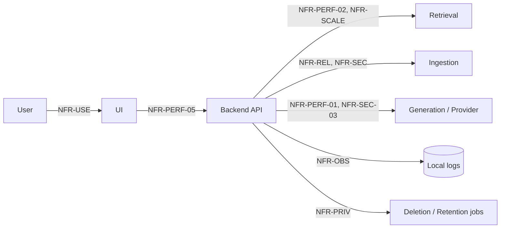

# 04 — Non-Functional Requirements

**Product:** DuckDocs
**Document type:** Non-Functional Requirements Specification
**Status:** Draft for team review
**Audience:** Engineering, Platform, Security, QA, Product
**Upstream:** [01_VISION.md](./01_VISION.md) · [02_PRODUCT_REQUIREMENTS.md](./02_PRODUCT_REQUIREMENTS.md) · [03_FUNCTIONAL_REQUIREMENTS.md](./03_FUNCTIONAL_REQUIREMENTS.md)
**Downstream:** [07_FEATURE_SPECIFICATION.md](./07_FEATURE_SPECIFICATION.md) · [08_SYSTEM_ARCHITECTURE.md](./08_SYSTEM_ARCHITECTURE.md) · [24_SECURITY.md](./24_SECURITY.md) · [25_PRIVACY.md](./25_PRIVACY.md) · [35_TESTING_STRATEGY.md](./35_TESTING_STRATEGY.md)

---

## 1. Purpose

This document defines **how well** DuckDocs must perform the functional behavior specified in [03_FUNCTIONAL_REQUIREMENTS.md](./03_FUNCTIONAL_REQUIREMENTS.md) — the quality attributes that determine whether a functionally correct system is also trustworthy, usable, and viable on real local hardware.

Non-functional requirements (`NFR-*`) are the primary defense against the single biggest risk called out in the vision: that a local-first, small-model default *feels* broken or untrustworthy even when it is functionally correct. Performance, reliability, security, and privacy targets here are what make "local by default" a credible product decision rather than a compromise.

---

## 2. Scope

### In scope

- Performance budgets for ingestion, retrieval, and generation
- Scalability targets for library size, document size, and concurrent operations
- Reliability, availability, and data-durability requirements
- Security requirements for data at rest/in transit and provider isolation
- Privacy requirements enforcing `RULE-03`–`RULE-06`
- Usability and accessibility baselines
- Maintainability, testability, and portability requirements
- Local observability/diagnostics (explicitly not telemetry)
- Compatibility (OS, browser, hardware tiers)

### Out of scope

- Functional correctness (see [03_FUNCTIONAL_REQUIREMENTS.md](./03_FUNCTIONAL_REQUIREMENTS.md))
- Detailed threat modeling → [24_SECURITY.md](./24_SECURITY.md)
- Detailed retention/deletion policy language → [25_PRIVACY.md](./25_PRIVACY.md)
- Deployment topology and ops runbooks → [29_DOCKER_ARCHITECTURE.md](./29_DOCKER_ARCHITECTURE.md), [30_DEPLOYMENT.md](./30_DEPLOYMENT.md)
- Concrete test plans and coverage matrices → [35_TESTING_STRATEGY.md](./35_TESTING_STRATEGY.md)

---

## 3. Goals

| Goal ID | Non-functional goal | Traces to |
|---------|----------------------|-----------|
| NG-01 | A default local install is usable on realistic consumer/prosumer hardware, not just high-end workstations | G-01, PC-04 |
| NG-02 | Performance degrades gracefully, and predictably, as library size grows, rather than failing silently | G-03, Risk (vision §13) |
| NG-03 | Every privacy/security guarantee in the vision is a testable, measurable requirement | G-01, RULE-03–RULE-06 |
| NG-04 | The product is operable and debuggable locally without any telemetry | C-02, RULE-05 |
| NG-05 | Quality attributes do not silently regress when providers are swapped | G-04, AD-P04 |

---

## 4. Requirement Notation

- **ID format:** `NFR-<CATEGORY>-<NN>`. Categories: `PERF` (performance), `SCALE` (scalability), `REL` (reliability), `SEC` (security), `PRIV` (privacy), `USE` (usability/accessibility), `MAINT` (maintainability), `PORT` (portability/compatibility), `OBS` (observability/diagnostics).
- Each requirement specifies a **target**, a **measurement method**, and a **priority** (P0/P1/P2), consistent with PRD phasing.
- Targets are defined for the **default local configuration** (Ollama + Gemma 3 1B + ChromaDB) unless otherwise noted; cloud-provider configurations may exceed these targets but must not be required to meet them.

---

## 5. Performance (`NFR-PERF-*`)

| ID | Priority | Requirement | Target | Measurement |
|----|----------|-------------|--------|-------------|
| NFR-PERF-01 | P0 | Time-to-first-token for a grounded Q&A response on the default local model | ≤ 3s after retrieval completes, on a 4-core/16GB reference machine | Local benchmark harness, p50/p95 |
| NFR-PERF-02 | P0 | Retrieval latency for semantic search across a library of ≤ 5,000 chunks | ≤ 500ms p95 | Local benchmark harness |
| NFR-PERF-03 | P0 | Ingestion throughput for text-native formats (PDF text layer, DOCX, TXT/MD) | ≥ 1 MB/min sustained on reference machine | Ingestion pipeline timing logs |
| NFR-PERF-04 | P1 | Ingestion throughput for OCR-dependent formats (scanned PDF, images) | ≥ 3 pages/min on reference machine | OCR pipeline timing logs |
| NFR-PERF-05 | P0 | UI interaction responsiveness (navigation, filtering, opening preview) | ≤ 150ms perceived latency for cached/local operations | Frontend performance instrumentation (local-only, non-telemetric) |
| NFR-PERF-06 | P1 | Comparison (content diff) computation for two documents ≤ 50 pages | ≤ 2s p95 | Local benchmark harness |
| NFR-PERF-07 | P0 | Provider switch (Settings change) takes effect | Immediately for next request, no restart required | Manual + automated smoke test |

**Reference machine baseline:** 4 CPU cores, 16 GB RAM, no dedicated GPU required for the default model. This baseline anchors all P0 performance targets; hardware tiers and CPU-only fallback guidance are detailed further once OQ-N01 (below) is resolved.

---

## 6. Scalability (`NFR-SCALE-*`)

| ID | Priority | Requirement | Target |
|----|----------|-------------|--------|
| NFR-SCALE-01 | P0 | Library size the default local configuration must support without functional degradation | ≥ 2,000 documents / ≥ 100,000 chunks |
| NFR-SCALE-02 | P1 | Library size the system must support with explicit "large library" guidance (tuned settings, more RAM) | ≥ 20,000 documents / ≥ 1,000,000 chunks |
| NFR-SCALE-03 | P0 | Maximum single-document size supported without special configuration | ≥ 500 pages or ≥ 50 MB, whichever is more restrictive for the format |
| NFR-SCALE-04 | P1 | Concurrent ingestion jobs on the reference machine without blocking Intelligence queries | ≥ 2 concurrent ingestion jobs |
| NFR-SCALE-05 | P2 | Vector store and relational store scale independently — vector re-indexing must not require a relational schema migration and vice versa | N/A (architectural property, verified by design review) |

Beyond `NFR-SCALE-02`, DuckDocs requires explicit user-tuned hardware or a scale-out deployment path; this is an accepted tradeoff per vision §9 ("Local resource limits vs. large libraries").

---

## 7. Reliability & Availability (`NFR-REL-*`)

| ID | Priority | Requirement |
|----|----------|-------------|
| NFR-REL-01 | P0 | Ingestion failures shall be resumable/retryable without re-uploading the source file |
| NFR-REL-02 | P0 | A crash or restart of the backend during ingestion shall leave the affected Version in `failed` or `processing`-resumable state, never falsely `ready` |
| NFR-REL-03 | P0 | A provider outage (local Ollama down, cloud provider unreachable) shall degrade Intelligence features with a clear error, and shall not corrupt Library or Evidence data |
| NFR-REL-04 | P0 | All writes to the relational store (Document, Version, Annotation, Comparison, Export records) shall be transactional; partial writes shall not leave orphaned foreign keys |
| NFR-REL-05 | P1 | The system shall support local backup/restore of the full data volume (files + relational DB + vector store) as a documented, scriptable procedure |
| NFR-REL-06 | P0 | Docker Compose stack shall restart cleanly after host reboot without manual reconfiguration (`restart: unless-stopped` or equivalent policy) |
| NFR-REL-07 | P1 | Mean time to recover from a single-service crash (e.g., embedding worker) shall be ≤ 30s via container restart policy, without data loss for in-flight jobs beyond the current unit of work |

---

## 8. Security (`NFR-SEC-*`)

Full threat model lives in [24_SECURITY.md](./24_SECURITY.md); these are the baseline requirements that constrain that design.

| ID | Priority | Requirement |
|----|----------|-------------|
| NFR-SEC-01 | P0 | All backend services shall bind to localhost/private network interfaces by default; no service shall be exposed on a public interface without explicit user configuration |
| NFR-SEC-02 | P0 | Credentials/API keys for optional cloud providers shall be stored locally, encrypted at rest, and never logged in plaintext |
| NFR-SEC-03 | P0 | All outbound network calls (only possible when a cloud provider is configured) shall use TLS |
| NFR-SEC-04 | P0 | The system shall not embed any third-party analytics, crash-reporting, or telemetry SDK that performs network calls |
| NFR-SEC-05 | P1 | File uploads shall be validated (type sniffing, not just extension) before parsing, to reduce malicious-file parsing risk |
| NFR-SEC-06 | P1 | Dependencies (frontend and backend) shall be scanned for known vulnerabilities as part of CI |
| NFR-SEC-07 | P2 | If multi-user local deployment ships (per OQ-V01), authentication/authorization shall be required before any document access — no anonymous multi-user default |

---

## 9. Privacy (`NFR-PRIV-*`)

| ID | Priority | Requirement |
|----|----------|-------------|
| NFR-PRIV-01 | P0 | No document content, filename, or metadata shall be transmitted off-device except to a provider the user has explicitly configured for the specific operation in progress |
| NFR-PRIV-02 | P0 | Deleting a Document shall remove its files, chunks, embeddings, and cached derivatives within one background cleanup cycle (target: ≤ 60s), consistent with `RULE-06` |
| NFR-PRIV-03 | P0 | The system shall provide a user-visible, accurate statement of what data (if any) leaves the machine under the current configuration |
| NFR-PRIV-04 | P1 | Provider connectivity tests (`FR-SET-08`) shall default to sending no document content |
| NFR-PRIV-05 | P0 | No default configuration shall require a cloud account, sign-in, or license-check network call to function |

---

## 10. Usability & Accessibility (`NFR-USE-*`)

| ID | Priority | Requirement |
|----|----------|-------------|
| NFR-USE-01 | P0 | Core flows (upload → ask → verify) shall be completable by a first-time user without documentation, per the vision success definition (§16) |
| NFR-USE-02 | P0 | The web UI shall meet WCAG 2.1 AA for color contrast, keyboard navigation, and focus management on primary flows |
| NFR-USE-03 | P0 | Every async operation (ingestion, generation, comparison) shall have a visible loading/progress state; none shall appear frozen for > 1s without feedback |
| NFR-USE-04 | P0 | Error states shall be actionable per `FR-SYS-04`, not generic |
| NFR-USE-05 | P1 | The UI shall support responsive layouts down to a minimum supported viewport (defined in [20_DESIGN_SYSTEM.md](./20_DESIGN_SYSTEM.md)) |
| NFR-USE-06 | P1 | Motion/animation shall respect `prefers-reduced-motion` |

---

## 11. Maintainability & Testability (`NFR-MAINT-*`)

| ID | Priority | Requirement |
|----|----------|-------------|
| NFR-MAINT-01 | P0 | Ingestion parsers, OCR engines, embedders, and generation providers shall each implement a documented interface enabling unit testing in isolation (mocked boundaries) |
| NFR-MAINT-02 | P0 | Provider abstraction (chat/embedding) shall be covered by contract tests that run against every supported provider implementation, including local mocks for CI |
| NFR-MAINT-03 | P0 | Backend code shall maintain typed interfaces (Pydantic models) at every service boundary; no untyped dict-passing across module boundaries |
| NFR-MAINT-04 | P0 | Frontend code shall maintain typed interfaces (TypeScript + Zod validation) at every API boundary |
| NFR-MAINT-05 | P1 | Database schema changes shall go through Alembic migrations only; no manual schema drift |
| NFR-MAINT-06 | P1 | Core domain logic (evidence gating, citation binding) shall have automated tests asserting the invariants in [03_FUNCTIONAL_REQUIREMENTS.md](./03_FUNCTIONAL_REQUIREMENTS.md) §7.2 |

---

## 12. Portability & Compatibility (`NFR-PORT-*`)

| ID | Priority | Requirement |
|----|----------|-------------|
| NFR-PORT-01 | P0 | The default deployment shall run via Docker Compose on Windows, macOS, and Linux hosts with Docker Desktop/Engine installed |
| NFR-PORT-02 | P0 | The web UI shall support current-version evergreen browsers (Chrome, Edge, Firefox, Safari) |
| NFR-PORT-03 | P1 | The system shall run on both x86_64 and arm64 (e.g., Apple Silicon) hosts |
| NFR-PORT-04 | P2 | A native (non-Docker) install path may be added without changing the core service architecture |

---

## 13. Observability & Diagnostics (`NFR-OBS-*`)

Observability here means **local, user-owned diagnostics** — explicitly not telemetry. This distinction is load-bearing for `RULE-05` and must not be blurred in implementation.

| ID | Priority | Requirement |
|----|----------|-------------|
| NFR-OBS-01 | P0 | The system shall write structured application logs to local disk only, with configurable verbosity |
| NFR-OBS-02 | P0 | Logs shall never be transmitted off-device automatically |
| NFR-OBS-03 | P1 | The system shall support generating a local diagnostic bundle (logs + config, redacted of API keys/content) that the user can manually share for support, entirely opt-in and manually triggered |
| NFR-OBS-04 | P1 | Ingestion and generation pipelines shall emit timing metrics to local logs sufficient to reproduce the performance benchmarks in §5 |
| NFR-OBS-05 | P0 | No requirement in this section may be satisfied by an SDK that phones home; local file-based logging only |

---

## 14. Architecture Decisions (NFR-Driven)

| ID | Decision | Rationale |
|----|----------|-----------|
| AD-N01 | Define a fixed reference machine baseline for all P0 performance targets | Without a baseline, "fast enough" is unfalsifiable; local hardware varies widely |
| AD-N02 | Treat vector store and relational store as independently scalable (`NFR-SCALE-05`) | Matches vision AD-V05; prevents coupling that would force joint migrations |
| AD-N03 | Local diagnostic bundles are manual/opt-in, never automatic | Any automatic transmission — even "just logs" — would violate `RULE-05` in spirit |
| AD-N04 | Contract-test the provider abstraction against every supported provider (`NFR-MAINT-02`) | Prevents "works with Ollama, breaks with OpenAI" regressions that undermine G-04 |
| AD-N05 | Accessibility (WCAG 2.1 AA) is a P0 requirement, not deferred polish | Commercial craft goal (G-05) fails if the product excludes users at launch |

### Alternatives rejected

| Alternative | Why rejected |
|--------------|--------------|
| No fixed reference hardware; "reasonable modern machine" | Untestable; leads to disputed performance bugs |
| Opt-out (rather than opt-in) diagnostic reporting | Any default-on network behavior violates privacy-first principle |
| Defer accessibility to a post-launch pass | Retrofitting accessibility is more expensive and contradicts "commercial craft from day one" |
| Single combined store for vectors + relational data | Blocks independent scaling/backup and violates AD-V05 |

---

## 15. Tradeoffs

| Tradeoff | Choice | Consequence |
|----------|--------|-------------|
| Small local default model vs. answer quality | Accept modest quality ceiling for Gemma 3 1B default | Strong retrieval + strict grounding must compensate; Settings must make upgrading easy |
| Rich provenance capture vs. ingestion speed | Favor provenance | `NFR-PERF-03`/`04` are set conservatively rather than optimistically |
| Strict privacy (`NFR-OBS-*`) vs. easy remote debugging | Favor privacy; diagnostics are manual/local | Support workflows require the user to share a bundle themselves |
| Broad OS/browser support vs. narrower optimized target | Broad support (`NFR-PORT-*`) | More CI/test matrix surface area |
| WCAG AA now vs. faster P0 delivery | AA now | Slightly longer design/QA cycle per feature |

---

## 16. Data Flow

Non-functional requirements are cross-cutting rather than flow-specific; the diagram below shows where NFR categories attach to the functional flow from [03_FUNCTIONAL_REQUIREMENTS.md](./03_FUNCTIONAL_REQUIREMENTS.md) §10.1.

---

## 17. Interfaces

| Interface | NFR obligation |
|-----------|-----------------|
| Ingestion pipeline | Must emit timing metrics (`NFR-OBS-04`), be resumable (`NFR-REL-01`), validate file type before parse (`NFR-SEC-05`) |
| Retrieval interface | Must meet latency targets (`NFR-PERF-02`) at declared scale (`NFR-SCALE-01/02`) |
| Generation/provider interface | Must be swappable without regressing latency contracts disproportionately; must never leak content to non-configured providers (`NFR-PRIV-01`) |
| Settings/provider config interface | Must apply changes without restart (`NFR-PERF-07`) and store secrets encrypted (`NFR-SEC-02`) |
| Logging interface | Local-only sink; no network transport by default (`NFR-OBS-02`, `NFR-OBS-05`) |

---

## 18. Constraints

| ID | Constraint |
|----|------------|
| NC-01 | All P0 performance/scale targets are defined against the reference machine (§5); cloud-provider configurations may not be used to mask local-path deficiencies in P0 acceptance testing |
| NC-02 | No NFR may be met by introducing a network dependency that contradicts `RULE-03`–`RULE-05` |
| NC-03 | Accessibility, security, and privacy NFRs are P0 and may not be traded down for schedule without explicit leadership sign-off (per vision §12, C-08) |
| NC-04 | Performance instrumentation used to validate NFRs must itself be local-only (no third-party APM SaaS by default) |

---

## 19. Risks

| Risk | Impact | Mitigation |
|------|--------|------------|
| Reference machine baseline set too optimistically | P0 performance targets missed on real user hardware | Validate baseline against actual low/mid-tier hardware before freezing targets (ties to OQ-N01) |
| Rich evidence metadata capture slows ingestion below `NFR-PERF-03/04` | Users perceive product as slow | Profile ingestion pipeline early; consider async/background enrichment for non-blocking metadata |
| WCAG AA compliance discovered late in component build | Costly retrofit | Bake accessibility checks into component library work ([19_COMPONENT_LIBRARY.md](./19_COMPONENT_LIBRARY.md)) from the start |
| Local diagnostic bundles accidentally include content or secrets | Privacy incident despite good intent | Mandatory redaction step + manual review prompt before bundle is written |
| Large libraries (`NFR-SCALE-02`) degrade ungracefully rather than failing clearly | User frustration, support burden | Add explicit size-warning UX and tunable settings before hitting hard limits |

---

## 20. Future Extensibility

- Performance targets are defined per configuration (default local vs. cloud) so future providers/models can be benchmarked against the same harness without redefining methodology.
- `NFR-SCALE-05`'s independent scaling property anticipates a future distributed or multi-node vector store without relational schema impact.
- `NFR-PORT-04` (native install path) is scoped as additive, preserving the Docker Compose path as the reference implementation.
- Diagnostic bundle format (`NFR-OBS-03`) should be structured (versioned JSON/log schema) so future support tooling can parse it without redesign.

---

## 21. Open Questions

| ID | Question | Owner | Needed by |
|----|----------|-------|-----------|
| OQ-N01 | What is the actual minimum viable hardware tier for Gemma 3 1B via Ollama at acceptable latency, validated empirically? | AI + Platform | Before §5 targets are frozen |
| OQ-N02 | What quantitative bar defines "graceful degradation" beyond `NFR-SCALE-02` (explicit error vs. soft slowdown)? | Platform + Product | Before large-library UX design |
| OQ-N03 | Should diagnostic bundles be signed/checksummed to prevent tampering before sharing with support? | Security | Before P1 support tooling |
| OQ-N04 | What CI vulnerability-scanning tool and severity gate apply to `NFR-SEC-06`? | Platform | Before CI pipeline freeze |

---

## 22. Acceptance Criteria

This document is accepted when:

- [ ] Every P0 NFR has a stated target and measurement method
- [ ] Reference machine baseline (§5) is agreed by AI/Platform as realistic
- [ ] Security and Privacy NFRs are reviewed against [24_SECURITY.md](./24_SECURITY.md) and [25_PRIVACY.md](./25_PRIVACY.md) drafts once they exist, with no contradictions
- [ ] Accessibility target (WCAG 2.1 AA) is accepted as P0 by Design and Engineering
- [ ] Observability requirements are confirmed to introduce zero network transmission by default
- [ ] Open questions have owners

---

## 23. Cross-References

| Topic | Document |
|-------|----------|
| Vision | [01_VISION.md](./01_VISION.md) |
| Product requirements | [02_PRODUCT_REQUIREMENTS.md](./02_PRODUCT_REQUIREMENTS.md) |
| Functional requirements | [03_FUNCTIONAL_REQUIREMENTS.md](./03_FUNCTIONAL_REQUIREMENTS.md) |
| Feature specification | [07_FEATURE_SPECIFICATION.md](./07_FEATURE_SPECIFICATION.md) |
| System architecture | [08_SYSTEM_ARCHITECTURE.md](./08_SYSTEM_ARCHITECTURE.md) |
| Security / Privacy | [24_SECURITY.md](./24_SECURITY.md) · [25_PRIVACY.md](./25_PRIVACY.md) |
| Testing strategy | [35_TESTING_STRATEGY.md](./35_TESTING_STRATEGY.md) |

---

## Document Control

| Field | Value |
|-------|-------|
| Version | 0.1.0 |
| Last updated | 2026-07-18 |
| Authors | DuckDocs Architecture Team |
| Review state | Pending team review |
| Previous | [03_FUNCTIONAL_REQUIREMENTS.md](./03_FUNCTIONAL_REQUIREMENTS.md) |
| Next | [05_USER_PERSONAS.md](./05_USER_PERSONAS.md) |
