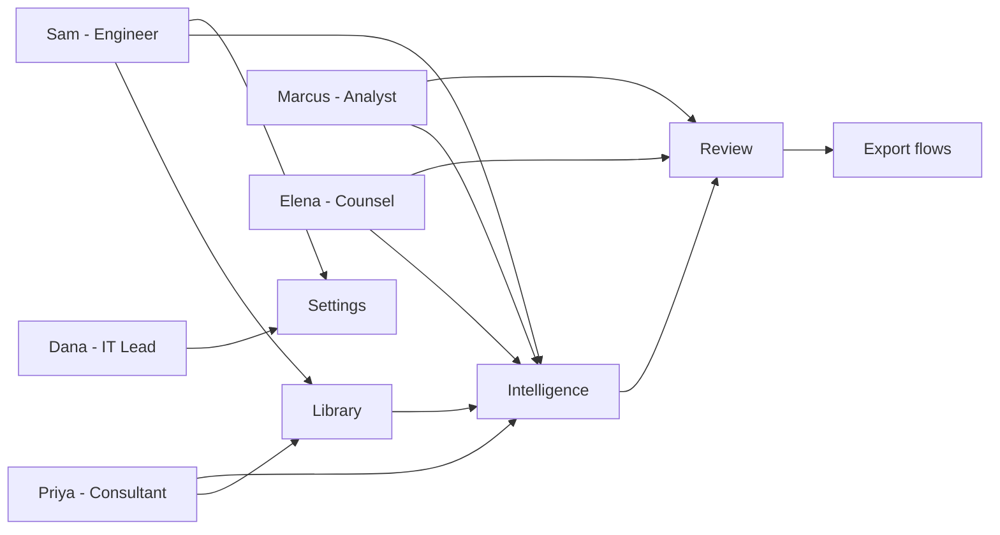

# 05 — User Personas

**Product:** DuckDocs
**Document type:** User Personas
**Status:** Draft for team review
**Audience:** Product, Design, Engineering, AI, Marketing
**Upstream:** [01_VISION.md](./01_VISION.md) · [02_PRODUCT_REQUIREMENTS.md](./02_PRODUCT_REQUIREMENTS.md)
**Downstream:** [06_USER_JOURNEYS.md](./06_USER_JOURNEYS.md) · [07_FEATURE_SPECIFICATION.md](./07_FEATURE_SPECIFICATION.md)

---

## 1. Purpose

This document defines the people DuckDocs is built for, in enough behavioral and contextual detail to resolve design and prioritization disputes without re-litigating "who is this for" in every planning cycle.

Personas here are derived directly from the target-user summary in [01_VISION.md](./01_VISION.md) §15 and the Jobs To Be Done in [02_PRODUCT_REQUIREMENTS.md](./02_PRODUCT_REQUIREMENTS.md) §5 — they are not invented independently of those documents. Every persona maps to at least one `JTBD` ID and influences at least one `PR-*` requirement's priority.

---

## 2. Scope

### In scope

- Primary personas representing the vision's target audiences
- Goals, pain points, technical comfort, and trust posture per persona
- Mapping from persona to Jobs To Be Done (`J-*`) and primary surfaces used
- An explicit anti-persona to protect scope discipline
- Persona-level success criteria that inform acceptance testing in later docs

### Out of scope

- Step-by-step task flows → [06_USER_JOURNEYS.md](./06_USER_JOURNEYS.md)
- Feature-level UX decisions → [07_FEATURE_SPECIFICATION.md](./07_FEATURE_SPECIFICATION.md)
- Market sizing, pricing, or go-to-market segmentation

---

## 3. Goals

| Goal ID | Persona-document goal | Traces to |
|---------|------------------------|-----------|
| PG-PER-01 | Every vision-level audience (vision §15) is represented by at least one concrete persona | G-01–G-06 |
| PG-PER-02 | Every JTBD (`J-01`–`J-08`) is claimed by at least one persona as a primary or secondary goal | PRD §5 |
| PG-PER-03 | Personas expose enough tension (privacy posture, technical comfort, urgency) to drive real prioritization tradeoffs | AD-V01–AD-V07 |
| PG-PER-04 | An anti-persona exists to make "who we are not building for first" explicit and reusable in scope debates | Vision §17 (Non-Goals) |

---

## 4. Persona Methodology (Architecture Decisions)

| ID | Decision | Rationale |
|----|----------|-----------|
| AD-PER01 | Derive personas from vision audiences + PRD JTBD rather than market research personas invented fresh | Keeps this document traceable and prevents drift from agreed product intent |
| AD-PER02 | Limit to five primary personas plus one anti-persona | Enough differentiation to drive decisions without diluting focus across too many "primary" users |
| AD-PER03 | Every persona includes an explicit privacy/trust posture field | Privacy-first is a core vision principle (§7.1); it must be a persona dimension, not assumed uniform |
| AD-PER04 | Every persona includes a technical-comfort field spanning non-technical to expert | DuckDocs spans consultants (lower technical comfort) to engineers (high technical comfort); UI/Settings must serve both |
| AD-PER05 | Personas are reviewed against JTBD coverage (§9) rather than left as free-floating narratives | Prevents "orphan" JTBDs with no owning persona, which would signal an unvalidated requirement |

### Alternatives rejected

| Alternative | Why rejected |
|--------------|--------------|
| Feature-driven personas (one persona per surface) | Conflates persona with UI navigation; personas should be job- and context-driven |
| Single "power user" composite persona | Hides real tension between privacy-cautious and convenience-seeking users |
| Omitting an anti-persona | Leaves scope disputes ("but a cloud-first user would want X") without a documented answer |

---

## 5. Primary Personas

### PERSONA-01 — Priya Shenoy, Independent Management Consultant

| Field | Detail |
|-------|--------|
| Role / context | Solo consultant advising mid-market clients; handles client contracts, financial statements, and market reports under NDA |
| Primary JTBD | J-01 (private searchable library), J-02 (grounded Q&A), J-07 (export with citations) |
| Secondary JTBD | J-08 (stay local) |
| Goals | Quickly find precedent language across past client engagements; answer a client question by citing the exact source paragraph; keep client data off any shared cloud account |
| Pain points today | Ctrl+F across folders; cannot remember which of 40 PDFs contains a specific clause; existing AI tools require uploading confidential documents to a third party |
| Technical comfort | Moderate — comfortable with SaaS tools, not with servers or config files |
| Privacy/trust posture | High sensitivity; NDA-bound; will not adopt any tool that "might" send client data externally without an explicit, visible switch |
| Primary surfaces | Library, Intelligence |
| Success looks like | Finds the right clause in under a minute, sees the exact citation, exports a client-ready summary with sources attached |
| Representative quote | "If I can't tell you exactly where an answer came from, I can't put it in front of a client." |

### PERSONA-02 — Marcus Chen, Policy Research Analyst

| Field | Detail |
|-------|--------|
| Role / context | Works at a think tank; synthesizes dozens of reports, datasets, and transcripts per project |
| Primary JTBD | J-03 (multi-doc summarization with citations), J-04 (structured extraction), J-06 (compare documents/versions) |
| Secondary JTBD | J-01, J-07 |
| Goals | Summarize 15 reports into a briefing with traceable sources; extract comparable data points across sources into a structured table; track how a policy document changed between drafts |
| Pain points today | Manual synthesis across long PDFs is slow; spreadsheet-based extraction loses source context; version tracking is ad hoc (filenames like `report_v3_final_FINAL.pdf`) |
| Technical comfort | High — comfortable with spreadsheets, some scripting, data tools |
| Privacy/trust posture | Medium-high; some sources are public, some are embargoed; wants provider choice per project, not a blanket policy |
| Primary surfaces | Intelligence, Review (compare) |
| Success looks like | A defensible, cited briefing produced in hours instead of days; extracted fields link back to exact source passages |
| Representative quote | "I need the summary to save me time, but I still need to defend every number in it." |

### PERSONA-03 — Elena Vasquez, Contracts & Compliance Counsel

| Field | Detail |
|-------|--------|
| Role / context | In-house counsel reviewing contracts, compliance filings, and policy documents; must justify decisions to auditors |
| Primary JTBD | J-02 (grounded Q&A), J-05 (annotate/comment on cited passages), J-06 (compare versions) |
| Secondary JTBD | J-08 |
| Goals | Ask "does this contract include an indemnification clause" and get a cited yes/no; annotate risky clauses for a review team; diff two contract versions to spot changed obligations |
| Pain points today | Manual redlining across versions; AI tools that "sound confident" but cannot be cited in a compliance memo; any suggestion that documents left the firm's network is a non-starter |
| Technical comfort | Low-to-moderate — expects consumer-grade simplicity, zero tolerance for ambiguous system state |
| Privacy/trust posture | Very high; regulatory exposure if data leaves the firm's control; needs to *prove* nothing left the machine, not just be told so |
| Primary surfaces | Intelligence, Review (annotation + compare) |
| Success looks like | Every AI statement about a contract is citable in a work product; version diffs are trustworthy enough to replace manual redlining for a first pass |
| Representative quote | "I don't need the AI to be clever. I need it to be checkable." |

### PERSONA-04 — Sam Okafor, Staff Engineer & Documentation Owner

| Field | Detail |
|-------|--------|
| Role / context | Maintains architecture docs, RFCs, runbooks, and a large internal codebase; onboarding new engineers is a recurring pain |
| Primary JTBD | J-01 (searchable library across docs + code), J-02 (grounded Q&A), J-08 (stay local) |
| Secondary JTBD | J-03, J-07 |
| Goals | Ask "how does the auth service handle token refresh" and get an answer citing the actual code/doc lines; keep proprietary source code off any cloud model by default; swap in a stronger local or self-hosted model when needed |
| Pain points today | Internal wikis go stale; grep across a monorepo doesn't understand intent; cloud AI coding assistants raise IP/security review flags |
| Technical comfort | Expert — will read logs, edit config, run Docker Compose directly |
| Privacy/trust posture | High for source code specifically; comfortable configuring providers explicitly, wants full transparency and control, not hand-holding |
| Primary surfaces | Library, Intelligence, Settings |
| Success looks like | Correct, line-cited answers about code/docs; trivial provider swapping (e.g., to a stronger local model) via config only |
| Representative quote | "Show me the line it came from and let me pick my own model — don't decide either of those for me." |

### PERSONA-05 — Dana Whitfield, IT Lead for a Privacy-Conscious Firm

| Field | Detail |
|-------|--------|
| Role / context | Evaluates and deploys internal tools for a boutique firm (legal, financial, or healthcare-adjacent); accountable for data-handling decisions |
| Primary JTBD | J-08 (stay local unless explicitly chosen), all others as an evaluator/gatekeeper rather than a daily heavy user |
| Secondary JTBD | J-02 |
| Goals | Verify, before rollout, that the product makes zero unwanted network calls; confirm deletion actually removes data; understand exactly where files/vectors/DB live on disk |
| Pain points today | Vendor privacy claims are marketing copy, not verifiable behavior; "local mode" in other tools is often a degraded second-class path |
| Technical comfort | High on infrastructure/networking; moderate on AI internals |
| Privacy/trust posture | Maximum; will inspect network traffic and file system before approving firm-wide use |
| Primary surfaces | Settings, (indirectly) all surfaces during evaluation |
| Success looks like | Can demonstrate zero outbound calls in default config; can point to exact local paths for files/DB/vectors; deletion is verifiably complete |
| Representative quote | "Don't tell me it's private. Show me the traffic capture." |

---

## 6. Anti-Persona

### ANTI-PERSONA-01 — "Jordan," the Cloud-First Convenience Seeker

| Field | Detail |
|-------|--------|
| Role / context | Wants the fastest possible AI chat experience over a few personal files; indifferent to where data is processed |
| Expectation mismatch | Expects zero-setup, always-cloud, maximum-fluency chat; frustrated by the idea of installing Ollama or reasoning about providers |
| Why not primary | Optimizing for this persona first would pull DuckDocs toward "cloud-first with a privacy checkbox" — the exact inversion vision §6 rejects |
| How DuckDocs still serves them | They *can* configure a cloud provider in Settings and get a fast, fluent experience — but that is a deliberate choice they make, not the default path they're funneled into |
| Product implication | Onboarding and defaults are optimized for Priya/Elena/Dana's trust bar, not Jordan's zero-friction bar; Jordan's friction (installing a local model) is an accepted tradeoff per vision §9 |

---

## 7. Persona Comparison Matrix

| Persona | Technical comfort | Privacy sensitivity | Primary surfaces | Dominant JTBD |
|---------|--------------------|----------------------|-------------------|----------------|
| Priya (Consultant) | Moderate | High | Library, Intelligence | J-01, J-02, J-07 |
| Marcus (Analyst) | High | Medium-High | Intelligence, Review | J-03, J-04, J-06 |
| Elena (Counsel) | Low-Moderate | Very High | Intelligence, Review | J-02, J-05, J-06 |
| Sam (Engineer) | Expert | High (code-specific) | Library, Intelligence, Settings | J-01, J-02, J-08 |
| Dana (IT Lead) | High (infra) | Maximum | Settings | J-08 |
| Jordan (anti-persona) | Low | Low | Intelligence only | J-02 (cloud-fluency biased) |

**Design implication:** the UI must serve Elena's low-moderate technical comfort in the same primary flows Sam uses with expert-level configuration underneath. This is why Settings is a distinct surface (PRD §4.2) rather than scattered inline configuration — see [07_FEATURE_SPECIFICATION.md](./07_FEATURE_SPECIFICATION.md) §Settings.

---

## 8. Tradeoffs

| Tradeoff | Choice | Consequence |
|----------|--------|-------------|
| Serve low-technical-comfort personas (Elena) vs. expert personas (Sam) with one UI | One UI, layered complexity (simple defaults, advanced Settings) | More design effort per surface; cannot ship a "config-file only" shortcut |
| Prioritize privacy-maximalist personas (Dana, Elena) over convenience-seekers (Jordan) | Privacy-maximalist defaults win | Slower first-run for users who just want cloud chat; accepted per vision positioning |
| Broad persona set (5) vs. narrow focus (1-2) | Five personas, ranked, not sequenced exclusively | Risk of diffuse prioritization; mitigated by phase mapping in §9 |

---

## 9. JTBD Coverage Map

| JTBD | Job | Primary owning persona(s) |
|------|-----|-----------------------------|
| J-01 | Keep a private searchable library | Priya, Sam |
| J-02 | Ask a question, get a cited answer | Priya, Elena, Sam |
| J-03 | Summarize multi-doc sets with citations | Marcus |
| J-04 | Extract structured fields with evidence | Marcus |
| J-05 | Highlight/annotate/comment on passages | Elena |
| J-06 | Compare documents/versions | Marcus, Elena |
| J-07 | Export cited answers/summaries | Priya, Marcus |
| J-08 | Stay local unless explicitly opted out | Sam, Dana |

**Coverage check:** all eight JTBDs from PRD §5 have at least one owning persona — satisfies `PG-PER-02`.

---

## 10. Data Flow — Persona to Surface Usage

This diagram informs the surface-level feature prioritization in [07_FEATURE_SPECIFICATION.md](./07_FEATURE_SPECIFICATION.md): Intelligence is the highest-traffic surface across nearly every persona and must be the most polished P0 experience.

---

## 11. Interfaces (Persona-Facing Implications)

| Persona expectation | Interface implication |
|----------------------|-------------------------|
| Elena needs proof, not promises | Settings must show live, human-readable provider/network status, not just a config screen |
| Dana needs to verify, not just configure | Settings/local paths must be inspectable and documented, not hidden in container internals |
| Sam wants full control with no hand-holding | Provider configuration must expose all supported providers and model parameters without artificial simplification |
| Priya/Elena need low-friction trust signals | Citation UI must be visually obvious and immediate, not buried behind a toggle |
| Marcus needs structure, not just prose | Extraction and comparison outputs must support structured (tabular) rendering, not paragraph-only summaries |

---

## 12. Constraints

| ID | Constraint |
|----|------------|
| PERC-01 | No persona's primary flow may require reading external documentation to complete a first-run task (`NFR-USE-01`) |
| PERC-02 | No feature may assume Sam-level technical comfort for a P0 flow used by Priya or Elena |
| PERC-03 | No feature may assume Elena-level need for hand-holding blocks Sam's ability to configure advanced settings directly |

---

## 13. Risks

| Risk | Impact | Mitigation |
|------|--------|------------|
| Design defaults drift toward the most technical persona (Sam) because engineers build first | Alienates Priya/Elena at launch | Require UX review against Elena's technical-comfort bar for every P0 surface |
| Anti-persona (Jordan) expectations leak into roadmap prioritization via support requests | Scope creep toward cloud-first convenience | Reference this document explicitly when triaging such requests |
| Personas become stale as real usage data (if ever informally observed) diverges | Misdirected design effort | Revisit personas at major milestone boundaries (tie to roadmap cadence) |

---

## 14. Future Extensibility

- If multi-user local deployments ship (OQ-V01), a new persona (e.g., "team administrator managing shared local library access") should be added without removing existing personas.
- If DuckDocs expands into regulated verticals (healthcare, finance) beyond legal/compliance, additional personas with sector-specific evidentiary requirements can be appended using the same template (§5 fields).
- The anti-persona pattern (§6) should be reused for any future audience the product deliberately does not optimize for first, to keep those decisions documented rather than implicit.

---

## 15. Open Questions

| ID | Question | Owner | Needed by |
|----|----------|-------|-----------|
| OQ-PER01 | Should Dana (IT Lead) be treated as a distinct buyer/evaluator persona separate from end-user personas for onboarding design? | Product + Design | Before onboarding flow design |
| OQ-PER02 | Do we need a dedicated "researcher in academia" persona distinct from Marcus (policy analyst), given citation-format expectations (e.g., footnotes)? | Product | Before Export format prioritization (OQ-P04) |
| OQ-PER03 | Is a sixth persona needed for regulated-industry compliance officers distinct from Elena (in-house counsel)? | Product | Before vertical expansion planning |

---

## 16. Acceptance Criteria

This document is accepted when:

- [ ] Every vision-level audience (vision §15) maps to a named persona
- [ ] Every JTBD (`J-01`–`J-08`) has an owning persona (§9 coverage table complete)
- [ ] The anti-persona is agreed as a scope-discipline tool, not a dismissed user segment
- [ ] Design and Engineering agree the persona comparison matrix (§7) should drive UI complexity layering
- [ ] Open questions have owners

---

## 17. Cross-References

| Topic | Document |
|-------|----------|
| Vision | [01_VISION.md](./01_VISION.md) |
| Product requirements | [02_PRODUCT_REQUIREMENTS.md](./02_PRODUCT_REQUIREMENTS.md) |
| Functional requirements | [03_FUNCTIONAL_REQUIREMENTS.md](./03_FUNCTIONAL_REQUIREMENTS.md) |
| Non-functional requirements | [04_NON_FUNCTIONAL_REQUIREMENTS.md](./04_NON_FUNCTIONAL_REQUIREMENTS.md) |
| User journeys | [06_USER_JOURNEYS.md](./06_USER_JOURNEYS.md) |
| Feature specification | [07_FEATURE_SPECIFICATION.md](./07_FEATURE_SPECIFICATION.md) |

---

## Document Control

| Field | Value |
|-------|-------|
| Version | 0.1.0 |
| Last updated | 2026-07-18 |
| Authors | DuckDocs Architecture Team |
| Review state | Pending team review |
| Previous | [04_NON_FUNCTIONAL_REQUIREMENTS.md](./04_NON_FUNCTIONAL_REQUIREMENTS.md) |
| Next | [06_USER_JOURNEYS.md](./06_USER_JOURNEYS.md) |
