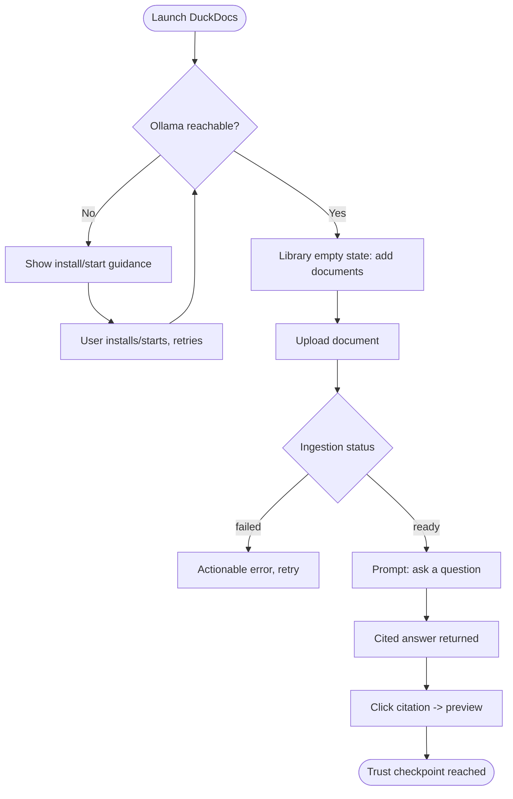
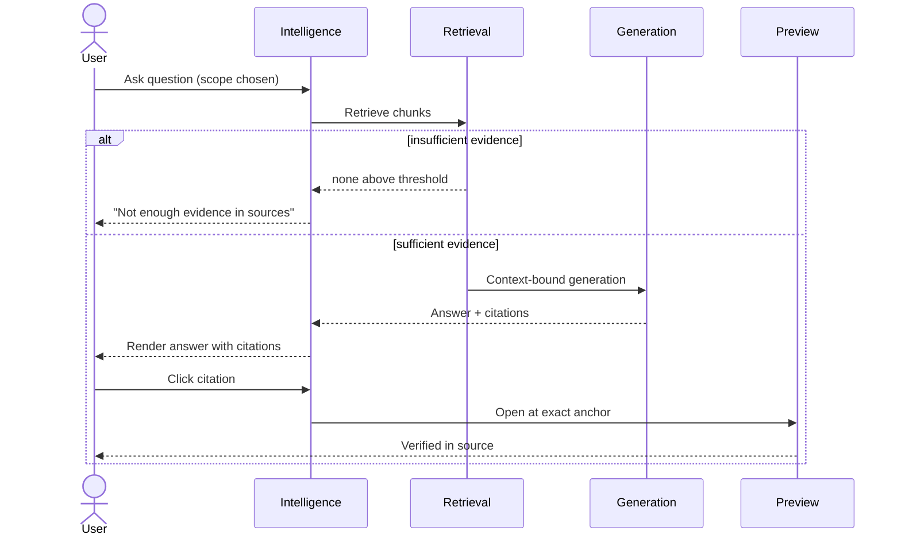
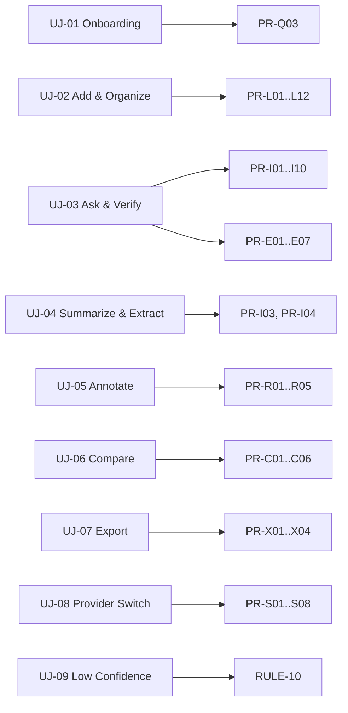

# 06 — User Journeys

**Product:** DuckDocs
**Document type:** User Journey Maps
**Status:** Draft for team review
**Audience:** Product, Design, Engineering, QA
**Upstream:** [01_VISION.md](./01_VISION.md) · [02_PRODUCT_REQUIREMENTS.md](./02_PRODUCT_REQUIREMENTS.md) · [05_USER_PERSONAS.md](./05_USER_PERSONAS.md)
**Downstream:** [07_FEATURE_SPECIFICATION.md](./07_FEATURE_SPECIFICATION.md)

---

## 1. Purpose

This document walks through the concrete, end-to-end paths personas take through DuckDocs — from first install to exporting a cited work product. Where [05_USER_PERSONAS.md](./05_USER_PERSONAS.md) defines *who*, this document defines *how they actually move through the system*, including the emotional stakes, decision points, and failure branches that a features-only list would miss.

Every journey here becomes a checklist for [07_FEATURE_SPECIFICATION.md](./07_FEATURE_SPECIFICATION.md): a feature is not "done" until every step of the journeys that depend on it is supportable end to end.

---

## 2. Scope

### In scope

- End-to-end journeys covering onboarding, ingestion, Q&A/verification, annotation/review, comparison, export, provider switching, and failure/low-confidence handling
- Emotional/trust checkpoints at each step (where users decide to trust or abandon)
- Mapping from journey steps to `PR-*`, `FR-*`, and persona IDs
- Edge-case and failure branches for each primary journey

### Out of scope

- Visual/interaction design of each step → [07_FEATURE_SPECIFICATION.md](./07_FEATURE_SPECIFICATION.md), [20_DESIGN_SYSTEM.md](./20_DESIGN_SYSTEM.md)
- Wireframes/mockups
- Detailed API sequencing beyond what's needed to justify a step exists → [03_FUNCTIONAL_REQUIREMENTS.md](./03_FUNCTIONAL_REQUIREMENTS.md) §10

---

## 3. Goals

| Goal ID | Journey-document goal | Traces to |
|---------|------------------------|-----------|
| JG-01 | Every primary JTBD (`J-01`–`J-08`) has at least one fully specified journey | PRD §5 |
| JG-02 | Every journey names its trust/verification checkpoint explicitly | G-02 (evidence-first) |
| JG-03 | Every journey has at least one documented failure/edge branch, not just the happy path | RULE-10, PR-Q02 |
| JG-04 | Journeys are traceable to the personas in [05_USER_PERSONAS.md](./05_USER_PERSONAS.md) driving them | PG-PER-02 |

---

## 4. Journey Notation

- **ID format:** `UJ-<NN>`.
- Each journey specifies: **persona**, **trigger**, **goal**, **steps** (numbered, with surface + requirement references), **trust checkpoint**, **success criteria**, **edge cases/failure branches**.
- Journeys are phase-tagged where a step depends on P1/P2 functionality; the P0 "happy path" is always identified.

---

## 5. UJ-01 — First-Run / Onboarding

**Persona:** Elena (low technical comfort), applicable to all
**Trigger:** First launch after `docker compose up`
**Goal:** Reach a working, cited first answer without leaving the app or reading external docs

| Step | Action | Surface | Requirement |
|------|--------|---------|--------------|
| 1 | Open DuckDocs in browser; system checks Ollama reachability | Intelligence (empty state) | FR-SYS-05 |
| 2 | If Ollama unreachable, show actionable guidance (install/start), not a generic error | Intelligence (empty state) | PR-Q03, FR-SYS-04/05 |
| 3 | User is prompted to add first document(s) | Library (empty state) | PR-L01 |
| 4 | Upload proceeds; ingestion status visible | Library | PR-L05, FR-LIB-04 |
| 5 | On ready, user is guided to ask a first question | Intelligence | PR-I02 |
| 6 | Answer returned with citation; user clicks citation | Intelligence → preview | FR-INT-08, FR-EVD-05 |
| 7 | Settings surfaced as "everything stayed local" confirmation | Settings | PR-S07, NFR-PRIV-03 |

**Trust checkpoint:** step 6 — the first citation click is the moment a skeptical user (Elena, Dana) decides whether to trust the product at all.

**Success criteria:** user reaches a cited answer and verifies it in preview within one sitting, with zero external documentation and zero forced account creation (`NFR-USE-01`, `NFR-PRIV-05`).

**Edge cases:**
- Ollama not installed → guidance links to install steps, offers "configure a different provider instead" path (`FR-SET-02`)
- No documents ingested yet and user tries to ask a question → Intelligence shows an explicit "add documents first" empty state, not a silent insufficient-evidence response
- Ingestion fails on the very first document → error must be specific enough that a non-technical user can act on it (`FR-SYS-04`)

---

## 6. UJ-02 — Add and Organize a Document Library

**Persona:** Priya, Sam
**Trigger:** User has a batch of documents to add (JTBD J-01)
**Goal:** Build a searchable, organized library with clear ingestion status

| Step | Action | Surface | Requirement |
|------|--------|---------|--------------|
| 1 | Select multiple files (mixed types) for upload | Library | PR-L01, PR-L02 |
| 2 | System validates types; rejects unsupported with reason | Library | FR-LIB-02 |
| 3 | Accepted files begin ingestion; per-file status shown (queued/processing/ready/failed) | Library | PR-L05, FR-LIB-04 |
| 4 | User filters library by type/status while ingestion continues in background | Library | PR-L06 |
| 5 | User previews a ready document to confirm fidelity | Library | PR-L04 |
| 6 | User renames/organizes as needed | Library | PR-L06 |

**Trust checkpoint:** step 3 — visible, honest per-file status (including partial failures) determines whether the user believes the library is reliable enough to depend on for later Q&A.

**Success criteria:** user can tell, at a glance, which documents are ready, which failed and why, without opening each file individually.

**Edge cases:**
- Large batch upload (50+ files) → progress must remain legible; no single frozen "processing" spinner covering all files (`NFR-USE-03`)
- Partial failure within a single large scanned PDF (some pages OCR-failed) → visible at the unit level, not hidden inside an otherwise "ready" status (`FR-LIB-12`)
- Duplicate filename uploaded → treated as a new Document unless the user explicitly chooses "replace as new version" (`FR-LIB-08`, P1)

---

## 7. UJ-03 — Ask a Grounded Question and Verify the Answer

**Persona:** Priya, Elena, Sam
**Trigger:** User has a specific question about the library or a document (JTBD J-02)
**Goal:** Get an answer that can be trusted because it can be checked

| Step | Action | Surface | Requirement |
|------|--------|---------|--------------|
| 1 | Choose scope: single document, selection, or whole library | Intelligence | PR-I09, FR-INT-01/07 |
| 2 | Ask question in natural language | Intelligence | PR-I02 |
| 3 | System retrieves candidate chunks | (system) | FR-INT-01 |
| 4 | If insufficient evidence, system says so explicitly | Intelligence | PR-I06, FR-SYS-01 |
| 5 | If sufficient, system generates an answer bound to citations | Intelligence | PR-I05, FR-INT-05 |
| 6 | User inspects retrieved chunks/metadata if curious or skeptical | Intelligence (evidence inspector) | PR-I07, FR-EVD-06 |
| 7 | User clicks a citation, jumps to exact location in preview | Preview | PR-I10, FR-EVD-05 |
| 8 | User confirms the answer is accurate against source, proceeds to use it | Intelligence/Review | — |

**Trust checkpoint:** step 4/5 — the honesty of the insufficient-evidence branch is what makes step 5's confident answers credible. If the system never says "I don't know," users stop trusting the times it says something confidently.

**Success criteria:** ≥ 95% of citations with anchors correctly navigate to the cited region (PRD §16 metric); insufficient-evidence responses occur exactly when evidence is genuinely absent, not as an overly cautious default.

**Edge cases:**
- Ambiguous question spanning many documents → scope selection (step 1) should let the user narrow rather than get a diluted answer
- Low-confidence OCR source cited → confidence indicator shown alongside the citation, not just a plain link (`RULE-10`, `FR-EVD-07`)
- Provider (local or cloud) unreachable mid-request → clear error, retry option, no silent fallback to an ungrounded response (`NFR-REL-03`)

---

## 8. UJ-04 — Summarize and Extract Across Multiple Documents

**Persona:** Marcus
**Trigger:** Needs a synthesized briefing or structured data pull across many sources (JTBD J-03, J-04)
**Goal:** Produce a cited synthesis or structured extraction faster than manual review, without losing traceability

| Step | Action | Surface | Requirement |
|------|--------|---------|--------------|
| 1 | Select a document set (e.g., 15 reports) | Intelligence | PR-I09 |
| 2 | Request a summary | Intelligence | PR-I03 |
| 3 | Review summary with per-claim citations | Intelligence | PR-I05, FR-INT-03 |
| 4 | Request structured extraction of specific fields (P1) | Intelligence | PR-I04, FR-INT-04 |
| 5 | Review extracted table; each cell links to source evidence | Intelligence | FR-INT-04 |
| 6 | Export summary/extraction with embedded citations | Export | PR-X01 |

**Trust checkpoint:** step 3/5 — synthesis across many sources is exactly where hallucination risk is highest; per-claim citation is what makes the output usable in Marcus's own briefing.

**Success criteria:** every claim in the summary and every extracted field traces to a specific source passage; nothing in the output is uncited prose.

**Edge cases:**
- Sources disagree on a fact → summary should surface the conflict with both citations rather than silently picking one (design implication for [07_FEATURE_SPECIFICATION.md](./07_FEATURE_SPECIFICATION.md))
- Extraction field not found in any source → field marked explicitly absent, not guessed or left blank without explanation

---

## 9. UJ-05 — Annotate and Comment on Cited Evidence

**Persona:** Elena
**Trigger:** Reviewing an AI answer or a document and needs to flag/note something for a team (JTBD J-05)
**Goal:** Layer human review on top of AI-cited evidence without losing anchoring

| Step | Action | Surface | Requirement |
|------|--------|---------|--------------|
| 1 | From an answer's citation, open the preview | Intelligence → Review | FR-EVD-05 |
| 2 | Select a passage (AI-cited or manually chosen) | Review / Preview | PR-R01 |
| 3 | Add a note or comment | Review | PR-R01/R02 |
| 4 | Annotation persists, anchored to Version + range | Review | PR-R03, FR-REV-03 |
| 5 | Later, view all annotations for a document in one place | Review | PR-R01 |
| 6 | If the underlying Version changes, see orphaned/re-anchored status clearly | Review | FR-REV-06 |

**Trust checkpoint:** step 4/6 — annotations must survive document evolution or be honestly flagged as orphaned; silently losing or mis-anchoring a compliance note is a serious trust failure for this persona.

**Success criteria:** annotations remain retrievable and correctly anchored across the life of a document; orphaned annotations are visible, not silently dropped.

**Edge cases:**
- Document re-ingested as a new Version after annotation → annotation either re-anchors or is flagged orphaned (`FR-REV-06`), never silently vanishes
- Overlapping annotations from the same passage → both retained, distinctly attributed

---

## 10. UJ-06 — Compare Two Versions of a Document

**Persona:** Elena, Marcus
**Trigger:** A contract or report has a new draft; needs to know what changed (JTBD J-06)
**Goal:** Understand what changed between versions with confidence, at content and (later) semantic level

| Step | Action | Surface | Requirement |
|------|--------|---------|--------------|
| 1 | Open Version history for a Document | Library/Review | PR-L08, PR-C06 |
| 2 | Select two Versions to compare | Review | PR-C02 |
| 3 | View content diff (added/removed/changed) | Review | PR-C03, FR-CMP-03 |
| 4 | (P2) View semantic change summary, itself evidence-backed | Review | PR-C04, FR-CMP-04 |
| 5 | (P2) View annotation/citation differences between versions | Review | PR-C05, FR-CMP-05 |

**Trust checkpoint:** step 3 — the diff must be accurate and complete; a missed change in a legal document is a serious failure mode for Elena specifically.

**Success criteria:** all textual changes between two versions are represented in the diff; nothing changed is silently omitted.

**Edge cases:**
- Versions of very different lengths (major rewrite) → diff view must remain legible, not an unreadable wall of red/green
- Comparing a Version against itself (user error) → clear "no differences" state, not a blank/broken view

---

## 11. UJ-07 — Export a Cited Answer or Summary

**Persona:** Priya, Marcus
**Trigger:** Needs to share a result outside DuckDocs (JTBD J-07)
**Goal:** Produce a shareable artifact that preserves provenance

| Step | Action | Surface | Requirement |
|------|--------|---------|--------------|
| 1 | From an answer/summary/extraction, choose "Export" | Intelligence/Review | PR-X01 |
| 2 | Choose format (Markdown at P1; more at P2) | Export | PR-X02, FR-EXP-02 |
| 3 | Exported file is written locally with citations embedded and navigable | Export | FR-EXP-01, FR-EXP-05 |
| 4 | User locates the artifact via the local path shown | Export/Settings | PR-X04, FR-EXP-04 |
| 5 | User shares the artifact through their own channel of choice | (outside DuckDocs) | — |

**Trust checkpoint:** step 3 — citations in the export must match what was shown in-app exactly; any divergence undermines the entire evidence-first premise the moment the artifact leaves DuckDocs' UI.

**Success criteria:** exported citations are legible and, where the target format allows, navigable; nothing is transmitted anywhere by the export action itself.

**Edge cases:**
- Export requested for a response that included an insufficient-evidence section → that section must be preserved verbatim in the export, not dropped for a "cleaner" look
- Unsupported export format requested (P0/P1 gap) → clear messaging on which formats are available now vs. planned (`OQ-P04`)

---

## 12. UJ-08 — Configure or Switch an AI Provider

**Persona:** Sam, Dana
**Trigger:** Wants to use a stronger local model or a specific cloud provider for chat and/or embeddings (JTBD J-08, plus quality-seeking)
**Goal:** Change providers with confidence about what will and won't happen afterward

| Step | Action | Surface | Requirement |
|------|--------|---------|--------------|
| 1 | Open Settings, view current chat/embedding provider config | Settings | PR-S07 |
| 2 | Select a new provider (local or cloud) for chat, embeddings, or both independently | Settings | PR-S03, FR-SET-03 |
| 3 | Optionally test connectivity before committing | Settings | PR-S08, FR-SET-08 |
| 4 | Save configuration; UI confirms active provider and network status | Settings | PR-S04, FR-SET-04/06 |
| 5 | Next Intelligence request uses new provider immediately, no restart | Intelligence | NFR-PERF-07 |

**Trust checkpoint:** step 3/4 — Dana specifically needs proof (not a promise) that a cloud provider is now active, including a persistent, visible indicator whenever a network provider is in use (`RULE-04`).

**Success criteria:** provider change requires configuration only; no code change, rebuild, or redeploy (`RULE-08`); UI accurately reflects the active provider at all times.

**Edge cases:**
- Cloud provider configured but unreachable (bad key, network down) → connectivity test surfaces this before it silently breaks Intelligence
- User switches embedding provider only → system clearly indicates that existing embeddings may need re-indexing, and does not corrupt or mismatch old vs. new-embedding chunks

---

## 13. UJ-09 — Handle a Low-Confidence or Failed Result

**Persona:** All, particularly Elena and Dana
**Trigger:** OCR confidence is low, ingestion partially fails, or retrieval finds nothing relevant
**Goal:** Understand the limitation honestly instead of receiving false confidence

| Step | Action | Surface | Requirement |
|------|--------|---------|--------------|
| 1 | System detects low OCR confidence or parsing fidelity gap during ingestion | Library | RULE-10 |
| 2 | Library/Preview surfaces the confidence signal at the affected unit (page/section) | Library/Preview | FR-EVD-07, FR-SYS-06 |
| 3 | If that low-confidence content is later cited, the citation UI shows the same signal | Intelligence/Review | PR-E05, FR-SYS-06 |
| 4 | If retrieval finds nothing relevant to a question, system states insufficient evidence rather than guessing | Intelligence | FR-SYS-01 |
| 5 | User can choose to re-ingest, adjust OCR settings, or accept the limitation knowingly | Library/Settings | FR-LIB-11 |

**Trust checkpoint:** every step — this journey exists specifically to prevent the failure mode called out in vision §13: "Users treat fluent answers as truth." Honesty about limitations at every surface is what earns durable trust with the most skeptical personas (Elena, Dana).

**Success criteria:** no surface in the product ever presents low-confidence or insufficient content with the same visual/textual confidence as high-confidence, well-grounded content.

---

## 14. Architecture Decisions (Journey-Driven)

| ID | Decision | Rationale |
|----|----------|-----------|
| AD-UJ01 | Every primary journey names an explicit "trust checkpoint" | Evidence-first (G-02) is meaningless unless the moment of verification is designed for deliberately |
| AD-UJ02 | Every journey documents at least one failure/edge branch | Prevents feature specs from being written only against happy paths |
| AD-UJ03 | Onboarding (UJ-01) checks provider reachability before implying the product is broken | Directly prevents the #1 likely first-run failure mode for a local-model-dependent product |
| AD-UJ04 | Provider switching (UJ-08) is modeled as a distinct journey, not a Settings sub-bullet | It is the primary journey validating `RULE-04`, `RULE-08`, and G-04 end-to-end |
| AD-UJ05 | Low-confidence handling (UJ-09) is modeled as its own cross-cutting journey rather than folded into ingestion/Q&A journeys individually | RULE-10 must be verified as a consistent behavior across all surfaces, not just where it's first introduced |

### Alternatives rejected

| Alternative | Why rejected |
|--------------|--------------|
| Document only happy-path journeys, leave edge cases to QA | Produces features that look complete in demos and fail under real, messy documents |
| Fold provider switching into onboarding journey only | Understates its importance as an ongoing, recurring journey for privacy-sensitive personas |
| Treat annotation/compare/export as "later" journeys not worth full specification now | Contradicts vision AD-V06; would risk the same rewrite the vision explicitly avoids |

---

## 15. Tradeoffs

| Tradeoff | Choice | Consequence |
|----------|--------|-------------|
| Journey depth vs. document length | Full step/edge-case detail per journey | Longer document; but this is exactly what prevents feature-spec ambiguity later |
| Optimizing UJ-03 (ask/verify) polish vs. spreading effort evenly | UJ-03 receives the most detail and the most edge cases | It is the highest-frequency journey across nearly all personas (§10 of Personas doc) |
| Modeling P2 steps (semantic compare, citation graph) in P1-era journeys | Included as optional/labeled steps | Keeps journeys forward-compatible without pretending P2 ships with P0 |

---

## 16. Data Flow — Journey to Requirement Traceability

---

## 17. Interfaces

| Journey | Primary interface(s) exercised |
|---------|----------------------------------|
| UJ-01 | Provider reachability check, ingestion pipeline, retrieval/generation, preview navigation |
| UJ-02 | Ingestion pipeline, library listing/filter |
| UJ-03 | Retrieval, generation, evidence, preview navigation |
| UJ-04 | Retrieval, generation (summarize/extract mode), evidence |
| UJ-05 | Preview/highlight layer, annotation CRUD |
| UJ-06 | Version lineage, comparison engine |
| UJ-07 | Evidence/citation objects, export interface |
| UJ-08 | Provider configuration, connectivity test |
| UJ-09 | Ingestion confidence signals, retrieval threshold gate |

---

## 18. Constraints

| ID | Constraint |
|----|------------|
| UJC-01 | No journey may reach a "success" end-state through a path that skips the trust checkpoint identified for it |
| UJC-02 | Edge-case branches documented here must be represented in [07_FEATURE_SPECIFICATION.md](./07_FEATURE_SPECIFICATION.md) as explicit UI states (not left to implementation discretion) |
| UJC-03 | P2-only steps must be visually/behaviorally distinguishable from shipped P0/P1 steps within a journey, not silently absent |

---

## 19. Risks

| Risk | Impact | Mitigation |
|------|--------|------------|
| Feature Spec implements happy paths only, ignoring documented edge cases | Journeys look supported in demo, fail in real use | Cross-check Feature Spec against §5–13 edge cases before sign-off |
| Onboarding journey (UJ-01) underestimates how often Ollama isn't running yet | High early-abandonment risk | Treat provider-reachability guidance as P0-critical, test explicitly |
| Annotation/compare journeys (P1) get deprioritized under schedule pressure | Personas Elena/Marcus lose their primary reason to adopt DuckDocs over a plain chat tool | Keep these journeys visible in planning even while P0 ships |

---

## 20. Future Extensibility

- UJ-06 (compare) is written to admit semantic comparison and annotation/citation diffing as additive steps (P2) without altering the P1 flow shape.
- UJ-08 (provider switch) generalizes to any future provider without new journey structure — only the provider list in step 2 grows.
- UJ-09 (low confidence) is designed as a cross-cutting journey precisely so new confidence sources (e.g., a future citation-graph confidence score) can plug into the same pattern.
- A future collaborative/multi-user journey (if OQ-V01 resolves toward multi-user) can be added as UJ-10+ without restructuring existing journeys, since all current journeys assume single-user context implicitly rather than architecturally.

---

## 21. Open Questions

| ID | Question | Owner | Needed by |
|----|----------|-------|-----------|
| OQ-UJ01 | Should UJ-04 (summarize/extract) explicitly surface source disagreement/conflict as a first-class UI pattern in P1, or defer to P2? | Product + AI | Before Intelligence extraction UX spec |
| OQ-UJ02 | For UJ-08, what is the exact re-indexing UX when the embedding provider changes (background re-embed vs. explicit user-triggered job)? | AI Eng + Platform | Before Settings provider-switch implementation |
| OQ-UJ03 | For UJ-05, should orphaned annotations (per `FR-REV-06`) be journey-visible as a notification, or only discoverable on demand? | Product + Design | Before Review UI spec |

---

## 22. Acceptance Criteria

This document is accepted when:

- [ ] Every JTBD (`J-01`–`J-08`) is covered by at least one journey
- [ ] Every journey has a named trust checkpoint and at least one edge case
- [ ] Journeys reference concrete `PR-*`/`FR-*` IDs that Feature Spec authors can build against
- [ ] Product and Design agree the journeys reflect real persona priorities from [05_USER_PERSONAS.md](./05_USER_PERSONAS.md)
- [ ] Open questions have owners

---

## 23. Cross-References

| Topic | Document |
|-------|----------|
| Vision | [01_VISION.md](./01_VISION.md) |
| Product requirements | [02_PRODUCT_REQUIREMENTS.md](./02_PRODUCT_REQUIREMENTS.md) |
| Functional requirements | [03_FUNCTIONAL_REQUIREMENTS.md](./03_FUNCTIONAL_REQUIREMENTS.md) |
| Personas | [05_USER_PERSONAS.md](./05_USER_PERSONAS.md) |
| Feature specification | [07_FEATURE_SPECIFICATION.md](./07_FEATURE_SPECIFICATION.md) |

---

## Document Control

| Field | Value |
|-------|-------|
| Version | 0.1.0 |
| Last updated | 2026-07-18 |
| Authors | DuckDocs Architecture Team |
| Review state | Pending team review |
| Previous | [05_USER_PERSONAS.md](./05_USER_PERSONAS.md) |
| Next | [07_FEATURE_SPECIFICATION.md](./07_FEATURE_SPECIFICATION.md) |
