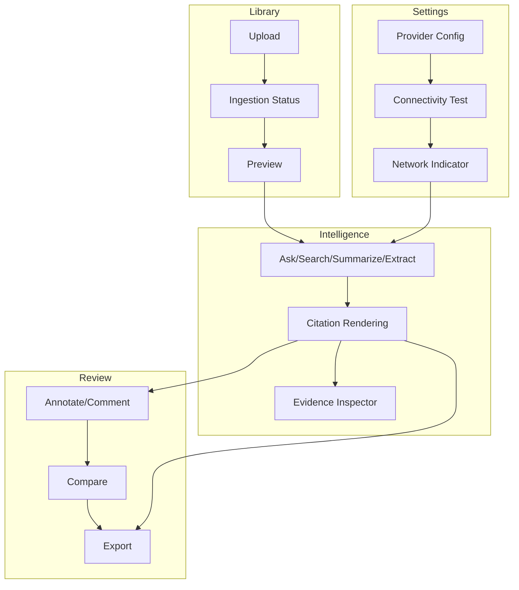

# 07 — Feature Specification

**Product:** DuckDocs
**Document type:** Feature Specification
**Status:** Draft for team review
**Audience:** Product, Design, Engineering, QA
**Upstream:** [01_VISION.md](./01_VISION.md) · [02_PRODUCT_REQUIREMENTS.md](./02_PRODUCT_REQUIREMENTS.md) · [03_FUNCTIONAL_REQUIREMENTS.md](./03_FUNCTIONAL_REQUIREMENTS.md) · [06_USER_JOURNEYS.md](./06_USER_JOURNEYS.md)
**Downstream:** [08_SYSTEM_ARCHITECTURE.md](./08_SYSTEM_ARCHITECTURE.md) · [15_API_SPECIFICATION.md](./15_API_SPECIFICATION.md) · [19_COMPONENT_LIBRARY.md](./19_COMPONENT_LIBRARY.md) · [20_DESIGN_SYSTEM.md](./20_DESIGN_SYSTEM.md)

---

## 1. Purpose

This document specifies **every individual feature** DuckDocs exposes to users, organized by surface (Library, Intelligence, Review, Settings), at the level of detail needed to design UI, write acceptance tests, and estimate implementation — without yet fixing pixel-level layout (that's [20_DESIGN_SYSTEM.md](./20_DESIGN_SYSTEM.md)) or API schemas ([15_API_SPECIFICATION.md](./15_API_SPECIFICATION.md)).

Every feature below traces to the requirements in [02](./02_PRODUCT_REQUIREMENTS.md)/[03](./03_FUNCTIONAL_REQUIREMENTS.md) and the journeys in [06_USER_JOURNEYS.md](./06_USER_JOURNEYS.md) that motivate it. A feature is not considered specified unless its empty, loading, success, and error states are all defined — commercial craft (`G-05`, `PR-Q01`) is enforced here, not left to individual engineers' judgment.

---

## 2. Scope

### In scope

- Feature-by-feature specification across Library, Intelligence, Review, Settings
- UI state coverage: empty, loading, success, partial/degraded, error
- Edge cases and their expected behavior
- Phase tagging (P0/P1/P2) per feature
- Cross-cutting system-level UX (global error handling, insufficient-evidence presentation, confidence indicators)

### Out of scope

- Visual design tokens, spacing, typography → [20_DESIGN_SYSTEM.md](./20_DESIGN_SYSTEM.md)
- Component inventory and props → [19_COMPONENT_LIBRARY.md](./19_COMPONENT_LIBRARY.md)
- API request/response schemas → [15_API_SPECIFICATION.md](./15_API_SPECIFICATION.md)
- Database schema → [13_DATABASE_DESIGN.md](./13_DATABASE_DESIGN.md)

---

## 3. Goals

| Goal ID | Feature-spec goal | Traces to |
|---------|---------------------|-----------|
| FSG-01 | Every P0 `PR-*`/`FR-*` requirement has at least one specified feature with full state coverage | PRD §6, FR §6 |
| FSG-02 | Every journey edge case in [06_USER_JOURNEYS.md](./06_USER_JOURNEYS.md) maps to an explicit feature state, not an implicit assumption | UJC-02 |
| FSG-03 | No feature ships with an undefined error or empty state | PR-Q02, PR-Q03, NFR-USE-03/04 |
| FSG-04 | Evidence, confidence, and insufficient-evidence UX are specified once, centrally, and reused across surfaces rather than redefined per feature | RULE-02, RULE-10 |

---

## 4. Feature Notation

- **ID format:** `FEAT-<SURFACE>-<NN>`. Surfaces: `LIB`, `INT` (Intelligence), `REV` (Review), `SET` (Settings), `SYS` (cross-cutting).
- Each feature specifies: **description**, **phase**, **traces to**, **states**, **key behaviors/edge cases**, **acceptance criteria**.
- **States** always include, at minimum: `empty`, `loading`, `success`, `error`; features with partial/degraded outcomes also define a `partial` state.

---

## 5. Library Surface

### FEAT-LIB-01 — Upload & Batch Ingestion

| Field | Detail |
|-------|--------|
| Description | Users add one or more files to the library; each becomes a Document with an initial Version |
| Phase | P0 |
| Traces to | PR-L01, PR-L02, PR-L03, FR-LIB-01/02/03, UJ-02 |
| States | `empty` (no library yet, prominent add-documents CTA) · `loading` (files being validated/queued) · `success` (files queued, status visible) · `partial` (some files rejected, others queued) · `error` (all files rejected) |
| Key behaviors | Drag-and-drop and file-picker both supported; type validation happens before queueing, not after upload completes; batch uploads show per-file rows immediately |
| Edge cases | Unsupported type → rejected with specific reason inline, other files in the batch continue; duplicate filename → treated as new Document unless user opts into "new version" |
| Acceptance criteria | A batch of 20 mixed-type files, including 2 unsupported, results in 18 queued + 2 clearly rejected, with no blocking of the 18 |

### FEAT-LIB-02 — Ingestion Status & Progress

| Field | Detail |
|-------|--------|
| Description | Per-document, per-unit visibility into ingestion progress and outcome |
| Phase | P0 |
| Traces to | PR-L05, PR-L10, FR-LIB-04/11/12, UJ-01, UJ-02, UJ-09 |
| States | `queued` · `processing` (with step indicator: parsing/OCR/chunking/embedding) · `ready` · `failed` (with error category) · `partial` (ready with unit-level warnings, e.g. "38/40 pages OCR'd") |
| Key behaviors | Status updates without full page reload; failed status includes a retry action; partial status is visually distinct from full-success, not hidden behind a generic checkmark |
| Edge cases | Backend restart mid-ingestion → status reflects `processing`-resumable or `failed`, never a false `ready` (NFR-REL-02) |
| Acceptance criteria | A scanned PDF with 2 low-confidence OCR pages out of 40 shows `partial` with a page-level breakdown, not a plain `ready` |

### FEAT-LIB-03 — Document Preview

| Field | Detail |
|-------|--------|
| Description | In-app rendering of a Document's current Version, at the best available fidelity |
| Phase | P0 |
| Traces to | PR-L04, FR-LIB-05, UJ-01, UJ-03 |
| States | `loading` · `success` (rendered) · `error` (unrenderable format, fallback to metadata + download) · `low-fidelity` (best-effort rendering with a visible fidelity notice) |
| Key behaviors | Preview supports jump-to-anchor (page/line/bbox/cell) for citation navigation (`FR-EVD-05`); highlight layer overlays citations/annotations without altering underlying content |
| Edge cases | Very large documents (500+ pages) → paginated/virtualized rendering, not a single giant DOM tree (`NFR-PERF-05`) |
| Acceptance criteria | Clicking a citation anchored to page 12, line 4 opens preview scrolled and highlighted at that exact location |

### FEAT-LIB-04 — Library List, Filter, and Organize

| Field | Detail |
|-------|--------|
| Description | Browse, filter by type/status, rename, and delete Documents |
| Phase | P0 |
| Traces to | PR-L06, FR-LIB-06, UJ-02 |
| States | `empty` · `loading` · `success` (list rendered) · `filtered-empty` (filter matches nothing) |
| Key behaviors | Filters combine (type + status); rename is inline; delete requires confirmation given cascade impact |
| Edge cases | Deleting a Document referenced by existing Annotations/Exports → confirmation warns about cascade impact per `FR-LIB-07` |
| Acceptance criteria | Filtering by status=`failed` shows only failed documents with visible error reasons, with a one-click path back to "all" |

### FEAT-LIB-05 — Version History & Replace

| Field | Detail |
|-------|--------|
| Description | Replace a Document's content, creating a new linked Version; browse full Version history |
| Phase | P1 |
| Traces to | PR-L07, PR-L08, FR-LIB-08/09, UJ-06 |
| States | `success` (new version created, prior versions retained) · `processing` (new version ingesting) · `error` (new version ingestion failed, prior version remains active) |
| Key behaviors | Replacing content never mutates the prior Version's data; citations/annotations against the prior Version remain resolvable via history |
| Edge cases | Replace uploaded while an existing Q&A session references the current version → historical answers keep their original Version binding (`FR-INT-09`) |
| Acceptance criteria | After replacing a Document, opening Version history shows both versions with distinct ingestion timestamps and statuses |

### FEAT-LIB-06 — Delete & Cascade Cleanup

| Field | Detail |
|-------|--------|
| Description | Deleting a Document removes files, chunks, embeddings, and orphan-eligible derived data |
| Phase | P0 |
| Traces to | PR-L06 (delete), FR-LIB-07, RULE-06, NFR-PRIV-02 |
| States | `confirm` (explicit confirmation step) · `processing` (cleanup running) · `success` (removed) · `error` (partial cleanup failure, retried) |
| Key behaviors | Cleanup target: ≤ 60s per `NFR-PRIV-02`; annotations with no valid anchor become orphaned per `FR-REV-06` rather than silently vanishing |
| Edge cases | Deletion during an in-flight Intelligence query referencing that document → in-flight query completes with a note that the source was deleted, does not crash |
| Acceptance criteria | After deletion, no trace of the document's content remains in vector store or file storage within the target window |

---

## 6. Intelligence Surface

### FEAT-INT-01 — Semantic Search

| Field | Detail |
|-------|--------|
| Description | Meaning-based search across the library or a scoped subset |
| Phase | P0 |
| Traces to | PR-I01, FR-INT-01, UJ-03 |
| States | `empty` (no query yet) · `loading` · `success` (ranked results) · `no-results` (explicit, not a blank screen) |
| Key behaviors | Results show source document, snippet, and anchor; scope selector always visible |
| Edge cases | Query yields technically-relevant but low-score results → results below the relevance threshold are either hidden or clearly separated as "low relevance," never mixed in as if equally confident |
| Acceptance criteria | A query on a 3-document scope returns only chunks from those 3 documents, ranked by score, each snippet linkable to preview |

### FEAT-INT-02 — Grounded Q&A ("Ask")

| Field | Detail |
|-------|--------|
| Description | Natural-language question answering, always cited or explicitly insufficient | 
| Phase | P0 |
| Traces to | PR-I02, PR-I05, PR-I06, FR-INT-02/05, FR-SYS-01, UJ-03 |
| States | `empty` (prompt to ask) · `loading` (retrieving/generating, staged indicator) · `success` (answer + citations) · `insufficient-evidence` (explicit, distinct visual treatment from `success`) · `error` (provider/network failure) |
| Key behaviors | Citations rendered inline as numbered/clickable markers; insufficient-evidence responses use distinct styling (not a muted version of a normal answer) so users never mistake caution for confidence |
| Edge cases | Provider times out mid-generation → partial output discarded rather than shown uncited; user offered retry |
| Acceptance criteria | Every rendered answer has ≥ 1 citation OR is rendered in the insufficient-evidence state; no third outcome exists |

### FEAT-INT-03 — Summarization

| Field | Detail |
|-------|--------|
| Description | Cited summary for a document or selected set |
| Phase | P0 |
| Traces to | PR-I03, FR-INT-03, UJ-04 |
| States | `loading` · `success` (summary with per-claim citations) · `insufficient-evidence` (rare, e.g., empty/unreadable source) · `error` |
| Key behaviors | Summary length/detail configurable (short/detailed); every paragraph or bullet carries at least one citation |
| Edge cases | Summarizing a set where one document failed ingestion → that document is excluded and named explicitly, not silently dropped |
| Acceptance criteria | A 5-document summary request produces a summary where every sentence traces to at least one of the 5 sources |

### FEAT-INT-04 — Structured Extraction

| Field | Detail |
|-------|--------|
| Description | Extract fields/entities/tables from a document or set, each linked to evidence |
| Phase | P1 |
| Traces to | PR-I04, FR-INT-04, UJ-04 |
| States | `loading` · `success` (table with evidence-linked cells) · `partial` (some fields not found) · `error` |
| Key behaviors | Not-found fields are marked explicitly absent, never left blank without explanation or guessed |
| Edge cases | Same field found with conflicting values across sources → both surfaced with their respective citations, not silently reconciled |
| Acceptance criteria | Every populated cell in an extraction table has at least one clickable citation; every unpopulated cell states why |

### FEAT-INT-05 — Citation Rendering & Navigation

| Field | Detail |
|-------|--------|
| Description | The shared citation component used across Q&A, summaries, extraction, and export |
| Phase | P0 |
| Traces to | PR-E02, FR-EVD-05, FR-INT-08, RULE-07 |
| States | `resolvable` (navigates precisely) · `degraded` (only coarse anchor available, e.g., document-only) · `broken` (source deleted/unavailable, shown but non-navigable with explanation) |
| Key behaviors | Always prefers the most precise anchor available (line/char/bbox/cell over document-only), per `RULE-07` |
| Edge cases | Source Version deleted after an answer was generated → citation shows a clear "source no longer available" state rather than a broken link |
| Acceptance criteria | Citation navigation opens preview scrolled/highlighted to the exact anchor for ≥ 95% of full-layout sources (PRD §16 metric) |

### FEAT-INT-06 — Evidence Inspector

| Field | Detail |
|-------|--------|
| Description | Dedicated view of all Evidence/Chunks behind a given response, with metadata and confidence |
| Phase | P1 |
| Traces to | PR-E06, FR-EVD-06, UJ-03 |
| States | `success` (list of chunks with scores/metadata) · `empty` (insufficient-evidence responses have no chunks to inspect, stated as such) |
| Key behaviors | Shows retrieval score, embedding ID, OCR confidence, and fidelity tier per chunk where applicable |
| Acceptance criteria | For any grounded answer, the inspector lists every chunk actually used in generation, matching the citations shown |

### FEAT-INT-07 — Scope Selector

| Field | Detail |
|-------|--------|
| Description | Choose whether an Intelligence operation targets one document, a selection, or the whole library |
| Phase | P0 (single doc + library); P1 (multi-select) |
| Traces to | PR-I09, FR-INT-01/07 |
| States | `default` (whole library) · `scoped` (document or selection active, visibly indicated) |
| Key behaviors | Scope persists across a session until explicitly changed; always visible so users are never confused about what was actually searched |
| Acceptance criteria | Changing scope mid-session does not require re-uploading or re-indexing anything |

---

## 7. Review Surface

### FEAT-REV-01 — Inline Annotation & Highlight

| Field | Detail |
|-------|--------|
| Description | Highlight a passage and attach a note, anchored to a specific Version |
| Phase | P1 |
| Traces to | PR-R01, FR-REV-01/03, UJ-05 |
| States | `creating` (selection active) · `success` (saved, visible on preview) · `orphaned` (anchor Version no longer current, per `FR-REV-06`) |
| Key behaviors | Annotation list view alongside preview; orphaned annotations remain visible with a distinct visual treatment, never silently removed |
| Edge cases | Two overlapping selections annotated separately → both retained, distinctly attributed |
| Acceptance criteria | An annotation created on Version 1 remains inspectable (as orphaned or re-anchored) after the document is replaced with Version 2 |

### FEAT-REV-02 — Comment on Cited Evidence

| Field | Detail |
|-------|--------|
| Description | Attach a comment directly to an AI-cited evidence region |
| Phase | P1 |
| Traces to | PR-R02, FR-REV-02, UJ-05 |
| States | `success` (comment attached, visible from both the answer and the preview) |
| Key behaviors | Comments on AI citations are visually distinguishable from freeform annotations, since they carry retrieval/confidence context |
| Acceptance criteria | A comment added from an answer's citation is visible both inline in the Intelligence response and in the Review comment list |

### FEAT-REV-03 — Confidence Indicators

| Field | Detail |
|-------|--------|
| Description | Shared visual language for retrieval score, OCR confidence, and fidelity tier, reused wherever evidence is shown |
| Phase | P0 (data available) / P1 (dedicated visualization) |
| Traces to | PR-E05, PR-R05, FR-EVD-07, FR-SYS-06, RULE-10 |
| States | `high` · `medium` · `low` · `unavailable` (signal not applicable to this source type) |
| Key behaviors | Same component and thresholds used in Library, Intelligence, and Review — no surface invents its own confidence language |
| Acceptance criteria | A low-OCR-confidence page shows the same "low confidence" treatment whether viewed in Library preview or cited in an Intelligence answer |

### FEAT-REV-04 — Document/Version Comparison (Content Diff)

| Field | Detail |
|-------|--------|
| Description | Side-by-side content diff between two Documents or two Versions |
| Phase | P1 |
| Traces to | PR-C01/C02/C03, FR-CMP-01/02/03, UJ-06 |
| States | `loading` (diff computing) · `success` (diff rendered) · `no-differences` (explicit) · `error` (diff engine failure) |
| Key behaviors | Added/removed/changed segments are color-coded consistently; very large diffs remain navigable (jump-to-next-change) |
| Acceptance criteria | Comparing two versions of a 50-page contract completes within the `NFR-PERF-06` target and represents every changed paragraph |

### FEAT-REV-05 — Semantic Comparison & Annotation/Citation Diff

| Field | Detail |
|-------|--------|
| Description | Meaning-level change summary and annotation/citation differences between two versions |
| Phase | P2 |
| Traces to | PR-C04/C05, FR-CMP-04/05, UJ-06 |
| States | `success` (evidence-backed change summary) · `unavailable` (P0/P1 install, feature not yet enabled) |
| Key behaviors | Semantic summary is itself subject to the citation/insufficient-evidence rule — it is generation, not exempt from RULE-02 |
| Acceptance criteria | Semantic comparison output includes citations from both compared versions for every claimed change |

### FEAT-REV-06 — Export

| Field | Detail |
|-------|--------|
| Description | Produce a local, citation-embedded artifact from an answer, summary, extraction, or comparison |
| Phase | P1 (Markdown), P2 (additional formats) |
| Traces to | PR-X01/X02/X03/X04, FR-EXP-01..05, UJ-07 |
| States | `format-select` · `processing` · `success` (artifact written locally, path shown) · `error` |
| Key behaviors | Reuses the same Evidence/Citation objects as the UI (`FR-EXP-05`); insufficient-evidence sections are preserved verbatim in exports |
| Acceptance criteria | A Markdown export of a cited answer contains the same citations, in the same correspondence to claims, as the in-app rendering |

---

## 8. Settings Surface

### FEAT-SET-01 — Chat/Generation Provider Configuration

| Field | Detail |
|-------|--------|
| Description | Configure the active chat/generation provider (Ollama default, or OpenAI/Anthropic/Gemini/OpenAI-compatible) |
| Phase | P0 |
| Traces to | PR-S01/S02/S04, FR-SET-01/02/04, UJ-08 |
| States | `default` (Ollama + Gemma 3 1B) · `configured` (alternative active) · `unreachable` (configured but failing) |
| Key behaviors | Switching providers takes effect immediately, no restart; a persistent indicator shows the currently active provider everywhere Intelligence runs |
| Acceptance criteria | Selecting a new chat provider and saving changes the provider used by the very next Q&A request |

### FEAT-SET-02 — Embedding Provider Configuration

| Field | Detail |
|-------|--------|
| Description | Configure the embedding provider independently from the chat provider |
| Phase | P0 |
| Traces to | PR-S03, FR-SET-03, UJ-08 |
| States | `default` (local embedding model) · `configured` (alternative active) · `reindex-needed` (existing embeddings mismatched with new provider) |
| Key behaviors | Changing the embedding provider surfaces a clear re-indexing requirement rather than silently mixing embedding spaces |
| Acceptance criteria | After an embedding provider change, the system either blocks retrieval until re-indexing completes or clearly flags mixed-embedding risk — never silently returns degraded results |

### FEAT-SET-03 — Provider Connectivity Test

| Field | Detail |
|-------|--------|
| Description | Test a configured provider without necessarily sending document content |
| Phase | P1 |
| Traces to | PR-S08, FR-SET-08, UJ-08 |
| States | `idle` · `testing` · `success` · `failed` (with specific reason: auth, network, model not found) |
| Acceptance criteria | Running a connectivity test does not transmit any library document content unless the user explicitly opts in for that test |

### FEAT-SET-04 — Local Data Paths

| Field | Detail |
|-------|--------|
| Description | View and, within supported bounds, change local paths for files, relational DB, and vector store |
| Phase | P0 |
| Traces to | PR-S07, FR-SET-07, UJ-08 |
| States | `success` (paths shown and valid) · `warning` (path not writable / low disk space) |
| Acceptance criteria | Displayed paths match the actual resolved paths used by the running containers, verifiable by inspection |

### FEAT-SET-05 — Privacy / Network Activity Indicator

| Field | Detail |
|-------|--------|
| Description | Persistent, accurate indicator of whether any network-based provider is active and in use |
| Phase | P0 |
| Traces to | PR-S05/S06, FR-SET-06, NFR-PRIV-03, RULE-04 |
| States | `fully-local` · `network-provider-active` (named explicitly, e.g., "OpenAI (chat)") |
| Acceptance criteria | The indicator never shows `fully-local` while any configured provider for the current operation is network-based |

### FEAT-SET-06 — OCR & Processing Settings

| Field | Detail |
|-------|--------|
| Description | Configure OCR engine behavior and processing thresholds (e.g., confidence threshold for flagging) |
| Phase | P1 |
| Traces to | PR-L02, RULE-10, OQ-V02 |
| States | `default` · `configured` |
| Acceptance criteria | Changing the OCR confidence threshold changes which pages are flagged `low-confidence` on the next ingestion, without requiring re-ingestion of already-processed documents unless explicitly requested |

---

## 9. Cross-Cutting System Features

### FEAT-SYS-01 — Empty States

| Field | Detail |
|-------|--------|
| Description | First-run and no-data states across every surface, always actionable |
| Phase | P0 |
| Traces to | PR-Q03, NFR-USE-01, UJ-01 |
| Acceptance criteria | No surface ever renders a blank screen with no explanation and no next action |

### FEAT-SYS-02 — Error Handling

| Field | Detail |
|-------|--------|
| Description | Shared error presentation pattern: category, human explanation, and a next action (retry/reconfigure/contact) |
| Phase | P0 |
| Traces to | PR-Q02, FR-SYS-04, NFR-USE-04 |
| Acceptance criteria | Every error surfaced anywhere in the product uses the shared error component with a specific message, never a raw stack trace or generic "something went wrong" |

### FEAT-SYS-03 — Insufficient-Evidence Presentation

| Field | Detail |
|-------|--------|
| Description | The single, shared visual/textual pattern for "the system cannot answer from available sources" | 
| Phase | P0 |
| Traces to | RULE-02, FR-SYS-01, FEAT-INT-02 |
| Acceptance criteria | This pattern is implemented once as a shared component and reused by Q&A, summarization, extraction, and semantic comparison — no surface reinvents its own "I don't know" copy/style |

---

## 10. Architecture Decisions (Feature-Level)

| ID | Decision | Rationale |
|----|----------|-----------|
| AD-FS01 | Confidence indicators (`FEAT-REV-03`) and insufficient-evidence presentation (`FEAT-SYS-03`) are built as single shared components consumed by every surface | Prevents drift where one surface's "low confidence" doesn't match another's, undermining trust consistency |
| AD-FS02 | Every feature explicitly defines a `partial`/`degraded` state where realistic, not just success/error | Real documents and real providers fail partially far more often than completely |
| AD-FS03 | Export (`FEAT-REV-06`) reuses Evidence/Citation objects rather than a export-specific citation renderer | Directly mitigates the "export citation quality poor" risk in PRD §17 |
| AD-FS04 | Provider-related features (`FEAT-SET-01/02/05`) always show explicit, named active-provider state | Supports Dana/Elena's need for verifiable, not asserted, privacy behavior |

### Alternatives rejected

| Alternative | Why rejected |
|--------------|--------------|
| Let each feature define its own error/empty pattern | Produces inconsistent, harder-to-trust UX; violates commercial-craft goal |
| Skip `partial` states for P0, add later | Directly contradicts `FR-LIB-12`/RULE-10 and produces false-positive "ready"/"success" states |
| Build export-specific citation rendering for speed | Creates two sources of truth for citations, the exact risk flagged in PRD §17 |

---

## 11. Tradeoffs

| Tradeoff | Choice | Consequence |
|----------|--------|-------------|
| Shared components (confidence, insufficient-evidence, error) vs. per-feature speed | Shared components, built once, reused everywhere | Slightly more upfront design/engineering investment; large long-term consistency payoff |
| Full state coverage per feature vs. faster spec | Full coverage (empty/loading/success/partial/error) required | Longer spec and longer build per feature, but eliminates late-discovered undefined states |
| P1 features (annotation, compare, export) specified now vs. deferred | Specified now at this detail | Slightly larger P0 planning document; avoids the AD-V06 rewrite risk |

---

## 12. Data Flow

---

## 13. Interfaces

| Feature group | Backing interface (see [03_FUNCTIONAL_REQUIREMENTS.md](./03_FUNCTIONAL_REQUIREMENTS.md) §11) |
|----------------|--------------------------------------------------------------------------------------------------|
| Library features | Ingestion pipeline interface |
| Intelligence features | Retrieval + Generation + Evidence interfaces |
| Review features | Annotation + Comparison + Export interfaces |
| Settings features | Provider configuration interface |

---

## 14. Constraints

| ID | Constraint |
|----|------------|
| FSC-01 | No feature may ship without its `error` and `empty` states specified and implemented |
| FSC-02 | Confidence and insufficient-evidence UX must use the shared components (`FEAT-REV-03`, `FEAT-SYS-03`); no per-feature reimplementation is permitted |
| FSC-03 | Any feature involving a network-capable provider must integrate with `FEAT-SET-05`'s indicator; no silent network activity is permitted from any feature |

---

## 15. Risks

| Risk | Impact | Mitigation |
|------|--------|------------|
| Shared components (confidence, error, insufficient-evidence) get built late, forcing per-feature rework | Inconsistent UX shipped, costly retrofit | Build these three shared components first, before individual surface features |
| Partial/degraded states deprioritized under P0 schedule pressure | Silent trust failures on real messy documents | Treat `partial` state coverage as a P0 acceptance gate, not a nice-to-have |
| Export and Review features (P1) drift from the Evidence objects used in Intelligence (P0) if built later by a different team | Divergent citation representations | Enforce `FR-EXP-05` via shared Evidence/Citation type reuse from day one, even before Export ships |

---

## 16. Future Extensibility

- New file-type support plugs into `FEAT-LIB-01`/`02`/`03` without new feature IDs — fidelity tier and confidence indicators (`FEAT-REV-03`) already generalize across types.
- New export formats plug into `FEAT-REV-06` as additional format options, not new features.
- New providers plug into `FEAT-SET-01`/`02` as additional configuration entries.
- Citation graph (P2) can be introduced as a new view within `FEAT-INT-06` (Evidence Inspector) without altering its data contract, since the inspector already lists chunk-level relationships.

---

## 17. Open Questions

| ID | Question | Owner | Needed by |
|----|----------|-------|-----------|
| OQ-FS01 | Should the insufficient-evidence state (`FEAT-SYS-03`) support partial grounding (some claims cited, one uncited) with inline flags, or force an all-or-nothing response? | Product + AI | Before Intelligence UX finalization |
| OQ-FS02 | What is the exact UX for `reindex-needed` in `FEAT-SET-02` — blocking modal vs. persistent banner? | Design | Before Settings implementation |
| OQ-FS03 | Does `FEAT-REV-04` need a "jump to next change" control at P1, or is that deferred to P2 polish? | Design + Eng | Before Review UI implementation |

---

## 18. Acceptance Criteria

This document is accepted when:

- [ ] Every P0 `PR-*`/`FR-*` has at least one feature with full state coverage
- [ ] Shared components (`FEAT-REV-03`, `FEAT-SYS-02`, `FEAT-SYS-03`) are agreed as build-once, reuse-everywhere by Design and Engineering
- [ ] Every journey edge case from [06_USER_JOURNEYS.md](./06_USER_JOURNEYS.md) maps to a defined feature state
- [ ] Phase tags match PRD §15
- [ ] Open questions have owners

---

## 19. Cross-References

| Topic | Document |
|-------|----------|
| Vision | [01_VISION.md](./01_VISION.md) |
| Product requirements | [02_PRODUCT_REQUIREMENTS.md](./02_PRODUCT_REQUIREMENTS.md) |
| Functional requirements | [03_FUNCTIONAL_REQUIREMENTS.md](./03_FUNCTIONAL_REQUIREMENTS.md) |
| Non-functional requirements | [04_NON_FUNCTIONAL_REQUIREMENTS.md](./04_NON_FUNCTIONAL_REQUIREMENTS.md) |
| User journeys | [06_USER_JOURNEYS.md](./06_USER_JOURNEYS.md) |
| System architecture | [08_SYSTEM_ARCHITECTURE.md](./08_SYSTEM_ARCHITECTURE.md) |
| Component library / Design system | [19_COMPONENT_LIBRARY.md](./19_COMPONENT_LIBRARY.md) · [20_DESIGN_SYSTEM.md](./20_DESIGN_SYSTEM.md) |

---

## Document Control

| Field | Value |
|-------|-------|
| Version | 0.1.0 |
| Last updated | 2026-07-18 |
| Authors | DuckDocs Architecture Team |
| Review state | Pending team review |
| Previous | [06_USER_JOURNEYS.md](./06_USER_JOURNEYS.md) |
| Next | [08_SYSTEM_ARCHITECTURE.md](./08_SYSTEM_ARCHITECTURE.md) |
