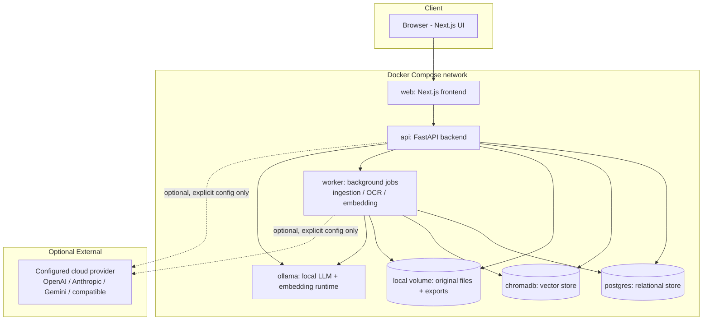
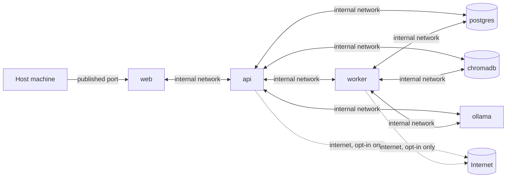
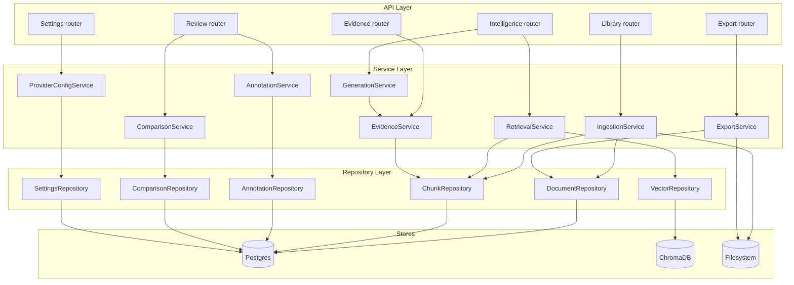
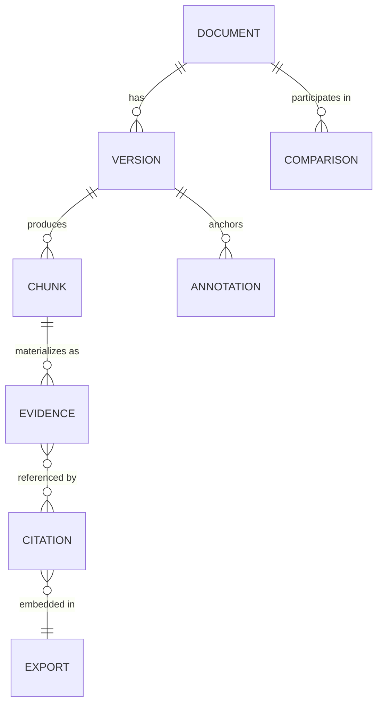
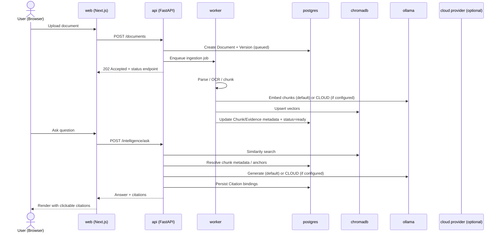

# 08 — System Architecture

**Product:** DuckDocs
**Document type:** System Architecture
**Status:** Draft for team review
**Audience:** Engineering, Platform, AI, Security
**Upstream:** [01_VISION.md](./01_VISION.md) · [02_PRODUCT_REQUIREMENTS.md](./02_PRODUCT_REQUIREMENTS.md) · [03_FUNCTIONAL_REQUIREMENTS.md](./03_FUNCTIONAL_REQUIREMENTS.md) · [04_NON_FUNCTIONAL_REQUIREMENTS.md](./04_NON_FUNCTIONAL_REQUIREMENTS.md)
**Downstream:** [09_AI_ARCHITECTURE.md](./09_AI_ARCHITECTURE.md) · [10_DOCUMENT_PIPELINE.md](./10_DOCUMENT_PIPELINE.md) · [11_RAG_ARCHITECTURE.md](./11_RAG_ARCHITECTURE.md) · [12_PROVIDER_ARCHITECTURE.md](./12_PROVIDER_ARCHITECTURE.md) · [13_DATABASE_DESIGN.md](./13_DATABASE_DESIGN.md) · [14_VECTOR_DATABASE.md](./14_VECTOR_DATABASE.md)

---

## 1. Purpose

This document defines the overall system architecture of DuckDocs — the services, data stores, deployment topology, and module boundaries that satisfy the requirements in [02](./02_PRODUCT_REQUIREMENTS.md)–[04](./04_NON_FUNCTIONAL_REQUIREMENTS.md) on a single local machine by default.

It is the first of a five-document architecture arc (`08`–`12`): this document owns the **overall system shape** — components, deployment, layering, and cross-service data flow. The AI subsystem (grounding gate, model role separation) is detailed in [09_AI_ARCHITECTURE.md](./09_AI_ARCHITECTURE.md), ingestion pipeline internals in [10_DOCUMENT_PIPELINE.md](./10_DOCUMENT_PIPELINE.md), retrieval/RAG internals in [11_RAG_ARCHITECTURE.md](./11_RAG_ARCHITECTURE.md), provider abstraction internals in [12_PROVIDER_ARCHITECTURE.md](./12_PROVIDER_ARCHITECTURE.md), and the relational domain/data model in [13_DATABASE_DESIGN.md](./13_DATABASE_DESIGN.md).

---

## 2. Scope

### In scope

- Component/service decomposition and their responsibilities
- Deployment topology via Docker Compose (services, volumes, networks)
- Backend layering (API / service / repository) and frontend structure
- Data store selection and rationale (relational, vector, filesystem)
- Background job/worker architecture for ingestion
- End-to-end request flow across container boundaries
- System-level security/networking posture

### Out of scope

- Retrieval ranking, chunking strategy, prompt construction, grounding gate detail → [09_AI_ARCHITECTURE.md](./09_AI_ARCHITECTURE.md), [11_RAG_ARCHITECTURE.md](./11_RAG_ARCHITECTURE.md)
- Table/column-level schema → [13_DATABASE_DESIGN.md](./13_DATABASE_DESIGN.md)
- Parser/OCR engine internals → [10_DOCUMENT_PIPELINE.md](./10_DOCUMENT_PIPELINE.md)
- Provider interface method signatures → [12_PROVIDER_ARCHITECTURE.md](./12_PROVIDER_ARCHITECTURE.md)
- Endpoint contracts → [15_API_SPECIFICATION.md](./15_API_SPECIFICATION.md)
- Detailed threat model → [24_SECURITY.md](./24_SECURITY.md)

---

## 3. Goals

| Goal ID | Architecture goal | Traces to |
|---------|---------------------|-----------|
| AG-01 | Default deployment runs entirely on one local machine via Docker Compose, no cloud dependency | G-01, PC-01, PC-02, C-01 |
| AG-02 | Every subsystem (ingestion, retrieval, generation, evidence, provider) is independently testable and swappable | AD-V03, AD-V04, NFR-MAINT-01/02 |
| AG-03 | Vector store and relational store scale and evolve independently | AD-V05, NFR-SCALE-05 |
| AG-04 | System meets the P0 performance/reliability budgets on the reference machine | NFR-PERF-*, NFR-REL-* |
| AG-05 | No component performs network I/O for telemetry; network I/O for AI providers is explicit and visible | RULE-04, RULE-05, NFR-SEC-01 |

---

## 4. System Overview

DuckDocs is deployed as a small set of cooperating containers on one machine. There is deliberately **no microservice sprawl** — the vision explicitly rejects a monolith, but also does not require dozens of network-hopping services for a single-user local product. The architecture is **modular in code, minimal in deployment topology**.

**Read this diagram normatively:** the dotted lines to `CLOUD` are the *only* edges in the entire system that may cross the local network boundary, and only when a user has explicitly configured a provider (`RULE-03`, `RULE-04`). Every solid edge stays inside the Docker Compose network or the local filesystem.

---

## 5. Deployment Architecture

### 5.1 Services

| Service | Image basis | Responsibility |
|---------|-------------|-----------------|
| `web` | Node.js (Next.js) | Serves the React/TypeScript UI; talks to `api` only |
| `api` | Python 3.12 (FastAPI + Uvicorn) | Synchronous request handling: reads, quick writes, enqueue of long-running jobs, retrieval, generation orchestration |
| `worker` | Same image as `api`, different entrypoint | Long-running/background jobs: ingestion, parsing, OCR, chunking, embedding, comparison, export rendering |
| `ollama` | Ollama official image | Local model runtime for chat/generation and local embeddings |
| `chromadb` | ChromaDB official image | Vector storage and similarity search |
| `postgres` | PostgreSQL | Relational storage: Documents, Versions, Chunks metadata, Evidence, Annotations, Citations, Comparisons, Exports, Settings |

### 5.2 Volumes

| Volume | Mounted by | Contents |
|--------|------------|----------|
| `duckdocs_files` | `api`, `worker` | Original uploaded files, rendered previews (if cached), export artifacts |
| `duckdocs_postgres_data` | `postgres` | Relational database files |
| `duckdocs_chroma_data` | `chromadb` | Vector index files |
| `ollama_models` | `ollama` | Downloaded local models (e.g., Gemma 3 1B) |

### 5.3 Networking

- All services share a private Docker Compose network; only `web` publishes a port to the host by default.
- `api`, `worker`, `postgres`, `chromadb`, and `ollama` are **not** exposed on a public host interface unless the user explicitly changes the Compose configuration (`NFR-SEC-01`).
- Outbound internet access is only exercised by `api`/`worker` when a cloud provider is configured for the operation in progress; no service initiates outbound calls otherwise.

Full Compose manifest and per-service resource limits are specified in [29_DOCKER_ARCHITECTURE.md](./29_DOCKER_ARCHITECTURE.md); deployment/runbook detail in [30_DEPLOYMENT.md](./30_DEPLOYMENT.md).

---

## 6. Backend Architecture

The backend follows a **layered architecture** to keep domain logic independent of transport (HTTP) and storage (Postgres/ChromaDB) concerns, and to satisfy `NFR-MAINT-01`–`03`.

| Layer | Rule |
|-------|------|
| API (routers) | Validates input (Pydantic), calls exactly one service method per operation, never touches repositories or stores directly |
| Service | Contains domain logic and enforces invariants (e.g., the evidence-sufficiency gate in [03_FUNCTIONAL_REQUIREMENTS.md](./03_FUNCTIONAL_REQUIREMENTS.md) §7.2); orchestrates repositories and providers |
| Repository | Owns all SQLAlchemy/ChromaDB/filesystem access; no business logic; swappable independent of service logic |
| Provider adapters | Called only from `GenerationService`/`IngestionService` via the interface defined in [12_PROVIDER_ARCHITECTURE.md](./12_PROVIDER_ARCHITECTURE.md); never called directly from routers |

This layering is what makes `NFR-MAINT-02`'s provider contract tests possible: a service can be tested against a mocked provider without a real Ollama/ChromaDB/Postgres running.

---

## 7. Frontend Architecture

| Concern | Choice | Rationale |
|---------|--------|-----------|
| Framework | Next.js (App Router) + React + TypeScript | Modern SSR/CSR hybrid; strong ecosystem fit for Shadcn/Radix |
| Server state | TanStack Query | Caches ingestion status, retrieval results, provider state with predictable invalidation, matching the polling needs of async jobs (§9) |
| Forms/validation | React Hook Form + Zod | Type-safe validation shared conceptually with backend Pydantic models (mirrored schemas, not shared code, since stacks differ) |
| UI primitives | Shadcn/Radix | Accessible-by-default primitives support `NFR-USE-02` (WCAG 2.1 AA) without building a11y from scratch |
| Styling | Tailwind CSS | Design-token-driven styling consistent with [20_DESIGN_SYSTEM.md](./20_DESIGN_SYSTEM.md) |
| Motion | Framer Motion | Intentional motion per commercial-craft goal (`G-05`); respects `prefers-reduced-motion` (`NFR-USE-06`) |

Frontend structure mirrors the surfaces: `app/library`, `app/intelligence`, `app/review`, `app/settings`, with shared UI in `components/` and shared evidence/citation/confidence components (per `FEAT-REV-03`, `FEAT-SYS-03`) in a dedicated `components/evidence/` module so they cannot silently diverge per surface.

---

## 8. Data Stores

| Store | Technology | Owns | Rationale |
|-------|------------|------|-----------|
| Relational | PostgreSQL via SQLAlchemy + Alembic | Document, Version, Chunk metadata, Evidence metadata, Annotation, Citation, Comparison, Export, Settings/provider config, job/ingestion status | ACID guarantees for provenance-critical records (`NFR-REL-04`); mature migration tooling (Alembic) for schema evolution |
| Vector | ChromaDB | Chunk embeddings, similarity search | Purpose-built local vector store; simplest local-first fit per PRD PC-05/§19; decouples embedding lifecycle from relational schema (`AD-V05`) |
| Filesystem | Local volume | Original uploaded files, rendered preview caches, export artifacts | Files are the source of truth for content; database stores metadata and pointers, not blobs, keeping the relational store small and fast |

### 8.1 Why PostgreSQL over SQLite

| Consideration | PostgreSQL (chosen) | SQLite (rejected as primary) |
|----------------|----------------------|-------------------------------|
| Concurrent writers (`api` + `worker` simultaneously) | Native support | File-level locking risk under concurrent ingestion + query load |
| Alembic migration maturity | Full support | Supported but more constrained (e.g., limited `ALTER TABLE`) |
| Future multi-user local deployment (OQ-V01) | Straightforward | Would likely require a later migration anyway |
| Operational cost | One more container, but Dockerized and zero-config for the user | Lower overhead, but the concurrency risk outweighs this for a system with a dedicated background worker |

**Decision:** PostgreSQL ships as a Compose service, invisible to the end user beyond the resource footprint — no user-facing DB administration is required for the default path.

### 8.2 Conceptual Domain Model (preview)

Full schema in [13_DATABASE_DESIGN.md](./13_DATABASE_DESIGN.md). At the architecture level, the relationships that constrain storage choice:

---

## 9. Background Processing Architecture

Ingestion, OCR, embedding, comparison, and export rendering are **long-running relative to an HTTP request** and run in the `worker` process, not inline in `api`.

| Design question | Decision | Rationale |
|-------------------|----------|-----------|
| Job queue mechanism | Postgres-backed job table (polled by `worker`), not Redis/RabbitMQ | Avoids adding a network service purely for queuing on a single-machine deployment; Postgres is already required (§8.1) |
| Job states | `queued → running → succeeded / failed / partial` | Mirrors the ingestion state model in [03_FUNCTIONAL_REQUIREMENTS.md](./03_FUNCTIONAL_REQUIREMENTS.md) §7.1 |
| Concurrency | Configurable worker concurrency (default matches `NFR-SCALE-04`'s 2 concurrent jobs) | Bounds resource usage on the reference machine |
| Failure handling | Failed jobs remain inspectable and retryable; no automatic silent retry loop that could mask persistent failures | Supports `FR-LIB-11`, `NFR-REL-01` |

### Alternative considered: Redis/RabbitMQ-backed queue

Rejected for P0: introduces an additional stateful service, additional failure mode, and additional container for a benefit (higher-throughput async messaging) that a single-user local deployment does not need. Revisit only if `NFR-SCALE-02` (large-library tier) or multi-user deployment (OQ-V01) demands it — tracked as an open question (§19).

---

## 10. End-to-End Request Flow (System View)

---

## 11. Architecture Decisions (System Level)

| ID | Decision | Rationale |
|----|----------|-----------|
| AD-S01 | Two backend processes (`api`, `worker`) sharing one codebase, not one process doing everything synchronously | Keeps HTTP responses fast (`NFR-PERF-05`) while ingestion/OCR run long; avoids a full microservice split the vision explicitly rejects |
| AD-S02 | PostgreSQL for relational storage, chosen over SQLite | Concurrent writer safety between `api` and `worker`; Alembic migration maturity; future multi-user path |
| AD-S03 | Postgres-backed job queue instead of Redis/RabbitMQ | Minimizes container/operational footprint for a single-machine default; revisit only if scale demands it |
| AD-S04 | ChromaDB isolated from relational schema, addressed only via `VectorRepository` | Preserves independent scaling/migration of vectors vs. relational data (`AD-V05`) |
| AD-S05 | Provider calls (Ollama or cloud) only ever originate from `api`/`worker`, never from `web` | Keeps API keys and provider selection server-side; browser never holds provider credentials |
| AD-S06 | Shared evidence/citation/confidence UI components live in a dedicated frontend module, not duplicated per surface | Enforces `FSC-02` from Feature Specification at the architecture level |

### Alternatives rejected

| Alternative | Why rejected |
|--------------|--------------|
| Single FastAPI process handling ingestion inline | Blocks request threads on OCR/embedding; fails `NFR-PERF-05`/`NFR-USE-03` |
| Full microservice-per-domain (separate containers for retrieval, generation, evidence, etc.) | Unjustified operational complexity for a single-user local product; contradicts AD-V03's "not a monolith" balanced against avoiding sprawl |
| SQLite as the primary relational store | Concurrency risk with a dedicated background worker; migration limitations |
| Redis-backed job queue by default | Extra container/failure mode not justified at P0 scale targets |
| Provider calls issued directly from the browser | Would require shipping cloud API keys to the client; unacceptable security posture |

---

## 12. Tradeoffs

| Tradeoff | Choice | Consequence |
|----------|--------|-------------|
| Operational simplicity vs. maximum async throughput | Postgres-backed queue, not Redis | Lower ceiling on job throughput; acceptable at P0/P1 scale targets (`NFR-SCALE-*`) |
| Two-process backend vs. single process | Two processes (`api`, `worker`) | Slightly more deployment complexity (one more Compose service) for much better responsiveness and failure isolation |
| PostgreSQL container vs. zero-dependency SQLite | PostgreSQL | One more container and slightly higher idle resource footprint, in exchange for correctness under concurrency |
| Strict layering (API/Service/Repository) vs. faster prototyping | Strict layering | More boilerplate per feature, but directly enables the contract testing required by `NFR-MAINT-02` |

---

## 13. Interfaces

| Interface | Crosses boundary | Notes |
|-----------|-------------------|-------|
| `web` ↔ `api` | HTTP/JSON over Compose network | Only interface the browser-served code talks to; schemas in [15_API_SPECIFICATION.md](./15_API_SPECIFICATION.md) |
| `api`/`worker` ↔ `postgres` | SQLAlchemy over TCP (internal network only) | Never exposed to host by default |
| `api`/`worker` ↔ `chromadb` | ChromaDB client over TCP (internal network only) | Never exposed to host by default |
| `api`/`worker` ↔ `ollama` | Ollama HTTP API (internal network only) | Default generation/embedding path |
| `api`/`worker` ↔ cloud provider | HTTPS, only when configured | The only interface permitted to leave the host network; gated by `FR-SET-06` |
| `worker` job interface | Postgres job table (poll/claim pattern) | No separate message broker required (§9) |

---

## 14. Constraints

| ID | Constraint |
|----|------------|
| SC-01 | No service other than `api`/`worker` may initiate outbound network calls |
| SC-02 | `web` must never receive or store provider API keys; all provider calls are server-side |
| SC-03 | Relational schema changes must go through Alembic; no direct manual schema edits in any environment |
| SC-04 | Vector store operations must go through `VectorRepository`; no direct ChromaDB calls from service or router layers |
| SC-05 | The system must remain deployable via a single `docker compose up` with no manual post-install steps beyond model pull (Ollama) |

---

## 15. Risks

| Risk | Impact | Mitigation |
|------|--------|------------|
| Postgres-backed job queue becomes a bottleneck at larger library sizes (`NFR-SCALE-02`) | Ingestion throughput degrades | Add indexed polling, batch claim, and revisit Redis/RabbitMQ only if benchmarks show it's necessary |
| Two-process split (`api`/`worker`) drifts out of sync (shared code changes break one but not the other) | Runtime errors, inconsistent behavior | Shared codebase with a single deployable image and shared test suite covering both entrypoints |
| PostgreSQL container adds enough overhead to violate reference-machine performance budgets | P0 performance targets missed | Include Postgres resource usage in the `NFR-PERF-*` benchmark harness from the start |
| Strict layering slows early development velocity | Schedule pressure to bypass layers "just this once" | Enforce via code review checklist and lightweight architecture tests (e.g., import-linter rules) |

---

## 16. Future Extensibility

- The `worker` process can scale to multiple replicas (still single-machine, multiple worker containers) without architecture change, addressing `NFR-SCALE-04` growth.
- The Postgres-backed job queue can be swapped for Redis/RabbitMQ behind the same job-repository interface if scale demands it (§9 alternative), without touching service-layer code.
- Additional data stores (e.g., a future object store for very large exports) can be added behind the existing Repository layer without touching services or routers.
- A future multi-user local deployment (OQ-V01) would add an auth/session layer in front of the API layer without altering the Service/Repository layering.
- Provider architecture ([12_PROVIDER_ARCHITECTURE.md](./12_PROVIDER_ARCHITECTURE.md)) plugs into `GenerationService`/`IngestionService` via a stable interface, so new providers never touch this document's diagrams.

---

## 17. Open Questions

| ID | Question | Owner | Needed by |
|----|----------|-------|-----------|
| OQ-S01 | At what library size (chunks/jobs per minute) does the Postgres-backed job queue need to be replaced with a dedicated broker? | Platform | Before `NFR-SCALE-02` large-library guidance is finalized |
| OQ-S02 | Should `worker` be horizontally replicable in P0, or is a single worker container sufficient until P1? | Platform | Before deployment runbook ([30_DEPLOYMENT.md](./30_DEPLOYMENT.md)) |
| OQ-S03 | Does the reference-machine performance benchmark (NFR §5) need to account for Postgres + ChromaDB + Ollama running concurrently, or are they profiled independently? | AI + Platform | Before NFR acceptance testing |
| OQ-S04 | Is a native (non-Docker) install path (`NFR-PORT-04`) compatible with this same service decomposition, or does it require a different topology? | Platform | Before roadmap commitment to native install |

---

## 18. Acceptance Criteria

This document is accepted when:

- [ ] Engineering agrees the two-process (`api`/`worker`) split satisfies both responsiveness (`NFR-PERF-05`) and simplicity goals
- [ ] Platform confirms PostgreSQL + ChromaDB + Ollama can run concurrently within the reference-machine budget (§5, NFR §5) or the budget is revised
- [ ] Security confirms the networking posture (§5.3) satisfies `NFR-SEC-01` and `RULE-03`/`RULE-04`
- [ ] AI Eng confirms this document's boundaries align with the planned [09_AI_ARCHITECTURE.md](./09_AI_ARCHITECTURE.md), [11_RAG_ARCHITECTURE.md](./11_RAG_ARCHITECTURE.md), and [12_PROVIDER_ARCHITECTURE.md](./12_PROVIDER_ARCHITECTURE.md)
- [ ] Open questions have owners

---

## 19. Cross-References

| Topic | Document |
|-------|----------|
| Vision | [01_VISION.md](./01_VISION.md) |
| Product requirements | [02_PRODUCT_REQUIREMENTS.md](./02_PRODUCT_REQUIREMENTS.md) |
| Functional requirements | [03_FUNCTIONAL_REQUIREMENTS.md](./03_FUNCTIONAL_REQUIREMENTS.md) |
| Non-functional requirements | [04_NON_FUNCTIONAL_REQUIREMENTS.md](./04_NON_FUNCTIONAL_REQUIREMENTS.md) |
| Feature specification | [07_FEATURE_SPECIFICATION.md](./07_FEATURE_SPECIFICATION.md) |
| AI architecture | [09_AI_ARCHITECTURE.md](./09_AI_ARCHITECTURE.md) |
| Ingestion pipeline | [10_DOCUMENT_PIPELINE.md](./10_DOCUMENT_PIPELINE.md) |
| RAG / retrieval architecture | [11_RAG_ARCHITECTURE.md](./11_RAG_ARCHITECTURE.md) |
| Provider architecture | [12_PROVIDER_ARCHITECTURE.md](./12_PROVIDER_ARCHITECTURE.md) |
| Database design | [13_DATABASE_DESIGN.md](./13_DATABASE_DESIGN.md) |
| Docker / Deployment | [29_DOCKER_ARCHITECTURE.md](./29_DOCKER_ARCHITECTURE.md) · [30_DEPLOYMENT.md](./30_DEPLOYMENT.md) |
| Security | [24_SECURITY.md](./24_SECURITY.md) |

---

## Document Control

| Field | Value |
|-------|-------|
| Version | 0.1.0 |
| Last updated | 2026-07-18 |
| Authors | DuckDocs Architecture Team |
| Review state | Pending team review |
| Previous | [07_FEATURE_SPECIFICATION.md](./07_FEATURE_SPECIFICATION.md) |
| Next | [09_AI_ARCHITECTURE.md](./09_AI_ARCHITECTURE.md) |
