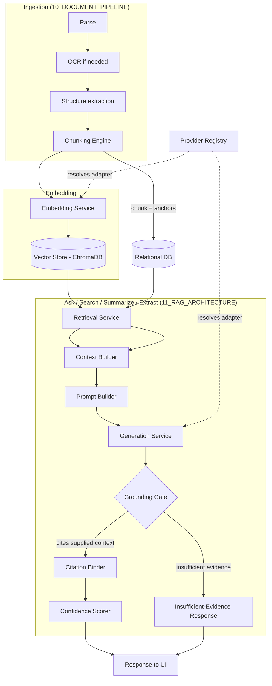
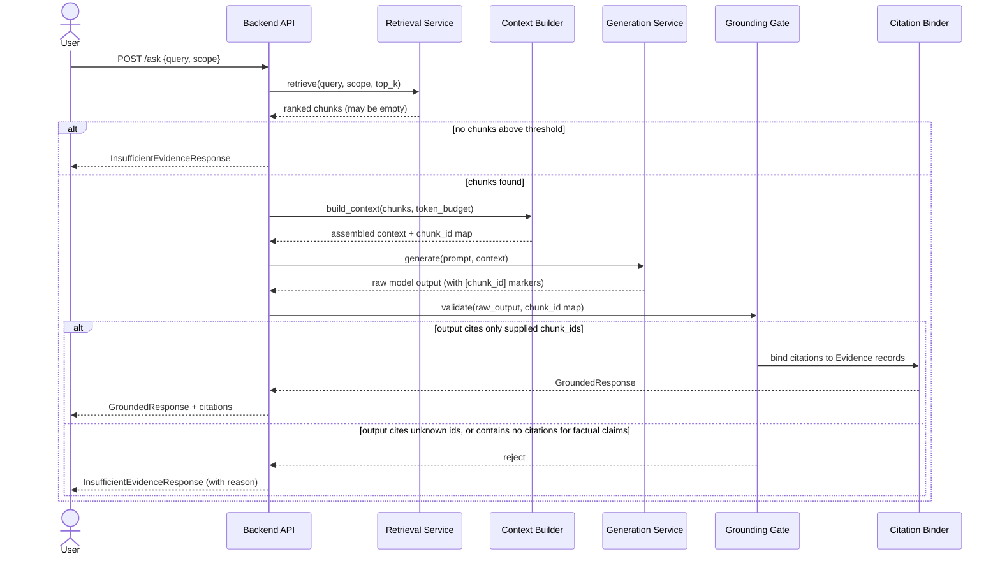

# 09 — AI Architecture

**Product:** DuckDocs
**Document type:** AI subsystem architecture (umbrella)
**Status:** Draft for team review
**Audience:** AI/ML engineering, backend engineering, architecture reviewers
**Upstream:** [01_VISION.md](./01_VISION.md) · [02_PRODUCT_REQUIREMENTS.md](./02_PRODUCT_REQUIREMENTS.md) · [08_SYSTEM_ARCHITECTURE.md](./08_SYSTEM_ARCHITECTURE.md)
**Downstream:** [10_DOCUMENT_PIPELINE.md](./10_DOCUMENT_PIPELINE.md) · [11_RAG_ARCHITECTURE.md](./11_RAG_ARCHITECTURE.md) · [12_PROVIDER_ARCHITECTURE.md](./12_PROVIDER_ARCHITECTURE.md)

---

## 1. Purpose

This document defines the **AI subsystem architecture** for DuckDocs: how the pipeline, retrieval, generation, provider, and provenance subsystems compose into one coherent AI layer, and where the **grounding invariant** (RULE-01, RULE-02 from [02_PRODUCT_REQUIREMENTS.md](./02_PRODUCT_REQUIREMENTS.md)) is mechanically enforced in code — not just in policy.

It is the umbrella document for the AI-facing part of the system. [10_DOCUMENT_PIPELINE.md](./10_DOCUMENT_PIPELINE.md), [11_RAG_ARCHITECTURE.md](./11_RAG_ARCHITECTURE.md), [12_PROVIDER_ARCHITECTURE.md](./12_PROVIDER_ARCHITECTURE.md), and [14_VECTOR_DATABASE.md](./14_VECTOR_DATABASE.md) go deep on their respective subsystems; this document defines the **boundaries, contracts, and lifecycle** that connect them.

---

## 2. Scope

### In scope

- Decomposition of the AI layer into discrete services with typed contracts
- The **grounding gate**: the single enforcement point through which every generated response must pass
- Model role separation (chat/generation vs. embedding) and why they are never coupled
- End-to-end request lifecycle for Ask / Search / Summarize / Extract operations
- Failure and degradation modes at the AI layer (not per-subsystem — see downstream docs)
- Observability and local-only logging of AI operations
- Default model selection rationale for chat and embeddings

### Out of scope

- Ingestion/OCR/chunking internals → [10_DOCUMENT_PIPELINE.md](./10_DOCUMENT_PIPELINE.md)
- Retrieval ranking, prompt construction, citation binding algorithms → [11_RAG_ARCHITECTURE.md](./11_RAG_ARCHITECTURE.md)
- Provider adapter implementation and configuration schema → [12_PROVIDER_ARCHITECTURE.md](./12_PROVIDER_ARCHITECTURE.md)
- Relational schema → [13_DATABASE_DESIGN.md](./13_DATABASE_DESIGN.md)
- Vector index internals → [14_VECTOR_DATABASE.md](./14_VECTOR_DATABASE.md)
- Backend service topology, deployment, and container layout → [08_SYSTEM_ARCHITECTURE.md](./08_SYSTEM_ARCHITECTURE.md), [29_DOCKER_ARCHITECTURE.md](./29_DOCKER_ARCHITECTURE.md)

---

## 3. Goals

| Goal ID | Goal | Maps to |
|---------|------|---------|
| AI-G01 | Every generated response is mechanically forced through a single grounding gate — no code path can bypass it | RULE-01, RULE-02 |
| AI-G02 | Chat/generation and embedding are independent, separately swappable subsystems | G-04, PR-S03 |
| AI-G03 | AI subsystem is composed of small, typed, independently testable services — no monolithic "AI service" | AD-V03, AD-V07 |
| AI-G04 | Default configuration produces a working, grounded answer with zero cloud dependency | G-01, PR-S01 |
| AI-G05 | Every AI operation is inspectable: retrieved context, provider used, model used, and confidence signals are available to the caller | PR-I07, PR-E05 |
| AI-G06 | AI layer degrades predictably and visibly on failure (model down, empty retrieval, low confidence) rather than silently producing unsupported text | RULE-10, PR-Q02 |

---

## 4. AI Subsystem Decomposition

DuckDocs' AI layer is not one service — it is a pipeline of narrow services connected by typed contracts. Each is independently testable and independently replaceable.

| Service | Responsibility | Detailed in |
|---------|----------------|-------------|
| **Ingestion Orchestrator** | Drives a document through parse → OCR → structure extraction → chunk stages; owns `IngestionJob` state | [10](./10_DOCUMENT_PIPELINE.md) |
| **Chunking Engine** | Splits normalized document content into retrieval-sized `Chunk` records with provenance anchors | [10](./10_DOCUMENT_PIPELINE.md) |
| **Embedding Service** | Calls the configured embedding provider to turn chunk text into vectors; writes to the vector store | [12](./12_PROVIDER_ARCHITECTURE.md), [14](./14_VECTOR_DATABASE.md) |
| **Retrieval Service** | Executes similarity search (+ filters) against the vector store; returns ranked candidate chunks | [11](./11_RAG_ARCHITECTURE.md) |
| **Context Builder** | Deduplicates, orders, and budgets retrieved chunks into a bounded context window | [11](./11_RAG_ARCHITECTURE.md) |
| **Prompt Builder** | Constructs task-specific prompts (ask / summarize / extract) with citation-format instructions | [11](./11_RAG_ARCHITECTURE.md) |
| **Generation Service** | Calls the configured chat/generation provider with the assembled prompt | [12](./12_PROVIDER_ARCHITECTURE.md) |
| **Grounding Gate** | The mandatory checkpoint: validates that model output cites only supplied context, or converts to an insufficient-evidence response | This document, [11](./11_RAG_ARCHITECTURE.md) |
| **Citation Binder** | Maps model-emitted chunk references to `Citation`/`Evidence` records with anchors | [11](./11_RAG_ARCHITECTURE.md), [13](./13_DATABASE_DESIGN.md) |
| **Confidence Scorer** | Combines retrieval score, OCR confidence, and coverage into a response-level confidence signal | [11](./11_RAG_ARCHITECTURE.md) |
| **Provider Registry** | Resolves the active chat/embedding provider adapters from configuration | [12](./12_PROVIDER_ARCHITECTURE.md) |

None of these services call an LLM provider directly except **Embedding Service** and **Generation Service** — both go exclusively through the **Provider Registry**, never hard-coded to a vendor SDK.

---

## 5. Architecture Decisions

| ID | Decision | Rationale |
|----|----------|-----------|
| AI-D01 | AI layer implemented as a pipeline of narrow, typed services inside the backend process (not a separate microservice mesh) for P0 | Local-first single-machine deployment does not need network hops between AI stages; service boundaries are enforced in code, not by process isolation |
| AI-D02 | A single **Grounding Gate** function is the only path by which model output becomes a user-visible `Response` | Prevents "just this once" ungrounded shortcuts as the codebase grows |
| AI-D03 | Chat/generation provider and embedding provider are resolved independently via the Provider Registry, never a shared "AI provider" object | Matches PRD AD-P04; a user may run Ollama for chat and a different local embedding model, or cloud chat with local embeddings |
| AI-D04 | Every `Chunk` embedding is tagged with the embedding **provider + model + dimension** used to create it | Enables detection of stale/incompatible vectors when the embedding provider changes (see [14](./14_VECTOR_DATABASE.md) VEC-D05) |
| AI-D05 | Every generated `Response` records the chat provider + model + prompt template version used | Reproducibility and debugging; required for citation trust audits |
| AI-D06 | Default chat model: **Ollama + Gemma 3 1B**. Default embedding model: **Ollama + `nomic-embed-text`** (fallback: local `sentence-transformers/all-MiniLM-L6-v2` if Ollama embedding pull fails) | Keeps the entire default path on local inference with no cloud keys required; `nomic-embed-text` gives solid retrieval quality at low resource cost, matching Gemma 3 1B's small-footprint philosophy |
| AI-D07 | AI operations are synchronous-request/async-job hybrid: ingestion runs as background jobs; Ask/Search/Summarize run as request/response with streaming tokens | Ingestion is long-running and must not block the API; interactive Q&A must feel responsive |
| AI-D08 | All AI-layer logging is local-file/local-DB only; no analytics SDKs, no remote log shipping | RULE-05, C-02 |

### Alternatives rejected

| Alternative | Why rejected |
|-------------|--------------|
| One large "AIService" class handling ingestion, retrieval, and generation | Violates AD-V03 (modular pipeline); untestable in isolation; blocks independent provider/embedding swaps |
| Enforce grounding only via prompt instructions ("please cite your sources") | Prompt-only grounding is unenforceable and silently fails with weaker models (e.g., Gemma 3 1B); DuckDocs requires a code-level gate that can force a refusal |
| Couple chat and embedding to one "model" setting | Breaks PR-S03 and realistic hybrid local/cloud setups |
| Adopt a general-purpose agent framework (e.g., heavy LangChain-style agent loops) for orchestration | Adds indirection and opaque behavior that conflicts with an auditable, evidence-first product; DuckDocs uses thin, explicit service calls instead (see [12](./12_PROVIDER_ARCHITECTURE.md) §10) |
| Run embedding and generation as separate microservices/containers in P0 | Unnecessary operational complexity for a single-machine local product; revisit only if multi-user/team deployment (roadmap) demands horizontal scaling |

---

## 6. Tradeoffs

| Tradeoff | We choose | We accept |
|----------|-----------|-----------|
| Strict grounding gate vs. conversational flexibility | Strict gate; refuse when ungrounded | Occasional "I can't answer from your documents" even when a partial answer might be plausible |
| In-process modular services vs. network-isolated microservices | In-process, typed module boundaries | Must rely on discipline + code review + contract tests instead of process isolation to keep boundaries clean |
| Small default local model (Gemma 3 1B) vs. best-in-class quality | Small model default | Users needing higher quality must configure a larger local model or a cloud provider |
| Synchronous confidence scoring vs. deferred/async scoring | Compute confidence inline before returning response | Adds small latency to every Ask/Search call |
| Recording full provider/model/prompt-version metadata per response | Rich reproducibility metadata | Slightly larger `Response`/`Citation` rows; acceptable given evidence-first mandate |

---

## 7. Data Flow

### 7.1 End-to-end AI layer composition



### 7.2 Grounding Gate sequence (Ask operation)



---

## 8. Interfaces

### 8.1 Core Python-style service contracts

```python
class RetrievedChunk(TypedDict):
    chunk_id: str
    document_id: str
    version_id: str
    text: str
    score: float           # similarity score, 0..1
    metadata: ChunkAnchor  # page/paragraph/line/char/bbox/table cell

class GroundedResponse(TypedDict):
    answer_text: str
    citations: list[Citation]
    confidence: float
    provider_used: ProviderRef
    prompt_template_version: str

class InsufficientEvidenceResponse(TypedDict):
    reason: Literal["no_retrieval_hits", "below_threshold", "gate_rejected_output"]
    query: str
    scope: RetrievalScope

class GroundingGate(Protocol):
    def validate(
        self,
        raw_output: str,
        allowed_chunk_ids: set[str],
    ) -> GroundedResponse | InsufficientEvidenceResponse: ...

class Embedder(Protocol):
    def embed(self, texts: list[str]) -> list[EmbeddingVector]: ...
    @property
    def model_id(self) -> str: ...      # e.g. "ollama:nomic-embed-text"
    @property
    def dimension(self) -> int: ...

class Generator(Protocol):
    def generate(
        self, prompt: str, *, stream: bool = True
    ) -> Iterator[str] | str: ...
    @property
    def model_id(self) -> str: ...      # e.g. "ollama:gemma3:1b"
```

### 8.2 Internal API surface consumed by the backend API layer

| Operation | Entry point | Returns |
|-----------|-------------|---------|
| Ask a question | `ai.ask(query, scope, session_id)` | `GroundedResponse \| InsufficientEvidenceResponse` |
| Semantic search | `ai.search(query, scope, top_k)` | `list[RetrievedChunk]` (no generation) |
| Summarize | `ai.summarize(target, scope)` | `GroundedResponse \| InsufficientEvidenceResponse` |
| Extract | `ai.extract(target, schema)` | `GroundedExtraction \| InsufficientEvidenceResponse` |
| Ingest document | `pipeline.ingest(document_id, version_id)` | `IngestionJob` (async) |

Full HTTP contracts live in [15_API_SPECIFICATION.md](./15_API_SPECIFICATION.md).

---

## 9. Model Roles and Defaults

| Role | Default provider/model | Configurable via | Notes |
|------|------------------------|-------------------|-------|
| Chat / generation | Ollama, `gemma3:1b` | Settings → Providers → Chat | Streams tokens; used for Ask/Summarize/Extract |
| Embeddings | Ollama, `nomic-embed-text` | Settings → Providers → Embeddings | Independent from chat model per AI-D03 |
| OCR (not an "AI provider" in the settings sense) | Tesseract (local, no model config) | [10_DOCUMENT_PIPELINE.md](./10_DOCUMENT_PIPELINE.md) | Not swappable via Provider Registry in P0; pluggable engine in roadmap |

Chat and embedding roles are never satisfied by the same configuration object — each has its own provider type, model name, and connection settings, resolved independently by the Provider Registry (see [12_PROVIDER_ARCHITECTURE.md](./12_PROVIDER_ARCHITECTURE.md)).

---

## 10. Failure Modes and Degradation

| Failure | Detection | Degradation behavior |
|---------|-----------|----------------------|
| Chat provider unreachable (e.g., Ollama not running) | Connection/timeout error from Provider Registry | API returns explicit "generation provider unavailable" error; UI shows actionable fix-it (start Ollama / check Settings); no silent retry loop |
| Embedding provider unreachable during ingestion | Job stage failure | `IngestionJob` marked `failed` at `embed` stage; document stays queryable by earlier-completed metadata but not searchable; visible in Library status (PR-L05) |
| Embedding provider changed after documents already indexed | Dimension/model mismatch detected on retrieval | Retrieval Service flags stale collections; user prompted to re-embed (see [14](./14_VECTOR_DATABASE.md) VEC-D05); old vectors not silently mixed with new-dimension vectors |
| Zero retrieval hits above threshold | Retrieval Service returns empty/low-score set | `InsufficientEvidenceResponse` returned immediately; generation is never invoked (saves local compute) |
| Model output cites a chunk ID not in supplied context (hallucinated citation) | Grounding Gate validation | Response rejected; converted to `InsufficientEvidenceResponse` with reason `gate_rejected_output`; event recorded for QA review |
| Model output has no citations for a factual claim in Ask mode | Grounding Gate heuristic (citation-density check) | Response rejected or flagged low-confidence depending on strictness setting (OQ-V03) |
| Context exceeds model context window | Context Builder token budget check | Context Builder truncates by lowest-ranked chunks first, never truncates mid-chunk across an evidence anchor |
| OCR confidence low on cited region | Confidence Scorer input | Response still returned but confidence signal and UI badge reflect degraded certainty (RULE-10) rather than hiding it |
| Small local model (Gemma 3 1B) produces malformed citation markers | Grounding Gate parser fallback | Parser attempts lenient re-parse once; on repeated failure, gate rejects to insufficient-evidence rather than guessing |

---

## 11. Constraints

| ID | Constraint |
|----|------------|
| AI-C01 | No AI operation may return `answer_text` without either citations or an explicit insufficient-evidence classification |
| AI-C02 | Embedding and chat provider resolution must be independently swappable via configuration only (no code changes) |
| AI-C03 | Default configuration must run entirely on local inference (Ollama) with no outbound network calls |
| AI-C04 | All AI-layer services must be unit-testable without a live model (via fake `Embedder`/`Generator` implementations) |
| AI-C05 | AI-layer logs (prompts, retrieved chunk IDs, provider used) are stored locally only, never transmitted |
| AI-C06 | Every persisted `Response`/`Citation` must record the exact provider, model, and prompt template version used to produce it |

---

## 12. Risks

| Risk | Impact | Mitigation |
|------|--------|-------------|
| Gemma 3 1B is too weak to reliably emit parseable citation markers | Grounding Gate over-rejects, product feels unhelpful | Constrain prompt format to a minimal, low-ambiguity citation syntax; test against small-model behavior explicitly; document stronger-model upgrade path |
| Grounding Gate becomes a bypassable convention rather than an enforced boundary as code grows | Silent regression of evidence-first guarantee | Single code path enforced via architecture tests / lint rule that no other module calls `Generator.generate()` directly outside the Generation Service |
| Provider switch mid-library-life leaves mixed-dimension vectors | Retrieval breaks or silently degrades | Embedding metadata tagging (AI-D04) + explicit re-embed workflow ([14](./14_VECTOR_DATABASE.md)) |
| Confidence scoring formula is opaque to users | Users over-trust or under-trust responses | Confidence breakdown surfaced in evidence inspector (PR-E06), not just a single number |
| Streaming generation complicates grounding validation (can't validate until stream completes) | Latency vs. correctness tension | Stream tokens to UI as provisional; run Grounding Gate on the completed buffer before marking response "final" with citations attached |

---

## 13. Future Extensibility

- Additional model **roles** beyond chat/embedding (e.g., a dedicated re-ranking model, a dedicated OCR-correction model) can be added as new Provider Registry roles without touching existing roles
- Agentic multi-step reasoning (e.g., multi-hop retrieval) can be layered on top of the same Grounding Gate contract — the gate does not assume single-shot retrieval
- Local model fine-tuning/adapters remain out of scope per vision non-goals, but the Provider Registry's `model_id` tagging supports pointing at a fine-tuned local model if that changes
- Multi-user/team deployment can introduce per-user provider configuration without changing the AI subsystem decomposition
- A future re-ranker service can slot between Retrieval Service and Context Builder without changing downstream contracts

---

## 14. Open Questions

| ID | Question | Owner | Needed by |
|----|-----------|-------|-----------|
| AI-OQ01 | How strict should the Grounding Gate's citation-density heuristic be for summaries (which may legitimately paraphrase across many chunks) vs. direct Q&A? | AI + Product | Before [11](./11_RAG_ARCHITECTURE.md) freeze |
| AI-OQ02 | Should confidence scoring be a single scalar or a structured breakdown (retrieval/OCR/coverage) exposed by default? | AI + Design | Before Evidence Inspector UI spec |
| AI-OQ03 | Do we ship a lenient re-parse fallback for malformed citation markers, or fail closed on first malformed output? | AI Eng | Before P0 code freeze |
| AI-OQ04 | Is `nomic-embed-text` via Ollama confirmed to pull reliably on target hardware tiers, or should `all-MiniLM-L6-v2` be the true P0 default? | AI Eng | Before [14](./14_VECTOR_DATABASE.md) freeze (tracks OQ-P03) |

---

## 15. Acceptance Criteria

This document is accepted when:

- [ ] The Grounding Gate is agreed as the single mandatory checkpoint for all generated responses
- [ ] Service decomposition (§4) is approved as the module boundary for backend implementation
- [ ] Default chat and embedding models are approved (or AI-OQ04 is resolved first)
- [ ] Failure/degradation table (§10) is reviewed by Product for UX implications
- [ ] Downstream docs (10, 11, 12, 14) can be written against these contracts without redefining them

---

## 16. Cross-References

| Topic | Document |
|-------|----------|
| Vision principles | [01_VISION.md](./01_VISION.md) |
| Product requirements | [02_PRODUCT_REQUIREMENTS.md](./02_PRODUCT_REQUIREMENTS.md) |
| System architecture | [08_SYSTEM_ARCHITECTURE.md](./08_SYSTEM_ARCHITECTURE.md) |
| Ingestion pipeline | [10_DOCUMENT_PIPELINE.md](./10_DOCUMENT_PIPELINE.md) |
| RAG / grounding details | [11_RAG_ARCHITECTURE.md](./11_RAG_ARCHITECTURE.md) |
| Provider abstraction | [12_PROVIDER_ARCHITECTURE.md](./12_PROVIDER_ARCHITECTURE.md) |
| Relational schema | [13_DATABASE_DESIGN.md](./13_DATABASE_DESIGN.md) |
| Vector store | [14_VECTOR_DATABASE.md](./14_VECTOR_DATABASE.md) |
| API contracts | [15_API_SPECIFICATION.md](./15_API_SPECIFICATION.md) |

---

## Document Control

| Field | Value |
|-------|-------|
| Version | 0.1.0 |
| Last updated | 2026-07-18 |
| Authors | DuckDocs Architecture Team |
| Review state | Pending team review |
| Previous | [08_SYSTEM_ARCHITECTURE.md](./08_SYSTEM_ARCHITECTURE.md) |
| Next | [10_DOCUMENT_PIPELINE.md](./10_DOCUMENT_PIPELINE.md) |
