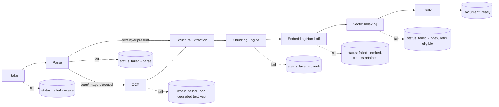
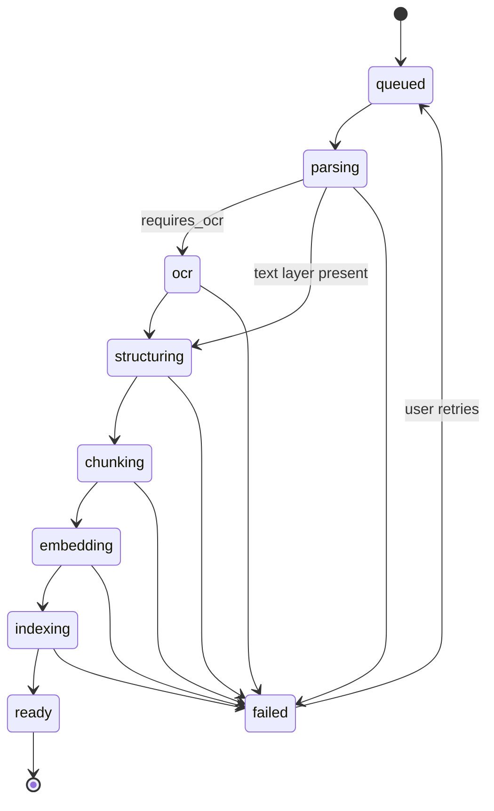

# 10 — Document Pipeline

**Product:** DuckDocs
**Document type:** Ingestion pipeline architecture
**Status:** Draft for team review
**Audience:** Backend engineering, AI engineering, QA
**Upstream:** [09_AI_ARCHITECTURE.md](./09_AI_ARCHITECTURE.md) · [02_PRODUCT_REQUIREMENTS.md](./02_PRODUCT_REQUIREMENTS.md)
**Downstream:** [11_RAG_ARCHITECTURE.md](./11_RAG_ARCHITECTURE.md) · [13_DATABASE_DESIGN.md](./13_DATABASE_DESIGN.md) · [21_FILE_PROCESSING.md](./21_FILE_PROCESSING.md)

---

## 1. Purpose

This document defines the **document ingestion pipeline**: the deterministic sequence of stages that turns an uploaded file into searchable, citable, provenance-rich `Chunk` records. It specifies parser and OCR plugin boundaries, the chunking strategy, evidence-anchor assignment rules, job/status tracking, failure semantics, and how re-ingestion interacts with document versioning.

Ingestion is the point at which the evidence-first principle (G-02, RULE-07) is either earned or lost — anchors assigned here are what every later citation, annotation, and comparison depends on.

---

## 2. Scope

### In scope

- Pipeline stage decomposition (intake → parse → OCR → structure extraction → chunk → embed → index)
- Parser plugin interface and per-format-tier behavior
- OCR integration and confidence propagation
- Chunking strategy (size, overlap, structure-aware splitting, table/code handling)
- Evidence anchor assignment (page/paragraph/line/char/bbox/table cell)
- `IngestionJob` state machine and status reporting
- Failure handling, partial failure, and retry policy
- Re-ingestion and version creation

### Out of scope

- Embedding provider mechanics → [12_PROVIDER_ARCHITECTURE.md](./12_PROVIDER_ARCHITECTURE.md)
- Vector storage internals → [14_VECTOR_DATABASE.md](./14_VECTOR_DATABASE.md)
- Retrieval and generation → [11_RAG_ARCHITECTURE.md](./11_RAG_ARCHITECTURE.md)
- Per-format fidelity matrix and detailed parser library choices → [21_FILE_PROCESSING.md](./21_FILE_PROCESSING.md)
- Relational schema DDL → [13_DATABASE_DESIGN.md](./13_DATABASE_DESIGN.md)

---

## 3. Goals

| Goal ID | Goal | Maps to |
|---------|------|---------|
| PIPE-G01 | Every supported file type is ingested through the same pipeline shape, differing only in plugin implementation | AD-V03, PR-L02 |
| PIPE-G02 | Every chunk carries the finest anchor available for its source fidelity tier | RULE-07, PR-E01, PR-E03 |
| PIPE-G03 | Ingestion status is always visible and actionable; nothing fails silently | PR-L05, PR-L10, RULE-10 |
| PIPE-G04 | Re-ingesting a document produces a new `Version` without destroying prior evidence/citation validity | PR-L07, PR-L08, AD-V06 |
| PIPE-G05 | Pipeline stages are independently testable and independently retryable | AD-V03 |
| PIPE-G06 | Low-confidence extraction (OCR, best-effort parsers) is surfaced, never hidden | RULE-10, AD-P05 |

---

## 4. Pipeline Stage Decomposition

| Stage | Input | Output | Notes |
|-------|-------|--------|-------|
| **Intake** | Uploaded file + metadata | Stored original file (checksum, path), `Document` + `Version` row (status `queued`) | Validates MIME/extension against supported list; rejects unsupported types with actionable error |
| **Parse** | Original file | `ParsedDocument` (pages, blocks, tables, raw text, structural metadata) | Dispatches to a `DocumentParser` plugin by file type category |
| **OCR** (conditional) | Page images / scanned regions from Parse | Recognized text blocks + bounding boxes + per-block confidence | Only invoked for image-derived or scan-detected content; skipped for text-layer PDFs, DOCX, TXT, code, etc. |
| **Structure extraction** | `ParsedDocument` (+ OCR blocks if any) | Normalized document tree: headings, paragraphs, tables, lines, page boundaries | Produces the anchor scaffold chunking will slice against |
| **Chunking** | Normalized document tree | Ordered list of `Chunk` records with text + anchors, not yet embedded | See §6 |
| **Embedding hand-off** | Chunks (batched) | Chunks tagged `embedding_status=pending` enqueued to Embedding Service | See [09](./09_AI_ARCHITECTURE.md) §4, [12](./12_PROVIDER_ARCHITECTURE.md) |
| **Indexing** | Embedded vectors | Vectors written to ChromaDB with `chunk_id`/`document_id`/`version_id` metadata | See [14_VECTOR_DATABASE.md](./14_VECTOR_DATABASE.md) |
| **Finalize** | All prior stages succeeded | `Version.status = ready`, `Document.status = ready` | Document becomes searchable |



---

## 5. Parser Plugin Interface

```python
class ParsedBlock(TypedDict):
    kind: Literal["heading", "paragraph", "table", "code", "image", "list_item"]
    text: str
    page_number: int | None
    heading_level: int | None
    table_ref: TableRef | None      # row/col bounds if kind == "table"
    bbox: BoundingBox | None        # if source is image-derived
    order_index: int                # document-order position

class ParsedDocument(TypedDict):
    blocks: list[ParsedBlock]
    page_count: int | None
    requires_ocr: bool
    fidelity_tier: Literal["full_layout", "structural", "ocr_dependent", "best_effort"]
    parser_id: str                  # e.g. "pdf_text_layer_v1"

class DocumentParser(Protocol):
    supported_mime_types: ClassVar[set[str]]
    def parse(self, file_path: Path) -> ParsedDocument: ...
```

| File category | Parser strategy | Fidelity tier |
|----------------|------------------|---------------|
| PDF (text layer) | Layout-aware text extraction preserving page/line positions | full_layout |
| PDF (scanned/image-only) | Rasterize pages → OCR | ocr_dependent |
| DOCX / ODT | Structured document-model parser (headings, paragraphs, tables) | full_layout |
| TXT / Markdown | Line-based parser | full_layout |
| RTF, legacy DOC/PPT/XLS | Best-effort text + partial structure | best_effort |
| XLSX/CSV/TSV/ODS | Row/column structural parser | structural |
| PPTX/ODP | Slide/shape text extraction | structural |
| PNG/JPG/TIFF/BMP/HEIC/WEBP | Always OCR | ocr_dependent |
| JSON/XML/YAML | Structural/tree parser, path-based anchors | structural |
| Source code (PY/JS/TS/Java/C/C++/C#/Go/Rust/SQL/HTML/CSS) | Line-based parser with optional symbol-aware boundaries (function/class) | full_layout |
| EPUB | Chapter/section structural parser | structural |

Each row above corresponds to a distinct `DocumentParser` implementation registered by MIME type in a `ParserRegistry`. Adding a new format means registering a new plugin — no changes to Intake, Chunking, or downstream stages (PR-EXT01).

---

## 6. Chunking Strategy

### 6.1 Defaults

| Parameter | Default | Configurable |
|-----------|---------|--------------|
| Target chunk size | 512 tokens | Settings (advanced) |
| Chunk overlap | 64 tokens | Settings (advanced) |
| Max chunk size (hard cap) | 768 tokens | Fixed, model-context-aware |
| Splitting priority | heading > paragraph > sentence > token window | Fixed |
| Table chunking unit | one chunk per table row (with header context repeated), plus one whole-table summary chunk for small tables | Fixed for P0 |
| Code chunking unit | function/class block when detectable via lightweight symbol parsing; else fixed line window (60 lines, 10-line overlap) | Fixed for P0 |

### 6.2 Rules

1. **PIPE-R01** — A chunk never crosses a page boundary for `full_layout` sources; page-boundary text is split into two chunks even if under the target size, so every chunk resolves to exactly one page anchor.
2. **PIPE-R02** — A chunk never splits a table row or a bounding-box OCR block; these are atomic evidence units.
3. **PIPE-R03** — Heading text is prepended as context to the first chunk under that heading (for retrieval quality) but is tagged separately in metadata so it is not double-cited as body evidence.
4. **PIPE-R04** — Every chunk records `char_start`/`char_end` relative to the normalized document text stream, in addition to any page/line/bbox anchors, so character-level citation is always possible as a fallback anchor.
5. **PIPE-R05** — Overlap regions are stored once; the overlapping text is a property of adjacent chunk boundaries, not duplicated evidence — citation binding always resolves to the chunk with the tighter/more specific anchor.

### 6.3 Anchor model per fidelity tier

| Fidelity tier | Anchors populated |
|----------------|--------------------|
| full_layout | page, paragraph, line_start/line_end, char_start/char_end |
| structural | section/heading, table row/col (if table), char_start/char_end |
| ocr_dependent | page, bbox coordinates, OCR confidence, char_start/char_end (post-OCR text stream) |
| best_effort | char_start/char_end only, with `fidelity_tier=best_effort` flagged in UI (RULE-10) |

---

## 7. IngestionJob State Machine



| Field | Purpose |
|-------|---------|
| `stage` | Current pipeline stage (enum matching state machine) |
| `progress_pct` | Coarse progress estimate for UI |
| `error_message` | Human-readable, actionable failure detail (PR-Q02) |
| `error_stage` | Which stage failed, for retry targeting |
| `started_at` / `completed_at` | Timing for performance budgets ([04_NON_FUNCTIONAL_REQUIREMENTS.md](./04_NON_FUNCTIONAL_REQUIREMENTS.md)) |
| `retry_count` | Bounded automatic retry (network/transient errors only); parser/format errors do not auto-retry |

---

## 8. Architecture Decisions

| ID | Decision | Rationale |
|----|----------|-----------|
| PIPE-D01 | Pipeline stages are pure functions/services chained by an orchestrator, not a single "ingest()" monolith | Independent testability; matches AI-G03 |
| PIPE-D02 | OCR is a conditional stage, invoked only when the parser reports `requires_ocr=true` | Avoids unnecessary OCR cost on text-layer sources; keeps default path fast |
| PIPE-D03 | Chunking never crosses page boundaries for full-layout sources (PIPE-R01) | Preserves reliable page-level citation, the most common anchor users verify against |
| PIPE-D04 | Char-range anchors are always computed, regardless of fidelity tier | Guarantees every chunk has at least one reliable, format-independent anchor as a fallback (RULE-07) |
| PIPE-D05 | Re-ingestion creates a new `Version`; it never mutates chunks/evidence of a prior version | Citations already issued against version N must remain resolvable after re-ingestion creates version N+1 |
| PIPE-D06 | Failed stages preserve all successfully completed prior-stage artifacts (e.g., a failed `embed` stage keeps parsed/chunked data) | Enables targeted retry without full re-parse; supports PIPE-G03 |
| PIPE-D07 | Tesseract is the default local OCR engine | Zero network dependency, broad language support, mature, no GPU requirement — matches local-first default (resolves OQ-V02) |
| PIPE-D08 | Table rows and OCR bounding-box blocks are atomic (never split across chunks) | A citation to a table cell or scanned line must resolve to one complete, unambiguous chunk |

### Alternatives rejected

| Alternative | Why rejected |
|-------------|---------------|
| Fixed-size token windows with no structural awareness | Cheap but produces citations that land mid-sentence or mid-table-row, damaging trust |
| Always run OCR "just in case" | Wastes local CPU/time on the common case (text-layer PDFs, DOCX, code) |
| Mutate existing chunks/embeddings in place on re-ingestion | Breaks previously issued citations and comparison history (violates RULE-09) |
| Single chunk per page regardless of length | Produces chunks too large for small local models' effective context and dilutes retrieval precision |
| Cloud OCR API as default | Violates local-first default (C-01); acceptable only as an optional configured provider in the future |

---

## 9. Tradeoffs

| Tradeoff | We choose | We accept |
|----------|-----------|-----------|
| Rich anchor metadata vs. ingest speed | Full anchor computation on every chunk | Heavier CPU/time per document; mitigated by background job + progress UI (PR-L05) |
| Structure-aware chunking vs. simplicity | Heading/paragraph/table-aware splitting | More complex chunking engine with per-fidelity-tier branches |
| Keeping failed-stage artifacts vs. storage simplicity | Retain partial pipeline state for retry | Slightly more storage/state to manage per `IngestionJob` |
| Symbol-aware code chunking vs. uniform line windows | Attempt function/class boundaries first | Extra parsing complexity per language; falls back safely to line windows |
| Tesseract default vs. higher-accuracy commercial/cloud OCR | Local, free, no-network OCR | Lower OCR accuracy ceiling on noisy scans; confidence surfaced honestly instead of hidden |

---

## 10. Interfaces

| Interface | Direction | Consumer |
|-----------|-----------|----------|
| `POST /documents` (upload) | External → Intake | Library UI |
| `IngestionOrchestrator.run(document_id, version_id)` | Internal | Job queue worker |
| `DocumentParser.parse(file_path) -> ParsedDocument` | Internal plugin contract | Parse stage |
| `OCREngine.recognize(image) -> list[OCRBlock]` | Internal plugin contract | OCR stage |
| `ChunkingEngine.chunk(structured_doc) -> list[Chunk]` | Internal | Chunking stage |
| `GET /documents/{id}/jobs/{job_id}` | External | Library UI status polling |
| Chunk hand-off to Embedding Service | Internal, see [09_AI_ARCHITECTURE.md](./09_AI_ARCHITECTURE.md) §4 | Embedding Service |

---

## 11. Constraints

| ID | Constraint |
|----|------------|
| PIPE-C01 | Every chunk must have a non-null `char_start`/`char_end` anchor regardless of format |
| PIPE-C02 | OCR must attach a confidence score to every recognized block; confidence must never be fabricated or defaulted to "high" |
| PIPE-C03 | Re-ingestion must never delete or mutate chunks/evidence belonging to a previous `Version` |
| PIPE-C04 | Pipeline must run entirely offline for all P0-listed formats |
| PIPE-C05 | A failed stage must produce a human-readable, actionable error, not a raw stack trace, in `IngestionJob.error_message` |
| PIPE-C06 | Adding a new file type must not require changes to Intake, Chunking-orchestration, Embedding hand-off, or Indexing code — only a new parser (and optionally OCR) plugin |

---

## 12. Risks

| Risk | Impact | Mitigation |
|------|--------|-------------|
| Legacy/best-effort formats (old DOC/PPT/XLS, obscure RTF variants) produce poor structure | Weak anchors, poor citation precision | Label `fidelity_tier=best_effort` in UI; prioritize DOCX/XLSX/PPTX first per OQ-P06 |
| OCR misreads dense/low-quality scans | Wrong or misleading evidence text | Confidence threshold gates UI trust signals; low-confidence regions visually flagged |
| Symbol-aware code chunking mis-detects function boundaries for less common languages | Poor chunk boundaries for those languages | Fallback line-window chunking always available per language; expand symbol parsing incrementally |
| Large documents (very long PDFs, huge spreadsheets) blow ingest time budgets | Poor perceived performance | Chunk/embed in streaming batches; progress reporting; performance budgets defined in [04_NON_FUNCTIONAL_REQUIREMENTS.md](./04_NON_FUNCTIONAL_REQUIREMENTS.md) |
| Re-ingestion volume grows storage (old chunks/vectors retained per version) | Disk usage growth over time | Retention policy for superseded versions defined jointly with [13](./13_DATABASE_DESIGN.md)/[25_PRIVACY.md](./25_PRIVACY.md) |

---

## 13. Future Extensibility

- New parser/OCR plugins registered by MIME type without touching orchestration code (PR-EXT01)
- Pluggable OCR engine selection (Tesseract default; EasyOCR/PaddleOCR as optional alternatives) behind the same `OCREngine` protocol
- Streaming/incremental chunking for very large documents without loading full structure into memory
- Table-aware semantic chunking (grouping related rows) as a P2+ enhancement
- Symbol-aware chunking expansion to more languages using shared AST-lite parsing utilities
- Pipeline stage parallelization (e.g., OCR multiple pages concurrently) as a performance enhancement without changing the stage contract

---

## 14. Open Questions

| ID | Question | Owner | Needed by |
|----|-----------|-------|-----------|
| PIPE-OQ01 | What OCR confidence threshold triggers a UI "low confidence" badge vs. silent acceptance? | AI + Design | Before Evidence Inspector spec |
| PIPE-OQ02 | Should very large documents be chunked/embedded incrementally with partial searchability before the job fully completes? | Eng + Product | Before performance budget freeze |
| PIPE-OQ03 | Retention policy for chunks/vectors of superseded versions — keep indefinitely, or prune after N versions? | Product + Privacy | Before [13](./13_DATABASE_DESIGN.md) freeze |
| PIPE-OQ04 | Which languages get symbol-aware code chunking in P0 vs. line-window fallback? | Eng | Before P0 scope freeze |

---

## 15. Acceptance Criteria

This document is accepted when:

- [ ] Stage decomposition (§4) and state machine (§7) are approved as the ingestion implementation contract
- [ ] Chunking rules (§6) are approved, including table/code atomic-unit handling
- [ ] Parser plugin interface is approved as extensible without core rewrites
- [ ] Failure/retry semantics (§7, §12) are reviewed against PR-L10 and RULE-10
- [ ] Default OCR engine decision (PIPE-D07) is accepted or escalated for revision

---

## 16. Cross-References

| Topic | Document |
|-------|----------|
| AI subsystem overview | [09_AI_ARCHITECTURE.md](./09_AI_ARCHITECTURE.md) |
| Retrieval / generation | [11_RAG_ARCHITECTURE.md](./11_RAG_ARCHITECTURE.md) |
| Provider abstraction | [12_PROVIDER_ARCHITECTURE.md](./12_PROVIDER_ARCHITECTURE.md) |
| Relational schema | [13_DATABASE_DESIGN.md](./13_DATABASE_DESIGN.md) |
| Vector store | [14_VECTOR_DATABASE.md](./14_VECTOR_DATABASE.md) |
| File processing / fidelity matrix | [21_FILE_PROCESSING.md](./21_FILE_PROCESSING.md) |
| Non-functional requirements | [04_NON_FUNCTIONAL_REQUIREMENTS.md](./04_NON_FUNCTIONAL_REQUIREMENTS.md) |

---

## Document Control

| Field | Value |
|-------|-------|
| Version | 0.1.0 |
| Last updated | 2026-07-18 |
| Authors | DuckDocs Architecture Team |
| Review state | Pending team review |
| Previous | [09_AI_ARCHITECTURE.md](./09_AI_ARCHITECTURE.md) |
| Next | [11_RAG_ARCHITECTURE.md](./11_RAG_ARCHITECTURE.md) |
