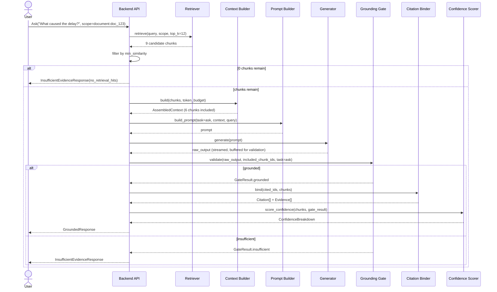

# 11 — RAG Architecture

**Product:** DuckDocs
**Document type:** Retrieval-augmented generation & grounding architecture
**Status:** Draft for team review
**Audience:** AI engineering, backend engineering, QA
**Upstream:** [09_AI_ARCHITECTURE.md](./09_AI_ARCHITECTURE.md) · [10_DOCUMENT_PIPELINE.md](./10_DOCUMENT_PIPELINE.md)
**Downstream:** [12_PROVIDER_ARCHITECTURE.md](./12_PROVIDER_ARCHITECTURE.md) · [13_DATABASE_DESIGN.md](./13_DATABASE_DESIGN.md) · [14_VECTOR_DATABASE.md](./14_VECTOR_DATABASE.md)

---

## 1. Purpose

This document specifies **how DuckDocs retrieves evidence, assembles context, generates responses, and mechanically enforces grounding** for every AI-facing operation: Ask, Search, Summarize, and Extract. It is the detailed design behind the "Grounding Gate" introduced in [09_AI_ARCHITECTURE.md](./09_AI_ARCHITECTURE.md) §7–8.

This is the most product-critical AI document: it defines the exact algorithm by which DuckDocs keeps the promise that "the model is never the source of truth" (RULE-01).

---

## 2. Scope

### In scope

- Retrieval strategy: query embedding, similarity search, filters/scope, thresholding
- Context assembly: deduplication, ordering, token budgeting
- Prompt construction per task (ask/search/summarize/extract) and citation-format contract
- Grounding Gate validation algorithm (citation-marker parsing, allowed-ID checking, citation-density heuristics)
- Citation binding: mapping model output back to `Evidence`/`Citation` records
- Confidence scoring model
- Insufficient-evidence decision logic
- Retrieval scope control (single document, selection, whole library)
- Retrieval quality evaluation approach

### Out of scope

- Ingestion/chunking mechanics → [10_DOCUMENT_PIPELINE.md](./10_DOCUMENT_PIPELINE.md)
- Provider adapter implementation → [12_PROVIDER_ARCHITECTURE.md](./12_PROVIDER_ARCHITECTURE.md)
- Vector index internals (collections, distance metric, persistence) → [14_VECTOR_DATABASE.md](./14_VECTOR_DATABASE.md)
- Relational schema DDL → [13_DATABASE_DESIGN.md](./13_DATABASE_DESIGN.md)
- Annotation/comparison/export UX → [07_FEATURE_SPECIFICATION.md](./07_FEATURE_SPECIFICATION.md)

---

## 3. Goals

| Goal ID | Goal | Maps to |
|---------|------|---------|
| RAG-G01 | Retrieval always runs before generation; generation never receives an unconstrained/open prompt | RULE-01, PR-I08 |
| RAG-G02 | Every factual claim in a generated response is traceable to a specific retrieved chunk | RULE-02, PR-I05 |
| RAG-G03 | The system explicitly refuses (rather than guesses) when retrieved evidence is insufficient | PR-I06, RULE-02 |
| RAG-G04 | Retrieval scope is controllable: one document, a selection, or the whole library | PR-I09 |
| RAG-G05 | Retrieved chunks and retrieval metadata are inspectable by the user | PR-I07 |
| RAG-G06 | Confidence is computed from real signals (retrieval score, OCR confidence, coverage), never fabricated | RULE-10, PR-E05 |
| RAG-G07 | The same grounding pipeline serves Ask, Summarize, and Extract — task-specific behavior lives in prompt templates, not in separate grounding logic | AI-G01 |

---

## 4. Retrieval Strategy

### 4.1 Query path

1. **Query embedding** — the user's natural-language query (or a normalized target description for Summarize/Extract) is embedded using the **active embedding provider** (must match the provider/model/dimension used to index the target chunks — see [14](./14_VECTOR_DATABASE.md) VEC-D05).
2. **Scoped similarity search** — ChromaDB is queried with metadata filters constrained to the requested `RetrievalScope` (`document_id`, `version_id` set, or unscoped for whole-library).
3. **Top-k candidate retrieval** — default `top_k = 12` candidates fetched (configurable), over-fetched relative to the context budget to allow for post-filtering.
4. **Score thresholding** — candidates below `min_similarity` (default cosine similarity `0.35`, tunable) are dropped before context assembly.
5. **Optional keyword boost (P1+)** — lightweight lexical overlap boost for exact-term queries (e.g., IDs, proper nouns) that dense embeddings under-rank; implemented as a re-rank pass, not a replacement for vector search.

```python
class RetrievalScope(TypedDict):
    mode: Literal["document", "selection", "library"]
    document_ids: list[str] | None
    version_ids: list[str] | None   # pins retrieval to a specific version snapshot

class RetrievalRequest(TypedDict):
    query: str
    scope: RetrievalScope
    top_k: int
    min_similarity: float

class Retriever(Protocol):
    def retrieve(self, request: RetrievalRequest) -> list[RetrievedChunk]: ...
```

### 4.2 Scope resolution rules

| Scope mode | Behavior |
|------------|----------|
| `document` | Filter to the latest `ready` version of the specified document unless a `version_id` is explicitly pinned (needed for "ask about this version" and comparison workflows) |
| `selection` | Filter to an explicit set of document/version IDs chosen by the user |
| `library` | No document filter; search across all `ready` documents the user has not excluded |

RAG-R01: Retrieval always resolves to specific `version_id`s at query time and records them on the response, so a later re-ingestion cannot silently change what an already-issued answer's citations point to.

---

## 5. Context Assembly

The **Context Builder** turns ranked chunks into a bounded, ordered, citation-ready block of text.

| Step | Behavior |
|------|----------|
| Deduplicate | Overlapping/duplicate chunk text (e.g., from chunk overlap regions) collapsed to the higher-scored chunk |
| Order | Chunks ordered by document → page/position (not by raw score) once selected, so multi-chunk context reads coherently for the model |
| Token budget | Reserve a fixed budget for system+task prompt and expected output; fill remaining budget with highest-scored chunks first; drop lowest-scored chunks entirely (never truncate mid-chunk, per PIPE-R01/R02) |
| Chunk labeling | Each chunk is wrapped with an explicit, stable `[[chunk:<chunk_id>]] ... [[/chunk]]` marker pair so the model can cite by ID |
| Coverage tracking | Context Builder records which `document_id`s made it into the final context, used later by the Confidence Scorer |

```python
class AssembledContext(TypedDict):
    prompt_context: str                 # chunk-marked text block
    included_chunk_ids: list[str]
    excluded_chunk_ids: list[str]       # scored but dropped for budget
    documents_covered: set[str]

class ContextBuilder(Protocol):
    def build(
        self, chunks: list[RetrievedChunk], token_budget: int
    ) -> AssembledContext: ...
```

Default token budgets (tunable per active chat model's context window):

| Model context window | Reserved for system+task prompt | Reserved for output | Available for context |
|------------------------|----------------------------------|----------------------|-------------------------|
| 8K (e.g., Gemma 3 1B default) | ~800 tokens | ~1200 tokens | ~6000 tokens |
| 32K+ (larger local/cloud models) | ~1000 tokens | ~2000 tokens | ~29000 tokens |

---

## 6. Prompt Construction

Each task has a dedicated **prompt template**, versioned (`prompt_template_version`) and recorded on every response for reproducibility (AI-D05).

| Task | Template behavior |
|------|--------------------|
| **Ask** | System instructions enforce: answer only from provided context; cite every factual sentence with `[chunk:<id>]`; if context is insufficient, respond with the fixed refusal token `INSUFFICIENT_EVIDENCE` instead of guessing |
| **Search** | No generation call — retrieval-only; ranked chunks returned directly to UI (RAG-R02) |
| **Summarize** | Same citation contract as Ask, but citation density expectation is per-paragraph rather than per-sentence (see RAG-OQ01) |
| **Extract** | Structured-output template: model returns a JSON object matching a caller-supplied schema, with each populated field carrying a `chunk_id` reference; fields with no supporting evidence are explicitly `null`, never guessed |

### 6.1 Citation marker contract

The model is instructed to emit inline markers referencing only the `chunk_id`s present in the supplied context:

```text
Water damage was noted on the east wall [chunk:c_8f21]. The lease
was signed on 2024-03-01 [chunk:c_8f22].
```

This minimal, low-ambiguity format is chosen specifically because it must be reliably producible by a **small local model (Gemma 3 1B)** — see [09_AI_ARCHITECTURE.md](./09_AI_ARCHITECTURE.md) §10 and Risks below.

### 6.2 Refusal contract

If the model determines the supplied context cannot answer the query, it must emit the literal token `INSUFFICIENT_EVIDENCE` (optionally followed by a one-line reason) instead of attempting a partial or speculative answer. This is reinforced by the Grounding Gate independently of the model's own judgment (§7).

---

## 7. Grounding Gate — Detailed Algorithm

The Grounding Gate is the single function through which raw model output becomes either a `GroundedResponse` or an `InsufficientEvidenceResponse`. It performs **no generation itself** — it is a validator.

```python
def validate(raw_output: str, allowed_chunk_ids: set[str], task: TaskType) -> GateResult:
    if raw_output.strip() == "INSUFFICIENT_EVIDENCE" or raw_output.startswith("INSUFFICIENT_EVIDENCE"):
        return GateResult.insufficient(reason="model_declined")

    cited_ids = extract_citation_markers(raw_output)          # regex: \[chunk:(\w+)\]
    unknown_ids = cited_ids - allowed_chunk_ids
    if unknown_ids:
        return GateResult.insufficient(reason="gate_rejected_output",
                                        detail=f"unknown chunk ids: {unknown_ids}")

    if requires_citation_density_check(task):
        sentences = split_sentences(raw_output)
        uncited_factual = [s for s in sentences if is_factual_claim(s) and not has_citation_marker(s)]
        if citation_density_below_threshold(sentences, uncited_factual, task):
            return GateResult.insufficient(reason="citation_density_low",
                                            detail=uncited_factual)

    return GateResult.grounded(cited_ids=cited_ids, text=raw_output)
```

| Check | Purpose | Failure outcome |
|-------|---------|------------------|
| Explicit refusal token | Respect model's own "I don't know" | `InsufficientEvidenceResponse`, `reason=model_declined` |
| Unknown chunk ID citation | Detect hallucinated or malformed citations | `InsufficientEvidenceResponse`, `reason=gate_rejected_output` |
| Citation-density heuristic | Detect factual claims with zero citation | `InsufficientEvidenceResponse`, `reason=citation_density_low` (Ask/Extract); logged as low-confidence rather than rejected for Summarize per RAG-OQ01 |
| Malformed marker syntax | Small-model output may mis-format markers | One lenient re-parse pass (fuzzy bracket matching); still-unparseable output fails closed |

RAG-R03: The Grounding Gate never edits or "fixes" model text to add missing citations. It only accepts or rejects. Silent repair would reintroduce ungrounded content under the appearance of citation.

---

## 8. Citation Binding

Once the Grounding Gate accepts output, the **Citation Binder** converts each `[chunk:<id>]` marker into a persisted `Citation` row linked to an `Evidence` anchor.

```python
class Citation(TypedDict):
    id: str
    response_id: str
    chunk_id: str
    evidence_id: str
    document_id: str
    version_id: str
    rank: int                 # order of appearance in the answer
    similarity_score: float
    snippet_text: str         # exact chunk text cited, frozen at response time
```

Binding rules:

- **RAG-R04**: The `snippet_text` and anchor data are copied (frozen) onto the `Citation`/`Evidence` record at response time, not re-derived later, so citations remain stable even if the source chunk is later modified by re-ingestion.
- **RAG-R05**: If a chunk's evidence anchor includes a bbox or table cell, the citation inherits that anchor directly — no re-derivation of layout at click-time.
- **RAG-R06**: Multiple markers citing the same `chunk_id` within one response bind to a single `Citation` row with multiple `rank` occurrences tracked, avoiding duplicate evidence rows.

---

## 9. Confidence Scoring

```python
def score_confidence(chunks: list[RetrievedChunk], gate_result: GateResult) -> ConfidenceBreakdown:
    retrieval_component = mean(c.score for c in chunks if c.chunk_id in gate_result.cited_ids)
    ocr_component = mean(c.metadata.ocr_confidence for c in chunks
                          if c.metadata.ocr_confidence is not None) or 1.0
    coverage_component = len(gate_result.cited_ids) / max(1, len(chunks))
    overall = weighted_average(
        retrieval_component, ocr_component, coverage_component,
        weights=(0.5, 0.3, 0.2),
    )
    return ConfidenceBreakdown(overall, retrieval_component, ocr_component, coverage_component)
```

| Component | Signal source | Weight (default) |
|-----------|----------------|--------------------|
| Retrieval score | Vector similarity of cited chunks | 0.5 |
| OCR confidence | Mean OCR confidence of cited OCR-derived chunks (1.0 if none are OCR-derived) | 0.3 |
| Coverage | Fraction of retrieved-and-supplied chunks actually cited | 0.2 |

Confidence is exposed both as a single scalar (list/summary views) and as a full breakdown (Evidence Inspector, PR-E06) — never hidden behind a single opaque "high/medium/low" label without the underlying components available on demand.

---

## 10. Architecture Decisions

| ID | Decision | Rationale |
|----|----------|-----------|
| RAG-D01 | Retrieval is always dense-vector-first; lexical/keyword boosting is an additive re-rank, not a replacement | Dense retrieval handles paraphrase/semantic queries central to G-02; pure keyword search was already rejected at the vision level |
| RAG-D02 | The Grounding Gate is purely a validator with no generation authority | Keeps the enforcement boundary simple, testable, and impossible to "half-trust" |
| RAG-D03 | Citation snippets are frozen at response time, not live-derived | Prevents citations from silently changing meaning if source content is edited/re-ingested later |
| RAG-D04 | Search (no generation) is a first-class retrieval-only operation, not a "fake Ask" | Matches PR-I01 as distinct from PR-I02; saves local compute by skipping generation entirely |
| RAG-D05 | Extract uses structured JSON output with per-field citations rather than free text | Structured data requires per-field evidence, not a single response-level citation list |
| RAG-D06 | Confidence is a weighted blend of three concrete signals, always inspectable in breakdown form | Avoids a black-box confidence number that erodes the evidence-first trust model |
| RAG-D07 | Citation density strictness differs by task (Ask/Extract strict, Summarize lenient-but-flagged) | Summaries legitimately synthesize across many chunks; over-strict citation rules would make summarization unusable |

### Alternatives rejected

| Alternative | Why rejected |
|-------------|---------------|
| Let the model decide citation format freely (no fixed marker syntax) | Unparseable/inconsistent output from small local models; breaks Citation Binder determinism |
| Trust the model's stated confidence ("I'm 90% sure") as the confidence signal | LLM self-reported confidence is unreliable and not evidence-based (violates RULE-01) |
| Single combined retrieval+generation call via a hosted "RAG API" | Removes the explicit code-level grounding checkpoint DuckDocs requires; also reintroduces a cloud dependency by default |
| Silent auto-repair of malformed citations | Risks attaching a citation to the wrong evidence, worse than refusing |
| Keyword/BM25-only retrieval | Misses semantic/paraphrase queries central to the product's value proposition (G-02) |

---

## 11. Tradeoffs

| Tradeoff | We choose | We accept |
|----------|-----------|-----------|
| Strict per-sentence citation (Ask) vs. natural prose | Strict, slightly more mechanical answer style | Answers read a bit more clinical/annotated than a generic chatbot |
| Fixed low-ambiguity marker syntax vs. richer citation formats | Simple `[chunk:id]` marker | Less expressive than footnote-style multi-source citation; acceptable for P0, extensible later |
| Over-fetching candidates (top_k=12) vs. minimal retrieval cost | Slightly higher vector search cost per query | Better post-filtering/dedup quality, negligible cost on local ChromaDB at target library sizes |
| Version-pinned retrieval vs. always-latest | Deterministic, reproducible citations | Long-lived chat sessions may not automatically reflect a newer document version until user explicitly refreshes scope |
| Lenient citation density for Summarize vs. uniform strictness | Usable summaries | Slightly higher risk of a lightly-under-cited summary sentence; mitigated by confidence flagging |

---

## 12. Data Flow



---

## 13. Interfaces

| Interface | Direction | Notes |
|-----------|-----------|-------|
| `POST /ask` | External | Returns `GroundedResponse \| InsufficientEvidenceResponse`, streams tokens then finalizes with citations |
| `POST /search` | External | Retrieval-only, returns `list[RetrievedChunk]`, no generation |
| `POST /summarize` | External | Same response shape as Ask; `scope` may include multi-document targets |
| `POST /extract` | External | Accepts a field schema; returns `GroundedExtraction` (per-field citations) or insufficient-evidence |
| `GET /responses/{id}/evidence` | External | Evidence Inspector data: full confidence breakdown + retrieved-but-excluded chunks (PR-E06) |
| `Retriever`, `ContextBuilder`, `PromptBuilder`, `GroundingGate`, `CitationBinder`, `ConfidenceScorer` | Internal | Each independently unit-testable with fixture chunks/outputs |

---

## 14. Constraints

| ID | Constraint |
|----|------------|
| RAG-C01 | Generation is never invoked when zero chunks pass the similarity threshold |
| RAG-C02 | The Grounding Gate must reject any output citing a chunk ID not present in the supplied context |
| RAG-C03 | Citation snippets/anchors are frozen at response creation time |
| RAG-C04 | Confidence scores must be derived only from retrieval score, OCR confidence, and coverage — no model self-reported confidence |
| RAG-C05 | Retrieval must resolve to explicit `version_id`s at query time, recorded on the response |
| RAG-C06 | Search (PR-I01) must be servable without invoking the Generator at all |

---

## 15. Risks

| Risk | Impact | Mitigation |
|------|--------|-------------|
| Gemma 3 1B fails to consistently emit correctly formatted `[chunk:id]` markers | High rejection/refusal rate, poor perceived answer quality | Keep marker syntax minimal; include few-shot examples in system prompt; lenient one-pass re-parse; escalate to AI-OQ03 |
| Citation-density heuristic false-positives on naturally citation-light but correct sentences (e.g., "In summary,") | Unnecessary refusals | Exempt non-factual connective sentences from the density check via lightweight classification |
| Query embedding computed with a different provider/model than indexed chunks after a provider switch | Retrieval silently degrades or returns irrelevant chunks | Enforced dimension/model match check before querying (see [14](./14_VECTOR_DATABASE.md) VEC-C03) |
| Whole-library retrieval scope becomes slow as library grows | Latency regression | Chunk/result caps, ANN index tuning, performance budgets in NFR doc |
| Structured Extract schema too rigid for varied documents | Frequent null fields, low perceived usefulness | Allow user-defined/adjustable extraction schemas (P1, PR-I04) with clear "field not found in evidence" messaging |

---

## 16. Future Extensibility

- Multi-hop retrieval (retrieve → reason → retrieve again) can be added as an additional loop **before** the Grounding Gate; the gate contract does not change
- Cross-document citation graphs (PR-E07) can be built from the persisted `Citation` table without changing the binding algorithm
- Re-ranking models can be inserted between Retriever and Context Builder behind the same `RetrievedChunk` contract
- Additional task templates (e.g., structured Q&A forms, comparison-aware prompts) plug into the same Prompt Builder / Grounding Gate pipeline
- Hybrid dense+lexical retrieval can be promoted from optional boost to default without changing downstream contracts

---

## 17. Open Questions

| ID | Question | Owner | Needed by |
|----|-----------|-------|-----------|
| RAG-OQ01 | Exact citation-density threshold formula for Summarize (per-paragraph vs. per-claim) | AI + Product | Before P0 prompt template freeze |
| RAG-OQ02 | Should Extract support user-editable schemas in P0 or fixed common schemas only? | Product + Eng | Before PR-I04 scoping |
| RAG-OQ03 | Default `top_k` and `min_similarity` — validated against real local model behavior or placeholder? | AI Eng | Before QA acceptance test design |
| RAG-OQ04 | Should whole-library scope have a maximum document count guardrail in P0? | Platform + Product | Before NFR freeze |

---

## 18. Acceptance Criteria

This document is accepted when:

- [ ] Grounding Gate algorithm (§7) is approved as the mandatory, non-bypassable validation path
- [ ] Citation marker syntax and prompt contract (§6) are approved as implementable against Gemma 3 1B
- [ ] Confidence scoring formula (§9) is approved as sufficiently transparent for Evidence Inspector design
- [ ] Retrieval scope model (§4.2) covers PR-I09 (document/selection/library) without gaps
- [ ] Extract's structured, per-field citation model (§6, RAG-D05) is approved by Product

---

## 19. Cross-References

| Topic | Document |
|-------|----------|
| AI subsystem overview | [09_AI_ARCHITECTURE.md](./09_AI_ARCHITECTURE.md) |
| Ingestion pipeline | [10_DOCUMENT_PIPELINE.md](./10_DOCUMENT_PIPELINE.md) |
| Provider abstraction | [12_PROVIDER_ARCHITECTURE.md](./12_PROVIDER_ARCHITECTURE.md) |
| Relational schema | [13_DATABASE_DESIGN.md](./13_DATABASE_DESIGN.md) |
| Vector store | [14_VECTOR_DATABASE.md](./14_VECTOR_DATABASE.md) |
| Feature specification | [07_FEATURE_SPECIFICATION.md](./07_FEATURE_SPECIFICATION.md) |

---

## Document Control

| Field | Value |
|-------|-------|
| Version | 0.1.0 |
| Last updated | 2026-07-18 |
| Authors | DuckDocs Architecture Team |
| Review state | Pending team review |
| Previous | [10_DOCUMENT_PIPELINE.md](./10_DOCUMENT_PIPELINE.md) |
| Next | [12_PROVIDER_ARCHITECTURE.md](./12_PROVIDER_ARCHITECTURE.md) |
