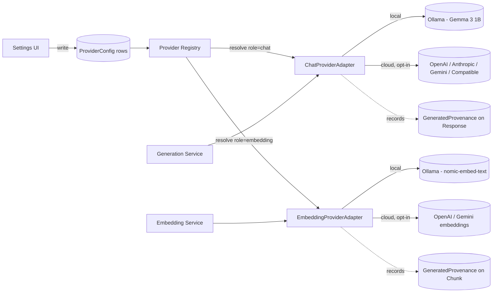

# 12 — Provider Architecture

**Product:** DuckDocs
**Document type:** AI provider abstraction & configuration architecture
**Status:** Draft for team review
**Audience:** Backend engineering, AI engineering, security
**Upstream:** [09_AI_ARCHITECTURE.md](./09_AI_ARCHITECTURE.md) · [11_RAG_ARCHITECTURE.md](./11_RAG_ARCHITECTURE.md)
**Downstream:** [13_DATABASE_DESIGN.md](./13_DATABASE_DESIGN.md) · [26_CONFIGURATION.md](./26_CONFIGURATION.md) · [27_SETTINGS.md](./27_SETTINGS.md)

---

## 1. Purpose

This document defines the **provider abstraction layer**: the interfaces, configuration model, and lifecycle rules that make chat/generation and embedding backends swappable via configuration only (PR-S04, RULE-08). It specifies the adapter contracts for Ollama, OpenAI, Anthropic, Gemini, and OpenAI-compatible endpoints, credential handling, health checking, and how provider identity is bound to generated content for reproducibility.

---

## 2. Scope

### In scope

- `ChatProviderAdapter` and `EmbeddingProviderAdapter` interfaces
- Provider Registry: resolution, factory pattern, configuration precedence
- Supported provider matrix and capability differences
- Configuration schema and storage (local, no cloud config service)
- Credential storage and security posture
- Health check / connectivity testing (PR-S08)
- Provider identity binding on generated content
- Contract testing strategy for provider adapters

### Out of scope

- Retrieval/grounding logic that calls these adapters → [11_RAG_ARCHITECTURE.md](./11_RAG_ARCHITECTURE.md)
- Embedding storage/indexing → [14_VECTOR_DATABASE.md](./14_VECTOR_DATABASE.md)
- Settings UI design → [27_SETTINGS.md](./27_SETTINGS.md)
- Full configuration file format/precedence rules across the whole app → [26_CONFIGURATION.md](./26_CONFIGURATION.md) (this document defines the AI-provider-specific slice of it)

---

## 3. Goals

| Goal ID | Goal | Maps to |
|---------|------|---------|
| PROV-G01 | Chat and embedding providers are configured, resolved, and swapped completely independently | PR-S03, AD-P04 |
| PROV-G02 | Switching providers requires configuration only — zero code changes, zero redeploy | PR-S04, RULE-08 |
| PROV-G03 | Every response records exactly which provider/model produced it | AI-D05 |
| PROV-G04 | Cloud provider use is opt-in, visibly indicated, and never silently triggered | RULE-04, PR-S06 |
| PROV-G05 | Adding a new provider type requires implementing one adapter interface, not touching AI/RAG/pipeline code | AD-V04, PR-EXT01 |
| PROV-G06 | Provider connectivity can be tested from Settings without sending library documents unless explicitly included | PR-S08 |

---

## 4. Provider Adapter Interfaces

```python
class ProviderRef(TypedDict):
    role: Literal["chat", "embedding"]
    provider_type: Literal["ollama", "openai", "anthropic", "gemini", "openai_compatible"]
    model_name: str
    base_url: str | None          # required for ollama / openai_compatible
    config_id: str                # references ProviderConfig row

class ChatProviderAdapter(Protocol):
    ref: ProviderRef
    def generate(self, prompt: str, *, stream: bool = True) -> Iterator[str] | str: ...
    def health_check(self) -> HealthStatus: ...
    @property
    def context_window(self) -> int: ...

class EmbeddingProviderAdapter(Protocol):
    ref: ProviderRef
    def embed(self, texts: list[str]) -> list[list[float]]: ...
    def health_check(self) -> HealthStatus: ...
    @property
    def dimension(self) -> int: ...

class HealthStatus(TypedDict):
    reachable: bool
    latency_ms: float | None
    error: str | None
    checked_at: datetime
```

Both adapter types share the same shape deliberately: `ref`, a primary capability method, `health_check()`, and a capability property (`context_window` / `dimension`). This symmetry is what lets the Provider Registry treat chat and embedding resolution uniformly while keeping them functionally independent.

---

## 5. Provider Registry

```python
class ProviderRegistry:
    def get_chat_provider(self) -> ChatProviderAdapter: ...
    def get_embedding_provider(self) -> EmbeddingProviderAdapter: ...
    def resolve(self, config_id: str) -> ChatProviderAdapter | EmbeddingProviderAdapter: ...
    def test_connectivity(self, config_id: str) -> HealthStatus: ...
```

Resolution order for each role (chat, embedding), evaluated independently:

1. Explicit per-request override (rare; e.g., internal QA tooling) — not exposed in P0 UI
2. Active `ProviderConfig` row marked `is_default=true` for that role
3. Hard-coded fallback default (Ollama `gemma3:1b` for chat; Ollama `nomic-embed-text` for embedding) if no config row exists yet (fresh install)

The registry is a thin factory: it does not itself call any provider SDK. Each `provider_type` maps to a concrete adapter class registered in a `PROVIDER_ADAPTERS` table, keyed by `provider_type`.

---

## 6. Supported Provider Matrix

| Provider type | Role(s) | Network | Auth | Notes |
|----------------|---------|---------|------|-------|
| `ollama` | chat, embedding | Local (default `http://localhost:11434`) | None | Default for both roles; zero-cloud path |
| `openai` | chat, embedding | Cloud | API key | Chat: GPT-family models; Embedding: `text-embedding-3-*` family |
| `anthropic` | chat | Cloud | API key | Claude family; no first-party embedding API — embedding role not offered for this provider type |
| `gemini` | chat, embedding | Cloud | API key | Gemini chat + embedding models |
| `openai_compatible` | chat, embedding | User-specified base URL | Optional API key | Covers self-hosted (vLLM, LM Studio, LocalAI) and third-party OpenAI-API-compatible endpoints |

PROV-R01: Each `provider_type` declares which roles it supports; the Settings UI only offers roles the selected provider type actually implements (e.g., Anthropic is chat-only in the registry).

---

## 7. Configuration Schema

```yaml
# Illustrative shape of a ProviderConfig row (persisted in relational DB, see 13_DATABASE_DESIGN.md)
provider_configs:
  - id: "cfg_chat_default"
    role: chat
    provider_type: ollama
    model_name: "gemma3:1b"
    base_url: "http://localhost:11434"
    api_key_ref: null
    is_default: true
    created_at: "2026-07-18T00:00:00Z"

  - id: "cfg_embed_default"
    role: embedding
    provider_type: ollama
    model_name: "nomic-embed-text"
    base_url: "http://localhost:11434"
    api_key_ref: null
    is_default: true
    created_at: "2026-07-18T00:00:00Z"

  - id: "cfg_chat_openai_optional"
    role: chat
    provider_type: openai
    model_name: "gpt-4.1-mini"
    base_url: null
    api_key_ref: "secret:openai_chat_key"
    is_default: false
    created_at: "2026-07-18T00:00:00Z"
```

| Field | Notes |
|-------|-------|
| `role` | `chat` or `embedding`, independently configured (PROV-G01) |
| `provider_type` | Enum matching §6 |
| `model_name` | Free-text model identifier, provider-specific |
| `base_url` | Required for `ollama`/`openai_compatible`; null for hosted-only providers using default endpoints |
| `api_key_ref` | Indirect reference into local secret storage — never the raw key inline in the config row (§8) |
| `is_default` | Exactly one default per role at any time |

Full precedence rules (env var vs. Settings UI vs. config file) are defined in [26_CONFIGURATION.md](./26_CONFIGURATION.md); this document defines only the provider-specific schema shape.

---

## 8. Credential Storage and Security

| Rule | Detail |
|------|--------|
| PROV-C01 | API keys are never stored in plaintext inside the relational DB row; `ProviderConfig.api_key_ref` points to a local encrypted secret store (OS keychain where available, else an encrypted local file) |
| PROV-C02 | API keys are never logged, including in debug/verbose AI-layer logs |
| PROV-C03 | Local provider types (`ollama`) never require or accept an API key |
| PROV-C04 | Connectivity tests (PR-S08) send only a minimal synthetic ping payload by default; including real library content in a test requires an explicit opt-in checkbox per test run |
| PROV-C05 | Deleting a `ProviderConfig` deletes its associated secret store entry |

---

## 9. Provider Identity Binding

Every generated `Response` and every embedded `Chunk` records the exact provider identity used, per AI-D04/AI-D05:

```python
class GeneratedProvenance(TypedDict):
    role: Literal["chat", "embedding"]
    provider_type: str
    model_name: str
    config_id: str
    called_at: datetime
```

This binding enables:

- Reproducibility audits ("what produced this answer?")
- Detecting stale embeddings after a provider/model switch ([14_VECTOR_DATABASE.md](./14_VECTOR_DATABASE.md) VEC-D05)
- UI indication of "this response used OpenAI (cloud)" vs. "this response used Ollama (local)" — required by RULE-04/PR-S06

---

## 10. Architecture Decisions

| ID | Decision | Rationale |
|----|----------|-----------|
| PROV-D01 | Provider adapters are hand-written, thin wrappers per provider type — no general-purpose LLM framework (e.g., LangChain-style universal client) adopted as the abstraction layer | Full control over request/response shape, easier security auditing of what leaves the machine, avoids unnecessary dependency surface and framework-imposed behaviors (retries, hidden telemetry) that conflict with privacy-first requirements |
| PROV-D02 | Chat and embedding are modeled as distinct `role`s on the same adapter shape, not distinct class hierarchies | Symmetry simplifies the Provider Registry while keeping the two concerns operationally independent (PROV-G01) |
| PROV-D03 | Exactly one default `ProviderConfig` per role at a time; switching default is a config update, not a new deploy | RULE-08 |
| PROV-D04 | `openai_compatible` is a first-class provider type, not a special case of `openai` | Many local/self-hosted runtimes (vLLM, LM Studio, LocalAI) expose an OpenAI-shaped API but are not OpenAI; treating them as their own type keeps intent (self-hosted vs. cloud) explicit in config and UI |
| PROV-D05 | API keys are referenced indirectly (`api_key_ref`) rather than stored inline in the config table | Reduces blast radius if the relational DB file is copied/inspected; keeps secrets out of routine DB backups |
| PROV-D06 | Provider health checks are explicit, user-triggered actions (Settings "Test Connection"), not background polling | Avoids unexpected/periodic outbound network calls for cloud providers, matching RULE-03/RULE-05 |
| PROV-D07 | Anthropic is registered as chat-only in the provider matrix (no embedding role) | Reflects actual API capability at time of writing; prevents Settings UI from offering a non-existent embedding option |

### Alternatives rejected

| Alternative | Why rejected |
|-------------|---------------|
| Adopt a heavyweight orchestration/agent framework as the provider layer | Opaque request handling, extra dependencies, and framework-level network/telemetry behavior conflict with the auditable, privacy-first mandate |
| One "AI provider" config object shared by chat and embedding | Breaks PR-S03; forces awkward hybrid setups |
| Store API keys directly in `ProviderConfig` rows | Weakens credential security posture; complicates safe DB export/backup |
| Background/periodic health polling of configured cloud providers | Silent network calls violate RULE-05 even if well-intentioned |
| Require code changes (new enum + redeploy) to add a provider instance (e.g., a second OpenAI-compatible endpoint) | Multiple instances of the same `provider_type` must be addable purely via new config rows |

---

## 11. Tradeoffs

| Tradeoff | We choose | We accept |
|----------|-----------|-----------|
| Hand-written adapters vs. framework reuse | Hand-written, minimal adapters | More adapter code to maintain per provider, but full control and auditability |
| Indirect secret references vs. simplicity | Indirection via `api_key_ref` + local secret store | Slightly more implementation complexity for credential handling |
| User-triggered health checks vs. always-fresh status | Explicit "Test Connection" action | Settings may show slightly stale status between manual checks |
| Symmetric chat/embedding adapter shape vs. tailored interfaces | Shared shape (`role`, capability method, `health_check`, capability property) | Embedding adapters carry an unused-in-spirit `role` field consistency overhead; worth it for registry simplicity |

---

## 12. Data Flow



---

## 13. Interfaces

| Interface | Direction | Consumer |
|-----------|-----------|----------|
| `ProviderRegistry.get_chat_provider()` | Internal | Generation Service |
| `ProviderRegistry.get_embedding_provider()` | Internal | Embedding Service |
| `GET /settings/providers` | External | Settings UI (list configs) |
| `POST /settings/providers` | External | Settings UI (create/update config) |
| `POST /settings/providers/{id}/test` | External | Settings UI (PR-S08 connectivity test) |
| `DELETE /settings/providers/{id}` | External | Settings UI |

---

## 14. Constraints

| ID | Constraint |
|----|------------|
| PROV-C06 | No provider adapter may be called from any module other than Generation Service (chat) or Embedding Service (embedding) |
| PROV-C07 | Switching the default `ProviderConfig` for a role must not require restarting the backend process |
| PROV-C08 | A `provider_type` with no embedding capability must not be selectable for the embedding role in Settings or config validation |
| PROV-C09 | Cloud provider calls must only occur as a direct result of a role resolving to a cloud `provider_type` explicitly configured by the user |
| PROV-C10 | Every adapter implementation must pass the shared provider contract test suite before being registered |

---

## 15. Risks

| Risk | Impact | Mitigation |
|------|--------|-------------|
| User misconfigures `base_url` for `openai_compatible` and silently sends data to the wrong endpoint | Privacy/security incident | Connectivity test surfaces resolved host clearly; UI displays the exact endpoint before first use |
| Cloud provider API changes break an adapter | Generation/embedding failures | Contract tests per adapter catch drift early; adapters isolated so one break doesn't cascade |
| Users forget a cloud provider is active and assume local-only | Unintended data exposure | Persistent, always-visible provider indicator (matches PRD risk mitigation) |
| Secret store unavailable on a given OS/environment | API key storage failure | Encrypted local file fallback when OS keychain is unavailable |
| Adding a provider type requires touching a shared enum/registration table | Minor central-file coordination needed despite adapter isolation | Keep registration table minimal (one line) and covered by a lint/test check |

---

## 16. Future Extensibility

- New provider types (e.g., Bedrock, Azure OpenAI, additional local runtimes) added as new adapter implementations plus one registry entry
- Per-document or per-session provider overrides (e.g., "use cloud model for this one sensitive-free document") without changing the registry contract
- Streaming capability negotiation (some providers may not support streaming) surfaced as an adapter capability flag
- Cost/usage estimation for cloud providers as an additional adapter capability, surfaced in Settings
- Multi-user/team deployments could introduce per-user provider configs layered on the same `ProviderConfig` model

---

## 17. Open Questions

| ID | Question | Owner | Needed by |
|----|-----------|-------|-----------|
| PROV-OQ01 | Should DuckDocs support multiple simultaneous non-default configs per role (quick-switch presets) in P0, or only one active + others archived? | Product + Eng | Before Settings UI spec |
| PROV-OQ02 | Local secret store approach per OS (Windows Credential Manager / macOS Keychain / Linux Secret Service) — full support matrix or encrypted-file fallback everywhere in P0? | Security + Eng | Before P0 code freeze |
| PROV-OQ03 | Should Extract/Ask allow ad-hoc per-request provider override for power users, or is Settings-level default sufficient for P0? | Product | Before API spec freeze |

---

## 18. Acceptance Criteria

This document is accepted when:

- [ ] Adapter interfaces (§4) are approved as the contract for all provider implementations
- [ ] Supported provider matrix (§6) and role capabilities are approved
- [ ] Credential storage approach (§8) is reviewed and approved by security
- [ ] Provider identity binding (§9) is approved as sufficient for reproducibility/audit needs
- [ ] Configuration-only switching (PROV-C07) is verified achievable without a restart in the target backend framework

---

## 19. Cross-References

| Topic | Document |
|-------|----------|
| AI subsystem overview | [09_AI_ARCHITECTURE.md](./09_AI_ARCHITECTURE.md) |
| RAG / grounding | [11_RAG_ARCHITECTURE.md](./11_RAG_ARCHITECTURE.md) |
| Relational schema | [13_DATABASE_DESIGN.md](./13_DATABASE_DESIGN.md) |
| Vector store | [14_VECTOR_DATABASE.md](./14_VECTOR_DATABASE.md) |
| Configuration | [26_CONFIGURATION.md](./26_CONFIGURATION.md) |
| Settings UX | [27_SETTINGS.md](./27_SETTINGS.md) |
| Security | [24_SECURITY.md](./24_SECURITY.md) |

---

## Document Control

| Field | Value |
|-------|-------|
| Version | 0.1.0 |
| Last updated | 2026-07-18 |
| Authors | DuckDocs Architecture Team |
| Review state | Pending team review |
| Previous | [11_RAG_ARCHITECTURE.md](./11_RAG_ARCHITECTURE.md) |
| Next | [13_DATABASE_DESIGN.md](./13_DATABASE_DESIGN.md) |
