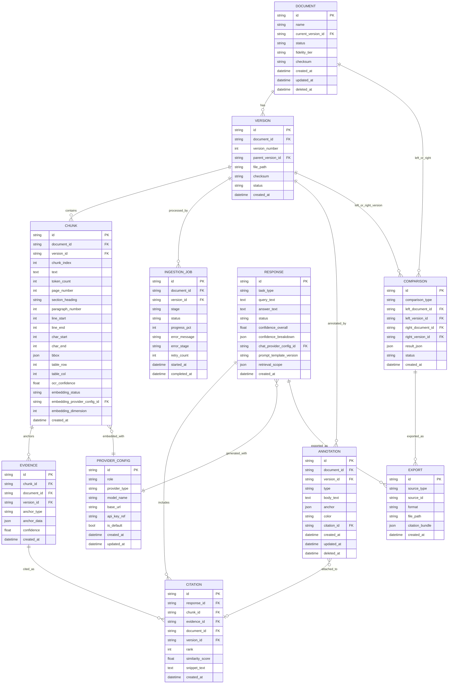

# 13 — Database Design

**Product:** DuckDocs
**Document type:** Relational database design
**Status:** Draft for team review
**Audience:** Backend engineering, AI engineering, QA
**Upstream:** [09_AI_ARCHITECTURE.md](./09_AI_ARCHITECTURE.md) · [10_DOCUMENT_PIPELINE.md](./10_DOCUMENT_PIPELINE.md) · [11_RAG_ARCHITECTURE.md](./11_RAG_ARCHITECTURE.md) · [12_PROVIDER_ARCHITECTURE.md](./12_PROVIDER_ARCHITECTURE.md)
**Downstream:** [14_VECTOR_DATABASE.md](./14_VECTOR_DATABASE.md) · [15_API_SPECIFICATION.md](./15_API_SPECIFICATION.md)

---

## 1. Purpose

This document defines the **relational data model** that backs every non-vector piece of DuckDocs state: documents, versions, chunks, evidence, citations, annotations, comparisons, exports, ingestion jobs, and provider configuration. It is the concrete schema that fulfills the domain model named in the vision (Document, Version, Chunk, Evidence, Annotation, Citation, Comparison, Export) and the mandatory evidence metadata fields from [02_PRODUCT_REQUIREMENTS.md](./02_PRODUCT_REQUIREMENTS.md) §9.

The relational database is the **system of record for provenance, structure, and review data**. The vector store ([14_VECTOR_DATABASE.md](./14_VECTOR_DATABASE.md)) is a derived, rebuildable index over this data — never the other way around.

---

## 2. Scope

### In scope

- Full entity list with columns, types, constraints, and indexes
- Entity-relationship diagram
- Migration strategy (Alembic)
- Soft-delete, retention, and cascade-delete behavior (RULE-06)
- JSON column usage for flexible anchor/metadata fields
- Single-user default posture and forward compatibility with local multi-profile use
- Performance indexing strategy for the access patterns defined in [11_RAG_ARCHITECTURE.md](./11_RAG_ARCHITECTURE.md)

### Out of scope

- Vector embeddings and ChromaDB collection layout → [14_VECTOR_DATABASE.md](./14_VECTOR_DATABASE.md)
- HTTP API request/response shapes → [15_API_SPECIFICATION.md](./15_API_SPECIFICATION.md)
- Full application-wide configuration precedence → [26_CONFIGURATION.md](./26_CONFIGURATION.md)
- Backup/restore operational runbooks → [30_DEPLOYMENT.md](./30_DEPLOYMENT.md)

---

## 3. Goals

| Goal ID | Goal | Maps to |
|---------|------|---------|
| DB-G01 | One stable domain model serves P0 through P2 without schema rewrites | AD-P03, AD-V06 |
| DB-G02 | Every mandatory evidence field from PRD §9 has a concrete column or JSON field | PR-E03 |
| DB-G03 | Deleting a document removes all derived data (chunks, evidence, citations pointing only to it, vectors) per retention rules | RULE-06 |
| DB-G04 | Version lineage is queryable without walking application code | PR-C06 |
| DB-G05 | Schema supports annotations, comparisons, and exports from day one, even though delivery is phased | RULE-09, AD-P03 |
| DB-G06 | Schema is implementable with SQLAlchemy models + Alembic migrations on **PostgreSQL (Compose default)** and optionally SQLite (dev/light bare-metal) without divergent designs | PC-04, AD-V05, AD-S02 |

---

## 4. Entity-Relationship Diagram

---

## 5. Entity Definitions

### 5.1 `Document`

| Column | Type | Constraints | Notes |
|--------|------|-------------|-------|
| `id` | UUID | PK | Stable identity across all versions |
| `name` | string | not null | Display name, editable independent of filename |
| `original_filename` | string | not null | |
| `mime_type` | string | not null | |
| `file_type_category` | enum | not null | `document`, `spreadsheet`, `presentation`, `image`, `structured_data`, `code`, `ebook` |
| `current_version_id` | UUID | FK → Version.id, nullable until first version ready | Points to the version considered "current" for default retrieval/preview |
| `status` | enum | not null | `queued`, `processing`, `ready`, `failed`, `deleted` |
| `fidelity_tier` | enum | not null | `full_layout`, `structural`, `ocr_dependent`, `best_effort` (from current version's parser result) |
| `checksum` | string | not null | SHA-256 of original file, current version |
| `size_bytes` | bigint | not null | |
| `folder_id` | UUID | FK → Folder.id, nullable | Simple organization (PR-L06); Folder entity detailed in Library-layer docs |
| `tags` | JSON | nullable | Array of strings |
| `created_at` / `updated_at` | datetime | not null | |
| `deleted_at` | datetime | nullable | Soft delete marker (§8) |

Indexes: `(status)`, `(file_type_category)`, `(deleted_at)`.

### 5.2 `Version`

| Column | Type | Constraints | Notes |
|--------|------|-------------|-------|
| `id` | UUID | PK | |
| `document_id` | UUID | FK → Document.id, not null | |
| `version_number` | int | not null | Monotonic per document, starting at 1 |
| `parent_version_id` | UUID | FK → Version.id, nullable | Enables lineage queries (PR-C06) |
| `file_path` | string | not null | Local storage path for this version's original file |
| `checksum` | string | not null | |
| `status` | enum | not null | Mirrors pipeline state: `queued`, `parsing`, `ocr`, `structuring`, `chunking`, `embedding`, `indexing`, `ready`, `failed` |
| `change_note` | string | nullable | User-provided note on replace/re-upload |
| `created_at` | datetime | not null | |

Indexes: `(document_id, version_number)` unique, `(parent_version_id)`.

DB-R01: `Version` rows are **immutable once `status=ready`**; a correction requires a new version, never an in-place edit of chunk/evidence data (PIPE-D05).

### 5.3 `IngestionJob`

| Column | Type | Constraints | Notes |
|--------|------|-------------|-------|
| `id` | UUID | PK | |
| `document_id` | UUID | FK → Document.id, not null | |
| `version_id` | UUID | FK → Version.id, not null | |
| `stage` | enum | not null | Matches [10_DOCUMENT_PIPELINE.md](./10_DOCUMENT_PIPELINE.md) §7 state machine |
| `status` | enum | not null | `running`, `succeeded`, `failed` |
| `progress_pct` | int | 0–100 | |
| `error_message` | string | nullable | Human-readable (PIPE-C05) |
| `error_stage` | enum | nullable | |
| `retry_count` | int | default 0 | |
| `started_at` / `completed_at` | datetime | nullable | |

Indexes: `(version_id)`, `(status)`.

### 5.4 `Chunk`

| Column | Type | Constraints | Notes |
|--------|------|-------------|-------|
| `id` | UUID | PK | |
| `document_id` | UUID | FK → Document.id, not null | Denormalized for query convenience |
| `version_id` | UUID | FK → Version.id, not null | |
| `chunk_index` | int | not null | Document-order position |
| `text` | text | not null | |
| `token_count` | int | not null | |
| `page_number` | int | nullable | Populated for paginated sources |
| `section_heading` | string | nullable | |
| `paragraph_number` | int | nullable | |
| `line_start` / `line_end` | int | nullable | |
| `char_start` / `char_end` | int | not null | Always populated (PIPE-C01) |
| `bbox` | JSON | nullable | `{page, x, y, width, height}` for OCR/image-derived chunks |
| `table_row` / `table_col` | int | nullable | Populated for table-row chunks |
| `ocr_confidence` | float | nullable | 0.0–1.0, populated only for OCR-derived text |
| `embedding_status` | enum | not null | `pending`, `embedded`, `failed`, `stale` |
| `embedding_provider_config_id` | UUID | FK → ProviderConfig.id, nullable until embedded | See [12](./12_PROVIDER_ARCHITECTURE.md) §9 |
| `embedding_dimension` | int | nullable until embedded | Used for stale-vector detection ([14](./14_VECTOR_DATABASE.md) VEC-D05) |
| `created_at` | datetime | not null | |

Indexes: `(version_id, chunk_index)`, `(document_id)`, `(embedding_status)`.

Note: `Chunk` does **not** store the embedding vector itself — only vector-store linkage metadata. The vector lives in ChromaDB, keyed by `chunk.id` (see [14_VECTOR_DATABASE.md](./14_VECTOR_DATABASE.md) §4).

### 5.5 `Evidence`

`Evidence` represents a specific, citable span within (or equal to) a `Chunk` — the unit actually referenced by a `Citation`. Most citations reference the full chunk span; `Evidence` exists as its own entity (rather than folding into `Chunk`) so that:

- Sub-chunk spans (e.g., one sentence within a larger chunk) can be cited precisely without re-chunking
- Evidence anchors can be reused by `Annotation` (manual highlight) without requiring a chunk to exist at that exact span

| Column | Type | Constraints | Notes |
|--------|------|-------------|-------|
| `id` | UUID | PK | |
| `chunk_id` | UUID | FK → Chunk.id, nullable | Null only for manual annotations with no AI-retrieval origin |
| `document_id` | UUID | FK → Document.id, not null | |
| `version_id` | UUID | FK → Version.id, not null | |
| `anchor_type` | enum | not null | `page`, `paragraph`, `line`, `char`, `bbox`, `table_cell` — the *finest* anchor available |
| `anchor_data` | JSON | not null | Shape depends on `anchor_type`, e.g. `{char_start, char_end}` or `{page, x, y, w, h}` or `{row, col}` |
| `confidence` | float | nullable | Copied from source OCR confidence when applicable |
| `created_at` | datetime | not null | |

Indexes: `(chunk_id)`, `(document_id, version_id)`.

### 5.6 `Response`

Represents one AI-generated answer/summary/extraction result (or an insufficient-evidence outcome).

| Column | Type | Constraints | Notes |
|--------|------|-------------|-------|
| `id` | UUID | PK | |
| `task_type` | enum | not null | `ask`, `summarize`, `extract` |
| `query_text` | text | not null | |
| `answer_text` | text | nullable | Null when `status=insufficient_evidence` |
| `status` | enum | not null | `grounded`, `insufficient_evidence` |
| `insufficient_reason` | string | nullable | `no_retrieval_hits`, `below_threshold`, `gate_rejected_output`, `model_declined`, `citation_density_low` |
| `confidence_overall` | float | nullable | |
| `confidence_breakdown` | JSON | nullable | `{retrieval, ocr, coverage}` per [11_RAG_ARCHITECTURE.md](./11_RAG_ARCHITECTURE.md) §9 |
| `chat_provider_config_id` | UUID | FK → ProviderConfig.id | |
| `prompt_template_version` | string | not null | |
| `retrieval_scope` | JSON | not null | Serialized `RetrievalScope` including resolved `version_id`s |
| `created_at` | datetime | not null | |

Indexes: `(task_type)`, `(created_at)`.

### 5.7 `Citation`

| Column | Type | Constraints | Notes |
|--------|------|-------------|-------|
| `id` | UUID | PK | |
| `response_id` | UUID | FK → Response.id, not null | |
| `chunk_id` | UUID | FK → Chunk.id, not null | |
| `evidence_id` | UUID | FK → Evidence.id, not null | |
| `document_id` | UUID | FK → Document.id, not null | Denormalized |
| `version_id` | UUID | FK → Version.id, not null | Denormalized, pinned at response time |
| `rank` | int | not null | Order of appearance in the answer |
| `similarity_score` | float | not null | |
| `snippet_text` | text | not null | Frozen copy (RAG-C03) |
| `created_at` | datetime | not null | |

Indexes: `(response_id)`, `(document_id, version_id)`.

### 5.8 `Annotation`

| Column | Type | Constraints | Notes |
|--------|------|-------------|-------|
| `id` | UUID | PK | |
| `document_id` | UUID | FK → Document.id, not null | |
| `version_id` | UUID | FK → Version.id, not null | Anchors pin to a specific version |
| `user_id` | UUID | FK → User.id, nullable | Nullable in single-user P0 default; populated when local multi-profile ships |
| `type` | enum | not null | `highlight`, `comment`, `note` |
| `body_text` | text | nullable | Comment/note content |
| `anchor` | JSON | not null | Char range, bbox, or page — same shape family as `Evidence.anchor_data` |
| `color` | string | nullable | Highlight color |
| `citation_id` | UUID | FK → Citation.id, nullable | Set when the annotation targets an AI-cited passage (PR-R02) |
| `created_at` / `updated_at` | datetime | not null | |
| `deleted_at` | datetime | nullable | Soft delete |

Indexes: `(document_id, version_id)`, `(citation_id)`.

### 5.9 `Comparison`

| Column | Type | Constraints | Notes |
|--------|------|-------------|-------|
| `id` | UUID | PK | |
| `comparison_type` | enum | not null | `content_diff`, `semantic`, `annotation_diff`, `citation_diff` |
| `left_document_id` / `left_version_id` | UUID | FK, not null | |
| `right_document_id` / `right_version_id` | UUID | FK, not null | |
| `result_json` | JSON | nullable | Diff payload; shape varies by `comparison_type` |
| `status` | enum | not null | `pending`, `ready`, `failed` |
| `created_at` | datetime | not null | |

Indexes: `(left_document_id)`, `(right_document_id)`.

DB-R02: `Comparison` supports both cross-document (`PR-C01`) and cross-version (`PR-C02`) comparisons through the same left/right shape — a version comparison simply sets `left_document_id = right_document_id`.

### 5.10 `Export`

| Column | Type | Constraints | Notes |
|--------|------|-------------|-------|
| `id` | UUID | PK | |
| `source_type` | enum | not null | `response`, `comparison` |
| `source_id` | UUID | not null | Polymorphic reference to `Response.id` or `Comparison.id` |
| `format` | enum | not null | `markdown`, `pdf`, `docx`, `html`, `json_evidence_bundle` |
| `file_path` | string | not null | Local output path (PR-X04) |
| `citation_bundle` | JSON | not null | Full evidence/citation payload embedded at export time, decoupled from later DB changes |
| `created_at` | datetime | not null | |

### 5.11 `ProviderConfig`

See [12_PROVIDER_ARCHITECTURE.md](./12_PROVIDER_ARCHITECTURE.md) §7 for full field semantics.

| Column | Type | Constraints |
|--------|------|-------------|
| `id` | UUID | PK |
| `role` | enum | not null (`chat`, `embedding`) |
| `provider_type` | enum | not null |
| `model_name` | string | not null |
| `base_url` | string | nullable |
| `api_key_ref` | string | nullable |
| `is_default` | bool | not null |
| `created_at` / `updated_at` | datetime | not null |

Constraint: at most one row with `is_default=true` per `role` (enforced via partial unique index or application-level transaction).

---

## 6. Migration Strategy

| Aspect | Approach |
|--------|----------|
| Tooling | Alembic, versioned migration scripts checked into the repository |
| Baseline | Single initial migration creating all P0-required tables (Document, Version, IngestionJob, Chunk, Evidence, Response, Citation, ProviderConfig) plus P1/P2 tables (Annotation, Comparison, Export) created **up front** even though features ship later (DB-G05) |
| Forward-only in production | No destructive down-migrations run against user data by default; down-migrations exist for dev/test only |
| PostgreSQL default | Default Docker Compose deployment uses PostgreSQL (see [08_SYSTEM_ARCHITECTURE.md](./08_SYSTEM_ARCHITECTURE.md) AD-S02 and [29_DOCKER_ARCHITECTURE.md](./29_DOCKER_ARCHITECTURE.md)) |
| SQLite option | Same SQLAlchemy models may target SQLite for lightweight local/dev runs; not the Compose default because `api` + `worker` concurrency needs reliable multi-writer behavior |
| Dialect portability | Migrations must remain dialect-agnostic where practical (avoid hard Postgres-only or SQLite-only column types in the shared model layer) |
| JSON columns | Modeled as SQLAlchemy `JSON` type; prefer `jsonb` on PostgreSQL |

---

## 7. Architecture Decisions

| ID | Decision | Rationale |
|----|----------|-----------|
| DB-D01 | All P0–P2 domain tables are created in the initial schema, regardless of feature phasing | AD-P03; prevents disruptive schema migrations when Annotation/Comparison/Export ship |
| DB-D02 | `Evidence` is a distinct entity from `Chunk`, not a set of columns on `Chunk` | Allows sub-chunk citation precision and lets `Annotation` reuse the same anchor concept without requiring a retrieval chunk to exist |
| DB-D03 | `Citation` freezes `snippet_text` and denormalizes `document_id`/`version_id` | Citations must remain valid and stable even if source chunks are later superseded (RAG-C03) |
| DB-D04 | Soft delete (`deleted_at`) used for `Document` and `Annotation`; hard delete used for derived data (`Chunk`, vectors) per retention rules | Users may want to recover an accidentally deleted document's metadata briefly, but derived index data is cheap to regenerate and should not linger indefinitely once a document is gone |
| DB-D05 | `Version` rows are immutable once `ready`; corrections always create a new version | PIPE-D05, preserves citation/annotation stability |
| DB-D06 | SQLAlchemy models are the single schema source of truth; Alembic migrations are generated from them, never hand-diverged | Prevents model/schema drift |
| DB-D07 | PostgreSQL is the shipped Compose default; schema stays SQLAlchemy-portable for optional SQLite/dev | Aligns with AD-S02 (concurrent `api`/`worker` writers); still supports PC-04 single-machine local via Compose |
| DB-D08 | `user_id` columns are nullable in P0 (single-user default) but present on ownership-relevant tables | Avoids a breaking schema change if local multi-profile (OQ-V01) ships later |

### Alternatives rejected

| Alternative | Why rejected |
|-------------|---------------|
| Fold `Evidence` fields directly into `Chunk` | Loses ability to cite sub-chunk spans and to reuse the anchor model for manual annotations |
| Hard delete documents immediately with no soft-delete window | Riskier UX for accidental deletion; conflicts with commercial-craft quality bar |
| Store citation snippet as a live foreign-key lookup instead of frozen text | Breaks citation stability across re-ingestion (violates RAG-C03) |
| Add Annotation/Comparison/Export tables only when those features are built | Creates schema churn and migration risk exactly when review features (P1/P2) are under time pressure — rejected per RULE-09 |
| Use a NoSQL document store for provenance data | Provenance/evidence data is highly relational (documents → versions → chunks → citations → annotations); relational integrity constraints matter more than schema flexibility here |
| Store embeddings inside the relational DB as BLOB columns | Vector similarity search is not a relational DB's strength; ChromaDB is purpose-built for it (AD-V05) |

---

## 8. Data Lifecycle, Retention, and Cascades

| Action | Cascade behavior |
|--------|--------------------|
| User deletes a `Document` | `Document.deleted_at` set immediately (soft delete, hidden from UI); background job hard-deletes original file, all `Chunk`/`Evidence`/`Citation` rows scoped to that document, and associated vectors after the configured retention window (RULE-06) |
| User deletes a single `Version` (keeping other versions) | Only allowed if not `current_version_id`; cascades to that version's `Chunk`/`Evidence`, vectors, and `Annotation` rows anchored to it; `Citation` rows referencing that version are retained but flagged `source_version_deleted=true` for UI transparency rather than silently broken |
| Re-ingestion (new `Version`) | No cascade — prior version's data is untouched (PIPE-C03) |
| `ProviderConfig` deleted | Associated secret store entry deleted (PROV-C05); `Chunk`/`Response` rows referencing it by ID retain the historical reference for audit, provider shown as "removed" in UI |
| Export file deleted from disk by user (outside app) | `Export` row remains as a record; UI shows "file not found" rather than silently removing history |

DB-C01: Hard deletion of a document's derived data (chunks, evidence, vectors) must complete within the retention window defined in [25_PRIVACY.md](./25_PRIVACY.md); this document does not set the window itself.

---

## 9. Tradeoffs

| Tradeoff | We choose | We accept |
|----------|-----------|-----------|
| Wide, fully-normalized schema vs. fewer, denormalized tables | Normalized core with deliberate denormalization only where citation stability requires it (`Citation.document_id`, `snippet_text`) | More joins for some queries; mitigated by targeted indexes |
| All-tables-up-front vs. incremental schema growth | Full domain model at baseline | Larger initial migration; empty P1/P2 tables for a while |
| JSON columns for anchors vs. fully typed per-anchor-type tables | JSON `anchor_data`/`bbox`/`result_json` | Slightly weaker DB-level type safety; validated at the application layer instead |
| Postgres Compose default vs. SQLite zero-ops | PostgreSQL in Compose (invisible to end users beyond resource footprint) | One additional container vs. pure SQLite; accepted for provenance correctness under concurrency |
| Soft delete for Document/Annotation vs. immediate hard delete everywhere | Soft delete window for recoverability | Slightly more complex query filtering (`deleted_at IS NULL` everywhere) |

---

## 10. Interfaces

| Interface | Notes |
|-----------|-------|
| SQLAlchemy ORM models | One class per entity in §5; used by all backend services |
| Alembic migration CLI | `alembic upgrade head` on startup/deploy |
| Repository layer (e.g., `DocumentRepository`, `ChunkRepository`, `CitationRepository`) | Encapsulates query patterns; only layer permitted to issue raw queries against these tables |
| `GET /documents/{id}/versions` | Version lineage query (PR-C06) |
| `GET /documents/{id}/chunks` | Debug/inspection use (PR-I07) |

---

## 11. Constraints

| ID | Constraint |
|----|------------|
| DB-C02 | Every `Chunk` row must have non-null `char_start`/`char_end` (mirrors PIPE-C01) |
| DB-C03 | Every `Citation` row must reference a valid `Evidence` row; orphaned citations are a data integrity defect |
| DB-C04 | `Version.status=ready` rows are immutable at the chunk/evidence level; only `Document`/`Annotation` soft-delete flags and `Citation.source_version_deleted` markers may change after the fact |
| DB-C05 | Exactly one `ProviderConfig.is_default=true` row may exist per `role` |
| DB-C06 | Schema must not use SQLite-specific or Postgres-specific column types that break dialect portability |

---

## 12. Risks

| Risk | Impact | Mitigation |
|------|--------|-------------|
| JSON anchor fields drift in shape across code changes (e.g., bbox format changes) | Broken citation navigation for older data | Versioned anchor schema validator; migration script to backfill/normalize on schema evolution |
| Soft-deleted documents accumulate and complicate queries/performance | Slower list queries over time | Indexed `deleted_at`; scheduled hard-delete after retention window (DB-C01) |
| PostgreSQL container overhead on constrained hardware | Idle RAM/CPU above SQLite | Include Postgres in reference-machine budgets ([04](./04_NON_FUNCTIONAL_REQUIREMENTS.md), [34](./34_PERFORMANCE.md)); document SQLite-dev path for contributors |
| Large `snippet_text`/`result_json` payloads bloat DB size | Storage growth | Reasonable snippet length caps; large comparison payloads may reference an export file instead of inlining |
| Schema baked "up front" for P1/P2 features turns out wrong once those features are actually designed in detail | Migration needed anyway | Treat P1/P2 tables as provisional-but-reviewed; feature-specific design docs (Review, Comparison, Export) may refine columns via normal migrations before those features ship |

---

## 13. Future Extensibility

- `user_id` columns already present enable local multi-profile support without new migrations for ownership
- `Comparison.comparison_type` and `Export.format` are enums, extendable with new values (e.g., `semantic` diff logic, new export formats) without schema changes
- `Evidence.anchor_type` can gain new anchor kinds (e.g., audio timestamp, if DuckDocs ever ingests media) without restructuring existing anchors
- Citation graph features (PR-E07) can be built as a derived read-model over existing `Citation`/`Chunk`/`Document` relationships, or as a dedicated `CitationEdge` table added later without touching this schema
- Postgres migration path supports future horizontal read scaling for team deployments

---

## 14. Open Questions

| ID | Question | Owner | Needed by |
|----|-----------|-------|-----------|
| DB-OQ01 | Retention window length for hard-deleting derived data after a document/version soft delete? | Privacy + Product | Before [25_PRIVACY.md](./25_PRIVACY.md) freeze (tracks PIPE-OQ03) |
| DB-OQ02 | Should `Annotation` support threaded replies (comment-on-comment) in the base schema, or is that a P2 addition? | Product | Before Review feature detailed spec |
| DB-OQ03 | Is a dedicated `Folder`/`Collection` entity needed in P0 for PR-L06 organization, or are `tags` sufficient initially? | Product + Eng | Before Library API spec |
| DB-OQ04 | Postgres support timeline — needed for any P0/P1 scenario, or purely a roadmap item? | Platform | Before deployment doc freeze |

---

## 15. Acceptance Criteria

This document is accepted when:

- [ ] Entity list and ERD (§4–5) are approved as the SQLAlchemy model baseline
- [ ] Cascade/retention behavior (§8) is reviewed against RULE-06 and privacy requirements
- [ ] `Evidence` as a distinct entity from `Chunk` (DB-D02) is approved
- [ ] All-tables-up-front decision (DB-D01) is approved by Engineering leadership given migration overhead tradeoff
- [ ] Mandatory evidence metadata fields (PRD §9) are confirmed fully covered by `Chunk` + `Evidence` columns

---

## 16. Cross-References

| Topic | Document |
|-------|----------|
| AI subsystem overview | [09_AI_ARCHITECTURE.md](./09_AI_ARCHITECTURE.md) |
| Ingestion pipeline | [10_DOCUMENT_PIPELINE.md](./10_DOCUMENT_PIPELINE.md) |
| RAG / grounding | [11_RAG_ARCHITECTURE.md](./11_RAG_ARCHITECTURE.md) |
| Provider architecture | [12_PROVIDER_ARCHITECTURE.md](./12_PROVIDER_ARCHITECTURE.md) |
| Vector store | [14_VECTOR_DATABASE.md](./14_VECTOR_DATABASE.md) |
| API specification | [15_API_SPECIFICATION.md](./15_API_SPECIFICATION.md) |
| Privacy / retention | [25_PRIVACY.md](./25_PRIVACY.md) |

---

## Document Control

| Field | Value |
|-------|-------|
| Version | 0.1.0 |
| Last updated | 2026-07-18 |
| Authors | DuckDocs Architecture Team |
| Review state | Pending team review |
| Previous | [12_PROVIDER_ARCHITECTURE.md](./12_PROVIDER_ARCHITECTURE.md) |
| Next | [14_VECTOR_DATABASE.md](./14_VECTOR_DATABASE.md) |
