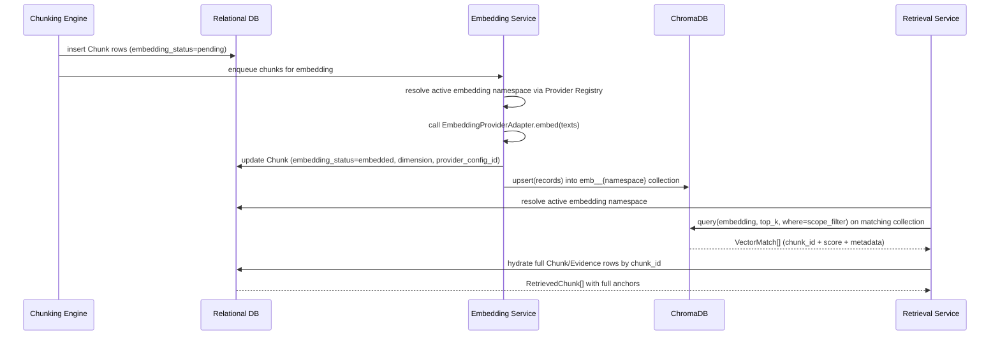

# 14 — Vector Database

**Product:** DuckDocs
**Document type:** Vector store architecture
**Status:** Draft for team review
**Audience:** AI engineering, backend engineering
**Upstream:** [09_AI_ARCHITECTURE.md](./09_AI_ARCHITECTURE.md) · [11_RAG_ARCHITECTURE.md](./11_RAG_ARCHITECTURE.md) · [12_PROVIDER_ARCHITECTURE.md](./12_PROVIDER_ARCHITECTURE.md) · [13_DATABASE_DESIGN.md](./13_DATABASE_DESIGN.md)
**Downstream:** [15_API_SPECIFICATION.md](./15_API_SPECIFICATION.md)

---

## 1. Purpose

This document defines how DuckDocs stores and queries **vector embeddings** using ChromaDB: collection layout, metadata schema, the relational-to-vector synchronization contract, embedding-provider-change handling, persistence and backup, and the rationale for choosing ChromaDB over alternative vector stores.

The vector store is intentionally a **derived index**, not a source of truth — every fact needed to rebuild it from scratch lives in the relational database ([13_DATABASE_DESIGN.md](./13_DATABASE_DESIGN.md)).

---

## 2. Scope

### In scope

- Collection layout and naming strategy
- Vector record schema (embedding + metadata payload)
- Query interface and filtering
- Distance metric selection
- Relational DB ↔ vector store synchronization and consistency guarantees
- Embedding-provider/model/dimension change handling (re-embedding workflow)
- Persistence, backup, and local storage location
- Local performance characteristics and scaling limits
- Alternative vector databases considered and rejected

### Out of scope

- Retrieval ranking/filtering logic that consumes query results → [11_RAG_ARCHITECTURE.md](./11_RAG_ARCHITECTURE.md)
- Embedding provider adapters → [12_PROVIDER_ARCHITECTURE.md](./12_PROVIDER_ARCHITECTURE.md)
- Relational schema for `Chunk`/`Evidence` → [13_DATABASE_DESIGN.md](./13_DATABASE_DESIGN.md)
- Chunking strategy that determines what gets embedded → [10_DOCUMENT_PIPELINE.md](./10_DOCUMENT_PIPELINE.md)

---

## 3. Goals

| Goal ID | Goal | Maps to |
|---------|------|---------|
| VEC-G01 | Vector store can be fully rebuilt from relational data + original files if lost or corrupted | AD-V05 |
| VEC-G02 | Switching embedding providers never silently mixes incompatible-dimension vectors in one search | AI-D04, RULE-08 |
| VEC-G03 | Vector store runs entirely locally with zero network dependency by default | C-01, G-01 |
| VEC-G04 | Retrieval queries support scoping by document/version/library without separate physical stores per document | PR-I09 |
| VEC-G05 | Vector store operations are fast enough for interactive Ask/Search at target local library sizes | NFR performance budgets |
| VEC-G06 | Deleting a document removes its vectors completely (RULE-06) | RULE-06 |

---

## 4. Collection Layout

### 4.1 Strategy: one collection per embedding namespace

DuckDocs uses **one ChromaDB collection per `(provider_type, model_name, dimension)` combination** — an "embedding namespace" — rather than one collection per document or one single global collection regardless of embedding model.

```text
collection name = "emb__{provider_type}__{model_name}__{dimension}"

Examples:
  emb__ollama__nomic-embed-text__768
  emb__openai__text-embedding-3-small__1536
```

| Approach considered | Why not chosen as primary |
|-----------------------|------------------------------|
| One collection per document | Thousands of tiny collections at library scale; poor operational simplicity; cross-document/library-wide search requires fan-out queries across all collections |
| One single global collection regardless of embedding model | Cannot safely mix vectors of different dimensions/models in one ChromaDB collection; would require awkward padding/rejection tricks |
| One collection per embedding namespace (chosen) | Matches the real constraint (vectors must share dimension/model to be comparably searched) while keeping document/version scoping as **metadata filters** within a collection, not physical partitioning |

Document/version/library scoping (§6) is achieved via **metadata filters** on `document_id`/`version_id` within the active namespace's collection — not via separate collections per document.

### 4.2 Active namespace resolution

At any time, each role (chat is irrelevant here — only embedding matters) has exactly one **active embedding namespace**, determined by the current default `ProviderConfig` for `role=embedding` (see [12_PROVIDER_ARCHITECTURE.md](./12_PROVIDER_ARCHITECTURE.md) §5). Retrieval queries always target the collection for the currently active namespace.

---

## 5. Vector Record Schema

Each ChromaDB record corresponds 1:1 with a `Chunk` row in the relational database:

```python
{
    "id": chunk.id,                      # matches Chunk.id exactly — the join key
    "embedding": [0.0123, -0.045, ...],  # length == namespace dimension
    "document": chunk.text,              # ChromaDB's "document" field; the chunk text itself
    "metadata": {
        "document_id": chunk.document_id,
        "version_id": chunk.version_id,
        "chunk_index": chunk.chunk_index,
        "page_number": chunk.page_number,
        "fidelity_tier": document.fidelity_tier,
        "ocr_confidence": chunk.ocr_confidence,
        "embedded_at": chunk.embedded_at.isoformat(),
    },
}
```

VEC-R01: `id` in ChromaDB is always identical to `Chunk.id` in the relational database. There is no separate "embedding ID" identity space — this is the single join key between the two stores, satisfying the mandatory `embedding ID` evidence field from PRD §9 by construction (it *is* the chunk ID).

VEC-R02: The relational DB never stores the vector itself (DB §5.4); the vector store never stores anchor/provenance detail beyond the filtering metadata above — each store owns exactly one concern.

---

## 6. Query Interface

```python
class VectorQuery(TypedDict):
    query_embedding: list[float]
    top_k: int
    where: dict            # ChromaDB metadata filter, e.g. {"document_id": {"$in": [...]}}

class VectorStore(Protocol):
    def query(self, request: VectorQuery) -> list[VectorMatch]: ...
    def upsert(self, records: list[VectorRecord]) -> None: ...
    def delete(self, chunk_ids: list[str]) -> None: ...
    def delete_by_filter(self, where: dict) -> None: ...
    def collection_name(self) -> str: ...

class VectorMatch(TypedDict):
    id: str                 # chunk_id
    score: float             # similarity (converted from ChromaDB distance)
    metadata: dict
```

| Scope mode (from [11_RAG_ARCHITECTURE.md](./11_RAG_ARCHITECTURE.md) §4.2) | `where` filter |
|-----------------------------------------------------------------------------|-----------------|
| `document` | `{"document_id": target_id, "version_id": pinned_version_id}` |
| `selection` | `{"document_id": {"$in": [...]}}` |
| `library` | No filter (or `{"document_id": {"$nin": excluded_ids}}` if the user has excluded specific documents) |

---

## 7. Distance Metric and Score Conversion

| Setting | Value | Rationale |
|---------|-------|-----------|
| Distance metric | Cosine | Standard for normalized sentence/document embedding models (`nomic-embed-text`, OpenAI/Gemini embeddings); robust to magnitude variance across providers |
| Score conversion | `similarity = 1 - cosine_distance` | Presented to Retrieval Service and UI as a 0–1 similarity score, consistent regardless of underlying ChromaDB distance convention |
| Index type | HNSW (ChromaDB default) | Good recall/latency tradeoff at local library scale without manual tuning |

---

## 8. Relational ↔ Vector Synchronization

The vector store is kept in lockstep with the relational database through a **single write path**: the Embedding Service (see [09_AI_ARCHITECTURE.md](./09_AI_ARCHITECTURE.md) §4).

| Event | Relational DB action | Vector store action |
|-------|------------------------|------------------------|
| Chunk created (post-chunking) | `Chunk` row inserted, `embedding_status=pending` | (none yet) |
| Embedding succeeds | `Chunk.embedding_status=embedded`, `embedding_provider_config_id`, `embedding_dimension` set | `upsert` record into the active namespace's collection |
| Embedding fails | `Chunk.embedding_status=failed` | (none) — chunk stays out of retrieval until retried |
| Document/version hard-deleted | `Chunk`/`Evidence` rows deleted (DB §8) | `delete_by_filter({"document_id": ...})` issued in the same deletion transaction/job |
| Embedding provider/model changes (new default) | No immediate change to existing `Chunk` rows | New namespace collection created lazily on first write; old collection remains queryable under the old namespace until re-embedded |

VEC-R03: Every vector write is preceded by a successful relational write recording the intent (`embedding_status=pending` → `embedded`). If the process crashes between the two stores, a reconciliation job (run at startup) finds `Chunk` rows with `embedding_status=embedded` but no matching vector-store record (or vice versa) and repairs by re-embedding or clearing status — the relational DB is the authority for what *should* exist.

---

## 9. Embedding Provider / Model Change Handling

This is the highest-risk seam in the vector architecture, called out explicitly in [09_AI_ARCHITECTURE.md](./09_AI_ARCHITECTURE.md) §10 and [11_RAG_ARCHITECTURE.md](./11_RAG_ARCHITECTURE.md) §15.

```mermaid
flowchart TD
  A[User changes default embedding provider in Settings] --> B{New namespace differs from current chunks' namespace?}
  B -->|No, same provider/model/dimension| C[No action needed]
  B -->|Yes| D[Mark all Chunk rows embedding_status=stale]
  D --> E[UI banner: "Documents need re-indexing with new embedding model"]
  E --> F[User confirms re-embed, all-at-once or on-demand]
  F --> G[Embedding Service re-embeds stale chunks into new namespace collection]
  G --> H[Old namespace collection retained until confirmed unused, then garbage-collected]
```

| Rule | Detail |
|------|--------|
| VEC-D05 | A `Chunk` is only eligible for retrieval if its `embedding_dimension`/provider matches the **currently active** embedding namespace; mismatched chunks are marked `stale` and excluded from query results rather than silently queried against the wrong collection |
| VEC-C03 | Retrieval Service must verify the query embedding's namespace matches the collection being queried before issuing a ChromaDB query; a mismatch is a hard error, not a best-effort fallback |
| VEC-D06 | Re-embedding is an explicit, user-confirmed action (not automatic on every provider switch), because it may be a costly local operation for large libraries |
| VEC-D07 | Old embedding namespace collections are retained (not immediately deleted) after a switch, so a user can switch back without losing indexed state, until an explicit cleanup action is taken |

---

## 10. Persistence, Backup, and Storage Location

| Aspect | Detail |
|--------|--------|
| Persistence mode | ChromaDB's local persistent client, backed by its embedded storage (SQLite-based) under the user-configured data directory (aligns with PR-S07) |
| Location | `<data_dir>/vector_store/` — visible and documented in Settings alongside the relational DB file and original document storage |
| Backup | Vector store is a derived index; primary backup responsibility falls on the relational DB + original files. Vector store backup is optional/best-effort since it can be fully regenerated by re-running embedding over existing chunks (VEC-G01) |
| Portability | Moving the entire data directory (relational DB + files + vector store) to a new machine is sufficient to restore a working install, per [30_DEPLOYMENT.md](./30_DEPLOYMENT.md) |

---

## 11. Architecture Decisions

| ID | Decision | Rationale |
|----|----------|-----------|
| VEC-D01 | ChromaDB is the vector store for P0 | Local-first, embedded (no separate server process required), Python-native, simple operational model matching a single-machine local product |
| VEC-D02 | One ChromaDB collection per embedding namespace (`provider_type` + `model_name` + `dimension`), not per document | Vectors of different dimensions cannot be meaningfully compared; per-document collections would not scale operationally at library sizes and would complicate whole-library search |
| VEC-D03 | Document/version/library scoping implemented via metadata filters, not physical partitioning | Matches ChromaDB's filtering capability; keeps collection count bounded (one per namespace) regardless of library size |
| VEC-D04 | `id` in the vector store is always identical to `Chunk.id` | Eliminates a second identity/mapping table; join is trivial and unambiguous |
| VEC-D05 (see §9) | Chunks are namespace-tagged and excluded from retrieval when their namespace doesn't match the active one | Prevents silent cross-dimension retrieval corruption |
| VEC-D06 (see §9) | Re-embedding after a provider switch is explicit and user-confirmed | Avoids surprising, potentially expensive automatic recomputation |
| VEC-D08 | Cosine distance is the fixed metric across all namespaces | Consistency in score semantics regardless of active embedding provider |

### Alternatives rejected

| Alternative | Why rejected |
|-------------|---------------|
| FAISS | No built-in metadata filtering or persistence server; would require building a parallel ID/metadata mapping layer that ChromaDB provides out of the box |
| Qdrant | Excellent product, but typically run as a separate server process; adds operational complexity not justified for a default single-machine local install (revisit for team/multi-node deployment) |
| pgvector | Would couple vector search tightly to the relational PostgreSQL instance and collapse the deliberate separation between provenance store and vector store (AD-V05) |
| Weaviate | Full server product with its own ops surface; too heavy for local-first default; also introduces a larger network-capable service surface that cuts against privacy-first minimalism |
| One collection per document | Operationally unwieldy at scale; complicates whole-library search into a fan-out query pattern |
| Automatic silent re-embedding on every provider switch | Could trigger large, unexpected local compute/time cost without user awareness |

---

## 12. Tradeoffs

| Tradeoff | We choose | We accept |
|----------|-----------|-----------|
| One collection per embedding namespace vs. per document | Namespace-based | Provider switch requires an explicit re-embed step rather than being instantly transparent |
| Metadata-filter scoping vs. physical per-document partitioning | Metadata filters | Slightly higher query-time filtering cost vs. a pre-partitioned store; negligible at target local library sizes |
| Retain old namespace collections after switch vs. immediate cleanup | Retain until explicit cleanup | Uses more local disk until user cleans up; avoids destructive data loss on accidental switch-back |
| Embedded/local ChromaDB vs. a full client-server vector DB | Embedded local | Simpler ops, but less suited to future multi-node/team scaling without added work |
| Vector store as pure derived index (no independent backup guarantee) vs. treating it as source-of-truth-grade data | Derived index | Losing the vector store requires a re-embed pass (time cost) but never data loss, since relational DB + files remain authoritative |

---

## 13. Data Flow



---

## 14. Interfaces

| Interface | Consumer |
|-----------|----------|
| `VectorStore.query(request)` | Retrieval Service |
| `VectorStore.upsert(records)` | Embedding Service |
| `VectorStore.delete(chunk_ids)` / `delete_by_filter(where)` | Document deletion workflow, re-embed cleanup |
| `VectorStore.collection_name()` | Diagnostics, Settings ("data location" display, PR-S07) |
| Reconciliation job (startup) | Backend bootstrap process |

---

## 15. Constraints

| ID | Constraint |
|----|------------|
| VEC-C01 | Vector store record `id` must always equal the source `Chunk.id` |
| VEC-C02 | A collection must never contain vectors of mixed dimension |
| VEC-C03 | Query-time namespace of the embedding must match the collection being queried, verified before the call |
| VEC-C04 | Deleting a document must remove its vectors from the active namespace collection (and any retained legacy namespace collections) within the same deletion workflow |
| VEC-C05 | Vector store must run as an embedded local process/library — no default configuration may point it at a remote server |

---

## 16. Risks

| Risk | Impact | Mitigation |
|------|--------|-------------|
| Retained legacy namespace collections accumulate disk usage after repeated provider switching | Storage bloat | Settings surface to view and manually purge unused namespace collections |
| Reconciliation job scope creep (large libraries) makes startup slow after a crash | Slow restart | Bound reconciliation to chunks touched in the last incomplete job window, not a full-library scan every startup |
| ChromaDB HNSW recall/latency degrades at very large local library sizes | Slower or less relevant retrieval | Document practical size guidance (ties to OQ-V05); evaluate ANN parameter tuning or move to a server-mode vector DB for very large/team deployments |
| Metadata filter query performance degrades with very large `$in` lists (large "selection" scope) | Slow selection-scoped queries | Cap selection size or restructure very large multi-doc queries as repeated smaller batches |
| Users don't understand why re-embedding is needed after a provider switch | Confusion, perceived bug | Clear UI messaging tied directly to the provider switch action, not a silent background state |

---

## 17. Future Extensibility

- Server-mode vector databases (Qdrant, Weaviate, managed pgvector) can be introduced behind the same `VectorStore` protocol for team/multi-node deployments without changing Retrieval Service code
- Hybrid dense+sparse retrieval can add a secondary lexical index alongside ChromaDB without changing the `VectorMatch` contract
- Namespace model extends naturally to a future re-ranking embedding model used only at query time, stored as its own namespace if ever needed
- Automatic background re-embedding (with user-configurable scheduling) can be added later as an enhancement to the currently explicit, manual re-embed flow

---

## 18. Open Questions

| ID | Question | Owner | Needed by |
|----|-----------|-------|-----------|
| VEC-OQ01 | Confirm `nomic-embed-text` output dimension (768) and Ollama pull reliability across target hardware tiers before locking the default namespace name | AI Eng | Before P0 freeze (tracks AI-OQ04/OQ-P03) |
| VEC-OQ02 | Should DuckDocs auto-purge legacy namespace collections after N days unused, or require manual purge only? | Product + Eng | Before Settings storage-management spec |
| VEC-OQ03 | Practical max chunk count per collection before HNSW recall/latency degrades on typical local hardware — needs empirical benchmarking | Platform + AI Eng | Before NFR performance budget freeze (tracks OQ-V05) |
| VEC-OQ04 | Should whole-library re-embed run as one big job or a resumable, chunked background process with partial progress visibility? | Eng | Before P0 code freeze |

---

## 19. Acceptance Criteria

This document is accepted when:

- [ ] Collection-per-embedding-namespace strategy (§4, VEC-D02) is approved
- [ ] Relational-DB-as-authority reconciliation model (§8) is approved as sufficient consistency guarantee
- [ ] Provider-switch re-embedding workflow (§9) is approved by Product for UX implications
- [ ] ChromaDB selection over alternatives (§11) is accepted, or an alternative is proposed with equivalent local-first properties
- [ ] Persistence/backup posture (§10) — vector store as regenerable derived index — is accepted by Engineering and Privacy stakeholders

---

## 20. Cross-References

| Topic | Document |
|-------|----------|
| AI subsystem overview | [09_AI_ARCHITECTURE.md](./09_AI_ARCHITECTURE.md) |
| Ingestion pipeline | [10_DOCUMENT_PIPELINE.md](./10_DOCUMENT_PIPELINE.md) |
| RAG / grounding | [11_RAG_ARCHITECTURE.md](./11_RAG_ARCHITECTURE.md) |
| Provider architecture | [12_PROVIDER_ARCHITECTURE.md](./12_PROVIDER_ARCHITECTURE.md) |
| Relational schema | [13_DATABASE_DESIGN.md](./13_DATABASE_DESIGN.md) |
| API specification | [15_API_SPECIFICATION.md](./15_API_SPECIFICATION.md) |
| Deployment | [30_DEPLOYMENT.md](./30_DEPLOYMENT.md) |

---

## Document Control

| Field | Value |
|-------|-------|
| Version | 0.1.0 |
| Last updated | 2026-07-18 |
| Authors | DuckDocs Architecture Team |
| Review state | Pending team review |
| Previous | [13_DATABASE_DESIGN.md](./13_DATABASE_DESIGN.md) |
| Next | [15_API_SPECIFICATION.md](./15_API_SPECIFICATION.md) |
