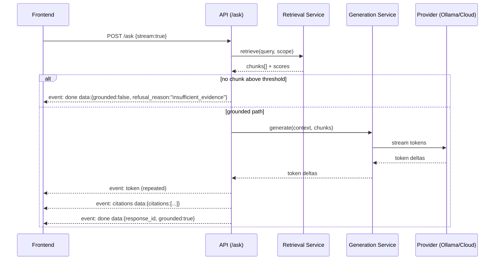

# 15 — API Specification

**Product:** DuckDocs
**Document type:** API contract specification
**Status:** Draft for team review
**Audience:** Backend engineering, frontend engineering, QA, security
**Upstream:** [01_VISION.md](./01_VISION.md) · [02_PRODUCT_REQUIREMENTS.md](./02_PRODUCT_REQUIREMENTS.md)
**Related docs:** [13_DATABASE_DESIGN.md](./13_DATABASE_DESIGN.md) · [14_VECTOR_DATABASE.md](./14_VECTOR_DATABASE.md) · [16_BACKEND_ARCHITECTURE.md](./16_BACKEND_ARCHITECTURE.md) · [17_FRONTEND_ARCHITECTURE.md](./17_FRONTEND_ARCHITECTURE.md)

---

## 1. Purpose

This document is the authoritative contract for the DuckDocs backend HTTP API. It defines every resource, endpoint, request/response shape, error taxonomy, streaming protocol, and cross-cutting convention that frontend and backend engineering build against.

The API is the seam between the Next.js frontend and the FastAPI backend. It is also the seam that keeps AI providers, storage, and retrieval swappable without breaking clients (vision AD-V04, PC-01).

This document is descriptive-normative: FastAPI route implementations and the generated OpenAPI schema must match it. Divergence is a defect, not a "the code is the source of truth" excuse — this doc and the OpenAPI schema are reconciled together (see §14).

---

## 2. Scope

### In scope

- Resource model and REST conventions for documents, versions, ingest jobs, search, ask/summarize/extract, evidence, annotations, comments, comparisons, exports, settings/providers, health
- Request/response schemas (illustrative JSON, canonical types live in Pydantic/OpenAPI)
- Streaming protocol for generation endpoints (SSE)
- Error envelope and error taxonomy
- Pagination, filtering, sorting conventions
- Auth/session model for local-first single-user default
- API versioning policy

### Out of scope

- Database schema and migrations → [13_DATABASE_DESIGN.md](./13_DATABASE_DESIGN.md)
- Vector store internals → [14_VECTOR_DATABASE.md](./14_VECTOR_DATABASE.md)
- Service/module implementation detail → [16_BACKEND_ARCHITECTURE.md](./16_BACKEND_ARCHITECTURE.md)
- Frontend data-fetching implementation → [17_FRONTEND_ARCHITECTURE.md](./17_FRONTEND_ARCHITECTURE.md)
- Provider adapter internals → [12_PROVIDER_ARCHITECTURE.md](./12_PROVIDER_ARCHITECTURE.md)

---

## 3. Goals

| Goal ID | Goal | Maps to |
|---------|------|---------|
| API-01 | Every AI-generating endpoint returns citations or an explicit insufficient-evidence result — never bare prose | RULE-02, PR-I05, PR-I06 |
| API-02 | Every resource needed for Library, Intelligence, Review, Settings surfaces is addressable and stable | AD-P01 |
| API-03 | Provider configuration is a data-plane concern (Settings API), never a code change | PR-S04, RULE-08 |
| API-04 | Long-running work (ingestion, generation, export, comparison) is observable via job/status resources, not silent blocking calls | PR-L05, PR-Q02 |
| API-05 | The contract is stable enough that annotations, comments, comparisons, and citation graphs (P1/P2) extend it without breaking P0 clients | RULE-09, AD-P03 |
| API-06 | No endpoint performs a network call to a third party unless it is an explicitly configured provider call | RULE-03, RULE-04, RULE-05 |

---

## 4. API Design Principles

| Principle | Detail |
|-----------|--------|
| Resource-oriented REST | Nouns as paths, HTTP verbs for actions; no RPC-style `/doAction` endpoints except where a verb genuinely has no resource shape (e.g. `/providers/test`) |
| JSON everywhere | `application/json` for request/response bodies; `multipart/form-data` only for file upload; `text/event-stream` only for streaming generation and job progress |
| Explicit over implicit | No hidden defaults that change behavior (e.g. no silent fallback to a cloud provider) |
| Evidence-shaped responses | Any endpoint that can produce AI output returns a response envelope that always has a place for citations and a `grounded: boolean` flag |
| Idempotent writes where possible | `PUT` for full-replace settings/provider config; `PATCH` for partial updates; retries of `POST` job-creation endpoints are safe via client-supplied `Idempotency-Key` header |
| Stable IDs | All primary resource identifiers are UUIDv7 strings, generated server-side, immutable |
| Backward-compatible evolution | New optional fields may be added to any response without a version bump; removals or type changes require a version bump (§13) |

---

## 5. Base URL, Auth, and Session Model

| Aspect | Default (local-first) | Optional (configured) |
|--------|------------------------|------------------------|
| Base URL | `http://127.0.0.1:8000/api/v1` | Bindable to a LAN address for local multi-device use, still no cloud dependency |
| Transport | Plain HTTP on loopback | HTTPS via reverse proxy if user exposes beyond loopback (documented in [30_DEPLOYMENT.md](./30_DEPLOYMENT.md)) |
| Auth | None required for single-user local default (PC-04, OQ-P01) | Optional local bearer token (`Authorization: Bearer <token>`) issued in Settings when the API is bound beyond loopback |
| Session | Stateless API; frontend holds no server session, only the optional token | — |
| CORS | Locked to the configured frontend origin(s) only | — |

**API-AD01:** The API never requires a cloud account, OAuth against a third party, or any external identity provider. This is a direct implementation of RULE-03.

A request without required auth (when a token has been configured) returns `401 UNAUTHORIZED` with the standard error envelope (§8).

---

## 6. Versioning Policy

- All routes are prefixed `/api/v1`.
- A new major version (`/api/v2`) is created only for breaking changes (field removal, type change, semantic change of an existing field).
- `/api/v1` is supported for at least one full minor release cycle after `/api/v2` ships.
- Additive, backward-compatible changes (new optional field, new endpoint, new enum value that clients must treat as unknown-tolerant) do **not** bump the version.
- The OpenAPI document is served at `/api/v1/openapi.json` and is generated from the same Pydantic models referenced in this document (§14).

---

## 7. Common Conventions

### 7.1 Pagination

Cursor-based for large, append-heavy collections (documents, evidence, comments); offset-based for small bounded collections (versions of a document, providers list).

```
GET /documents?limit=25&cursor=eyJpZCI6Ii...
```

```json
{
  "items": [ /* ... */ ],
  "next_cursor": "eyJpZCI6Ii...",
  "has_more": true
}
```

### 7.2 Filtering and sorting

Query params follow `filter[field]=value` for filters and `sort=field,-field2` for sorting (leading `-` = descending). Example:

```
GET /documents?filter[type]=pdf&filter[status]=ready&sort=-created_at
```

### 7.3 Error envelope

All errors use a single shape, inspired by RFC 9457 (Problem Details):

```json
{
  "error": {
    "code": "insufficient_evidence",
    "message": "No retrieved evidence met the minimum relevance threshold for this query.",
    "details": { "query": "...", "top_score": 0.12, "threshold": 0.35 },
    "request_id": "req_01J9Z...",
    "trace": null
  }
}
```

`trace` is only populated when the backend is running in `debug` mode (never in a default local production install), and never includes document content.

### 7.4 Error taxonomy

| `code` | HTTP status | Meaning |
|--------|-------------|---------|
| `validation_error` | 400 | Malformed/invalid request body or params |
| `unauthorized` | 401 | Missing/invalid auth token when one is configured |
| `not_found` | 404 | Resource does not exist |
| `conflict` | 409 | State conflict (e.g. deleting a document with an active export referencing it) |
| `unsupported_file_type` | 415 | Upload extension/mime not in the supported matrix |
| `ingest_failed` | 422 | Ingestion pipeline could not process the file (parser/OCR error) |
| `insufficient_evidence` | 200 (success, not an HTTP error) | RAG could not ground an answer; see §10.6 — modeled as a normal successful response, not an HTTP error, so clients render it as UX not as a failure |
| `provider_unavailable` | 502 | Configured provider unreachable (local Ollama down, cloud endpoint timeout) |
| `provider_misconfigured` | 400 | Provider config missing required fields (API key, base URL) |
| `rate_limited` | 429 | Local concurrency guard exceeded (see §12) |
| `internal_error` | 500 | Unhandled backend fault |

### 7.5 Content negotiation

`Accept: application/json` is assumed everywhere except:

- File preview/download: `Accept: application/octet-stream` or original mime type
- Streaming generation: `Accept: text/event-stream`
- Export download: matches the requested export format's mime type

### 7.6 Idempotency

Mutating `POST` endpoints that create long-running jobs (`/ingest`, `/ask`, `/summarize`, `/extract`, `/exports`, `/comparisons`) accept an optional `Idempotency-Key` header. Replaying the same key within 24h returns the original job/resource instead of creating a duplicate.

---

## 8. Shared Domain Types

These types are referenced across multiple endpoints. Canonical definitions are Pydantic models in the backend; shapes below are illustrative.

```json
// Document
{
  "id": "doc_01J9...",
  "name": "Q3 Compliance Report.pdf",
  "file_type": "pdf",
  "mime_type": "application/pdf",
  "size_bytes": 4213556,
  "status": "ready",
  "fidelity_tier": "full_layout",
  "current_version_id": "ver_01J9...",
  "tags": ["compliance", "2026"],
  "created_at": "2026-07-18T10:02:00Z",
  "updated_at": "2026-07-18T10:03:41Z"
}

// Version
{
  "id": "ver_01J9...",
  "document_id": "doc_01J9...",
  "version_number": 2,
  "source": "replace",
  "checksum_sha256": "b17a...",
  "ingest_job_id": "job_01J9...",
  "created_at": "2026-07-18T10:03:00Z"
}

// EvidenceUnit
{
  "id": "ev_01J9...",
  "chunk_id": "chk_01J9...",
  "document_id": "doc_01J9...",
  "document_name": "Q3 Compliance Report.pdf",
  "version_id": "ver_01J9...",
  "page": 4,
  "section": "3.2 Data Retention",
  "paragraph": 2,
  "line_start": 118,
  "line_end": 124,
  "char_start": 5821,
  "char_end": 6094,
  "bbox": null,
  "table_row": null,
  "table_col": null,
  "retrieval_score": 0.82,
  "ocr_confidence": null,
  "anchor_quality": "line"
}

// Citation
{
  "id": "cit_01J9...",
  "ordinal": 1,
  "evidence_unit_id": "ev_01J9...",
  "snippet": "Data must be retained for no less than 24 months..."
}

// GroundedResponse (shared shape for ask/summarize/extract)
{
  "id": "resp_01J9...",
  "kind": "ask",
  "query": "How long must compliance data be retained?",
  "answer": "Compliance data must be retained for at least 24 months. [1]",
  "grounded": true,
  "citations": [ /* Citation[] */ ],
  "retrieved_chunk_count": 6,
  "provider": { "kind": "chat", "name": "ollama", "model": "gemma3:1b" },
  "scope": { "type": "document", "document_id": "doc_01J9..." },
  "created_at": "2026-07-18T10:05:12Z"
}
```

`anchor_quality` communicates RULE-07 (prefer line/char/bbox over document-only) directly to the client so the UI can render the right level of precision honestly.

---

## 9. Resource Catalog Overview

| Resource | Base path | Serves requirements |
|----------|-----------|----------------------|
| Documents | `/documents` | PR-L01–L06, L09, L10 |
| Versions | `/documents/{id}/versions`, `/versions/{id}` | PR-L07, L08, PR-C06 |
| Ingest Jobs | `/ingest-jobs` | PR-L05, PR-L10 |
| Search | `/search` | PR-I01, PR-I09 |
| Ask / Summarize / Extract | `/ask`, `/summarize`, `/extract`, `/responses` | PR-I02–I09 |
| Evidence | `/evidence`, `/responses/{id}/evidence` | PR-E01–E07 |
| Annotations | `/annotations` | PR-R01, R03 |
| Comments | `/comments` | PR-R02, R03 |
| Comparisons | `/comparisons` | PR-C01–C05 |
| Exports | `/exports` | PR-X01–X04 |
| Settings / Providers | `/settings`, `/providers` | PR-S01–S08 |
| Health | `/health` | PR-Q02, RULE-04 |

---

## 10. Endpoint Specifications

### 10.1 Documents

| Method | Path | Purpose |
|--------|------|---------|
| `POST` | `/documents` | Upload one or many files (`multipart/form-data`, field `files[]`); creates Document + Version 1 + queues an Ingest Job per file |
| `GET` | `/documents` | List/filter/sort/paginate the library |
| `GET` | `/documents/{id}` | Get document detail (includes current version, status, tags) |
| `PATCH` | `/documents/{id}` | Rename, retag |
| `DELETE` | `/documents/{id}` | Delete document; cascades per RULE-06 (index, vectors, derived artifacts, annotations/comments per retention policy) |
| `GET` | `/documents/{id}/file` | Stream original file bytes for preview/download |
| `GET` | `/documents/{id}/status` | Lightweight status shortcut: `{ status, stage, progress_pct }` |

**Upload response (`201`):**

```json
{
  "items": [
    { "document": { /* Document */ }, "ingest_job_id": "job_01J9..." }
  ]
}
```

**Delete semantics:** `DELETE` is a two-step affordance in the UI (confirm dialog) but a single idempotent call in the API. A second `DELETE` on an already-deleted ID returns `404 not_found`, not an error about double deletion — deletion is not retried automatically.

### 10.2 Versions

| Method | Path | Purpose |
|--------|------|---------|
| `GET` | `/documents/{id}/versions` | List version history (PR-L08) |
| `GET` | `/versions/{version_id}` | Get one version's metadata |
| `POST` | `/documents/{id}/versions` | Upload a replacement file, creating a new linked version (PR-L07); queues a new Ingest Job |
| `GET` | `/versions/{version_id}/diff` | Query param `against={version_id}`; returns a content diff descriptor (delegates to Comparison engine, §10.9) |

Version numbers are monotonically increasing integers per document, immutable once created. A document always has exactly one `current_version_id`.

### 10.3 Ingest Jobs

| Method | Path | Purpose |
|--------|------|---------|
| `GET` | `/ingest-jobs` | List jobs, filterable by `document_id`, `status` |
| `GET` | `/ingest-jobs/{id}` | Job detail: `status`, `stage` (`queued`\|`parsing`\|`ocr`\|`chunking`\|`embedding`\|`indexing`\|`ready`\|`failed`), `progress_pct`, `error` |
| `POST` | `/ingest-jobs/{id}/retry` | Re-queue a failed job from its last successful stage where possible |
| `POST` | `/ingest-jobs/{id}/cancel` | Cancel a queued/processing job |
| `GET` | `/ingest-jobs/stream` | SSE stream of job status updates (all jobs, or filtered by `document_id` query param) for the Library UI's live status indicators |

**SSE event shape for job stream:**

```
event: job_update
data: {"id":"job_01J9...","document_id":"doc_01J9...","status":"processing","stage":"ocr","progress_pct":42}

event: job_update
data: {"id":"job_01J9...","document_id":"doc_01J9...","status":"ready","stage":"ready","progress_pct":100}
```

Failed jobs never silently disappear (PR-L10): `status: "failed"` persists with a populated `error` object (`code`, `message`, `stage`) until retried, cancelled, or the document is deleted.

### 10.4 Search

| Method | Path | Purpose |
|--------|------|---------|
| `POST` | `/search` | Semantic search across the library or a scoped subset |

**Request:**

```json
{
  "query": "data retention policy for scanned invoices",
  "scope": { "type": "library" },
  "top_k": 20,
  "filters": { "file_type": ["pdf", "docx"], "tags": ["compliance"] }
}
```

`scope.type` is one of `library` | `document` (+ `document_id`) | `selection` (+ `document_ids[]`), directly implementing PR-I09.

**Response:**

```json
{
  "query": "data retention policy for scanned invoices",
  "results": [
    { "evidence": { /* EvidenceUnit */ }, "snippet": "...", "score": 0.81 }
  ],
  "embedding_provider": { "name": "ollama", "model": "nomic-embed-text" }
}
```

Search never invokes a chat/generation model — it is retrieval-only, which is why it is a distinct resource from `/ask` (separation matches AD-V04/PR-S03: embeddings and generation are independent concerns even at the API surface).

### 10.5 Ask / Summarize / Extract

These three endpoints share the `GroundedResponse` envelope (§8) and the streaming protocol (§11), differing in task shape.

| Method | Path | Purpose |
|--------|------|---------|
| `POST` | `/ask` | Natural-language Q&A grounded in retrieved evidence (PR-I02) |
| `POST` | `/summarize` | Summarize a document or scoped set (PR-I03) |
| `POST` | `/extract` | Structured field/entity/table extraction against a schema or template (PR-I04) |
| `GET` | `/responses/{id}` | Retrieve a previously generated response (for history, export, evidence inspector) |
| `GET` | `/responses/{id}/chunks` | Retrieval inspector: the actual chunks retrieved and their scores (PR-I07) |

**Ask request:**

```json
{
  "query": "What did the Q3 report say about SLA breaches?",
  "scope": { "type": "document", "document_id": "doc_01J9..." },
  "stream": true,
  "provider_override": null
}
```

**Summarize request:**

```json
{
  "scope": { "type": "selection", "document_ids": ["doc_01J9...", "doc_01J8..."] },
  "length": "brief",
  "format": "bullets"
}
```

**Extract request:**

```json
{
  "scope": { "type": "document", "document_id": "doc_01J9..." },
  "schema": {
    "template_id": null,
    "fields": [
      { "name": "invoice_number", "type": "string" },
      { "name": "total_amount", "type": "number" },
      { "name": "line_items", "type": "array" }
    ]
  }
}
```

**Extract response** adds a `fields` array of `{ name, value, citations: Citation[], confidence }` alongside the standard envelope, so every extracted field carries its own evidence rather than one citation list for the whole response.

### 10.6 Grounding and the insufficient-evidence path

Implements RULE-01, RULE-02, PR-I06, AD-P06. When retrieval returns no chunk above the relevance threshold, or the model's answer cannot be evidence-checked, the backend returns a normal `200` `GroundedResponse` with:

```json
{
  "grounded": false,
  "answer": null,
  "refusal_reason": "insufficient_evidence",
  "citations": [],
  "retrieved_chunk_count": 3,
  "diagnostic": { "top_score": 0.12, "threshold": 0.35 }
}
```

This is intentionally **not** an HTTP error — it is a valid, expected product state, and treating it as a 2xx keeps client error-handling code from conflating "the system is broken" with "the system correctly declined to guess."

### 10.7 Evidence

| Method | Path | Purpose |
|--------|------|---------|
| `GET` | `/evidence/{id}` | Full evidence unit detail |
| `GET` | `/evidence/{id}/preview-context` | Surrounding text/bbox window for jump-to-preview rendering |
| `GET` | `/responses/{id}/evidence` | All evidence units backing a response, for the Evidence Inspector (PR-E06) |

### 10.8 Annotations and Comments

| Method | Path | Purpose |
|--------|------|---------|
| `POST` | `/annotations` | Create a highlight/annotation anchored to a document version + char/bbox range |
| `GET` | `/documents/{id}/annotations` | List annotations for a document (optionally filtered by version) |
| `PATCH` / `DELETE` | `/annotations/{id}` | Edit or remove |
| `POST` | `/comments` | Create a comment threaded on an evidence anchor, annotation, or manual selection (`target_type`: `evidence`\|`annotation`\|`selection`) |
| `GET` | `/comments` | List by `target_type` + `target_id`, or by `document_id` for a full review-panel feed |
| `PATCH` / `DELETE` | `/comments/{id}` | Edit, resolve, or remove |

Annotation/comment anchors always carry `document_id` + `version_id` + a char range or bbox (PR-R03), so re-opening an older version still resolves anchors correctly, and future annotation-diffing (PR-R04, PR-C05) has stable inputs.

### 10.9 Comparisons

| Method | Path | Purpose |
|--------|------|---------|
| `POST` | `/comparisons` | Create a comparison job between two documents or two versions |
| `GET` | `/comparisons/{id}` | Comparison status + summary |
| `GET` | `/comparisons/{id}/diff` | Full diff payload (content diff P1; semantic + annotation/citation diff P2) |

**Request:**

```json
{
  "mode": "versions",
  "left": { "version_id": "ver_01J8..." },
  "right": { "version_id": "ver_01J9..." },
  "diff_type": "content"
}
```

`diff_type` is `content` (P1, PR-C03) today; `semantic` and `annotations` are reserved enum values (PR-C04, PR-C05) that return `501 not_implemented`-shaped errors with `code: "not_yet_available"` until P2 ships, so the client contract exists before the feature does (RULE-09).

### 10.10 Exports

| Method | Path | Purpose |
|--------|------|---------|
| `POST` | `/exports` | Create an export job from an answer, summary, extraction, or comparison |
| `GET` | `/exports/{id}` | Export job status |
| `GET` | `/exports/{id}/download` | Download the produced artifact |

**Request:**

```json
{ "source_type": "ask_response", "source_id": "resp_01J9...", "format": "markdown" }
```

`format` is `markdown` (P1 default, OQ-P04) → `pdf` → `docx`/`html`/`json_evidence_bundle` (P2, PR-X03) as an extensible enum. Export artifacts are written under the local export directory (PR-X04) and never uploaded anywhere by the backend itself.

### 10.11 Settings and Providers

| Method | Path | Purpose |
|--------|------|---------|
| `GET` / `PUT` | `/settings` | Local data paths, default OCR engine, privacy flags (PR-S07) |
| `GET` | `/providers` | List configured chat + embedding providers and which is active for each kind |
| `PUT` | `/providers/{kind}` | Set active provider + model for `kind` = `chat` \| `embedding` (PR-S03) |
| `POST` | `/providers/test` | Connectivity check for a provider config without touching library documents unless explicitly opted into the test payload (PR-S08) |
| `GET` | `/providers/{provider}/models` | List models available from a configured provider (local: installed Ollama models; cloud: provider's model list API) |

**Provider config shape:**

```json
{
  "kind": "chat",
  "provider": "ollama",
  "model": "gemma3:1b",
  "base_url": "http://localhost:11434",
  "requires_network": false,
  "is_default": true,
  "status": "connected"
}
```

`requires_network` is always present and accurate — the frontend uses it to render the persistent "network provider active" indicator required by RULE-04 and the risk mitigation in §17 of the PRD.

### 10.12 Health

| Method | Path | Purpose |
|--------|------|---------|
| `GET` | `/health` | Overall liveness/readiness (`{ status: "ok", db, vector_store, disk }`) |
| `GET` | `/health/providers` | Per-provider reachability without triggering billed/cloud calls beyond a lightweight ping |
| `GET` | `/health/storage` | Disk usage for documents, DB, vector store; supports Settings' "where do my files live" requirement (PR-S07) |

---

## 11. Streaming Protocol

Generation endpoints (`/ask`, `/summarize`, `/extract`) accept `"stream": true` and respond `Content-Type: text/event-stream`.



**Event types:**

| Event | Payload | Notes |
|-------|---------|-------|
| `retrieval` | `{ retrieved_chunk_count }` | Emitted once retrieval completes, before generation starts, so the UI can show "grounding..." state |
| `token` | `{ delta: string }` | Incremental answer text |
| `citations` | `{ citations: Citation[] }` | Emitted once, after generation completes, never interleaved mid-token to avoid citation markers pointing at incomplete text |
| `done` | `{ response_id, grounded, refusal_reason? }` | Terminal event; client fetches full `GroundedResponse` via `GET /responses/{id}` if needed |
| `error` | `{ error }` (standard envelope) | Terminal; e.g. `provider_unavailable` mid-stream |

Non-streaming callers (`"stream": false`) receive a single blocking `200` with the full `GroundedResponse` body instead.

---

## 12. Concurrency and Local Resource Guards

Because the default deployment is a single local machine (often CPU-bound for the local model), the API enforces simple guards rather than a distributed rate limiter:

| Guard | Default | Behavior when exceeded |
|-------|---------|--------------------------|
| Concurrent generation requests | 1 in-flight per chat provider (configurable) | Additional requests queue server-side up to a short timeout, then `429 rate_limited` |
| Concurrent ingest jobs | N = CPU core count / 2 (configurable) | Excess jobs queue in `queued` status, visible in Library UI |
| Max upload size | Configurable in Settings (OQ-P05 default target) | `413`-equivalent via `validation_error` |

---

## 13. Architecture Decisions

| ID | Decision | Rationale |
|----|----------|-----------|
| API-AD01 | No mandatory auth for local single-user default | Matches PC-04/RULE-03; optional token when bound beyond loopback |
| API-AD02 | Search is retrieval-only, separate from ask/summarize/extract | Keeps embedding vs. generation providers independently swappable at the API boundary, not just internally |
| API-AD03 | Insufficient-evidence is a `200` payload, not an HTTP error | Prevents client error-handling from treating a correct refusal as a system failure |
| API-AD04 | SSE over WebSockets for generation streaming | Simpler, unidirectional, proxy-friendly; no bidirectional need for token streaming |
| API-AD05 | Extraction returns per-field citations, not one citation list | Structured outputs need field-level evidence for real verification |
| API-AD06 | Reserved-but-unimplemented enum values (`diff_type: semantic`) ship in P0 contract | Avoids breaking changes when P2 features land (RULE-09) |
| API-AD07 | Cursor pagination for growth-heavy collections, offset for small bounded ones | Avoids performance cliffs on large libraries without over-engineering small lists |

### Alternatives rejected

| Alternative | Why rejected |
|-------------|--------------|
| GraphQL single endpoint | Poor fit for file upload/streaming/export downloads; REST + SSE is simpler to secure and cache locally |
| WebSocket for all realtime needs | Overkill for one-directional token/job streams; SSE reconnects more simply through browsers |
| Treat insufficient evidence as `4xx` | Conflates a correct product behavior with a client/server fault |
| One `/generate` endpoint with a `task` enum for ask/summarize/extract | Different request/response shapes (esp. extraction schema) make dedicated endpoints clearer contracts |
| Bundling annotations under `/documents/{id}/annotations` only | Comments need cross-target queries (by evidence, by annotation); top-level `/comments` with filters is more composable |

---

## 14. Tradeoffs

| Tradeoff | Choice | Consequence |
|----------|--------|-------------|
| Contract stability vs. speed of iteration | Reserve enum values / fields ahead of features | Slightly more upfront schema design work |
| Simplicity vs. completeness of streaming protocol | Small fixed event vocabulary | Some advanced UX (e.g. partial citation streaming) deferred |
| Local resource guards vs. throughput | Conservative concurrency defaults | Power users must tune Settings for heavier hardware |
| REST verbosity vs. RPC convenience | Resource-oriented throughout | A few endpoints (`/providers/test`) are pragmatically verb-shaped |

---

## 15. Interfaces

| Consumer | Endpoints used |
|----------|-----------------|
| Library UI | Documents, Versions, Ingest Jobs |
| Intelligence UI | Search, Ask/Summarize/Extract, Responses, Evidence |
| Review UI | Annotations, Comments, Comparisons, Exports, Evidence |
| Settings UI | Settings, Providers, Health |
| Document Preview + highlight layer | Evidence (`preview-context`), Documents (`file`) |

---

## 16. Constraints

| ID | Constraint |
|----|------------|
| API-C01 | No endpoint may perform a network call to a non-configured third party |
| API-C02 | Every generation response type includes `grounded` and `citations` fields, even when empty |
| API-C03 | All timestamps are ISO-8601 UTC |
| API-C04 | All IDs are opaque strings (UUIDv7); clients must not parse structure from them |
| API-C05 | File upload endpoints must stream to disk, not buffer whole files in memory (supports large scans/PDFs) |
| API-C06 | OpenAPI schema generation must not be disabled in any deployment mode |

---

## 17. Risks

| Risk | Impact | Mitigation |
|------|--------|------------|
| Streaming protocol drifts from non-streaming shape | Inconsistent client handling | Both paths resolve to the same `GroundedResponse` via `GET /responses/{id}` |
| Reserved P2 enum values ship broken/half-built | Confusing 501-shaped errors reach users | Frontend gates P2 UI affordances behind a capability flag from `/health` or `/settings` |
| Local concurrency guards feel like arbitrary throttling | Perceived bugginess on slower hardware | Clear queued-state UI copy; documented in Settings help text |
| Extraction schema flexibility becomes unbounded complexity | Hard-to-support edge cases | P0/P1 support a constrained field-type set; arbitrary JSON Schema is a P2 extension point |

---

## 18. Future Extensibility

- Citation graph endpoints (`/evidence/{id}/related`) once the graph data model lands (PR-E07)
- Webhooks/local event subscriptions for automation-minded users (opt-in, still local)
- Batch endpoints for bulk annotation/export operations
- Additional export formats via a plugin-registered `format` enum (PR-X03)
- Multi-user local deployments: the auth model (§5) is designed so a future `user_id` scoping layer can be added without reshaping resource paths

---

## 19. Open Questions

| ID | Question | Owner | Needed by |
|----|----------|-------|-----------|
| API-OQ01 | Should `/search` support hybrid keyword+semantic ranking in P0 or P1? | AI Eng | Retrieval service design |
| API-OQ02 | Exact extraction schema grammar (subset of JSON Schema vs. custom) for P1 templates? | Product + AI Eng | Before `/extract` freeze |
| API-OQ03 | Do exports need a signed/manifest format for evidence-bundle integrity (P2)? | Security | Before PR-X03 design |
| API-OQ04 | Should ingest job retry resume from last successful stage or always restart from parsing? | Backend Eng | Before ingestion pipeline freeze |

---

## 20. Acceptance Criteria

- [ ] Every P0 requirement in PR-L*, PR-I*, PR-E*, PR-S* maps to at least one endpoint above
- [ ] Grounded response envelope is agreed as the single shape for ask/summarize/extract
- [ ] Error taxonomy and insufficient-evidence-as-200 decision are accepted by frontend + backend leads
- [ ] Streaming event vocabulary is accepted by frontend as sufficient for Intelligence UX
- [ ] Reserved P2 enum values are documented so schema changes aren't needed later
- [ ] OpenAPI generation approach is confirmed against [16_BACKEND_ARCHITECTURE.md](./16_BACKEND_ARCHITECTURE.md)

---

## 21. Cross-References

| Topic | Document |
|-------|----------|
| Product requirements | [02_PRODUCT_REQUIREMENTS.md](./02_PRODUCT_REQUIREMENTS.md) |
| Database design | [13_DATABASE_DESIGN.md](./13_DATABASE_DESIGN.md) |
| Vector database | [14_VECTOR_DATABASE.md](./14_VECTOR_DATABASE.md) |
| Backend architecture | [16_BACKEND_ARCHITECTURE.md](./16_BACKEND_ARCHITECTURE.md) |
| Frontend architecture | [17_FRONTEND_ARCHITECTURE.md](./17_FRONTEND_ARCHITECTURE.md) |
| Provider architecture | [12_PROVIDER_ARCHITECTURE.md](./12_PROVIDER_ARCHITECTURE.md) |
| Security / Privacy | [24_SECURITY.md](./24_SECURITY.md) · [25_PRIVACY.md](./25_PRIVACY.md) |

---

## Document Control

| Field | Value |
|-------|-------|
| Version | 0.1.0 |
| Last updated | 2026-07-18 |
| Authors | DuckDocs Architecture Team |
| Review state | Pending team review |
| Previous | [02_PRODUCT_REQUIREMENTS.md](./02_PRODUCT_REQUIREMENTS.md) |
| Next | [16_BACKEND_ARCHITECTURE.md](./16_BACKEND_ARCHITECTURE.md) |
