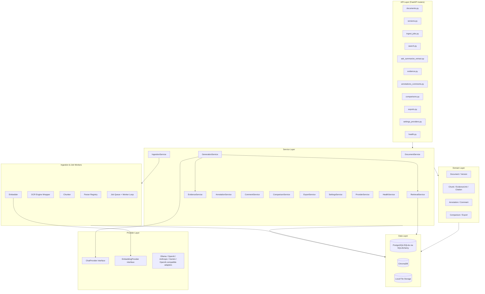
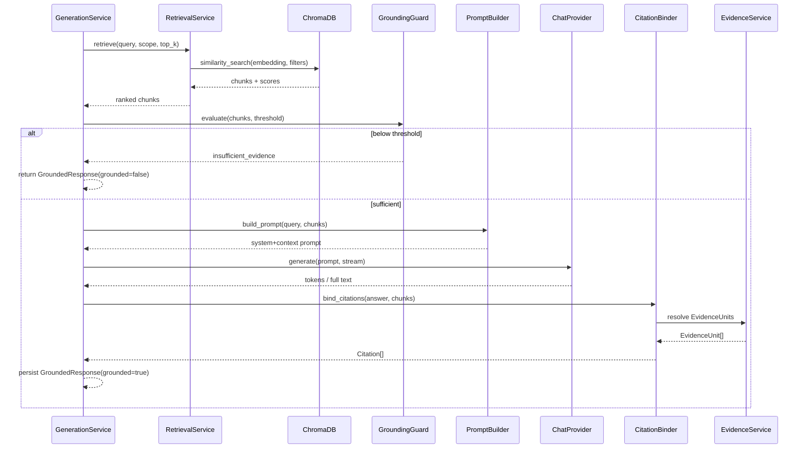
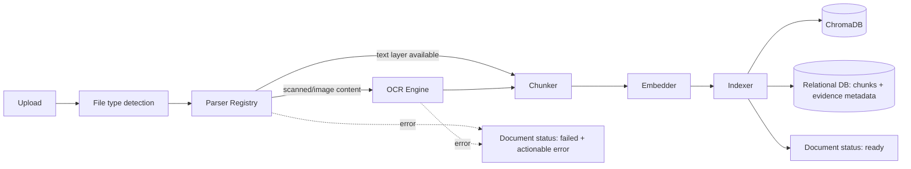
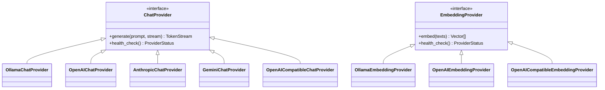

# 16 — Backend Architecture

**Product:** DuckDocs
**Document type:** Backend system architecture
**Status:** Draft for team review
**Audience:** Backend engineering, AI engineering, platform/DevOps, security
**Upstream:** [01_VISION.md](./01_VISION.md) · [02_PRODUCT_REQUIREMENTS.md](./02_PRODUCT_REQUIREMENTS.md) · [15_API_SPECIFICATION.md](./15_API_SPECIFICATION.md)
**Related docs:** [12_PROVIDER_ARCHITECTURE.md](./12_PROVIDER_ARCHITECTURE.md) · [13_DATABASE_DESIGN.md](./13_DATABASE_DESIGN.md) · [14_VECTOR_DATABASE.md](./14_VECTOR_DATABASE.md) · [21_FILE_PROCESSING.md](./21_FILE_PROCESSING.md)

---

## 1. Purpose

This document specifies how the FastAPI backend is organized internally: layered architecture, modular subsystems, service boundaries, background job model, and cross-cutting concerns (config, logging, security). It is the map from "the API contract exists" (doc 15) to "here is the codebase that implements it."

The central architectural bet is **modular subsystems with strict boundaries**, so that ingestion parsers, OCR engines, embedding/generation providers, and export formats can be added or swapped without touching unrelated code (AD-V03, AD-V04, RULE-08, PR-EXT01).

---

## 2. Scope

### In scope

- Layered backend architecture (API / service / domain / repository / provider / worker)
- Package/module structure
- Service boundaries and their single responsibilities
- Background job and async task model for ingestion and generation
- Provider abstraction pattern (chat + embedding)
- RAG pipeline internals (retrieval → grounding → citation binding)
- Ingestion pipeline internals (parse → OCR → chunk → embed → index)
- Configuration, settings persistence, and secrets handling
- Logging, error handling, and privacy-preserving observability
- Testing seams (what's mocked, what's integration-tested)

### Out of scope

- HTTP contract details → [15_API_SPECIFICATION.md](./15_API_SPECIFICATION.md)
- Table/column-level schema → [13_DATABASE_DESIGN.md](./13_DATABASE_DESIGN.md)
- Vector store internals (collections, distance metrics) → [14_VECTOR_DATABASE.md](./14_VECTOR_DATABASE.md)
- Format-by-format parsing fidelity → [21_FILE_PROCESSING.md](./21_FILE_PROCESSING.md)
- Provider-by-provider adapter contracts → [12_PROVIDER_ARCHITECTURE.md](./12_PROVIDER_ARCHITECTURE.md)
- Container/deployment topology → [29_DOCKER_ARCHITECTURE.md](./29_DOCKER_ARCHITECTURE.md)

---

## 3. Goals

| Goal ID | Goal | Maps to |
|---------|------|---------|
| BE-01 | Ingestion, retrieval, generation, evidence, review, and export are independently testable modules behind typed interfaces | AD-V03, RULE-09 |
| BE-02 | Chat and embedding providers are pluggable adapters behind one interface each, selected entirely by configuration | AD-V04, PR-S03, PR-S04 |
| BE-03 | No request path can silently reach the network unless it targets a provider the user explicitly configured | RULE-03, RULE-04, RULE-05 |
| BE-04 | Long-running work runs off the request thread with observable job state | PR-L05, PR-Q02 |
| BE-05 | The domain model (Document, Version, Chunk, Evidence, Annotation, Citation, Comparison, Export) is defined once and reused by every subsystem | AD-P03 |
| BE-06 | Backend runs correctly as a single local process/container with zero required external services | C-01, PC-02 |

---

## 4. High-Level Architecture



**Layering rule:** routers depend only on services; services depend on domain + repositories + providers; nothing below the service layer imports FastAPI. This keeps the domain and pipeline logic testable without spinning up HTTP.

---

## 5. Package Structure

```
backend/
├── app/
│   ├── main.py                     # FastAPI app factory, middleware, router mounting
│   ├── core/
│   │   ├── config.py                # pydantic-settings: env + settings.json layering
│   │   ├── logging.py               # structured logging, redaction filters
│   │   ├── security.py              # optional bearer token, CORS policy
│   │   └── errors.py                # error envelope + exception handlers
│   ├── api/
│   │   └── v1/
│   │       ├── router.py            # aggregates all routers under /api/v1
│   │       └── routes/
│   │           ├── documents.py
│   │           ├── versions.py
│   │           ├── ingest_jobs.py
│   │           ├── search.py
│   │           ├── responses.py     # ask / summarize / extract / responses
│   │           ├── evidence.py
│   │           ├── annotations.py
│   │           ├── comments.py
│   │           ├── comparisons.py
│   │           ├── exports.py
│   │           ├── settings.py
│   │           ├── providers.py
│   │           └── health.py
│   ├── services/
│   │   ├── document_service.py
│   │   ├── ingestion_service.py
│   │   ├── retrieval_service.py
│   │   ├── generation_service.py
│   │   ├── evidence_service.py
│   │   ├── annotation_service.py
│   │   ├── comment_service.py
│   │   ├── comparison_service.py
│   │   ├── export_service.py
│   │   ├── settings_service.py
│   │   ├── provider_service.py
│   │   └── health_service.py
│   ├── domain/
│   │   ├── models.py                 # dataclasses/Pydantic domain entities (not ORM)
│   │   └── grounding.py              # grounding rules, insufficient-evidence policy
│   ├── repositories/
│   │   ├── document_repo.py
│   │   ├── version_repo.py
│   │   ├── chunk_repo.py
│   │   ├── evidence_repo.py
│   │   ├── annotation_repo.py
│   │   ├── comment_repo.py
│   │   ├── comparison_repo.py
│   │   ├── export_repo.py
│   │   └── settings_repo.py
│   ├── db/
│   │   ├── base.py                   # SQLAlchemy Base, session factory
│   │   ├── models/                   # ORM models mirroring 13_DATABASE_DESIGN.md
│   │   └── migrations/               # Alembic env + versions/
│   ├── vectorstore/
│   │   ├── client.py                  # ChromaDB client wrapper
│   │   └── collections.py             # collection naming per embedding model
│   ├── providers/
│   │   ├── base.py                    # ChatProvider / EmbeddingProvider protocols
│   │   ├── ollama_provider.py
│   │   ├── openai_provider.py
│   │   ├── anthropic_provider.py
│   │   ├── gemini_provider.py
│   │   ├── openai_compatible_provider.py
│   │   └── registry.py                # maps settings -> live adapter instances
│   ├── ingestion/
│   │   ├── detector.py                 # file type / mime detection
│   │   ├── parsers/                    # one module per format family
│   │   │   ├── pdf_parser.py
│   │   │   ├── office_parser.py
│   │   │   ├── spreadsheet_parser.py
│   │   │   ├── presentation_parser.py
│   │   │   ├── image_ocr_parser.py
│   │   │   ├── structured_data_parser.py
│   │   │   ├── code_parser.py
│   │   │   └── epub_parser.py
│   │   ├── ocr/
│   │   │   └── ocr_engine.py            # wraps configured OCR engine (OQ-V02)
│   │   ├── chunker.py
│   │   └── pipeline.py                  # orchestrates parse -> ocr -> chunk -> embed -> index
│   ├── rag/
│   │   ├── retriever.py                 # vector search + filter application
│   │   ├── prompt_builder.py            # assembles grounded prompt from chunks
│   │   ├── citation_binder.py           # maps model output spans to EvidenceUnits
│   │   └── grounding_guard.py           # relevance threshold, insufficient-evidence decision
│   ├── jobs/
│   │   ├── job_queue.py                 # DB-backed queue table + polling worker loop
│   │   ├── ingest_worker.py
│   │   ├── export_worker.py
│   │   └── comparison_worker.py
│   ├── exporters/
│   │   ├── markdown_exporter.py
│   │   ├── pdf_exporter.py
│   │   └── registry.py
│   └── comparators/
│       ├── content_diff.py
│       └── registry.py                  # semantic/annotation diff plug in later (P2)
├── alembic.ini
├── tests/
│   ├── unit/
│   ├── integration/
│   └── contract/                        # provider + API contract tests
├── pyproject.toml
└── README.md
```

---

## 6. Service Boundaries

| Service | Responsibility | Depends on | Does not do |
|---------|------------------|-------------|----------------|
| `DocumentService` | Document/version lifecycle, upload orchestration, deletion cascade | `document_repo`, `version_repo`, file storage, `IngestionService` | Parsing content |
| `IngestionService` | Queues and tracks ingest jobs; delegates to `ingestion/pipeline.py` | job queue, parsers, OCR, chunker, `EmbeddingProvider` | Serving HTTP directly |
| `RetrievalService` | Vector search + metadata filters + score thresholding | ChromaDB client, `chunk_repo`, `EmbeddingProvider` | Generation |
| `GenerationService` | Builds grounded prompts, calls `ChatProvider`, streams tokens, invokes grounding guard and citation binder | `RetrievalService`, `EvidenceService`, `ChatProvider` | Direct DB writes beyond persisting the response |
| `EvidenceService` | Resolves evidence units, preview-context windows, evidence inspector aggregation | `evidence_repo`, `chunk_repo` | Retrieval scoring logic |
| `AnnotationService` | CRUD for highlights/annotations, anchor validation against version | `annotation_repo` | Comments |
| `CommentService` | CRUD + threading for comments on evidence/annotation/selection targets | `comment_repo` | Annotation anchor logic |
| `ComparisonService` | Orchestrates diff jobs across the `comparators/` registry | `comparison_repo`, `document_repo`, `version_repo` | Rendering diffs (frontend's job) |
| `ExportService` | Orchestrates export jobs across `exporters/` registry, writes to local export dir | `export_repo`, response/comparison data | Cloud upload |
| `SettingsService` | Local paths, OCR engine choice, privacy flags | `settings_repo` | Provider connectivity |
| `ProviderService` | Provider config CRUD, connectivity tests, model listing | `providers/registry.py` | Generation/embedding execution itself |
| `HealthService` | Aggregates DB/vector/storage/provider health | all of the above (read-only) | Mutations |

**BE-AD01:** Every service is a plain Python class constructed via FastAPI `Depends()` with repository/provider dependencies injected — no service reaches into a global singleton for its collaborators, which keeps unit tests fast and mock-friendly.

---

## 7. RAG Pipeline (Retrieval → Grounding → Citation)



**Grounding guard rules (BE-AD02):**

- Minimum retrieval score threshold (configurable per embedding model; documented default in [12_PROVIDER_ARCHITECTURE.md](./12_PROVIDER_ARCHITECTURE.md))
- Minimum retrieved-chunk count for summarize/extract (a single weak chunk is not enough basis for a multi-field extraction)
- The guard runs **before** the model is called for ask/search-derived flows where possible, and is re-checked on the model output for summarize (which can drift from source even with good retrieval)

**Citation binder** maps generated text spans (or per-field extraction values) back to the specific `EvidenceUnit`s used, rather than dumping the entire retrieved set as "citations" — this is what makes `PR-E02` (clickable, precise navigation) possible instead of a vague "sources used" list.

---

## 8. Ingestion Pipeline



**Pipeline stages map directly to `IngestJob.stage`** in the API contract (§10.3 of doc 15): `queued → parsing → ocr (conditional) → chunking → embedding → indexing → ready`, or `failed` from any stage with a captured error and the stage it failed at (supports retry-from-stage, API-OQ04).

**Parser Registry (BE-AD03):** each parser module registers the mime types / extensions it handles and returns a normalized `ParsedDocument` (pages, text blocks, tables, layout hints) regardless of source format. This is the extension point for `PR-EXT01` — adding a new file type means adding one parser module and a registry entry, not touching the pipeline orchestrator.

**Chunker** applies configurable chunk size/overlap and preserves every anchor field required by §9 of the PRD (page, section, paragraph, line range, char range, bbox, table cell) as first-class chunk metadata — never as an afterthought computed at query time.

---

## 9. Provider Abstraction



- `providers/registry.py` reads the active provider config from `SettingsService` and constructs the corresponding adapter — the rest of the codebase only ever depends on the `ChatProvider`/`EmbeddingProvider` protocol (BE-02).
- Every adapter reports `requires_network: bool` statically (`false` only for Ollama pointed at localhost) so `ProviderService`/`HealthService` can surface RULE-04's "visibly indicated when in use" requirement truthfully.
- Adapters are the **only** place in the codebase permitted to open an outbound HTTP connection to a third-party host (BE-03) — enforced by code review checklist and, optionally, an egress allowlist at the container network level (see [24_SECURITY.md](./24_SECURITY.md)).
- Full per-provider contracts, auth, and failure modes: [12_PROVIDER_ARCHITECTURE.md](./12_PROVIDER_ARCHITECTURE.md).

---

## 10. Background Jobs and Async Model

**BE-AD04:** DuckDocs uses a **DB-backed job queue with an in-process worker loop**, not Redis/Celery, as the P0 default — consistent with "zero required external services" (BE-06, PC-02).

| Aspect | Approach |
|--------|----------|
| Queue storage | A `jobs` table (ingest, export, comparison) with `status`, `stage`, `payload`, `attempts`, `next_run_at` |
| Worker | An `asyncio` background task started in the FastAPI lifespan, polling for claimable jobs with `SELECT ... FOR UPDATE SKIP LOCKED`-style claiming (or SQLite-safe equivalent locking) |
| Concurrency | Bounded worker pool sized from config (§12 of doc 15) |
| Progress reporting | Workers write `progress_pct`/`stage` updates the API layer reads for polling and SSE (`/ingest-jobs/stream`) |
| Retry | Failed jobs retain `error` + last successful `stage`; retry re-enters the pipeline at that stage where the pipeline step is idempotent, otherwise restarts (API-OQ04) |

**Future extensibility (BE-AD04 alternative path):** the worker interface (`enqueue`, `claim`, `complete`, `fail`) is defined so a future Redis/RQ-or-Celery-backed implementation can be swapped in for multi-machine/team deployments without changing service-layer code (see §14).

### Alternatives rejected

| Alternative | Why rejected |
|-------------|--------------|
| Celery + Redis for P0 | Adds a mandatory external service, violating local-first-zero-dependency default |
| Pure `BackgroundTasks` (FastAPI) with no persistence | Job state wouldn't survive a backend restart; fails PR-L10 (failures must stay visible) |
| Thread pool without a queue table | No observable job history/status for the API contract in doc 15 |

---

## 11. Configuration and Settings

| Layer | Source | Precedence |
|-------|--------|------------|
| Defaults | Hardcoded in `core/config.py` (`pydantic-settings`) | Lowest |
| Environment variables | `.env` / container env (deployment-level: ports, data root) | Middle |
| Persisted user settings | `settings` table, edited via `/settings` and `/providers` | Highest for anything user-configurable (providers, OCR engine, data paths, privacy flags) |

Secrets (cloud provider API keys) are stored encrypted at rest (see [24_SECURITY.md](./24_SECURITY.md)) and are never written to application logs. `ProviderConfig.api_key_ref` in the API is a reference/alias, never the raw key.

---

## 12. Logging, Errors, and Privacy-Preserving Observability

- Structured JSON logs (`core/logging.py`) with correlation `request_id` per API request, propagated into job logs for ingest/generation traceability.
- **Redaction filters strip document content and query text from logs by default** — logs may reference IDs, stages, and error codes, not the sensitive text itself (direct implementation of "no data leakage by design," §7.1 of the vision).
- No analytics SDK, no crash reporter that phones home, no default log shipping to any external service (RULE-05).
- Exception handlers in `core/errors.py` translate all raised domain/service exceptions into the standard error envelope (§8 of doc 15) — no raw stack traces reach clients outside debug mode.

---

## 13. Testing Seams

| Layer | Test strategy |
|-------|----------------|
| Domain + `rag/` + `ingestion/` pure logic | Unit tests, no DB/network |
| Repositories | Integration tests against a real local SQLite/Postgres test DB |
| Providers | Contract tests against a fake/local adapter implementing the same protocol; Ollama adapter integration-tested against a local test model |
| API routers | FastAPI `TestClient`/`httpx` end-to-end tests per endpoint in doc 15 |
| Job workers | Integration tests driving the queue table directly |

Full strategy and coverage targets: [35_TESTING_STRATEGY.md](./35_TESTING_STRATEGY.md).

---

## 14. Architecture Decisions

| ID | Decision | Rationale |
|----|----------|-----------|
| BE-AD01 | Constructor-injected services via `Depends()`, no global singletons for collaborators | Testability, matches BE-01 |
| BE-AD02 | Grounding guard is a distinct module, checked pre- and post-generation depending on task | Centralizes RULE-01/02 enforcement instead of duplicating it per endpoint |
| BE-AD03 | Parser registry pattern for ingestion | Matches AD-V03 modular ingestion; enables PR-EXT01 |
| BE-AD04 | DB-backed job queue + in-process worker for P0, swappable worker interface for later scale | Zero mandatory external services now, room to grow later |
| BE-AD05 | Providers are the only network-egress boundary in the codebase | Makes RULE-03/04/05 enforceable by code review + tooling, not just policy |
| BE-AD06 | One domain model shared by ingestion, retrieval, review, export | Matches AD-P03; avoids P1/P2 rewrites |

### Alternatives rejected

| Alternative | Why rejected |
|-------------|--------------|
| Monolithic "AI service" handling ingest + retrieval + generation | Blocks independent testing/scaling; contradicts AD-V07's rejection of a monolith |
| Provider-specific logic scattered across services | Leaks vendor lock-in into business logic; violates BE-02/RULE-08 |
| Store only vectors, skip relational chunk metadata | Breaks fine-grained citations (RULE-07); rejected at vision level (AD-V05) already |

---

## 15. Tradeoffs

| Tradeoff | Choice | Consequence |
|----------|--------|-------------|
| Zero external services vs. horizontal scalability | DB-backed queue | Team/enterprise scale-out needs a later worker-backend swap |
| Strict provider boundary vs. adapter code duplication | Small per-provider adapter modules | Some repeated boilerplate across 5 adapters, offset by shared protocol tests |
| Rich chunk metadata vs. ingest throughput | Full anchor capture at chunk time | Heavier CPU/time per document; mitigated by async pipeline + progress UX |
| Pre- and post-generation grounding checks vs. simplicity | Two checkpoints | Slightly more complex `GenerationService`, but stronger RULE-01 enforcement for summarize drift |

---

## 16. Interfaces

| Interface | Consumers |
|-----------|-----------|
| REST/SSE API (doc 15) | Next.js frontend |
| `ChatProvider` / `EmbeddingProvider` protocols | `GenerationService`, `RetrievalService`, ingestion embedder |
| Parser registry | `IngestionService`, pipeline orchestrator |
| Exporter / Comparator registries | `ExportService`, `ComparisonService` |
| Job queue interface | `IngestionService`, `ExportService`, `ComparisonService` |

---

## 17. Constraints

| ID | Constraint |
|----|------------|
| BE-C01 | No mandatory external service (Redis, message broker, cloud DB) for P0 |
| BE-C02 | All outbound network calls originate only from `providers/` adapters |
| BE-C03 | Backend must run as a single container/process with local volumes for files, DB, and vectors |
| BE-C04 | Alembic migrations are required for every schema change; no ad hoc DB mutation |
| BE-C05 | Domain models are defined once in `domain/models.py` and reused, not redefined per service |

---

## 18. Risks

| Risk | Impact | Mitigation |
|------|--------|------------|
| In-process worker loop starves API responsiveness under heavy ingest load | Sluggish UI during bulk upload | Bounded worker concurrency; consider separate process for workers if needed (documented escape hatch) |
| Provider adapter proliferation increases maintenance surface | Slower feature velocity | Shared contract test suite catches regressions across adapters cheaply |
| Grounding guard thresholds mistuned | Either too many refusals or ungrounded answers slip through | Thresholds are configurable + covered by an evaluation set (see [35_TESTING_STRATEGY.md](./35_TESTING_STRATEGY.md)) |
| SQLite locking under concurrent job claims | Job queue contention on constrained hardware | Document Postgres as the recommended production-scale local DB; SQLite remains fine for light single-user use |

---

## 19. Future Extensibility

- Swap the in-process worker for Celery/RQ + Redis behind the same queue interface for team/multi-machine deployments
- Add a plugin manifest so third-party parser/exporter/provider packages can register without core changes
- Citation graph service once the graph data model is approved (PR-E07)
- Multi-user local accounts: services already take an implicit "owner" concept that can become a real `user_id` scope
- Semantic + annotation comparison (P2) plugs into the existing `comparators/registry.py` without new API shapes (API-AD06)

---

## 20. Open Questions

| ID | Question | Owner | Needed by |
|----|----------|-------|-----------|
| BE-OQ01 | ~~SQLite vs. Postgres as the shipped default for P0?~~ **Resolved:** PostgreSQL is the Compose default (AD-S02 / DB-D07); SQLite remains an optional dev path | Backend Eng | Resolved 2026-07-18 |
| BE-OQ02 | Default OCR engine choice (ties to vision OQ-V02) — Tesseract vs. alternative? | AI + Platform | Before ingestion pipeline freeze |
| BE-OQ03 | Should the worker loop run in the same process as the API server or a separate container by default? | Platform | Before Docker architecture freeze |
| BE-OQ04 | Grounding threshold defaults per embedding model — fixed constants or auto-calibrated? | AI Eng | Before RAG pipeline freeze |

---

## 21. Acceptance Criteria

- [ ] Every service in §6 has a single clear responsibility with no overlapping ownership
- [ ] RAG pipeline enforces RULE-01/RULE-02 at a single, auditable checkpoint (grounding guard)
- [ ] Ingestion pipeline stages map 1:1 to `IngestJob.stage` values in doc 15
- [ ] Provider boundary is confirmed as the sole network-egress point in the codebase
- [ ] Job queue design satisfies PR-L10 (failures stay visible, not silently dropped)
- [ ] Package structure reviewed and accepted by backend + AI engineering leads

---

## 22. Cross-References

| Topic | Document |
|-------|----------|
| API contract | [15_API_SPECIFICATION.md](./15_API_SPECIFICATION.md) |
| Provider architecture | [12_PROVIDER_ARCHITECTURE.md](./12_PROVIDER_ARCHITECTURE.md) |
| Database design | [13_DATABASE_DESIGN.md](./13_DATABASE_DESIGN.md) |
| Vector database | [14_VECTOR_DATABASE.md](./14_VECTOR_DATABASE.md) |
| File processing / fidelity matrix | [21_FILE_PROCESSING.md](./21_FILE_PROCESSING.md) |
| Security | [24_SECURITY.md](./24_SECURITY.md) |
| Testing strategy | [35_TESTING_STRATEGY.md](./35_TESTING_STRATEGY.md) |

---

## Document Control

| Field | Value |
|-------|-------|
| Version | 0.1.0 |
| Last updated | 2026-07-18 |
| Authors | DuckDocs Architecture Team |
| Review state | Pending team review |
| Previous | [15_API_SPECIFICATION.md](./15_API_SPECIFICATION.md) |
| Next | [17_FRONTEND_ARCHITECTURE.md](./17_FRONTEND_ARCHITECTURE.md) |
