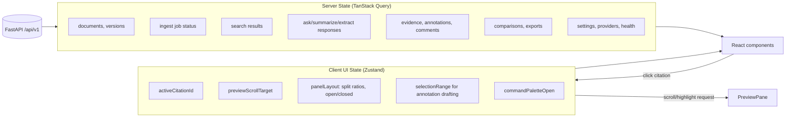
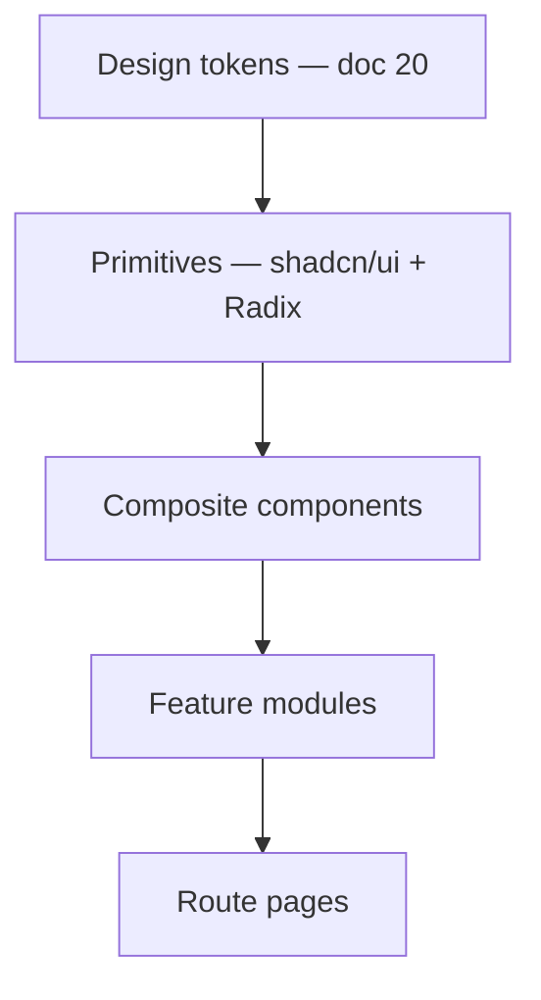

# 17 — Frontend Architecture

**Product:** DuckDocs
**Document type:** Frontend system architecture
**Status:** Draft for team review
**Audience:** Frontend engineering, design, QA
**Upstream:** [01_VISION.md](./01_VISION.md) · [02_PRODUCT_REQUIREMENTS.md](./02_PRODUCT_REQUIREMENTS.md) · [15_API_SPECIFICATION.md](./15_API_SPECIFICATION.md) · [16_BACKEND_ARCHITECTURE.md](./16_BACKEND_ARCHITECTURE.md)
**Related docs:** [18_UI_UX_SPECIFICATION.md](./18_UI_UX_SPECIFICATION.md) · [19_COMPONENT_LIBRARY.md](./19_COMPONENT_LIBRARY.md) · [20_DESIGN_SYSTEM.md](./20_DESIGN_SYSTEM.md)

---

## 1. Purpose

This document specifies how the Next.js/React/TypeScript frontend is organized: routing, state management, data fetching, streaming UI, component layering, and performance/accessibility architecture. It is the bridge between the API contract (doc 15) and the concrete UI (docs 18–20).

The frontend's defining constraint is that it renders **dense, evidence-heavy document work** — not a marketing site and not a simple chat widget — while treating citations as first-class, clickable, navigable objects everywhere they appear.

---

## 2. Scope

### In scope

- Next.js App Router structure and route ownership per surface (Library, Intelligence, Review, Settings)
- State management split (server state vs. UI state)
- Data-fetching and mutation patterns (TanStack Query)
- Streaming UI consumption (SSE) for generation
- Form architecture (React Hook Form + Zod)
- Component layering (primitives → composite → feature → page)
- Document preview/evidence-highlighting rendering architecture
- Performance architecture (virtualization, code-splitting, lazy loading)
- Accessibility and error-boundary strategy
- Local-first frontend constraints (no third-party scripts/CDNs by default)

### Out of scope

- Visual design tokens → [20_DESIGN_SYSTEM.md](./20_DESIGN_SYSTEM.md)
- Component inventory/props → [19_COMPONENT_LIBRARY.md](./19_COMPONENT_LIBRARY.md)
- Screen-by-screen UX flows/states → [18_UI_UX_SPECIFICATION.md](./18_UI_UX_SPECIFICATION.md)
- API request/response shapes → [15_API_SPECIFICATION.md](./15_API_SPECIFICATION.md)

---

## 3. Goals

| Goal ID | Goal | Maps to |
|---------|------|---------|
| FE-01 | Every citation rendered anywhere is clickable and deep-links to the exact evidence in preview | PR-E02, RULE-07 |
| FE-02 | Server state (documents, jobs, responses, evidence) is cached, revalidated, and never hand-rolled with `useEffect` fetch chains | PR-Q01 |
| FE-03 | Streaming generation renders incrementally without layout jank or citation-marker mismatch | PR-I02, API-AD04 |
| FE-04 | The four surfaces (Library, Intelligence, Review, Settings) are independently code-split and navigable via a stable IA | AD-P01 |
| FE-05 | Large documents and libraries remain smooth via virtualization, not full-DOM rendering | NFR performance budgets |
| FE-06 | No analytics/telemetry scripts, no third-party font/CDN dependency by default | RULE-05, C-02 |
| FE-07 | Accessible by default: keyboard navigation, focus management, ARIA for citations/annotations | PR-Q01 |

---

## 4. Tech Stack Rationale

| Layer | Choice | Why |
|-------|--------|-----|
| Framework | Next.js App Router | File-system routing per surface, server components for fast initial paint of dense lists, streaming support aligns with SSE generation UX |
| Language | TypeScript (strict) | Types generated/mirrored from the OpenAPI contract (doc 15) prevent contract drift |
| Styling | Tailwind CSS + CSS variables | Utility velocity + design-token-driven theming (doc 20) without a separate CSS-in-JS runtime |
| Components | Shadcn/UI + Radix primitives | Accessible, unstyled-by-default primitives that DuckDocs re-skins per doc 20, rather than a heavy pre-styled kit that fights the brand direction |
| Icons | Lucide | Consistent stroke-based icon set, tree-shakeable |
| Server state | TanStack Query | Caching, revalidation, background refetch, and mutation lifecycle for all API resources |
| Client/UI state | Zustand (small, scoped stores) | Panel layout, active citation, selection state — deliberately *not* Redux-scale ceremony |
| Forms | React Hook Form + Zod | Typed validation shared conceptually with backend Pydantic models; good performance for dense settings/extraction forms |
| Motion | Framer Motion | Declarative, interruption-safe animation for the 2–3 sanctioned motion patterns (doc 20 §7) |
| Data fetching transport | `fetch` + a typed API client wrapper; native `EventSource`/`fetch` streaming for SSE | No heavyweight GraphQL/gRPC client needed for a REST+SSE contract |

---

## 5. Route Structure (App Router)

```
app/
├── layout.tsx                       # Root layout: theme provider, query client, shell
├── globals.css                      # Design tokens (CSS variables) — see doc 20
├── (shell)/
│   ├── layout.tsx                   # AppShell: NavRail + TopBar + content slot
│   ├── library/
│   │   ├── page.tsx                 # Library grid/list (UX-L screens)
│   │   ├── upload/
│   │   │   └── page.tsx             # Upload flow (modal-first, route as fallback)
│   │   └── [documentId]/
│   │       ├── page.tsx             # Document detail + preview pane
│   │       ├── versions/
│   │       │   └── page.tsx         # Version history timeline
│   │       └── @preview/             # Parallel route: preview pane content
│   │           └── page.tsx
│   ├── intelligence/
│   │   ├── page.tsx                 # Intelligence workspace (search/ask/summarize/extract tabs)
│   │   └── responses/
│   │       └── [responseId]/
│   │           └── page.tsx         # Saved response detail + evidence inspector
│   ├── review/
│   │   ├── page.tsx                 # Review workspace entry (recent annotations/comments)
│   │   ├── compare/
│   │   │   └── page.tsx             # Comparison workspace (?left=&right=&mode=)
│   │   └── exports/
│   │       └── page.tsx             # Export history/status
│   └── settings/
│       ├── page.tsx                 # Settings overview
│       ├── providers/
│       │   └── page.tsx
│       ├── paths/
│       │   └── page.tsx
│       └── privacy/
│           └── page.tsx
├── api/
│   └── (none — all data comes from the FastAPI backend; this folder is reserved, unused in P0)
└── not-found.tsx
```

**FE-AD01:** Document preview uses a **parallel route slot** (`@preview`) so navigating between citations/evidence within a document updates the preview pane without remounting the surrounding Library chrome — critical for the "click citation → jump to evidence" interaction (FE-01) feeling instant.

**Citation deep-linking:** any citation link resolves to `/library/{documentId}?cite={evidenceUnitId}` (or the equivalent Intelligence-side response view), read by the preview pane to scroll/highlight the exact anchor on load — this makes evidence links shareable/bookmarkable within the local app.

---

## 6. State Management Architecture



| Rule | Detail |
|------|--------|
| FE-AD02 | Anything the backend owns (documents, jobs, responses, evidence, settings) lives in TanStack Query, keyed by resource + params, never duplicated into Zustand |
| FE-AD03 | Zustand stores are scoped per surface (`useLibraryUiStore`, `useIntelligenceUiStore`, `useReviewUiStore`) — no single global mega-store |
| FE-AD04 | Query keys follow `[resource, ...params]` (e.g. `['documents', { filter, sort, cursor }]`, `['response', responseId]`) so invalidation on mutation is precise |
| FE-AD05 | Mutations (annotate, comment, rename, delete) use optimistic updates with rollback on error, especially for annotation/comment creation where perceived latency matters most |

---

## 7. Data Fetching and API Client Layer

```
lib/
├── api/
│   ├── client.ts             # typed fetch wrapper: base URL, auth header, error envelope parsing
│   ├── types.ts              # generated/mirrored types from OpenAPI (doc 15 §8)
│   ├── documents.ts          # resource-specific fetcher functions
│   ├── versions.ts
│   ├── ingestJobs.ts
│   ├── search.ts
│   ├── responses.ts          # ask/summarize/extract + streaming helper
│   ├── evidence.ts
│   ├── annotations.ts
│   ├── comments.ts
│   ├── comparisons.ts
│   ├── exports.ts
│   └── settings.ts
├── queries/                  # useQuery/useMutation hooks per resource, built on lib/api/*
│   ├── useDocuments.ts
│   ├── useIngestJobStream.ts # SSE subscription hook feeding query cache updates
│   ├── useAskStream.ts       # SSE consumption for /ask, /summarize, /extract
│   └── ...
└── stores/                   # Zustand stores (§6)
```

- `lib/api/types.ts` is generated from the backend's OpenAPI schema (`/api/v1/openapi.json`) via a build-time codegen step, keeping frontend types mechanically in sync with doc 15 rather than hand-maintained (closing the loop mentioned in doc 15 §14).
- Every fetcher throws a typed `ApiError` matching the error envelope (doc 15 §7.3); a single top-level error boundary + toast pattern renders `code`-specific messaging (e.g. `provider_unavailable` → "Your AI provider isn't reachable" with a Settings link).

### 7.1 Streaming consumption pattern

`useAskStream` opens a `fetch` request with `Accept: text/event-stream`, parses SSE frames, and:

1. Writes `retrieval` event → sets a "grounding…" UI state
2. Accumulates `token` deltas into a local reducer (not the query cache, to avoid re-render storms) and renders incrementally
3. On `citations` event, resolves citation markers in the accumulated text into clickable `CitationChip` components
4. On `done`, seeds the TanStack Query cache for `['response', responseId]` with the final `GroundedResponse` so subsequent navigation reads from cache instead of re-streaming
5. On `error`, surfaces the error envelope and preserves partial text with a clear "generation interrupted" affordance rather than discarding it

---

## 8. Component Layering



| Layer | Examples | Owned by doc |
|-------|----------|----------------|
| Primitives | Button, Dialog, Tabs, Command, Tooltip | [19_COMPONENT_LIBRARY.md](./19_COMPONENT_LIBRARY.md) §Primitives |
| Composite | `CitationChip`, `EvidenceCard`, `MessageBubble`, `DocumentCard`, `DiffViewer` | [19_COMPONENT_LIBRARY.md](./19_COMPONENT_LIBRARY.md) §Composite |
| Feature modules | `LibraryGrid`, `IntelligenceWorkspace`, `EvidenceInspectorPanel`, `ReviewWorkspace` | [19_COMPONENT_LIBRARY.md](./19_COMPONENT_LIBRARY.md) §Feature |
| Route pages | `app/(shell)/library/page.tsx` etc. | this document, §5 |

Folder convention: `components/ui/*` (primitives, mostly generated by the shadcn CLI and then themed per doc 20), `components/composite/*`, `features/{library,intelligence,review,settings}/*` (feature modules + their local hooks/state), `app/*` (thin route files that compose feature modules).

---

## 9. Document Preview and Evidence-Highlighting Architecture

This is the most bespoke rendering subsystem in the frontend, because it must support precise anchors (page/line/char/bbox/table-cell) across heterogeneous source formats.

| Source tier (per §8.8 of the PRD) | Renderer |
|---|---|
| Full layout (PDF, DOCX, TXT/MD, code) | PDF.js-based canvas/text-layer renderer for PDF; a text-range renderer with virtualized line rendering for TXT/MD/code; DOCX rendered via converted layout (server-provided normalized layout, not live DOCX rendering in-browser) |
| Structural (spreadsheets, structured data, presentations) | Table/grid renderer with row/column highlight; slide-thumbnail + text-panel renderer for presentations |
| OCR-dependent (scans, images) | Image renderer with an absolute-positioned bbox overlay layer, opacity-scaled by OCR confidence |
| Best-effort | Plain text renderer with a visible "limited layout fidelity" badge |

**FE-AD06:** highlighting is implemented as an **overlay layer** positioned via anchor metadata (char offsets mapped to DOM ranges for text renderers; bbox coordinates scaled to the rendered image/page size for OCR renderers) rather than mutating the underlying document markup — this keeps the preview renderer swappable per format without the highlight logic caring which renderer produced the DOM.

Preview panes virtualize long documents (windowed page/line rendering) so a 500-page PDF or a 50k-line code file does not render its entire DOM at once (FE-05).

---

## 10. Forms Architecture

- All forms (Settings/providers, extraction schema builder, annotation/comment composer, export options) use **React Hook Form** with a **Zod** schema per form, colocated in `features/*/schemas.ts`.
- Zod schemas mirror backend Pydantic validation rules where they overlap (e.g. provider config required fields) to fail fast client-side before hitting the API.
- Field-level error messages map error codes from the API error envelope back onto the correct form field when the backend rejects a submission the client-side schema missed (e.g. a provider that validates on connect, not on shape).

---

## 11. Performance Architecture

| Concern | Approach |
|---------|----------|
| Route-level code splitting | Automatic via App Router; each surface (`library`, `intelligence`, `review`, `settings`) is its own chunk |
| Long list virtualization | `@tanstack/react-virtual` for Library grid/list, comment threads, evidence inspector chunk lists |
| Long document virtualization | Windowed rendering in the preview pane (§9) |
| Streaming-safe rendering | Token accumulation in a local reducer, not global state, to avoid cascading re-renders during `/ask` streaming |
| Image/PDF lazy loading | Preview thumbnails lazy-load below the fold in Library grid view |
| Prefetching | Hovering a `DocumentCard` prefetches its detail query; opening Intelligence prefetches recent responses |

---

## 12. Accessibility and Error Handling

- Built on Radix primitives specifically because they ship correct ARIA roles, focus trapping (dialogs/sheets), and keyboard interaction patterns out of the box — DuckDocs re-skins them rather than replacing their interaction logic (FE-07).
- Every `CitationChip`/evidence link is a real focusable element with `aria-label` describing the target ("Citation 1, page 4, Q3 Compliance Report") — never a bare styled `<span>`.
- Route-level error boundaries render the standard error-envelope-aware error state (doc 18 §Empty/Error states) instead of the Next.js default error screen.
- `prefers-reduced-motion` disables non-essential Framer Motion transitions (see doc 20 §7) while keeping state-change feedback (e.g. instant highlight instead of animated pulse).

---

## 13. Local-First Frontend Constraints

| Constraint | Implementation |
|------------|------------------|
| No analytics/telemetry scripts | No GA/Segment/Sentry-by-default; error reporting, if enabled at all, is opt-in and local-only |
| No third-party font CDN | Fonts self-hosted under `public/fonts`, loaded via `next/font/local` |
| No hidden outbound calls | All network requests visible in `lib/api/client.ts`; the only base URL is the local backend (or a user-configured LAN address) |
| CSP | Strict `Content-Security-Policy` with no wildcard `connect-src`; provider calls are proxied through the backend, so the browser itself never talks to OpenAI/Anthropic/Gemini directly |

---

## 14. Architecture Decisions

| ID | Decision | Rationale |
|----|----------|-----------|
| FE-AD01 | Parallel route slot for preview pane | Instant citation navigation without remounting shell chrome |
| FE-AD02 | Strict server-state/UI-state split (Query vs. Zustand) | Prevents duplicated/stale state bugs, keeps mental model simple |
| FE-AD03 | Per-surface Zustand stores, not one global store | Matches the four-surface IA; avoids cross-surface state coupling |
| FE-AD04 | OpenAPI-generated types | Contract drift between frontend and backend becomes a build-time error, not a runtime bug |
| FE-AD05 | Optimistic updates for annotations/comments only (not for AI generation) | Generation results can't be guessed client-side; annotations/comments are cheap to predict and revert |
| FE-AD06 | Highlight overlay layer decoupled from renderer DOM | Keeps multi-format preview extensible without highlight logic forking per format |
| FE-AD07 | Provider calls proxied through backend, never direct browser→cloud-provider requests | Keeps the browser's CSP simple and keeps RULE-04's "visibly indicated" logic server-authoritative |

### Alternatives rejected

| Alternative | Why rejected |
|-------------|--------------|
| Redux Toolkit for all state | Unnecessary ceremony given TanStack Query already owns server state |
| Client-side DOCX/PPTX live rendering libraries | Fragile fidelity and large bundle cost; server-normalized layout is more consistent with the fidelity-tier model |
| GraphQL client (Apollo/urql) | No GraphQL backend; REST+SSE fits doc 15 directly |
| Direct browser calls to cloud AI providers | Leaks API keys to the client and bypasses the backend's grounding/citation pipeline entirely |

---

## 15. Tradeoffs

| Tradeoff | Choice | Consequence |
|----------|--------|-------------|
| Bundle size vs. rendering fidelity | Custom multi-tier preview renderer instead of one generic viewer | More renderer code to maintain, but honest per-format fidelity (AD-P05) |
| Simplicity vs. real-time feel | SSE + local reducer for streaming instead of full Query-cache streaming | Slightly more custom hook code, much smoother token rendering |
| Type-safety rigor vs. build complexity | OpenAPI codegen step in the build pipeline | Adds a generation step; removes a whole class of contract-drift bugs |

---

## 16. Interfaces

| Interface | Detail |
|-----------|--------|
| Backend API | Consumed exclusively through `lib/api/*`; no component calls `fetch` directly |
| Design tokens | Consumed via CSS variables (doc 20) and Tailwind config mapping, never hardcoded hex values in components |
| Component library | Feature modules compose composite/primitive components from doc 19 only; no one-off styled elements duplicating an existing primitive |

---

## 17. Constraints

| ID | Constraint |
|----|------------|
| FE-C01 | No component may call an external network endpoint directly; all requests go through the backend |
| FE-C02 | All server-owned data must be read from TanStack Query, never fetched ad hoc inside a component `useEffect` |
| FE-C03 | Every citation/evidence link must be keyboard-focusable and screen-reader-labeled |
| FE-C04 | Long lists/documents above a defined item/line threshold must be virtualized |
| FE-C05 | No third-party analytics, font, or asset CDN dependency in the default build |

---

## 18. Risks

| Risk | Impact | Mitigation |
|------|--------|------------|
| Custom multi-format preview renderer scope creep | Slower delivery of Library/Review | Ship full-layout tier first (PDF/DOCX/TXT/MD), gate others behind fidelity badges |
| SSE reconnect handling edge cases (network blip mid-stream) | Lost/duplicated tokens | `useAskStream` tracks a monotonic token index and de-dupes on reconnect |
| OpenAPI codegen drift if backend ships undocumented fields | Silent type mismatches | CI step fails build if generated types differ from committed types without a matching PR |
| Virtualization interacting badly with highlight-overlay scroll-to-anchor | Citation click doesn't scroll to the right spot in a virtualized list | Overlay positioning recalculated after virtualizer scroll-to-index settles, covered by integration tests |

---

## 19. Future Extensibility

- Citation graph visualization view plugs into the existing Intelligence feature-module layer once the graph API exists (PR-E07)
- Additional preview renderers (e.g. richer EPUB reader) added as new tier implementations behind the same overlay/highlight interface
- Optional local desktop shell (Tauri/Electron) could reuse the same Next.js frontend against a local backend without architectural change, since there is no browser-only dependency baked in
- Multi-user local mode would add a lightweight account-switcher to the shell without touching route structure

---

## 20. Open Questions

| ID | Question | Owner | Needed by |
|----|----------|-------|-----------|
| FE-OQ01 | Is server-side rendering (RSC) used for the Library list for SEO-irrelevant but perf-relevant first paint, or is it client-rendered given local-only use? | Frontend Eng | Before route implementation |
| FE-OQ02 | DOCX/PPTX preview: server-normalized layout render vs. converted-to-PDF-then-render? | Frontend + Backend Eng | Before File Processing freeze |
| FE-OQ03 | Should the command palette (⌘K) span all four surfaces or be scoped per surface? | Design + Frontend Eng | Before UI/UX spec freeze |

---

## 21. Acceptance Criteria

- [ ] Route structure covers all four surfaces plus citation deep-linking
- [ ] Server/UI state split is agreed and documented for engineers onboarding
- [ ] Streaming consumption pattern reviewed against doc 15 §11 event vocabulary
- [ ] Preview/highlight architecture accepted as extensible per fidelity tier
- [ ] Local-first constraints (§13) confirmed with security review
- [ ] Component layering aligns with [19_COMPONENT_LIBRARY.md](./19_COMPONENT_LIBRARY.md)

---

## 22. Cross-References

| Topic | Document |
|-------|----------|
| API contract | [15_API_SPECIFICATION.md](./15_API_SPECIFICATION.md) |
| Backend architecture | [16_BACKEND_ARCHITECTURE.md](./16_BACKEND_ARCHITECTURE.md) |
| UI/UX specification | [18_UI_UX_SPECIFICATION.md](./18_UI_UX_SPECIFICATION.md) |
| Component library | [19_COMPONENT_LIBRARY.md](./19_COMPONENT_LIBRARY.md) |
| Design system | [20_DESIGN_SYSTEM.md](./20_DESIGN_SYSTEM.md) |

---

## Document Control

| Field | Value |
|-------|-------|
| Version | 0.1.0 |
| Last updated | 2026-07-18 |
| Authors | DuckDocs Architecture Team |
| Review state | Pending team review |
| Previous | [16_BACKEND_ARCHITECTURE.md](./16_BACKEND_ARCHITECTURE.md) |
| Next | [18_UI_UX_SPECIFICATION.md](./18_UI_UX_SPECIFICATION.md) |
