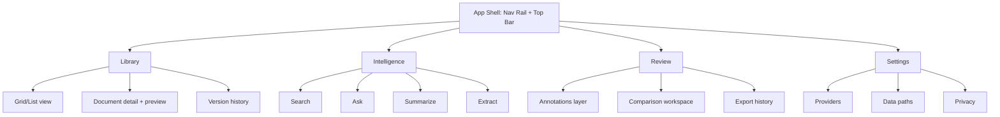
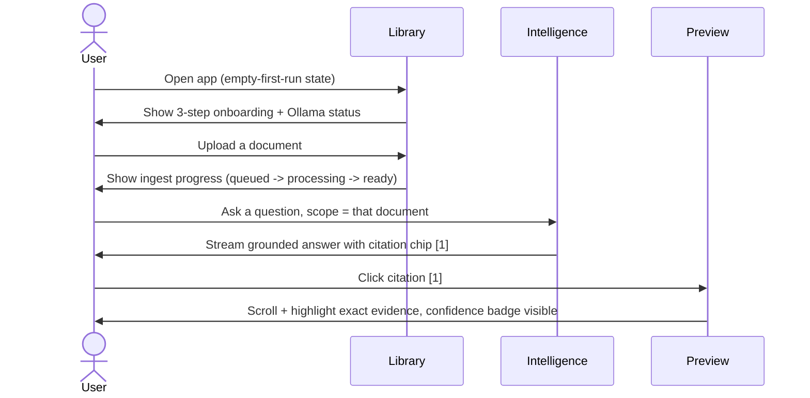
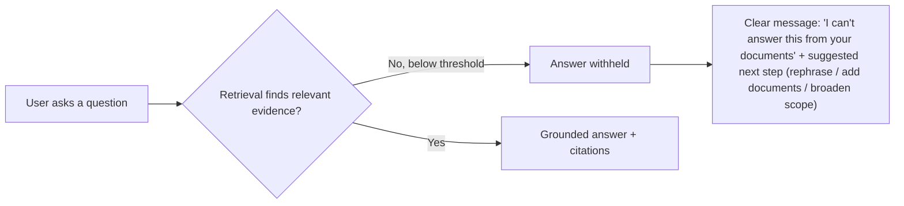
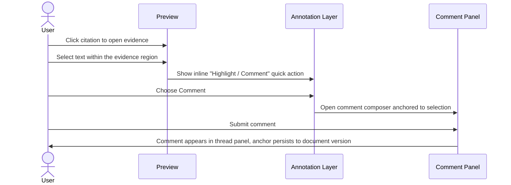
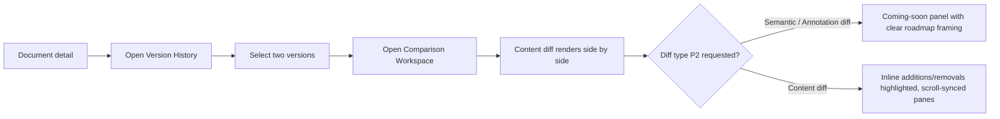
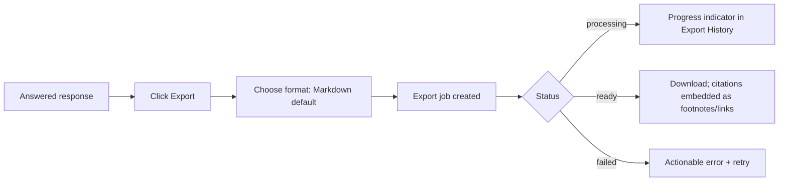

# 18 — UI/UX Specification

**Product:** DuckDocs
**Document type:** UX flows, screens, and interaction specification
**Status:** Draft for team review
**Audience:** Design, frontend engineering, product, QA
**Upstream:** [01_VISION.md](./01_VISION.md) · [02_PRODUCT_REQUIREMENTS.md](./02_PRODUCT_REQUIREMENTS.md) · [17_FRONTEND_ARCHITECTURE.md](./17_FRONTEND_ARCHITECTURE.md)
**Related docs:** [19_COMPONENT_LIBRARY.md](./19_COMPONENT_LIBRARY.md) · [20_DESIGN_SYSTEM.md](./20_DESIGN_SYSTEM.md)

---

## 1. Purpose

This document specifies the concrete screens, states, flows, and interaction patterns for DuckDocs' four surfaces — Library, Intelligence, Review, Settings. It translates product requirements (doc 02) and frontend architecture (doc 17) into what a user actually sees and does, screen by screen and state by state.

The organizing UX idea is **evidence as a first-class object**: citations are not footnotes, they are navigable, previewable, clickable units that connect every AI output back to a precise place in a source document.

---

Chat gpt and claude like user interface 

## 2. Scope

### In scope

- Information architecture and navigation model
- Screen inventory and state matrix (empty/loading/success/error) per surface
- Key end-to-end user flows with step sequences and Mermaid diagrams
- Citation/evidence interaction pattern
- Confidence visualization pattern
- Empty/error/loading state catalog and copy principles
- Motion pattern definitions (2–3 sanctioned patterns)
- Responsive behavior and minimum supported viewport
- Accessibility requirements at the interaction level
- Content/voice guidelines for grounded vs. ungrounded messaging

### Out of scope

- Component props/variants → [19_COMPONENT_LIBRARY.md](./19_COMPONENT_LIBRARY.md)
- Color/type/spacing tokens → [20_DESIGN_SYSTEM.md](./20_DESIGN_SYSTEM.md)
- Route/state-management implementation → [17_FRONTEND_ARCHITECTURE.md](./17_FRONTEND_ARCHITECTURE.md)
- API payload shapes → [15_API_SPECIFICATION.md](./15_API_SPECIFICATION.md)

---

## 3. Goals

| Goal ID | Goal                                                                                                                               | Maps to                                |
| ------- | ---------------------------------------------------------------------------------------------------------------------------------- | -------------------------------------- |
| UX-01   | A new user reaches a cited answer within minutes of a local install, with no ambiguity about what's local vs. remote               | PR-Q03, RULE-04                        |
| UX-02   | Every citation is visually distinct, clickable, and lands the user on the exact evidence                                           | PR-E02, RULE-07                        |
| UX-03   | Errors and empty states are always actionable, never dead ends                                                                     | PR-Q02, PR-Q03                         |
| UX-04   | Motion is purposeful and minimal — it clarifies state changes, never decorates                                                     | G-05, "Commercial Craft" (vision §7.7) |
| UX-05   | The product reads as a dense, professional document tool, not a chat demo or a dashboard template                                  | Vision §6 (What DuckDocs is not)       |
| UX-06   | Review affordances (annotate, comment, compare, export) are reachable from wherever evidence appears, not buried in a separate app | RULE-09, PR-R*                         |

---

## 4. Information Architecture

**Navigation model:** a persistent left **Nav Rail** (icon + label, collapsible to icon-only) switches between the four surfaces; a **Top Bar** carries surface-specific context (breadcrumb, scope selector, primary action) plus a global command palette (`⌘K`) for cross-surface jump-to (open document, run a query, jump to settings). The preview/evidence pane is a persistent **right-hand slot** available from Library, Intelligence, and Review — evidence is always one click away regardless of which surface the user is in (UX-06).

---

## 5. Screen Inventory and States

Every screen below is specified with its state matrix. Common states are defined once in §9 and referenced by name.

### 5.1 Library

| Screen                                  | Purpose                                        | States used                                                                                                         |
| --------------------------------------- | ---------------------------------------------- | ------------------------------------------------------------------------------------------------------------------- |
| Library grid/list                       | Browse, filter, sort documents                 | `empty-first-run`, `loading-list`, `populated`, `error-load`                                                        |
| Upload flow (modal + drag-drop overlay) | Add one or many files                          | `idle`, `dragging`, `uploading` (per-file progress), `upload-error` (per-file), `upload-success`                    |
| Document detail + preview               | Inspect one document, see status, open preview | `processing` (per ingest stage), `ready`, `failed` (actionable error + retry), `preview-loading`, `preview-ready`   |
| Version history                         | Browse/replace versions                        | `single-version` (empty-ish state prompting "replace to create history"), `populated`, `diff-loading`, `diff-ready` |

**Library empty-first-run** is the very first screen a new local install shows: a centered panel with three explicit steps — "1. Confirm your local model is running (Ollama status), 2. Add your first documents, 3. Ask your first question" — directly implementing PR-Q03's onboarding requirement and reinforcing local-first framing before any upload happens.

### 5.2 Intelligence

| Screen              | Purpose                                       | States used                                                                                                                                    |
| ------------------- | --------------------------------------------- | ---------------------------------------------------------------------------------------------------------------------------------------------- |
| Search              | Semantic search with scope selector           | `empty-no-query`, `loading-results`, `populated-results`, `empty-no-results` (distinct from below), `error-provider`                           |
| Ask (grounded chat) | Conversational Q&A with streaming + citations | `idle`, `grounding` (retrieval in progress), `streaming`, `answered-grounded`, `answered-ungrounded` (insufficient evidence), `error-provider` |
| Summarize           | Summarize doc/selection                       | `configuring` (length/format controls), `generating`, `ready`, `answered-ungrounded`                                                           |
| Extract             | Structured extraction against a schema        | `schema-builder`, `generating`, `ready` (field-by-field with per-field citations), `partial` (some fields ungrounded)                          |

**Scope selector** (document / selection / library) is present identically across Search, Ask, Summarize, Extract — implementing PR-I09 as one consistent control rather than four different pickers.

### 5.3 Review

| Screen                                 | Purpose                                    | States used                                                                                                                                                                                |
| -------------------------------------- | ------------------------------------------ | ------------------------------------------------------------------------------------------------------------------------------------------------------------------------------------------ |
| Annotation layer (overlaid on preview) | Highlight + note passages                  | `selecting`, `composing-annotation`, `saved`, `edit`, `delete-confirm`                                                                                                                     |
| Comment thread panel                   | Comment on evidence/annotations/selections | `empty-no-comments`, `populated-thread`, `resolved` (visually muted), `composing`                                                                                                          |
| Comparison workspace                   | Side-by-side document/version compare      | `picker` (choose left/right), `loading-diff`, `diff-ready` (content diff P1), `diff-unavailable` (semantic/annotation diff P2 placeholder with "coming soon" framing, not a broken button) |
| Export history                         | Track export jobs                          | `empty`, `populated`, `job-processing`, `job-ready` (download), `job-failed`                                                                                                               |

### 5.4 Settings

| Screen     | Purpose                                                  | States used                                                                                                                                         |
| ---------- | -------------------------------------------------------- | --------------------------------------------------------------------------------------------------------------------------------------------------- |
| Providers  | Configure chat/embedding providers                       | `local-connected` (Ollama reachable), `local-unreachable` (actionable fix steps), `cloud-configured`, `cloud-test-in-progress`, `cloud-test-failed` |
| Data paths | View/edit local storage locations                        | `populated` (paths + disk usage from `/health/storage`), `path-invalid`                                                                             |
| Privacy    | Confirm no-telemetry posture, network activity indicator | `populated` (always-on network-activity log of provider calls made)                                                                                 |

---

## 6. Key User Flows

### 6.1 First cited answer (onboarding-critical path)

This flow is the primary acceptance path for UX-01 and directly operationalizes the vision's Success Definition (§16 of doc 01).

### 6.2 Ungrounded / insufficient-evidence flow

The ungrounded state is styled as a distinct, calm, non-error visual treatment (not a red error banner) — it is a correct outcome, not a failure (RULE-02, PR-I06, AD-P06).

### 6.3 Annotate a cited passage

### 6.4 Compare two versions

### 6.5 Export a cited answer

---

## 7. Citation and Evidence Interaction Pattern

This pattern is used identically across Intelligence answers, Extraction fields, and Review comments — one interaction model, everywhere (UX-02).

| Element                    | Behavior                                                                                                                                                                                                               |
| -------------------------- | ---------------------------------------------------------------------------------------------------------------------------------------------------------------------------------------------------------------------- |
| **Citation chip**          | Small numbered/lettered marker (`[1]`) inline in generated text; hover shows a preview snippet tooltip; click opens/focuses the Preview pane scrolled and highlighted to the exact anchor                              |
| **Confidence signal**      | A subtle badge on the citation chip and in the Evidence Inspector reflecting retrieval score / OCR confidence tier (`high` / `medium` / `low`), never a raw uninterpreted number as the primary display                |
| **Evidence Inspector**     | A dedicated panel (opened from any response) listing every retrieved chunk used, with scores, so power users can audit "why did it answer this way" (PR-I07, PR-E06)                                                   |
| **Anchor precision label** | When an anchor is coarser than ideal (e.g. document-level only, no line/char), the UI says so explicitly ("Approximate location — page-level only") instead of pretending precision it doesn't have (RULE-07, RULE-10) |

---

## 8. Confidence Visualization

| Signal                      | Source                                                | Visual treatment                                                                                       |
| --------------------------- | ----------------------------------------------------- | ------------------------------------------------------------------------------------------------------ |
| Retrieval relevance         | Vector similarity score                               | 3-tier badge (High/Medium/Low relevance) on citation chips and search results                          |
| OCR confidence              | OCR engine per-region confidence                      | Bbox overlay opacity scaled by confidence; a "low OCR confidence" inline flag on affected evidence     |
| Extraction field confidence | Combination of retrieval + model agreement heuristics | Per-field badge in the Extraction results table                                                        |
| Overall groundedness        | `grounded: boolean` from the API                      | Governs whether the response renders in the standard answer style or the ungrounded-state style (§6.2) |

Confidence is always shown as **tiers with labels**, never as a bare decimal, so users build calibrated trust without needing to interpret raw model internals (supports RULE-10 and the vision's "graded confidence UI" risk mitigation).

---

## 9. Empty, Loading, and Error State Catalog

| State name            | When shown                                   | UX treatment                                                                                                                                                                   |
| --------------------- | -------------------------------------------- | ------------------------------------------------------------------------------------------------------------------------------------------------------------------------------ |
| `empty-first-run`     | No documents in library yet                  | Onboarding panel (§5.1), not a bare "no data" message                                                                                                                          |
| `empty-no-results`    | Search/filter returns nothing                | Distinct copy from ungrounded-answer state; suggests broadening scope or checking filters                                                                                      |
| `loading-*`           | Any data fetch in flight                     | Skeleton components matching final layout shape, never a generic spinner for list/detail views (spinners reserved for indeterminate short operations like a connectivity test) |
| `processing` (ingest) | Document mid-pipeline                        | Stage-labeled progress ("Extracting text… OCR… Indexing…"), not just a percentage bar                                                                                          |
| `failed` (ingest/job) | Pipeline or job error                        | Human-readable cause + one-click retry, never a raw stack trace or error code alone                                                                                            |
| `error-provider`      | Provider unreachable/misconfigured           | Names the provider, states whether it's local or remote, links to Settings                                                                                                     |
| `answered-ungrounded` | Insufficient evidence                        | Calm, non-alarming visual treatment distinct from `error-*` states (§6.2)                                                                                                      |
| `diff-unavailable`    | P2 comparison mode requested before it ships | Framed as roadmap, not as a broken feature                                                                                                                                     |

**Copy principle (UX-AD03):** error and empty-state copy always answers three questions — what happened, why (if known), what to do next. No bare "Something went wrong."

---

## 10. Motion Patterns

DuckDocs uses exactly **three** sanctioned motion patterns (vision §7.7, "intentional motion"). No motion is added outside these patterns without a design review update to this document.

| Pattern             | Used for                                                                                                          | Behavior                                                                                                                             | Token reference                  |
| ------------------- | ----------------------------------------------------------------------------------------------------------------- | ------------------------------------------------------------------------------------------------------------------------------------ | -------------------------------- |
| **Reveal**          | Panels opening (Preview pane, Evidence Inspector, Comment composer, Sheet/Dialog)                                 | Slide + fade from the edge of origin, 180ms, `ease-out-quart`                                                                        | `--dd-motion-reveal` (doc 20 §7) |
| **Grounding pulse** | A citation chip or evidence highlight appearing/being navigated to                                                | A single soft opacity pulse on the highlight region (not a bounce, not a color flash), 400ms, `ease-out`                             | `--dd-motion-pulse`              |
| **Stream settle**   | Token-by-token answer text arriving; list items entering after a mutation (new annotation, new document ingested) | Content fades/settles into place without shifting layout beneath the cursor; height changes are animated, not instant, to avoid jank | `--dd-motion-settle`             |

All three respect `prefers-reduced-motion` by collapsing to an instant state change with no animated transition, per FE-07/doc 17 §12.

---

## 11. Responsive Behavior

| Breakpoint                         | Behavior                                                                                                                                                  |
| ---------------------------------- | --------------------------------------------------------------------------------------------------------------------------------------------------------- |
| Desktop (≥1280px) — primary target | Full three-pane layout: Nav Rail + main content + Preview/Inspector pane simultaneously visible                                                           |
| Laptop (1024–1279px)               | Preview/Inspector pane becomes an overlay sheet triggered by citation click instead of a persistent third column                                          |
| Tablet (768–1023px)                | Nav Rail collapses to icon-only by default; one primary pane at a time with a back affordance                                                             |
| Below 768px                        | Not a primary target for P0 (dense document work assumption, per vision); a minimal read-only responsive fallback is acceptable but not a design priority |

DuckDocs is explicitly a **desktop-first dense productivity tool**, not a mobile-first app — this is a deliberate scope decision consistent with "dense document work UI" framing, not an oversight.

---

## 12. Accessibility Requirements

| Requirement         | Detail                                                                                                         |
| ------------------- | -------------------------------------------------------------------------------------------------------------- |
| Keyboard navigation | Full flow (upload → search/ask → click citation → annotate → export) achievable without a mouse                |
| Focus management    | Opening a panel (Reveal pattern) moves focus into it; closing returns focus to the trigger                     |
| ARIA labeling       | Citation chips, confidence badges, and status pills all carry descriptive `aria-label`s, not icon-only meaning |
| Color independence  | Confidence tiers and diff additions/removals are distinguishable by icon/label, not color alone                |
| Contrast            | All text/background pairs meet WCAG AA at minimum in both light and dark themes (enforced by tokens in doc 20) |
| Reduced motion      | Respected per §10                                                                                              |

---

## 13. Content and Voice Guidelines

| Context                          | Voice                                                                                                                       |
| -------------------------------- | --------------------------------------------------------------------------------------------------------------------------- |
| Grounded answers                 | Direct, factual, cites inline; never says "I think" or hedges beyond what the evidence supports                             |
| Ungrounded/insufficient-evidence | Honest and specific about *why* ("no passages matched with sufficient relevance"), never apologetic filler                  |
| Errors                           | Plain language, names the actual system involved (provider, OCR, storage), always paired with an action                     |
| Settings/privacy copy            | Precise and verifiable ("no data leaves this machine unless you configure a provider below"), avoiding vague trust language |

---

## 14. Architecture Decisions

| ID      | Decision                                                           | Rationale                                                                                   |
| ------- | ------------------------------------------------------------------ | ------------------------------------------------------------------------------------------- |
| UX-AD01 | Persistent right-hand Preview/Evidence slot across three surfaces  | Evidence must never be more than one click away (UX-06)                                     |
| UX-AD02 | Ungrounded state visually distinct from error state                | Prevents users from conflating a correct refusal with a bug (RULE-02)                       |
| UX-AD03 | Three-part error/empty copy formula (what/why/next)                | Enforced consistency, supports PR-Q02                                                       |
| UX-AD04 | Exactly three sanctioned motion patterns                           | Prevents motion sprawl; keeps the product feeling controlled, not "AI demo flashy"          |
| UX-AD05 | Desktop-first, dense-first layout                                  | Matches actual user job (serious document work), rejects generic responsive-first templates |
| UX-AD06 | One shared citation/evidence interaction model across all surfaces | Learnability; users only learn the pattern once                                             |

### Alternatives rejected

| Alternative                                      | Why rejected                                                                          |
| ------------------------------------------------ | ------------------------------------------------------------------------------------- |
| Modal-only citation preview (no persistent pane) | Breaks flow for rapid multi-citation verification                                     |
| Generic spinner for all loading states           | Feels unpolished for a commercial-grade product; skeletons communicate expected shape |
| Red/alert styling for insufficient-evidence      | Miscommunicates a correct behavior as an error                                        |
| Mobile-first responsive design                   | Conflicts with the dense document-work primary use case                               |

---

## 15. Tradeoffs

| Tradeoff                                                      | Choice                          | Consequence                                                                         |
| ------------------------------------------------------------- | ------------------------------- | ----------------------------------------------------------------------------------- |
| Persistent preview pane vs. more content width                | Reserve a pane on desktop       | Slightly less width for primary content; strongly reinforces evidence-first framing |
| Strict 3-pattern motion budget vs. expressive design flourish | 3 patterns only                 | Less "wow" motion, more perceived reliability/craft                                 |
| Desktop-first vs. broad device reach                          | Optimize for desktop dense work | Mobile experience is minimal in P0; acceptable given target users (vision §15)      |

---

## 16. Interfaces

| Interface         | Detail                                                                                                                       |
| ----------------- | ---------------------------------------------------------------------------------------------------------------------------- |
| Component library | Every screen/state in this doc is composed from components cataloged in [19_COMPONENT_LIBRARY.md](./19_COMPONENT_LIBRARY.md) |
| Design tokens     | Motion, color, and spacing values referenced here resolve to tokens in [20_DESIGN_SYSTEM.md](./20_DESIGN_SYSTEM.md)          |
| Frontend routes   | Screens map to routes defined in [17_FRONTEND_ARCHITECTURE.md](./17_FRONTEND_ARCHITECTURE.md) §5                             |

---

## 17. Constraints

| ID     | Constraint                                                                                              |
| ------ | ------------------------------------------------------------------------------------------------------- |
| UX-C01 | No AI-generated content renders without either a citation UI or the ungrounded-state UI                 |
| UX-C02 | No screen may present a dead-end error with no next action                                              |
| UX-C03 | Motion must come from the three sanctioned patterns (§10) or require a documented addition to this spec |
| UX-C04 | Primary layout target is ≥1280px; smaller breakpoints degrade gracefully, not redesign                  |

---

## 18. Risks

| Risk                                                                  | Impact                          | Mitigation                                                                         |
| --------------------------------------------------------------------- | ------------------------------- | ---------------------------------------------------------------------------------- |
| Users misread "ungrounded" calm styling as the system being broken    | Support confusion               | User-testing pass on the ungrounded state specifically before P0 ship              |
| Confidence tiers oversimplify real uncertainty                        | False confidence or false alarm | Evidence Inspector always available for power users who want raw scores            |
| Persistent preview pane crowds dense workflows on laptop-size screens | Cramped feel at 1024–1279px     | Overlay-sheet fallback (§11) instead of forcing the three-pane layout below 1280px |

---

## 19. Future Extensibility

- Citation graph view as a new Intelligence sub-screen once the graph data model ships (PR-E07)
- Semantic + annotation diff visual treatments slot into the existing Comparison Workspace states (§5.3) without new IA
- Confidence visualization can add a 4th signal (cross-model agreement) without changing the tiered-badge pattern
- Additional motion patterns require an explicit addition to §10, not ad hoc animation in feature code

---

## 20. Open Questions

| ID      | Question                                                                                        | Owner                 | Needed by                      |
| ------- | ----------------------------------------------------------------------------------------------- | --------------------- | ------------------------------ |
| UX-OQ01 | Exact wording for the first-run onboarding three steps — finalize with Product/Design copy pass | Design + Product      | Before P0 UI freeze            |
| UX-OQ02 | Should Evidence Inspector be a side panel or a full modal for power-user workflows?             | Design                | Before Review UI detailed spec |
| UX-OQ03 | Command palette scope: cross-surface vs. per-surface (ties to FE-OQ03)                          | Design + Frontend Eng | Before shell implementation    |

---

## 21. Acceptance Criteria

- [ ] Screen/state inventory covers every P0 requirement in PR-L*, PR-I*, PR-E*, PR-S*
- [ ] Citation/evidence interaction pattern is validated as consistent across Intelligence, Review, and Export contexts
- [ ] Ungrounded-state treatment is visually distinct from error-state treatment in design review
- [ ] Motion pattern budget (3 patterns) is accepted by design + frontend engineering
- [ ] Accessibility requirements reviewed against WCAG AA
- [ ] Responsive behavior decision (desktop-first) is signed off by product

---

## 22. Cross-References

| Topic                 | Document                                                     |
| --------------------- | ------------------------------------------------------------ |
| Frontend architecture | [17_FRONTEND_ARCHITECTURE.md](./17_FRONTEND_ARCHITECTURE.md) |
| Component library     | [19_COMPONENT_LIBRARY.md](./19_COMPONENT_LIBRARY.md)         |
| Design system         | [20_DESIGN_SYSTEM.md](./20_DESIGN_SYSTEM.md)                 |
| Product requirements  | [02_PRODUCT_REQUIREMENTS.md](./02_PRODUCT_REQUIREMENTS.md)   |

---

## Document Control

| Field        | Value                                                        |
| ------------ | ------------------------------------------------------------ |
| Version      | 0.1.0                                                        |
| Last updated | 2026-07-18                                                   |
| Authors      | DuckDocs Architecture Team                                   |
| Review state | Pending team review                                          |
| Previous     | [17_FRONTEND_ARCHITECTURE.md](./17_FRONTEND_ARCHITECTURE.md) |
| Next         | [19_COMPONENT_LIBRARY.md](./19_COMPONENT_LIBRARY.md)         |

