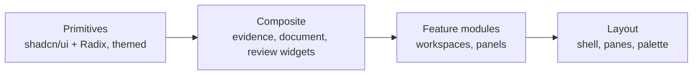

# 19 — Component Library

**Product:** DuckDocs
**Document type:** Component inventory and composition specification
**Status:** Draft for team review
**Audience:** Frontend engineering, design
**Upstream:** [17_FRONTEND_ARCHITECTURE.md](./17_FRONTEND_ARCHITECTURE.md) · [18_UI_UX_SPECIFICATION.md](./18_UI_UX_SPECIFICATION.md)
**Related docs:** [20_DESIGN_SYSTEM.md](./20_DESIGN_SYSTEM.md)

---

## 1. Purpose

This document catalogs every component DuckDocs needs, organized into four tiers (Primitive → Composite → Feature → Layout), with props/variant/state expectations and IDs (`CMP-*`) for traceability. It is the shared vocabulary between design and engineering so that no screen in doc 18 requires an undocumented one-off component.

---

## 2. Scope

### In scope

- Four-tier component taxonomy
- Inventory tables with variants, states, and surface usage per component
- State matrix requirements (default/hover/focus/active/disabled/loading/error)
- Composition sketches for the most evidence-critical composites
- Testing/documentation expectations (Storybook-style)

### Out of scope

- Visual tokens (color/type/spacing values) → [20_DESIGN_SYSTEM.md](./20_DESIGN_SYSTEM.md)
- Screen-level flows/states → [18_UI_UX_SPECIFICATION.md](./18_UI_UX_SPECIFICATION.md)
- State management/data fetching → [17_FRONTEND_ARCHITECTURE.md](./17_FRONTEND_ARCHITECTURE.md)

---

## 3. Goals

| Goal ID | Goal |
|---------|------|
| CMP-G01 | Every screen/state in doc 18 is buildable from components cataloged here |
| CMP-G02 | Evidence/citation components are used identically everywhere they appear (one definition, many call sites) |
| CMP-G03 | Every interactive component has a documented state matrix, not just a "default" mockup |
| CMP-G04 | Primitives are thin themed wrappers over shadcn/ui + Radix, never re-implemented from scratch |
| CMP-G05 | Composite components never hardcode copy/tokens that belong in doc 20 |

---

## 4. Component Tier Model



| Tier | Rule |
|------|------|
| Primitive | Wraps a Radix/shadcn primitive; adds DuckDocs tokens only; no domain knowledge (doesn't know what a "citation" is) |
| Composite | Domain-aware, reusable across features (a `CitationChip` doesn't know if it's in Intelligence or Review) |
| Feature | Surface-specific composition of composites; owns local state/data-fetching hooks |
| Layout | Structural shell components used exactly once per app instance (AppShell) or a small number of times (SplitPane) |

---

## 5. Primitive Components

| ID | Component | Base | Variants | States | Used in |
|----|-----------|------|----------|--------|---------|
| CMP-P01 | Button | shadcn `Button` | `primary`, `secondary`, `ghost`, `destructive`, `icon` | default/hover/focus/active/disabled/loading | All surfaces |
| CMP-P02 | Input | shadcn `Input` | `text`, `search`, `password` | default/focus/disabled/error | Forms, Search bar |
| CMP-P03 | Textarea | shadcn `Textarea` | `default`, `auto-grow` | default/focus/disabled/error | Comment/annotation composer |
| CMP-P04 | Select | Radix `Select` | `single` | default/open/disabled | Scope selector, format pickers |
| CMP-P05 | Combobox | `cmdk` + Radix Popover | `single`, `multi` | default/open/loading/empty | Tag filter, model picker |
| CMP-P06 | Dialog | Radix `Dialog` | `default`, `destructive-confirm` | open/closed | Delete confirm, upload modal |
| CMP-P07 | Sheet | Radix `Dialog` (side-anchored) | `right`, `left` | open/closed | Preview overlay (laptop breakpoint), mobile fallback panels |
| CMP-P08 | DropdownMenu | Radix `DropdownMenu` | `default` | open/closed | Document row actions, export format menu |
| CMP-P09 | Tabs | Radix `Tabs` | `default` | default/active/disabled | Intelligence workspace (Search/Ask/Summarize/Extract) |
| CMP-P10 | Tooltip | Radix `Tooltip` | `default` | visible/hidden | Citation preview snippet, icon-only buttons |
| CMP-P11 | Popover | Radix `Popover` | `default` | open/closed | Confidence detail, quick actions |
| CMP-P12 | Badge | shadcn `Badge` | `neutral`, `success`, `warning`, `danger`, `info`, `evidence` | default | Status pills, confidence tiers |
| CMP-P13 | Avatar | shadcn `Avatar` | `default`, `fallback-initials` | default | Comment authorship (local multi-profile future) |
| CMP-P14 | Checkbox / RadioGroup | Radix | `default` | checked/unchecked/indeterminate/disabled | Multi-select in Library, extraction schema builder |
| CMP-P15 | Switch | Radix `Switch` | `default` | on/off/disabled | Settings toggles (privacy flags) |
| CMP-P16 | Slider | Radix `Slider` | `default` | default/dragging/disabled | Chunk size / retrieval `top_k` advanced settings |
| CMP-P17 | Progress | Radix `Progress` | `determinate`, `indeterminate` | default | Ingest progress, export job progress |
| CMP-P18 | Skeleton | Custom (Tailwind) | `text`, `card`, `row` | default | All `loading-*` states (doc 18 §9) |
| CMP-P19 | Toast (Sonner) | `sonner` | `success`, `error`, `info` | enter/exit | Mutation feedback (save, delete, export ready) |
| CMP-P20 | Separator | Radix `Separator` | `horizontal`, `vertical` | default | Panel/section dividers |
| CMP-P21 | ScrollArea | Radix `ScrollArea` | `default` | default | Preview pane, comment thread panel |
| CMP-P22 | Command (palette) | `cmdk` | `default` | open/closed/searching | Global `⌘K` |
| CMP-P23 | Accordion / Collapsible | Radix | `default` | expanded/collapsed | Evidence Inspector chunk list, Settings sections |
| CMP-P24 | Table | shadcn `Table` | `default`, `sortable` | default/loading/empty | Extraction results, export history |

---

## 6. Composite Components

These are the domain-aware building blocks referenced repeatedly in doc 18. Each carries an explicit state matrix because they are the components most tied to trust (evidence, confidence, status).

| ID | Component | Purpose | Variants | State matrix | Used in |
|----|-----------|---------|----------|----------------|---------|
| CMP-C01 | `CitationChip` | Inline clickable citation marker | `numbered`, `lettered` | default/hover(preview tooltip)/focus/active(navigating)/visited | Intelligence answers, Extraction fields, Export preview |
| CMP-C02 | `EvidenceCard` | Summarized evidence unit (snippet + anchor + confidence) | `compact`, `expanded` | default/hover/selected | Evidence Inspector, Search results |
| CMP-C03 | `ConfidenceBadge` | Tiered confidence indicator | `high`, `medium`, `low` | default | Citation chips, Extraction fields, Search results |
| CMP-C04 | `DocumentCard` | Grid-view document tile | `default`, `compact-list-row` | default/hover/selected/processing/failed | Library grid/list |
| CMP-C05 | `DocumentRow` | List-view row with inline status | `default` | default/hover/selected/processing/failed | Library list view |
| CMP-C06 | `VersionTimeline` | Vertical version history | `default` | default/selected-pair (for compare) | Version history screen |
| CMP-C07 | `StatusPill` | Ingest/job status indicator | `queued`, `processing`, `ready`, `failed` | animated (processing), static otherwise | Library, Ingest Jobs, Export history |
| CMP-C08 | `ProviderStatusIndicator` | Persistent network-activity/provider indicator | `local-only`, `remote-active`, `unreachable` | default/pulsing (during active remote call) | Top Bar (global), Settings |
| CMP-C09 | `UploadDropzone` | Drag-drop + file picker | `default`, `compact` | idle/dragging/uploading/error | Library upload flow |
| CMP-C10 | `SearchBar` | Query input + scope selector | `default` | idle/focused/loading | Intelligence Search tab, global command palette fallback |
| CMP-C11 | `ChatComposer` | Ask input with scope + send | `default` | idle/composing/sending/disabled(no provider) | Intelligence Ask tab |
| CMP-C12 | `MessageBubble` | Rendered answer (grounded or ungrounded) | `grounded`, `ungrounded`, `streaming` | streaming/complete/error | Intelligence Ask tab |
| CMP-C13 | `AnnotationHighlight` | Overlay highlight region in preview | `default`, `active`, `authoring` | default/hover/selected | Preview pane annotation layer |
| CMP-C14 | `CommentThread` | Threaded comments on an anchor | `default` | empty/populated/resolved/composing | Review comment panel |
| CMP-C15 | `DiffViewer` | Side-by-side or inline content diff | `side-by-side`, `inline` | loading/ready/unavailable(P2 placeholder) | Comparison workspace |
| CMP-C16 | `ComparisonPicker` | Choose two documents/versions to compare | `documents`, `versions` | default/loading-candidates | Comparison workspace entry |
| CMP-C17 | `ExportDialog` | Choose export source/format | `default` | configuring/submitting/error | Export flow (any surface) |
| CMP-C18 | `ModelPicker` | Choose provider + model per kind (chat/embedding) | `chat`, `embedding` | default/testing/connected/failed | Settings Providers |
| CMP-C19 | `PathPicker` | View/edit local storage path | `default` | default/invalid/saving | Settings Data Paths |
| CMP-C20 | `ScopeSelector` | Document/selection/library scope control | `default` | default/open | Search, Ask, Summarize, Extract (shared, per UX-AD06) |
| CMP-C21 | `ExtractionFieldRow` | One extracted field with value + citation + confidence | `default`, `ungrounded-field` | default/editing(future) | Extraction results table |
| CMP-C22 | `EvidenceInspectorList` | Ranked list of retrieved chunks for a response | `default` | loading/populated/empty | Evidence Inspector panel |
| CMP-C23 | `FirstRunOnboardingPanel` | Three-step onboarding | `default` | step1/step2/step3 progressive states | Library empty-first-run |

### 6.1 Composition sketch — `CitationChip`

```tsx
<CitationChip
  ordinal={1}
  evidenceUnitId="ev_01J9..."
  snippet="Data must be retained for no less than 24 months..."
  confidence="high"
  onNavigate={(evidenceUnitId) => openPreviewAt(evidenceUnitId)}
/>
```

Renders an inline `<button>` (not a `<span>`, per FE-07/CMP-G03) styled with the reserved evidence-accent token (doc 20 §5.3), a `ConfidenceBadge` as a small corner indicator, and a `Tooltip` (CMP-P10) showing the snippet on hover/focus.

### 6.2 Composition sketch — `MessageBubble`

```tsx
<MessageBubble
  role="assistant"
  status={response.grounded === undefined ? "streaming" : response.grounded ? "grounded" : "ungrounded"}
  content={renderWithCitations(response.answer, response.citations)}
  refusalReason={response.refusal_reason}
  onOpenEvidenceInspector={() => openInspector(response.id)}
/>
```

`renderWithCitations` is a small text-processing utility (not a component) that splits answer text on citation markers and interleaves `CitationChip` instances — kept out of the component itself so the parsing logic is independently unit-testable.

---

## 7. Feature Modules

| ID | Module | Composes | Owns |
|----|--------|----------|------|
| CMP-F01 | `LibraryGrid` | `DocumentCard`/`DocumentRow`, `StatusPill`, `UploadDropzone` | List query, filter/sort UI state |
| CMP-F02 | `DocumentPreviewPane` | Format-specific renderer (doc 17 §9), `AnnotationHighlight`, `ConfidenceBadge` | Scroll/highlight-to-anchor logic |
| CMP-F03 | `EvidenceInspectorPanel` | `EvidenceInspectorList`, `EvidenceCard` | Per-response evidence query |
| CMP-F04 | `IntelligenceWorkspace` | `Tabs`, `SearchBar`, `ChatComposer`, `MessageBubble`, extraction table | Active tab state, streaming hook wiring |
| CMP-F05 | `ReviewWorkspace` | `CommentThread`, `DiffViewer`, `ComparisonPicker`, `ExportDialog` | Review-scoped UI state |
| CMP-F06 | `SettingsPanel` | `ModelPicker`, `PathPicker`, `ProviderStatusIndicator`, `Switch` | Settings form state (React Hook Form) |

---

## 8. Layout Components

| ID | Component | Purpose |
|----|-----------|---------|
| CMP-L01 | `AppShell` | Root shell: `NavRail` + `TopBar` + content slot + persistent Preview/Inspector pane |
| CMP-L02 | `NavRail` | Left navigation between the four surfaces, collapsible |
| CMP-L03 | `TopBar` | Breadcrumb/context, `ScopeSelector` slot, `ProviderStatusIndicator`, command palette trigger |
| CMP-L04 | `SplitPane` | Resizable two/three-column layout used by `AppShell` and `DiffViewer` |
| CMP-L05 | `CommandPalette` | Global `⌘K` (`Command` primitive) for cross-surface navigation and quick actions |

---

## 9. Component State Matrix Requirement

Every Composite and Layout component ships with, at minimum:

| State | Requirement |
|-------|--------------|
| Default | Documented visually and in code (Storybook-equivalent story or a states preview route) |
| Hover / Focus | Required for anything interactive; focus must be visibly distinct from hover (not identical styling) |
| Active/Selected | Required where multi-item selection or navigation exists |
| Disabled | Required wherever an action can be legitimately unavailable (e.g. no provider configured) |
| Loading | Required wherever the component depends on async data |
| Error | Required wherever the component's data source can fail |

**CMP-AD01:** Components without a full state matrix cannot be marked "ready" in the component tracking board — this is a merge gate, not a suggestion, because evidence-related components (CMP-C01–C03, C21–C22) are exactly where a missing error/loading state would silently misrepresent AI grounding.

---

## 10. Testing and Documentation Expectations

| Layer | Expectation |
|-------|--------------|
| Primitives | Snapshot/interaction tests via Testing Library; visual states documented in a lightweight component preview route (`/dev/components` in non-production builds) |
| Composites | Unit tests for logic-bearing props (e.g. `renderWithCitations`), interaction tests for click/keyboard navigation |
| Feature modules | Integration tests with mocked query data covering each state in doc 18's per-screen state matrix |
| Accessibility | Automated axe checks in CI for every Composite and Layout component |

---

## 11. Architecture Decisions

| ID | Decision | Rationale |
|----|----------|-----------|
| CMP-AD01 | Full state matrix is a merge gate for Composite/Layout components | Evidence-trust components can't ship with silent gaps |
| CMP-AD02 | `CitationChip`/`ConfidenceBadge` are singular, shared definitions used across all surfaces | One visual/interaction language for evidence (UX-AD06) |
| CMP-AD03 | Primitives never carry domain knowledge | Keeps the shadcn/Radix upgrade path clean; domain logic lives one layer up |
| CMP-AD04 | Citation text parsing is a pure utility function, not component logic | Independently testable, reusable in export rendering too |

### Alternatives rejected

| Alternative | Why rejected |
|-------------|--------------|
| Separate citation components per surface (chat vs. extraction vs. export) | Violates CMP-G02; creates visual/behavioral drift over time |
| Bundling a full third-party design kit (e.g. a prebuilt admin template) | Fights the distinctive brand direction required in doc 20 |
| Skipping state matrices for "simple" components | Every component eventually needs error/loading; retrofitting is costlier than specifying upfront |

---

## 12. Tradeoffs

| Tradeoff | Choice | Consequence |
|----------|--------|-------------|
| Upfront state-matrix rigor vs. delivery speed | Enforce CMP-AD01 as a gate | Slower initial component delivery, far fewer trust-eroding UI gaps later |
| Shared composites vs. per-surface customization | Shared `CitationChip`/`ConfidenceBadge`/`ScopeSelector` | Less per-surface visual tailoring, much stronger learnability |

---

## 13. Interfaces

| Interface | Detail |
|-----------|--------|
| Design tokens | All components consume tokens from [20_DESIGN_SYSTEM.md](./20_DESIGN_SYSTEM.md) via Tailwind config + CSS variables, never inline hex/px |
| Screens | Every state in [18_UI_UX_SPECIFICATION.md](./18_UI_UX_SPECIFICATION.md) §5 maps to a named component + state combination here |
| Data layer | Feature modules (§7) consume hooks from [17_FRONTEND_ARCHITECTURE.md](./17_FRONTEND_ARCHITECTURE.md) §7, never fetch directly |

---

## 14. Constraints

| ID | Constraint |
|----|------------|
| CMP-C01 | No new one-off styled element may duplicate an existing primitive/composite's purpose |
| CMP-C02 | Every citation/evidence-bearing component must expose a keyboard-accessible interaction path |
| CMP-C03 | Composite components must not hardcode color/spacing/motion values |
| CMP-C04 | Feature modules may not reach into another feature module's local state |

---

## 15. Risks

| Risk | Impact | Mitigation |
|------|--------|------------|
| Composite sprawl (near-duplicate components created ad hoc) | Inconsistent UI, maintenance burden | This catalog is the single source of truth; PR review checks against it |
| State-matrix gate slows early delivery | Schedule pressure to skip states | Ship skeleton/error states as cheap, reusable patterns (CMP-P18, toast) to keep the gate fast to satisfy |
| Shared composites become overloaded with per-surface conditional logic | Harder to reason about | Feature modules handle surface-specific composition; composites stay dumb/presentational |

---

## 16. Future Extensibility

- `CitationGraphNode`/`CitationGraphEdge` composites for the future citation graph view (PR-E07)
- `SemanticDiffBlock` and `AnnotationDiffMarker` composites slot into `DiffViewer` for P2 comparison modes
- `ExportFormatPreview` composite for additional export formats (DOCX/HTML/JSON bundle)
- Multi-user local mode: `Avatar`/authorship fields already present on `CommentThread` extend naturally

---

## 17. Open Questions

| ID | Question | Owner | Needed by |
|----|----------|-------|-----------|
| CMP-OQ01 | Should `DiffViewer` support inline mode in P1 or only side-by-side, with inline deferred to P2? | Design + Frontend Eng | Before Comparison workspace build |
| CMP-OQ02 | Is a dedicated component preview route (`/dev/components`) shipped in the repo, or is Storybook adopted formally? | Frontend Eng | Before component build begins |

---

## 18. Acceptance Criteria

- [ ] Every screen/state in [18_UI_UX_SPECIFICATION.md](./18_UI_UX_SPECIFICATION.md) maps to components in this catalog with no gaps
- [ ] `CitationChip`, `ConfidenceBadge`, `ScopeSelector` are confirmed as single shared definitions (CMP-AD02)
- [ ] State matrix requirement (§9) is accepted as a merge gate by frontend engineering leads
- [ ] Primitive list matches the shadcn/Radix components actually installed in the project
- [ ] Composition sketches reviewed against doc 17's streaming/highlight architecture

---

## 19. Cross-References

| Topic | Document |
|-------|----------|
| Frontend architecture | [17_FRONTEND_ARCHITECTURE.md](./17_FRONTEND_ARCHITECTURE.md) |
| UI/UX specification | [18_UI_UX_SPECIFICATION.md](./18_UI_UX_SPECIFICATION.md) |
| Design system | [20_DESIGN_SYSTEM.md](./20_DESIGN_SYSTEM.md) |

---

## Document Control

| Field | Value |
|-------|-------|
| Version | 0.1.0 |
| Last updated | 2026-07-18 |
| Authors | DuckDocs Architecture Team |
| Review state | Pending team review |
| Previous | [18_UI_UX_SPECIFICATION.md](./18_UI_UX_SPECIFICATION.md) |
| Next | [20_DESIGN_SYSTEM.md](./20_DESIGN_SYSTEM.md) |
