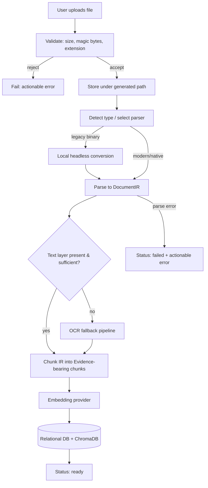

# 21 — File Processing

**Product:** DuckDocs
**Document type:** Subsystem architecture — Ingestion & File Processing
**Status:** Draft for team review
**Audience:** Engineering, AI/platform, QA, security
**Upstream:** [01_VISION.md](./01_VISION.md) · [02_PRODUCT_REQUIREMENTS.md](./02_PRODUCT_REQUIREMENTS.md)
**Related docs:** [22_OCR_PIPELINE.md](./22_OCR_PIPELINE.md) · [23_SEARCH_ARCHITECTURE.md](./23_SEARCH_ARCHITECTURE.md) · [24_SECURITY.md](./24_SECURITY.md) · [13_DATABASE_DESIGN.md](./13_DATABASE_DESIGN.md) · [14_VECTOR_DATABASE.md](./14_VECTOR_DATABASE.md)

---

## 1. Purpose

This document specifies the **File Processing subsystem**: the modular ingestion pipeline that turns an uploaded file of any supported type into normalized, chunked, evidence-bearing content ready for embedding, indexing, and citation.

It is the architectural home for the "modular parsers with graded fidelity" commitment made in [01_VISION.md](./01_VISION.md) (AD-V03) and [02_PRODUCT_REQUIREMENTS.md](./02_PRODUCT_REQUIREMENTS.md) (§8, §9, AD-P05). Every downstream capability — search, Q&A, citations, annotation, comparison, export — depends on File Processing producing consistent, provenance-rich output regardless of input format.

---

## 2. Scope

### In scope

- Format detection and parser selection/dispatch
- Modular parser plugin architecture (one module per format family)
- The intermediate representation (IR) all parsers normalize into
- Fidelity tiers and how they are computed, stored, and surfaced
- Chunking strategy per content type
- Ingestion pipeline stages, job/status model, and error handling
- Legacy/binary format handling strategy (DOC, PPT, XLS, ODP, ODT, ODS)
- Security-relevant handling of untrusted files (in cooperation with [24_SECURITY.md](./24_SECURITY.md))

### Out of scope

- OCR engine internals, confidence scoring, bounding boxes → [22_OCR_PIPELINE.md](./22_OCR_PIPELINE.md)
- Embedding generation and vector indexing → [23_SEARCH_ARCHITECTURE.md](./23_SEARCH_ARCHITECTURE.md)
- Relational schema definitions → [13_DATABASE_DESIGN.md](./13_DATABASE_DESIGN.md)
- Upload API contracts → [15_API_SPECIFICATION.md](./15_API_SPECIFICATION.md)
- Library UI/UX (status badges, error surfaces) → [07_FEATURE_SPECIFICATION.md](./07_FEATURE_SPECIFICATION.md)

---

## 3. Goals

| Goal ID | Goal | Maps to |
|---------|------|---------|
| FP-G01 | Support the full input-type surface in §8 of the PRD through **pluggable, independently testable parsers** | AD-V03, PR-L02 |
| FP-G02 | Normalize every format into one **common intermediate representation** so chunking, evidence, and citation logic are format-agnostic | AD-V05, AD-P03 |
| FP-G03 | Make fidelity **graded and honest** — never claim precision a format/parser cannot deliver | AD-P05, RULE-10 |
| FP-G04 | Never allow a partial/failed ingestion to look like success | PR-L10 |
| FP-G05 | Keep ingestion **asynchronous and observable** so large libraries and slow formats don't block the UI | PR-L05 |
| FP-G06 | Treat every uploaded file as **untrusted input** and process it safely | C-02, SEC-AD-01 |
| FP-G07 | Allow new formats to be added via **documented extension points** without touching core pipeline code | PR-EXT01 |

---

## 4. Supported Formats and Parser Modules

Each format family is owned by exactly one parser module. Modules share a common interface (§13) but may use different underlying libraries.

| Family | Formats | Primary approach | Fidelity tier |
|--------|---------|-------------------|---------------|
| PDF | PDF | Native text-layer extraction with layout/position data (e.g. PyMuPDF/pdfplumber-class library); falls back to OCR pipeline per page when text layer is absent/sparse | Full layout (text-native) / OCR-dependent (scanned) |
| Modern Office documents | DOCX | Direct XML parsing (paragraphs, headings, tables, styles) | Full layout |
| Legacy Office documents | DOC, PPT, XLS | Headless local conversion (LibreOffice) to modern equivalent, then parsed by the modern-format parser | Best-effort |
| Plain/markup text | TXT, MD | Direct read with encoding detection; MD parsed for heading/structure anchors | Full layout |
| Rich text | RTF | RTF-to-structured-text extraction | Structural |
| OpenDocument text | ODT | Direct ODF XML parsing (same tier as DOCX where structure is preserved) | Structural |
| Spreadsheets | XLSX, XLS, CSV, TSV, ODS | Sheet/row/column-aware parsing preserving cell references | Structural |
| Presentations | PPTX, ODP | Slide/shape-aware parsing preserving slide number and text-frame order | Structural |
| Presentations (legacy) | PPT | LibreOffice conversion → PPTX parser | Best-effort |
| Images | PNG, JPG, JPEG, WEBP, TIFF, BMP, HEIC | Routed entirely through the OCR pipeline | OCR-dependent |
| Structured data | JSON, XML, YAML | Schema-aware parse preserving key paths / node paths as anchors | Structural |
| Source code | Python, JS, TS, Java, C, C++, C#, Go, Rust, SQL, HTML, CSS | Line/token-aware parsing; language detected from extension (with content sniffing fallback) | Full layout |
| E-books | EPUB | Chapter/section-aware XHTML parsing within the EPUB container | Structural |

This table is the living **format-to-parser map**. Adding a format means adding a row here, a parser module, and (if new) a fidelity classification — never modifying the pipeline core.

---

## 5. Fidelity Tier Model

Fidelity tiers (introduced in PRD §8.8) describe what anchor granularity a parser can *reliably* guarantee, independent of how well any single document parses in practice.

| Tier | Anchor guarantee | Typical sources |
|------|-------------------|------------------|
| **Full layout** | Page, paragraph, line, and character-range anchors are reliable | PDF (text layer), DOCX, TXT/MD, most source code |
| **Structural** | Section/heading/cell/slide anchors are reliable; line/char anchors are best-effort | Spreadsheets, presentations, structured data (JSON/XML/YAML), ODT/RTF |
| **OCR-dependent** | Anchors derive from OCR bounding boxes plus a confidence score | Scanned PDFs, all image formats |
| **Best-effort** | Text is extracted; layout/anchors are unreliable or absent | Legacy DOC/PPT/XLS post-conversion, malformed/obscure files |

**Rule FP-01:** Every document and every chunk stores its fidelity tier as first-class metadata. The UI must be able to render an honest fidelity indicator without inferring it from format name alone (a DOCX with corrupt structure can degrade to best-effort at runtime).

**Rule FP-02:** A parser may **downgrade** a document's tier at runtime (e.g., a DOCX that fails structural parsing degrades to best-effort raw text extraction) but must never **upgrade** its declared ceiling tier.

---

## 6. Domain Model (Ingestion-Relevant Subset)

File Processing produces the following domain objects (full schema in [13_DATABASE_DESIGN.md](./13_DATABASE_DESIGN.md)):

| Entity | Purpose |
|--------|---------|
| **Document** | Stable identity for a user-visible file across versions |
| **Version** | An immutable snapshot of a Document's bytes + parsed output |
| **ParsedContent (IR)** | The normalized intermediate representation produced by a parser for one Version |
| **Chunk** | A retrievable/citable unit derived from ParsedContent |
| **Evidence metadata** | The anchor fields attached to a Chunk (PRD §9: page, section, paragraph, line/char range, bbox, table cell, OCR confidence, etc.) |

### 6.1 Intermediate Representation (IR)

All parsers emit a tree of typed blocks rather than raw text:

```
DocumentIR
 ├─ metadata: { title, language, page_count?, sheet_count?, slide_count?, fidelity_tier }
 └─ blocks: Block[]

Block =
 | PageBlock      { page_number, children: Block[] }
 | SectionBlock   { heading, level, children: Block[] }
 | ParagraphBlock { text, line_range?, char_range? }
 | TableBlock     { rows: Cell[][], sheet_name? }
 | ImageBlock     { image_ref, ocr_ref? }
 | CodeBlock      { language, text, line_range }
 | SlideBlock     { slide_number, children: Block[] }
```

The IR is the **single contract** between parsers and the chunker/evidence layer. Parsers differ; the IR does not.

---

## 7. Chunking Strategy

Chunking is IR-driven, not format-driven, so one chunker implementation serves all formats:

| Content shape | Chunking rule |
|---------------|---------------|
| Prose (paragraphs/sections) | Chunk by section/paragraph groups up to a configured token budget, preserving paragraph boundaries |
| Tables | Chunk per table, or per logical row-group for very large tables, preserving header row and cell coordinates |
| Slides | Chunk per slide (optionally merged with adjacent slides under the token budget) |
| Code | Chunk by logical unit where detectable (function/class) else by line-window, always preserving line ranges |
| OCR/image content | Chunk by reconstructed reading-order block (paragraph/line group), inheriting bounding boxes from §[22_OCR_PIPELINE.md](./22_OCR_PIPELINE.md) |
| Structured data (JSON/XML/YAML) | Chunk by top-level node/key path, preserving node path as the anchor |

Every chunk always carries: document ID, version ID, chunk ID, fidelity tier, and the finest anchor available for its content shape (PRD §9). Chunk size/overlap are configurable (see [26_CONFIGURATION.md](./26_CONFIGURATION.md), `CHUNK_SIZE`/`CHUNK_OVERLAP`).

---

## 8. Ingestion Pipeline Stages

1. **Upload & validation** — file received, size/type validated (magic bytes + extension), stored under a generated (non-user-controlled) path
2. **Type detection** — MIME/extension/content sniffing selects a parser module
3. **Legacy conversion (if needed)** — DOC/PPT/XLS/ODP routed through local headless conversion to a modern equivalent
4. **Parse to IR** — selected parser produces `DocumentIR`
5. **OCR fallback (conditional)** — triggered when text layer is absent/sparse (PDF) or the input is image-native; see [22_OCR_PIPELINE.md](./22_OCR_PIPELINE.md)
6. **Chunking** — IR converted into Chunks with evidence metadata
7. **Embedding** — chunks sent to the configured embedding provider (see [23_SEARCH_ARCHITECTURE.md](./23_SEARCH_ARCHITECTURE.md))
8. **Indexing** — chunks + vectors written to the relational store and ChromaDB
9. **Status update** — document status transitions to `ready` (or `failed` with actionable error, PR-L05/PR-L10)

Each stage is independently retryable and independently observable; a failure at stage 5 (OCR) does not silently mark the document `ready` with missing content.

---

## 9. Architecture Decisions

| ID | Decision | Rationale |
|----|----------|-----------|
| FP-AD-01 | Parser dispatch via a **plugin registry** keyed by detected MIME/extension, with an explicit fallback chain | New formats plug in without touching the orchestrator |
| FP-AD-02 | All parsers normalize into a single **IR** before chunking/evidence binding | Decouples format complexity from downstream logic (vision AD-V05) |
| FP-AD-03 | Legacy/binary formats are converted locally via headless LibreOffice in an isolated worker before parsing | Reuses mature converters without a bespoke binary-format parser per legacy type |
| FP-AD-04 | OCR is a **conditional fallback stage** inside the same pipeline, not a parallel pipeline | Keeps one pipeline mental model; avoids duplicated evidence logic |
| FP-AD-05 | Chunking logic is **IR-driven**, not format-driven | One chunker serves all formats; new formats inherit chunking for free once mapped to IR block types |
| FP-AD-06 | Ingestion is **asynchronous / job-queue based**, decoupled from the upload HTTP response | Large files and OCR-heavy documents must not block the UI or the request thread |
| FP-AD-07 | Fidelity tier is a **stored, queryable property** per document and per chunk | UI honesty (RULE-10) requires it to be data, not a UI-time guess |

### Alternatives rejected

| Alternative | Why rejected |
|-------------|--------------|
| One universal parsing library for all formats | No such library reliably covers PDF, Office, images, code, and structured data with good fidelity |
| Chunk directly from raw parser output per format | Would require a chunker per format family; breaks IR-driven design and future format additions |
| Synchronous ingestion blocking the upload request | Poor UX for large files/OCR; violates PR-L05's "queued/processing" model |
| Cloud document-conversion API for legacy formats | Violates local-first default (C-01); introduces mandatory network dependency |
| Store only final chunk text, discard the IR | Blocks future fidelity improvements, re-chunking, and layout-aware review features |

---

## 10. Tradeoffs

| Tradeoff | We choose | We accept |
|----------|-----------|-----------|
| Format breadth vs. uniform fidelity | Broad modular support, graded fidelity tiers | Legacy/OCR formats ship at lower fidelity than PDF/DOCX |
| Rich provenance vs. ingest speed | Full IR + evidence metadata capture | Heavier CPU/time per document; requires async pipeline and progress UX |
| One shared chunker vs. per-format optimization | IR-driven generic chunker | Some format-specific chunking nuance is deferred to future tuning, not blocked |
| Local legacy conversion (LibreOffice) vs. no legacy support | Local conversion dependency in the ingestion worker/image | Larger worker container image; conversion process must be sandboxed (§24) |
| Async pipeline vs. simplicity | Job/status model with queued/processing/ready/failed | More moving parts (queue, workers, status polling/streaming) than a synchronous call |

---

## 11. Data Flow



---

## 12. Interfaces

### 12.1 Parser Plugin Interface (conceptual)

```
class Parser:
  def supports(self, mime_type: str, extension: str) -> bool: ...
  def declared_fidelity_ceiling(self) -> FidelityTier: ...
  def parse(self, file_path: str) -> DocumentIR: ...
```

### 12.2 Chunker Interface

```
class Chunker:
  def chunk(self, ir: DocumentIR, config: ChunkConfig) -> list[Chunk]: ...
```

### 12.3 Pipeline Orchestrator API (internal)

| Operation | Description |
|-----------|--------------|
| `enqueue_ingestion(document_id, version_id)` | Schedules the async pipeline for a version |
| `get_status(document_id)` | Returns `queued \| processing \| ready \| failed` plus stage detail |
| `retry_stage(document_id, stage)` | Re-runs a failed stage without re-running successful prior stages |

Full request/response contracts live in [15_API_SPECIFICATION.md](./15_API_SPECIFICATION.md).

---

## 13. Constraints

| ID | Constraint |
|----|------------|
| FP-C-01 | All parsing/conversion runs in a sandboxed worker with CPU/memory/time limits (see [24_SECURITY.md](./24_SECURITY.md)) |
| FP-C-02 | No parser or converter may perform outbound network calls |
| FP-C-03 | Maximum upload size is configurable with a safe default (see [26_CONFIGURATION.md](./26_CONFIGURATION.md)) |
| FP-C-04 | Legacy format conversion uses only local tooling (no cloud conversion API) |
| FP-C-05 | Every chunk must carry the mandatory evidence fields defined in PRD §9 that are detectable for its fidelity tier |
| FP-C-06 | A document's status must never read `ready` while any required stage (including OCR fallback) has failed |
| FP-C-07 | Adding a new format must not require modifying the pipeline orchestrator, chunker, or evidence model — only a new parser module and a registry entry |

---

## 14. Error Handling and Status Model

| Status | Meaning | UI expectation |
|--------|---------|-----------------|
| `queued` | Accepted, awaiting a worker | Position/estimate if available |
| `processing` | Actively in a pipeline stage | Stage-level progress where feasible (e.g., "OCR page 4/12") |
| `ready` | All required stages succeeded | Full preview, search, and citation availability |
| `failed` | A required stage failed | Actionable error (what failed, suggested fix), retry action |
| `partial` (future) | Some pages/sheets/slides failed, rest succeeded | Explicit partial-fidelity banner, never silent (PR-L10) |

Errors are structured (`stage`, `reason_code`, `human_message`) so the UI can render actionable guidance per PR-Q02, and so support/debugging can distinguish "corrupt file" from "unsupported sub-feature" from "resource limit exceeded."

---

## 15. Risks

| Risk | Impact | Mitigation direction |
|------|--------|-----------------------|
| Malicious file exploits a parser (zip bomb, XML entity expansion, macro execution) | Security incident, DoS | Sandboxed workers, decompressed-size limits, XXE-safe XML parsing, macros disabled during conversion (§24) |
| Legacy format fidelity is poor | User trust erosion for those documents | Explicit "best-effort" labeling; encourage re-saving in modern format |
| Very large files/documents cause timeouts | Ingestion failures, poor UX | Per-stage time budgets, chunked/streamed parsing where library support allows, page-level partial success |
| Encoding detection failures (legacy TXT/CSV) | Garbled text, broken citations | Robust encoding sniffing with graceful fallback and a visible low-confidence flag |
| Embedded objects (OLE, macros, linked files) mis-parsed | Missing or misleading content | Explicitly extract-and-label embedded objects rather than silently drop or execute them |
| Format proliferation increases maintenance surface | Parser drift/regressions | Contract tests per parser against the IR schema; fidelity tier assertions in CI |

---

## 16. Future Extensibility

- Additional format parsers (e.g., additional CAD/vector formats, additional legacy variants) via the same plugin registry
- Third-party/community parser packages loaded through documented extension points (PR-EXT01)
- Format-specific chunking overrides layered on top of the generic IR-driven chunker
- Syntax-aware code chunking via language grammars (e.g., tree-sitter) for more precise function/class-level anchors
- Partial-success ingestion (`partial` status) for multi-page/sheet/slide documents where some units fail
- Streaming/incremental parsing for very large documents to reduce peak memory/time

---

## 17. Open Questions

| ID | Question | Owner | Needed by |
|----|-----------|-------|-----------|
| FP-OQ-01 | Which legacy formats (DOC/PPT/XLS/ODP) ship as P0 best-effort vs. deferred, given OQ-P06? | Product + Eng | Before P0 format freeze |
| FP-OQ-02 | Is LibreOffice headless conversion an acceptable permanent dependency in the ingestion worker image, or should it be replaced by native parsers over time? | Platform Eng | Before Docker image freeze |
| FP-OQ-03 | Is syntax-aware (tree-sitter) code chunking required for P0, or is line-window chunking acceptable initially? | AI Eng | Before ingestion P0 freeze |
| FP-OQ-04 | What is the maximum single-file size for P0, and does it vary by format? | Platform | Before NFR freeze (ties OQ-P05) |
| FP-OQ-05 | Should `partial` ingestion status ship in P0 or P1? | Product + Eng | Before P0 scope freeze |

---

## 18. Acceptance Criteria

This document is accepted when:

- [ ] The format-to-parser map (§4) matches the PRD §8 input type list exactly
- [ ] Fidelity tier definitions (§5) are agreed by Product, Engineering, and Design as the basis for UI fidelity indicators
- [ ] The IR schema (§6.1) is reviewed by the teams owning chunking, evidence, and OCR integration
- [ ] Chunking rules (§7) are agreed as sufficient for P0 citation quality
- [ ] Pipeline stages and status model (§8, §14) are approved as the basis for API and Library UI status design
- [ ] Security review confirms sandboxing/validation constraints (§13) are sufficient before implementation begins
- [ ] Open questions (§17) have owners and planning defaults

---

## 19. Cross-References

| Topic | Document |
|-------|----------|
| Vision / product requirements | [01_VISION.md](./01_VISION.md) · [02_PRODUCT_REQUIREMENTS.md](./02_PRODUCT_REQUIREMENTS.md) |
| OCR pipeline | [22_OCR_PIPELINE.md](./22_OCR_PIPELINE.md) |
| Search / embedding | [23_SEARCH_ARCHITECTURE.md](./23_SEARCH_ARCHITECTURE.md) |
| Security controls for file handling | [24_SECURITY.md](./24_SECURITY.md) |
| Database schema | [13_DATABASE_DESIGN.md](./13_DATABASE_DESIGN.md) |
| Vector database | [14_VECTOR_DATABASE.md](./14_VECTOR_DATABASE.md) |
| Configuration (chunk size, upload limits) | [26_CONFIGURATION.md](./26_CONFIGURATION.md) |

---

## Document Control

| Field | Value |
|-------|-------|
| Version | 0.1.0 |
| Last updated | 2026-07-18 |
| Authors | DuckDocs Architecture Team |
| Review state | Pending team review |
| Previous | [20_DESIGN_SYSTEM.md](./20_DESIGN_SYSTEM.md) |
| Next | [22_OCR_PIPELINE.md](./22_OCR_PIPELINE.md) |
