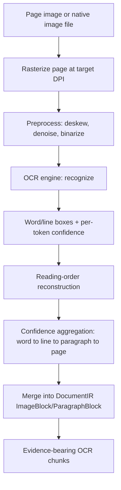

# 22 — OCR Pipeline

**Product:** DuckDocs
**Document type:** Subsystem architecture — Optical Character Recognition
**Status:** Draft for team review
**Audience:** Engineering, AI/platform, QA, security
**Upstream:** [01_VISION.md](./01_VISION.md) · [02_PRODUCT_REQUIREMENTS.md](./02_PRODUCT_REQUIREMENTS.md) · [21_FILE_PROCESSING.md](./21_FILE_PROCESSING.md)
**Related docs:** [23_SEARCH_ARCHITECTURE.md](./23_SEARCH_ARCHITECTURE.md) · [24_SECURITY.md](./24_SECURITY.md) · [26_CONFIGURATION.md](./26_CONFIGURATION.md)

---

## 1. Purpose

This document specifies the **OCR subsystem**: how DuckDocs extracts text, structure, and citable anchors from scanned documents and images, entirely on local hardware by default, while surfacing confidence honestly rather than hiding it.

OCR is the mechanism that makes RULE-10 ("when OCR or parsing confidence is low, the product must surface that uncertainty rather than hide it") and the evidence-first principle (§7.2 of the vision) hold true for non-text-native content. Without a rigorous OCR pipeline, scanned PDFs and images become second-class, uncitable content — which the vision explicitly rejects.

---

## 2. Scope

### In scope

- OCR trigger conditions and integration point with the File Processing pipeline
- OCR engine abstraction and the default local engine choice
- Preprocessing pipeline (deskew, denoise, binarize, DPI normalization)
- Confidence scoring model (word/line/paragraph/page aggregation)
- Bounding box model and coordinate system
- Language support and configuration
- Reading-order reconstruction for multi-column/complex layouts

### Out of scope

- General file type detection and non-OCR parsing → [21_FILE_PROCESSING.md](./21_FILE_PROCESSING.md)
- Embedding/indexing of OCR-derived chunks → [23_SEARCH_ARCHITECTURE.md](./23_SEARCH_ARCHITECTURE.md)
- Sandboxing/resource limits as a general security control (referenced, detailed in) → [24_SECURITY.md](./24_SECURITY.md)
- UI rendering of confidence/bounding boxes → [07_FEATURE_SPECIFICATION.md](./07_FEATURE_SPECIFICATION.md), [19_COMPONENT_LIBRARY.md](./19_COMPONENT_LIBRARY.md)

---

## 3. Goals

| Goal ID | Goal | Maps to |
|---------|------|---------|
| OCR-G01 | Every OCR-derived answer is traceable to a **bounding box** on the source page | G-02, PR-E01 |
| OCR-G02 | OCR runs **fully locally by default**, with zero network dependency | G-01, C-01 |
| OCR-G03 | OCR confidence is **always captured and surfaced**, never silently discarded | RULE-10, PR-E05 |
| OCR-G04 | OCR engine is **pluggable** so alternate/cloud engines can be added without core rewrites | G-04, AD-V04 |
| OCR-G05 | OCR does not run where it isn't needed (native text-layer documents) | Performance discipline (§9 tradeoffs) |
| OCR-G06 | Reading order is reconstructed well enough that citations point to sensible, human-readable passages | PR-E02 |

---

## 4. Trigger Conditions

OCR is a **conditional stage** inside the File Processing pipeline (see [21_FILE_PROCESSING.md](./21_FILE_PROCESSING.md) §8), not a parallel pipeline. It is invoked when:

| Condition | Example |
|-----------|---------|
| Input format is image-native | PNG, JPG, JPEG, WEBP, TIFF, BMP, HEIC |
| PDF page has no extractable text layer | Scanned PDF, print-to-image PDF |
| PDF page has a text layer but extracted text density is below a configured threshold (heuristic: characters-per-page-area) | Partially scanned/mixed PDFs, PDF with a thin OCR layer already baked in but no positional data |

Documents that pass the text-layer sufficiency check skip OCR entirely (OCR-G05) and retain the **Full layout** fidelity tier from native extraction.

---

## 5. OCR Pipeline Stages



1. **Rasterization** — non-image sources (PDF pages) are rendered to raster images at a configured target DPI (higher DPI improves accuracy at a CPU/time cost).
2. **Preprocessing** — deskew, denoise, contrast normalization, and binarization are applied as a configurable, ordered pipeline of steps; steps can be toggled per deployment for performance tuning.
3. **Recognition** — the configured OCR engine returns recognized text with per-word bounding boxes and confidence scores.
4. **Reading-order reconstruction** — word/line boxes are grouped into paragraphs/blocks in human reading order (left-to-right, top-to-bottom by default; multi-column detection groups by column before ordering).
5. **Confidence aggregation** — word-level confidence rolls up to line, paragraph, and page level (mean/weighted-mean; low-confidence outliers flagged rather than smoothed away).
6. **Merge into IR** — OCR output is written into the same `DocumentIR` blocks File Processing uses (`ImageBlock`/`ParagraphBlock` with `ocr_ref`), so the chunker treats OCR content the same way as native text, just with an OCR-dependent fidelity tier and richer per-chunk anchors (bbox + confidence).

---

## 6. Engine Abstraction and Default Choice

OCR access goes through a stable **engine interface** (§10) so the recognition backend is swappable without touching pipeline, chunking, or evidence code — mirroring the provider-abstraction pattern used for chat/embedding providers (AD-V04).

**Default engine: Tesseract**, invoked fully locally with no network dependency, satisfying C-01 and OCR-G02. This resolves the local-default half of vision open question OQ-V02; the interface remains open for evaluated alternatives (e.g., a higher-accuracy local engine, or an explicitly opt-in cloud OCR API) as a future/optional provider, never a P0 requirement.

| Engine | Mode | Status |
|--------|------|--------|
| Tesseract | Local, offline | **Default** |
| Alternative local engine (e.g., a neural OCR model) | Local, offline | Future option behind the same interface |
| Cloud OCR API | Remote, opt-in | Future option; must follow the same opt-in/indicator rules as any other remote provider (RULE-04, PR-S06) |

---

## 7. Confidence Model

| Level | Derivation | Use |
|-------|------------|-----|
| Word | Native engine output | Finest-grain confidence signal |
| Line | Aggregate of constituent words (weighted mean; minimum-outlier flag) | Drives per-line low-confidence highlighting |
| Paragraph/block | Aggregate of constituent lines | Stored on the Chunk as `ocr_confidence` (PRD §9) |
| Page/document | Aggregate of constituent blocks | Drives document-level fidelity/quality indicators in Library UI |

**Rule OCR-01:** A configurable confidence threshold (default set conservatively) marks a chunk **low-confidence**. Low-confidence chunks are never excluded from retrieval or citation by default — they are labeled, per RULE-10, so the user can judge trust rather than have it hidden.

**Rule OCR-02:** Confidence is a stored field, not a UI-computed value. The UI reads `ocr_confidence` from evidence metadata; it does not re-derive it.

---

## 8. Bounding Box Model

| Field | Description |
|-------|--------------|
| `page_number` | Page the box belongs to (1-indexed) |
| `bbox` | `{x, y, width, height}` in normalized page-relative coordinates (0–1 range), independent of the raster DPI used |
| `coordinate_origin` | Fixed convention: top-left origin, x right, y down |
| `granularity` | `word \| line \| paragraph \| block` — the level the box was aggregated to when stored on a chunk |

Normalized coordinates are used (rather than raw pixel coordinates) so that citation rendering is independent of the DPI chosen at rasterization time, and so bounding boxes remain valid if a page is re-rendered at a different resolution for preview.

Every OCR-derived chunk stores at least one bounding box; multi-line chunks store either a single bounding envelope or a list of per-line boxes (implementation choice deferred to [13_DATABASE_DESIGN.md](./13_DATABASE_DESIGN.md)), but never zero — an OCR chunk with no bbox is a pipeline defect (FP-C-05 / OCR-C-03).

---

## 9. Language Support

- A default language pack (or small set) ships with the local engine for out-of-the-box use.
- Language is configurable per deployment (`OCR_LANGUAGES`, see [26_CONFIGURATION.md](./26_CONFIGURATION.md)) and, where the engine supports it, can be set to multiple languages for mixed-language documents.
- Automatic language detection prior to recognition is a future enhancement (§16); P0 relies on configured language(s) rather than automatic detection to keep behavior predictable and fast.

---

## 10. Interfaces

### 10.1 OCR Engine Interface (conceptual)

```
class OcrEngine:
  def recognize(self, image: RasterImage, languages: list[str]) -> OcrResult: ...

OcrResult:
  words: list[Word]   # { text, bbox, confidence }
  lines: list[Line]   # grouped words, reading-order index
  blocks: list[Block] # grouped lines
```

### 10.2 Preprocessing Pipeline Interface

```
class PreprocessStep:
  def apply(self, image: RasterImage) -> RasterImage: ...
```

Steps (deskew, denoise, binarize, normalize-DPI) are composed in a configurable ordered list, allowing deployments to disable costly steps for speed or add new ones without touching the OCR engine call site.

### 10.3 Integration Point with File Processing

The OCR stage is invoked by the File Processing orchestrator (§8 of [21_FILE_PROCESSING.md](./21_FILE_PROCESSING.md)) as a resolver for `ImageBlock` nodes and for whole-page fallback; it returns IR-compatible blocks so the chunker requires no OCR-specific logic.

---

## 11. Architecture Decisions

| ID | Decision | Rationale |
|----|----------|-----------|
| OCR-AD-01 | OCR access goes through a pluggable **engine interface**, decoupled from the pipeline orchestrator | Enables future engines/cloud OCR without core rewrites (mirrors AD-V04) |
| OCR-AD-02 | Default engine is **local and offline** (Tesseract) | Satisfies C-01/local-first default; resolves OQ-V02's local-default half |
| OCR-AD-03 | OCR triggers **conditionally**, based on text-layer sufficiency, not unconditionally for every PDF | Avoids wasted CPU/time on already-text-native documents |
| OCR-AD-04 | Preprocessing is a **configurable ordered pipeline** of discrete steps | Allows per-deployment performance/quality tuning without code changes |
| OCR-AD-05 | Confidence and bounding boxes are **always persisted**, even when quality is poor | RULE-10 requires surfacing uncertainty, not discarding it |
| OCR-AD-06 | OCR execution happens in an **isolated worker with resource/time limits** | Consistency with FP-C-01; OCR is CPU-intensive and must not starve other pipeline stages |
| OCR-AD-07 | Bounding boxes are stored in **normalized page-relative coordinates** | Decouples citation rendering from rasterization DPI choices |

### Alternatives rejected

| Alternative | Why rejected |
|-------------|--------------|
| Cloud OCR as the default engine | Violates local-first default (C-01) and requires a mandatory network dependency |
| Store recognized text only, discard bounding boxes | Breaks OCR-dependent citation anchors, contradicting evidence-first (§7.2 vision) |
| Run OCR unconditionally on every PDF page | Wastes CPU/time on text-native PDFs; violates ingest performance expectations |
| Single monolithic OCR call with no preprocessing | Materially reduces recognition accuracy on real-world scans |
| Silently drop low-confidence tokens | Violates RULE-10; produces misleading "clean" transcripts |

---

## 12. Tradeoffs

| Tradeoff | We choose | We accept |
|----------|-----------|-----------|
| Local OCR accuracy vs. cloud OCR accuracy | Local engine by default | Slightly lower peak accuracy than best-in-class cloud OCR for some document types |
| Preprocessing cost vs. recognition quality | Configurable preprocessing pipeline, on by default | Additional CPU time per scanned page |
| Higher rasterization DPI (better accuracy) vs. speed/memory | Configurable DPI with a moderate default | Users with large scanned libraries may need to tune for their hardware |
| Reading-order heuristics vs. perfect layout understanding | Heuristic column/order detection | Complex multi-column or magazine-style layouts may occasionally mis-order text |
| Confidence transparency vs. clean-looking transcripts | Always show/label low confidence | Some users may perceive OCR output as "messier" than competitors that hide uncertainty |

---

## 13. Constraints

| ID | Constraint |
|----|------------|
| OCR-C-01 | Default OCR engine must run fully locally with zero network calls |
| OCR-C-02 | OCR workers run with configurable CPU/memory/time budgets, isolated from other pipeline stages |
| OCR-C-03 | Every OCR-derived chunk must include confidence and bounding box data, or an explicit "anchors unavailable" marker — never a silent gap |
| OCR-C-04 | Any optional cloud OCR provider must follow the same opt-in configuration and UI-indicator rules as chat/embedding remote providers (RULE-04, PR-S06) |
| OCR-C-05 | OCR must not mutate or persist the original file; it operates on rendered/rasterized copies only |

---

## 14. Risks

| Risk | Impact | Mitigation direction |
|------|--------|------------------------|
| Low-quality scans (skew, low resolution, poor contrast) | Degraded citation accuracy, trust erosion | Preprocessing pipeline; conservative confidence thresholds; visible low-confidence labeling |
| Large scanned PDFs are slow to ingest | Poor perceived performance, ingestion timeouts | Per-page time budgets, parallel page processing, progress reporting per PR-L05 |
| Handwriting is unsupported by the default engine | Silent gaps or garbage output for handwritten content | Detect and label handwritten/low-recognizable pages explicitly rather than emit noise |
| Multi-column/complex layouts break reading order | Citations point to disjointed or confusing passages | Column-detection heuristics; conservative chunk boundaries when order confidence is low |
| Language mismatch (wrong configured language) | Poor recognition accuracy | Clear settings guidance; future auto-detection (§16) |
| OCR worker resource exhaustion on pathological inputs | Pipeline-wide slowdown | Hard resource/time limits per OCR-C-02; circuit-breaker on repeated failures |

---

## 15. Future Extensibility

- Additional/alternate local OCR engines behind the same `OcrEngine` interface
- Optional cloud OCR provider (opt-in, indicator-visible) for users who accept the tradeoff for higher accuracy
- Handwriting recognition as a distinct, explicitly labeled capability
- Table structure recognition (OCR + layout analysis) for scanned tables, feeding `TableBlock` with cell-level anchors
- Automatic language detection prior to recognition
- GPU-accelerated preprocessing/recognition for large local libraries
- Per-document OCR re-run with different settings (e.g., higher DPI) when a user flags poor citation quality

---

## 16. Open Questions

| ID | Question | Owner | Needed by |
|----|-----------|-------|-----------|
| OCR-OQ-01 | Should DuckDocs evaluate alternative local OCR engines (e.g., a neural OCR model) against Tesseract before P0 freeze, per vision OQ-V02? | AI + Platform | Before pipeline design freeze |
| OCR-OQ-02 | What is the default low-confidence threshold, and should it be user-tunable in Settings? | Product + AI | Before P0 UI freeze |
| OCR-OQ-03 | Is table-structure OCR (cell-level anchors for scanned tables) required for P0 or deferred to P1/P2? | Product + Eng | Before P0 scope freeze |
| OCR-OQ-04 | Is GPU acceleration in scope for the default Docker Compose deployment, or CPU-only for P0? | Platform | Before deployment doc freeze |
| OCR-OQ-05 | Should automatic language detection ship before or after multi-language manual configuration is validated? | AI Eng | Before P1 planning |

---

## 17. Acceptance Criteria

This document is accepted when:

- [ ] Trigger conditions (§4) are agreed as sufficient to avoid both false-negative (missed OCR) and false-positive (wasted OCR on native text) cases
- [ ] The default engine choice (Tesseract, local) is approved, resolving the local-default half of OQ-V02
- [ ] Confidence and bounding box models (§7, §8) are approved as the basis for the evidence metadata schema (PRD §9) and citation UI
- [ ] Security review confirms OCR worker isolation and resource limits (§13) are sufficient
- [ ] Open questions (§16) have owners and planning defaults
- [ ] File Processing team confirms the IR integration point (§10.3) requires no changes to the chunker

---

## 18. Cross-References

| Topic | Document |
|-------|----------|
| Ingestion pipeline / IR | [21_FILE_PROCESSING.md](./21_FILE_PROCESSING.md) |
| Search / embedding of OCR chunks | [23_SEARCH_ARCHITECTURE.md](./23_SEARCH_ARCHITECTURE.md) |
| Worker sandboxing and resource limits | [24_SECURITY.md](./24_SECURITY.md) |
| OCR engine/language configuration | [26_CONFIGURATION.md](./26_CONFIGURATION.md) |
| Evidence metadata schema | [13_DATABASE_DESIGN.md](./13_DATABASE_DESIGN.md) |

---

## Document Control

| Field | Value |
|-------|-------|
| Version | 0.1.0 |
| Last updated | 2026-07-18 |
| Authors | DuckDocs Architecture Team |
| Review state | Pending team review |
| Previous | [21_FILE_PROCESSING.md](./21_FILE_PROCESSING.md) |
| Next | [23_SEARCH_ARCHITECTURE.md](./23_SEARCH_ARCHITECTURE.md) |
