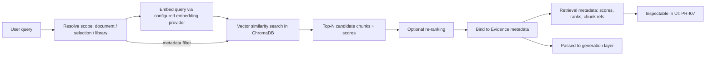

# 23 — Search Architecture

**Product:** DuckDocs
**Document type:** Subsystem architecture — Retrieval & Search
**Status:** Draft for team review
**Audience:** Engineering, AI/platform, QA
**Upstream:** [01_VISION.md](./01_VISION.md) · [02_PRODUCT_REQUIREMENTS.md](./02_PRODUCT_REQUIREMENTS.md) · [21_FILE_PROCESSING.md](./21_FILE_PROCESSING.md)
**Related docs:** [22_OCR_PIPELINE.md](./22_OCR_PIPELINE.md) · [24_SECURITY.md](./24_SECURITY.md) · [14_VECTOR_DATABASE.md](./14_VECTOR_DATABASE.md) · [12_PROVIDER_ARCHITECTURE.md](./12_PROVIDER_ARCHITECTURE.md)

---

## 1. Purpose

This document specifies the **Search / Retrieval subsystem**: how DuckDocs turns a natural-language query or search term into a ranked set of citable chunks, scoped correctly, with inspectable retrieval metadata — the foundation every grounded AI response (Q&A, summarization, extraction) is built on.

Retrieval is the mechanism that makes RULE-01 ("the model is never the source of truth; retrieved evidence is") operational. If retrieval is wrong, scoped incorrectly, or opaque, grounding fails regardless of how well the generation layer behaves.

---

## 2. Scope

### In scope

- Semantic (vector) retrieval architecture using ChromaDB as the default local vector store
- Scoping model: document / selection / library
- Retrieval metadata exposed to the evidence layer and UI (PR-I07)
- Design for future hybrid (keyword + vector) retrieval without redesign
- Ranking and optional re-ranking
- Indexing lifecycle (create, update, delete) in relation to the vector store

### Out of scope

- Embedding model selection and provider mechanics → [12_PROVIDER_ARCHITECTURE.md](./12_PROVIDER_ARCHITECTURE.md)
- Chunk creation and evidence metadata generation → [21_FILE_PROCESSING.md](./21_FILE_PROCESSING.md)
- Answer generation / prompt construction from retrieved chunks → AI/generation architecture docs (08–11)
- Vector database internals/operations (persistence, backup) → [14_VECTOR_DATABASE.md](./14_VECTOR_DATABASE.md)

---

## 3. Goals

| Goal ID | Goal | Maps to |
|---------|------|---------|
| SRCH-G01 | Retrieval is **meaning-based** (semantic), not limited to exact keyword matches | G-02, PR-I01 |
| SRCH-G02 | Queries can be **scoped** to a single document, a selection, or the whole library | PR-I09 |
| SRCH-G03 | Retrieval results and metadata are **inspectable**, never a black box | PR-I07 |
| SRCH-G04 | Architecture is **hybrid-ready**: keyword/BM25 retrieval can be added later without redesigning the retrieval API | G-03, PR-EXT01 |
| SRCH-G05 | Default retrieval path is **fully local** (ChromaDB + local embeddings) | G-01, PR-S01 |
| SRCH-G06 | Embedding provider is **independent** of the chat/generation provider | AD-P04, PR-S03 |

---

## 4. Retrieval Pipeline



1. **Scope resolution** — the query is tagged with a scope (`document`, `selection`, or `library`), which becomes a metadata filter, not a separate index.
2. **Query embedding** — the query text is embedded using the configured embedding provider (independent from the chat provider, §8).
3. **Vector similarity search** — ChromaDB is queried for the top-N nearest chunks within the scope filter.
4. **Optional re-ranking** — a pluggable re-ranking stage (e.g., a cross-encoder) may reorder candidates; disabled by default at P0 for latency/simplicity.
5. **Evidence binding** — each candidate chunk is resolved to its full evidence metadata (document, version, page/section/line/char/bbox, as available).
6. **Retrieval metadata surfacing** — scores, ranks, and chunk references are attached to the response so PR-I07 (inspect retrieved chunks) is satisfiable directly from stored data, not reconstructed after the fact.

---

## 5. Vector Store Model (ChromaDB)

| Aspect | Design choice |
|--------|----------------|
| Store | ChromaDB, running locally, persisted to a Docker volume |
| Collection strategy | A **single collection per deployment** (or per logical library), not one collection per document |
| Scoping mechanism | Metadata filters (`document_id`, `version_id`, `chunk_id`, selection ID) applied at query time, not separate collections |
| Stored per vector | `chunk_id`, `document_id`, `version_id`, embedding vector, plus enough metadata to filter without a relational round-trip |
| Source of truth for full evidence | The relational store (PRD §9 fields); ChromaDB holds retrieval-relevant metadata plus a foreign key back to the Chunk record |

**Rationale for single-collection + filters:** per-document collections do not scale operationally (collection sprawl, index overhead) and complicate library-wide search; metadata filtering achieves the same isolation without that cost (see AD-V05 — vector store optimizes retrieval, relational store owns provenance).

---

## 6. Scoping Model

| Scope | Resolution |
|-------|------------|
| **Document** | Metadata filter `document_id = X` (optionally `version_id` pinned to the version being viewed) |
| **Selection** | Metadata filter on an explicit set of `chunk_id`s or a `document_id` subset defined by the user's current selection |
| **Library** | No document/selection filter; optionally still scoped by other facets (e.g., folder/tag) if the Library UI supports them |

**Rule SRCH-01:** Scope filters are enforced **server-side** in the retrieval query itself, never applied only as a UI-side post-filter — a client that requests a document-scoped search must be structurally unable to receive chunks from other documents.

---

## 7. Ranking and Retrieval Metadata

Every retrieval response carries, per candidate chunk:

| Field | Description |
|-------|--------------|
| `chunk_id`, `document_id`, `version_id` | Identity |
| `similarity_score` | Raw vector similarity score from ChromaDB |
| `rank` | Position after any re-ranking |
| `retrieval_strategy` | e.g., `vector` (P0), `hybrid` (future) — recorded even when only one strategy exists, so future mixed-strategy responses are self-describing |
| Evidence anchor fields | Page/section/paragraph/line/char/bbox/table cell, as available (bound from the Chunk, PRD §9) |

This metadata is what PR-I07's "chunk inspector" (PR-E06) renders; it is computed once at retrieval time and persisted with the response, not recomputed on demand.

---

## 8. Embedding Provider Independence

Embeddings are generated by a configured **embedding provider**, entirely independent of the chat/generation provider (AD-P04, PR-S03, RULE-08):

- Default: a local embedding model/path (no cloud dependency), selected during AI/Provider architecture (ties OQ-P03)
- Optional: cloud embedding providers (e.g., OpenAI-compatible embedding endpoints), configured the same way chat providers are (see [26_CONFIGURATION.md](./26_CONFIGURATION.md))
- Changing the embedding provider does **not** require changing the chat provider, and vice versa
- Changing the embedding provider **does** require re-embedding the library (§13 risk) since vector spaces from different models are not comparable

Detailed provider mechanics live in [12_PROVIDER_ARCHITECTURE.md](./12_PROVIDER_ARCHITECTURE.md); this document only specifies the retrieval-side contract the embedding provider must satisfy (`embed(text) -> vector`, fixed dimensionality per model).

---

## 9. Hybrid-Readiness (Future Keyword Retrieval)

Vector-only search misses exact-term matches that matter for professional document work (legal citations, part numbers, exact phrases). The architecture is designed so keyword/BM25 retrieval can be added **without breaking the retrieval API**:

```
Retriever (interface)
 ├─ VectorRetriever      — P0, ChromaDB-backed
 ├─ KeywordRetriever     — future, e.g. full-text search index
 └─ HybridRetriever      — future, fuses candidates (e.g., reciprocal rank fusion)
```

All three implementations return the same candidate shape (§7), so the generation layer, evidence binder, and UI inspector need no changes when hybrid retrieval ships — only the `retrieval_strategy` field's value changes, and a fusion stage is inserted before evidence binding.

---

## 10. Architecture Decisions

| ID | Decision | Rationale |
|----|----------|-----------|
| SRCH-AD-01 | ChromaDB is the default local vector store | Matches vision AD-V05 (vectors separate from relational store); no mandatory external service |
| SRCH-AD-02 | Retrieval is exposed through a stable **Retriever interface**, decoupling the query API from the vector engine | Enables hybrid/alternate vector backends later without touching callers |
| SRCH-AD-03 | Embedding provider is configured **independently** from the chat provider | Enforces PR-S03/RULE-08; avoids coupling cost/quality/privacy tradeoffs that differ per concern |
| SRCH-AD-04 | Scoping uses **metadata filters** on a shared collection, not per-document collections | Avoids collection sprawl; scales better for large libraries |
| SRCH-AD-05 | Retrieval always returns **inspectable metadata** (scores, ranks, anchors) as stored data | Satisfies PR-I07 without post-hoc reconstruction |
| SRCH-AD-06 | Re-ranking is an **optional, pluggable stage**, off by default at P0 | Keeps P0 latency predictable; leaves room for quality improvements later |

### Alternatives rejected

| Alternative | Why rejected |
|-------------|--------------|
| Elasticsearch/OpenSearch as the primary P0 retrieval engine | Adds operational complexity inconsistent with a simple local-first default; better suited as a future hybrid keyword backend |
| One ChromaDB collection per document | Collection-management overhead grows linearly with library size; complicates library-wide search |
| Coupling embedding provider choice to chat provider choice | Violates PR-S03/RULE-08 and forecloses good local/cloud hybrid setups |
| Skip retrieval metadata exposure to save engineering effort | Breaks PR-I07 and undermines evidence-first trust |
| Always-on re-ranking at P0 | Adds latency/complexity before it's proven necessary for the default small local model |

---

## 11. Tradeoffs

| Tradeoff | We choose | We accept |
|----------|-----------|-----------|
| Pure semantic search now vs. hybrid immediately | Ship vector-only at P0; design for hybrid | Some exact-term/legal-citation queries under-perform until hybrid ships |
| Single collection + filters vs. per-document isolation | Single collection, metadata filters | Slightly more complex query construction; mitigated by SRCH-C-04 |
| Local embedding quality vs. best-available cloud embeddings | Local default | Some users may need to configure a cloud embedding provider for best recall |
| Re-ranking quality vs. P0 latency/simplicity | Defer re-ranking | Ranking quality is bounded by raw vector similarity at P0 |

---

## 12. Interfaces

### 12.1 Retriever Interface (conceptual)

```
class Retriever:
  def search(self, query: str, scope: Scope, top_k: int) -> list[RetrievedChunk]: ...

RetrievedChunk:
  chunk_id, document_id, version_id
  similarity_score, rank, retrieval_strategy
  evidence: EvidenceAnchor
```

### 12.2 Embedder Interface

```
class Embedder:
  def embed(self, text: str) -> Vector: ...
  def dimensions(self) -> int: ...
```

### 12.3 Indexer Interface

```
class Indexer:
  def index(self, chunk: Chunk, vector: Vector) -> None: ...
  def remove(self, chunk_id: str) -> None: ...
  def remove_document(self, document_id: str) -> None: ...  # cascades per RULE-06
```

---

## 13. Constraints

| ID | Constraint |
|----|------------|
| SRCH-C-01 | The vector store must run fully locally by default; no managed cloud vector database is required for a working install |
| SRCH-C-02 | Swapping the embedding provider must not require changes to the Retriever API — only re-indexing |
| SRCH-C-03 | `top_k` and retrieval window are configurable with safe, performance-conscious defaults (see [26_CONFIGURATION.md](./26_CONFIGURATION.md)) |
| SRCH-C-04 | Scope filters must be enforced server-side in the query itself, never only client-side |
| SRCH-C-05 | Zero-result retrieval must propagate a clear "insufficient evidence" signal upstream, never a silently empty/ungrounded generation call (RULE-02) |
| SRCH-C-06 | Deleting a document must synchronously or near-synchronously remove its vectors (RULE-06); stale vector hits after deletion are a defect |

---

## 14. Risks

| Risk | Impact | Mitigation direction |
|------|--------|------------------------|
| Embedding model change requires full re-embedding | Cost/time for large libraries when switching providers | Background re-index job with progress; keep old vectors queryable until new index is ready |
| ChromaDB single-node scaling ceiling | Latency/quality degradation for very large libraries | Chunk budgets, incremental indexing, performance budgets (ties OQ-V05, NFR doc) |
| Pure-vector search misses exact-term queries | Missed answers for citation/part-number-style queries until hybrid ships | Prioritize hybrid retrieval in roadmap; document limitation honestly in UX |
| Metadata filter bugs leak cross-document/cross-scope results | Privacy/trust incident within a shared local deployment | Contract tests asserting scope isolation; server-side enforcement (SRCH-C-04) |
| Latency grows with library size | Poor perceived performance | Indexing/query performance budgets; incremental indexing; future sharding |

---

## 15. Future Extensibility

- Hybrid keyword + vector fusion (e.g., BM25/full-text index combined via reciprocal rank fusion)
- Pluggable alternate vector backends (e.g., pgvector, Qdrant) behind the same Retriever interface
- Cross-encoder re-ranking for higher precision on ambiguous queries
- Citation-graph-aware retrieval (retrieving related passages across documents, per PR-E07)
- Per-collection sharding or partitioning for very large libraries
- Query-time filters beyond document/selection/library (tags, folders, date ranges)

---

## 16. Open Questions

| ID | Question | Owner | Needed by |
|----|-----------|-------|-----------|
| SRCH-OQ-01 | What local embedding model/package ships as the default (OQ-P03)? | AI Eng | Before Provider architecture freeze |
| SRCH-OQ-02 | What keyword engine (SQLite FTS5, Whoosh, Postgres full-text, etc.) is the target for hybrid retrieval? | AI + Platform | Before P1/P2 hybrid design |
| SRCH-OQ-03 | What is the re-indexing UX when a user changes embedding provider — blocking, background, or opt-in migration? | Product + Eng | Before Settings/provider-switch UX freeze |
| SRCH-OQ-04 | What is the maximum practical library size for default local hardware before retrieval latency degrades unacceptably (ties OQ-V05)? | Platform | Before NFR freeze |

---

## 17. Acceptance Criteria

This document is accepted when:

- [ ] Scoping model (§6) is approved as sufficient for PR-I09 (document/selection/library)
- [ ] Retrieval metadata fields (§7) are approved as sufficient for PR-I07 and the future evidence inspector (PR-E06)
- [ ] Single-collection + metadata-filter design (§5) is approved by Engineering as scalable enough for P0/P1 library sizes
- [ ] Retriever interface (§12.1) is approved as the stable contract for future hybrid retrieval (SRCH-G04)
- [ ] Embedding provider independence (§8) is confirmed consistent with PR-S03/RULE-08
- [ ] Open questions (§16) have owners and planning defaults

---

## 18. Cross-References

| Topic | Document |
|-------|----------|
| Ingestion / chunk creation | [21_FILE_PROCESSING.md](./21_FILE_PROCESSING.md) |
| OCR-derived evidence anchors | [22_OCR_PIPELINE.md](./22_OCR_PIPELINE.md) |
| Provider architecture (chat + embedding) | [12_PROVIDER_ARCHITECTURE.md](./12_PROVIDER_ARCHITECTURE.md) |
| Vector database operations | [14_VECTOR_DATABASE.md](./14_VECTOR_DATABASE.md) |
| Security (query/data isolation) | [24_SECURITY.md](./24_SECURITY.md) |
| Configuration (top_k, chunk budgets) | [26_CONFIGURATION.md](./26_CONFIGURATION.md) |

---

## Document Control

| Field | Value |
|-------|-------|
| Version | 0.1.0 |
| Last updated | 2026-07-18 |
| Authors | DuckDocs Architecture Team |
| Review state | Pending team review |
| Previous | [22_OCR_PIPELINE.md](./22_OCR_PIPELINE.md) |
| Next | [24_SECURITY.md](./24_SECURITY.md) |
