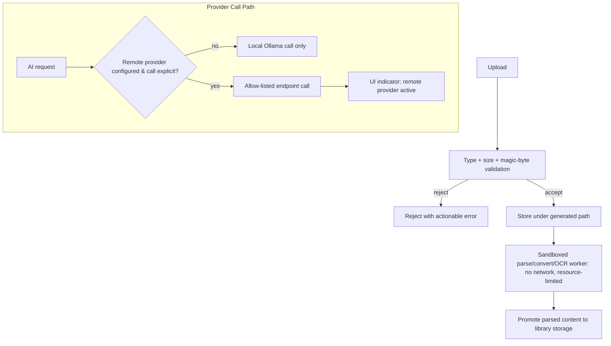

# 24 — Security

**Product:** DuckDocs
**Document type:** Cross-cutting architecture — Security
**Status:** Draft for team review
**Audience:** Engineering, security, platform, QA, leadership
**Upstream:** [01_VISION.md](./01_VISION.md) · [02_PRODUCT_REQUIREMENTS.md](./02_PRODUCT_REQUIREMENTS.md)
**Related docs:** [21_FILE_PROCESSING.md](./21_FILE_PROCESSING.md) · [22_OCR_PIPELINE.md](./22_OCR_PIPELINE.md) · [25_PRIVACY.md](./25_PRIVACY.md) · [26_CONFIGURATION.md](./26_CONFIGURATION.md) · [29_DOCKER_ARCHITECTURE.md](./29_DOCKER_ARCHITECTURE.md)

---

## 1. Purpose

This document specifies the **security architecture** of DuckDocs: the controls that keep a local-first, privacy-first product safe from malicious files, secret leakage, unwanted network egress, and unsafe file handling.

Security and Privacy are deliberately separate documents with a shared boundary: this document answers **"how is the system protected against threats?"**; [25_PRIVACY.md](./25_PRIVACY.md) answers **"what commitments does DuckDocs make to users about their data, and how are those commitments enforced end-to-end?"** Where they overlap (e.g., network egress control), Security specifies the mechanism and Privacy specifies the user-facing commitment and its UX.

Per PRD constraint PC-06, this document may **tighten** but must never **weaken** RULE-03 through RULE-05.

---

## 2. Scope

### In scope

- Threat model for a local-first document intelligence platform
- Safe handling of untrusted uploaded files (validation, sandboxing, path handling)
- Secrets management for optional cloud provider API keys
- Network egress control and the default-deny posture for AI calls
- Dependency/supply-chain hygiene
- Data-at-rest posture and logging discipline
- Access model for the P0 single-user local deployment

### Out of scope

- Privacy commitments, data ownership, and retention/deletion policy narrative → [25_PRIVACY.md](./25_PRIVACY.md)
- Infrastructure hardening, Docker Compose runbook detail → [29_DOCKER_ARCHITECTURE.md](./29_DOCKER_ARCHITECTURE.md), [30_DEPLOYMENT.md](./30_DEPLOYMENT.md)
- Multi-user authentication/authorization design (deferred; see OQ-V01) → future architecture doc
- Format-specific parsing logic → [21_FILE_PROCESSING.md](./21_FILE_PROCESSING.md)

---

## 3. Goals

| Goal ID | Goal | Maps to |
|---------|------|---------|
| SEC-G01 | No unauthorized data exfiltration from a default local install | C-02, RULE-03/05 |
| SEC-G02 | Uploaded files are handled as **untrusted input** at every stage | PR-L10, FP-C-01 |
| SEC-G03 | Secrets (API keys) are never exposed in logs, UI responses, or version control | PR-S02, PR-S04 |
| SEC-G04 | The default install has a **minimal attack surface** — no unnecessary exposed services or background calls | RULE-05, C-02 |
| SEC-G05 | Optional cloud providers are **explicit opt-in** with visible, persistent indicators when active | RULE-04, PR-S06 |

---

## 4. Threat Model (Summary)

| Threat | Vector | Primary control |
|--------|--------|------------------|
| Malicious upload exploits a parser (zip bomb, XXE, macro execution) | Crafted DOCX/XLSX/PPTX/ODT/EPUB (zip-based) or XML content | Sandboxed workers, decompression limits, XXE-safe parsing, macros disabled (§5.1) |
| Path traversal via filename | `../../etc/passwd`-style names, absolute paths, symlinks | Generated storage paths, never user-controlled (§5.1) |
| Secret leakage | Logs, error messages, exported config, frontend bundle | Backend-only secret storage, redaction, write-only UI fields (§5.2) |
| Unauthorized network egress / telemetry | Bundled analytics SDKs, silent "phone home" calls | Default-deny egress policy, no telemetry dependency at all (§5.3) |
| Dependency/supply-chain compromise | Malicious or vulnerable third-party package | Pinned versions, vulnerability scanning, minimal images (§5.5) |
| Resource-exhaustion DoS via pathological files | Huge/zip-bomb/deeply-nested files | Size limits, decompression limits, per-stage time/CPU budgets |
| SSRF via configurable provider endpoints | User-configured OpenAI-compatible base URL pointing at internal services | Endpoint validation, explicit allow-list posture, no server-side request forwarding beyond the configured provider call |
| Unauthorized local access (P0 single-user) | Exposing the service beyond localhost without auth | Localhost-bind default, documented guidance for any wider exposure (§5.4) |

---

## 5. Security Controls by Area

### 5.1 File Handling

- **Filename never used as a filesystem path.** Every stored file lives under a generated identifier (document/version ID); the original filename is retained only as display metadata.
- **Path traversal protection.** Any path derived from user input is normalized and validated against an allow-listed base directory; `..`, absolute paths, and symlink escapes are rejected.
- **Type verification beyond extension.** Magic-byte/content sniffing is required in addition to file extension before a parser is selected (defense against extension spoofing).
- **File size limits.** Enforced before parsing begins (configurable, see [26_CONFIGURATION.md](./26_CONFIGURATION.md)).
- **Sandboxed parsing.** All parsing/conversion/OCR workers run with constrained privileges (non-root container user), CPU/memory/time limits, and no network access (ties FP-C-01/FP-C-02, OCR-C-02).
- **Zip-bomb and decompression guards.** All zip-based formats (DOCX/XLSX/PPTX/ODT/EPUB) are parsed with explicit decompressed-size and entry-count limits.
- **XXE prevention.** XML parsing (DOCX/XLSX/PPTX/ODT/XML inputs) disables external entity resolution and DTD processing by default.
- **Macro handling.** Legacy Office conversion (LibreOffice headless) runs with macro execution disabled.
- **Embedded object handling.** Embedded OLE objects/linked files are extracted and labeled as content, never executed or auto-fetched.

### 5.2 Secrets Management

- Cloud provider API keys are stored via environment variables or a restricted-permission local secrets store — never inside a settings file that could be committed to version control.
- Secrets are **write-only** from the UI's perspective: once saved, the UI can confirm a key is configured (e.g., masked/last-4-characters) but the plaintext value is never returned to the frontend after initial entry.
- Secrets never appear in logs; log redaction is applied to any field known to carry credential material.
- `.env` and any local secrets file are excluded from version control by default (`.gitignore`), and settings/secrets files are created with restrictive filesystem permissions.
- Secrets are isolated to the backend configuration layer; the frontend bundle never embeds provider credentials.

### 5.3 Network Egress Control

- **Default-deny for AI calls.** No outbound network call related to chat, embeddings, or OCR happens unless a remote provider has been explicitly configured.
- **No telemetry dependency.** No analytics/telemetry SDK is present in the codebase at all — this is a dependency-level guarantee, not a runtime toggle (RULE-05).
- **Explicit allow-list per provider.** When a remote provider is configured, outbound calls are limited to that provider's configured endpoint(s); the system does not generically proxy arbitrary outbound requests.
- **SSRF-aware endpoint handling.** Custom/OpenAI-compatible base URLs are treated as user-trusted configuration (not attacker input) but are still validated for well-formedness; the backend does not expose a generic "fetch this URL" capability to untrusted callers.
- **UI indicator requirement.** Any active remote provider is visibly indicated in the UI whenever it is in use (mechanism here; user-facing commitment detailed in [25_PRIVACY.md](./25_PRIVACY.md)).

### 5.4 Access Model (P0 Single-User Local)

- The default deployment binds to `localhost`/the local Docker network, not a public interface.
- P0 assumes a single trusted local user (per OQ-P01 planning default); there is no built-in multi-tenant authentication layer at P0.
- Guidance for exposing DuckDocs beyond localhost (e.g., LAN/team access) recommends a reverse proxy with its own authentication — this is explicitly **not** a built-in P0 feature, and the documentation must say so rather than imply unsupported security guarantees.
- Multi-user local accounts are noted as future extensibility (§10), contingent on resolving OQ-V01.

### 5.5 Dependency and Supply Chain

- Dependencies are pinned to specific versions in lockfiles.
- Vulnerability scanning (e.g., dependency audit tooling for both the Python backend and the Next.js/TS frontend) runs in CI.
- Docker images are built from minimal base images; build-time-only dependencies are not shipped in runtime images.
- No dependency is fetched at container runtime; all dependencies are resolved at build time.

### 5.6 Data at Rest

- Documents, relational data, and vector data are stored on local Docker volumes (see [26_CONFIGURATION.md](./26_CONFIGURATION.md)).
- No plaintext secrets are stored in the relational database.
- Encryption-at-rest is not a built-in P0 feature; OS/disk-level encryption is the recommended mitigation, with application-level encryption-at-rest noted as future extensibility (§10).

### 5.7 Logging Discipline

- Logs are structured and leveled; document content and secret values are excluded from log output by default.
- Error messages surfaced to the UI are actionable (PR-Q02) without leaking internal paths, stack traces, or credential material.

---

## 6. Architecture Decisions

| ID | Decision | Rationale |
|----|----------|-----------|
| SEC-AD-01 | All uploaded files are treated as **untrusted input** at every pipeline stage | Files are the primary attacker-controlled surface in a document intelligence product |
| SEC-AD-02 | Filesystem paths are always derived from generated IDs, never from user-supplied filenames | Eliminates path traversal as an attack class rather than filtering it |
| SEC-AD-03 | Secrets are isolated to the backend configuration layer and never exposed to the frontend bundle or client state | Prevents credential leakage via browser devtools, client logs, or bundling mistakes |
| SEC-AD-04 | Network egress for AI calls is **default-deny**, with explicit allow-list opt-in per configured provider | Enforces RULE-03/RULE-04 as an architectural guarantee, not a policy statement |
| SEC-AD-05 | Parsing/OCR workers run with constrained privileges, resource limits, and no network access | Limits blast radius of a parser/library vulnerability |
| SEC-AD-06 | Security controls are expressed as testable rules (mirroring PRD normative rules) | Enables contract tests and CI enforcement, not just documentation |

### Alternatives rejected

| Alternative | Why rejected |
|-------------|--------------|
| Trusting client-provided file paths for storage | Direct path-traversal risk |
| Storing API keys in frontend local storage or client state | Trivially exposed via browser devtools/extensions |
| Allow-all outbound network by default, restrict later | Violates local-first default; "secure by default" requires deny-first |
| Running parsers/converters as root or without resource limits | Increases blast radius of any parser vulnerability |
| Relying solely on file extension for type/parser selection | Trivially spoofed; must be paired with content sniffing |
| Built-in multi-user auth rushed into P0 | Premature complexity before OQ-V01 is resolved; risks a weak, rushed auth model |

---

## 7. Tradeoffs

| Tradeoff | We choose | We accept |
|----------|-----------|-----------|
| Strict sandboxing vs. ingestion performance | Sandboxed, resource-limited workers | Some overhead per ingestion job vs. an unsandboxed fast path |
| Local plaintext-adjacent secrets storage vs. OS keychain integration complexity | Restricted-permission local secrets store at P0; OS keychain as future enhancement | Slightly weaker secret protection than full OS-level keychain integration at P0 |
| Localhost-only default vs. easy LAN/team access | Localhost-only, with documented (not built-in) exposure guidance | Users wanting shared local/team access must add their own auth layer at P0 |
| Defense-in-depth thoroughness vs. delivery speed | Multiple overlapping file-handling controls (§5.1) | More implementation and test surface before P0 ships |

---

## 8. Data Flow

---

## 9. Interfaces

| Interface | Responsibility |
|-----------|------------------|
| `SecretsProvider.get_secret(name)` | Resolves a secret from env/local secrets store; never logs or returns raw value to frontend |
| `EgressPolicy.is_call_allowed(provider, endpoint)` | Gate checked before any outbound AI-related network call |
| `FileValidator.validate(file) -> Verdict` | Magic-byte + extension + size validation prior to storage/parsing |
| `SandboxRunner.run(job, limits)` | Executes parsing/conversion/OCR jobs under enforced resource/network constraints |

---

## 10. Constraints

| ID | Constraint |
|----|------------|
| SEC-C-01 | Security controls may tighten but never weaken RULE-03, RULE-04, RULE-05 (PC-06) |
| SEC-C-02 | All ingestion workers run as non-root, with no outbound network capability |
| SEC-C-03 | Secrets are never written to logs, error responses, or client-visible state |
| SEC-C-04 | Any new file-format parser must pass a security review (path handling, decompression limits, XML entity handling) before being added to the registry |
| SEC-C-05 | Any new remote provider integration must implement the `EgressPolicy` gate and a UI-visible active indicator before shipping |
| SEC-C-06 | Default deployment binds to localhost/local network only; wider exposure requires explicit, documented user action outside DuckDocs' built-in P0 scope |

---

## 11. Risks

| Risk | Impact | Mitigation direction |
|------|--------|------------------------|
| Zero-day in a parsing/OCR library | Remote code execution or DoS via crafted file | Sandboxing, resource limits, dependency patch monitoring |
| Secret leaked via error message or stack trace | Credential compromise for a configured cloud provider | Log/error redaction; structured error codes instead of raw exceptions in user-facing responses |
| Path traversal edge case missed (unicode normalization, symlinks) | Arbitrary file read/write | Generated-path-only design eliminates the class rather than relying on filtering exhaustiveness |
| Supply-chain compromise of a parser/OCR dependency | Malicious code executed during ingestion | Pinned versions, vulnerability scanning, minimal transitive dependency surface |
| User exposes DuckDocs beyond localhost without adding auth | Unauthorized access to a local document library | Clear documentation; default localhost bind; no implied "safe for LAN" claim |
| Users paste secrets into chat/prompt input | Accidental secret exposure to a configured remote provider | Keys are configured only via Settings, never as part of prompt/context content |

---

## 12. Future Extensibility

- OS keychain / credential-manager integration for secrets storage
- Malware/antivirus scanning hook for uploaded files
- Multi-user authentication and role-based access control (contingent on OQ-V01)
- Application-level encryption-at-rest option for documents/vectors
- Audit logging subsystem for security-relevant events (auth attempts, provider configuration changes)
- SSO integration for team/enterprise local or self-hosted deployments

---

## 13. Open Questions

| ID | Question | Owner | Needed by |
|----|-----------|-------|-----------|
| SEC-OQ-01 | Is malware/antivirus scanning required for P0, or deferred as a future integration? | Security + Product | Before P0 security sign-off |
| SEC-OQ-02 | Is encryption-at-rest a P0/P1/P2 requirement, or explicitly deferred to OS-level disk encryption guidance? | Security + Platform | Before P0 security sign-off |
| SEC-OQ-03 | Should the default Docker network posture actively block egress at the network layer (not just application-layer gating) for defense-in-depth? | Platform + Security | Before Docker architecture freeze |
| SEC-OQ-04 | What is the resolution timeline for OQ-V01 (single-user vs. multi-user), and does it block any P0 security work? | Product + Security | Before PRD freeze |

---

## 14. Acceptance Criteria

This document is accepted when:

- [ ] Threat model (§4) is reviewed and agreed as covering the primary attacker-controlled surfaces (file upload, configuration, network egress)
- [ ] File handling controls (§5.1) are approved as sufficient before ingestion pipeline implementation begins
- [ ] Secrets management approach (§5.2) is approved as consistent with PR-S02/PR-S04
- [ ] Egress control design (§5.3) is confirmed to enforce RULE-03–RULE-05 as architecture, not policy
- [ ] Access model assumptions (§5.4) are agreed as an explicit, documented P0 scope boundary
- [ ] Open questions (§13) have owners and planning defaults

---

## 15. Cross-References

| Topic | Document |
|-------|----------|
| Privacy commitments and UX | [25_PRIVACY.md](./25_PRIVACY.md) |
| File processing pipeline | [21_FILE_PROCESSING.md](./21_FILE_PROCESSING.md) |
| OCR worker isolation | [22_OCR_PIPELINE.md](./22_OCR_PIPELINE.md) |
| Configuration and secrets | [26_CONFIGURATION.md](./26_CONFIGURATION.md) |
| Docker/deployment hardening | [29_DOCKER_ARCHITECTURE.md](./29_DOCKER_ARCHITECTURE.md) · [30_DEPLOYMENT.md](./30_DEPLOYMENT.md) |

---

## Document Control

| Field | Value |
|-------|-------|
| Version | 0.1.0 |
| Last updated | 2026-07-18 |
| Authors | DuckDocs Architecture Team |
| Review state | Pending team review |
| Previous | [23_SEARCH_ARCHITECTURE.md](./23_SEARCH_ARCHITECTURE.md) |
| Next | [25_PRIVACY.md](./25_PRIVACY.md) |
