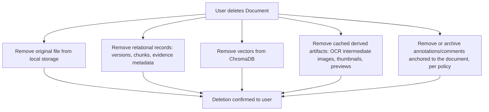

# 25 — Privacy

**Product:** DuckDocs
**Document type:** Cross-cutting architecture — Privacy
**Status:** Draft for team review
**Audience:** Product, engineering, security, design, leadership
**Upstream:** [01_VISION.md](./01_VISION.md) · [02_PRODUCT_REQUIREMENTS.md](./02_PRODUCT_REQUIREMENTS.md) · [24_SECURITY.md](./24_SECURITY.md)
**Related docs:** [26_CONFIGURATION.md](./26_CONFIGURATION.md) · [27_SETTINGS.md](./27_SETTINGS.md) · [07_FEATURE_SPECIFICATION.md](./07_FEATURE_SPECIFICATION.md)

---

## 1. Purpose

This document specifies DuckDocs' **privacy commitments** and how the architecture enforces them end-to-end: ownership of documents and outputs, zero analytics, network isolation as the default posture, and clear, persistent indicators whenever a remote provider is used.

Where [24_SECURITY.md](./24_SECURITY.md) specifies the mechanisms that protect the system from threats, this document specifies the **promises made to the user** and traces each promise to the architecture that keeps it true — not just at install time, but continuously, visibly, and verifiably.

Per PRD constraint PC-06, this document may **tighten** but must never **weaken** RULE-03 through RULE-06.

---

## 2. Scope

### In scope

- Data ownership model for documents, versions, chunks, embeddings, annotations, and exports
- The no-telemetry commitment and what it concretely excludes
- Network isolation as the default posture and how it is verifiable
- The remote-provider indicator requirement and first-use confirmation flow
- Retention and deletion policy (RULE-06) and its cascade across storage layers
- Data minimization principle for any content sent to a configured remote provider

### Out of scope

- Threat model and technical security controls (sandboxing, secrets, egress gating mechanism) → [24_SECURITY.md](./24_SECURITY.md)
- Settings UI component design → [27_SETTINGS.md](./27_SETTINGS.md)
- Legal/regulatory compliance certification programs (future) → not yet scoped
- Configuration key catalog → [26_CONFIGURATION.md](./26_CONFIGURATION.md)

---

## 3. Goals

| Goal ID | Goal | Maps to |
|---------|------|---------|
| PRIV-G01 | Users **own** all documents and generated outputs; nothing is copied to a DuckDocs-controlled cloud service | G-01, §7.1 vision |
| PRIV-G02 | DuckDocs performs **zero analytics/telemetry**, by architecture, not just by default toggle | RULE-05 |
| PRIV-G03 | **Network isolation** is the default operating posture for the core product loop | C-01, RULE-03 |
| PRIV-G04 | Any remote provider use is **visibly indicated**, every time, without exception | RULE-04, PR-S06 |
| PRIV-G05 | **Deletion is real deletion** — removing a document removes its derived data everywhere it lives | RULE-06 |

---

## 4. Data Ownership Model

| Entity | Ownership statement |
|--------|------------------------|
| Original documents | Belong solely to the user; stored on local volumes the user configures and can inspect (PR-S07) |
| Versions, chunks, embeddings | Derived from owned documents; stored locally; deleted per §7 when the source document is deleted |
| Annotations, comments | Authored by the user; stored locally against document/version anchors |
| Generated answers, summaries, extractions | Belong to the user; DuckDocs does not retain a separate "usage record" of them for any purpose beyond the user's own library |
| Exports | Once exported, files leave DuckDocs' control by the user's own explicit action (RULE-06 exception noted in §8) |

**Statement PRIV-01:** DuckDocs does not create a copy of any user document, chunk, embedding, or output on any DuckDocs-operated or third-party-operated service. The only way user content leaves the local machine is (a) an explicit export/share action by the user, or (b) an explicit, configured call to a remote AI provider the user has opted into.

---

## 5. The No-Telemetry Commitment

DuckDocs collects **none** of the following, by design, not by a disable-able setting:

- Usage analytics (feature usage, click tracking, session recording)
- Crash reports sent to a vendor/telemetry backend
- Document content or metadata telemetry of any kind
- Model prompts, responses, or retrieval logs sent anywhere outside the local deployment
- Background "phone home" update or license checks

**Statement PRIV-02:** No telemetry or analytics SDK is a dependency of the codebase (mirrors SEC-AD-06/RULE-05 as a dependency-level fact, verifiable by dependency audit, not just a runtime flag). Logs, where they exist, are local-only, and are covered by the logging discipline in [24_SECURITY.md](./24_SECURITY.md) §5.7.

---

## 6. Network Isolation as Default Posture

The core product loop — upload, ingest, OCR, search, ask, summarize, extract, annotate, compare, export to a local file — requires **zero outbound internet access** when running the default local provider (Ollama + local embedding model) and default local OCR engine.

| Deployment mode | Outbound network required? |
|------------------|-------------------------------|
| Default (local provider + local embeddings + local OCR) | None |
| Any single remote provider configured (chat or embedding) | Only for calls to that specific configured provider, only when explicitly invoked |

**Statement PRIV-03:** A user can run DuckDocs' default docker-compose profile with outbound internet access disabled at the network level and experience no functional loss in the core local RAG loop. This is a testable, verifiable claim (see Testing Strategy), not marketing language — it is what "local-only by default" (§7.3 vision) means operationally.

---

## 7. Remote Provider Transparency

When a user configures a remote provider (chat or embedding), DuckDocs must make its use **impossible to miss**:

| Mechanism | Behavior |
|-----------|----------|
| Persistent indicator | A visible badge/state in the UI whenever a remote provider is the active configuration, not only during the instant of a call |
| Per-response provenance | Each generated answer records which provider (local or which remote) produced it, surfaced in the evidence/response metadata |
| First-use confirmation | The first time a newly configured remote provider is actually invoked, the user sees an explicit confirmation of what is about to happen |
| Content minimization visibility | The user can inspect what context (retrieved chunks, not the whole library) is being sent for a given request — the same retrieval metadata already required by PR-I07 doubles as transparency into what a remote provider receives |

**Statement PRIV-04:** DuckDocs never sends more than the minimal relevant context (the retrieved/selected chunks for the specific request) to a configured remote provider. It does not bulk-upload a library to a remote provider for any reason, including "training" or "improving the product" — no such use exists.

---

## 8. Retention and Deletion (RULE-06)

Deleting a document cascades across every layer that holds derived data:



| Layer | Deletion behavior |
|-------|----------------------|
| Original file (filesystem) | Removed |
| Relational records (versions, chunks, evidence metadata) | Removed |
| Vectors (ChromaDB) | Removed (synchronously or via a confirmed async job, per SRCH-C-06) |
| Cached derived artifacts (OCR intermediates, thumbnails, previews) | Removed |
| Annotations/comments anchored to the document | Removed or archived per a defined retention policy (default: removed with the document) |
| Previously exported copies | **Outside DuckDocs' control** once exported — this limitation is communicated clearly to the user at export time, not silently assumed |

**Statement PRIV-05:** Deletion is not a soft "hide from the UI" operation for the entities listed above; it is a real removal. A future trash/undo window (§11) is additive UX on top of real deletion, not a replacement for it.

---

## 9. Architecture Decisions

| ID | Decision | Rationale |
|----|----------|-----------|
| PRIV-AD-01 | Privacy indicators are wired to **actual network/provider activity state**, not just a static settings display | A badge that reflects configuration but not real usage would be misleading |
| PRIV-AD-02 | The default docker-compose profile requires **no outbound internet** for the core RAG loop | Makes local-first a testable deployment property, not just a design intent |
| PRIV-AD-03 | Deletion **cascades** across relational store, vector store, filesystem, and derived-artifact caches in one logical operation | Prevents "zombie" data in any single layer after a user believes a document is gone |
| PRIV-AD-04 | Remote provider calls send only **minimal relevant context**, never bulk document/library content | Data minimization is an architectural default, not a configurable risk |
| PRIV-AD-05 | No telemetry/analytics SDK is present in the dependency tree at all | Removes the possibility of an accidental "flip a flag and it's back on" regression |

### Alternatives rejected

| Alternative | Why rejected |
|-------------|--------------|
| Telemetry collection with an opt-out default | Rejected outright — even opt-in anonymous telemetry is not planned; opt-out-by-default is explicitly incompatible with RULE-05 |
| Silent background update/license checks | Rejected without explicit opt-in; would be an undisclosed network call |
| Sending the full document to a remote provider for any provider-backed request | Rejected; violates data minimization and inflates privacy exposure unnecessarily |
| Soft-delete-only (never truly removable) data model | Rejected; violates data ownership (users must be able to actually remove their data) |

---

## 10. Tradeoffs

| Tradeoff | We choose | We accept |
|----------|-----------|-----------|
| Strict data minimization to remote providers vs. potential answer quality | Send only minimal relevant context | Slightly less context than a "send everything" approach might offer for some queries |
| Real hard-delete vs. recovery convenience | Real deletion by default | Accidental deletion has no built-in recovery at P0 unless a trash feature (§11) ships |
| Full transparency into what's sent to a remote provider vs. UI simplicity | Retrieval metadata doubles as a transparency view | Slightly more surface area in the Intelligence UI (already required by PR-I07) |
| Network-isolation-by-default vs. convenience of "just works" cloud fallback | Local-only default, explicit opt-in for remote | Users without a capable local machine must actively configure a remote provider (accepted per vision tradeoff) |

---

## 11. Data Flow

```mermaid
flowchart LR
  subgraph Local-Only Path (Default)
    U1[User] --> UI1[DuckDocs UI]
    UI1 --> API1[Backend API]
    API1 --> Local[Local Ollama + Local Embeddings + Local OCR]
    Local --> Store1[(Local Files + DB + ChromaDB)]
  end

  subgraph Opt-In Remote Path
    U2[User] --> UI2[DuckDocs UI]
    UI2 --> API2[Backend API]
    API2 --> Gate[Egress gate + indicator]
    Gate -->|explicit config + minimal context| Remote[Configured Remote Provider]
    Remote --> API2
  end
```

---

## 12. Interfaces

| Interface | Responsibility |
|-----------|------------------|
| `PrivacyIndicatorService` | Derives current UI indicator state from actual provider configuration + recent call activity |
| `RetentionService.delete_document(document_id)` | Executes the cascading deletion across filesystem, relational store, vector store, and caches |
| `ConsentFlow.confirm_first_remote_use(provider)` | Presents and records the first-use confirmation for a newly configured remote provider |
| `ContextMinimizer` | Ensures only retrieved/selected chunks (not bulk library content) are assembled into any remote provider request payload |

---

## 13. Constraints

| ID | Constraint |
|----|------------|
| PRIV-C-01 | No default outbound network call exists for the core product loop (ties C-01, RULE-03) |
| PRIV-C-02 | Any remote provider call must be inspectable by the user (what was sent, to which provider, when) |
| PRIV-C-03 | Deletion must complete for filesystem/relational data synchronously (or within a bounded, user-visible timeframe for the vector store) after a delete request |
| PRIV-C-04 | Privacy/Security documents may tighten but never weaken RULE-03–RULE-06 (PC-06) |
| PRIV-C-05 | Any future backup/export-of-settings feature must exclude or clearly redact secrets and must never be positioned as a way to "sync" documents to a DuckDocs-operated service |

---

## 14. Risks

| Risk | Impact | Mitigation direction |
|------|--------|------------------------|
| Users assume an "insufficient evidence" refusal implies no network activity occurred | False sense of privacy if a remote provider was actually invoked during retrieval/generation attempts | Indicator (§7) must reflect actual call activity regardless of the answer's outcome |
| Vector deletion lag creates stale search hits after a document is "deleted" | Trust/privacy incident (deleted content still retrievable) | Bounded deletion SLA (PRIV-C-03); confirmation UX that deletion is complete |
| Exported copies leave the machine outside DuckDocs' control | User may believe DuckDocs controls all copies of their data indefinitely | Clear communication at export time that this is the boundary of DuckDocs' privacy guarantee (§8) |
| Logs inadvertently contain document content, violating minimization | Privacy incident even without network egress | Logging discipline in [24_SECURITY.md](./24_SECURITY.md) §5.7 |
| Future features (backup, sync, multi-user) erode the local-only default without careful design | Slow drift away from PRIV-G03 | Every future feature proposal must state its network/data-residency impact explicitly during design review |

---

## 15. Future Extensibility

- User-facing audit log of remote provider calls (timestamp, provider, content hash — not content) for self-review
- Per-document "never send to any remote provider" flag, enforced at the retrieval/context-assembly layer
- Configurable retention policy, including a trash/undo window before hard deletion
- A stricter "compliance mode" that disables remote provider configuration entirely at the deployment level
- Regulatory/compliance documentation (e.g., data-residency statements) once a target market requires it

---

## 16. Open Questions

| ID | Question | Owner | Needed by |
|----|-----------|-------|-----------|
| PRIV-OQ-01 | Should a trash/soft-delete window exist before hard deletion, and if so, what is the default duration? | Product + Security | Before P0 deletion UX freeze |
| PRIV-OQ-02 | Is a persistent "prompt preview" required before every remote call, or is a one-time first-use confirmation (§7) sufficient? | Product | Before P0 Settings/Intelligence UX freeze |
| PRIV-OQ-03 | Is a per-document "never send to cloud" flag a P1 or P2 feature? | Product + Eng | Before P1 planning |
| PRIV-OQ-04 | Does the license model decision (vision OQ-V04) affect any privacy claims made in distributed builds? | Leadership | Before public release planning |

---

## 17. Acceptance Criteria

This document is accepted when:

- [ ] Data ownership statements (§4) are approved by Product, Security, and Leadership as accurate representations of the architecture
- [ ] The no-telemetry commitment (§5) is confirmed as a dependency-level fact, verifiable by audit
- [ ] Network isolation posture (§6) is confirmed testable against the default docker-compose profile
- [ ] Remote provider transparency mechanisms (§7) are approved as sufficient to satisfy RULE-04/PR-S06
- [ ] Deletion cascade (§8) is approved as the basis for RULE-06 implementation and tested against all storage layers
- [ ] Open questions (§16) have owners and planning defaults

---

## 18. Cross-References

| Topic | Document |
|-------|----------|
| Security mechanisms | [24_SECURITY.md](./24_SECURITY.md) |
| Configuration and data paths | [26_CONFIGURATION.md](./26_CONFIGURATION.md) |
| Settings UI | [27_SETTINGS.md](./27_SETTINGS.md) |
| Product rules (RULE-01–10) | [02_PRODUCT_REQUIREMENTS.md](./02_PRODUCT_REQUIREMENTS.md) |
| Vision privacy principle | [01_VISION.md](./01_VISION.md) §7.1 |

---

## Document Control

| Field | Value |
|-------|-------|
| Version | 0.1.0 |
| Last updated | 2026-07-18 |
| Authors | DuckDocs Architecture Team |
| Review state | Pending team review |
| Previous | [24_SECURITY.md](./24_SECURITY.md) |
| Next | [26_CONFIGURATION.md](./26_CONFIGURATION.md) |
