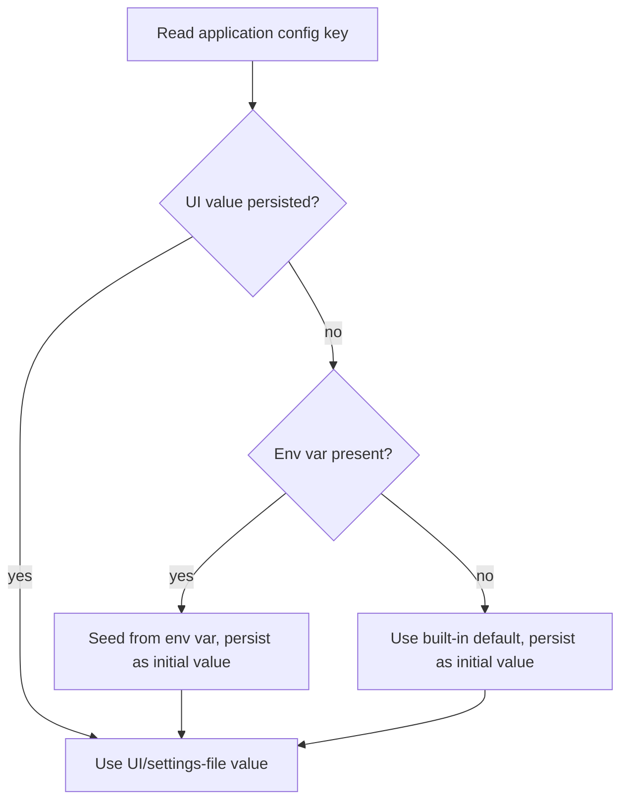
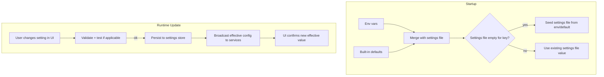

# 26 — Configuration

**Product:** DuckDocs
**Document type:** Cross-cutting architecture — Configuration
**Status:** Draft for team review
**Audience:** Engineering, platform, product, QA
**Upstream:** [01_VISION.md](./01_VISION.md) · [02_PRODUCT_REQUIREMENTS.md](./02_PRODUCT_REQUIREMENTS.md) · [24_SECURITY.md](./24_SECURITY.md) · [25_PRIVACY.md](./25_PRIVACY.md)
**Related docs:** [27_SETTINGS.md](./27_SETTINGS.md) · [12_PROVIDER_ARCHITECTURE.md](./12_PROVIDER_ARCHITECTURE.md) · [29_DOCKER_ARCHITECTURE.md](./29_DOCKER_ARCHITECTURE.md)

---

## 1. Purpose

This document specifies the **configuration architecture** of DuckDocs: how environment variables, a settings file, and UI-driven settings combine into one coherent, precedence-ordered configuration system — and how that system guarantees that chat and embedding providers are independently configurable, that provider/behavior changes never require code changes (RULE-08), and that local data paths are visible and configurable (PR-S07).

Configuration is where the vision's "provider abstraction" and "local-first default" promises become concrete, testable system behavior rather than aspiration.

---

## 2. Scope

### In scope

- The three configuration surfaces (environment variables, settings file, UI settings) and their precedence
- The distinction between bootstrap/infra configuration and hot-reconfigurable application configuration
- The representative configuration key catalog
- Chat vs. embedding provider independence at the configuration level
- Docker volume layout for persisted data and configuration
- Secrets handling within the configuration system (in cooperation with [24_SECURITY.md](./24_SECURITY.md))

### Out of scope

- Settings UI component design/visual spec → [27_SETTINGS.md](./27_SETTINGS.md)
- Provider-specific request/response mechanics → [12_PROVIDER_ARCHITECTURE.md](./12_PROVIDER_ARCHITECTURE.md)
- Full API schemas for settings endpoints → [15_API_SPECIFICATION.md](./15_API_SPECIFICATION.md)
- Docker/ops runbook detail (image build, compose file authoring) → [29_DOCKER_ARCHITECTURE.md](./29_DOCKER_ARCHITECTURE.md)

---

## 3. Goals

| Goal ID | Goal | Maps to |
|---------|------|---------|
| CFG-G01 | Every provider/behavior change is achievable via **configuration only**, never code changes | PR-S04, RULE-08 |
| CFG-G02 | The **effective** value of any config key and its source are always discoverable | PR-S07 |
| CFG-G03 | Local data paths (files, DB, vectors) are configurable and visible to the user | PR-S07 |
| CFG-G04 | Chat and embedding providers are configured **independently**, with independent validation | PR-S03, AD-P04 |
| CFG-G05 | Secrets are handled safely within the configuration system | Ties SEC-AD-03 |

---

## 4. Configuration Surfaces and Precedence

DuckDocs has three configuration surfaces plus built-in defaults:

| Surface | Who edits it | When it's read |
|---------|----------------|-------------------|
| **Environment variables** | Deployer / Docker Compose | At container/process startup |
| **Settings file** (on disk, on a mounted volume) | Deployer (manual edit) or the backend (writing UI-driven changes) | At startup, and on hot-reload for application config |
| **UI settings** | End user, via the Settings surface | At runtime, persisted immediately to the settings file/store |
| **Built-in defaults** | N/A (shipped with the product) | Used when no other surface provides a value |

Configuration keys are split into two classes with different precedence rules, to avoid the confusing situation where a user changes a value in the UI but an environment variable silently keeps winning forever:

### 4.1 Bootstrap / Infra Configuration

Keys that affect process startup, storage locations, or ports — changing them at runtime is unsafe or meaningless (e.g., `DATA_DIR`, `DATABASE_URL`, `CHROMA_PERSIST_DIR`, `HOST`, `PORT`).

**Precedence:** Environment variable → built-in default. These are **not** exposed as live UI-editable settings; the UI may display their current effective value (read-only) to satisfy PR-S07's "view local data paths" requirement.

### 4.2 Application Configuration

Keys that affect product behavior and are safe to change at runtime (e.g., chat provider, embedding provider, model name, OCR engine/language, chunk size, retrieval `top_k`, network egress mode for optional providers).

**Precedence:** UI setting (if the user has explicitly set it) → Settings file value → Environment variable → built-in default.

**Rule CFG-01 (first-run seeding):** On first run, if no settings-file value or UI value exists yet for an application config key, its initial effective value is seeded from the environment variable (if present) or the built-in default. Once a user changes a key via the UI, that persisted value takes precedence over the environment variable for all subsequent reads — the environment variable is a **default provider for first run**, not a permanent override, so "I changed it in Settings" always behaves as the user expects.



---

## 5. Configuration Key Catalog (Representative)

| Key | Class | Description | Default |
|-----|-------|--------------|---------|
| `DATA_DIR` | Bootstrap | Root path for local file/document storage | `/data/documents` (in-container) |
| `DATABASE_URL` | Bootstrap | Relational database connection string | Local file-backed/local DB URL |
| `CHROMA_PERSIST_DIR` | Bootstrap | ChromaDB persistence path | `/data/chroma` |
| `HOST` / `PORT` | Bootstrap | Backend bind address/port | `127.0.0.1` / product default port |
| `CHAT_PROVIDER` | Application | `ollama \| openai \| anthropic \| gemini \| openai_compatible` | `ollama` |
| `CHAT_MODEL` | Application | Model identifier for the chat provider | `gemma3:1b` |
| `CHAT_PROVIDER_API_KEY` | Application (secret) | Credential for the configured chat provider, when remote | unset |
| `CHAT_PROVIDER_BASE_URL` | Application | Base URL override (self-hosted/OpenAI-compatible endpoints) | unset (provider default) |
| `EMBEDDING_PROVIDER` | Application | Independent provider selection for embeddings | Local embedding path |
| `EMBEDDING_MODEL` | Application | Model identifier for the embedding provider | Local default model |
| `EMBEDDING_PROVIDER_API_KEY` | Application (secret) | Credential for the configured embedding provider, when remote | unset |
| `OCR_ENGINE` | Application | Default OCR engine identifier | `tesseract` |
| `OCR_LANGUAGES` | Application | Configured OCR language(s) | `eng` |
| `MAX_UPLOAD_SIZE_MB` | Application | Per-file upload size limit | Set per NFR guidance |
| `CHUNK_SIZE` / `CHUNK_OVERLAP` | Application | Chunking token budget/overlap | Set per ingestion tuning defaults |
| `RETRIEVAL_TOP_K` | Application | Number of candidate chunks retrieved per query | Set per retrieval performance defaults |
| `NETWORK_EGRESS_MODE` | Application | `local_only \| allow_configured_providers` | `local_only` |
| `LOG_LEVEL` | Bootstrap | Backend log verbosity | `info` |

This table is representative, not exhaustive; the authoritative schema (including validation rules and types) lives alongside the Settings API in [15_API_SPECIFICATION.md](./15_API_SPECIFICATION.md).

---

## 6. Chat vs. Embedding Provider Independence

Chat/generation and embedding configuration are **two fully independent schemas**, each with its own provider type, model, credentials, and (where relevant) base URL:

| Concern | Chat/Generation | Embedding |
|---------|-------------------|-----------|
| Provider selection | `CHAT_PROVIDER` | `EMBEDDING_PROVIDER` |
| Model | `CHAT_MODEL` | `EMBEDDING_MODEL` |
| Credentials | `CHAT_PROVIDER_API_KEY` | `EMBEDDING_PROVIDER_API_KEY` |
| Connectivity test | Independent "test connection" action (PR-S08) | Independent "test connection" action (PR-S08) |
| UI location | Distinct section in Settings | Distinct section in Settings |

**Rule CFG-02:** Changing one provider's configuration must never mutate, reset, or invalidate the other's configuration. The two schemas share no fields other than the generic secrets-handling mechanism (§8).

---

## 7. Docker Volumes for Data

| Volume/mount | Purpose | Related config key |
|---------------|---------|------------------------|
| `data/documents` | Original uploaded files | `DATA_DIR` |
| `data/db` | Relational database files (if file-backed) | `DATABASE_URL` |
| `data/chroma` | ChromaDB persistence | `CHROMA_PERSIST_DIR` |
| `data/config` | Settings file and local secrets store | N/A (settings file location) |
| `data/exports` | User-initiated export output | Export feature configuration |

```yaml
# Illustrative docker-compose volume sketch
volumes:
  duckdocs_documents:
  duckdocs_db:
  duckdocs_chroma:
  duckdocs_config:
  duckdocs_exports:

services:
  backend:
    volumes:
      - duckdocs_documents:/data/documents
      - duckdocs_db:/data/db
      - duckdocs_chroma:/data/chroma
      - duckdocs_config:/data/config
      - duckdocs_exports:/data/exports
    environment:
      - DATA_DIR=/data/documents
      - CHROMA_PERSIST_DIR=/data/chroma
      - CHAT_PROVIDER=ollama
```

Named volumes (rather than anonymous/ephemeral container storage) are required so that recreating a container never silently loses documents, database records, or vectors (ties FP-C constraints and RULE-06's assumption that data persists until explicitly deleted).

---

## 8. Secrets Within Configuration

- Secret-class keys (`*_API_KEY`) are accepted via environment variable or the local secrets store, and — when set through the UI — are persisted server-side only.
- The Settings API never returns a previously stored secret's plaintext value; it returns a masked representation (e.g., presence + last few characters) sufficient for the user to confirm what's configured (ties SEC-AD-03).
- Any future configuration export/backup feature must redact or exclude secret-class keys by default (ties PRIV-C-05).

---

## 9. Architecture Decisions

| ID | Decision | Rationale |
|----|----------|-----------|
| CFG-AD-01 | Configuration is **layered** (env / settings file / UI) with defined precedence and env-as-first-run-seed-only semantics | Avoids the "UI change doesn't stick" confusion while still allowing deployment-time defaults |
| CFG-AD-02 | Chat and embedding provider configuration are **fully independent schemas** | Enforces PR-S03/RULE-08 and the AD-P04 rejection of a single coarse "AI provider" setting |
| CFG-AD-03 | Keys are split into **bootstrap** (env-only, startup) and **application** (hot-reconfigurable) classes | Prevents unsafe runtime changes to storage paths/ports while keeping behavior-level settings flexible |
| CFG-AD-04 | Secrets are never round-tripped to the frontend in plaintext after initial entry | Consistent with SEC-AD-03; prevents credential leakage via the Settings UI itself |
| CFG-AD-05 | All local data paths are explicit, visible, and mapped to named Docker volumes | Satisfies PR-S07 and prevents silent data loss on container recreation |
| CFG-AD-06 | Application configuration changes take effect without image rebuilds or redeploys | Enforces RULE-08 as an architectural guarantee |

### Alternatives rejected

| Alternative | Why rejected |
|-------------|--------------|
| A single flat `.env` file as the only configuration surface | Poor UX for runtime changes; no discoverability of "effective" values from the UI |
| One unified "AI provider" setting for both chat and embeddings | Already rejected at the product level (AD-P... alternative in PRD §10); too coarse for independent cost/quality/privacy tradeoffs |
| Storing secrets in a world-readable settings file | Direct credential exposure risk |
| Requiring a container restart for every provider change | Violates RULE-08 and degrades the Settings UX described in PR-S04 |
| Environment variables permanently overriding UI settings | Confusing "my change didn't stick" experience; undermines CFG-G01 |

---

## 10. Tradeoffs

| Tradeoff | We choose | We accept |
|----------|-----------|-----------|
| Layered config flexibility vs. precedence complexity | Three surfaces with defined precedence | Requires an "effective config" view in Settings so users aren't confused about which value is active |
| UI-driven runtime provider changes vs. mid-session consistency risk | Allow runtime changes with confirmation/validation | Possible brief inconsistency if a request is in flight during a provider switch; mitigated by per-request provider binding |
| Env-only bootstrap keys vs. full runtime flexibility | Bootstrap keys require restart to change | Simpler, safer semantics for storage/port configuration that shouldn't change live |

---

## 11. Data Flow



---

## 12. Interfaces

| Interface | Responsibility |
|-----------|------------------|
| `ConfigProvider.get(key)` | Returns the effective value for a config key per precedence rules |
| `ConfigProvider.effective_source(key)` | Returns which surface (UI/file/env/default) currently determines the effective value — powers PR-S07's transparency requirement |
| `SecretsStore.get/set(name)` | Backend-only secret storage, write-only from the frontend's perspective |
| `SettingsAPI` | Read/write surface for application configuration from the UI (full contract in [15_API_SPECIFICATION.md](./15_API_SPECIFICATION.md)) |
| `BootstrapLoader` | Reads bootstrap/infra config at process startup only |

---

## 13. Constraints

| ID | Constraint |
|----|------------|
| CFG-C-01 | No application configuration change requires rebuilding or redeploying the Docker image |
| CFG-C-02 | All local data paths are configurable but ship with safe, working local defaults |
| CFG-C-03 | Secret-class keys are excluded or redacted from any configuration export/backup feature |
| CFG-C-04 | The configuration schema is versioned to support safe migration as new keys are introduced |
| CFG-C-05 | Bootstrap/infra keys are read once at startup; changing them requires a restart, and this is communicated clearly rather than silently ignored |

---

## 14. Risks

| Risk | Impact | Mitigation direction |
|------|--------|------------------------|
| Confusion about which surface currently controls a key's effective value | Users think a change "didn't work" | `effective_source(key)` exposed in an "effective configuration" Settings view |
| Secret leakage through a future export/backup feature | Credential compromise | Redaction/exclusion rules enforced at the export layer (CFG-C-03) |
| Invalid provider configuration causing silent fallback rather than a clear error | Confusing failures, violates PR-Q02 | Fail loudly with actionable errors; no silent fallback to a different provider than configured |
| Docker volume misconfiguration (e.g., anonymous volumes) causing data loss on container recreation | Catastrophic data loss | Named volumes documented as required in the reference compose file (§7) |
| Config schema drift across versions without migration | Broken settings after upgrade | Schema versioning (CFG-C-04) and migration steps documented per release |

---

## 15. Future Extensibility

- Multiple named configuration profiles (e.g., distinct library/provider profiles a user can switch between)
- Per-user configuration once multi-user local accounts exist (contingent on OQ-V01)
- Configuration import/export for backup, with secrets excluded or separately encrypted
- Remote/team configuration sync as an explicitly opt-in feature, without changing the local-first default
- Environment-variable lockdown mode for enterprise deployments where administrators want env vars to override UI settings permanently

---

## 16. Open Questions

| ID | Question | Owner | Needed by |
|----|-----------|-------|-----------|
| CFG-OQ-01 | What is the on-disk format for the settings file — YAML, JSON, or purely database-backed with no flat file? | Platform Eng | Before Settings API design freeze |
| CFG-OQ-02 | Should an "enterprise lockdown" mode (env vars permanently override UI) be designed now or deferred? | Product + Platform | Before P1 planning |
| CFG-OQ-03 | Is configuration import/export (backup/restore) a P0/P1/P2 feature? | Product + Eng | Before P1 scope freeze |
| CFG-OQ-04 | What are the safe default values for `MAX_UPLOAD_SIZE_MB`, `CHUNK_SIZE`, and `RETRIEVAL_TOP_K` for typical local hardware (ties OQ-P05, OQ-V05)? | Platform | Before NFR freeze |

---

## 17. Acceptance Criteria

This document is accepted when:

- [ ] The three-surface configuration model and precedence rules (§4) are approved by Engineering as unambiguous and implementable
- [ ] The bootstrap vs. application key classification (§4.1, §4.2) is agreed as covering all anticipated P0 configuration needs
- [ ] Chat/embedding provider independence (§6) is confirmed consistent with PR-S03/RULE-08 and AD-P04
- [ ] Docker volume layout (§7) is approved by Platform as sufficient to prevent data loss on container recreation
- [ ] Secrets handling within configuration (§8) is confirmed consistent with [24_SECURITY.md](./24_SECURITY.md)
- [ ] Open questions (§16) have owners and planning defaults

---

## 18. Cross-References

| Topic | Document |
|-------|----------|
| Settings UI | [27_SETTINGS.md](./27_SETTINGS.md) |
| Provider architecture | [12_PROVIDER_ARCHITECTURE.md](./12_PROVIDER_ARCHITECTURE.md) |
| Security (secrets, egress) | [24_SECURITY.md](./24_SECURITY.md) |
| Privacy (data paths, minimization) | [25_PRIVACY.md](./25_PRIVACY.md) |
| Docker/deployment | [29_DOCKER_ARCHITECTURE.md](./29_DOCKER_ARCHITECTURE.md) · [30_DEPLOYMENT.md](./30_DEPLOYMENT.md) |
| API contracts | [15_API_SPECIFICATION.md](./15_API_SPECIFICATION.md) |

---

## Document Control

| Field | Value |
|-------|-------|
| Version | 0.1.0 |
| Last updated | 2026-07-18 |
| Authors | DuckDocs Architecture Team |
| Review state | Pending team review |
| Previous | [25_PRIVACY.md](./25_PRIVACY.md) |
| Next | [27_SETTINGS.md](./27_SETTINGS.md) |
