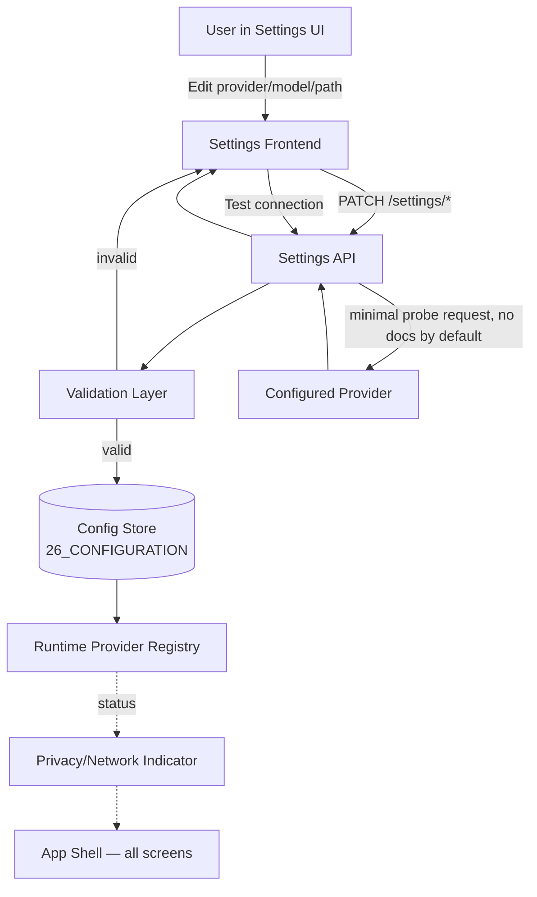

# 27 — Settings

**Product:** DuckDocs
**Document type:** Subsystem specification — Settings UI & configuration surface
**Status:** Draft for team review
**Audience:** Frontend engineering, backend engineering, product, security
**Upstream:** [01_VISION.md](./01_VISION.md) · [02_PRODUCT_REQUIREMENTS.md](./02_PRODUCT_REQUIREMENTS.md) · [26_CONFIGURATION.md](./26_CONFIGURATION.md)
**Downstream:** [28_PROJECT_STRUCTURE.md](./28_PROJECT_STRUCTURE.md) · [24_SECURITY.md](./24_SECURITY.md) · [25_PRIVACY.md](./25_PRIVACY.md)

---

## 1. Purpose

This document specifies the **Settings** interface and its backing configuration model: how users configure AI providers (chat and embeddings, independently), models, Ollama, local data paths, OCR, and privacy-related behavior, and how the product proves — visibly and verifiably — that nothing leaves the machine unless the user explicitly opted in.

Settings is not a cosmetic preferences screen. Per [01_VISION.md §7.4](./01_VISION.md#74-ai-provider-agnostic) and [02_PRODUCT_REQUIREMENTS.md §6.7](./02_PRODUCT_REQUIREMENTS.md#67-settings-providers-and-privacy), Settings is the **trust control surface** of DuckDocs: it is where "local-first" and "provider-agnostic" become concrete, testable, user-facing facts rather than marketing claims.

While [26_CONFIGURATION.md](./26_CONFIGURATION.md) defines the underlying configuration storage, precedence, and environment-variable model, this document defines the **user-facing Settings experience** built on top of it: screens, fields, validation, connection testing, and the product rules that govern provider and privacy behavior.

---

## 2. Scope

### In scope

- Settings information architecture (sections, navigation)
- Provider configuration: chat/generation providers and embedding providers, configured **independently**
- Model selection and management, including local Ollama model pulls
- Local data path configuration (documents, database, vector store, logs)
- OCR engine configuration and per-format fallback behavior
- Privacy indicators: persistent UI signal of local-only vs. network-active state
- Connection testing behavior, including the default **no-document-upload** guarantee
- Settings persistence, validation, and apply/rollback behavior
- Settings API surface consumed by the frontend

### Out of scope

- Configuration file format, precedence rules, environment variable schema → [26_CONFIGURATION.md](./26_CONFIGURATION.md)
- Provider abstraction internals (retries, streaming, token accounting) → [12_PROVIDER_ARCHITECTURE.md](./12_PROVIDER_ARCHITECTURE.md)
- OCR pipeline internals and fidelity tiers → [21_FILE_PROCESSING.md](./21_FILE_PROCESSING.md)
- Security posture (secrets at rest, auth) → [24_SECURITY.md](./24_SECURITY.md)
- Full privacy policy and data retention → [25_PRIVACY.md](./25_PRIVACY.md)
- Docker/deployment-level configuration (ports, volumes) → [29_DOCKER_ARCHITECTURE.md](./29_DOCKER_ARCHITECTURE.md), [30_DEPLOYMENT.md](./30_DEPLOYMENT.md)

---

## 3. Goals

| Goal ID | Goal | Why it matters |
|---------|------|-----------------|
| SET-G01 | Users can independently configure the **chat/generation provider** and the **embedding provider** | Different cost, quality, and privacy tradeoffs per PR-S03 |
| SET-G02 | Provider changes require **configuration only** — zero code, zero redeploy | RULE-08 |
| SET-G03 | Users can always see, in one glance, whether DuckDocs is operating **fully local** or has **network-capable providers active** | RULE-04, G-01 |
| SET-G04 | Connection tests validate reachability/auth **without transmitting library documents** unless the user explicitly opts a document into the test | PR-S08 |
| SET-G05 | Users can view and change local data paths and understand exactly where files, relational data, and vectors live | PR-S07 |
| SET-G06 | OCR behavior is configurable and its confidence/fallback behavior is transparent | RULE-10 |
| SET-G07 | Settings changes are validated before persistence and never leave the system in a broken, half-applied state | Commercial craft bar (G-05) |

---

## 4. Information Architecture

Settings is organized into six sections, each independently navigable:

| Section | Contents |
|---------|----------|
| **General** | Application name/instance label, language, theme, first-run status |
| **Providers → Chat** | Chat/generation provider selection, model, credentials, parameters |
| **Providers → Embeddings** | Embedding provider selection, model, dimensionality, credentials |
| **Ollama** | Local Ollama connection, installed models, pull/remove models, resource notes |
| **Data & Paths** | Document storage path, database path, vector store path, log path, export path |
| **OCR & Processing** | OCR engine selection, language packs, confidence thresholds, per-format overrides |
| **Privacy & Network** | Persistent local/network status indicator, outbound call log (session-scoped, local-only), telemetry statement, connection test controls |

Each section is a **standalone form** with its own save/apply action and its own validation — a failure in one section (e.g., an invalid OCR language pack path) must never block saving an unrelated section (e.g., renaming the chat model).

---

## 5. Providers: Chat and Embeddings (Independently Configurable)

### 5.1 Rationale

Chat/generation and embeddings are **architecturally separate concerns** (per [01_VISION.md §7.4](./01_VISION.md#74-ai-provider-agnostic) and AD-P04 in the PRD): a user may run a local embedding model for speed and privacy while using a stronger cloud chat model for quality, or vice versa. The Settings UI must never conflate the two into a single "AI provider" toggle.

### 5.2 Chat / Generation Provider

| Field | Type | Notes |
|-------|------|-------|
| Provider | Enum: `ollama`, `openai`, `anthropic`, `gemini`, `openai_compatible` | Default: `ollama` |
| Model | String (provider-scoped) | Default: `gemma3:1b` for Ollama |
| Base URL | URL (only for `ollama`, `openai_compatible`) | Default: `http://ollama:11434` in Compose network |
| API key | Secret (only for cloud providers) | Never displayed after entry; stored per [24_SECURITY.md](./24_SECURITY.md) |
| Temperature | Float 0.0–2.0 | Default: `0.2` (favors grounded, low-variance answers) |
| Max output tokens | Integer | Provider-bounded default |
| Request timeout | Integer (seconds) | Default: `120` |

### 5.3 Embedding Provider

| Field | Type | Notes |
|-------|------|-------|
| Provider | Enum: `ollama`, `openai`, `gemini`, `openai_compatible` | Default: `ollama` |
| Model | String (provider-scoped) | Default: a local embedding model pulled via Ollama (e.g., `nomic-embed-text`) |
| Base URL | URL | Same pattern as chat |
| API key | Secret | Only for cloud providers |
| Embedding dimensionality | Integer (read-only, derived from model) | Displayed for user awareness; changing it requires a **re-index confirmation** (dimensionality mismatches break the vector store) |
| Batch size | Integer | Default tuned for local throughput |

### 5.4 Provider Switch Behavior

- Switching the **chat** provider takes effect on the next generation request; no re-index required.
- Switching the **embedding** provider is a **destructive-adjacent** action: existing vectors were produced by the prior model and are not comparable. The UI must:
  1. Warn that a provider/model switch invalidates existing embeddings.
  2. Offer (a) re-index the full library now, (b) re-index later from Library management, or (c) cancel the switch.
  3. Never silently mix embedding spaces from two different models in one collection.
- Every provider change is written through [26_CONFIGURATION.md](./26_CONFIGURATION.md)'s validated config layer — invalid provider/model combinations are rejected before persistence (SET-G07).

### 5.5 Provider Capability Matrix (illustrative)

| Provider | Chat | Embeddings | Network required | Notes |
|----------|------|------------|-------------------|-------|
| Ollama | Yes | Yes | No (local) | Default path; requires local Ollama runtime |
| OpenAI | Yes | Yes | Yes | Requires API key |
| Anthropic | Yes | No | Yes | Chat-only provider |
| Gemini | Yes | Yes | Yes | Requires API key |
| OpenAI-compatible | Yes | Yes | Configurable | Self-hosted/local endpoints also fit here (e.g., vLLM, LM Studio) |

---

## 6. Models

- The Models view lists models **available** (installed/pullable for Ollama; API-advertised for cloud providers where the provider exposes a model list) versus **configured** (currently selected for chat or embeddings).
- For Ollama, users can trigger `pull`, view pull progress (streamed), and `remove` models directly from Settings without a terminal.
- Model metadata surfaced to the user: parameter size, quantization (if known), context window, and whether it is chat-capable, embedding-capable, or both.
- Model recommendations are shown inline (e.g., "Gemma 3 1B — default, works on modest hardware" vs. "Gemma 3 4B/12B — better quality, requires more RAM/VRAM"), consistent with hardware guidance in [30_DEPLOYMENT.md](./30_DEPLOYMENT.md).

---

## 7. Ollama Integration

| Capability | Behavior |
|------------|----------|
| Connection check | Settings pings the configured Ollama base URL and reports reachable / unreachable with the raw error surfaced in an expandable detail |
| Model pull | Streams progress (layers downloaded, %) via Server-Sent Events or WebSocket; cancelable |
| Model list | Reflects `ollama list` equivalent via API |
| Version display | Shows Ollama server version for support/debugging |
| First-run guidance | If Ollama is unreachable on first run, Settings (and the global empty state) explains installation steps rather than failing silently (PR-Q03) |

---

## 8. Data & Paths

| Path | Purpose | Default |
|------|---------|---------|
| Documents root | Original uploaded files | `./data/documents` (host-mounted volume in Compose) |
| Database path | Relational metadata (documents, versions, evidence, annotations) | `./data/db` |
| Vector store path | ChromaDB persistence | `./data/vectors` |
| Log path | Structured logs (see [32_LOGGING.md](./32_LOGGING.md)) | `./data/logs` |
| Export/output path | User-triggered exports | `./data/exports` |

Rules:

- Paths are **displayed as resolved absolute paths**, even when configured via relative or environment-variable references, so users always know exactly where data lives (SET-G05).
- Changing a path does **not** move existing data automatically; the UI requires an explicit "migrate now" confirmation or leaves the change pending until restart, with a clear explanation of which behavior applies.
- Paths must resolve inside the volumes declared in [29_DOCKER_ARCHITECTURE.md](./29_DOCKER_ARCHITECTURE.md); Settings validates that a proposed path is writable before accepting it.

---

## 9. OCR & Processing

| Field | Notes |
|-------|-------|
| OCR engine | Default local engine (see [21_FILE_PROCESSING.md](./21_FILE_PROCESSING.md) for the finalized default per OQ-V02) |
| Language packs | Multi-select; missing packs surfaced with an install action rather than a silent failure |
| Confidence threshold | Minimum OCR confidence before a region is flagged "low confidence" in evidence (RULE-10) |
| Per-format overrides | e.g., force OCR on text-layer PDFs that are known to be scans mislabeled as text |
| Processing concurrency | Max parallel ingestion workers, bounded by detected CPU cores |

---

## 10. Privacy Indicators

Per RULE-04 and RULE-05, DuckDocs must make network-capable configuration **impossible to miss**.

### 10.1 Persistent Status Indicator

A persistent, always-visible badge (present outside Settings too — e.g., in the app shell) with three states:

| State | Meaning | Visual treatment |
|-------|---------|-------------------|
| **Fully Local** | Chat and embedding providers are both local (Ollama or equivalent local endpoint) | Neutral/positive treatment (e.g., duck-brand color) |
| **Network Configured** | At least one provider (chat or embeddings) is a cloud/network provider | Distinct warm/amber treatment, always visible, never auto-dismissed |
| **Network Active** | A network call to a configured provider is in flight | Transient, animated variant of the Network Configured state |

### 10.2 Outbound Call Log (Local, Session-Scoped)

Settings → Privacy & Network includes a local, non-persistent (or locally persistent, user's choice) log of outbound calls made during the session: timestamp, destination host, purpose (chat completion / embedding), byte-count estimate. This is a **local diagnostic**, not telemetry — it never leaves the machine and exists to let users self-audit RULE-04/RULE-05 compliance.

### 10.3 Telemetry Statement

A static, always-present statement in Settings: *"DuckDocs sends no telemetry or analytics. Network calls occur only for providers you explicitly configure, and only for the operation you perform."* This statement is testable against RULE-05 and forms part of acceptance criteria for this document and for [25_PRIVACY.md](./25_PRIVACY.md).

---

## 11. Connection Testing

### 11.1 Default Behavior (PR-S08)

- "Test connection" for any provider (chat or embedding) performs the **minimum viable request** to prove reachability and authentication: e.g., a models-list call, or a trivial completion/embedding of a fixed, non-library string (e.g., `"ok"`), never a document from the user's library.
- The default test **never reads from or uploads the document library**, regardless of provider.

### 11.2 Opt-In Extended Test

- Users may optionally choose "Test with a sample document" — an explicit, separate action requiring the user to pick a specific file. This is logged in the outbound call log (§10.2) and requires a confirmation dialog naming the exact file and destination provider.
- Extended tests are never triggered automatically, on save, or on app startup.

### 11.3 Test Result States

| Result | UI treatment |
|--------|---------------|
| Success | Green confirmation with latency shown |
| Auth failure | Actionable message (e.g., "API key rejected — check key in Settings → Providers") |
| Unreachable | Actionable message with retry and, for Ollama, first-run install guidance |
| Timeout | Actionable message with current timeout value and a shortcut to increase it |

See [33_ERROR_HANDLING.md](./33_ERROR_HANDLING.md) for the shared error taxonomy backing these messages.

---

## 12. Architecture Decisions

| ID | Decision | Rationale |
|----|----------|-----------|
| SET-AD01 | Chat and embedding provider settings are modeled and rendered as fully independent entities, never a shared "AI provider" record | Matches AD-P04; prevents coupling that would block hybrid local/cloud setups |
| SET-AD02 | Settings persist through the same validated configuration layer as environment/file-based config ([26_CONFIGURATION.md](./26_CONFIGURATION.md)), never a separate ad hoc store | Single source of truth; prevents drift between UI and file-based config |
| SET-AD03 | Connection tests default to zero document exposure; document inclusion is explicit, per-action opt-in | PR-S08; protects against accidental exfiltration during routine "does this work" checks |
| SET-AD04 | A persistent, app-wide privacy/network indicator is a shared UI primitive, not a Settings-only widget | RULE-04 requires visibility wherever the user is working, not just in Settings |
| SET-AD05 | Embedding provider/model changes require explicit re-index acknowledgment | Silent vector-space mismatches would corrupt retrieval quality invisibly |
| SET-AD06 | Settings API is read-modify-write with server-side validation; the frontend never writes raw config files directly | Keeps validation centralized and consistent across UI and future CLI/API access |

### Alternatives rejected

| Alternative | Why rejected |
|-------------|---------------|
| Single combined "AI Provider" setting for chat + embeddings | Blocks legitimate hybrid setups; contradicts AD-P04 |
| Auto re-index on embedding provider change | Silent, potentially expensive, and surprising; violates commercial craft and privacy-transparency norms |
| Connection test using a real library document by default | Directly risks exfiltration during a routine check; violates PR-S08 |
| Client-side-only settings storage (e.g., browser local storage) | Not durable, not shareable across the local network for team/local-multi-machine use, and inconsistent with server-owned config model |
| Global single "network on/off" kill switch instead of per-provider config | Too coarse; users need per-provider granularity for chat vs. embeddings, and a kill switch implies network is sometimes silently on |

---

## 13. Tradeoffs

| Tradeoff | We choose | We accept |
|----------|-----------|-----------|
| Simplicity of one AI setting vs. flexibility | Independent chat/embedding settings | More UI surface, more validation paths |
| Convenience of instant re-index vs. safety | Explicit re-index confirmation on embedding switch | Extra click; users must consciously trigger heavier work |
| Rich local outbound-call diagnostics vs. implementation cost | Ship a lightweight local call log | Not a full network monitor; best-effort visibility, not a security boundary |
| Strict "never touch library on test" vs. some users wanting a real smoke test | Default strict, opt-in extended test | Slightly more clicks for users who want full validation |

---

## 14. Data Flow

**Invariant:** No path from the Settings UI to a provider ever includes library document content unless the user has taken the explicit, separately-confirmed "test with a sample document" action (§11.2).

---

## 15. Interfaces

### 15.1 Settings API (illustrative; full schema in [15_API_SPECIFICATION.md](./15_API_SPECIFICATION.md))

| Endpoint | Method | Purpose |
|----------|--------|---------|
| `/api/settings/providers/chat` | GET/PUT | Read/update chat provider config |
| `/api/settings/providers/embeddings` | GET/PUT | Read/update embedding provider config |
| `/api/settings/providers/{scope}/test` | POST | Run default (no-document) connection test |
| `/api/settings/providers/{scope}/test-with-document` | POST | Run explicit opt-in test with a named document |
| `/api/settings/ollama/models` | GET | List installed/available Ollama models |
| `/api/settings/ollama/models/pull` | POST | Stream a model pull |
| `/api/settings/paths` | GET/PUT | Read/update data paths |
| `/api/settings/ocr` | GET/PUT | Read/update OCR configuration |
| `/api/settings/privacy/network-log` | GET | Read local session outbound-call log |
| `/api/settings/status` | GET | Aggregate status for the privacy/network indicator |

### 15.2 UI Components

| Component | Responsibility |
|-----------|-----------------|
| `ProviderForm` | Generic form rendering provider fields per capability matrix (§5.5), reused for chat and embeddings |
| `ModelPicker` | Model selection with metadata, reused across providers |
| `OllamaModelManager` | Pull/remove/list UI with streamed progress |
| `PathField` | Path input with resolved-absolute-path preview and writability check |
| `PrivacyBadge` | App-shell-wide persistent indicator (§10.1) |
| `ConnectionTestButton` | Encapsulates default vs. extended test flows and result states |

---

## 16. Constraints

| ID | Constraint |
|----|------------|
| SET-C01 | Chat and embedding provider configuration must remain structurally independent at the API and storage level |
| SET-C02 | No Settings action may transmit document content to a provider without an explicit, separately confirmed user action |
| SET-C03 | Settings changes must be validated server-side before persistence; the UI must never assume client-side validation alone is sufficient |
| SET-C04 | The privacy/network indicator must be renderable from a single status endpoint with no dependency on provider-specific frontend logic |
| SET-C05 | Path configuration must resolve within volumes defined by [29_DOCKER_ARCHITECTURE.md](./29_DOCKER_ARCHITECTURE.md); arbitrary host filesystem escape is disallowed |
| SET-C06 | Secrets (API keys) must never be returned in plaintext by any read endpoint after initial entry |

---

## 17. Risks

| Risk | Impact | Mitigation |
|------|--------|------------|
| User misreads "Fully Local" state after a stale config change | False sense of privacy | Status endpoint recomputed on every settings write and polled/pushed to the badge, not cached client-side indefinitely |
| Embedding provider switch without re-index leaves stale/mismatched vectors | Broken or degraded retrieval quality, silently | SET-AD05 mandatory confirmation; Library shows "needs re-index" state per document set |
| Connection test silently expanded to include documents by a future feature | Privacy regression | Explicit test-with-document as a distinct, auditable endpoint (§15.1); contract tests assert default test payload excludes document content |
| Secrets leak via logs during provider testing | Security/privacy incident | Redaction rules in [32_LOGGING.md](./32_LOGGING.md) apply to all Settings-originated requests |
| Path misconfiguration points outside mounted volumes | Data loss or permission errors | Writability + containment validation before accept (SET-C05) |

---

## 18. Future Extensibility

- Additional provider types (new cloud vendors, additional OpenAI-compatible local runtimes) plug into the same `ProviderForm` + capability matrix without new UI patterns.
- Multi-profile settings (e.g., "Work" vs. "Personal" provider profiles) can be layered on top of the existing per-scope (chat/embeddings) model.
- Per-document or per-collection provider overrides (e.g., a sensitive folder pinned to local-only providers regardless of global settings) are a natural extension of the existing scope model.
- Local team/multi-user deployments (per OQ-V01) can extend Settings with per-user provider permissions without changing the core provider/embedding independence model.
- Outbound call log (§10.2) can extend into a fuller local network activity view without becoming telemetry, since it never leaves the machine.

---

## 19. Open Questions

| ID | Question | Owner | Needed by |
|----|----------|-------|-----------|
| SET-OQ01 | Should the default local embedding model be bundled/pre-pulled at first run, or pulled on demand from Settings? | AI + Platform | Before P0 first-run flow freeze |
| SET-OQ02 | Should path changes require an app restart, or support hot-reload with in-flight job draining? | Platform | Before Settings API freeze |
| SET-OQ03 | Should the outbound call log persist across restarts by default, or reset per session? | Privacy + Product | Before Privacy doc freeze |
| SET-OQ04 | Do we allow per-collection provider overrides in P0, or defer to P2 per §18? | Product | Before P0 scope freeze |

---

## 20. Acceptance Criteria

This document is accepted when:

- [ ] Chat and embedding provider configuration are confirmed as independently modeled in both API and UI mockups
- [ ] The default connection test is confirmed to exclude document content in the API contract
- [ ] The privacy/network indicator states (Fully Local / Network Configured / Network Active) are approved by product and security
- [ ] Path configuration behavior (resolution, writability check, migration confirmation) is approved
- [ ] OCR configuration fields align with [21_FILE_PROCESSING.md](./21_FILE_PROCESSING.md) once that document exists
- [ ] Open questions have owners and planning defaults
- [ ] [26_CONFIGURATION.md](./26_CONFIGURATION.md) and this document agree on where validation and precedence live (no duplicated authority)

---

## 21. Cross-References

| Topic | Document |
|-------|----------|
| Configuration model, precedence, env vars | [26_CONFIGURATION.md](./26_CONFIGURATION.md) |
| Provider abstraction internals | [12_PROVIDER_ARCHITECTURE.md](./12_PROVIDER_ARCHITECTURE.md) |
| OCR / file processing fidelity | [21_FILE_PROCESSING.md](./21_FILE_PROCESSING.md) |
| Security (secrets, auth) | [24_SECURITY.md](./24_SECURITY.md) |
| Privacy policy | [25_PRIVACY.md](./25_PRIVACY.md) |
| Docker volumes / paths | [29_DOCKER_ARCHITECTURE.md](./29_DOCKER_ARCHITECTURE.md) |
| Error taxonomy for test/connection failures | [33_ERROR_HANDLING.md](./33_ERROR_HANDLING.md) |
| Logging/redaction for Settings requests | [32_LOGGING.md](./32_LOGGING.md) |

---

## Document Control

| Field | Value |
|-------|-------|
| Version | 0.1.0 |
| Last updated | 2026-07-18 |
| Authors | DuckDocs Architecture Team |
| Review state | Pending team review |
| Previous | [26_CONFIGURATION.md](./26_CONFIGURATION.md) |
| Next | [28_PROJECT_STRUCTURE.md](./28_PROJECT_STRUCTURE.md) |
