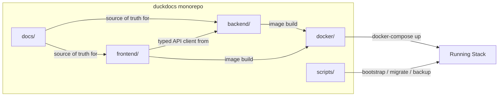

# 28 — Project Structure

**Product:** DuckDocs
**Document type:** Engineering standard — repository & monorepo layout
**Status:** Draft for team review
**Audience:** Engineering (frontend, backend, platform), new contributors
**Upstream:** [01_VISION.md](./01_VISION.md) · [02_PRODUCT_REQUIREMENTS.md](./02_PRODUCT_REQUIREMENTS.md) · [27_SETTINGS.md](./27_SETTINGS.md)
**Downstream:** [29_DOCKER_ARCHITECTURE.md](./29_DOCKER_ARCHITECTURE.md) · [30_DEPLOYMENT.md](./30_DEPLOYMENT.md) · [35_TESTING_STRATEGY.md](./35_TESTING_STRATEGY.md)

---

## 1. Purpose

This document defines the **canonical repository layout** for DuckDocs: a single monorepo containing the Next.js/React/TypeScript frontend, the FastAPI/Python backend, documentation, Docker assets, and operational scripts.

A consistent, predictable structure is required because DuckDocs is built from **modular, typed, swappable subsystems** (ingestion, OCR, providers, retrieval, evidence, export — per [01_VISION.md §14](./01_VISION.md#14-future-extensibility)). The repository layout must make module boundaries visible in the filesystem, not just in diagrams.

---

## 2. Scope

### In scope

- Top-level monorepo directory layout
- Frontend (`frontend/`) internal structure and conventions
- Backend (`backend/`) internal structure and conventions
- Shared/cross-cutting directories: `docs/`, `docker/`, `scripts/`, `.github/`
- Naming conventions, module boundary rules, and where new subsystems (parsers, providers, exporters) plug in
- Environment and secrets file placement (not contents — see [24_SECURITY.md](./24_SECURITY.md))
- Versioning and workspace tooling expectations (package managers, monorepo tooling)

### Out of scope

- Build/CI pipeline definitions in detail → [36_CICD.md](./36_CICD.md) (planned)
- Docker Compose service definitions → [29_DOCKER_ARCHITECTURE.md](./29_DOCKER_ARCHITECTURE.md)
- Database schema and migrations content → [13_DATABASE_DESIGN.md](./13_DATABASE_DESIGN.md)
- API route catalog → [15_API_SPECIFICATION.md](./15_API_SPECIFICATION.md)
- Component-level frontend architecture → [17_FRONTEND_ARCHITECTURE.md](./17_FRONTEND_ARCHITECTURE.md) (planned), [19_COMPONENT_LIBRARY.md](./19_COMPONENT_LIBRARY.md)

---

## 3. Goals

| Goal ID | Goal | Why it matters |
|---------|------|-----------------|
| STR-G01 | Module boundaries (ingestion, providers, evidence, export, etc.) are visible directly in the directory tree | Supports AD-V03/AD-V04 pluggability without relying on tribal knowledge |
| STR-G02 | Frontend and backend can be built, tested, and deployed independently while sharing a single repository | Enables independent scaling per AD-V07 rejection of monolithic services |
| STR-G03 | A new contributor can locate "where does X live" within minutes using naming conventions alone | Onboarding speed, review speed |
| STR-G04 | Docker, scripts, and docs are first-class top-level citizens, not afterthought folders | Deployment and documentation are part of the product, not side artifacts |
| STR-G05 | Structure accommodates future plugins (new parsers, providers, exporters) without top-level reorganization | Matches PR-EXT01 extension-point requirement |

---

## 4. Top-Level Layout

```text
duckdocs/
├── frontend/                 # Next.js + React + TypeScript app
├── backend/                  # FastAPI + Python application
├── docker/                   # Compose files, Dockerfiles, entrypoints, healthchecks
├── docs/                     # This documentation suite (01_VISION.md ... 40_FUTURE_ROADMAP.md)
├── scripts/                  # Dev, ops, and maintenance scripts (bootstrap, backup, migration helpers)
├── data/                     # Local runtime data (git-ignored): documents, db, vectors, logs, exports
├── .github/                  # CI workflows, issue/PR templates (if using GitHub)
├── .env.example               # Documented template for local environment variables
├── docker-compose.yml         # Default local Compose stack (see 29_DOCKER_ARCHITECTURE.md)
├── docker-compose.override.yml.example
├── Makefile                   # Common dev commands (up, down, logs, test, lint, migrate)
├── LICENSE
└── README.md
```

**Rule:** `data/` is always git-ignored and always Docker-volume-backed. Nothing inside `data/` is ever assumed to exist in the repository; first-run bootstrapping (scripts or Compose) creates it.

---

## 5. Frontend Structure (`frontend/`)

```text
frontend/
├── app/                        # Next.js App Router routes
│   ├── (library)/              # Library surface routes
│   ├── (intelligence)/         # Search / Ask / Summarize / Extract routes
│   ├── (review)/                # Annotations / Compare / Export routes
│   ├── (settings)/             # Settings routes (see 27_SETTINGS.md)
│   ├── api/                     # Next.js route handlers (BFF-thin; real logic stays in backend)
│   └── layout.tsx
├── components/
│   ├── ui/                      # Design-system primitives (buttons, inputs, dialogs)
│   ├── library/                 # Library-surface components
│   ├── intelligence/             # Search/chat/citation components
│   ├── review/                   # Annotation/compare/export components
│   ├── settings/                 # Provider forms, model picker, privacy badge (27_SETTINGS.md §15.2)
│   └── shared/                   # Cross-surface shared components (e.g., PrivacyBadge, EmptyState)
├── lib/
│   ├── api/                      # Typed API client (generated or hand-written from OpenAPI)
│   ├── hooks/                     # Shared React hooks
│   ├── stores/                    # Client state (e.g., Zustand/Jotai) — no document content cached beyond session need
│   └── utils/
├── styles/                        # Design tokens, global CSS, theme
├── public/                        # Static assets
├── tests/
│   ├── unit/
│   ├── integration/
│   └── e2e/
├── next.config.ts
├── tsconfig.json
├── package.json
└── .env.local.example
```

**Conventions**

- Route groups (`(library)`, `(intelligence)`, `(review)`, `(settings)`) mirror the four primary interfaces from [01_VISION.md §11](./01_VISION.md#11-interfaces-vision-level) and [02_PRODUCT_REQUIREMENTS.md §4.2](./02_PRODUCT_REQUIREMENTS.md#42-primary-surfaces) exactly — no fifth top-level surface should appear without a vision/PRD update first.
- `components/ui/` never imports from `components/{library,intelligence,review,settings}/` — the design system is a downstream dependency of features, never the reverse.
- All network access from the frontend goes through `lib/api/`; components never call `fetch` directly, which keeps redaction, auth, and error-shape handling centralized (see [33_ERROR_HANDLING.md](./33_ERROR_HANDLING.md)).

---

## 6. Backend Structure (`backend/`)

```text
backend/
├── app/
│   ├── main.py                    # FastAPI app factory, startup/shutdown hooks
│   ├── api/
│   │   ├── routes/
│   │   │   ├── library.py
│   │   │   ├── intelligence.py
│   │   │   ├── evidence.py
│   │   │   ├── review.py
│   │   │   ├── export.py
│   │   │   ├── settings.py         # Backs 27_SETTINGS.md endpoints
│   │   │   └── health.py           # Health/readiness endpoints (31_OBSERVABILITY.md)
│   │   └── deps.py                 # Shared FastAPI dependencies (auth, db session, correlation id)
│   ├── core/
│   │   ├── config.py               # Settings/config loader (26_CONFIGURATION.md)
│   │   ├── logging.py              # Structured logging setup (32_LOGGING.md)
│   │   └── errors.py               # Typed error hierarchy (33_ERROR_HANDLING.md)
│   ├── domain/
│   │   ├── document.py             # Document, Version domain models
│   │   ├── chunk.py                # Chunk, Evidence domain models
│   │   ├── annotation.py
│   │   ├── comparison.py
│   │   └── export.py
│   ├── ingestion/
│   │   ├── parsers/                # One module per format family; pluggable registry
│   │   │   ├── pdf.py
│   │   │   ├── office.py
│   │   │   ├── spreadsheet.py
│   │   │   ├── image_ocr.py
│   │   │   ├── code.py
│   │   │   └── structured.py
│   │   ├── chunking.py
│   │   └── pipeline.py             # Orchestrates parse → chunk → embed → store
│   ├── providers/
│   │   ├── base.py                 # Provider protocol/interface (chat + embedding)
│   │   ├── ollama.py
│   │   ├── openai.py
│   │   ├── anthropic.py
│   │   ├── gemini.py
│   │   └── openai_compatible.py
│   ├── retrieval/
│   │   ├── vector_store.py         # ChromaDB client wrapper
│   │   └── ranker.py
│   ├── generation/
│   │   ├── qa.py
│   │   ├── summarize.py
│   │   └── extract.py
│   ├── evidence/
│   │   └── provenance.py
│   ├── export/
│   │   └── exporters/               # One module per export format
│   ├── jobs/
│   │   ├── queue.py                 # Background job orchestration (ingest, embed, OCR)
│   │   └── metrics.py               # Job counters/timers (31_OBSERVABILITY.md)
│   └── db/
│       ├── models.py                 # ORM models
│       ├── session.py
│       └── migrations/               # Alembic (or equivalent) migrations
├── tests/
│   ├── unit/
│   ├── integration/
│   └── contract/                     # Provider contract tests (AD-V04 enforcement)
├── pyproject.toml
├── requirements/ or poetry.lock
└── .env.example
```

**Conventions**

- `providers/` implements a single shared protocol (`base.py`) for both chat and embedding capabilities; a provider module declares which capabilities it supports (§5.5 in [27_SETTINGS.md](./27_SETTINGS.md)). Adding a provider never requires touching `api/routes/settings.py`.
- `ingestion/parsers/` is a **registry**, not a chain of `if/elif` on file extension — new formats register themselves, satisfying PR-EXT01.
- `domain/` models are framework-agnostic (no FastAPI/ORM imports) so they can be shared/tested independently and remain the stable contract referenced by [01_VISION.md §14](./01_VISION.md#14-future-extensibility).
- `core/errors.py` defines the typed error hierarchy referenced across `ingestion/`, `providers/`, and `retrieval/` — see [33_ERROR_HANDLING.md](./33_ERROR_HANDLING.md).

---

## 7. Docker (`docker/`)

```text
docker/
├── frontend.Dockerfile
├── backend.Dockerfile
├── entrypoints/
│   ├── backend-entrypoint.sh
│   └── wait-for-ollama.sh
├── healthchecks/
│   └── backend-health.sh
└── compose/
    ├── docker-compose.yml           # Symlinked or referenced from repo root
    └── docker-compose.gpu.yml       # Optional GPU override for Ollama
```

Full service definitions and volume/network topology are specified in [29_DOCKER_ARCHITECTURE.md](./29_DOCKER_ARCHITECTURE.md).

---

## 8. Scripts (`scripts/`)

| Script | Purpose |
|--------|---------|
| `bootstrap.sh` / `bootstrap.ps1` | First-run setup: create `data/` subdirectories, copy `.env.example`, pull default Ollama models |
| `backup.sh` | Snapshot `data/db` and `data/vectors` to a local archive |
| `restore.sh` | Restore from a local backup archive |
| `migrate.sh` | Run backend database migrations |
| `dev-up.sh` | Start Compose stack in dev mode with hot-reload volumes |
| `lint-all.sh` | Run frontend + backend linters in one pass |

Scripts are cross-platform where feasible (PowerShell equivalents ship alongside POSIX shell scripts, matching the Windows-first developer environment noted for this workspace).

---

## 9. Documentation (`docs/`)

The `docs/` directory **is** this documentation suite — numbered `NN_TOPIC.md` files, each self-contained with Document Control metadata, forming the implementation source of truth per [01_VISION.md C-07](./01_VISION.md#12-constraints). No competing documentation location (e.g., wiki, separate Notion export) should be treated as authoritative while this suite exists.

---

## 10. Architecture Decisions

| ID | Decision | Rationale |
|----|----------|-----------|
| STR-AD01 | Single monorepo for frontend + backend + docs + docker + scripts | Matches C-03 stack; simplifies versioned, atomic cross-cutting changes (e.g., an API contract change and its typed client update land in one commit) |
| STR-AD02 | Frontend route groups mirror the four vision-level interfaces exactly | Prevents IA drift between product docs and code |
| STR-AD03 | Backend organized by **domain capability** (ingestion, providers, retrieval, evidence, export) rather than by technical layer (models/views/controllers) | Matches modular subsystem requirement (AD-V03); each capability is independently extensible |
| STR-AD04 | Provider and parser modules are registries, not conditional chains | Required for PR-EXT01 (add without redesign) |
| STR-AD05 | `data/` is always external to source control and always volume-backed | Keeps local user data out of git history; aligns with local-first storage model |
| STR-AD06 | Domain models (`backend/app/domain/`) have zero framework dependencies | Keeps the stable domain model (Document, Version, Chunk, Evidence, Annotation, Citation, Comparison, Export) portable and testable per [01_VISION.md §14](./01_VISION.md#14-future-extensibility) |

### Alternatives rejected

| Alternative | Why rejected |
|-------------|---------------|
| Separate repositories for frontend/backend | Increases coordination overhead for a small, fast-moving team; contradicts "documentation before application code" single-source-of-truth approach |
| Layer-first backend structure (`models/`, `views/`, `controllers/`) | Obscures capability boundaries that must stay swappable (providers, parsers, exporters) |
| Format-specific `if/elif` dispatch instead of parser registry | Breaks PR-EXT01; every new format would require editing a shared dispatch function |
| Bundling `data/` sample fixtures into the main data path | Risks accidental commits of real user data; test fixtures live under `tests/fixtures/` instead |

---

## 11. Tradeoffs

| Tradeoff | We choose | We accept |
|----------|-----------|-----------|
| Monorepo simplicity vs. independent versioning | Monorepo with independently buildable frontend/backend images | Slightly more complex CI matrix (build both, but only what changed) |
| Capability-first backend structure vs. familiarity of MVC | Capability-first | Slightly steeper ramp-up for engineers used to MVC frameworks |
| Registry-based extension points vs. simplicity of direct dispatch | Registries for parsers/providers | Small amount of upfront indirection/boilerplate per module |
| Cross-platform scripts (sh + ps1) vs. single script language | Maintain both | Some duplication, but matches actual developer environments (Windows + POSIX) |

---

## 12. Data Flow

The project structure itself has no runtime data flow, but it directly shapes the **build and dependency flow**:



---

## 13. Interfaces

| Interface | Description |
|-----------|--------------|
| Frontend ↔ Backend | Typed HTTP/JSON API (OpenAPI-generated client in `frontend/lib/api/`); see [15_API_SPECIFICATION.md](./15_API_SPECIFICATION.md) |
| Backend ↔ Providers | Shared provider protocol in `backend/app/providers/base.py` |
| Backend ↔ Vector store | `backend/app/retrieval/vector_store.py` wrapper around ChromaDB client |
| Backend ↔ Relational DB | ORM session in `backend/app/db/session.py` |
| Repo ↔ CI | `.github/workflows/*` (or equivalent) invoking `scripts/lint-all.sh`, test suites, and Docker builds |
| Repo ↔ Developer | `Makefile` / `scripts/dev-up.sh` as the single entrypoint for local dev |

---

## 14. Constraints

| ID | Constraint |
|----|------------|
| STR-C01 | Frontend and backend must each build into an independent Docker image consumable by [29_DOCKER_ARCHITECTURE.md](./29_DOCKER_ARCHITECTURE.md) |
| STR-C02 | No runtime user data may be committed to the repository; `data/` and equivalents are git-ignored |
| STR-C03 | New file-type parsers, providers, or exporters must be addable by adding a module + registry entry, not by editing core dispatch logic |
| STR-C04 | `docs/` numbering and cross-references must remain internally consistent; renumbering requires updating all cross-referencing documents |
| STR-C05 | Domain models must remain framework-agnostic to preserve portability guarantees in [01_VISION.md §14](./01_VISION.md#14-future-extensibility) |

---

## 15. Risks

| Risk | Impact | Mitigation |
|------|--------|------------|
| Structure drifts from documented layout as the codebase grows organically | Onboarding friction, inconsistent extension points | This document is reviewed at each phase boundary; structural PRs require a docs update in the same change |
| Frontend route groups diverge from the four-surface IA | Confusing navigation, PRD misalignment | Route group names are treated as a contract with [02_PRODUCT_REQUIREMENTS.md §4.2](./02_PRODUCT_REQUIREMENTS.md#42-primary-surfaces) |
| Registry pattern used inconsistently (some formats hardcoded) | Erodes extensibility promise (PR-EXT01) | Contract tests assert new parsers can be added via registration alone |
| Scripts diverge between POSIX and PowerShell variants | Broken workflows on one platform | CI runs bootstrap/lint scripts on both shells where feasible |

---

## 16. Future Extensibility

- New ingestion formats: add a module under `backend/app/ingestion/parsers/` and register it — no core pipeline changes.
- New providers: add a module under `backend/app/providers/` implementing the shared protocol; appears automatically in [27_SETTINGS.md](./27_SETTINGS.md)'s provider capability matrix once registered.
- New export formats: add a module under `backend/app/export/exporters/`.
- Multi-service scaling: `ingestion/` and `providers/` are structured so OCR/embedding workers could be extracted into separate services later (per [01_VISION.md AD-V03](./01_VISION.md#8-architecture-decisions-vision-level) rejection of a monolith) without a directory reshuffle — they already sit behind clean interfaces.
- Additional frontend surfaces (if the product grows beyond Library/Intelligence/Review/Settings) can be added as new route groups following the same convention.

---

## 17. Open Questions

| ID | Question | Owner | Needed by |
|----|----------|-------|-----------|
| STR-OQ01 | Poetry vs. pip-tools/requirements.txt for backend dependency management? | Backend Eng | Before first backend scaffold commit |
| STR-OQ02 | npm vs. pnpm vs. yarn for frontend workspace tooling? | Frontend Eng | Before first frontend scaffold commit |
| STR-OQ03 | Should `ingestion/` workers be split into a separate deployable service at P0, or stay in-process until proven necessary? | Platform | Before Docker architecture freeze |
| STR-OQ04 | Alembic (or alternative) migration tool choice for `backend/app/db/migrations/`? | Backend Eng | Before database design freeze |

---

## 18. Acceptance Criteria

This document is accepted when:

- [ ] Engineering agrees the top-level layout (`frontend/`, `backend/`, `docker/`, `docs/`, `scripts/`, `data/`) is final for P0
- [ ] Frontend route groups are confirmed to map 1:1 to Library/Intelligence/Review/Settings
- [ ] Backend capability-first structure (ingestion/providers/retrieval/evidence/export) is approved
- [ ] Registry pattern for parsers/providers/exporters is accepted as the extension mechanism satisfying PR-EXT01
- [ ] `data/` exclusion from version control is confirmed in `.gitignore` conventions
- [ ] Open questions (tooling choices) have owners and target dates

---

## 19. Cross-References

| Topic | Document |
|-------|----------|
| Settings UI/API details | [27_SETTINGS.md](./27_SETTINGS.md) |
| Docker services and volumes | [29_DOCKER_ARCHITECTURE.md](./29_DOCKER_ARCHITECTURE.md) |
| Deployment | [30_DEPLOYMENT.md](./30_DEPLOYMENT.md) |
| System architecture | [08_SYSTEM_ARCHITECTURE.md](./08_SYSTEM_ARCHITECTURE.md) |
| API specification | [15_API_SPECIFICATION.md](./15_API_SPECIFICATION.md) |
| Testing strategy | [35_TESTING_STRATEGY.md](./35_TESTING_STRATEGY.md) |

---

## Document Control

| Field | Value |
|-------|-------|
| Version | 0.1.0 |
| Last updated | 2026-07-18 |
| Authors | DuckDocs Architecture Team |
| Review state | Pending team review |
| Previous | [27_SETTINGS.md](./27_SETTINGS.md) |
| Next | [29_DOCKER_ARCHITECTURE.md](./29_DOCKER_ARCHITECTURE.md) |
