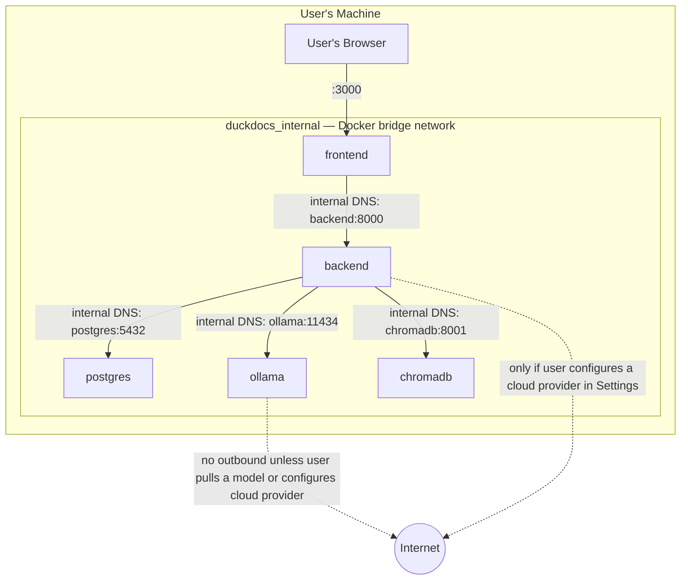
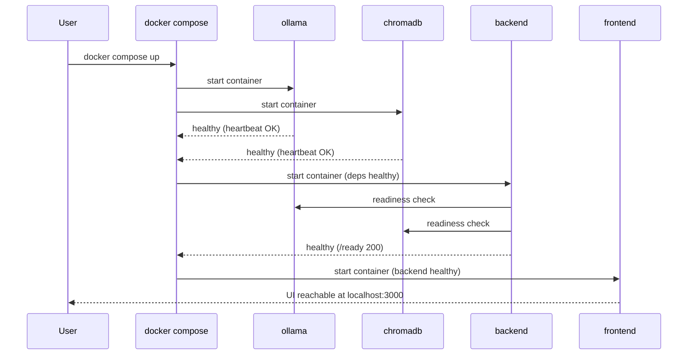

# 29 — Docker Architecture

**Product:** DuckDocs
**Document type:** Infrastructure specification — containerization & Compose topology
**Status:** Draft for team review
**Audience:** Platform engineering, backend engineering, DevOps, security
**Upstream:** [01_VISION.md](./01_VISION.md) · [02_PRODUCT_REQUIREMENTS.md](./02_PRODUCT_REQUIREMENTS.md) · [28_PROJECT_STRUCTURE.md](./28_PROJECT_STRUCTURE.md)
**Downstream:** [30_DEPLOYMENT.md](./30_DEPLOYMENT.md) · [31_OBSERVABILITY.md](./31_OBSERVABILITY.md)

---

## 1. Purpose

This document specifies the **Docker Compose architecture** that runs DuckDocs entirely on a user's local machine: which containers exist, how they network, what data they persist, and — critically — what they **do not** contain (no telemetry sidecars, no external agents, no forced outbound calls).

Docker Compose is the **first-class, default deployment mechanism** for DuckDocs (per C-03 and PC-01), not a convenience wrapper around a "real" cloud deployment. This document is the contract that [30_DEPLOYMENT.md](./30_DEPLOYMENT.md) builds its operational guidance on top of.

---

## 2. Scope

### In scope

- Compose service inventory: frontend, backend, postgres, ollama, chromadb (or embedded Chroma alternative)
- Container images, base images, and build strategy
- Networking topology (internal service network, exposed ports)
- Volume design for documents, database, vectors, models, logs
- Healthchecks and startup ordering (`depends_on` + health conditions)
- Resource constraints and GPU-optional configuration for Ollama
- Explicit non-inclusion of telemetry/APM sidecars
- Compose file variants (default, GPU override, dev override)

### Out of scope

- Step-by-step installation/runbook instructions → [30_DEPLOYMENT.md](./30_DEPLOYMENT.md)
- Hardware sizing guidance for models → [30_DEPLOYMENT.md §6](./30_DEPLOYMENT.md)
- Application-level configuration values → [26_CONFIGURATION.md](./26_CONFIGURATION.md), [27_SETTINGS.md](./27_SETTINGS.md)
- CI/CD pipeline and image publishing → [36_CICD.md](./36_CICD.md) (planned)
- Kubernetes or other orchestration targets — explicitly out of scope for the local-first product horizon (see §16)

---

## 3. Goals

| Goal ID | Goal | Why it matters |
|---------|------|-----------------|
| DOCK-G01 | `docker compose up` produces a fully functional, fully local DuckDocs instance with zero mandatory external calls | C-01, PR-S01 |
| DOCK-G02 | Every service that persists data does so on named, host-mapped volumes the user can locate and back up | PR-S07, SET-G05 |
| DOCK-G03 | No container in the default stack performs telemetry, analytics, or crash-reporting network calls | RULE-05, C-02 |
| DOCK-G04 | Services start in a safe order and report health so the frontend/backend never race against an unready Ollama or vector store | Commercial craft; avoids first-run failures |
| DOCK-G05 | GPU acceleration for Ollama is available as an **opt-in override**, never a hard requirement | Broad hardware compatibility per Gemma 3 1B hardware guidance |
| DOCK-G06 | The stack is inspectable: `docker compose ps`, logs, and healthchecks give a user enough information to self-diagnose without cloud dashboards | Local-only observability principle (see [31_OBSERVABILITY.md](./31_OBSERVABILITY.md)) |

---

## 4. Service Inventory

| Service | Image / Build | Role |
|---------|----------------|------|
| `frontend` | Built from `docker/frontend.Dockerfile` (Next.js, Node runtime) | Serves the DuckDocs web UI |
| `backend` | Built from `docker/backend.Dockerfile` (FastAPI, Python runtime) | API, ingestion pipeline, provider orchestration, job queue |
| `postgres` | Official `postgres` (pinned major version) | Relational store for documents, versions, evidence, jobs, settings (AD-S02 / DB-D07) |
| `ollama` | Official `ollama/ollama` image | Local model runtime for chat + embedding models |
| `chromadb` | Official `chromadb/chroma` image, **or** embedded mode inside `backend` (see §5) | Local vector store |

No other services ship in the default stack. There is deliberately no reverse proxy, no telemetry collector, no metrics-scraping sidecar, and no external message broker in the default P0 topology. PostgreSQL is included because provenance-critical writes from concurrent `api`/`worker` paths require multi-writer safety (see [08_SYSTEM_ARCHITECTURE.md](./08_SYSTEM_ARCHITECTURE.md) AD-S02).

---

## 5. ChromaDB: Standalone vs. Embedded

DuckDocs supports two ChromaDB deployment modes behind the same backend interface (`backend/app/retrieval/vector_store.py`):

| Mode | Description | When used |
|------|--------------|-----------|
| **Standalone service** | ChromaDB runs as its own Compose service with its own volume; backend connects over the internal network | Default for the reference Compose stack — clean separation of concerns, easiest to reason about and back up independently |
| **Embedded** | ChromaDB runs in-process within the `backend` container using its persistent local client | Optional lightweight mode for minimal-footprint installs (e.g., single-container evaluation, resource-constrained hardware) |

The mode is a Compose-file concern, not an application-code concern — the backend's vector store wrapper is initialized with a connection target (network client vs. local persistent client) purely from configuration, satisfying AD-V05 (vector store separated from relational store) regardless of deployment topology.

---

## 6. Networking Topology

- Only `frontend` (port `3000`, configurable) is published to the host by default. `backend`, `postgres`, `ollama`, and `chromadb` communicate over the internal Docker network and are **not** published to the host unless a developer opts in via `docker-compose.override.yml` for debugging.
- Service discovery uses Docker's internal DNS (service name resolution) — no hardcoded IPs, no external service registry.
- The only outbound internet traffic in the default configuration is (a) the one-time `ollama pull` for model download, initiated explicitly by the user via Settings or bootstrap script, and (b) calls to a cloud provider the user has explicitly configured in [27_SETTINGS.md](./27_SETTINGS.md). Nothing else crosses the host boundary.

---

## 7. Volumes

| Volume | Mounted in | Host path (default) | Contents |
|--------|-----------|----------------------|----------|
| `documents_data` | `backend` | `./data/documents` | Original uploaded files |
| `db_data` | `postgres` | `./data/db` | PostgreSQL data directory |
| `vector_data` | `chromadb` (or `backend` in embedded mode) | `./data/vectors` | ChromaDB persistence |
| `ollama_models` | `ollama` | `./data/models` (or Docker-managed named volume) | Pulled model weights |
| `logs_data` | `backend`, `frontend` | `./data/logs` | Structured logs (see [32_LOGGING.md](./32_LOGGING.md)) |
| `exports_data` | `backend` | `./data/exports` | User-triggered export artifacts |

All volumes are **named, host-mapped bind mounts** (not anonymous volumes) so a user can locate, back up, or migrate them directly from the filesystem — consistent with SET-G05 ("users can view and change local data paths and understand exactly where files live"). Anonymous/opaque Docker-managed volumes are avoided for anything holding user data; `ollama_models` may use a Docker-managed named volume for portability across platforms where model weight paths are large and rarely inspected directly, but a bind-mount override is documented for users who want direct access.

---

## 8. Healthchecks & Startup Ordering

| Service | Healthcheck | Startup dependency |
|---------|--------------|----------------------|
| `postgres` | `pg_isready` | None (starts in parallel with `ollama` / `chromadb`) |
| `ollama` | `GET /api/version` (or `ollama list`) inside container | None (starts first) |
| `chromadb` | `GET /api/v1/heartbeat` | None (starts in parallel with `ollama`) |
| `backend` | `GET /health` (liveness) and `GET /ready` (readiness — checks DB migration state, Ollama reachability, ChromaDB reachability) | `depends_on: postgres (service_healthy), ollama (service_healthy), chromadb (service_healthy)` |
| `frontend` | `GET /` (200 OK) | `depends_on: backend (service_healthy)` |

This ordering guarantees the backend never accepts ingestion or generation requests before its dependencies report healthy, and the frontend never renders against a backend that has not finished its own readiness checks. See [31_OBSERVABILITY.md](./31_OBSERVABILITY.md) for the full health/readiness endpoint contract.

---

## 9. Resource Constraints & GPU Configuration

- Default `docker-compose.yml` sets **no hard resource limits** beyond what Docker Desktop / the host allocates, keeping the default path maximally compatible with modest hardware (per Gemma 3 1B hardware guidance in [30_DEPLOYMENT.md](./30_DEPLOYMENT.md)).
- An optional `docker-compose.gpu.yml` override adds GPU device reservations (NVIDIA runtime) to the `ollama` service for users with compatible GPUs, applied via `docker compose -f docker-compose.yml -f docker-compose.gpu.yml up`.
- CPU-only operation is the guaranteed baseline; GPU is strictly additive and never required for the stack to start.
- An optional `docker-compose.override.yml.example` documents developer-only conveniences (published backend/chromadb ports, hot-reload bind mounts) that must never be required for a production-style local run.

---

## 10. No Telemetry Sidecars — Explicit Non-Inclusion

Per RULE-05 and G-03/DOCK-G03, the following are **explicitly excluded** from the default and all documented override Compose files:

- Application performance monitoring (APM) agents (e.g., Datadog agent, New Relic agent, Sentry relay)
- Log-shipping sidecars targeting external SaaS (e.g., a Fluentd/Vector pipeline configured to ship to a cloud log service)
- Analytics or crash-reporting collectors
- Any container whose only purpose is outbound telemetry

This is a **standing architectural rule**, not a current-state observation: any future PR proposing such a sidecar must first amend this document and [01_VISION.md §7.1](./01_VISION.md#71-privacy-first) and get explicit product+security sign-off. Local-only observability alternatives are specified in [31_OBSERVABILITY.md](./31_OBSERVABILITY.md).

---

## 11. Architecture Decisions

| ID | Decision | Rationale |
|----|----------|-----------|
| DOCK-AD01 | Five-service default stack: frontend, backend, postgres, ollama, chromadb | Matches C-03 + AD-S02; each service maps to one clear responsibility |
| DOCK-AD02 | ChromaDB deployable standalone or embedded behind one backend interface | Lets minimal-footprint installs shed a container without an application-code fork |
| DOCK-AD03 | Only `frontend` is published to the host by default | Minimizes accidental exposure of internal APIs/vector store on the host network |
| DOCK-AD04 | All user-data volumes are named, host-mapped bind mounts | Users must always be able to locate and back up their own data (SET-G05) |
| DOCK-AD05 | GPU support is an additive Compose override, never the base file | Guarantees CPU-only baseline compatibility |
| DOCK-AD06 | No telemetry/APM/log-shipping sidecars in any shipped Compose file | RULE-05 is enforced at the infrastructure layer, not just the application layer |
| DOCK-AD07 | Healthcheck-gated `depends_on` for every service boundary | Prevents race-condition failures on first `up` |

### Alternatives rejected

| Alternative | Why rejected |
|-------------|---------------|
| Bundle a reverse proxy (nginx/Traefik) in the default stack | Unnecessary complexity for a single-user local deployment; can be added by advanced users via override |
| Ship ChromaDB only as embedded (no standalone service) | Removes the option for users who want independent scaling/backup of the vector store |
| Publish backend and ChromaDB ports by default for "convenience" | Widens local attack surface unnecessarily; convenience ports belong in an explicit dev override |
| Anonymous Docker-managed volumes for document/db data | Makes user data hard to locate/back up; violates local-first transparency expectations |
| Include an optional "usage metrics" sidecar disabled by default | Even a disabled-by-default telemetry container invites accidental enablement and undermines the "no telemetry" claim's credibility |

---

## 12. Tradeoffs

| Tradeoff | We choose | We accept |
|----------|-----------|-----------|
| Operational simplicity of one big container vs. clear boundaries | Five distinct services | Slightly more Compose complexity and inter-service networking to reason about |
| ChromaDB flexibility (standalone/embedded) vs. one blessed path | Support both behind one interface | Two code paths to test in `retrieval/vector_store.py` |
| Zero published internal ports (security) vs. easy local debugging | Internal-only by default, override for dev | Developers need the override file to hit backend/ChromaDB directly |
| GPU support vs. baseline simplicity | GPU as override only | GPU users must apply an extra `-f` flag; documented in [30_DEPLOYMENT.md](./30_DEPLOYMENT.md) |

---

## 13. Data Flow

---

## 14. Interfaces

| Interface | Detail |
|-----------|--------|
| `frontend:3000` | Host-published, primary user entrypoint |
| `backend:8000` (internal) | REST/JSON API consumed by `frontend`; optionally published via dev override |
| `ollama:11434` (internal) | Ollama HTTP API consumed by `backend` |
| `chromadb:8001` (internal) | ChromaDB HTTP API consumed by `backend` in standalone mode |
| `docker-compose.yml` | Primary interface for users/operators — the contract this document specifies |
| `docker-compose.gpu.yml` | Opt-in override interface for GPU acceleration |
| `docker-compose.override.yml.example` | Documented, non-committed override pattern for local development |

---

## 15. Constraints

| ID | Constraint |
|----|------------|
| DOCK-C01 | Default Compose stack must start and reach full health with no internet connectivity, assuming models are already pulled |
| DOCK-C02 | No service in the default or documented override files may make outbound network calls other than user-initiated model pulls or explicitly configured cloud provider calls |
| DOCK-C03 | All volumes holding user-generated data (documents, db, vectors, exports, logs) must be host-mapped and documented in [27_SETTINGS.md §8](./27_SETTINGS.md) |
| DOCK-C04 | Services must expose a healthcheck compatible with `depends_on: condition: service_healthy` |
| DOCK-C05 | GPU acceleration must never be required by the base `docker-compose.yml` |
| DOCK-C06 | No telemetry, APM, or log-shipping-to-SaaS container may be added without a documented amendment to this file and sign-off per §10 |

---

## 16. Risks

| Risk | Impact | Mitigation |
|------|--------|------------|
| Ollama model pull fails/stalls on first run (large weights, slow network) | Broken first-run experience | Streamed pull progress in Settings ([27_SETTINGS.md §7](./27_SETTINGS.md)); bootstrap script retries; clear actionable error |
| ChromaDB standalone service adds noticeable startup latency on constrained hardware | Slower `up` time | Embedded mode available as a lighter-weight alternative (§5) |
| A future contributor unknowingly adds a "helpful" monitoring sidecar | Silent RULE-05 violation | This document is the enforcement checkpoint; PR review must check new Compose services against §10 |
| Host port conflicts (e.g., `3000` already in use) | Stack fails to start | Ports configurable via `.env`; documented override pattern in [30_DEPLOYMENT.md](./30_DEPLOYMENT.md) |
| GPU override misconfigured on unsupported host | Container crash loop | Documented fallback: remove GPU override, restart on CPU baseline |
| Bind-mount permission mismatches (especially Windows/WSL2, macOS) | Ingestion or DB write failures | Bootstrap script sets/validates directory permissions; documented troubleshooting in [30_DEPLOYMENT.md](./30_DEPLOYMENT.md) |

---

## 17. Future Extensibility

- Additional optional services (e.g., a dedicated OCR worker, a dedicated embedding worker) can be added as new Compose services behind the same internal network and healthcheck pattern, consistent with [01_VISION.md's](./01_VISION.md) rejection of a monolithic "do everything" service.
- A future **local-team** deployment mode (multi-user, still local/LAN-only, per OQ-V01) can extend this topology with an auth-aware reverse proxy — added explicitly, not silently, and still without external telemetry.
- Kubernetes/Helm packaging is a plausible future addition for advanced/self-hosted-server users but is explicitly deferred (§2) until Compose-first maturity is proven, per the roadmap.
- Multi-architecture image builds (amd64/arm64) can be added to the build pipeline without changing this topology.

---

## 18. Open Questions

| ID | Question | Owner | Needed by |
|----|----------|-------|-----------|
| DOCK-OQ01 | Should ChromaDB standalone or embedded be the P0 documented default? | Platform + AI Eng | Before Compose file freeze |
| DOCK-OQ02 | Should `ollama_models` be a bind mount or Docker-managed named volume by default? | Platform | Before Compose file freeze |
| DOCK-OQ03 | Do we ship a documented ARM64 (Apple Silicon) build path at P0? | Platform | Before deployment doc freeze |
| DOCK-OQ04 | Should backend expose a dev-only debug port in the tracked `docker-compose.override.yml.example`, or leave it fully undocumented for security-by-obscurity? | Platform + Security | Before P0 release |

---

## 19. Acceptance Criteria

This document is accepted when:

- [ ] The five-service default topology (frontend, backend, postgres, ollama, chromadb) is approved by platform engineering
- [ ] Volume mapping table is confirmed to align with [27_SETTINGS.md §8](./27_SETTINGS.md) path definitions
- [ ] Healthcheck-gated startup ordering is validated against a clean `docker compose up` from a cold state
- [ ] No-telemetry-sidecar rule (§10) is acknowledged by platform + security as a standing constraint
- [ ] GPU override is confirmed additive-only, with a documented CPU-only fallback
- [ ] Open questions have owners and target dates

---

## 20. Cross-References

| Topic | Document |
|-------|----------|
| Deployment runbook, hardware guidance | [30_DEPLOYMENT.md](./30_DEPLOYMENT.md) |
| Repository/project layout | [28_PROJECT_STRUCTURE.md](./28_PROJECT_STRUCTURE.md) |
| Local observability (health, metrics) | [31_OBSERVABILITY.md](./31_OBSERVABILITY.md) |
| Configuration and paths | [26_CONFIGURATION.md](./26_CONFIGURATION.md) · [27_SETTINGS.md](./27_SETTINGS.md) |
| System architecture | [08_SYSTEM_ARCHITECTURE.md](./08_SYSTEM_ARCHITECTURE.md) |
| Vector database design | [14_VECTOR_DATABASE.md](./14_VECTOR_DATABASE.md) |

---

## Document Control

| Field | Value |
|-------|-------|
| Version | 0.1.0 |
| Last updated | 2026-07-18 |
| Authors | DuckDocs Architecture Team |
| Review state | Pending team review |
| Previous | [28_PROJECT_STRUCTURE.md](./28_PROJECT_STRUCTURE.md) |
| Next | [30_DEPLOYMENT.md](./30_DEPLOYMENT.md) |
