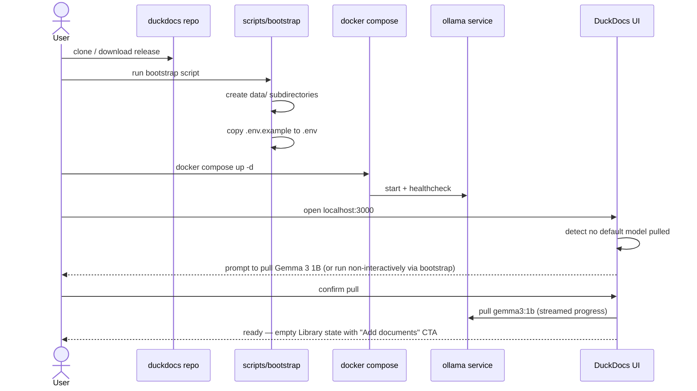
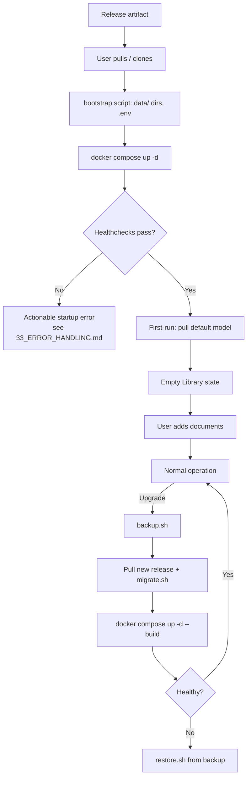

# 30 — Deployment

**Product:** DuckDocs
**Document type:** Operations specification — deployment models & hardware guidance
**Status:** Draft for team review
**Audience:** Platform engineering, DevOps, support, end users (install-facing sections)
**Upstream:** [01_VISION.md](./01_VISION.md) · [02_PRODUCT_REQUIREMENTS.md](./02_PRODUCT_REQUIREMENTS.md) · [29_DOCKER_ARCHITECTURE.md](./29_DOCKER_ARCHITECTURE.md)
**Downstream:** [31_OBSERVABILITY.md](./31_OBSERVABILITY.md) · [35_TESTING_STRATEGY.md](./35_TESTING_STRATEGY.md)

---

## 1. Purpose

This document specifies **how DuckDocs is deployed and operated**, with **local Docker Compose as the first-class, primary deployment target**. It defines installation flow, environment configuration, upgrade/rollback procedure, backup/restore, and — critically — **hardware guidance for running the default model, Gemma 3 1B, via Ollama** on realistic consumer and workstation hardware.

Deployment guidance exists to make the local-first promise in [01_VISION.md §7.3](./01_VISION.md#73-local-only-by-default) operationally real: a user should be able to go from "nothing installed" to "cited answer from my own documents" without a cloud account, a support ticket, or specialized ops knowledge.

---

## 2. Scope

### In scope

- Deployment models (local Docker Compose primary; future alternatives noted as non-goals for now)
- Installation and first-run flow
- Environment/configuration file conventions at deploy time
- Hardware guidance and sizing tiers for Gemma 3 1B and larger optional models
- Upgrade and rollback procedure for new DuckDocs releases
- Backup and restore procedure for local data
- Troubleshooting classes and where to find deeper diagnostics

### Out of scope

- Container/service topology details → [29_DOCKER_ARCHITECTURE.md](./29_DOCKER_ARCHITECTURE.md)
- Application configuration schema → [26_CONFIGURATION.md](./26_CONFIGURATION.md)
- CI/CD pipeline that produces release artifacts → [36_CICD.md](./36_CICD.md) (planned)
- Health/metrics endpoint contract → [31_OBSERVABILITY.md](./31_OBSERVABILITY.md)
- Multi-user/team deployment model (deferred; tracked as an open question, see [01_VISION.md OQ-V01](./01_VISION.md#18-open-questions))

---

## 3. Goals

| Goal ID | Goal | Why it matters |
|---------|------|-----------------|
| DEP-G01 | A new user reaches a working, cited-answer state on a default local install without a cloud account | Vision §16 Success Definition |
| DEP-G02 | Hardware guidance is honest and tiered, so users self-select realistic expectations before installing | Risk mitigation from [01_VISION.md §13](./01_VISION.md#13-risks) ("local hardware cannot run useful models") |
| DEP-G03 | Upgrades preserve local data by default and never require re-entering provider credentials unnecessarily | Commercial craft; trust |
| DEP-G04 | Backup/restore is a documented, scriptable, local-only operation | Data ownership principle (G-01) |
| DEP-G05 | Local Docker Compose remains fully supported and documented as the primary path even as future deployment models are explored | C-01, PC-01 |

---

## 4. Deployment Models

| Model | Status | Description |
|-------|--------|-------------|
| **Local Docker Compose** | **Primary, first-class, P0** | Single-machine install via `docker compose up`; the model this document specifies in depth |
| Native (non-Docker) install | Non-goal for current horizon | Would require packaging Ollama, ChromaDB, Python, and Node natively per OS; deferred per [01_VISION.md §17](./01_VISION.md#17-non-goals-current-vision-horizon) scope discipline |
| Local network / team deployment | Future, tracked via OQ-V01 | Same Compose topology, exposed on LAN with added auth; not P0 |
| Managed cloud hosting | Explicit non-goal | Contradicts local-first positioning (§6 of [01_VISION.md](./01_VISION.md)); DuckDocs is not offered as a hosted SaaS by the core team |

This document specifies the **Local Docker Compose** model exhaustively; other rows are recorded for scoping clarity only.

---

## 5. Installation & First-Run Flow

### 5.1 Prerequisites

| Requirement | Notes |
|--------------|-------|
| Docker Desktop (Windows/macOS) or Docker Engine + Compose plugin (Linux) | Compose v2 syntax (`docker compose`, not legacy `docker-compose`) |
| ~10 GB free disk (minimum) | Documents, database, vectors, and at least one model's weights |
| 8 GB system RAM (minimum, CPU-only, Gemma 3 1B) | See hardware tiers in §6 |
| Internet connectivity for **initial image pull and model pull only** | Not required for day-to-day local operation afterward |

### 5.2 First-Run Sequence

### 5.3 First-Run UX Guarantees (per PR-Q03)

- If Ollama is unreachable, the UI explains it clearly rather than failing silently, with a link back to installation steps.
- If no model is pulled yet, the empty state offers the pull action inline — no separate terminal command required for the default path.
- The first screen after a successful install is the Library empty state guiding "add your first document," not a blank dashboard.

---

## 6. Hardware Guidance for Gemma 3 1B

DuckDocs' default model, **Gemma 3 1B via Ollama**, is chosen specifically to make the local-first default viable on modest hardware. Guidance below is directional; actual performance varies by OS, background load, and quantization.

### 6.1 Hardware Tiers

| Tier | CPU | RAM | GPU | Expected experience with Gemma 3 1B |
|------|-----|-----|-----|----------------------------------------|
| **Minimum** | 4-core modern x86/ARM | 8 GB | None (CPU inference) | Usable but slow (several seconds to tens of seconds per answer depending on context size); acceptable for light, occasional use |
| **Recommended** | 8-core modern x86/ARM | 16 GB | Optional integrated/entry discrete GPU | Comfortable interactive latency for Q&A and summarization on modest document sets |
| **Comfortable / power user** | 8+ core | 32 GB | Discrete GPU with ≥8 GB VRAM | Fast local inference; headroom to run larger optional models (Gemma 3 4B/12B) alongside a sizeable library |

### 6.2 Scaling Beyond the Default Model

| If the user wants... | Guidance |
|------------------------|----------|
| Better answer quality, still local | Configure a larger Ollama model (e.g., Gemma 3 4B/12B) in [27_SETTINGS.md](./27_SETTINGS.md) → Providers → Chat; requires proportionally more RAM/VRAM |
| Faster responses on constrained hardware | Keep Gemma 3 1B; reduce retrieval `top_k` / max context; prefer summarization over long multi-document synthesis |
| Best possible quality regardless of local hardware | Configure a cloud provider (OpenAI/Anthropic/Gemini) for chat, keep embeddings local if desired — independently configurable per [27_SETTINGS.md §5](./27_SETTINGS.md) |

### 6.3 Embedding Model Hardware Notes

Local embedding models (e.g., a compact `nomic-embed-text`-class model via Ollama) are deliberately chosen to be lightweight relative to chat models — embedding throughput, not latency, is the relevant metric during bulk ingestion. Large libraries (thousands of documents) will extend indexing time proportionally; this is surfaced as ingestion job progress (PR-L05), not a silent stall.

### 6.4 Disk Guidance

| Component | Approximate footprint |
|-----------|-------------------------|
| Ollama runtime + Gemma 3 1B weights | ~1–2 GB |
| Optional larger chat model (4B/12B) | ~3–8 GB additional |
| Embedding model weights | Several hundred MB, typically |
| Document library | User-dependent; original files stored as-is |
| Vector store + relational DB | Grows with library size and chunk density; budget roughly proportional to ingested text volume |

---

## 7. Environment & Configuration at Deploy Time

- Deployment-time configuration lives in `.env` (copied from `.env.example` at bootstrap) at the repository root, consumed by `docker-compose.yml` for port mappings, image tags, and pass-through variables to `backend`/`frontend`.
- Application-level settings (providers, models, paths, OCR) are configured **after** the stack is running, through [27_SETTINGS.md](./27_SETTINGS.md) or the underlying config layer in [26_CONFIGURATION.md](./26_CONFIGURATION.md) — deployment `.env` is intentionally minimal (ports, image tags, top-level data directory root) and does not duplicate application settings.
- Secrets (cloud provider API keys) are **never** placed in deployment `.env` committed to version control; they are entered via Settings after first run and stored per [24_SECURITY.md](./24_SECURITY.md).

---

## 8. Upgrade & Rollback

### 8.1 Upgrade Procedure

1. Pull the new release (git tag or release archive).
2. Review the release's changelog for migration notes.
3. Run `scripts/backup.sh` (§9) before upgrading, as a safety net.
4. Run database migrations via `scripts/migrate.sh` (idempotent; safe to re-run).
5. Rebuild/pull updated images: `docker compose pull && docker compose up -d --build`.
6. Verify health via `docker compose ps` and the backend `/health`/`/ready` endpoints ([31_OBSERVABILITY.md](./31_OBSERVABILITY.md)).

### 8.2 Rollback Procedure

1. Stop the stack: `docker compose down`.
2. Check out the previous release tag.
3. If the failed upgrade included a forward-only migration, restore the pre-upgrade backup via `scripts/restore.sh` rather than attempting a reverse migration (reverse migrations are not guaranteed for every release).
4. Bring the previous version back up: `docker compose up -d`.
5. Confirm data integrity (document count, ability to search/ask) before resuming normal use.

### 8.3 Data Compatibility Policy

- Minor/patch releases must not require destructive migrations.
- Major releases that change the vector store schema or embedding dimensionality must provide a documented re-index path and must warn the user before executing it (consistent with the embedding-switch behavior in [27_SETTINGS.md §5.4](./27_SETTINGS.md)).

---

## 9. Backup & Restore

| Operation | Command | Covers |
|-----------|---------|--------|
| Backup | `scripts/backup.sh` | Snapshots `data/db`, `data/vectors`, and optionally `data/documents` into a single timestamped local archive |
| Restore | `scripts/restore.sh <archive>` | Stops affected services, restores volumes from archive, restarts stack |

- Backups are **local files** by default (e.g., under `./backups/`), never uploaded anywhere automatically — consistent with C-02 (no silent outbound calls).
- Users are responsible for offsite backup if desired (e.g., copying the archive to external media); DuckDocs does not provide or assume cloud backup.
- Backup archives should exclude `data/logs` by default (operational, not user data) but may include it via a flag for support/debugging purposes.

---

## 10. Architecture Decisions

| ID | Decision | Rationale |
|----|----------|-----------|
| DEP-AD01 | Local Docker Compose is the sole P0-supported deployment model | Matches PC-01/PC-04; avoids diluting engineering effort across untested deployment targets |
| DEP-AD02 | Deployment-time `.env` is minimal and distinct from application Settings | Keeps secrets and rich app config out of deploy-time files; reduces accidental credential leakage into version-controlled defaults |
| DEP-AD03 | Gemma 3 1B is the default model precisely because it must run acceptably on the "Minimum" hardware tier | Vision success definition requires zero-cloud-account first run to actually work, not just be theoretically possible |
| DEP-AD04 | Backups are local-file-based with explicit user action, never automatic cloud sync | Consistent with privacy-first defaults; avoids a hidden data-exfiltration path |
| DEP-AD05 | Migrations are forward-only with backup-before-upgrade as the rollback safety net, rather than guaranteed reverse migrations | Reverse migrations for schema/vector changes are often lossy or impractical; a clean backup is a more reliable safety net |

### Alternatives rejected

| Alternative | Why rejected |
|-------------|---------------|
| Support native (non-Docker) install at P0 | Multiplies packaging/testing surface across OSes before Compose path is proven; deferred |
| Default model tuned for best quality regardless of hardware | Would break the zero-cloud-account first-run promise for users on modest machines |
| Automatic cloud backup integration | Contradicts local-first/no-silent-network-calls principles |
| Guaranteed reverse migrations for every release | Excessive engineering cost for a benefit better served by mandatory pre-upgrade backups |

---

## 11. Tradeoffs

| Tradeoff | We choose | We accept |
|----------|-----------|-----------|
| Model quality vs. hardware accessibility | Small default model (Gemma 3 1B) | Users needing top-tier reasoning must configure a larger local or cloud model |
| Deployment breadth vs. focus | Docker Compose only at P0 | Users without Docker (or unable to run it) are not served yet |
| Backup simplicity vs. completeness | Script-based local archive, excludes logs by default | Not a full point-in-time system snapshot; sufficient for practical recovery |
| Forward-only migrations vs. full reversibility | Backup-before-upgrade as safety net | Rollback requires restoring from backup rather than a one-command reverse migration |

---

## 12. Data Flow

---

## 13. Interfaces

| Interface | Description |
|-----------|--------------|
| `scripts/bootstrap.{sh,ps1}` | First-run setup entrypoint |
| `docker-compose.yml` / `docker-compose.gpu.yml` | Deployment topology, specified fully in [29_DOCKER_ARCHITECTURE.md](./29_DOCKER_ARCHITECTURE.md) |
| `scripts/migrate.sh` | Database migration entrypoint |
| `scripts/backup.sh` / `scripts/restore.sh` | Backup/restore entrypoints |
| `backend:/health`, `backend:/ready` | Upgrade verification endpoints, detailed in [31_OBSERVABILITY.md](./31_OBSERVABILITY.md) |
| `.env.example` | Documented deployment-time configuration template |

---

## 14. Constraints

| ID | Constraint |
|----|------------|
| DEP-C01 | Deployment must succeed with zero cloud account creation |
| DEP-C02 | Deployment must function fully offline after initial image and model pull |
| DEP-C03 | Hardware guidance must be validated against the "Minimum" tier before being published as such |
| DEP-C04 | Backup archives must not be transmitted anywhere by DuckDocs itself |
| DEP-C05 | Upgrade procedure must not silently discard user data; destructive changes require an explicit, documented migration path |

---

## 15. Risks

| Risk | Impact | Mitigation |
|------|--------|------------|
| Minimum-tier hardware produces unacceptably slow responses | Perceived product failure, churn | Honest tiering (§6.1); strict grounding keeps responses short/focused; guidance to reduce context or switch models |
| Users skip backup before upgrading and lose data on a bad migration | Data loss, trust damage | `scripts/migrate.sh` warns and can auto-invoke `backup.sh`; release notes mandate backup step |
| Docker Desktop licensing/availability changes on some platforms | Deployment friction | Document Docker Engine + Compose plugin path for Linux; monitor Docker Desktop licensing terms for guidance updates |
| GPU driver mismatches when using the GPU override | Crash loops, confusing errors | Documented fallback to CPU-only baseline in [29_DOCKER_ARCHITECTURE.md §9](./29_DOCKER_ARCHITECTURE.md) |
| Large libraries exceed practical local disk/RAM on minimum-tier hardware | Degraded performance or failures | Library size guidance tracked in NFR doc (OQ-V05); ingestion job metrics expose growing resource use early |

---

## 16. Future Extensibility

- Native (non-Docker) packaging can be added later as an additional deployment model without changing the underlying service boundaries defined in [29_DOCKER_ARCHITECTURE.md](./29_DOCKER_ARCHITECTURE.md).
- A local-network/team deployment mode can extend this document with auth and multi-user data isolation guidance while keeping the same Compose foundation.
- Hardware tiers can be extended with GPU-specific tiers as GPU-accelerated local inference becomes more central to the default experience.
- Automated backup scheduling (still local-only, e.g., a cron-style local job) is a natural extension of §9 without violating no-telemetry principles.

---

## 17. Open Questions

| ID | Question | Owner | Needed by |
|----|----------|-------|-----------|
| DEP-OQ01 | What is the authoritative minimum-tier benchmark methodology (which CPU, which context length) we publish? | Platform + AI Eng | Before public hardware guidance is finalized |
| DEP-OQ02 | Do we provide a one-command "upgrade" wrapper script, or document the multi-step procedure only? | Platform | Before P0 release |
| DEP-OQ03 | Should `scripts/backup.sh` default to including `data/documents` (large) or make it opt-in due to size? | Platform + Product | Before backup doc finalization |
| DEP-OQ04 | Maximum practical library size for default local hardware guidance (mirrors [01_VISION.md OQ-V05](./01_VISION.md#18-open-questions))? | Platform | Before NFR freeze |

---

## 18. Acceptance Criteria

This document is accepted when:

- [ ] Local Docker Compose is confirmed as the sole P0 deployment model
- [ ] Hardware tiers (§6.1) are validated against at least one real benchmark run per tier before publishing to end users
- [ ] Upgrade/rollback procedure is exercised against a test release with a non-trivial migration
- [ ] Backup/restore scripts are confirmed to fully recover a test instance
- [ ] First-run UX guarantees (§5.3) are confirmed against [33_ERROR_HANDLING.md](./33_ERROR_HANDLING.md) error taxonomy
- [ ] Open questions have owners and target dates

---

## 19. Cross-References

| Topic | Document |
|-------|----------|
| Container/service topology | [29_DOCKER_ARCHITECTURE.md](./29_DOCKER_ARCHITECTURE.md) |
| Health/readiness endpoints, metrics | [31_OBSERVABILITY.md](./31_OBSERVABILITY.md) |
| Configuration model | [26_CONFIGURATION.md](./26_CONFIGURATION.md) |
| Settings UI | [27_SETTINGS.md](./27_SETTINGS.md) |
| Security (secrets handling) | [24_SECURITY.md](./24_SECURITY.md) |
| Non-functional requirements (sizing, performance budgets) | [04_NON_FUNCTIONAL_REQUIREMENTS.md](./04_NON_FUNCTIONAL_REQUIREMENTS.md) |
| Testing strategy | [35_TESTING_STRATEGY.md](./35_TESTING_STRATEGY.md) |

---

## Document Control

| Field | Value |
|-------|-------|
| Version | 0.1.0 |
| Last updated | 2026-07-18 |
| Authors | DuckDocs Architecture Team |
| Review state | Pending team review |
| Previous | [29_DOCKER_ARCHITECTURE.md](./29_DOCKER_ARCHITECTURE.md) |
| Next | [31_OBSERVABILITY.md](./31_OBSERVABILITY.md) |
