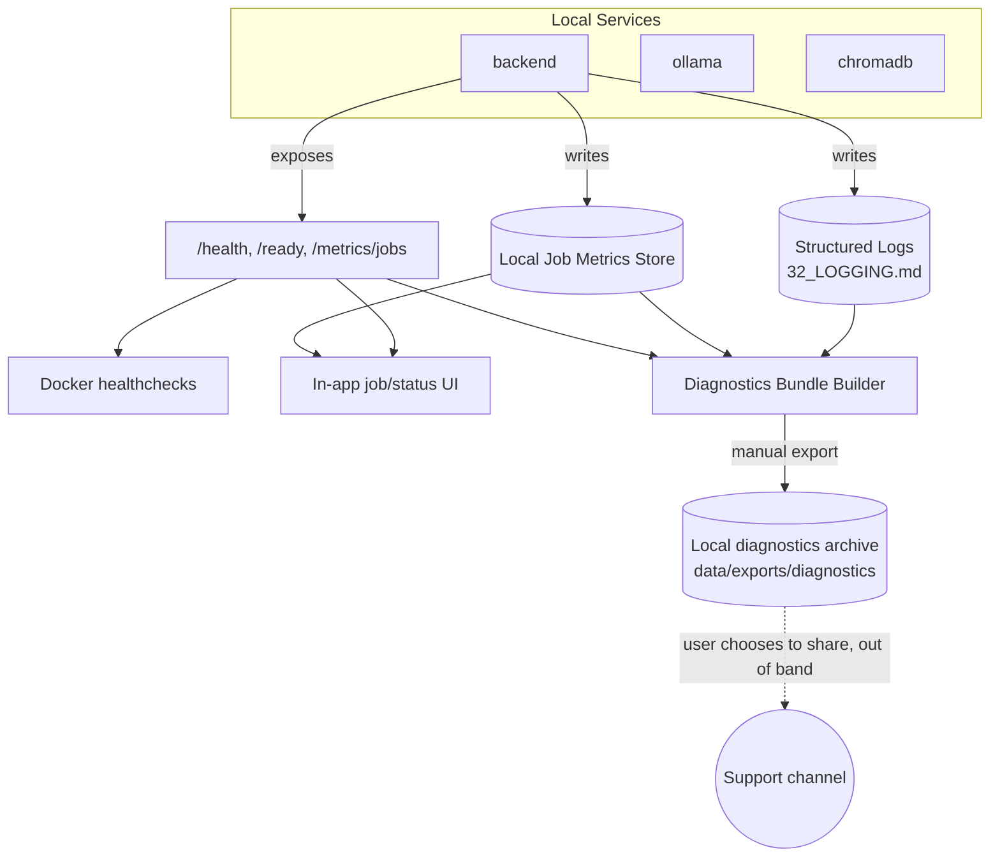

# 31 — Observability

**Product:** DuckDocs
**Document type:** Subsystem specification — local-only observability
**Status:** Draft for team review
**Audience:** Backend engineering, platform engineering, support, security
**Upstream:** [01_VISION.md](./01_VISION.md) · [02_PRODUCT_REQUIREMENTS.md](./02_PRODUCT_REQUIREMENTS.md) · [29_DOCKER_ARCHITECTURE.md](./29_DOCKER_ARCHITECTURE.md) · [30_DEPLOYMENT.md](./30_DEPLOYMENT.md)
**Downstream:** [32_LOGGING.md](./32_LOGGING.md) · [33_ERROR_HANDLING.md](./33_ERROR_HANDLING.md)

---

## 1. Purpose

This document specifies how DuckDocs is **observed and diagnosed — entirely locally**. It defines structured logging integration points, health/readiness endpoints, in-UI job metrics, and privacy-compatible diagnostic export, and it states unambiguously what DuckDocs **does not** do: no SaaS Application Performance Monitoring (APM), no third-party crash reporting, no usage analytics, no background telemetry of any kind.

Observability is a **trust feature**, not just an ops convenience: per [01_VISION.md §7.1](./01_VISION.md#71-privacy-first), users must be able to verify — via the same local tools engineers use to debug the product — that "no data leaves the machine" is actually true, not just claimed.

---

## 2. Scope

### In scope

- Observability philosophy and non-goals (no SaaS APM/telemetry)
- Health and readiness endpoint contract
- In-UI job/operation metrics (ingestion, embedding, retrieval, generation)
- Local metrics storage and retention
- Privacy-compatible diagnostics bundle for support/debugging
- Correlation between observability data and logs/errors

### Out of scope

- Log format, levels, and redaction rules → [32_LOGGING.md](./32_LOGGING.md)
- Error taxonomy and user-facing messages → [33_ERROR_HANDLING.md](./33_ERROR_HANDLING.md)
- Container health checks at the Compose level (referenced, not redefined) → [29_DOCKER_ARCHITECTURE.md](./29_DOCKER_ARCHITECTURE.md)
- Automated testing/monitoring in CI → [35_TESTING_STRATEGY.md](./35_TESTING_STRATEGY.md), [36_CICD.md](./36_CICD.md) (planned)

---

## 3. Goals

| Goal ID | Goal | Why it matters |
|---------|------|-----------------|
| OBS-G01 | Every service exposes standard health/readiness endpoints usable by Compose, scripts, and support | DOCK-G04, DEP-G01 |
| OBS-G02 | Users can see the state of background jobs (ingestion, OCR, embedding) directly in the UI without external tools | PR-L05, commercial craft |
| OBS-G03 | No observability mechanism transmits data outside the local machine by default | RULE-05, C-02 |
| OBS-G04 | When a user needs support, they can generate a single local diagnostics bundle that is safe to share (redacted) rather than pasting raw logs | Support efficiency without privacy compromise |
| OBS-G05 | Observability data correlates cleanly with logs and errors via shared correlation IDs | Debuggability across subsystems |

---

## 4. Observability Philosophy: Local-Only

| Conventional approach | DuckDocs approach |
|------------------------|----------------------|
| Ship metrics/traces to a SaaS APM (Datadog, New Relic, Honeycomb) | Metrics computed and stored locally; visualized in-app |
| Crash reporting SDK auto-uploads stack traces | Errors logged locally with structured detail; users may voluntarily export a diagnostics bundle |
| Product analytics (page views, feature usage) sent to a vendor | No usage analytics exist in the product at all |
| Distributed tracing exported to a managed backend | Correlation IDs threaded through structured logs (§7); no external trace exporter |
| "Phone home" health pings | Health/readiness endpoints are pull-only, queried locally by Compose/scripts/UI — nothing is pushed externally |

This table is the standing acceptance test for any future observability proposal: if a proposed mechanism requires an external network destination by default, it does not belong in DuckDocs.

---

## 5. Health & Readiness Endpoints

| Endpoint | Purpose | Response shape |
|----------|---------|------------------|
| `GET /health` | Liveness — process is up and can respond | `{ "status": "ok", "version": "0.1.0", "uptime_s": 1234 }` |
| `GET /ready` | Readiness — dependencies are reachable | `{ "status": "ready" \| "degraded" \| "not_ready", "checks": { "database": "ok", "vector_store": "ok", "ollama": "ok" \| "unreachable", "chat_provider": "...", "embedding_provider": "..." } }` |
| `GET /metrics/jobs` | Snapshot of active/recent job counts by type and status | `{ "ingestion": { "queued": 2, "processing": 1, "ready": 40, "failed": 1 }, "embedding": {...} }` |

- `/health` never depends on external services — it answers instantly from process state.
- `/ready` performs lightweight reachability checks against Ollama/ChromaDB/DB and, if a cloud provider is configured, a cached last-known-reachable status rather than a live call on every poll (to avoid turning readiness polling into an unbounded stream of provider calls).
- These endpoints back the Docker healthchecks in [29_DOCKER_ARCHITECTURE.md §8](./29_DOCKER_ARCHITECTURE.md) and the upgrade verification step in [30_DEPLOYMENT.md §8.1](./30_DEPLOYMENT.md).

---

## 6. In-UI Job Metrics

### 6.1 Job Types Tracked

| Job type | Lifecycle states |
|----------|--------------------|
| Ingestion (parse/extract) | `queued → processing → ready \| failed` |
| OCR | `queued → processing → ready \| failed \| low_confidence` |
| Embedding | `queued → processing → ready \| failed` |
| Ask/Search/Summarize/Extract (Intelligence operations) | `running → completed \| failed \| insufficient_evidence` |
| Export | `queued → processing → ready \| failed` |

### 6.2 UI Surfaces

| Surface | Metric shown |
|---------|----------------|
| Library list | Per-document status badge (queued/processing/ready/failed) per PR-L05 |
| Library header / jobs tray | Aggregate counts (e.g., "3 processing, 1 failed") with drill-down |
| Intelligence response footer | Retrieval latency, chunk count considered, generation latency (supports PR-I07 evidence inspection) |
| Settings → Privacy & Network | Outbound call log (see [27_SETTINGS.md §10.2](./27_SETTINGS.md)) — a privacy-specific observability surface |
| Diagnostics panel (Settings → Advanced) | Rolling window of recent job durations, error rates by subsystem, current queue depth |

### 6.3 Metrics Storage

- Job metrics are held in-memory for live UI updates and persisted to a lightweight local store (e.g., a metrics table in the relational DB or a local time-series file) for historical trend display within the diagnostics panel.
- Retention default: 14 days of job-level metrics, configurable in Settings → Advanced. No metrics are ever transmitted off-device.

---

## 7. Correlation IDs

Every user-initiated or background operation is assigned a **correlation ID** at creation time and threaded through:

- Structured logs (see [32_LOGGING.md §5](./32_LOGGING.md))
- Job metrics records (§6.3)
- Error responses returned to the frontend (see [33_ERROR_HANDLING.md §6](./33_ERROR_HANDLING.md))
- The diagnostics bundle (§8)

| Operation | Correlation ID scope |
|-----------|------------------------|
| Document ingest | One ID per upload batch; child IDs per document if parsed independently |
| Ask / Search / Summarize / Extract | One ID per request, surfaced in the UI (e.g., in a collapsible "Request ID" element) so a user can reference it when asking for help |
| Provider connection test | One ID per test invocation |
| Export | One ID per export job |

This makes it possible to answer "what happened to job X" by grepping one ID across logs, metrics, and any error surfaced to the user — a debugging capability that a support engineer or the user themselves can use entirely offline.

---

## 8. Privacy-Compatible Diagnostics Bundle

When a user needs support, Settings → Advanced → **"Export diagnostics bundle"** produces a single local archive containing:

| Included | Excluded by default |
|----------|------------------------|
| Recent structured logs (redacted per [32_LOGGING.md §6](./32_LOGGING.md)) | Raw document content |
| Health/readiness snapshot | API keys / secrets (always excluded, never optional) |
| Job metrics summary (§6.3) | Full document library listing (only counts/types, not filenames, unless user opts in) |
| Configuration summary with secrets redacted (provider names/models, not keys) | Embedding vectors / chunk text |
| App/Docker/Ollama version info | Anything requiring a network call to generate |

- The bundle is written to `data/exports/diagnostics/` and is never transmitted automatically — the user manually attaches it to a support channel of their choosing (RULE-05 compliance: DuckDocs itself performs no upload).
- An optional "include filenames" checkbox lets the user decide, per-export, whether document filenames (not content) are included — off by default, mirroring the connection-test opt-in pattern in [27_SETTINGS.md §11.2](./27_SETTINGS.md).

---

## 9. Architecture Decisions

| ID | Decision | Rationale |
|----|----------|-----------|
| OBS-AD01 | No SaaS APM, crash reporting, or analytics SDK is integrated anywhere in the codebase | RULE-05; a standing architectural rule, not a current-state fact |
| OBS-AD02 | Health/readiness endpoints are pull-only and answerable without any external network call | Guarantees observability itself never becomes a network dependency |
| OBS-AD03 | Job metrics are a first-class in-UI feature, not a debug-only backend log | Users need visibility into "what is my library doing" without opening logs (PR-L05, PR-Q02) |
| OBS-AD04 | Correlation IDs are generated at the API boundary and propagated through every subsystem call | Enables cross-cutting debugging without distributed tracing infrastructure |
| OBS-AD05 | Diagnostics export is manual, local-file-based, and redacted by default | Support workflows must not become a backdoor telemetry channel |

### Alternatives rejected

| Alternative | Why rejected |
|-------------|---------------|
| Lightweight, "privacy-respecting" hosted analytics (e.g., aggregate-only SaaS) | Any default outbound call to a third party for observability purposes violates RULE-05 regardless of how aggregated it claims to be |
| OpenTelemetry exporter defaulting to a local collector, extensible to remote later | Even as an extension point, shipping OTel exporter config invites accidental remote endpoint configuration; deferred until a clear local-only use case justifies it (§13) |
| Crash reporting via a third-party SDK with local-only mode | Third-party SDKs are a supply-chain and default-behavior risk; a custom, fully-controlled local error log is preferred |
| Push-based health reporting to a central dashboard | Contradicts single-machine, pull-only model; no "central" exists in a local-first product |

---

## 10. Tradeoffs

| Tradeoff | We choose | We accept |
|----------|-----------|-----------|
| Rich, standardized observability tooling (Grafana/Prometheus ecosystem) vs. custom local-only UI | Custom in-app job metrics + diagnostics bundle | Less tooling reuse; more product engineering effort |
| Automatic crash reporting convenience vs. privacy | Manual, opt-in diagnostics export | Support may need to ask users to generate/share a bundle rather than seeing errors automatically |
| Long metrics retention for trend analysis vs. storage footprint | 14-day default retention, configurable | Long-term historical analysis requires the user to increase retention deliberately |
| Simplicity of one bundle format vs. flexibility | Single documented diagnostics bundle format | Less customizable than ad hoc log scraping, but far easier for support to parse consistently |

---

## 11. Data Flow

**Invariant:** No arrow in this diagram crosses the host boundary automatically. The only path to the outside world (dotted line) is a manual, user-initiated share of a file DuckDocs never uploads itself.

---

## 12. Interfaces

| Interface | Consumers |
|-----------|-----------|
| `GET /health` | Docker Compose healthcheck, `scripts/*.sh`, UI status badge |
| `GET /ready` | Docker Compose `depends_on`, upgrade verification, UI status badge |
| `GET /metrics/jobs` | In-app jobs tray, diagnostics bundle builder |
| `GET /metrics/jobs/history` | Diagnostics panel trend charts |
| `POST /diagnostics/export` | Settings → Advanced "Export diagnostics bundle" action |
| Correlation ID header (`X-Correlation-Id`) | Propagated across all internal API calls and returned to the frontend for display/support reference |

---

## 13. Constraints

| ID | Constraint |
|----|------------|
| OBS-C01 | No component may perform an outbound network call whose primary purpose is observability/telemetry |
| OBS-C02 | Health/readiness endpoints must respond without requiring any external network access |
| OBS-C03 | Diagnostics bundles must exclude API keys/secrets unconditionally (not merely by default) |
| OBS-C04 | Job metrics must be derivable entirely from local data; no dependency on a hosted metrics backend |
| OBS-C05 | Correlation IDs must be present on every log line and error response tied to a specific operation |

---

## 14. Risks

| Risk | Impact | Mitigation |
|------|--------|------------|
| Diagnostics bundle accidentally includes sensitive content due to redaction gap | Privacy incident | Shared redaction logic with [32_LOGGING.md §6](./32_LOGGING.md); bundle builder tested against a redaction contract test suite |
| `/ready` becomes a de facto provider-hammering endpoint if polled aggressively | Provider rate limits, unnecessary load | Cached last-known-reachable status for external providers rather than live calls per poll (§5) |
| Users mistake absence of telemetry for absence of observability ("it's a black box") | Support difficulty, user distrust of "is it working" | In-UI job metrics and diagnostics bundle explicitly marketed as the local alternative to telemetry |
| Metrics store grows unbounded on long-running installs | Disk usage, slower queries | Retention policy (§6.3) with configurable window and pruning job |
| Future contributor adds an OTel/APM dependency "just for dev" that ships to production | Silent RULE-05 violation | Dependency review checklist references this document; CI dependency diff review for new telemetry-capable packages |

---

## 15. Future Extensibility

- A local-only Prometheus-compatible `/metrics` endpoint could be added for power users who want to point their own **local** Grafana/Prometheus at DuckDocs — this remains compliant as long as no default configuration ships pointing anywhere external.
- The diagnostics bundle format can be extended with additional sections (e.g., ingestion pipeline timing breakdowns) without breaking existing consumers if versioned.
- Correlation IDs already thread through logs/metrics/errors, so a future **local-only** trace visualization (e.g., a simple waterfall view in the diagnostics panel) is additive, not a redesign.
- Multi-user/local-team deployments (OQ-V01) would extend job metrics with a per-user dimension without changing the local-only guarantee.

---

## 16. Open Questions

| ID | Question | Owner | Needed by |
|----|----------|-------|-----------|
| OBS-OQ01 | Should job metrics persist in the primary relational DB or a separate lightweight local metrics store? | Backend Eng | Before database design freeze |
| OBS-OQ02 | Default diagnostics bundle retention/cleanup policy (auto-delete after N days)? | Platform + Support | Before P0 release |
| OBS-OQ03 | Should a local-only Prometheus-compatible endpoint be part of P0 or deferred to P2 (§15)? | Platform | Before P0 scope freeze |
| OBS-OQ04 | What is the exact cache TTL for provider reachability status used by `/ready`? | Backend Eng | Before API freeze |

---

## 17. Acceptance Criteria

This document is accepted when:

- [ ] Health/readiness endpoint contract is approved and matches [29_DOCKER_ARCHITECTURE.md §8](./29_DOCKER_ARCHITECTURE.md) healthcheck expectations
- [ ] In-UI job metrics surfaces are confirmed to satisfy PR-L05 and PR-Q02
- [ ] The "no SaaS APM/telemetry" rule is acknowledged as a standing constraint by engineering and security, with a dependency-review checkpoint
- [ ] Diagnostics bundle contents and redaction rules are approved by security/privacy stakeholders
- [ ] Correlation ID propagation is confirmed across logs, metrics, and error responses
- [ ] Open questions have owners and target dates

---

## 18. Cross-References

| Topic | Document |
|-------|----------|
| Structured logging, redaction | [32_LOGGING.md](./32_LOGGING.md) |
| Error taxonomy, correlation in error responses | [33_ERROR_HANDLING.md](./33_ERROR_HANDLING.md) |
| Docker healthchecks | [29_DOCKER_ARCHITECTURE.md](./29_DOCKER_ARCHITECTURE.md) |
| Deployment / upgrade verification | [30_DEPLOYMENT.md](./30_DEPLOYMENT.md) |
| Privacy policy | [25_PRIVACY.md](./25_PRIVACY.md) |
| Settings privacy indicators | [27_SETTINGS.md](./27_SETTINGS.md) |

---

## Document Control

| Field | Value |
|-------|-------|
| Version | 0.1.0 |
| Last updated | 2026-07-18 |
| Authors | DuckDocs Architecture Team |
| Review state | Pending team review |
| Previous | [30_DEPLOYMENT.md](./30_DEPLOYMENT.md) |
| Next | [32_LOGGING.md](./32_LOGGING.md) |
