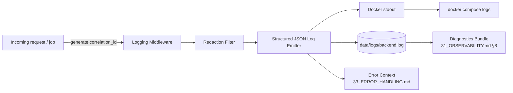

# 32 — Logging

**Product:** DuckDocs
**Document type:** Subsystem specification — structured logging & redaction
**Status:** Draft for team review
**Audience:** Backend engineering, frontend engineering, security, support
**Upstream:** [01_VISION.md](./01_VISION.md) · [31_OBSERVABILITY.md](./31_OBSERVABILITY.md)
**Downstream:** [33_ERROR_HANDLING.md](./33_ERROR_HANDLING.md) · [24_SECURITY.md](./24_SECURITY.md)

---

## 1. Purpose

This document specifies DuckDocs' **structured logging** standard: log format, levels, required fields, correlation ID propagation, and — most importantly — the **redaction rules** that keep secrets and document content out of logs at default log levels.

Logging is where privacy-first principles are most easily and invisibly violated: a well-intentioned `logger.debug(f"processing {document.text}")` can leak sensitive document content into a log file that a user later shares with support, or an API key can end up in a request log. This document exists to make that class of mistake structurally hard to make.

---

## 2. Scope

### In scope

- Log format (structured JSON) and required/optional fields
- Log levels and their intended use
- Redaction rules for secrets and document content
- Correlation ID generation and propagation for ingest/ask jobs and all other operations
- Log storage location, rotation, and retention
- Logging library/framework conventions for backend and frontend

### Out of scope

- Health/metrics endpoints and job-status UI → [31_OBSERVABILITY.md](./31_OBSERVABILITY.md)
- Error taxonomy and user-facing error messages → [33_ERROR_HANDLING.md](./33_ERROR_HANDLING.md)
- Secrets-at-rest storage mechanism → [24_SECURITY.md](./24_SECURITY.md)
- Diagnostics bundle composition (references this doc's redaction rules but is specified in [31_OBSERVABILITY.md §8](./31_OBSERVABILITY.md))

---

## 3. Goals

| Goal ID | Goal | Why it matters |
|---------|------|-----------------|
| LOG-G01 | All backend logs are structured (machine-parseable) by default | Enables correlation, filtering, and future tooling without log scraping regex |
| LOG-G02 | Secrets never appear in logs at any level, under any circumstance | Security baseline; RULE-05 adjacent (prevents secrets becoming a de facto leak channel) |
| LOG-G03 | Document content never appears in logs at default (INFO/WARNING/ERROR) levels | Privacy-first principle extended to operational data |
| LOG-G04 | Every ingest and ask/search/summarize/extract job carries one correlation ID from start to finish across all log lines it produces | OBS-G05; debuggability |
| LOG-G05 | Log retention and rotation are bounded and local, with no default export path off-device | RULE-05, storage hygiene |

---

## 4. Log Format

All backend logs are emitted as single-line structured JSON to stdout (captured by Docker) and mirrored to the local log volume (`data/logs/`, per [29_DOCKER_ARCHITECTURE.md §7](./29_DOCKER_ARCHITECTURE.md)).

### 4.1 Required Fields

| Field | Type | Description |
|-------|------|--------------|
| `timestamp` | ISO 8601 UTC | Event time |
| `level` | Enum | `DEBUG`, `INFO`, `WARNING`, `ERROR`, `CRITICAL` |
| `logger` | String | Module/component path (e.g., `app.ingestion.pipeline`) |
| `message` | String | Human-readable, redaction-safe message |
| `correlation_id` | UUID string | Threads the event to a specific operation (§6) |
| `service` | Enum | `backend`, `frontend` (frontend errors forwarded through the API are tagged accordingly) |

### 4.2 Optional/Contextual Fields

| Field | When present |
|-------|----------------|
| `document_id` | Operations scoped to a specific document (never `document_name` or content at INFO+, see §5.2) |
| `job_type` | `ingest`, `ocr`, `embed`, `ask`, `search`, `summarize`, `extract`, `export`, `provider_test` |
| `provider` | Provider identifier (`ollama`, `openai`, etc.) — never the API key |
| `duration_ms` | For completed operations |
| `error_code` | Typed error code from [33_ERROR_HANDLING.md §4](./33_ERROR_HANDLING.md), when applicable |
| `http_status` | For request-scoped logs |

### 4.3 Example Log Line

```json
{"timestamp":"2026-07-18T10:12:04.552Z","level":"INFO","logger":"app.ingestion.pipeline","message":"ingestion completed","correlation_id":"3f9a1c2e-...","document_id":"doc_8821","job_type":"ingest","duration_ms":842,"service":"backend"}
```

---

## 5. Log Levels

| Level | Intended use | Redaction posture |
|-------|----------------|----------------------|
| `DEBUG` | Verbose internal state for local development only; **disabled by default in Compose** | Still subject to full redaction rules (§6) — DEBUG is not an exemption, only a verbosity increase |
| `INFO` | Normal operational events (job started/completed, settings changed, provider switched) | Full redaction applies |
| `WARNING` | Recoverable anomalies (low OCR confidence, retry occurred, degraded provider reachability) | Full redaction applies |
| `ERROR` | Operation failed; user-visible impact likely | Full redaction applies; includes `error_code` |
| `CRITICAL` | Service-level failure (cannot start, dependency permanently unreachable) | Full redaction applies |

**Rule:** Redaction rules (§6) apply identically at every level, including `DEBUG`. Verbosity is never an excuse to relax redaction — this closes the most common real-world logging privacy leak, where debug logging is assumed "safe because it's off in prod" and then accidentally left on or shipped in a diagnostics bundle.

---

## 6. Redaction Rules

### 6.1 Secrets

| Rule | Enforcement |
|------|--------------|
| API keys, tokens, and credentials are never logged in any form, including partial/masked substrings beyond a fixed-length fingerprint | A shared `redact()` utility replaces any field matching known secret field names (`api_key`, `token`, `authorization`, etc.) with `"***REDACTED***"` before the log record is constructed, not after serialization |
| Request/response logging middleware strips `Authorization` and provider-key headers unconditionally | Enforced at the HTTP middleware layer, not per-endpoint, so no new endpoint can accidentally skip it |
| Config dumps (e.g., in diagnostics bundles) show provider/model names but never key values | Shared with [31_OBSERVABILITY.md §8](./31_OBSERVABILITY.md) |

### 6.2 Document Content

| Rule | Enforcement |
|------|--------------|
| Raw document text, chunk text, OCR output text, and generated answer text are never included in log messages at `INFO` and above | Log call sites pass structured fields (`document_id`, `chunk_id`, counts, lengths) instead of content; a lint rule / code review checklist flags `logger.*` calls that interpolate variables sourced from document/chunk/answer objects |
| At `DEBUG` (dev-only, opt-in), content may be truncated to a fixed short length (e.g., 80 chars) with a `[TRUNCATED]` suffix, purely for local development troubleshooting, and is still excluded from any diagnostics bundle export | DEBUG-level content logging is gated behind an explicit `LOG_DEBUG_CONTENT_PREVIEW=true` environment flag, off by default, and documented as a development-only footgun |
| Filenames are treated as **potentially sensitive** (may encode confidential subject matter) and are logged only as `document_id` by default; `document_name` appears in logs only when a separate `LOG_INCLUDE_FILENAMES` flag is enabled | Mirrors the opt-in filename inclusion pattern in the diagnostics bundle ([31_OBSERVABILITY.md §8](./31_OBSERVABILITY.md)) |

### 6.3 Provider Payloads

| Rule | Enforcement |
|------|--------------|
| Full prompts/completions sent to or received from providers are never logged verbatim | Only prompt length, token counts (if available), and latency are logged |
| Provider error bodies are logged with a size cap and pass through the same secret-redaction filter (some providers echo request headers in error bodies) | Redaction middleware applies uniformly to provider client responses before logging |

### 6.4 Redaction Test Contract

A shared test suite (`tests/contract/test_log_redaction.py` or equivalent) asserts, for representative log call sites across ingestion, providers, and settings:

- No configured secret pattern appears in emitted log output.
- No raw document/chunk/answer text appears in emitted log output at `INFO`+.
- Redaction survives serialization (i.e., is applied before JSON encoding, not as a post-hoc string scan that could miss nested structures).

This contract test is a **release gate**: a failing redaction test blocks release, consistent with the standing nature of RULE-05-adjacent guarantees.

---

## 7. Correlation IDs for Ingest/Ask Jobs

### 7.1 Generation

- A correlation ID (UUID v4) is generated at the point an operation is accepted: on `POST` to an ingest endpoint, or on `POST` to ask/search/summarize/extract endpoints.
- For multi-document ingest batches, a **batch correlation ID** is generated, and each per-document ingestion task gets a **child correlation ID** that references the batch ID (`parent_correlation_id` field), so both "show me this whole upload" and "show me this one document's processing" are answerable from logs.

### 7.2 Propagation

| Path | Mechanism |
|------|-----------|
| Frontend → Backend | Frontend generates a client-request ID; backend either adopts it as the correlation ID or maps it 1:1, and returns it in the `X-Correlation-Id` response header for display in the UI (per [31_OBSERVABILITY.md §7](./31_OBSERVABILITY.md)) |
| Backend internal (ingestion → OCR → embedding) | Correlation ID passed explicitly through function/task arguments and background job payloads — never relies on implicit thread-local/global state alone, to remain safe under async/concurrent execution |
| Backend → Provider clients | Correlation ID included in internal log context wrapping the provider call, though not sent to the external provider itself (it is a purely local debugging construct, not transmitted) |
| Background job queue | Correlation ID stored as a job field so retries and delayed execution retain lineage |

### 7.3 Example: Ask Job Log Sequence

```json
{"correlation_id":"a1b2...","job_type":"ask","level":"INFO","message":"ask request received","logger":"app.api.routes.intelligence"}
{"correlation_id":"a1b2...","job_type":"ask","level":"INFO","message":"retrieval completed","chunk_count":6,"duration_ms":120,"logger":"app.retrieval.ranker"}
{"correlation_id":"a1b2...","job_type":"ask","level":"INFO","message":"generation completed","provider":"ollama","duration_ms":1840,"logger":"app.generation.qa"}
{"correlation_id":"a1b2...","job_type":"ask","level":"INFO","message":"ask request completed","http_status":200,"duration_ms":1990,"logger":"app.api.routes.intelligence"}
```

---

## 8. Log Storage, Rotation, and Retention

| Aspect | Default behavior |
|--------|---------------------|
| Location | `data/logs/backend.log` (current), rotated to `backend.log.1`, `.2`, etc. |
| Rotation trigger | Size-based (e.g., 50 MB per file) and/or daily, whichever comes first |
| Retention | 14 days or 10 rotated files, whichever is smaller (configurable in Settings → Advanced, consistent with [31_OBSERVABILITY.md §6.3](./31_OBSERVABILITY.md) metrics retention pattern) |
| Frontend logs | Client-side errors are captured locally (browser console) and optionally forwarded to the backend's log stream via a `POST /logs/client` endpoint **only** for errors, tagged `service: "frontend"` — never third-party crash reporting |
| Docker stdout capture | Docker's own log driver also captures stdout; `docker compose logs` remains available as an alternate local view without requiring the file volume |

No log rotation, retention, or storage mechanism transmits data off the host. Log shipping to any external destination is out of scope by design (see [29_DOCKER_ARCHITECTURE.md §10](./29_DOCKER_ARCHITECTURE.md) no-telemetry-sidecar rule).

---

## 9. Architecture Decisions

| ID | Decision | Rationale |
|----|----------|-----------|
| LOG-AD01 | Structured JSON logging to stdout + local file, no exceptions | Enables correlation and future local tooling; avoids unstructured regex-dependent log parsing |
| LOG-AD02 | Redaction is enforced at the logging utility/middleware layer, not left to call-site discipline alone | Call-site discipline fails under time pressure; centralized enforcement is the reliable control |
| LOG-AD03 | Redaction rules apply identically across all log levels, including DEBUG | Prevents "DEBUG is safe because it's off" false security |
| LOG-AD04 | Correlation IDs are explicit function/payload parameters, not implicit context-local magic | Remains correct under async/concurrent execution and background job retries |
| LOG-AD05 | Redaction correctness is enforced by a release-gating contract test suite | Makes the privacy guarantee verifiable, not just documented |
| LOG-AD06 | Frontend error forwarding is backend-mediated and log-only, never a third-party SDK | Keeps the "no analytics SDK" boundary intact even for client-side error visibility |

### Alternatives rejected

| Alternative | Why rejected |
|-------------|---------------|
| Plain-text/unstructured log lines | Harder to correlate, filter, or safely redact programmatically |
| Post-hoc log scrubbing (redact when reading, not when writing) | Leaves an unredacted copy on disk in the interim; violates "secrets never appear in logs" as a strict guarantee |
| Third-party frontend error tracking SDK (e.g., Sentry) even in "self-hosted" mode | Adds a dependency surface and default-behavior risk inconsistent with the custom local-only observability approach in [31_OBSERVABILITY.md](./31_OBSERVABILITY.md) |
| Unlimited log retention by default | Unbounded local disk growth; no user benefit over a bounded, configurable window |
| DEBUG-level content logging enabled by default in dev builds shipped to users | Users running a "dev-flavored" build locally could inadvertently expose content in shared logs; content preview logging requires an explicit opt-in flag regardless of build type |

---

## 10. Tradeoffs

| Tradeoff | We choose | We accept |
|----------|-----------|-----------|
| Debuggability (seeing real content in logs) vs. privacy | Redact content by default everywhere, opt-in truncated preview only in local dev | Harder to debug certain content-shape bugs without deliberately enabling preview mode locally |
| Centralized redaction enforcement vs. developer flexibility | Middleware/utility-enforced | Slightly more rigid logging API; developers cannot casually `print()`/log arbitrary objects |
| Structured JSON vs. human-readability in a terminal | JSON lines (pretty-printable via tooling) | Raw `docker compose logs` output is less immediately readable without a formatter; mitigated by recommending `jq` or an in-app log viewer |
| Correlation ID explicitness vs. convenience of implicit context vars | Explicit propagation | More boilerplate in function signatures/job payloads |

---

## 11. Data Flow



**Invariant:** The Redaction Filter sits strictly between the raw event and the Emitter for every code path — there is no log emission path that bypasses it, including error/exception logging paths.

---

## 12. Interfaces

| Interface | Description |
|-----------|--------------|
| `app.core.logging.get_logger(name)` | Standard logger factory used across backend modules; returns a logger pre-wired to the redaction filter |
| `app.core.logging.bind_correlation_id(cid)` | Explicit binding helper for passing correlation context into a log call or child task |
| `POST /logs/client` | Frontend → backend error forwarding endpoint (errors only, redacted, `service: "frontend"`) |
| `data/logs/backend.log[.N]` | On-disk rotated log files consumable by any local tool (e.g., `jq`, a future in-app log viewer) |
| Redaction contract tests | `tests/contract/test_log_redaction.py` — the enforcement interface for LOG-G02/LOG-G03 |

---

## 13. Constraints

| ID | Constraint |
|----|------------|
| LOG-C01 | No log emission path may bypass the redaction filter |
| LOG-C02 | Secrets must be redacted regardless of log level |
| LOG-C03 | Document/chunk/answer content must not appear in logs at INFO level or above |
| LOG-C04 | Every operation-scoped log line must include a `correlation_id` |
| LOG-C05 | Log storage must remain local and bounded by a configurable retention policy |
| LOG-C06 | Frontend error forwarding must not use a third-party analytics/crash-reporting SDK |

---

## 14. Risks

| Risk | Impact | Mitigation |
|------|--------|------------|
| A new code path logs raw content via string interpolation, bypassing structured fields | Privacy leak into local logs (still not transmitted, but risky if logs are shared) | Code review checklist + redaction contract tests targeting common call sites; lint rule where feasible |
| Redaction pattern list misses a new secret field name convention (e.g., a new provider's key field) | Secret leak | Redaction patterns reviewed whenever a new provider is added ([27_SETTINGS.md §5.5](./27_SETTINGS.md) capability matrix changes trigger a redaction review) |
| Log volume growth impacts disk on long-running installs | Disk pressure | Rotation + retention policy (§8); diagnostics bundle excludes full log history by default |
| Developer enables `LOG_DEBUG_CONTENT_PREVIEW` and forgets to disable it | Local privacy risk if logs are later shared | Flag is loudly surfaced in Settings → Advanced with a persistent warning banner while active, mirroring the network-active indicator pattern in [27_SETTINGS.md §10.1](./27_SETTINGS.md) |
| Correlation ID lost across an async boundary (e.g., a fire-and-forget background task) | Debuggability gap for that operation | Explicit propagation discipline (LOG-AD04) plus contract tests on job queue payload shape |

---

## 15. Future Extensibility

- A local, in-app log viewer (searchable by `correlation_id`, `job_type`, `level`) can be built directly on the structured JSON format without changing the logging contract.
- Structured logs are a natural foundation for a future local-only trace visualization in the diagnostics panel (see [31_OBSERVABILITY.md §15](./31_OBSERVABILITY.md)).
- Additional redaction patterns can be added as new providers/secret types are introduced, without changing the enforcement architecture (still centralized in the redaction filter).
- Log format versioning (`log_schema_version` field) can be introduced if the structured shape needs to evolve, keeping historical logs parseable.

---

## 16. Open Questions

| ID | Question | Owner | Needed by |
|----|----------|-------|-----------|
| LOG-OQ01 | Exact rotation size/count defaults — confirm 50 MB / 10 files, or tune based on real usage? | Backend Eng | Before P0 release |
| LOG-OQ02 | Should frontend error forwarding be on by default or require explicit opt-in? | Product + Privacy | Before P0 release |
| LOG-OQ03 | Do we need a `log_schema_version` field from day one, or add it only when the format first changes? | Backend Eng | Before logging module freeze |
| LOG-OQ04 | Should the redaction contract test suite run per-PR in CI, or only pre-release? | Platform + QA | Before CI pipeline design |

---

## 17. Acceptance Criteria

This document is accepted when:

- [ ] Structured log format and required fields are approved by backend engineering
- [ ] Redaction rules for secrets and document content are approved by security/privacy stakeholders
- [ ] Correlation ID generation/propagation model is validated against at least one multi-step operation (ingest batch, ask request) end-to-end
- [ ] Redaction contract test suite is defined as a release gate
- [ ] Log storage/rotation/retention defaults are approved
- [ ] Open questions have owners and target dates

---

## 18. Cross-References

| Topic | Document |
|-------|----------|
| Health/metrics, diagnostics bundle | [31_OBSERVABILITY.md](./31_OBSERVABILITY.md) |
| Error taxonomy and correlation in error responses | [33_ERROR_HANDLING.md](./33_ERROR_HANDLING.md) |
| Secrets-at-rest and auth | [24_SECURITY.md](./24_SECURITY.md) |
| Privacy policy | [25_PRIVACY.md](./25_PRIVACY.md) |
| Settings privacy indicators | [27_SETTINGS.md](./27_SETTINGS.md) |
| Docker volumes for log storage | [29_DOCKER_ARCHITECTURE.md](./29_DOCKER_ARCHITECTURE.md) |

---

## Document Control

| Field | Value |
|-------|-------|
| Version | 0.1.0 |
| Last updated | 2026-07-18 |
| Authors | DuckDocs Architecture Team |
| Review state | Pending team review |
| Previous | [31_OBSERVABILITY.md](./31_OBSERVABILITY.md) |
| Next | [33_ERROR_HANDLING.md](./33_ERROR_HANDLING.md) |
