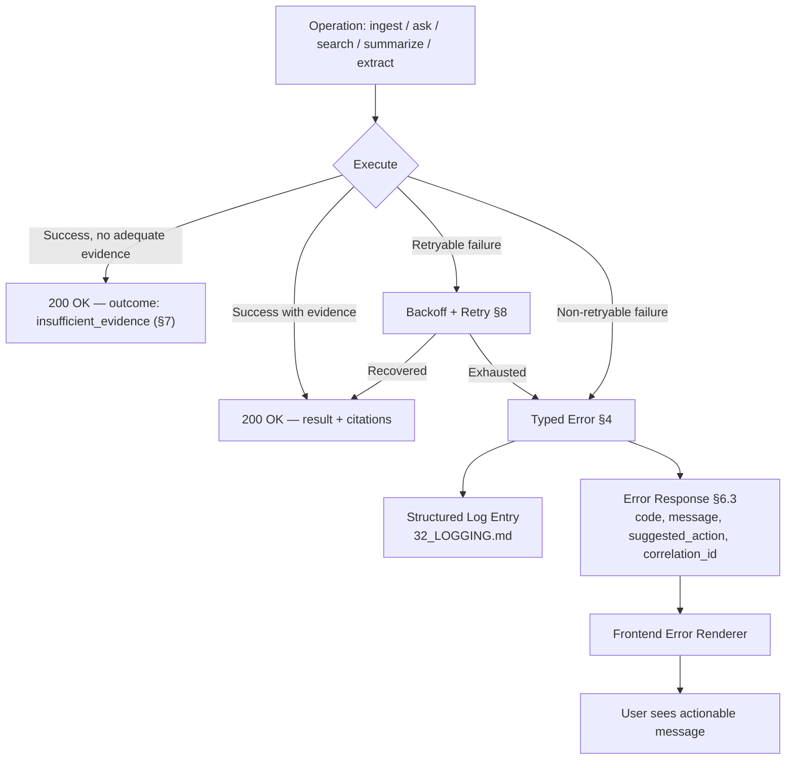

# 33 — Error Handling

**Product:** DuckDocs
**Document type:** Subsystem specification — typed errors & user-facing failure UX
**Status:** Draft for team review
**Audience:** Backend engineering, frontend engineering, product, QA
**Upstream:** [01_VISION.md](./01_VISION.md) · [02_PRODUCT_REQUIREMENTS.md](./02_PRODUCT_REQUIREMENTS.md) · [32_LOGGING.md](./32_LOGGING.md)
**Downstream:** [35_TESTING_STRATEGY.md](./35_TESTING_STRATEGY.md) · [40_FUTURE_ROADMAP.md](./40_FUTURE_ROADMAP.md)

---

## 1. Purpose

This document specifies DuckDocs' **error handling architecture**: a typed error hierarchy shared across ingestion, providers, OCR, and retrieval; how errors propagate from backend to frontend; and how they become **actionable** user-facing messages rather than generic failures.

Per PR-Q02, "errors are actionable (ingestion failures, provider down, OCR low confidence, empty retrieval)" is a **P0 product quality requirement**, not a nice-to-have. This document is the shared contract that makes that requirement implementable consistently across subsystems rather than reinvented per feature.

---

## 2. Scope

### In scope

- Typed error hierarchy (backend exception classes, error codes, HTTP mapping)
- Failure mode catalog for ingestion, providers, OCR, and retrieval
- Error propagation from backend to frontend (response shape, correlation ID linkage)
- User-facing message design principles and mapping from error code to message
- Retry, backoff, and graceful-degradation policy
- Insufficient-evidence handling (RULE-02) as a first-class non-error outcome

### Out of scope

- Structured logging format for error events → [32_LOGGING.md](./32_LOGGING.md)
- Health/readiness semantics → [31_OBSERVABILITY.md](./31_OBSERVABILITY.md)
- Test case matrices for error scenarios → [35_TESTING_STRATEGY.md](./35_TESTING_STRATEGY.md)
- Detailed OCR/parsing fidelity tiers → [21_FILE_PROCESSING.md](./21_FILE_PROCESSING.md)

---

## 3. Goals

| Goal ID | Goal | Why it matters |
|---------|------|-----------------|
| ERR-G01 | Every failure surfaced to a user has an actionable message: what happened, why (in plain language), and what to do next | PR-Q02 |
| ERR-G02 | Errors are typed consistently across ingestion, providers, OCR, and retrieval so the frontend can render consistent UX regardless of subsystem | Frontend/backend contract stability |
| ERR-G03 | Failed operations never silently succeed or silently disappear | PR-L10, RULE-02 |
| ERR-G04 | Insufficient evidence is modeled as an explicit, first-class outcome — not an error and not a fabricated answer | RULE-01, RULE-02, PR-I06 |
| ERR-G05 | Every error response carries a correlation ID so a user or support session can trace it through logs/metrics | LOG-G04, OBS-G05 |
| ERR-G06 | Transient failures are retried with sensible backoff before being surfaced as user-facing errors | Reduces false-alarm errors from momentary provider hiccups |

---

## 4. Typed Error Hierarchy

### 4.1 Base Structure

```text
DuckDocsError (base)
├── IngestionError
│   ├── UnsupportedFormatError
│   ├── FileCorruptError
│   ├── FileTooLargeError
│   └── ParsingTimeoutError
├── OCRError
│   ├── OCREngineUnavailableError
│   ├── LowConfidenceOCRWarning*   (* modeled as a warning, not a hard failure — see §5.3)
│   └── LanguagePackMissingError
├── ProviderError
│   ├── ProviderUnreachableError
│   ├── ProviderAuthError
│   ├── ProviderRateLimitError
│   ├── ProviderTimeoutError
│   └── ProviderResponseInvalidError
├── RetrievalError
│   ├── VectorStoreUnavailableError
│   ├── EmbeddingDimensionMismatchError
│   └── NoResultsFound*   (* modeled as insufficient-evidence outcome — see §7)
├── ValidationError
│   └── SettingsValidationError
└── SystemError
    ├── DatabaseUnavailableError
    └── ConfigurationInvalidError
```

Every concrete error class carries:

| Attribute | Description |
|-----------|--------------|
| `error_code` | Stable machine-readable string (e.g., `PROVIDER_UNREACHABLE`) — see §4.2 |
| `http_status` | Mapped HTTP status for API responses |
| `user_message` | Actionable, plain-language template (§6) |
| `retryable` | Boolean — whether the operation may be automatically retried (§8) |
| `correlation_id` | Attached at raise-time or by the API error handler |
| `details` | Structured, redaction-safe context (e.g., `{"provider": "openai", "model": "gpt-4o"}`) — never raw document content or secrets, per [32_LOGGING.md §6](./32_LOGGING.md) |

### 4.2 Error Code Catalog (excerpt)

| Error code | Class | HTTP status | Retryable |
|------------|-------|--------------|-----------|
| `UNSUPPORTED_FORMAT` | `UnsupportedFormatError` | 422 | No |
| `FILE_CORRUPT` | `FileCorruptError` | 422 | No |
| `FILE_TOO_LARGE` | `FileTooLargeError` | 413 | No |
| `PARSING_TIMEOUT` | `ParsingTimeoutError` | 504 | Yes (bounded) |
| `OCR_ENGINE_UNAVAILABLE` | `OCREngineUnavailableError` | 503 | Yes |
| `OCR_LANGUAGE_PACK_MISSING` | `LanguagePackMissingError` | 422 | No |
| `PROVIDER_UNREACHABLE` | `ProviderUnreachableError` | 503 | Yes |
| `PROVIDER_AUTH_FAILED` | `ProviderAuthError` | 401 | No |
| `PROVIDER_RATE_LIMITED` | `ProviderRateLimitError` | 429 | Yes (with backoff) |
| `PROVIDER_TIMEOUT` | `ProviderTimeoutError` | 504 | Yes (bounded) |
| `VECTOR_STORE_UNAVAILABLE` | `VectorStoreUnavailableError` | 503 | Yes |
| `EMBEDDING_DIMENSION_MISMATCH` | `EmbeddingDimensionMismatchError` | 409 | No (requires re-index) |
| `SETTINGS_VALIDATION_FAILED` | `SettingsValidationError` | 400 | No |
| `DATABASE_UNAVAILABLE` | `DatabaseUnavailableError` | 503 | Yes |
| `CONFIG_INVALID` | `ConfigurationInvalidError` | 500 | No |

This catalog is the shared contract between backend and frontend; the frontend error-rendering layer (`lib/api/` per [28_PROJECT_STRUCTURE.md §5](./28_PROJECT_STRUCTURE.md)) switches on `error_code`, never on `http_status` alone or on parsing `user_message` text.

---

## 5. Failure Mode Catalog

### 5.1 Ingestion Failures

| Failure | Cause | Product behavior |
|---------|-------|---------------------|
| Unsupported format | File extension/content not in supported list (§8 of [02_PRODUCT_REQUIREMENTS.md](./02_PRODUCT_REQUIREMENTS.md)) | Upload rejected before job creation; message names the file and supported list |
| Corrupt/unreadable file | Parser cannot open the file | Ingestion job marked `failed` with reason; original file retained; no partial document record left in a "ready" state (PR-L10) |
| File too large | Exceeds configured size limit | Rejected at upload with the current limit shown and a path to Settings if the user wants to raise it (where permitted) |
| Parsing timeout | Pathological file (e.g., huge spreadsheet) exceeds processing time budget | Job marked `failed`; user can retry with a note that very large files may need more time/resources |
| Partial batch failure | Multi-file upload where some succeed and some fail | Each file's status is independent and visible; a failed file never blocks or hides the success of others (PR-L10) |

### 5.2 Provider Failures

| Failure | Cause | Product behavior |
|---------|-------|---------------------|
| Unreachable | Network/DNS failure, Ollama not running, wrong base URL | Actionable message naming the provider and suggesting the specific fix (start Ollama, check base URL) — see [27_SETTINGS.md §11.3](./27_SETTINGS.md) for the Settings-side variant |
| Auth failure | Invalid/expired API key | Message directs to Settings → Providers to update the key; never retried automatically (retrying won't fix bad auth) |
| Rate limited | Cloud provider throttling | Retried with backoff (§8) up to a bound, then surfaced with a "provider is rate-limiting requests, try again shortly" message |
| Timeout | Slow model/provider response beyond configured timeout | Message shows the current timeout and offers a shortcut to increase it in Settings |
| Invalid response | Malformed/unexpected response shape | Logged with full (redacted) response context for debugging; user sees a generic "the AI provider returned an unexpected response" message with a retry option |

### 5.3 OCR Failures

| Failure | Cause | Product behavior |
|---------|-------|---------------------|
| Engine unavailable | OCR engine process/binary not reachable | Ingestion job for image/scanned content fails with a clear message; text-layer-only formats are unaffected |
| Missing language pack | Document language not installed | Message names the missing language and links to Settings → OCR & Processing to install it |
| Low OCR confidence | Engine succeeds but confidence is below threshold | **Not a failure** — per RULE-10, this is surfaced as a visible confidence indicator on the affected evidence/region, not hidden and not blocking ingestion completion |

### 5.4 Retrieval Failures

| Failure | Cause | Product behavior |
|---------|-------|---------------------|
| Vector store unavailable | ChromaDB unreachable | Search/ask requests fail fast with a clear "search index unavailable" message rather than hanging; health status reflected in [31_OBSERVABILITY.md](./31_OBSERVABILITY.md) `/ready` |
| Embedding dimension mismatch | Embedding provider/model changed without re-index | Blocked with a message directing the user to re-index, mirroring the warning already given at switch-time in [27_SETTINGS.md §5.4](./27_SETTINGS.md) |
| No relevant results | Query has no matching evidence above relevance threshold | **Not an error** — modeled as an insufficient-evidence outcome (§7), never fabricated into an answer |

---

## 6. User-Facing Message Design

### 6.1 Principles

1. **Name the subsystem and the specific cause** — never a bare "Something went wrong."
2. **State the impact** — what did/did not happen (e.g., "This document was not added to your library").
3. **Offer the next action** — a concrete step (retry, open Settings, install a language pack) with a UI shortcut where possible.
4. **Never expose secrets or raw internals** — no stack traces, no API keys, no raw provider error bodies in the primary message (available in an expandable "technical details" section, redacted, with the correlation ID for support reference).
5. **Distinguish user-fixable from system-level failures** — a bad API key is user-fixable now; a database outage is not, and the message should not suggest fixes the user cannot perform.

### 6.2 Message Template

```text
{Subsystem} {failed_action}: {plain_language_cause}.
{next_action_suggestion}
[Technical details ▾] correlation_id: {id}
```

**Example (Provider auth failure):**

> Chat provider request failed: the API key for OpenAI was rejected.
> Update your API key in Settings → Providers → Chat.
> [Technical details ▾] correlation_id: a1b2c3d4-...

**Example (Insufficient evidence — not an error):**

> I couldn't find enough evidence in your library to answer this confidently.
> Try rephrasing your question, adding relevant documents, or broadening the search scope.

### 6.3 Error Response Shape (API Contract)

```json
{
  "error": {
    "code": "PROVIDER_AUTH_FAILED",
    "message": "The API key for OpenAI was rejected.",
    "suggested_action": "Update your API key in Settings → Providers → Chat.",
    "retryable": false,
    "correlation_id": "a1b2c3d4-...",
    "details": { "provider": "openai" }
  }
}
```

The frontend renders `message` + `suggested_action` directly and uses `code` to decide whether to show a contextual shortcut (e.g., a "Go to Settings" button keyed off `PROVIDER_*` codes).

---

## 7. Insufficient Evidence as a First-Class Outcome

Per RULE-01 and RULE-02, "no relevant evidence found" is **not** routed through the error hierarchy at all — it is a distinct, successful response shape:

```json
{
  "outcome": "insufficient_evidence",
  "message": "I couldn't find enough evidence in your library to answer this confidently.",
  "query": "...",
  "considered_chunk_count": 0,
  "correlation_id": "..."
}
```

This keeps the HTTP-level contract honest: a `200 OK` with `outcome: insufficient_evidence` is a **correct, successful** execution of RAG-first behavior (PR-I08), not a failure. Conflating it with `RetrievalError.NoResultsFound` at the API level would incorrectly imply something broke. See [08_SYSTEM_ARCHITECTURE.md](./08_SYSTEM_ARCHITECTURE.md) for how this fits the broader generation pipeline shape from [01_VISION.md §7.5](./01_VISION.md#75-grounded-ai-behavior).

---

## 8. Retry & Backoff Policy

| Failure class | Retry strategy |
|-----------------|-------------------|
| `ProviderUnreachableError`, `ProviderTimeoutError` | Up to 2 automatic retries with exponential backoff (e.g., 1s, 3s) before surfacing to the user |
| `ProviderRateLimitError` | Backoff honoring provider-supplied `Retry-After` when present; otherwise exponential backoff up to a bounded ceiling (e.g., 30s), then surfaced |
| `VectorStoreUnavailableError`, `DatabaseUnavailableError` | 1–2 quick retries (service may be mid-restart); surfaced promptly otherwise since these are foundational dependencies |
| `ParsingTimeoutError` | No automatic retry (large files rarely succeed on immediate re-attempt); user-initiated retry only, optionally with a "process in background, notify when ready" pattern |
| Non-retryable classes (`ProviderAuthError`, `UnsupportedFormatError`, `EmbeddingDimensionMismatchError`, etc.) | Never automatically retried — retrying cannot fix a configuration or format problem and would waste time/resources |

All retries are logged with the same `correlation_id` and an incrementing `attempt` field (per [32_LOGGING.md §7](./32_LOGGING.md)), so a support session can distinguish "failed once, retried, succeeded" from "failed repeatedly."

---

## 9. Architecture Decisions

| ID | Decision | Rationale |
|----|----------|-----------|
| ERR-AD01 | Single typed error base class (`DuckDocsError`) with subsystem-specific subclasses | Consistent handling/serialization across ingestion, providers, OCR, retrieval |
| ERR-AD02 | Errors carry a stable `error_code` string as the frontend/backend contract, not `http_status` or message text | Decouples UX logic from transport-layer status codes and from message copy changes |
| ERR-AD03 | Insufficient evidence is modeled as a successful outcome type, never as an error | RULE-01/RULE-02 — grounding failures are expected, correct product behavior, not system faults |
| ERR-AD04 | Low OCR confidence is a warning/indicator, not an ingestion failure | RULE-10 — visibility over blocking; ingestion should complete with honest confidence labeling |
| ERR-AD05 | Retry policy is defined per error class centrally, not ad hoc per call site | Prevents inconsistent retry behavior (e.g., one endpoint retrying auth failures wastefully) |
| ERR-AD06 | Every error response includes a correlation ID and a redaction-safe `details` object | Ties directly into [32_LOGGING.md](./32_LOGGING.md) and [31_OBSERVABILITY.md](./31_OBSERVABILITY.md) for support workflows |

### Alternatives rejected

| Alternative | Why rejected |
|-------------|---------------|
| Generic `Exception` handling with per-endpoint try/except and ad hoc messages | Produces inconsistent UX and duplicated logic; violates ERR-G02 |
| HTTP status code as the sole error discriminator on the frontend | Multiple distinct failures can share a status (e.g., 503 for both provider-unreachable and vector-store-unavailable); insufficient granularity for actionable UX |
| Treating "no results found" as a `404`-style error | Conflates a correct grounding outcome with a system fault; violates RULE-01/RULE-02 spirit |
| Surfacing raw provider error bodies directly to users | Often contains internal/unredacted details and unclear language for non-technical users |
| Uniform retry-everything policy | Wastes time/resources retrying non-retryable failures (e.g., bad auth) and delays actionable feedback to the user |

---

## 10. Tradeoffs

| Tradeoff | We choose | We accept |
|----------|-----------|-----------|
| Rich per-subsystem error types vs. a single generic error | Typed hierarchy with subsystem subclasses | More classes to define/maintain, but far more precise UX and retry behavior |
| Automatic retries (resilience) vs. speed of surfacing real problems | Bounded, class-specific retries | Slightly longer time-to-error for genuinely broken configurations, bounded to a few seconds |
| Detailed technical details always visible vs. clean primary message | Primary message is clean; technical details collapsed but present | Power users must expand a disclosure to get full context; acceptable given the primary audience is not always technical |
| Modeling insufficient evidence as success vs. error | Success outcome type | Requires frontend to handle a third response shape (success / insufficient-evidence / error) instead of two |

---

## 11. Data Flow



---

## 12. Interfaces

| Interface | Description |
|-----------|--------------|
| `app.core.errors.DuckDocsError` and subclasses | Backend exception hierarchy (§4.1) |
| FastAPI exception handler (`app.core.errors.install_handlers(app)`) | Converts any `DuckDocsError` (and unhandled exceptions, mapped to `SystemError`) into the standard error response shape (§6.3) |
| `frontend/lib/api/errors.ts` | Typed client-side error model keyed on `error_code`, drives contextual UI actions |
| `POST /logs/client` | Frontend can forward client-side errors (e.g., a rendering failure) using the same correlation ID scheme |
| Insufficient-evidence response schema | Shared contract between `generation/qa.py`, `generation/summarize.py`, `generation/extract.py` and the frontend Intelligence UI |

---

## 13. Constraints

| ID | Constraint |
|----|------------|
| ERR-C01 | Every user-facing error must map to a stable `error_code` documented in this catalog |
| ERR-C02 | No error response may include secrets or raw document content, even in `details` |
| ERR-C03 | Insufficient-evidence outcomes must never be represented as HTTP error statuses |
| ERR-C04 | Low OCR confidence must never block ingestion completion; it must be surfaced as an indicator |
| ERR-C05 | Every error response must include a `correlation_id` traceable in logs |
| ERR-C06 | Retry behavior must be defined per error class, not left to per-call-site discretion |

---

## 14. Risks

| Risk | Impact | Mitigation |
|------|--------|------------|
| New failure modes introduced without a typed error class | Inconsistent UX, generic "unexpected error" messages | Code review checklist requires new failure paths to raise a `DuckDocsError` subclass or extend the catalog |
| Overly aggressive retries mask a genuinely broken provider/config | Delayed user awareness of a real problem | Bounded retry counts/backoff ceilings (§8); retry attempts visible in logs and, for repeated failures, in job metrics |
| Technical details panel accidentally exposes unredacted provider error bodies | Privacy/security leak | Technical details pass through the same redaction filter as logs ([32_LOGGING.md §6](./32_LOGGING.md)) before rendering |
| Frontend drifts from backend error catalog (new codes added without frontend handling) | Falls back to a generic message, losing actionability | Shared, versioned error code enum generated from backend catalog into the frontend typed client (mirrors OpenAPI generation approach in [28_PROJECT_STRUCTURE.md §5](./28_PROJECT_STRUCTURE.md)) |
| Users misinterpret insufficient-evidence responses as a bug | Support confusion | UI copy explicitly frames it as expected, honest behavior consistent with RULE-01/RULE-02, not a malfunction |

---

## 15. Future Extensibility

- New subsystems (e.g., a future comparison or citation-graph engine) extend the same `DuckDocsError` hierarchy with their own subclasses without redesigning the response contract.
- The error code catalog can grow additively; frontend handling for unrecognized codes gracefully falls back to a generic-but-still-correlation-ID'd message rather than crashing.
- Retry policy parameters (backoff timings, bounds) can become user-configurable in Settings → Advanced without changing the architecture.
- A future "error trends" view in the diagnostics panel ([31_OBSERVABILITY.md §6.2](./31_OBSERVABILITY.md)) can aggregate by `error_code` with no additional data modeling, since the code is already the stable discriminator.

---

## 16. Open Questions

| ID | Question | Owner | Needed by |
|----|----------|-------|-----------|
| ERR-OQ01 | Should `FileTooLargeError` limits be globally fixed or user-configurable per install? | Product + Platform | Before NFR freeze |
| ERR-OQ02 | Exact retry bounds (counts, backoff timings) per error class — finalize defaults? | Backend Eng | Before provider architecture freeze |
| ERR-OQ03 | Should insufficient-evidence responses include partial low-relevance chunks for user inspection, or remain empty? | Product + AI | Before Intelligence UI freeze |
| ERR-OQ04 | Do we need localized (i18n) error message templates at P0, or English-only initially? | Product + Design | Before P0 scope freeze |

---

## 17. Acceptance Criteria

This document is accepted when:

- [ ] Typed error hierarchy and error code catalog are approved by backend engineering
- [ ] Failure mode catalog (§5) is validated against ingestion, provider, OCR, and retrieval subsystem owners
- [ ] Error response shape (§6.3) is adopted as the frontend/backend API contract
- [ ] Insufficient-evidence modeling as a non-error outcome is confirmed against RULE-01/RULE-02
- [ ] Retry/backoff policy per error class is approved
- [ ] Open questions have owners and target dates

---

## 18. Cross-References

| Topic | Document |
|-------|----------|
| Structured logging, correlation IDs | [32_LOGGING.md](./32_LOGGING.md) |
| Health/observability | [31_OBSERVABILITY.md](./31_OBSERVABILITY.md) |
| System/AI generation pipeline (grounding, refusal behavior) | [08_SYSTEM_ARCHITECTURE.md](./08_SYSTEM_ARCHITECTURE.md) |
| Provider architecture | [12_PROVIDER_ARCHITECTURE.md](./12_PROVIDER_ARCHITECTURE.md) |
| File processing / OCR fidelity | [21_FILE_PROCESSING.md](./21_FILE_PROCESSING.md) |
| Testing strategy | [35_TESTING_STRATEGY.md](./35_TESTING_STRATEGY.md) |
| Settings connection test error states | [27_SETTINGS.md](./27_SETTINGS.md) |

---

## Document Control

| Field | Value |
|-------|-------|
| Version | 0.1.0 |
| Last updated | 2026-07-18 |
| Authors | DuckDocs Architecture Team |
| Review state | Pending team review |
| Previous | [32_LOGGING.md](./32_LOGGING.md) |
| Next | [35_TESTING_STRATEGY.md](./35_TESTING_STRATEGY.md) |
