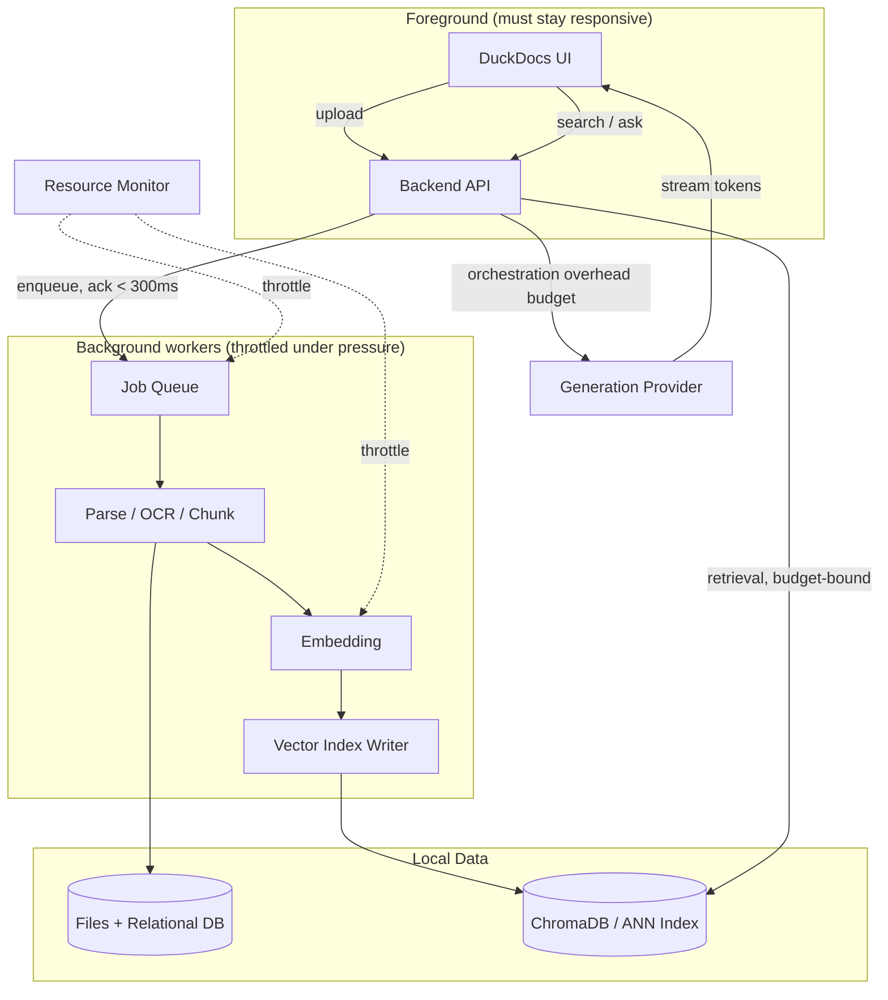

# 34 — Performance

**Product:** DuckDocs
**Document type:** Non-functional engineering specification — performance
**Status:** Draft for team review
**Audience:** Engineering, platform, QA, product
**Upstream:** [01_VISION.md](./01_VISION.md) · [02_PRODUCT_REQUIREMENTS.md](./02_PRODUCT_REQUIREMENTS.md) · [04_NON_FUNCTIONAL_REQUIREMENTS.md](./04_NON_FUNCTIONAL_REQUIREMENTS.md)
**Downstream:** [35_TESTING_STRATEGY.md](./35_TESTING_STRATEGY.md) · [39_RISK_ANALYSIS.md](./39_RISK_ANALYSIS.md)

---

## 1. Purpose

DuckDocs runs, by default, entirely on a user's own machine — a laptop, a small home server, or a modest workstation, not an elastic cloud fleet. Performance is therefore not a scaling problem to be solved with more machines; it is a **hardware-empathy problem**: the product must feel responsive on hardware the target user actually owns, and it must degrade honestly rather than silently or catastrophically when it doesn't.

This document defines the performance budgets, architectural mechanisms, and degradation behavior that make DuckDocs usable on local hardware — from ingest throughput to search/Q&A latency to UI responsiveness — and the engineering practices that keep those budgets true over time.

It is normative: features that violate documented budgets without an approved exception are performance defects, tracked the same way correctness defects are.

---

## 2. Scope

### In scope

- Latency and throughput budgets for ingestion, indexing, search, and Q&A
- Chunking and embedding performance strategy
- Indexing strategy (initial, incremental, background)
- UI responsiveness targets and perceived-performance techniques
- Hardware tiers and graceful degradation behavior
- Resource governance (CPU, memory, disk, GPU-optional)
- Performance-related architecture decisions and tradeoffs
- Benchmarking and regression-detection approach (linked to Testing Strategy)

### Out of scope

- Functional correctness of retrieval/grounding → [03_FUNCTIONAL_REQUIREMENTS.md](./03_FUNCTIONAL_REQUIREMENTS.md)
- Detailed vector index internals → [14_VECTOR_DATABASE.md](./14_VECTOR_DATABASE.md)
- Deployment topology and container sizing → [29_DOCKER_ARCHITECTURE.md](./29_DOCKER_ARCHITECTURE.md), [30_DEPLOYMENT.md](./30_DEPLOYMENT.md)
- Security/privacy properties of network calls → [24_SECURITY.md](./24_SECURITY.md), [25_PRIVACY.md](./25_PRIVACY.md)
- Test case matrices → [35_TESTING_STRATEGY.md](./35_TESTING_STRATEGY.md)

---

## 3. Goals

| Goal ID | Goal | Why it matters |
|---------|------|-----------------|
| PERF-G01 | Define concrete, testable latency/throughput budgets for every user-facing operation | Without numbers, "fast enough" is unfalsifiable |
| PERF-G02 | Make performance degrade **gracefully and legibly** on small hardware | Local-first means real users on modest machines, not just dev laptops |
| PERF-G03 | Keep the UI responsive even while heavy background work (ingest, OCR, indexing) runs | Perceived performance matters as much as raw throughput |
| PERF-G04 | Make indexing incremental, not "rebuild the world" | Large libraries must remain usable as they grow |
| PERF-G05 | Make performance budgets provider-aware | Local model latency profile differs fundamentally from cloud provider latency |
| PERF-G06 | Prevent performance regressions from shipping silently | Budgets must be enforced by tooling, not memory |

---

## 4. Performance Budgets

Budgets are expressed as targets on a **reference machine** and a **minimum-supported machine**, because "fast" on a 32GB M-series laptop and "fast" on a 4-core/8GB budget PC are different promises.

### 4.1 Reference hardware tiers

| Tier | Definition | Representative hardware |
|------|------------|--------------------------|
| T-MIN | Minimum supported | 4 CPU cores, 8 GB RAM, SATA SSD, no GPU |
| T-REF | Reference (budgets below assume this tier unless noted) | 8 CPU cores, 16 GB RAM, NVMe SSD, no GPU |
| T-HIGH | High-end local | 12+ CPU cores, 32 GB+ RAM, NVMe SSD, consumer GPU (optional) |

Budgets are **soft targets on T-MIN** (must remain usable, not necessarily snappy) and **hard targets on T-REF** (must be met for release sign-off).

### 4.2 Ingestion budgets

| ID | Operation | T-REF budget | T-MIN budget | Notes |
|----|-----------|--------------|--------------|-------|
| PERF-B01 | Upload acknowledgment (UI feedback that upload was received) | < 300 ms | < 500 ms | Independent of file size; queuing, not processing |
| PERF-B02 | Text-layer PDF/DOCX/TXT/MD ingest (per MB of extractable text) | < 2 s / MB | < 5 s / MB | Parse + chunk + embed, excludes queue wait |
| PERF-B03 | OCR ingest (scanned PDF / image, per page) | < 4 s / page | < 10 s / page | CPU OCR baseline; GPU acceleration is an optimization, not a requirement |
| PERF-B04 | Spreadsheet/structured data ingest (per 10k cells) | < 3 s | < 8 s | Structural chunking, not per-cell embedding |
| PERF-B05 | Source code file ingest (per 1k LOC) | < 1 s | < 2 s | Syntax-aware chunking |
| PERF-B06 | End-to-end "ready to search" for a typical 20-page PDF | < 20 s | < 60 s | From upload to indexed + queryable |
| PERF-B07 | Library-level ingest throughput (mixed document batch) | ≥ 15 MB/min sustained | ≥ 5 MB/min sustained | Background queue, does not block UI |

### 4.3 Search and retrieval budgets

| ID | Operation | T-REF budget | T-MIN budget | Notes |
|----|-----------|--------------|--------------|-------|
| PERF-B08 | Semantic search, library ≤ 1,000 documents | < 300 ms p50 / < 800 ms p95 | < 800 ms p50 / < 2 s p95 | Vector query + metadata join, excludes LLM |
| PERF-B09 | Semantic search, library ≤ 10,000 documents | < 600 ms p50 / < 1.5 s p95 | < 1.5 s p50 / < 4 s p95 | Assumes ANN index, not brute force |
| PERF-B10 | Scoped search (single document/selection) | < 150 ms p50 | < 400 ms p50 | Small candidate set |
| PERF-B11 | Retrieval-for-generation (chunk fetch feeding Q&A) | < 400 ms p50 | < 1 s p50 | Precedes LLM call; must not dominate perceived latency |

### 4.4 Q&A and generation budgets

Generation latency is **provider-dependent** and explicitly not fully controlled by DuckDocs, but the retrieval+orchestration overhead DuckDocs adds must stay within budget.

| ID | Operation | T-REF budget | T-MIN budget | Notes |
|----|-----------|--------------|--------------|-------|
| PERF-B12 | Orchestration overhead (retrieval + prompt assembly + citation binding), excluding model inference | < 500 ms p50 | < 1.2 s p50 | This is DuckDocs' own contribution to latency |
| PERF-B13 | Time-to-first-token, local Ollama/Gemma 3 1B, T-REF | < 3 s | n/a (T-MIN may exceed; degrade honestly per §7) | Cold model load excluded (see PERF-B15) |
| PERF-B14 | Full grounded answer (short question, ≤ 5 cited chunks), local model, T-REF | < 12 s end-to-end | best-effort | Streamed tokens count toward perceived latency, see §6.3 |
| PERF-B15 | Cold model load (first inference after idle/unload) | < 15 s | < 30 s | Surfaced to user as an explicit "warming up" state, not a hang |
| PERF-B16 | Cloud provider Q&A (network-bound) | Provider network latency + < 300 ms DuckDocs overhead | same | DuckDocs must not be the bottleneck when using a remote provider |

### 4.5 Indexing budgets

| ID | Operation | T-REF budget | Notes |
|----|-----------|--------------|-------|
| PERF-B17 | Incremental index update (single document add/edit/delete) | < 5 s beyond ingest time | Must not require full-library reindex |
| PERF-B18 | Full library reindex (only on schema/model migration), per 1,000 documents | < 10 min | Explicit, user-visible, resumable operation — see §7.4 |
| PERF-B19 | Vector index warm start (service restart) | < 5 s to first-query-ready for ≤ 10k documents | Cold index load must not block app startup indefinitely |

### 4.6 UI responsiveness budgets

| ID | Operation | Budget | Notes |
|----|-----------|--------|-------|
| PERF-B20 | Route/page navigation (client-side) | < 150 ms perceived | Framework-level (Next.js) navigation |
| PERF-B21 | Document preview open (text-layer document, first page render) | < 500 ms | Lazy page rendering for long documents |
| PERF-B22 | Citation click → preview scroll/highlight to evidence | < 300 ms | Core trust-building interaction; must feel instant |
| PERF-B23 | Library list render (≤ 5,000 documents, virtualized) | < 300 ms initial paint | Virtualized list, not full DOM render |
| PERF-B24 | Input responsiveness (typing in search/chat box) | < 50 ms input-to-paint | No main-thread blocking from background jobs |
| PERF-B25 | Background job (ingest/OCR/index) UI never blocks foreground interaction | 0 dropped frames attributable to background work | Enforced via worker/queue isolation, see §5.4 |

---

## 5. Architecture Decisions

| ID | Decision | Rationale |
|----|----------|-----------|
| PERF-AD01 | Ingestion, OCR, embedding, and indexing run as **background workers**, decoupled from the request/response path | UI must stay responsive regardless of ingest load |
| PERF-AD02 | Chunking is **format-aware**, not a single fixed-size splitter | Text-layer, structural, and OCR sources need different chunk boundaries for both retrieval quality and speed |
| PERF-AD03 | Vector store uses an **approximate nearest neighbor (ANN)** index once library size exceeds a brute-force-viable threshold | Brute-force cosine search over large libraries misses latency budgets |
| PERF-AD04 | Indexing is **incremental by document/version**, never a mandatory full-library rebuild on every change | Rebuilds do not scale with library growth |
| PERF-AD05 | Retrieval and generation are **streamed to the UI** (tokens as they arrive) rather than awaited in full | Perceived latency for T-MIN/local-model users depends on streaming |
| PERF-AD06 | A **hardware/performance profile** is detected or configured at setup and used to set safe default concurrency/queue limits | Prevents small machines from being overwhelmed by default settings tuned for high-end dev hardware |
| PERF-AD07 | Embedding batch size and OCR concurrency are **configurable and auto-throttled** based on observed resource pressure | Avoids manual tuning as the only lever against thrashing |
| PERF-AD08 | Performance budgets are enforced via **automated benchmark tests** in CI on reference fixtures, not manual spot checks | Regressions must be caught before merge, not after user reports |
| PERF-AD09 | Cold-start costs (model load, index warm-up) are **surfaced explicitly in the UI**, never hidden behind a generic spinner | Users on small hardware need to understand *why* something is slow |

### Alternatives rejected

| Alternative | Why rejected |
|-------------|--------------|
| Synchronous ingest (request blocks until fully indexed) | Violates UI responsiveness goals for anything beyond trivial files |
| Fixed-size chunking only (e.g., always 512 tokens) | Ignores structural/layout boundaries needed for citation quality and retrieval precision |
| Brute-force vector search unconditionally | Does not scale past a few thousand chunks within budget |
| Full reindex on every document change | Cost grows unbounded with library size; contradicts PR-L06/PR-L07 usability at scale |
| One global concurrency setting regardless of hardware | Either starves fast machines or thrashes slow ones |
| Hide cold-start/model-load latency behind a generic loading spinner | Erodes trust; users need to distinguish "working" from "stuck" |

---

## 6. Tradeoffs

| Tradeoff | We choose | We accept |
|----------|-----------|-----------|
| Rich provenance metadata vs. ingest speed | Rich provenance (per vision AD-V02) | Heavier per-document ingest cost; mitigated by background workers |
| ANN recall vs. exact search | Approximate nearest neighbor at scale | Marginal recall loss vs. guaranteed latency budget |
| Default small local model vs. answer depth | Small default model (Gemma 3 1B) for T-MIN compatibility | Users wanting deeper answers must configure a larger/local or cloud model |
| Aggressive background concurrency vs. foreground responsiveness | Foreground wins; background is throttled under contention | Ingest of very large batches takes longer on constrained hardware |
| Streaming UX complexity vs. simple request/response | Streaming (harder to implement/test) | Increased client and API complexity to preserve perceived performance |
| Auto-detected hardware profile vs. explicit user tuning | Auto-detect with manual override available | Occasional misclassification requires user correction in Settings |

---

## 7. Graceful Degradation on Small Hardware

Local-first means DuckDocs must have an honest, designed answer for "what happens on a weak machine" — not an unhandled slow path.

### 7.1 Detection

At install/startup, DuckDocs performs a lightweight hardware probe (CPU core count, available RAM, GPU presence) and assigns a performance profile (T-MIN / T-REF / T-HIGH-equivalent), stored in local configuration and adjustable in Settings ([27_SETTINGS.md](./27_SETTINGS.md)).

### 7.2 Degradation ladder

When resource pressure is detected (queue depth, memory headroom, sustained CPU saturation), DuckDocs degrades in this order before failing an operation:

1. Reduce embedding/OCR batch concurrency
2. Increase chunk size (fewer, larger chunks) for new ingest to reduce embedding call volume
3. Defer non-urgent background reindexing until foreground load subsides
4. Reduce the number of retrieved chunks passed to generation (fewer citations per answer, never zero when evidence exists)
5. Surface an explicit "running on limited hardware" indicator with a link to Settings/hardware guidance
6. As a last resort, queue and serialize operations rather than dropping or silently failing them

### 7.3 What must never happen

- Silent truncation of an answer without indicating fewer sources were used
- Unbounded memory growth that crashes the backend under large batch ingest
- UI freezing (main thread block) due to background indexing
- Retrying a failed operation indefinitely without user-visible status

### 7.4 Full reindex operations

Full reindexing (schema/embedding-model migration) is rare, explicit, and must be:

- User-initiated or clearly flagged as required before continuing
- Resumable if interrupted (crash, restart)
- Progress-visible with an ETA estimate
- Non-destructive to existing search/Q&A availability until the new index is ready (blue/green swap where feasible)

---

## 8. Data Flow

**Invariant:** Nothing in the `Background` subgraph may block a request path in `Foreground`. Cross-boundary communication is via queue/status polling or push events, never a synchronous call that waits on background work.

---

## 9. Interfaces

| Interface | Performance-relevant responsibility |
|-----------|----------------------------------------|
| Ingestion API | Accept-and-queue semantics; returns job ID immediately (PERF-B01) |
| Job status API | Polled/streamed status for ingest/index/reindex progress |
| Search API | Enforces PERF-B08–B11 budgets; returns partial/degraded results with an explicit flag rather than blocking past budget |
| Q&A/generation API | Streams tokens; reports orchestration-only latency separately from provider latency for diagnosability |
| Settings API | Exposes hardware profile, concurrency limits, and manual override controls |
| Resource monitor (internal) | Emits pressure signals consumed by the degradation ladder (§7.2); not user-facing |

---

## 10. Constraints

| ID | Constraint |
|----|------------|
| PERF-C01 | All budgets in §4 are measured without telemetry — benchmarks run locally/in CI, never phoned home |
| PERF-C02 | Budgets exclude third-party cloud provider network latency, which DuckDocs cannot control |
| PERF-C03 | Reference fixtures for benchmarking must be redistributable (no proprietary/user documents) |
| PERF-C04 | Performance work must not compromise evidence fidelity (RULE-07/RULE-10) — speed is never gained by discarding provenance |
| PERF-C05 | Default concurrency settings must be safe on T-MIN without user tuning |
| PERF-C06 | Streaming and background-worker architecture must remain compatible with a single-machine Docker Compose deployment (PC-04) |

---

## 11. Risks

| Risk | Impact | Mitigation |
|------|--------|------------|
| Small local models produce acceptable latency but poor answer quality, pressuring teams to "just wait longer" instead of fixing retrieval | Perceived slowness misattributed | Separate and report orchestration latency vs. model latency (PERF-B12); strong retrieval quality work independent of model size |
| Large libraries (10k+ documents) degrade search below budget on T-MIN | User-perceived breakage | ANN indexing, incremental updates, documented library-size guidance (see [39_RISK_ANALYSIS.md](./39_RISK_ANALYSIS.md) RISK-PERF-01) |
| OCR-heavy libraries dominate ingest queue and starve interactive search indexing | Frustration on mixed workloads | Priority queues: interactive/user-triggered jobs preempt bulk background ingest |
| Benchmark fixtures drift from real-world document mixes | False confidence from green CI | Periodic fixture review tied to format fidelity matrix in [21_FILE_PROCESSING.md](./21_FILE_PROCESSING.md) |
| Streaming UX hides genuinely slow backend paths behind "it's streaming so it feels fine" | Backend regressions ship unnoticed | Track time-to-first-token and total latency as separate CI-tracked metrics, not just subjective feel |
| Aggressive throttling under pressure makes ingest of large batches feel "stuck" | Support burden, user distrust | Explicit progress and ETA UI per §7.4; never silent stalls |

---

## 12. Future Extensibility

- GPU-accelerated OCR and embedding as an optional, auto-detected fast path (no code change to enable, per provider-agnostic pattern)
- Pluggable ANN backends if ChromaDB's index no longer meets budgets at larger scale ([14_VECTOR_DATABASE.md](./14_VECTOR_DATABASE.md))
- Adaptive chunk-size tuning based on observed retrieval quality, not just speed
- Optional multi-process/distributed ingestion workers for local "team server" deployments (aligned with future multi-user local mode in [40_FUTURE_ROADMAP.md](./40_FUTURE_ROADMAP.md))
- Per-library performance dashboards (local-only, no telemetry) surfaced in Settings for power users

---

## 13. Open Questions

| ID | Question | Owner | Needed by |
|----|----------|-------|-----------|
| OQ-PERF01 | What is the largest library size we formally support/benchmark for P0 (10k docs? 50k?) | Platform + Product | Before NFR/performance freeze |
| OQ-PERF02 | Do we ship a built-in local benchmark command users can run to self-diagnose hardware fit? | Platform | Before P0 release checklist |
| OQ-PERF03 | Should T-MIN degrade generation to a smaller/quantized model automatically, or only via explicit user Settings change? | AI + Product | Before provider architecture freeze |
| OQ-PERF04 | What GPU acceleration paths (CUDA/Metal/ROCm) are officially supported vs. best-effort? | Platform | Before P1 planning |

---

## 14. Acceptance Criteria

This document is accepted when:

- [ ] Engineering agrees the budgets in §4 are the enforced bar for release sign-off on T-REF
- [ ] Degradation ladder (§7) is approved as the required behavior for T-MIN, replacing any ad hoc slow-path handling
- [ ] Benchmark fixtures and CI enforcement approach is scoped into [35_TESTING_STRATEGY.md](./35_TESTING_STRATEGY.md)
- [ ] Architecture decisions (§5) are reflected in system architecture docs ([08](./08_SYSTEM_ARCHITECTURE.md)+) without contradiction
- [ ] Open questions have owners or explicit deferral

---

## 15. Cross-References

| Topic | Document |
|-------|----------|
| Non-functional requirements | [04_NON_FUNCTIONAL_REQUIREMENTS.md](./04_NON_FUNCTIONAL_REQUIREMENTS.md) |
| System / AI architecture | [08_SYSTEM_ARCHITECTURE.md](./08_SYSTEM_ARCHITECTURE.md)–[12_PROVIDER_ARCHITECTURE.md](./12_PROVIDER_ARCHITECTURE.md) |
| Vector database | [14_VECTOR_DATABASE.md](./14_VECTOR_DATABASE.md) |
| File processing / OCR fidelity | [21_FILE_PROCESSING.md](./21_FILE_PROCESSING.md) |
| Docker / deployment | [29_DOCKER_ARCHITECTURE.md](./29_DOCKER_ARCHITECTURE.md) · [30_DEPLOYMENT.md](./30_DEPLOYMENT.md) |
| Testing strategy | [35_TESTING_STRATEGY.md](./35_TESTING_STRATEGY.md) |
| Risk analysis | [39_RISK_ANALYSIS.md](./39_RISK_ANALYSIS.md) |
| Roadmap | [40_FUTURE_ROADMAP.md](./40_FUTURE_ROADMAP.md) |

---

## Document Control

| Field | Value |
|-------|-------|
| Version | 0.1.0 |
| Last updated | 2026-07-18 |
| Authors | DuckDocs Architecture Team |
| Review state | Pending team review |
| Previous | [33_INTERNATIONALIZATION.md](./33_INTERNATIONALIZATION.md) |
| Next | [35_TESTING_STRATEGY.md](./35_TESTING_STRATEGY.md) |
