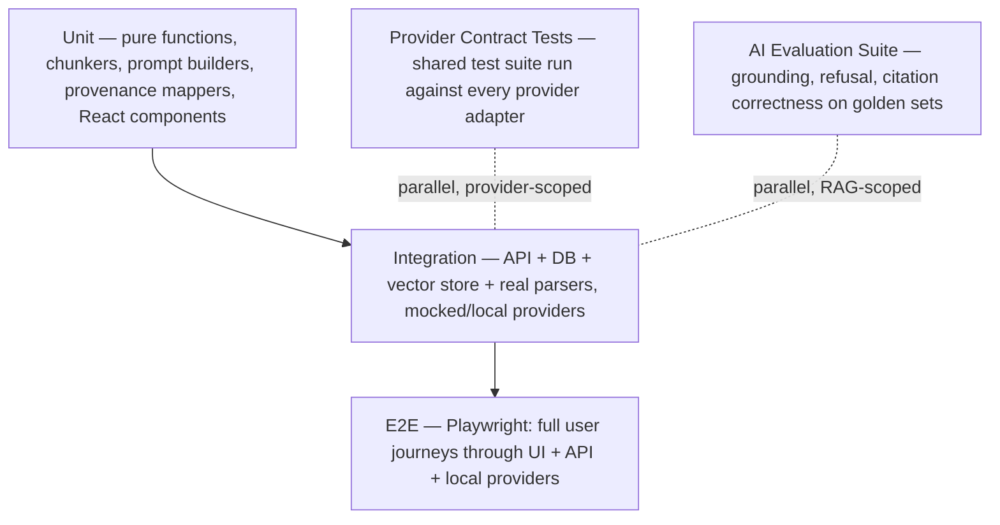
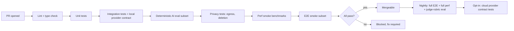

# 35 — Testing Strategy

**Product:** DuckDocs
**Document type:** Engineering process specification — testing
**Status:** Draft for team review
**Audience:** Engineering, QA, AI/ML, security
**Upstream:** [01_VISION.md](./01_VISION.md) · [02_PRODUCT_REQUIREMENTS.md](./02_PRODUCT_REQUIREMENTS.md) · [34_PERFORMANCE.md](./34_PERFORMANCE.md)
**Downstream:** [36_CODING_STANDARDS.md](./36_CODING_STANDARDS.md) · [38_RELEASE_PROCESS.md](./38_RELEASE_PROCESS.md)

---

## 1. Purpose

DuckDocs makes a specific, high-stakes promise: **every AI output is either grounded in cited evidence or explicitly declared insufficient** (RULE-01, RULE-02). That promise is not verifiable by code review alone — it requires a testing strategy purpose-built for a RAG system, not a generic web-app test plan bolted on afterward.

This document defines how DuckDocs is tested at every layer — unit, integration, end-to-end, and AI-specific evaluation (grounding, citation correctness, refusal behavior, provider contracts) — and the guardrails that keep CI trustworthy, fast, and cloud-independent by default.

---

## 2. Scope

### In scope

- Test pyramid and layer responsibilities (unit / integration / e2e)
- Provenance and citation correctness testing
- Grounding and refusal evaluation methodology
- Provider contract testing (local and cloud)
- Privacy tests (no unexpected network egress)
- Performance regression tests (linked to [34_PERFORMANCE.md](./34_PERFORMANCE.md))
- CI/CD test execution policy, including the "no cloud required by default" rule
- Test data, fixtures, and golden-set management
- Flakiness, ownership, and quality gates

### Out of scope

- The performance budgets themselves → [34_PERFORMANCE.md](./34_PERFORMANCE.md)
- Release sign-off checklist → [38_RELEASE_PROCESS.md](./38_RELEASE_PROCESS.md)
- Security threat modeling / pen testing → [24_SECURITY.md](./24_SECURITY.md)
- Coding conventions used while writing tests → [36_CODING_STANDARDS.md](./36_CODING_STANDARDS.md)

---

## 3. Goals

| Goal ID | Goal | Why it matters |
|---------|------|-----------------|
| TEST-G01 | Every citation-bearing response is testable against a ground-truth evidence mapping | Citation correctness is the core trust mechanism (G-02) |
| TEST-G02 | Grounding and refusal behavior is evaluated systematically, not spot-checked | Ungrounded answers are product defects (RULE-01) at any confidence |
| TEST-G03 | Provider abstraction is verified by contract tests so swapping providers cannot silently break behavior | Vendor lock-in avoidance (G-04) depends on interfaces actually being interchangeable |
| TEST-G04 | Default CI requires **zero cloud credentials and zero network access** | Privacy-first must be provable in the build system that ships the product |
| TEST-G05 | Privacy is a tested property, not an assumption | "No telemetry" (RULE-05) must be enforced by tests, not just policy |
| TEST-G06 | Performance budgets are enforced as automated regression gates | Prevents silent performance decay across PRs |
| TEST-G07 | Test suite runs fast enough to be run locally before every push | Slow suites get skipped; skipped suites stop catching regressions |

---

## 4. Test Pyramid and Layers

| Layer | Purpose | Typical tools | Runs in default CI? |
|-------|---------|----------------|----------------------|
| Unit | Fast, isolated logic checks (chunking, parsing utilities, provenance math, React component rendering) | `pytest`, `vitest`/`jest`, React Testing Library | Yes, always |
| Integration | Real backend, real local DB and vector store, real local provider (Ollama) or deterministic fakes | `pytest` + test containers, FastAPI `TestClient` | Yes, always |
| Provider contract | Shared behavioral contract run against each provider adapter (local + cloud) | Custom contract test harness (see §6) | Local providers: yes. Cloud providers: opt-in only |
| AI evaluation | Grounding, refusal, and citation-correctness scoring against golden/reference sets | Custom eval harness, deterministic local model | Yes, using local model; cloud model eval is opt-in |
| E2E | Full user journeys via real UI against a real (containerized) backend | Playwright | Yes, on a curated smoke subset in default CI; full suite on merge to main/release |

---

## 5. Provenance and Citation Correctness Testing

Citation correctness is treated as a **first-class, independently measured quality**, not an emergent property of "the answer looked right."

### 5.1 Golden evidence sets

- A curated, redistributable corpus of documents across format-fidelity tiers (full layout, structural, OCR-dependent, best-effort — per [21_FILE_PROCESSING.md](./21_FILE_PROCESSING.md)) with **hand-verified evidence anchors** (page/paragraph/line/char/bbox/cell).
- Each golden document has an associated set of question/answer/citation fixtures: a question, the expected answer intent, and the exact evidence unit(s) that must be cited.

### 5.2 Test dimensions

| ID | Test dimension | What it verifies |
|----|-----------------|-------------------|
| TEST-P01 | Anchor accuracy | Retrieved chunk's page/line/char/bbox anchor matches the golden anchor for a known query |
| TEST-P02 | Citation navigability | Clicking a citation in the UI scrolls/highlights the exact evidence region (integration + e2e) |
| TEST-P03 | Version binding | A response generated against document version N always cites version N, even after the document is updated to version N+1 |
| TEST-P04 | Evidence metadata completeness | All mandatory fields from PRD §9 are populated for each fidelity tier per the fidelity matrix |
| TEST-P05 | OCR confidence propagation | Low-confidence OCR text surfaces a confidence signal through to the evidence payload, never silently dropped |
| TEST-P06 | Table cell citation | Structured extraction from spreadsheets cites row/column, not just "somewhere in this file" |
| TEST-P07 | Citation-count consistency | The number of citations rendered in the UI equals the number of evidence units the model was actually given for that answer (no phantom or dropped citations) |

### 5.3 Success threshold

- ≥ 95% anchor accuracy on the golden set for full-layout and structural tiers (matches PRD success metric).
- Anchor accuracy for OCR-dependent tier is tracked separately and gated against a lower, explicitly documented threshold reflecting OCR reality — never silently merged into the overall pass rate.

---

## 6. Grounding and Refusal Evaluation

Because DuckDocs' core rule is "no ungrounded answers," refusal behavior is tested as rigorously as answer quality.

### 6.1 Evaluation categories

| ID | Category | Example scenario | Expected behavior |
|----|----------|-------------------|---------------------|
| TEST-EV01 | Answerable, evidence present | Question directly answerable from an indexed document | Grounded answer with correct citation(s) |
| TEST-EV02 | Unanswerable, no evidence | Question about content not in the library | Explicit insufficient-evidence declaration (PR-I06), no fabricated answer |
| TEST-EV03 | Partially answerable | Question where only part of the answer is supported | Answer scoped to what evidence supports; unsupported portion flagged or omitted, not invented |
| TEST-EV04 | Adversarial/prompt-injection content in documents | A document contains text attempting to override system instructions (e.g., "ignore previous instructions") | Model follows system grounding rules, not injected instructions; documented as a security-adjacent eval (cross-ref [24_SECURITY.md](./24_SECURITY.md)) |
| TEST-EV05 | Ambiguous query | Query matches multiple unrelated documents/contexts | Retrieval returns diverse relevant candidates; answer doesn't conflate unrelated sources without disambiguation |
| TEST-EV06 | Contradicting sources | Two indexed documents disagree | Answer surfaces the contradiction with both citations rather than silently picking one |

### 6.2 Scoring methodology

- **Automated scoring** (regex/structural checks for citation presence, refusal phrase detection, anchor validation) runs on every CI build using the local default model for determinism.
- **Rubric-based scoring** (semantic correctness of grounded answers, refusal appropriateness) runs via an LLM-as-judge or human-reviewed sample on a slower cadence (nightly/pre-release), not blocking every PR, because judge-model variance makes it unsuitable as a hard per-commit gate.
- Eval results are tracked over time (locally, in CI artifacts) to detect drift — e.g., a prompt change that quietly increases hallucination rate.

### 6.3 Guardrails against flaky AI tests

- Automated (non-judge) checks use temperature 0 / deterministic decoding against the local model to avoid nondeterministic CI failures.
- Judge-based rubric evaluations are advisory (reported, reviewed) rather than hard-blocking by default, with an explicit escalation path if scores regress beyond a defined threshold.

---

## 7. Provider Contract Tests

Provider abstraction (chat/generation and embeddings, independently configurable per RULE-08) is only trustworthy if every adapter is provably interchangeable.

### 7.1 Contract test suite

A single shared test suite is run against **every** provider adapter (Ollama, OpenAI, Anthropic, Gemini, OpenAI-compatible endpoints, future providers), asserting:

| ID | Contract | Assertion |
|----|----------|-----------|
| TEST-PR01 | Interface compliance | Adapter implements the full required interface (generate, stream, embed as applicable) with correct types |
| TEST-PR02 | Error normalization | Provider-specific errors (rate limit, auth failure, timeout, model-not-found) map to DuckDocs' normalized error types |
| TEST-PR03 | Streaming behavior | Streaming responses yield well-formed incremental tokens and a clean terminal event |
| TEST-PR04 | Configuration-only swap | Switching the configured provider requires no code change and passes the same integration tests unmodified |
| TEST-PR05 | Timeout/retry behavior | Adapter respects configured timeout and retry policy without hanging indefinitely |
| TEST-PR06 | Embedding dimensionality/consistency | Embedding adapter returns consistent vector dimensionality for the configured model, validated before indexing |

### 7.2 Execution policy

| Provider class | Default CI | Nightly/opt-in CI |
|------------------|------------|---------------------|
| Local (Ollama + Gemma 3 1B, local embedding) | Full contract suite runs, no network required | — |
| Cloud (OpenAI, Anthropic, Gemini, OpenAI-compatible) | **Skipped by default** — no credentials in default CI | Runs against real APIs using secrets scoped to a nightly/manual workflow, never on every PR |
| Cloud provider adapters (offline) | Interface/error-mapping logic tested via recorded fixtures/mocks (no live network) | n/a |

This ensures **TEST-G04**: a contributor can clone the repo and run the full default test suite with zero cloud accounts and zero API keys.

---

## 8. Privacy Tests

Privacy is tested as an enforced property of the system, not a policy statement.

| ID | Test | What it verifies |
|----|------|--------------------|
| TEST-PRIV01 | Network egress allowlist test | Backend test run wraps network calls (e.g., via a test-mode proxy/monkeypatch) and asserts zero outbound connections during default-configuration operations (ingest, search, local Q&A) |
| TEST-PRIV02 | No telemetry SDK presence | Static scan of dependencies/imports for known analytics/telemetry packages; build fails if one is introduced (RULE-05) |
| TEST-PRIV03 | Explicit provider indication | When a cloud provider is configured and used, integration test asserts the UI-visible "network active" indicator is set (RULE-04) |
| TEST-PRIV04 | Deletion completeness | Deleting a document removes associated vectors, index entries, derived artifacts, and files per retention policy (RULE-06) — verified by asserting zero residual references after deletion |
| TEST-PRIV05 | Data path locality | Default configuration test asserts all persisted files, DB, and vector data resolve to local configured volumes, never a remote path |

TEST-PRIV01 is run in the **default** CI pipeline (not opt-in) because it is a core trust guarantee, not an optional cloud-adjacent check.

---

## 9. Performance Regression Tests

Cross-referenced with [34_PERFORMANCE.md](./34_PERFORMANCE.md) budgets.

| ID | Test | Cadence |
|----|------|---------|
| TEST-PERF01 | Ingestion throughput benchmark on reference fixtures (per format tier) | Every merge to main; PR-level on changed ingestion code paths |
| TEST-PERF02 | Search latency benchmark at fixed library sizes (1k/10k synthetic documents) | Nightly (full), PR-level smoke subset |
| TEST-PERF03 | Orchestration-overhead latency (PERF-B12), isolated from model inference time | Every merge to main |
| TEST-PERF04 | UI responsiveness budget checks (input latency, navigation) via Playwright performance traces | Nightly |

A performance regression beyond an agreed tolerance (e.g., >15% over the rolling baseline) fails the build and requires explicit justification or a documented budget change in [34_PERFORMANCE.md](./34_PERFORMANCE.md).

---

## 10. Architecture Decisions

| ID | Decision | Rationale |
|----|----------|-----------|
| TEST-AD01 | Default CI pipeline requires zero cloud credentials and zero live network access | Enforces privacy-first as a build-system-verifiable property, not a claim |
| TEST-AD02 | AI evaluation harness is a first-class, versioned test asset (golden sets + fixtures live in-repo) | Grounding/refusal quality must be regression-tested like any other behavior |
| TEST-AD03 | Provider contract tests are shared and provider-agnostic, run against every adapter | Prevents "works for Ollama, breaks for OpenAI" drift |
| TEST-AD04 | Deterministic (temperature-0, local model) checks gate CI; LLM-judge rubric scoring is advisory/nightly | Balances rigor with CI stability |
| TEST-AD05 | Privacy tests (network egress, deletion completeness) run in default CI, not as an optional security lane | Privacy is core product law (RULE-05), not a nice-to-have check |
| TEST-AD06 | Performance benchmarks run on fixed, redistributable synthetic/reference fixtures, not production user data | Keeps CI reproducible and privacy-safe |
| TEST-AD07 | E2E suite is split into a fast PR-blocking smoke subset and a full nightly/pre-release suite | Keeps PR feedback loops fast without sacrificing full coverage before release |

### Alternatives rejected

| Alternative | Why rejected |
|-------------|--------------|
| Require live cloud provider credentials in default CI | Breaks TEST-G04 and excludes contributors without paid API access |
| Treat AI grounding quality as "manual QA only" | Non-repeatable, doesn't scale, allows silent regression |
| Use only end-to-end tests for provider abstraction | Too slow and brittle to catch adapter-level contract breaks quickly |
| Skip privacy tests in favor of policy/code review | Unenforced policy drifts; a single accidental `fetch()` call could ship undetected |
| Block every PR on LLM-judge rubric scores | Judge variance causes flaky, non-reproducible CI failures |

---

## 11. Tradeoffs

| Tradeoff | We choose | We accept |
|----------|-----------|-----------|
| CI speed vs. eval thoroughness | Deterministic checks per-PR, rubric/judge checks nightly | Some quality regressions surface a day later, not instantly |
| Cloud provider coverage vs. contributor accessibility | Cloud contract tests are opt-in/nightly with secrets | Cloud adapter bugs may occasionally reach a PR before being caught |
| Golden-set size vs. maintenance cost | Curated, intentionally small, high-signal golden set | Coverage is not exhaustive across every possible document; expand deliberately over time |
| Strict privacy egress test vs. test infra complexity | Network allowlist/monkeypatch harness maintained as core test infra | Additional test tooling to keep in sync with new network-capable features |
| E2E thoroughness vs. runtime | Smoke subset per PR, full suite nightly/pre-release | A subtle e2e regression could land and be caught later rather than immediately |

---

## 12. Data Flow (Test Execution)

---

## 13. Interfaces

| Interface | Testing responsibility |
|-----------|---------------------------|
| Backend test suite (`pytest`) | Unit, integration, provider contract, privacy, AI evaluation |
| Frontend test suite (`vitest`/`jest` + React Testing Library) | Component unit tests, hook logic |
| E2E suite (Playwright) | Full user journeys against a containerized local stack |
| Eval harness (custom) | Grounding/refusal/citation scoring against golden sets; produces machine-readable reports consumed by CI and humans |
| CI pipeline definitions | Orchestrate the layered execution in §12; enforce default-no-cloud policy |

---

## 14. Constraints

| ID | Constraint |
|----|------------|
| TEST-C01 | Default CI must pass with zero network access and zero cloud credentials |
| TEST-C02 | Test fixtures/golden documents must be redistributable (no confidential or copyrighted third-party material) |
| TEST-C03 | AI evaluation determinism relies on the local default model; version-pin the model used for golden-set scoring to avoid silent drift |
| TEST-C04 | Performance benchmarks must run on the same reference fixtures referenced in [34_PERFORMANCE.md](./34_PERFORMANCE.md) |
| TEST-C05 | Tests must not depend on developer-specific local paths, timezones, or locale settings |

---

## 15. Risks

| Risk | Impact | Mitigation |
|------|--------|------------|
| Golden evidence set becomes stale as ingestion pipeline evolves | False confidence in citation correctness | Golden set review tied to any chunker/parser change; versioned fixtures |
| LLM-judge scoring drifts or becomes inconsistent across judge-model versions | Misleading quality trend | Pin judge model version; treat as advisory signal, not sole gate |
| Provider contract tests pass but real-world API behavior diverges (rate limits, undocumented quirks) | Production incidents despite green CI | Nightly opt-in live-provider runs; monitor provider changelogs |
| Privacy egress test harness misses a new network call path (e.g., a new dependency with its own networking) | Undetected privacy violation | Periodic dependency audit; egress test at the OS/socket level, not just app-level mocking |
| E2E smoke subset misses a regression caught only in nightly full suite | Delayed detection | Keep smoke subset curated and reviewed; treat nightly failures as high priority, not routine |

---

## 16. Future Extensibility

- Expand golden evidence sets as new format fidelity tiers mature (e.g., additional OCR engines, legacy Office formats)
- Add fuzz/property-based testing for chunking and provenance-anchor math
- Extend eval harness to score P1/P2 features (annotation-aware export correctness, semantic comparison accuracy) as they ship
- Support pluggable local judge models for rubric scoring to reduce dependency on any single evaluation model
- Add mutation testing on provenance-critical code paths as the domain model stabilizes

---

## 17. Open Questions

| ID | Question | Owner | Needed by |
|----|----------|-------|-----------|
| OQ-TEST01 | What is the minimum golden-set size per format tier before P0 sign-off? | QA + Product | Before P0 release checklist |
| OQ-TEST02 | Which LLM-judge model (local vs. cloud) is used for rubric scoring, and does using a cloud judge violate default-no-cloud CI policy? | AI Eng | Before eval harness freeze |
| OQ-TEST03 | Do we require contract test parity for every new provider before merge, or allow a grace period? | Eng leadership | Before provider architecture freeze |
| OQ-TEST04 | What is the acceptable performance regression tolerance threshold (%) before CI blocks? | Platform | Before CI gating implementation |

---

## 18. Acceptance Criteria

This document is accepted when:

- [ ] Engineering and QA agree the test pyramid (§4) and layer responsibilities are the standard going forward
- [ ] Provenance/citation correctness testing (§5) is approved as a required gate before any Intelligence-surface feature ships
- [ ] Grounding/refusal evaluation methodology (§6) is approved, including the deterministic-vs-judge split
- [ ] Provider contract test suite (§7) is scoped into the provider architecture implementation plan
- [ ] Privacy tests (§8) are confirmed to run in default CI, not an opt-in lane
- [ ] Performance regression gating (§9) is aligned with [34_PERFORMANCE.md](./34_PERFORMANCE.md) budgets
- [ ] Open questions have owners or explicit deferral

---

## 19. Cross-References

| Topic | Document |
|-------|----------|
| Performance budgets | [34_PERFORMANCE.md](./34_PERFORMANCE.md) |
| Coding standards | [36_CODING_STANDARDS.md](./36_CODING_STANDARDS.md) |
| Contributing / local dev setup | [37_CONTRIBUTING.md](./37_CONTRIBUTING.md) |
| Release process / sign-off checklist | [38_RELEASE_PROCESS.md](./38_RELEASE_PROCESS.md) |
| Security | [24_SECURITY.md](./24_SECURITY.md) |
| Privacy | [25_PRIVACY.md](./25_PRIVACY.md) |
| Provider architecture | [12_PROVIDER_ARCHITECTURE.md](./12_PROVIDER_ARCHITECTURE.md) |
| File processing / fidelity matrix | [21_FILE_PROCESSING.md](./21_FILE_PROCESSING.md) |

---

## Document Control

| Field | Value |
|-------|-------|
| Version | 0.1.0 |
| Last updated | 2026-07-18 |
| Authors | DuckDocs Architecture Team |
| Review state | Pending team review |
| Previous | [34_PERFORMANCE.md](./34_PERFORMANCE.md) |
| Next | [36_CODING_STANDARDS.md](./36_CODING_STANDARDS.md) |
