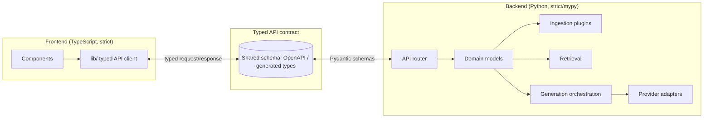

# 36 — Coding Standards

**Product:** DuckDocs
**Document type:** Engineering process specification — coding standards
**Status:** Draft for team review
**Audience:** Engineering, contributors, reviewers
**Upstream:** [01_VISION.md](./01_VISION.md) · [35_TESTING_STRATEGY.md](./35_TESTING_STRATEGY.md)
**Downstream:** [37_CONTRIBUTING.md](./37_CONTRIBUTING.md) · [38_RELEASE_PROCESS.md](./38_RELEASE_PROCESS.md)

---

## 1. Purpose

DuckDocs spans a typed TypeScript/React frontend and a typed Python/FastAPI backend, coordinating ingestion pipelines, a relational store, a vector store, and pluggable AI providers. Without consistent standards, a codebase this heterogeneous fragments quickly — different modules adopting different idioms, error-handling styles, and type discipline.

This document defines the coding standards, structural conventions, and quality bars that keep the codebase coherent, typed, testable, and safe to extend — especially across the plugin boundaries (parsers, providers, exporters) the vision requires ([01_VISION.md](./01_VISION.md) §14).

---

## 2. Scope

### In scope

- Language/type-safety requirements for TypeScript and Python
- Project/module structure conventions for frontend and backend
- Naming, formatting, linting, and static analysis tooling
- Error handling, logging, and configuration conventions
- API and domain-model conventions (typed contracts between layers)
- Code review expectations tied to standards (not process — see [37_CONTRIBUTING.md](./37_CONTRIBUTING.md))
- Documentation-in-code expectations (docstrings, comments policy)

### Out of scope

- Git workflow, PR process, branching → [37_CONTRIBUTING.md](./37_CONTRIBUTING.md)
- Test strategy and coverage expectations → [35_TESTING_STRATEGY.md](./35_TESTING_STRATEGY.md)
- Release versioning and changelog format → [38_RELEASE_PROCESS.md](./38_RELEASE_PROCESS.md)
- UI visual/design system rules → [20_DESIGN_SYSTEM.md](./20_DESIGN_SYSTEM.md)

---

## 3. Goals

| Goal ID | Goal | Why it matters |
|---------|------|-----------------|
| CODE-G01 | Enforce strict static typing across both languages | Catches provenance/evidence-shape bugs before runtime, where they're most dangerous (wrong citation is a trust failure) |
| CODE-G02 | Keep module boundaries aligned with domain concepts (Document, Version, Chunk, Evidence, Annotation, Citation, Comparison, Export) | Matches vision's stable domain model (AD-V02, AD-V06); prevents architecture drift |
| CODE-G03 | Make provider and parser extension a config/plugin exercise, not a core-code exercise | Enforces RULE-08 and PR-EXT01 at the code level |
| CODE-G04 | Make code style disagreements non-events via automated formatting/linting | Review time should go to logic and correctness, not style debates |
| CODE-G05 | Make error handling explicit and typed, never silent | Ingestion/provider/OCR failures must be visible per PR-L10, PR-Q02 |
| CODE-G06 | Keep code self-explanatory; comments explain "why," not "what" | Redundant comments rot and mislead; intent-level comments age better |

---

## 4. Language and Type-Safety Standards

### 4.1 TypeScript (frontend, and any Node-based tooling)

| ID | Rule |
|----|------|
| CODE-TS01 | `strict: true` in `tsconfig.json` is mandatory, including `strictNullChecks`, `noImplicitAny`, `noUncheckedIndexedAccess` |
| CODE-TS02 | `any` is disallowed except in narrowly justified, commented boundary cases (e.g., third-party untyped library shims); `unknown` + narrowing is the default for uncertain shapes |
| CODE-TS03 | All API responses are typed against a shared contract (generated or hand-maintained types mirroring backend Pydantic models — see §6.3) |
| CODE-TS04 | No implicit `.tsx`/`.ts` file allowed to ship with type errors; CI blocks on `tsc --noEmit` |
| CODE-TS05 | React components are function components with typed props (`interface Props { ... }`); no untyped `props: any` |
| CODE-TS06 | Prefer discriminated unions for state that has mutually exclusive shapes (e.g., `IngestStatus = { state: 'ready' } | { state: 'failed'; error: IngestError }`) over boolean flag soup |
| CODE-TS07 | Async operations use `async/await`; raw `.then()` chains are avoided except in trivial one-liners |

### 4.2 Python (backend)

| ID | Rule |
|----|------|
| CODE-PY01 | All functions/methods have full type annotations (parameters and return types); `mypy --strict` (or equivalent strict config) runs in CI |
| CODE-PY02 | Domain models and API schemas use `pydantic` (or equivalent) — no untyped `dict`-passing across module boundaries for core domain objects |
| CODE-PY03 | `Any` is disallowed except at genuine external-boundary points (e.g., raw provider SDK responses before normalization), and must be narrowed immediately after |
| CODE-PY04 | Python version target is pinned (e.g., 3.11+) and declared in `pyproject.toml`; no reliance on undeclared version-specific behavior |
| CODE-PY05 | Public modules/functions use Google- or NumPy-style docstrings describing purpose, params, returns, and raised exceptions — not restating the signature |
| CODE-PY06 | Prefer `dataclasses`/`pydantic` models over ad hoc tuples/dicts for anything crossing a function boundary more than once |

### 4.3 Shared principles

| ID | Rule |
|----|------|
| CODE-S01 | Types are the contract. If a reviewer must read implementation to know what a function returns, the types are insufficient |
| CODE-S02 | No suppression of type errors (`# type: ignore`, `@ts-ignore`) without an inline comment explaining why and, where possible, a linked issue |
| CODE-S03 | Evidence/provenance data structures (chunk, citation, anchor) are defined once per language and reused everywhere — never redefined ad hoc per feature |

---

## 5. Project Structure Conventions

### 5.1 Backend (Python/FastAPI)

```
backend/
  app/
    api/            # FastAPI routers, one module per resource (documents, search, qa, providers, ...)
    domain/         # Core domain models: Document, Version, Chunk, Evidence, Annotation, Citation, Comparison, Export
    ingestion/       # Parsers, OCR adapters, chunkers — one module per format family, plugin-style
    retrieval/       # Vector store client, ranking, retrieval orchestration
    generation/      # Provider-agnostic generation orchestration, prompt assembly, citation binding
    providers/       # Provider adapters (ollama, openai, anthropic, gemini, openai_compatible) implementing shared interfaces
    storage/         # Relational DB access (repositories), file storage access
    config/          # Settings, environment, provider registry
  tests/
    unit/
    integration/
    contract/        # Provider contract test suite (see 35_TESTING_STRATEGY.md)
    eval/            # Grounding/refusal/citation eval harness and golden fixtures
```

### 5.2 Frontend (Next.js/React/TS)

```
frontend/
  app/               # Next.js app router routes (Library, Intelligence, Review, Settings)
  components/        # Reusable UI components, organized by domain (library/, intelligence/, review/, settings/, shared/)
  lib/               # API clients, typed request/response contracts, utility functions
  hooks/             # Shared React hooks (e.g., useCitationNavigation, useIngestStatus)
  state/             # Client state management (query cache, UI state)
  styles/            # Design tokens, global styles (see 20_DESIGN_SYSTEM.md)
  tests/
    unit/
    e2e/             # Playwright specs
```

### 5.3 Structural rules

| ID | Rule |
|----|------|
| CODE-STR01 | New file-format support is added under `ingestion/` as a self-contained parser module implementing the shared parser interface — never by branching logic inside a generic "process file" function |
| CODE-STR02 | New AI providers are added under `providers/` implementing the shared chat/embedding interface — application code never imports a provider SDK directly outside that module |
| CODE-STR03 | New export formats are added as self-contained exporter modules implementing a shared export interface, consuming the same evidence objects the UI uses (no duplicate citation-formatting logic) |
| CODE-STR04 | Domain models (`domain/`) have no dependency on `providers/`, `ingestion/` internals, or transport concerns — dependencies flow inward toward the domain, not outward |
| CODE-STR05 | UI components under `components/` do not call provider SDKs or the vector store directly; all backend interaction goes through `lib/` typed API clients |

---

## 6. Conventions

### 6.1 Naming

| Context | Convention |
|---------|------------|
| TypeScript variables/functions | `camelCase` |
| TypeScript types/interfaces/components | `PascalCase` |
| Python variables/functions | `snake_case` |
| Python classes | `PascalCase` |
| Files (TS) | `kebab-case.ts` / `PascalCase.tsx` for component files |
| Files (Python) | `snake_case.py` |
| Domain IDs (e.g., document ID, chunk ID) | Prefixed, stable, opaque identifiers (e.g., `doc_`, `chk_`, `ev_`) — never reused after deletion |
| Environment variables | `DUCKDOCS_UPPER_SNAKE_CASE`, namespaced to avoid collision |

### 6.2 Formatting and linting

| Layer | Tooling |
|-------|---------|
| TypeScript/React | ESLint (strict config) + Prettier; both run in CI and as pre-commit hooks |
| Python | `ruff` (lint + import sort) + `black` (format) + `mypy` (types); all run in CI and as pre-commit hooks |
| Commit-time enforcement | Pre-commit hooks block formatting/lint violations before they reach CI, per [37_CONTRIBUTING.md](./37_CONTRIBUTING.md) |

Formatting is **never** debated in review — if the linter/formatter allows it, it's acceptable; if it doesn't, the tool is fixed, not overridden ad hoc.

### 6.3 API and domain-model contracts

| ID | Rule |
|----|------|
| CODE-API01 | Backend API schemas (Pydantic) are the source of truth for request/response shapes |
| CODE-API02 | Frontend TypeScript types mirror backend schemas via a generation step (e.g., OpenAPI schema → TS types) where feasible; hand-written types must be kept in lockstep and reviewed against schema changes |
| CODE-API03 | Breaking changes to evidence/citation payload shape require review against [02_PRODUCT_REQUIREMENTS.md](./02_PRODUCT_REQUIREMENTS.md) §9 mandatory metadata fields — no silently dropping a required field |
| CODE-API04 | API versioning follows the convention defined in [15_API_SPECIFICATION.md](./15_API_SPECIFICATION.md); this document does not redefine it |

### 6.4 Error handling

| ID | Rule |
|----|------|
| CODE-ERR01 | Exceptions/errors are typed and specific (e.g., `IngestionParseError`, `ProviderTimeoutError`), never bare `Exception`/`Error` re-raises without added context |
| CODE-ERR02 | Every catch/except that suppresses an error must log it (structured, local-only logging) and surface an actionable status to the caller — silent swallowing is forbidden (PR-L10, RULE violations otherwise) |
| CODE-ERR03 | User-facing error messages are actionable (what happened, what to do), distinct from internal log detail (which may include stack traces) |
| CODE-ERR04 | Provider adapter errors are normalized to a shared error taxonomy before reaching orchestration code (ties to TEST-PR02) |

### 6.5 Logging and configuration

| ID | Rule |
|----|------|
| CODE-LOG01 | Logging is local-only, structured (JSON or key-value), and never includes full document content by default (privacy-sensitive; redact/limit payloads) |
| CODE-LOG02 | No logging library or config may be configured to ship logs to a remote endpoint by default (ties to RULE-05) |
| CODE-LOG03 | Configuration is loaded from typed settings objects (env vars, config file), never scattered `os.environ.get()` calls through business logic |
| CODE-LOG04 | Secrets (API keys for optional cloud providers) are never logged, never committed, and are loaded exclusively from local configuration/secret storage |

### 6.6 Comments and documentation-in-code

| ID | Rule |
|----|------|
| CODE-CMT01 | Comments explain non-obvious intent, constraints, or tradeoffs — not restate what the code visibly does |
| CODE-CMT02 | Public functions/classes in domain, ingestion, retrieval, generation, and provider modules require a docstring/TSDoc describing purpose and contract, since these are the most-reused and most-extended surfaces |
| CODE-CMT03 | Any deviation from an obvious approach (e.g., an unusual chunk-size heuristic, a provider-specific workaround) must be commented with the "why" |

---

## 7. Architecture Decisions

| ID | Decision | Rationale |
|----|----------|-----------|
| CODE-AD01 | Strict typing is enforced in CI for both languages, not just recommended in style docs | Type errors caught at compile/lint time prevent provenance/citation shape bugs reaching users |
| CODE-AD02 | Module structure mirrors the domain model and plugin boundaries defined in the vision, not generic MVC layers | Keeps parser/provider/exporter extension mechanical and low-risk (CODE-G03) |
| CODE-AD03 | Formatting/linting is fully automated and pre-commit enforced | Removes style bikeshedding from code review, focusing review on correctness |
| CODE-AD04 | Domain layer has zero outward dependencies on providers/ingestion internals | Keeps the stable domain model (Document, Version, Chunk, Evidence, ...) actually stable as plugins change |
| CODE-AD05 | Error taxonomy is shared and normalized at adapter boundaries | Enables consistent UX error handling regardless of which provider/parser failed |
| CODE-AD06 | API contract types are generated/mirrored between backend and frontend rather than duplicated by hand where feasible | Reduces drift-induced bugs between typed layers |

### Alternatives rejected

| Alternative | Why rejected |
|-------------|--------------|
| Gradual typing / `any` allowed liberally for velocity | Directly risks provenance/citation correctness bugs, which are trust-critical |
| Generic MVC-style folder structure (`models/`, `views/`, `controllers/`) | Obscures the domain-driven plugin boundaries the vision requires |
| Manual formatting with style-guide documentation only | Style debates consume review time; manual enforcement drifts |
| Allow direct provider SDK imports anywhere in application code | Breaks provider abstraction (RULE-08) and makes swapping providers a code change |
| Hand-maintain duplicate frontend/backend types with no generation or drift check | Silent contract drift causes runtime bugs that types were supposed to prevent |

---

## 8. Tradeoffs

| Tradeoff | We choose | We accept |
|----------|-----------|-----------|
| Strict typing rigor vs. developer velocity | Strict typing everywhere | Slower initial authoring of new modules; fewer runtime surprises |
| Plugin-oriented structure vs. simplicity of a flat codebase | Domain/plugin-oriented structure | More directories/interfaces to learn upfront for new contributors |
| Automated contract generation vs. hand control over API types | Generation where feasible | Occasional generation-tooling friction; mitigated by clear fallback (manual + review) |
| Strict "no telemetry in logging" vs. debuggability | Local-only structured logs, no remote shipping | Debugging production issues on a user's machine requires local log inspection, not centralized dashboards |
| Docstring/comment rigor on public plugin surfaces vs. authoring speed | Required docstrings on domain/ingestion/retrieval/generation/provider public APIs | Slightly higher authoring overhead on the most-reused code |

---

## 9. Data Flow (Typed Contract Boundaries)



**Invariant:** No untyped `dict`/`any` payload crosses the Frontend↔Backend boundary or the Domain↔Plugin boundary for core domain objects (Document, Version, Chunk, Evidence, Citation).

---

## 10. Interfaces

| Interface | Standard applied |
|-----------|---------------------|
| Parser plugin interface (`ingestion/`) | Typed input (file bytes/path + metadata) → typed output (`ParsedDocument` with chunks + provenance anchors) |
| Provider adapter interface (`providers/`) | Typed `generate()`, `stream()`, `embed()` contracts; normalized error taxonomy (CODE-ERR04) |
| Exporter plugin interface | Typed input (`Evidence`-bound response object) → typed output (file bytes/path), reusing UI evidence objects (CODE-STR03) |
| Frontend API client (`lib/`) | Typed request/response wrapping backend schemas; single choke point for all backend calls |

---

## 11. Constraints

| ID | Constraint |
|----|------------|
| CODE-C01 | CI fails on any type error (`tsc --noEmit`, `mypy --strict`) — no merging with type-check failures |
| CODE-C02 | CI fails on any lint/format violation not auto-fixable, or on unresolved auto-fix diffs |
| CODE-C03 | No new runtime dependency may introduce telemetry/analytics behavior (ties to RULE-05, enforced additionally by TEST-PRIV02) |
| CODE-C04 | Domain model changes affecting evidence/citation shape require doc cross-check against [02_PRODUCT_REQUIREMENTS.md](./02_PRODUCT_REQUIREMENTS.md) §9 |
| CODE-C05 | Standards apply equally to first-party code and first-party plugins; third-party vendored code is exempted but isolated and clearly marked |

---

## 12. Risks

| Risk | Impact | Mitigation |
|------|--------|------------|
| Strict typing rules are relaxed under deadline pressure ("just this once") | Gradual erosion of type safety, provenance bugs | CI hard gate, not a lint warning; no override without explicit `# type: ignore` + comment + review sign-off |
| Plugin interfaces become bloated/leaky as new formats/providers are added | Structure decays into ad hoc branching again | Interface review required for any plugin interface change; deviations flagged in code review against §5.3 |
| Generated frontend/backend types fall out of sync if generation step is skipped locally | Silent contract drift, runtime type mismatches | CI step regenerates and diffs types; fails build if generated types are stale |
| Docstring/comment requirements ignored on "just a quick plugin" | Reduces plugin extensibility promise (PR-EXT01) to theory | Review checklist item; linting for missing docstrings on public plugin-surface functions |

---

## 13. Future Extensibility

- Add automated architectural-boundary linting (e.g., dependency-cruiser/import-linter rules) to mechanically enforce CODE-STR04/CODE-STR05
- Extend generated-type pipeline to cover WebSocket/streaming event contracts as those surfaces grow
- Introduce a formal plugin SDK/template generator for new parsers, providers, and exporters as the plugin ecosystem matures
- Revisit strictness knobs (e.g., `noUncheckedIndexedAccess`) as the codebase matures and diminishing-returns tradeoffs become clearer

---

## 14. Open Questions

| ID | Question | Owner | Needed by |
|----|----------|-------|-----------|
| OQ-CODE01 | Do we adopt OpenAPI-generated TS types or a hand-maintained shared schema package? | Eng leadership | Before API specification freeze |
| OQ-CODE02 | Do we require 100% docstring coverage on all public functions, or only plugin-boundary surfaces? | Eng leadership | Before CI gating finalized |
| OQ-CODE03 | Which Python and Node LTS versions are officially supported/pinned? | Platform | Before P0 release checklist |

---

## 15. Acceptance Criteria

This document is accepted when:

- [ ] Engineering agrees strict typing (§4) is a CI-enforced, non-negotiable bar
- [ ] Project structure (§5) matches (or is reconciled with) the actual system architecture in [08_SYSTEM_ARCHITECTURE.md](./08_SYSTEM_ARCHITECTURE.md)+
- [ ] Formatting/linting tooling choices are approved and wired into pre-commit + CI
- [ ] Error handling and logging conventions (§6.4–6.5) are confirmed compatible with privacy constraints (RULE-05)
- [ ] Open questions have owners or explicit deferral

---

## 16. Cross-References

| Topic | Document |
|-------|----------|
| Testing strategy | [35_TESTING_STRATEGY.md](./35_TESTING_STRATEGY.md) |
| Contributing / local setup | [37_CONTRIBUTING.md](./37_CONTRIBUTING.md) |
| System architecture | [08_SYSTEM_ARCHITECTURE.md](./08_SYSTEM_ARCHITECTURE.md) |
| Provider architecture | [12_PROVIDER_ARCHITECTURE.md](./12_PROVIDER_ARCHITECTURE.md) |
| API specification | [15_API_SPECIFICATION.md](./15_API_SPECIFICATION.md) |
| Design system | [20_DESIGN_SYSTEM.md](./20_DESIGN_SYSTEM.md) |
| Security | [24_SECURITY.md](./24_SECURITY.md) |

---

## Document Control

| Field | Value |
|-------|-------|
| Version | 0.1.0 |
| Last updated | 2026-07-18 |
| Authors | DuckDocs Architecture Team |
| Review state | Pending team review |
| Previous | [35_TESTING_STRATEGY.md](./35_TESTING_STRATEGY.md) |
| Next | [37_CONTRIBUTING.md](./37_CONTRIBUTING.md) |
