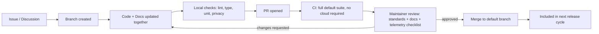

# 37 — Contributing

**Product:** DuckDocs
**Document type:** Engineering process specification — contribution guide
**Status:** Draft for team review
**Audience:** Contributors, engineering, maintainers
**Upstream:** [01_VISION.md](./01_VISION.md) · [36_CODING_STANDARDS.md](./36_CODING_STANDARDS.md) · [35_TESTING_STRATEGY.md](./35_TESTING_STRATEGY.md)
**Downstream:** [38_RELEASE_PROCESS.md](./38_RELEASE_PROCESS.md)

---

## 1. Purpose

DuckDocs is documentation-led: the docs suite is the implementation source of truth until superseded by approved revisions (AD-V07, PC-05). This document tells a contributor — internal or external — exactly how to go from "cloned the repo" to "merged PR" without violating the product's privacy, evidence, and quality guarantees along the way.

It also encodes a hard rule that follows directly from the vision: **contributions must never introduce telemetry, analytics, or hidden network calls**, no matter how well-intentioned (e.g., a crash reporter, a "helpful" analytics library, a default-on update checker).

---

## 2. Scope

### In scope

- Local development environment setup (fully offline-capable)
- Branching, commit, and pull request norms
- Review expectations and required checks before merge
- Documentation-as-source-of-truth workflow (docs before/with code)
- The no-telemetry contribution rule and how it's enforced
- Issue triage and contribution types (bug, feature, docs, plugin)
- Code of conduct pointer and licensing expectations

### Out of scope

- Coding style/type rules themselves → [36_CODING_STANDARDS.md](./36_CODING_STANDARDS.md)
- Test methodology → [35_TESTING_STRATEGY.md](./35_TESTING_STRATEGY.md)
- Versioning and release cutting → [38_RELEASE_PROCESS.md](./38_RELEASE_PROCESS.md)

---

## 3. Goals

| Goal ID | Goal | Why it matters |
|---------|------|-----------------|
| CONTRIB-G01 | Any contributor can get a fully working local install running with zero cloud accounts | Proves local-first is real, not aspirational (C-01) |
| CONTRIB-G02 | PRs that touch product behavior update the relevant doc(s) in the same change | Prevents docs/code drift; docs are the source of truth (AD-V07) |
| CONTRIB-G03 | No contribution can introduce telemetry/analytics/hidden network calls, enforced mechanically, not just by policy | RULE-05 must hold even under contributor mistakes or well-meaning defaults |
| CONTRIB-G04 | Review is fast, predictable, and scoped to objective standards where possible | Reduces contributor friction and reviewer fatigue |
| CONTRIB-G05 | External contributors have a clear, low-friction path from issue to merged PR | Healthy open contribution requires removing ambiguity, not gatekeeping by tribal knowledge |

---

## 4. Local Development Setup

### 4.1 Prerequisites

| Requirement | Notes |
|--------------|-------|
| Docker + Docker Compose | Primary local run path (PC-01) |
| Node.js (LTS, pinned version — see [36_CODING_STANDARDS.md](./36_CODING_STANDARDS.md) OQ-CODE03) | Frontend development outside containers |
| Python (pinned version) | Backend development outside containers |
| Ollama | Local model runtime for the default generation/embedding path |
| Git | Version control |

No cloud account, API key, or paid service is required to run, build, or test DuckDocs locally (CONTRIB-G01).

### 4.2 First-run steps

1. Clone the repository.
2. Copy the example local environment file (e.g., `.env.example` → `.env`) — defaults point entirely at local services; no cloud provider keys are required or pre-filled.
3. Pull the default local model: `ollama pull gemma3:1b` (or the pinned default model tag).
4. Start the stack: `docker compose up` (backend, frontend, ChromaDB, and any supporting local services).
5. Verify the default empty-state flow: open the app, confirm the Settings page shows the local Ollama provider as active and no cloud provider configured, then add a sample document and run a search/Q&A.
6. Run the default test suite locally before making changes, to confirm a clean baseline (see [35_TESTING_STRATEGY.md](./35_TESTING_STRATEGY.md) §4).

### 4.3 Running outside Docker (for tight iteration loops)

- Backend: install dependencies via the pinned dependency manager, run the FastAPI app directly against a local Postgres/SQLite + ChromaDB instance.
- Frontend: `npm install && npm run dev` against the locally running backend.
- Both paths must remain fully functional without any cloud dependency, matching the containerized path.

### 4.4 Verifying "no network" locally

Before opening a PR that touches ingestion, providers, or any backend service call, contributors are expected to sanity-check that no unexpected outbound network call was introduced — the same property enforced in CI (TEST-PRIV01). A simple local check (e.g., running the stack with network access blocked except to `localhost`/`ollama`) is recommended for anything touching those subsystems.

---

## 5. Contribution Types

| Type | Where it starts |
|------|--------------------|
| Bug fix | GitHub issue (reproduction steps) → PR referencing the issue |
| New feature | Discussion/issue against the roadmap ([40_FUTURE_ROADMAP.md](./40_FUTURE_ROADMAP.md)) before implementation, unless trivial |
| New file-format parser plugin | Follows the parser plugin interface ([36_CODING_STANDARDS.md](./36_CODING_STANDARDS.md) §5.3); update format/fidelity docs ([21_FILE_PROCESSING.md](./21_FILE_PROCESSING.md)) |
| New AI provider adapter | Follows the provider interface; must pass the full shared provider contract suite ([35_TESTING_STRATEGY.md](./35_TESTING_STRATEGY.md) §7) |
| New export format plugin | Follows the exporter interface; reuses existing evidence objects, no duplicated citation logic |
| Documentation-only change | Still goes through PR review; docs are product-critical, not "just docs" |

---

## 6. Branching and Commit Norms

| ID | Rule |
|----|------|
| CONTRIB-B01 | Feature/fix branches are cut from the latest default branch; no long-lived divergent forks for core feature work |
| CONTRIB-B02 | Branch names are descriptive and scoped (e.g., `fix/ocr-bbox-anchor`, `feat/docx-parser-tables`) |
| CONTRIB-B03 | Commits are logically scoped; a commit that fixes a bug and reformats unrelated files is split |
| CONTRIB-B04 | Commit messages follow a conventional structure (type: short summary, e.g., `fix: correct line-anchor offset for OCR chunks`), enabling changelog generation (see [38_RELEASE_PROCESS.md](./38_RELEASE_PROCESS.md)) |
| CONTRIB-B05 | No commit may include secrets, API keys, or `.env` files with real credentials |

---

## 7. Pull Request Norms

### 7.1 PR requirements checklist

Every PR description must state:

- What the change does and why (linking an issue/discussion where applicable)
- Which docs (if any) were updated to reflect the change (CONTRIB-G02)
- Whether the change touches ingestion, providers, evidence/citation shape, or network behavior — flagged explicitly for reviewer attention
- Test evidence: which test layers were run/added ([35_TESTING_STRATEGY.md](./35_TESTING_STRATEGY.md))
- Confirmation that no telemetry/analytics/new default network call was introduced

### 7.2 Required automated checks before merge

| Check | Must pass |
|-------|-----------|
| Lint + format (`ruff`/`black`, ESLint/Prettier) | Yes |
| Type check (`mypy --strict`, `tsc --noEmit`) | Yes |
| Unit + integration tests (default, no-cloud) | Yes |
| Privacy tests (network egress, deletion completeness) | Yes |
| Provider contract tests (local provider) | Yes, if provider code touched |
| Performance smoke benchmarks | Yes, if ingestion/retrieval/generation code touched |
| E2E smoke subset | Yes, if UI-facing behavior touched |

### 7.3 Review expectations

| ID | Rule |
|----|------|
| CONTRIB-R01 | At least one maintainer approval is required before merge |
| CONTRIB-R02 | Changes to evidence/citation payload shape, provider interfaces, or domain models require review against the relevant architecture doc, not just code-level review |
| CONTRIB-R03 | Reviewers check for compliance with [36_CODING_STANDARDS.md](./36_CODING_STANDARDS.md), but style-only nitpicks are avoided when the linter/formatter is silent (already enforced mechanically) |
| CONTRIB-R04 | A PR that would introduce a hidden or default-on network call is rejected outright, regardless of other quality — this is a hard product-law violation (RULE-05), not a style preference |
| CONTRIB-R05 | Documentation-only PRs still require review for accuracy against the actual codebase state, since docs are authoritative |

---

## 8. Documentation-as-Source-of-Truth Workflow

Because the docs suite is the implementation source of truth (C-07, PC-05), contribution workflow treats docs as code:

1. If a change alters product behavior described in an existing doc (requirement, architecture decision, API contract, evidence field), the PR updates that doc in the same change set.
2. If a change introduces new behavior not yet covered by any doc, the contributor either (a) proposes a doc update as part of the PR, or (b) flags the gap explicitly in the PR description for a maintainer to route to the correct doc.
3. Docs and code are reviewed together — a PR is not "done" if the code changed but the doc it references now describes stale behavior.
4. Conflicting doc vs. code behavior discovered during review blocks merge until reconciled — silently favoring code over docs (or vice versa) is not acceptable without an explicit decision.

---

## 9. The No-Telemetry Contribution Rule

This is called out separately because it is the rule most likely to be violated **accidentally** by a well-meaning contributor (e.g., adding a popular logging/crash-reporting SDK that phones home by default).

| ID | Rule |
|----|------|
| CONTRIB-NT01 | No dependency may be added that performs network calls by default without explicit user opt-in configuration |
| CONTRIB-NT02 | No analytics, crash-reporting, or usage-tracking SDK may be added, even if "anonymous" or "opt-out by default" — opt-out-by-default is still a privacy violation under RULE-05 |
| CONTRIB-NT03 | Any feature that could plausibly need network access (update checks, provider connectivity tests, remote model catalogs) must be explicit, user-initiated, and visibly indicated when active (RULE-04) |
| CONTRIB-NT04 | New dependencies are checked against a lightweight allowlist/review process before being added, specifically for known telemetry behavior |
| CONTRIB-NT05 | The privacy egress test suite (TEST-PRIV01) must pass on the introduced code path; if it doesn't, the PR is blocked until resolved, not merged with a "fix later" note |

---

## 10. Architecture Decisions

| ID | Decision | Rationale |
|----|----------|-----------|
| CONTRIB-AD01 | Local dev setup has zero cloud dependency, verified as part of onboarding, not assumed | Directly proves CONTRIB-G01 rather than asserting it |
| CONTRIB-AD02 | Docs and code changes ship together in the same PR wherever behavior changes | Prevents the single most common cause of doc drift: "we'll update docs later" |
| CONTRIB-AD03 | Telemetry/network-call review is a mechanical PR checklist item plus an automated privacy test, not solely a reviewer's memory | Human review alone is an insufficient guardrail for a product-law rule |
| CONTRIB-AD04 | Plugin-shaped contributions (parsers, providers, exporters) must pass their respective shared contract/interface tests before merge | Keeps the plugin architecture's promise of "swap without core changes" actually true |
| CONTRIB-AD05 | Conventional commit messages are required to support automated changelog generation | Reduces manual release overhead (see [38_RELEASE_PROCESS.md](./38_RELEASE_PROCESS.md)) |

### Alternatives rejected

| Alternative | Why rejected |
|-------------|--------------|
| Allow "docs later" follow-up PRs for behavior changes | In practice, "later" rarely happens; docs drift and lose authority |
| Rely on reviewer memory alone to catch telemetry-introducing dependencies | Too easy to miss in a large diff; mechanical test + checklist is more reliable |
| Require cloud provider access to run the full local dev environment | Directly contradicts local-first vision and excludes contributors without paid API access |
| Squash-merge without conventional commit requirement | Loses structured history needed for automated changelog generation |

---

## 11. Tradeoffs

| Tradeoff | We choose | We accept |
|----------|-----------|-----------|
| Doc-with-code discipline vs. contribution speed | Docs updated in the same PR | Slightly slower PRs for behavior-changing work; higher long-term doc trust |
| Mechanical telemetry checks vs. contributor trust | Both checklist and automated test | Extra review/test overhead on every PR touching networking-adjacent code |
| Requiring provider/parser contract test passage vs. faster plugin merges | Contract tests required | Plugin authors must implement the full interface correctly before merge, not incrementally |
| Conventional commits vs. free-form commit messages | Conventional required | Minor authoring friction; enables changelog automation |

---

## 12. Data Flow (Contribution Lifecycle)

---

## 13. Interfaces

| Interface | Contribution-relevant responsibility |
|-----------|----------------------------------------|
| `.env.example` | Documents every configurable setting with safe, local-only defaults |
| Pre-commit hooks | Enforce formatting/lint/type checks before a commit is even made |
| CI pipeline | Enforces the full required-check list in §7.2 |
| PR template | Encodes the checklist in §7.1 so it isn't reviewer-memory-dependent |
| Dependency allowlist/review tooling | Flags new dependencies for telemetry-behavior review (CONTRIB-NT04) |

---

## 14. Constraints

| ID | Constraint |
|----|------------|
| CONTRIB-C01 | Local setup instructions must be kept accurate — a broken quickstart is treated as a release-blocking documentation bug |
| CONTRIB-C02 | All contribution paths (Docker and non-Docker) must remain functional without cloud credentials |
| CONTRIB-C03 | External contributions are licensed under the project's chosen license (see [01_VISION.md](./01_VISION.md) OQ-V04 pending resolution); contributors must accept applicable CLA/DCO terms if adopted |
| CONTRIB-C04 | No contribution may lower an existing privacy or evidence-fidelity guarantee without an explicit, documented decision reversal at the relevant architecture doc |

---

## 15. Risks

| Risk | Impact | Mitigation |
|------|--------|------------|
| Popular dependency updates silently add telemetry in a minor version bump | Privacy violation slips in via dependency update, not new code | Dependency review on version bumps too, not just new additions; privacy egress test catches behavior regardless of source |
| Contributors skip doc updates under time pressure | Docs drift from actual behavior, undermining AD-V07 | PR review explicitly blocks on doc/code mismatch; doc-only follow-ups tracked as bugs, not deferred silently |
| External plugin contributions (parsers/providers) partially implement the interface | Broken or inconsistent plugin behavior at runtime | Contract test suite is mandatory and comprehensive; incomplete implementations fail CI, not just code review |
| Local-only dev setup instructions rot as dependencies change | New contributors blocked, project appears unmaintained | Setup steps exercised by CI ("fresh clone" smoke job) and periodic manual verification |

---

## 16. Future Extensibility

- Formal plugin scaffolding CLI (`duckdocs create-parser`, `create-provider`, `create-exporter`) to reduce boilerplate and enforce interface compliance from the start
- Contributor-facing local benchmark/self-check command tying into [34_PERFORMANCE.md](./34_PERFORMANCE.md) budgets
- Expanded "good first issue" labeling tied to the roadmap in [40_FUTURE_ROADMAP.md](./40_FUTURE_ROADMAP.md)
- Automated dependency telemetry-behavior scanning integrated directly into CI (beyond manual allowlist review)

---

## 17. Open Questions

| ID | Question | Owner | Needed by |
|----|----------|-------|-----------|
| OQ-CONTRIB01 | Do we require a signed CLA/DCO for external contributions? | Leadership + Legal | Before public contribution opening |
| OQ-CONTRIB02 | What license governs the project, and does it affect plugin contribution terms? | Leadership | Tied to [01_VISION.md](./01_VISION.md) OQ-V04 |
| OQ-CONTRIB03 | Do we maintain a formal dependency allowlist file in-repo, or rely on PR-time manual review only? | Eng leadership | Before CONTRIB-NT04 tooling implementation |

---

## 18. Acceptance Criteria

This document is accepted when:

- [ ] Engineering confirms the local setup steps (§4) work from a clean clone with zero cloud accounts
- [ ] Maintainers agree on the required-checks list (§7.2) as the merge bar
- [ ] The no-telemetry contribution rule (§9) is accepted as hard-blocking, not advisory
- [ ] Documentation-as-source-of-truth workflow (§8) is adopted as standard PR practice
- [ ] Open questions have owners or explicit deferral

---

## 19. Cross-References

| Topic | Document |
|-------|----------|
| Coding standards | [36_CODING_STANDARDS.md](./36_CODING_STANDARDS.md) |
| Testing strategy | [35_TESTING_STRATEGY.md](./35_TESTING_STRATEGY.md) |
| Release process | [38_RELEASE_PROCESS.md](./38_RELEASE_PROCESS.md) |
| Privacy | [25_PRIVACY.md](./25_PRIVACY.md) |
| Security | [24_SECURITY.md](./24_SECURITY.md) |
| Roadmap | [40_FUTURE_ROADMAP.md](./40_FUTURE_ROADMAP.md) |

---

## Document Control

| Field | Value |
|-------|-------|
| Version | 0.1.0 |
| Last updated | 2026-07-18 |
| Authors | DuckDocs Architecture Team |
| Review state | Pending team review |
| Previous | [36_CODING_STANDARDS.md](./36_CODING_STANDARDS.md) |
| Next | [38_RELEASE_PROCESS.md](./38_RELEASE_PROCESS.md) |
