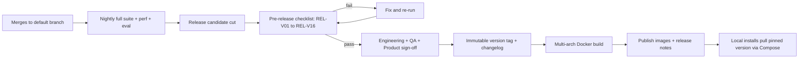

# 38 — Release Process

**Product:** DuckDocs
**Document type:** Engineering process specification — release management
**Status:** Draft for team review
**Audience:** Engineering, QA, product, DevOps
**Upstream:** [02_PRODUCT_REQUIREMENTS.md](./02_PRODUCT_REQUIREMENTS.md) · [35_TESTING_STRATEGY.md](./35_TESTING_STRATEGY.md) · [37_CONTRIBUTING.md](./37_CONTRIBUTING.md)
**Downstream:** [39_RISK_ANALYSIS.md](./39_RISK_ANALYSIS.md) · [40_FUTURE_ROADMAP.md](./40_FUTURE_ROADMAP.md)

---

## 1. Purpose

A local-first product cannot rely on gradual cloud rollouts, feature flags flipped server-side, or silent hotfixes pushed to a fleet — once a user pulls a DuckDocs image or version, it runs on their machine until they choose to update. Releases must therefore be **deliberate, verifiable, and honestly versioned against what was promised** (P0/P1/P2 in the PRD), not just "whatever's on `main` today."

This document defines how DuckDocs is versioned, how changes are recorded, how Docker images are tagged and distributed, and — most importantly — the verification checklist a release must pass against the PRD's phased requirements before it ships.

---

## 2. Scope

### In scope

- Semantic versioning policy and what constitutes major/minor/patch
- Changelog generation and format
- Docker image tagging and build/publish process
- Release branching and cadence
- Pre-release verification checklist mapped to P0/P1/P2 requirements
- Rollback and hotfix procedure
- Release communication (release notes, upgrade notes)

### Out of scope

- CI test execution details → [35_TESTING_STRATEGY.md](./35_TESTING_STRATEGY.md)
- Docker image internals/architecture → [29_DOCKER_ARCHITECTURE.md](./29_DOCKER_ARCHITECTURE.md)
- Deployment topology for end users → [30_DEPLOYMENT.md](./30_DEPLOYMENT.md)
- Long-term feature sequencing → [40_FUTURE_ROADMAP.md](./40_FUTURE_ROADMAP.md)

---

## 3. Goals

| Goal ID | Goal | Why it matters |
|---------|------|-----------------|
| REL-G01 | Every release has an unambiguous version number communicating compatibility/risk | Local installs need to know if an update is safe to pull |
| REL-G02 | Every release is checked against the PRD's P0/P1/P2 requirement set before shipping | Prevents "ready" claims that aren't actually true against product law |
| REL-G03 | Changelogs are generated from structured history, not reconstructed from memory | Accuracy and completeness of what changed |
| REL-G04 | Docker images are reproducibly tagged and never mutate silently under an existing tag | Local installs must be able to pin a known-good version |
| REL-G05 | A release can be rolled back or hotfixed without data loss for local users | Local-first means the user bears the operational burden; tooling must make it safe |

---

## 4. Versioning Policy

DuckDocs follows **Semantic Versioning (SemVer 2.0.0)**: `MAJOR.MINOR.PATCH`.

| Component | Bumped when |
|-----------|-------------|
| MAJOR | Breaking changes to data model, API, or configuration that require migration or break backward compatibility (e.g., evidence schema change requiring reindex, provider config format change) |
| MINOR | New backward-compatible functionality (e.g., a new P1 feature ships, a new provider adapter is added, a new export format) |
| PATCH | Backward-compatible bug fixes, performance improvements, documentation corrections with no behavior change |

### 4.1 Pre-1.0 convention

Until DuckDocs reaches a stable P0-complete milestone, releases use `0.MINOR.PATCH` (current documentation suite is versioned `0.1.0`). `0.x` releases may include breaking changes in MINOR bumps, but every such break must be called out explicitly in the changelog and release notes — "pre-1.0" does not excuse silent breakage.

### 4.2 Version-to-phase mapping

| Version milestone | Requirement phase covered |
|----------------------|-------------------------------|
| `0.1.x` | Documentation suite / architecture foundation (no shipped application code yet) |
| `0.x` pre-P0 | Iterative implementation toward P0 completeness |
| `1.0.0` | First release where all P0 requirements (PRD §15) pass verification |
| `1.x` | P1 requirements (review, compare, export, extraction) land incrementally as MINOR releases |
| `2.0.0` (or later `1.x`, pending architecture review) | P2 requirements (citation graphs, semantic compare, additional exports) — MAJOR only if a breaking data-model change is required, otherwise MINOR |

REL-G02 applies at every milestone tag, not only at `1.0.0`.

---

## 5. Changelog

| ID | Rule |
|----|------|
| REL-C01 | Changelog is generated from conventional commit history ([37_CONTRIBUTING.md](./37_CONTRIBUTING.md) CONTRIB-B04), grouped by type: Added, Changed, Fixed, Deprecated, Removed, Security, Privacy |
| REL-C02 | A dedicated **Privacy** changelog section calls out any change to network behavior, telemetry posture, or data retention — even if the change is "none this release," it is stated explicitly, not omitted |
| REL-C03 | Breaking changes are listed first, in bold, with migration guidance or a link to it |
| REL-C04 | Changelog file (`CHANGELOG.md`) is updated as part of the release PR, not written from scratch post-hoc |
| REL-C05 | Every entry references the relevant requirement ID (PR-*, RULE-*) or roadmap item (ROAD-*) where applicable, so changes are traceable to product intent |

---

## 6. Docker Image Tagging and Build

| ID | Rule |
|----|------|
| REL-D01 | Every release publishes images tagged with the exact SemVer version (e.g., `duckdocs/backend:1.2.0`, `duckdocs/frontend:1.2.0`) |
| REL-D02 | A floating `latest` tag always points to the newest stable release; a floating `edge`/`nightly` tag points to the latest passing build off the default branch, clearly documented as unstable |
| REL-D03 | An existing version tag is **immutable** — once `1.2.0` is published, its image content never changes; a fix ships as `1.2.1` |
| REL-D04 | Images are built reproducibly from a pinned base image and pinned dependency lockfiles, so a given tag can be rebuilt with the same effective content |
| REL-D05 | Docker Compose manifests shipped with a release pin exact image tags, never `latest`, so a user's `docker compose up` is deterministic per release |
| REL-D06 | Multi-architecture builds (amd64/arm64 at minimum) are published for each release to support common local hardware (laptops, Apple Silicon, etc.) |

---

## 7. Release Branching and Cadence

| ID | Rule |
|----|------|
| REL-B01 | The default branch is always releasable in principle; a release is cut by tagging a commit on the default branch, not by long-lived release branches, unless a hotfix requires branching off an older tag |
| REL-B02 | MINOR/MAJOR releases follow a predictable-but-not-rigid cadence tied to roadmap milestones ([40_FUTURE_ROADMAP.md](./40_FUTURE_ROADMAP.md)), not a fixed calendar train that ships incomplete phase work |
| REL-B03 | PATCH releases ship as needed for confirmed regressions or security fixes, without waiting for the next MINOR cycle |
| REL-B04 | A hotfix for an already-released version branches from that version's tag, applies the minimal fix, and is verified against the same release checklist (§8) scoped to the affected area |

---

## 8. Pre-Release Verification Checklist

Every release — especially any release claiming a new phase milestone (P0/P1/P2) — must pass this checklist before publishing. This is the release gate; a release that fails any **must** item does not ship.

### 8.1 Requirement-phase verification (mapped to PRD §15)

| ID | Check | Must / Should |
|----|-------|------------------|
| REL-V01 | All P0 requirements (PR-L*, PR-I*, PR-E*, PR-S*, PR-Q* marked P0) pass their acceptance tests | Must, for any `1.0.0`+ release |
| REL-V02 | All P1 requirements claimed as shipped in this release pass their acceptance tests | Must, for the release claiming them |
| REL-V03 | P2 requirements claimed as shipped pass their acceptance tests; P2 items not yet shipped remain accurately reflected as "architected, not delivered" in docs | Must |
| REL-V04 | RULE-01 through RULE-10 (PRD §7) hold with no known violation | Must |
| REL-V05 | No requirement regresses from a previously verified state (a P0 item that passed in the prior release must still pass) | Must |

### 8.2 Quality gates (tied to Testing Strategy)

| ID | Check | Must / Should |
|----|-------|------------------|
| REL-V06 | Full default test suite (unit, integration, contract, deterministic eval, privacy, e2e smoke) passes | Must |
| REL-V07 | Full nightly suite (full e2e, full perf, judge-rubric eval) passed on the release candidate within the last CI cycle | Must |
| REL-V08 | Performance budgets in [34_PERFORMANCE.md](./34_PERFORMANCE.md) are met on T-REF; T-MIN degradation behavior spot-checked | Must |
| REL-V09 | Privacy egress test (TEST-PRIV01) passes with zero unexpected outbound connections in default configuration | Must |
| REL-V10 | Citation anchor accuracy on the golden evidence set meets the ≥95% threshold for full-layout/structural tiers | Must |
| REL-V11 | Provider contract suite passes for all shipped provider adapters (local mandatory; cloud adapters via nightly opt-in run) | Must |

### 8.3 Operational readiness

| ID | Check | Must / Should |
|----|-------|------------------|
| REL-V12 | Docker images build and `docker compose up` succeeds from a clean environment, matching [37_CONTRIBUTING.md](./37_CONTRIBUTING.md) quickstart | Must |
| REL-V13 | Migration path (if any schema/index change) is tested against a representative pre-upgrade dataset, including rollback | Must, if applicable |
| REL-V14 | Changelog and release notes are complete, including the Privacy section (REL-C02) | Must |
| REL-V15 | Documentation suite reflects the shipped behavior (no known doc/code contradictions) | Must |
| REL-V16 | Known issues/limitations are documented in release notes, not silently omitted | Should |

### 8.4 Sign-off

A release requires explicit sign-off recorded against this checklist (e.g., in the release PR or a release tracking issue) from: Engineering lead, QA, and Product (for phase-completion claims). No release ships on an implicit "looks fine" basis.

---

## 9. Rollback and Hotfix Procedure

| ID | Rule |
|----|------|
| REL-R01 | Because installs are local, DuckDocs cannot force a rollback remotely — the documented rollback procedure is: re-pin Docker Compose to the previous immutable image tag and restart |
| REL-R02 | Any release that alters the database or vector-index schema must ship a documented, tested downgrade path or an explicit statement that downgrade is unsupported past a given point, with data-loss implications stated clearly |
| REL-R03 | A hotfix release (§7 REL-B04) is verified against the affected checklist items from §8 before publishing, not just the specific bug fixed |
| REL-R04 | Security-relevant hotfixes are called out distinctly in release notes and changelog (Security section, REL-C01) so users can prioritize updating |

---

## 10. Architecture Decisions

| ID | Decision | Rationale |
|----|----------|-----------|
| REL-AD01 | Release verification is checked against explicit PRD requirement IDs, not a generic QA pass | Prevents "P0 complete" claims that don't actually map to PR-* acceptance criteria |
| REL-AD02 | Docker tags are immutable per version; fixes always bump a new tag | Local users must be able to trust that a pinned version never changes underneath them |
| REL-AD03 | Changelog includes a mandatory Privacy section every release | Makes privacy posture changes impossible to bury in generic "misc fixes" |
| REL-AD04 | Release branching favors tagging the default branch over long-lived release branches, except for hotfixes | Reduces merge/backport complexity; matches a documentation-led, continuously-verified workflow |
| REL-AD05 | Multi-arch Docker builds are a release requirement, not an optional nice-to-have | Local-first hardware diversity (Apple Silicon, x86) must be supported symmetrically |

### Alternatives rejected

| Alternative | Why rejected |
|-------------|--------------|
| Ship releases based on calendar cadence regardless of phase completeness | Produces "1.0" claims that don't match actual P0 coverage, damaging trust |
| Mutable `latest`-only tagging without immutable version tags | Breaks reproducibility; a user's "working install" could silently change |
| Skip privacy changelog section unless something changed | Silence is indistinguishable from "we didn't check" — explicit statement is required every time |
| Long-lived release branches for every MINOR version | Adds merge overhead disproportionate to a small, docs-led project cadence |

---

## 11. Tradeoffs

| Tradeoff | We choose | We accept |
|----------|-----------|-----------|
| Rigorous phase-verification checklist vs. release velocity | Full checklist required every release claiming new phase coverage | Slower time-to-release for phase-completing versions |
| Immutable tags vs. simpler "just push latest" workflow | Immutable versioned tags mandatory | Slightly more release tooling/process overhead |
| Multi-arch builds vs. build simplicity/CI time | Multi-arch required | Longer CI build times per release |
| No forced remote rollback capability vs. respecting local-first autonomy | User controls their own upgrade/rollback via Compose pinning | DuckDocs cannot "fix it for everyone" instantly; documentation must be excellent |

---

## 12. Data Flow (Release Pipeline)

---

## 13. Interfaces

| Interface | Release-relevant responsibility |
|-----------|-------------------------------------|
| CI/CD release workflow | Automates build, tag, changelog generation, multi-arch publish |
| `CHANGELOG.md` | Structured, versioned record of every release |
| `docker-compose.yml` (shipped per release) | Pins exact image tags for reproducible local installs |
| Release notes (GitHub Releases or equivalent) | Human-readable summary, upgrade notes, known issues |
| Release tracking issue/checklist | Records sign-off against §8 for auditability |

---

## 14. Constraints

| ID | Constraint |
|----|------------|
| REL-C06 | No release may claim P0/P1/P2 completion without passing the corresponding checklist items in §8.1 |
| REL-C07 | No release may ship with a known, unmitigated privacy egress regression |
| REL-C08 | Docker images must not require a cloud account or license server to pull and run the default configuration |
| REL-C09 | Version tags, once published, are never deleted or overwritten |

---

## 15. Risks

| Risk | Impact | Mitigation |
|------|--------|------------|
| Pressure to ship a version claiming "P0 complete" before verification finishes | Erodes trust when gaps surface post-release | Checklist sign-off (§8.4) is a hard gate, not advisory |
| Migration/downgrade path untested before a schema-changing release | Data loss or broken installs on upgrade/downgrade | REL-V13 mandatory migration testing against representative data |
| Multi-arch build failures delay releases silently | Some platforms lag behind on updates | CI treats multi-arch build failure as a release blocker, surfaced early in the pipeline, not at publish time |
| Changelog/release notes become perfunctory over time | Users miss important privacy/security changes | Mandatory structured sections (§5) reviewed as part of release sign-off |

---

## 16. Future Extensibility

- Automated release-checklist tooling that queries test/eval results and auto-populates §8 status rather than manual verification
- Signed image publishing (cosign/sigstore) for supply-chain integrity as the project matures
- Optional (strictly opt-in, local) update-notification mechanism — must be designed consistently with RULE-04/RULE-05 if ever introduced
- Package-manager-native distribution (Homebrew, winget, etc.) as an alternative to Docker Compose for non-technical users, per roadmap

---

## 17. Open Questions

| ID | Question | Owner | Needed by |
|----|----------|-------|-----------|
| OQ-REL01 | What is the target cadence guidance for MINOR releases once P0 ships (strict cadence vs. milestone-driven)? | Product + Eng leadership | Before 1.0.0 planning |
| OQ-REL02 | Do we support downgrade across MAJOR versions at all, or document it as explicitly unsupported? | Eng leadership | Before first schema-breaking release |
| OQ-REL03 | Which container registries are official distribution channels (Docker Hub, GHCR, both)? | Platform | Before first public release |

---

## 18. Acceptance Criteria

This document is accepted when:

- [ ] Engineering and QA agree the pre-release checklist (§8) is the required gate for any phase-completion release claim
- [ ] Versioning policy (§4) and its phase mapping are approved by Product + Engineering
- [ ] Docker tagging immutability and multi-arch requirements (§6) are accepted as release-blocking
- [ ] Rollback/hotfix procedure (§9) is validated against at least one rehearsed dry run before first production release
- [ ] Open questions have owners or explicit deferral

---

## 19. Cross-References

| Topic | Document |
|-------|----------|
| Product requirements / phasing | [02_PRODUCT_REQUIREMENTS.md](./02_PRODUCT_REQUIREMENTS.md) |
| Testing strategy | [35_TESTING_STRATEGY.md](./35_TESTING_STRATEGY.md) |
| Performance budgets | [34_PERFORMANCE.md](./34_PERFORMANCE.md) |
| Contributing | [37_CONTRIBUTING.md](./37_CONTRIBUTING.md) |
| Docker architecture | [29_DOCKER_ARCHITECTURE.md](./29_DOCKER_ARCHITECTURE.md) |
| Deployment | [30_DEPLOYMENT.md](./30_DEPLOYMENT.md) |
| Risk analysis | [39_RISK_ANALYSIS.md](./39_RISK_ANALYSIS.md) |
| Roadmap | [40_FUTURE_ROADMAP.md](./40_FUTURE_ROADMAP.md) |

---

## Document Control

| Field | Value |
|-------|-------|
| Version | 0.1.0 |
| Last updated | 2026-07-18 |
| Authors | DuckDocs Architecture Team |
| Review state | Pending team review |
| Previous | [37_CONTRIBUTING.md](./37_CONTRIBUTING.md) |
| Next | [39_RISK_ANALYSIS.md](./39_RISK_ANALYSIS.md) |
