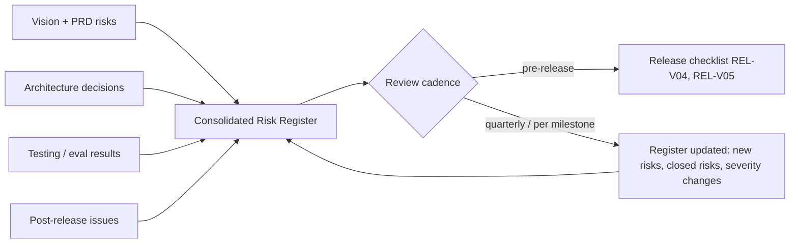

# 39 — Risk Analysis

**Product:** DuckDocs
**Document type:** Cross-cutting risk register
**Status:** Draft for team review
**Audience:** Product, engineering, security, leadership
**Upstream:** [01_VISION.md](./01_VISION.md) · [02_PRODUCT_REQUIREMENTS.md](./02_PRODUCT_REQUIREMENTS.md) · [34_PERFORMANCE.md](./34_PERFORMANCE.md) · [35_TESTING_STRATEGY.md](./35_TESTING_STRATEGY.md)
**Downstream:** [40_FUTURE_ROADMAP.md](./40_FUTURE_ROADMAP.md)

---

## 1. Purpose

Risks for DuckDocs are currently scattered across the Vision (§13), the PRD (§17), and implicit assumptions in architecture-adjacent docs. That's appropriate for those documents' scope — but it means no single place answers "what could make DuckDocs fail, and what are we doing about it?"

This document is that single place: a consolidated, categorized risk register spanning **product, technical, privacy, OCR/fidelity, and model-quality** risk — each with impact, likelihood framing, mitigation, and an owner category. It exists to be reviewed and updated, not written once and forgotten.

---

## 2. Scope

### In scope

- Consolidated product risk (adoption, scope, positioning)
- Technical/architecture risk (performance, scaling, provider abstraction)
- Privacy risk (data exposure, telemetry drift, provider misconfiguration)
- OCR and format-fidelity risk (citation trust, layout gaps)
- Model quality/grounding risk (hallucination, refusal calibration, small-model limitations)
- Risk severity/likelihood framing and review cadence
- Mapping of each risk to its primary mitigating doc/mechanism

### Out of scope

- Detailed threat modeling (STRIDE-style security analysis) → [24_SECURITY.md](./24_SECURITY.md)
- Performance budget specifics → [34_PERFORMANCE.md](./34_PERFORMANCE.md)
- Test implementation of mitigations → [35_TESTING_STRATEGY.md](./35_TESTING_STRATEGY.md)
- Roadmap sequencing decisions → [40_FUTURE_ROADMAP.md](./40_FUTURE_ROADMAP.md)

---

## 3. Goals

| Goal ID | Goal | Why it matters |
|---------|------|-----------------|
| RISK-G01 | Every major risk identified across Vision/PRD/architecture is captured once, consistently, and traceably | Scattered risk notes get lost; a register can be reviewed and updated |
| RISK-G02 | Every risk has a concrete mitigation mechanism, not just an acknowledgment | "We know about it" is not a mitigation |
| RISK-G03 | Risk severity is framed honestly, including risks that are uncomfortable (e.g., small local models may just be bad at some tasks) | False confidence is itself a risk |
| RISK-G04 | Risk register is reviewed on a cadence, not treated as a one-time document | Risk profile changes as the product evolves |

---

## 4. Risk Framing

Each risk is scored on two axes using a simple, consistent scale (not a false-precision numeric model, given this is pre-launch and likelihood data doesn't exist yet):

| Axis | Levels |
|------|--------|
| **Impact** | Low / Medium / High / Critical (Critical = violates a product-law rule (RULE-01–10) or vision principle) |
| **Likelihood** | Low / Medium / High (qualitative judgment, revisited each review cycle as real signal accumulates) |

Risk IDs use the prefix `RISK-` followed by a category tag (`PROD`, `TECH`, `PRIV`, `OCR`, `MODEL`) and a number, e.g. `RISK-PROD-01`.

---

## 5. Product Risks

| ID | Risk | Impact | Likelihood | Mitigation |
|----|------|--------|------------|-------------|
| RISK-PROD-01 | Product is perceived as "just another chat-with-PDF wrapper," missing the library/evidence/review differentiation | High | Medium | Positioning discipline (Vision §6); P0 must ship visible Library + citation navigation, not chat-only |
| RISK-PROD-02 | P0 scope creep from P1/P2 review features delays core grounded-intelligence delivery | High | Medium | Strict phase gating (PRD §15); architecture accommodates P1/P2 without blocking P0 delivery (AD-P03) |
| RISK-PROD-03 | Users misunderstand "local-first" as "cloud-optional" and don't trust the privacy claim without proof | Medium | Medium | Persistent, visible provider/network indicator (RULE-04); privacy egress tests as a marketable, verifiable claim |
| RISK-PROD-04 | Users treat fluent grounded answers as infallible truth, over-trusting citations that are technically present but weak | Medium | Medium | UI confidence signals (PR-E05); strict grounding language; evidence inspector (PR-E06) |
| RISK-PROD-05 | Broad format support (PRD §8) creates uneven quality perception across file types, damaging trust in the whole product from one bad format experience | Medium | High | Graded fidelity UI (AD-P05); honest per-format labeling instead of implying uniform quality |
| RISK-PROD-06 | Review/annotation/comparison features (P1/P2) are starved of engineering time indefinitely, and the "architected for it" promise never materializes | Medium | Medium | Roadmap commitments tracked in [40_FUTURE_ROADMAP.md](./40_FUTURE_ROADMAP.md); schema/API stubs shipped in P0 (RISK mitigation already named in PRD §17) |
| RISK-PROD-07 | Licensing/distribution model undecided (OQ-V04) blocks public release planning or contribution model decisions | Medium | Medium | Escalate as a leadership-owned open question with an explicit deadline before public release |

---

## 6. Technical / Architecture Risks

| ID | Risk | Impact | Likelihood | Mitigation |
|----|------|--------|------------|-------------|
| RISK-TECH-01 | Large libraries (10k+ documents) degrade search/Q&A latency below budget on typical local hardware | High | Medium | ANN indexing, incremental indexing, documented library-size guidance ([34_PERFORMANCE.md](./34_PERFORMANCE.md) PERF-B09, OQ-PERF01) |
| RISK-TECH-02 | Provider abstraction leaks implementation details, so changing providers requires code changes despite RULE-08 | Critical | Medium | Strict provider interfaces + mandatory shared contract test suite (TEST-PR01–06) run against every adapter before merge |
| RISK-TECH-03 | Background ingestion/OCR workload starves foreground UI responsiveness | High | Medium | Worker/queue isolation architecture (PERF-AD01); resource-pressure throttling ladder ([34_PERFORMANCE.md](./34_PERFORMANCE.md) §7) |
| RISK-TECH-04 | Vector store (ChromaDB) does not scale to required library sizes within budget, forcing a late architecture change | High | Low–Medium | Early load testing against realistic library sizes; abstraction boundary in [14_VECTOR_DATABASE.md](./14_VECTOR_DATABASE.md) allows backend swap without rewriting retrieval logic |
| RISK-TECH-05 | Domain model changes (e.g., adding annotations/versioning later) force a breaking schema migration because early data model didn't anticipate them | Critical | Low | Vision-level decision AD-V06 to model comparison/versioning/citations early; domain model review checklist before schema freeze (PRD §16 "Review readiness" metric) |
| RISK-TECH-06 | Full-library reindex (on embedding-model/schema migration) is slow, unresumable, or blocks availability | High | Medium | Resumable, progress-visible, blue/green-swappable reindex design ([34_PERFORMANCE.md](./34_PERFORMANCE.md) §7.4) |
| RISK-TECH-07 | Multi-arch Docker build/support gaps leave a meaningful share of local hardware (e.g., Apple Silicon) unsupported or degraded | Medium | Medium | Multi-arch build requirement in release process (REL-D06) |
| RISK-TECH-08 | Frontend/backend typed-contract drift introduces runtime bugs in evidence/citation payload handling | High | Medium | Generated/mirrored type contracts (CODE-API02); CI diff check on generated types |

---

## 7. Privacy Risks

| ID | Risk | Impact | Likelihood | Mitigation |
|----|------|--------|------------|-------------|
| RISK-PRIV-01 | A dependency introduces telemetry/analytics behavior (directly or via a minor version bump) without the team noticing | Critical | Medium | Dependency review on add and on version bump (CONTRIB-NT04); automated privacy egress test (TEST-PRIV01) run in default CI, independent of dependency source |
| RISK-PRIV-02 | Users enable a cloud provider without realizing sensitive documents will be sent to it | Critical | Medium | Persistent visible network/provider indicator (RULE-04); explicit confirmation on first remote-provider use (PRD §17) |
| RISK-PRIV-03 | Document deletion leaves residual vectors, index entries, or derived artifacts (incomplete right-to-delete) | High | Medium | Deletion-completeness test (TEST-PRIV04) verifying zero residual references; retention policy defined in [25_PRIVACY.md](./25_PRIVACY.md) |
| RISK-PRIV-04 | Local logs inadvertently capture full document content or secrets, creating a local (not network) privacy exposure | Medium | Medium | Structured logging with content redaction by default (CODE-LOG01); secrets never logged (CODE-LOG04) |
| RISK-PRIV-05 | Provider connectivity "test" in Settings accidentally sends library document content without explicit inclusion | High | Low | PR-S08 requires connectivity tests to not send library content unless explicitly included; covered by contract/integration tests |
| RISK-PRIV-06 | Future multi-user local deployment introduces cross-user data exposure not present in the single-user model | High | Low (P2+ timeframe) | Multi-user architecture explicitly deferred and must pass its own privacy/security review before shipping (see [40_FUTURE_ROADMAP.md](./40_FUTURE_ROADMAP.md)) |

---

## 8. OCR and Format-Fidelity Risks

| ID | Risk | Impact | Likelihood | Mitigation |
|----|------|--------|------------|-------------|
| RISK-OCR-01 | OCR/layout fidelity gaps produce wrong or misleading citation anchors, directly breaking the evidence-first promise | Critical | Medium | Graded confidence UI; per-format fidelity matrix ([21_FILE_PROCESSING.md](./21_FILE_PROCESSING.md)); bbox fallback; OCR confidence propagated to evidence payload (TEST-P05) |
| RISK-OCR-02 | Low OCR confidence is silently hidden rather than surfaced, violating RULE-10 | High | Medium | Product rule RULE-10 is normative; UI must render confidence signals whenever available; tested via TEST-P05 |
| RISK-OCR-03 | Legacy/obscure Office formats and scanned documents get "best-effort" treatment that users interpret as equal-quality to full-layout formats | Medium | High | Explicit fidelity-tier labeling (PRD §8.8); no fake precision in UI |
| RISK-OCR-04 | OCR processing cost dominates ingestion queue time on constrained hardware, starving interactive workloads | Medium | Medium | Priority queues (interactive jobs preempt bulk ingest); PERF-B03 OCR-specific budget |
| RISK-OCR-05 | Chosen default OCR engine (OQ-V02, still open) underperforms on real-world scan quality, requiring a late engine swap | Medium | Medium | OCR engine selection abstracted behind an internal interface so swapping doesn't require ingestion pipeline rewrite |

---

## 9. Model Quality / Grounding Risks

| ID | Risk | Impact | Likelihood | Mitigation |
|----|------|--------|------------|-------------|
| RISK-MODEL-01 | Default local model (Gemma 3 1B) produces weak or shallow answers on complex questions, damaging perceived product quality | High | High | Strong retrieval quality reduces dependency on model reasoning depth; Settings guidance for larger local/cloud models; separate orchestration-latency reporting from model-latency (PERF-B12) so slowness isn't misattributed |
| RISK-MODEL-02 | Model hallucinates an answer despite insufficient retrieved evidence, violating RULE-01/RULE-02 | Critical | Medium | Strict grounding pipeline (retrieve → constrain context → require citation or refusal); refusal evaluation suite (TEST-EV02, TEST-EV03) |
| RISK-MODEL-03 | "Refuse when ungrounded" behavior is calibrated too aggressively, refusing answerable questions and frustrating users (OQ-V03 unresolved) | Medium | Medium | Refusal calibration tuned against eval categories TEST-EV01–EV03; explicit product decision needed before AI architecture freeze |
| RISK-MODEL-04 | Prompt-injection content embedded in ingested documents manipulates model behavior (e.g., "ignore previous instructions") | High | Medium | Dedicated adversarial eval category (TEST-EV04); system-level grounding constraints resistant to in-document instructions; cross-ref [24_SECURITY.md](./24_SECURITY.md) |
| RISK-MODEL-05 | Contradicting sources across documents cause the model to silently pick one side without flagging disagreement | Medium | Medium | Dedicated eval category (TEST-EV06) requiring surfaced contradiction with both citations |
| RISK-MODEL-06 | Answer quality varies significantly across configured providers, and users don't understand why | Medium | High | UX honestly communicates provider/model in use; documented tradeoff (Vision §9: "Provider flexibility vs. uniform quality") |
| RISK-MODEL-07 | Embedding model choice (OQ-P03, open) affects retrieval quality in ways not caught until real usage | Medium | Medium | Golden evidence set retrieval-quality benchmarking before freezing default embedding model |

---

## 10. Architecture Decisions

| ID | Decision | Rationale |
|----|----------|-----------|
| RISK-AD01 | Risk register is categorized (product/tech/privacy/OCR/model) rather than a single flat list | Different owners and mitigation mechanisms apply per category; flat lists get ignored |
| RISK-AD02 | Every risk entry must name a concrete mitigation mechanism that already exists elsewhere in the doc suite (test, architecture decision, product rule) rather than a new promise invented here | Keeps the register grounded in real, traceable mitigations, not aspirational statements |
| RISK-AD03 | Critical-impact risks are exclusively those that would violate a normative product rule (RULE-01–10) or vision principle | Prevents severity inflation that would make "Critical" meaningless |
| RISK-AD04 | Risk register is reviewed on a fixed cadence (§12) rather than being a static one-time artifact | Risk profile shifts materially as implementation progresses past documentation-only phase |

### Alternatives rejected

| Alternative | Why rejected |
|-------------|--------------|
| Leave risk notes scattered across Vision/PRD only | Fragments ownership and makes cross-cutting review (e.g., before a release) impractical |
| Numeric risk scoring (e.g., 1–25 matrices) at this pre-implementation stage | False precision without real likelihood data; qualitative framing is more honest right now |
| Treat "known limitation" and "mitigated risk" as equivalent | A risk with no active mitigation mechanism is not the same as one covered by a test/architecture decision — conflating them hides real exposure |

---

## 11. Tradeoffs

| Tradeoff | We choose | We accept |
|----------|-----------|-----------|
| Comprehensive risk coverage vs. document length | Comprehensive, categorized coverage | A longer document that must be actively maintained, not skimmed once |
| Honest "Critical/High" labeling for uncomfortable risks (e.g., small model weakness) vs. optimistic framing | Honest labeling | Some risks look unresolved/uncomfortable in a document leadership will read |
| Qualitative likelihood vs. quantitative risk scoring | Qualitative for now | Revisit with real data once telemetry-free, locally-reported eval/perf metrics accumulate post-launch |

---

## 12. Risk Review Cadence and Data Flow

| Trigger | Action |
|---------|--------|
| Before every release claiming a phase milestone | Cross-check Critical/High risks in this register against release checklist (§8 in [38_RELEASE_PROCESS.md](./38_RELEASE_PROCESS.md)) |
| Per roadmap milestone (P0 → P1 → P2 transition) | Full register review: close mitigated risks, add newly surfaced ones |
| On any confirmed production incident (privacy, grounding failure, data loss) | Add or update the corresponding risk entry with real likelihood evidence, not just theoretical framing |

---

## 13. Interfaces

| Interface | Risk-relevant responsibility |
|-----------|----------------------------------|
| Release checklist ([38_RELEASE_PROCESS.md](./38_RELEASE_PROCESS.md) §8) | Consumes Critical/High risks as explicit go/no-go inputs |
| Testing strategy eval harness | Produces the evidence (pass/fail, drift signals) that risk mitigations rely on |
| Security docs ([24_SECURITY.md](./24_SECURITY.md)) | Owns deeper threat-model detail for privacy/model-injection risk categories |
| Roadmap ([40_FUTURE_ROADMAP.md](./40_FUTURE_ROADMAP.md)) | Owns sequencing decisions that respond to product-risk mitigation (e.g., prioritizing schema stubs) |

---

## 14. Constraints

| ID | Constraint |
|----|------------|
| RISK-C01 | No risk may be marked "mitigated" without a named, verifiable mechanism (test ID, architecture decision ID, or product rule) |
| RISK-C02 | Critical risks tied to RULE-01–10 violations block release regardless of other schedule pressure (ties to REL-V04) |
| RISK-C03 | This register must be reviewed (not just exist) at every milestone transition per §12 |

---

## 15. Future Extensibility

- Add a lightweight local risk-dashboard view (no telemetry — purely reading local test/eval artifact history) to visualize mitigation status over time
- Extend categories as new subsystems mature (e.g., a dedicated Export-risk or Multi-user-risk category once those ship)
- Incorporate real post-release incident data into likelihood framing once available, replacing purely qualitative pre-launch estimates

---

## 16. Open Questions

| ID | Question | Owner | Needed by |
|----|----------|-------|-----------|
| OQ-RISK01 | Who owns risk register maintenance long-term (a rotating role vs. a fixed owner)? | Eng leadership | Before P0 release |
| OQ-RISK02 | Should Critical risks require sign-off from a specific role (e.g., security lead) beyond general release sign-off? | Security + Leadership | Before first production release |
| OQ-RISK03 | Do we publish a user-facing "known limitations" summary derived from this register, or keep it internal? | Product | Before public release planning |

---

## 17. Acceptance Criteria

This document is accepted when:

- [ ] Product, engineering, security, and leadership agree the categorized risks (§5–9) are a complete first-pass consolidation of known risk from Vision/PRD/architecture
- [ ] Every Critical-impact risk has an agreed, traceable mitigation mechanism
- [ ] Release process ([38_RELEASE_PROCESS.md](./38_RELEASE_PROCESS.md)) is confirmed to consume this register as a gating input
- [ ] Review cadence (§12) is adopted as a recurring team practice, not a one-time exercise
- [ ] Open questions have owners or explicit deferral

---

## 18. Cross-References

| Topic | Document |
|-------|----------|
| Vision-level risks | [01_VISION.md](./01_VISION.md) §13 |
| PRD-level risks | [02_PRODUCT_REQUIREMENTS.md](./02_PRODUCT_REQUIREMENTS.md) §17 |
| Performance | [34_PERFORMANCE.md](./34_PERFORMANCE.md) |
| Testing strategy | [35_TESTING_STRATEGY.md](./35_TESTING_STRATEGY.md) |
| Release process | [38_RELEASE_PROCESS.md](./38_RELEASE_PROCESS.md) |
| Security | [24_SECURITY.md](./24_SECURITY.md) |
| Privacy | [25_PRIVACY.md](./25_PRIVACY.md) |
| Roadmap | [40_FUTURE_ROADMAP.md](./40_FUTURE_ROADMAP.md) |

---

## Document Control

| Field | Value |
|-------|-------|
| Version | 0.1.0 |
| Last updated | 2026-07-18 |
| Authors | DuckDocs Architecture Team |
| Review state | Pending team review |
| Previous | [38_RELEASE_PROCESS.md](./38_RELEASE_PROCESS.md) |
| Next | [40_FUTURE_ROADMAP.md](./40_FUTURE_ROADMAP.md) |
