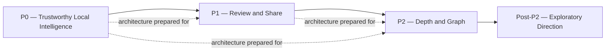
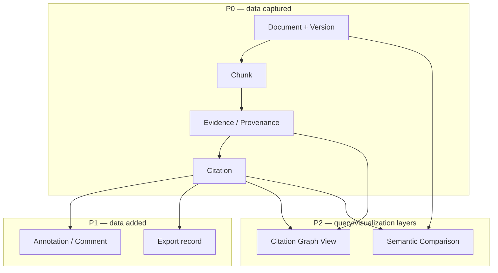

# 40 — Future Roadmap

**Product:** DuckDocs
**Document type:** Roadmap and phased delivery plan
**Status:** Draft for team review
**Audience:** Product, engineering, leadership, contributors
**Upstream:** [01_VISION.md](./01_VISION.md) · [02_PRODUCT_REQUIREMENTS.md](./02_PRODUCT_REQUIREMENTS.md) · [39_RISK_ANALYSIS.md](./39_RISK_ANALYSIS.md)
**Downstream:** None — this document closes the documentation suite

---

## 1. Purpose

Every prior document in this suite either constrains or is constrained by *when* things ship. This document is where that sequencing is made explicit: what P0 must deliver to be a credible product, what P1 adds for review-and-share workflows, what P2 adds for depth and graph-level intelligence, and what stays deliberately out of scope for the foreseeable future.

Its second, equally important job is to state plainly **that the architecture is already designed to absorb P1/P2 features without rework** — citation graphs, semantic comparison, additional export formats, and optional multi-user local deployment are not speculative bolt-ons; they are accounted for in the domain model and plugin boundaries defined across this suite (AD-V06, AD-P03, RULE-09).

---

## 2. Scope

### In scope

- P0/P1/P2 feature sequencing, aligned 1:1 with PRD §15 and §6 capability requirements
- Architecture readiness statement for each deferred capability
- Sequencing rationale and dependency ordering within phases
- Post-P2 direction (exploratory, not committed)
- Explicit non-goals and their review triggers

### Out of scope

- Detailed acceptance criteria per requirement → [02_PRODUCT_REQUIREMENTS.md](./02_PRODUCT_REQUIREMENTS.md)
- Release mechanics (versioning, tagging) → [38_RELEASE_PROCESS.md](./38_RELEASE_PROCESS.md)
- Risk detail behind roadmap decisions → [39_RISK_ANALYSIS.md](./39_RISK_ANALYSIS.md)

---

## 3. Goals

| Goal ID | Goal | Why it matters |
|---------|------|-----------------|
| ROAD-G01 | Sequence delivery so P0 is a genuinely credible, trustworthy product on its own — not a partial demo waiting for P1 | Vision principle: commercial craft, not MVP/demo (C-08) |
| ROAD-G02 | Prove, per deferred capability, that the architecture already accommodates it | Directly answers RULE-09: review features must not be blocked by irreversible early data-model choices |
| ROAD-G03 | Keep sequencing traceable to PRD requirement IDs, not an unlinked feature wishlist | Prevents roadmap drift from the requirements that were actually agreed upon |
| ROAD-G04 | Give contributors and leadership a shared, falsifiable definition of "done" per phase | Avoids scope ambiguity at phase boundaries |

---

## 4. Roadmap Overview

Each phase is gated by the release verification checklist in [38_RELEASE_PROCESS.md](./38_RELEASE_PROCESS.md) §8 — a phase is "shipped" only when its requirements pass acceptance testing, not when code merges.

---

## 5. P0 — Trustworthy Local Intelligence

**Definition of done:** A new user can install locally, add documents, search/ask/summarize, and verify every answer via clickable citations — with zero cloud dependency and zero telemetry.

| Capability | Requirement IDs | Notes |
|------------|-------------------|-------|
| Local install via Docker Compose | PR-L09, PC-01, PC-02 | Zero cloud accounts required |
| Upload, ingest, preview for priority formats | PR-L01–L06, PR-L09, PR-L10 | Priority shortlist: PDF, DOCX, TXT/MD, PNG/JPEG, CSV, TS/JS/PY (OQ-P02 default) |
| Semantic search + grounded Q&A + summarization | PR-I01–I03, PR-I05–I08, PR-I10 | RAG-first; no ungrounded generation |
| Clickable citations + preview navigation + chunk inspection | PR-E01–E05, PR-E07 (data model only) | Evidence metadata per PRD §9 captured even where P0 UI surfaces less of it |
| Provider settings (local default + optional remote) | PR-S01–PR-S07 | Ollama + Gemma 3 1B default; OpenAI/Anthropic/Gemini/compatible optional |
| No telemetry; privacy defaults enforced | RULE-03–RULE-05, PR-S05, PR-S06 | Enforced via privacy tests (TEST-PRIV01–05), not policy alone |
| Product quality bar | PR-Q01–Q03 | Commercial polish, actionable errors, guided empty states |

**Architecture already prepared for beyond-P0:** Document/Version/Chunk/Evidence/Annotation/Citation/Comparison/Export domain objects exist in the data model from P0 (AD-P03), even though Annotation/Comparison/Export UI ships later. Evidence metadata (PRD §9) is captured at full fidelity from day one so nothing needs backfilling for citation graphs (PR-E07) or comparison features.

---

## 6. P1 — Review and Share

**Definition of done:** Users can annotate cited evidence, compare documents/versions, extract structured data, and export cited results — without any change to the core evidence/domain model established in P0.

| Capability | Requirement IDs | Depends on P0 |
|------------|-------------------|-----------------|
| Inline annotations + comments on citations | PR-R01–R03, PR-R05 | Evidence anchors (page/line/char/bbox) from P0 |
| Document/version compare (content diff) | PR-C01–C03, PR-C06 | Version lineage tracked from P0 upload/versioning (PR-L07, PR-L08) |
| Version history UX | PR-L07, PR-L08, PR-C06 | Version IDs stable since P0 (rejected alternative: defer version IDs, PRD §10) |
| Structured extraction | PR-I04 | Retrieval + evidence binding from P0 |
| Citation-aware export (at least one format) | PR-X01, PR-X02, PR-X04 | Reuses P0 evidence objects (no duplicated citation logic, CODE-STR03) |
| Confidence visualization in Review/Intelligence | PR-E05, PR-R05 | Confidence/OCR signals captured in evidence metadata since P0 |

**Sequencing rationale:** Annotation and compare ship before deeper export formats because they depend only on data already captured in P0; export format breadth (P2) is additive once the export plugin interface is proven with one format.

**Architecture already prepared for beyond-P1:** The export plugin interface (CODE-STR03) is designed for multiple formats from the start — P1 ships one clean format (Markdown first, per OQ-P04 default) precisely so P2's additional formats (DOCX, HTML, JSON evidence bundle) are plugin additions, not redesigns.

---

## 7. P2 — Depth and Graph

**Definition of done:** DuckDocs supports meaning-level comparison, citation relationship graphs, and a broader export surface — deepening trust and analytical power beyond content-level review.

| Capability | Requirement IDs | Depends on P0/P1 |
|------------|-------------------|---------------------|
| Semantic comparison (meaning-level change summary with evidence) | PR-C04 | Content diff (P1) as the structural baseline; grounded generation pipeline from P0 |
| Annotation and citation comparison | PR-C05, PR-R04 | Annotation data model (P1) and version comparison (P1) |
| Citation graph views (answer ↔ chunks ↔ documents ↔ related passages) | PR-E07 | Evidence/citation objects already modeled since P0 — this is a **query and visualization layer over existing data**, not a new data model |
| Additional export formats (DOCX, HTML, JSON evidence bundle) | PR-X03 | Export plugin interface proven in P1 |
| Expanded format fidelity and performance hardening | PRD §8.8 fidelity tiers; [34_PERFORMANCE.md](./34_PERFORMANCE.md) budgets | Modular parser architecture from P0 |
| Richer version diff (changed passages, citations, annotations) | Extends PR-C03/PR-C05 | Version + annotation + citation data all present since P0/P1 |

**Architecture readiness detail — citation graphs (PR-E07):** Because every citation already links an answer to specific chunks, and every chunk already links to a document/version with full provenance metadata (PRD §9), the graph *edges* exist implicitly from P0. P2 work is building the graph query layer and UI, not retrofitting relationships that don't exist.

**Architecture readiness detail — semantic comparison (PR-C04):** Content diff (P1) establishes the comparison UI surface and data flow. Semantic comparison reuses the same grounded-generation pipeline used for Q&A/summarization (retrieve relevant differences → generate a grounded change summary → cite both versions), rather than requiring a new generation pathway.

---

## 8. Post-P2 — Exploratory Direction

These are directions the architecture is designed to support (per Vision §14) but which are **not committed** to a specific phase or timeline. They require their own discussion/spec/plan cycle before scheduling.

| Direction | Architecture readiness | Trigger for scheduling |
|-----------|---------------------------|-----------------------|
| Optional multi-user local/team deployment | Single-user domain model (PC-04, OQ-P01 default: single-user P0) is designed so a user/tenant boundary can be added without redesigning Document/Version/Chunk/Evidence objects — but authentication, authorization, and per-user data isolation are net-new subsystems, not automatic | Sufficient P0/P1/P2 stability + explicit security/privacy review of multi-user data isolation (RISK-PRIV-06) |
| Additional file-type parsers beyond PRD §8 list | Modular parser plugin interface (CODE-STR01) supports this without core rewrites | Demand signal from users/contributors; low-risk, can happen incrementally alongside any phase |
| Additional AI providers beyond PRD §6.7 list | Provider plugin interface + shared contract test suite (CODE-STR02, TEST-PR01–06) supports this without core rewrites | New provider demand; low-risk, incremental |
| GPU-accelerated OCR/embedding fast paths | Performance architecture anticipates this as an optional fast path (see [34_PERFORMANCE.md](./34_PERFORMANCE.md) §12) | Hardware support prioritization decision |
| Native (non-Docker) install packaging | Not yet architected; would require a new distribution mechanism | User demand for non-Docker-comfortable audiences; needs its own design doc |
| User-defined extraction templates | Builds on structured extraction (P1, PR-I04) | P1 extraction usage patterns inform template design |

**Explicit non-goals** (Vision §17, restated for roadmap clarity): DuckDocs does not plan to become a full enterprise DMS, replace Office/Docs as an editor of record, train/fine-tune foundation models internally, or support silent multi-tenant SaaS with shared cloud storage. These remain out of scope unless a future vision revision explicitly changes course.

---

## 9. Architecture Decisions

| ID | Decision | Rationale |
|----|----------|-----------|
| ROAD-AD01 | One domain model spans all phases; P1/P2 features never require a breaking schema migration for data already captured in P0 | Directly implements AD-P03 and RULE-09 |
| ROAD-AD02 | Evidence/citation metadata is captured at full fidelity from P0, even where P0 UI doesn't yet visualize all of it | Citation graphs (P2) and confidence visualization (P1) become UI/query work, not data-backfill work |
| ROAD-AD03 | Export and provider plugin interfaces are proven with one implementation before phase expansion (one export format in P1, before P2's additional formats) | Validates the interface design cheaply before committing to breadth |
| ROAD-AD04 | Multi-user local deployment is explicitly treated as a distinct subsystem requiring its own security review, not a natural extension of existing architecture | Prevents underestimating the real complexity of auth/isolation just because the domain model is "ready" |
| ROAD-AD05 | Phase definition-of-done is expressed as PRD requirement IDs passing acceptance criteria, not a feature checklist disconnected from PRD | Keeps roadmap and PRD from diverging over time |

### Alternatives rejected

| Alternative | Why rejected |
|-------------|--------------|
| Design P0 data model minimally and expand schema per phase | Creates exactly the rewrite risk AD-V06 was written to avoid |
| Treat multi-user as "just add a user_id column" | Underestimates auth/isolation/security surface area; explicitly called out as its own review gate (ROAD-AD04) |
| Ship all export formats simultaneously in P1 | Unvalidated plugin interface risk multiplied across formats at once; sequencing reduces risk |
| Commit specific dates/versions to Post-P2 items | False precision on exploratory, undiscussed work; roadmap stays honest about what's actually planned vs. speculative |

---

## 10. Tradeoffs

| Tradeoff | We choose | We accept |
|----------|-----------|-----------|
| Full-fidelity evidence capture from P0 vs. faster P0 ingest | Full-fidelity capture | Heavier P0 ingestion pipeline (per Vision §9 tradeoff already accepted) in exchange for zero P1/P2 backfill work |
| Proving plugin interfaces with one instance before breadth vs. shipping many options immediately | Prove-then-expand | P1 users get only one export format initially; broader choice arrives in P2 |
| Committing detailed P0–P2 sequencing vs. leaving Post-P2 vague | Precise for P0–P2, deliberately exploratory for Post-P2 | Some contributors/users may want firmer answers on multi-user timing than we can honestly give yet |
| Architecture readiness now vs. shipping speed now | Architecture readiness (Vision AD-V06) | Longer design phase before P0 code, in exchange for avoiding P1/P2 rewrites |

---

## 11. Data Flow (Phase Dependency)

**Invariant:** No arrow in this diagram points backward — later phases consume and extend earlier data, never requiring earlier data to be reshaped.

---

## 12. Interfaces

| Interface | Roadmap-relevant responsibility |
|-----------|-------------------------------------|
| Domain model (Document, Version, Chunk, Evidence, Annotation, Citation, Comparison, Export) | Stable across all phases (ROAD-AD01) |
| Parser plugin interface | Enables Post-P2 format expansion without core changes |
| Provider plugin interface | Enables Post-P2 provider expansion without core changes |
| Export plugin interface | Enables P1→P2 format expansion without core changes |
| Release checklist ([38_RELEASE_PROCESS.md](./38_RELEASE_PROCESS.md)) | Gates phase-completion claims against this roadmap's requirement mapping |

---

## 13. Constraints

| ID | Constraint |
|----|------------|
| ROAD-C01 | No phase may be marked complete without its mapped PRD requirements passing acceptance testing (ties to REL-V01–V03) |
| ROAD-C02 | Deferred capabilities (P1/P2/Post-P2) must not require a breaking change to data already captured in an earlier phase |
| ROAD-C03 | Multi-user local deployment must not weaken single-user privacy defaults (RULE-03–RULE-05) when eventually introduced |
| ROAD-C04 | Roadmap changes that reorder P0/P1/P2 requirement placement require updating [02_PRODUCT_REQUIREMENTS.md](./02_PRODUCT_REQUIREMENTS.md) §15 in the same change, per documentation-as-source-of-truth (CONTRIB-G02) |

---

## 14. Risks

Roadmap-specific risks are tracked in the consolidated register — see [39_RISK_ANALYSIS.md](./39_RISK_ANALYSIS.md) §5 (Product Risks), particularly:

- RISK-PROD-02 (P0 scope creep from P1/P2 features)
- RISK-PROD-06 (review features starved of engineering time)
- RISK-TECH-05 (domain model changes forcing breaking migration)
- RISK-PRIV-06 (multi-user cross-user data exposure)

This document does not duplicate that register; it names which roadmap decisions exist specifically to mitigate those risks (see §9 architecture decisions above).

---

## 15. Future Extensibility

Beyond the Post-P2 directions in §8, the roadmap itself should extend to:

- A living "architecture readiness ledger" tracking, per deferred capability, exactly which data/interfaces already exist vs. still need building — reducing this document's readiness claims from prose to a checked artifact
- Community/contributor input mechanisms for Post-P2 prioritization once the project accepts external contributions ([37_CONTRIBUTING.md](./37_CONTRIBUTING.md))
- Periodic roadmap review synchronized with the risk register review cadence ([39_RISK_ANALYSIS.md](./39_RISK_ANALYSIS.md) §12)

---

## 16. Open Questions

| ID | Question | Owner | Needed by |
|----|----------|-------|-----------|
| ROAD-OQ01 | Does multi-user local deployment target team/self-hosted use cases specifically, or broader consumer multi-profile use? | Product | Before multi-user design cycle begins |
| ROAD-OQ02 | Is citation graph visualization a dedicated UI surface or an enhancement within existing Evidence Inspector (PR-E06)? | Product + Design | Before P2 UI design |
| ROAD-OQ03 | What triggers moving an item from Post-P2 exploratory into a committed phase? | Product + Eng leadership | Before P2 completion |
| ROAD-OQ04 | Do DOC/XLS/PPT legacy formats (OQ-P06) get scheduled explicitly in P1 or remain indefinitely best-effort? | Product + Eng | Before P1 scope freeze |

---

## 17. Acceptance Criteria

This document is accepted when:

- [ ] Product and engineering agree the P0/P1/P2 mapping (§5–7) is a faithful, complete restatement of PRD §15 with requirement-ID traceability
- [ ] Architecture-readiness claims (§5–7, §9) are validated against actual domain model design in [08_SYSTEM_ARCHITECTURE.md](./08_SYSTEM_ARCHITECTURE.md)+ before P0 schema freeze
- [ ] Post-P2 exploratory items (§8) are acknowledged as non-committed by leadership, avoiding premature roadmap promises
- [ ] Non-goals (§8) are reaffirmed as still valid or explicitly revised
- [ ] Open questions have owners or explicit deferral
- [ ] This document is recognized as closing the initial documentation suite (01–40); no further document is required to make P0 implementable

---

## 18. Cross-References

| Topic | Document |
|-------|----------|
| Vision (extensibility principles) | [01_VISION.md](./01_VISION.md) §14 |
| Product requirements (phasing) | [02_PRODUCT_REQUIREMENTS.md](./02_PRODUCT_REQUIREMENTS.md) §15 |
| Risk analysis | [39_RISK_ANALYSIS.md](./39_RISK_ANALYSIS.md) |
| Release process | [38_RELEASE_PROCESS.md](./38_RELEASE_PROCESS.md) |
| Performance | [34_PERFORMANCE.md](./34_PERFORMANCE.md) |
| Testing strategy | [35_TESTING_STRATEGY.md](./35_TESTING_STRATEGY.md) |
| Contributing | [37_CONTRIBUTING.md](./37_CONTRIBUTING.md) |

---

## Document Control

| Field | Value |
|-------|-------|
| Version | 0.1.0 |
| Last updated | 2026-07-18 |
| Authors | DuckDocs Architecture Team |
| Review state | Pending team review |
| Previous | [39_RISK_ANALYSIS.md](./39_RISK_ANALYSIS.md) |
| Next | None — documentation suite complete (01–40). Future work proceeds via approved revisions per C-07/PC-05. |
